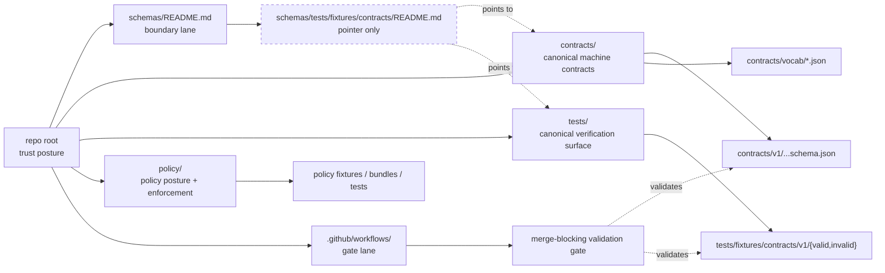

<!-- [KFM_META_BLOCK_V2]
doc_id: kfm://doc/<TODO: verify-uuid>
title: Contract Fixtures — Schema-Side Boundary Guide
type: standard
version: v1
status: draft
owners: @bartytime4life
created: 2026-03-22
updated: 2026-03-24
policy_label: <TODO: verify policy label>
related: [../../../../README.md, ../../../README.md, ../../../../contracts/README.md, ../../../../tests/README.md, ../../../../policy/README.md, ../../../../.github/workflows/README.md]
tags: [kfm, schemas, tests, fixtures, contracts]
notes: [Current public main now materializes this README path; doc_id and policy_label still need repo-backed values; keep this surface non-authoritative and synchronized with sibling schema-lane docs.]
[/KFM_META_BLOCK_V2] -->

# Contract Fixtures — Schema-Side Boundary Guide

Non-authoritative boundary README for schema-side contract-fixture notes, while KFM keeps canonical machine contracts in `/contracts` and canonical verification fixtures in `/tests`.

> **Status:** experimental  
> **Owners:** `@bartytime4life`  
> **Path:** `schemas/tests/fixtures/contracts/README.md`  
>       
> **Quick jumps:** [Scope](#scope) · [Repo fit](#repo-fit) · [Accepted inputs](#accepted-inputs) · [Exclusions](#exclusions) · [Directory tree](#directory-tree) · [Quickstart](#quickstart) · [Usage](#usage) · [Diagram](#diagram) · [Authority matrix](#authority-matrix) · [Task list](#task-list) · [FAQ](#faq) · [Appendix](#appendix)

> [!IMPORTANT]
> Current public `main` already includes `schemas/tests/fixtures/contracts/README.md`.
> That does **not** change the authority rule: this surface should remain a **pointer/boundary README**, not a second authoritative schema home and not a second canonical fixture home.

> [!NOTE]
> This file should stay synchronized with `../../../README.md`.
> If sibling docs still describe the `schemas/` lane as effectively README-only, update that wording in the same PR so the repo stops mixing older snapshot language with the live boundary path.

## Scope

This README is intentionally narrow.

Its job is to hold one line clearly: **schema-side documentation is not the same thing as canonical machine contracts, and it is not the same thing as canonical fixture ownership**. In current public `main`, this file already exists as a boundary note. Its continued role should be to point contributors toward the right homes, record transition rules, and prevent drift between sibling surfaces.

In practice, this README should help with four things:

- keeping `schemas/` side notes from silently becoming a second contract registry
- keeping fixture ownership anchored to `tests/`
- keeping authority language synchronized with sibling docs
- making schema-home and fixture-home decisions easy to audit in Git review

[Back to top](#contract-fixtures--schema-side-boundary-guide)

## Repo fit

**Repo fit:** path `schemas/tests/fixtures/contracts/README.md`  
**Upstream:** [`../../../README.md`](../../../README.md)  
**Canonical contracts:** [`../../../../contracts/README.md`](../../../../contracts/README.md)  
**Canonical tests:** [`../../../../tests/README.md`](../../../../tests/README.md)  
**Policy posture:** [`../../../../policy/README.md`](../../../../policy/README.md)  
**Workflow gate lane:** [`../../../../.github/workflows/README.md`](../../../../.github/workflows/README.md)  
**Root posture:** [`../../../../README.md`](../../../../README.md)

| Surface | Role in repo | Status for this doc |
|---|---|---|
| `../../../README.md` | Schema-lane boundary guidance | Upstream sibling |
| `../../../../contracts/README.md` | Strongest working signal for machine-readable contract ownership | Canonical reference |
| `../../../../tests/README.md` | Verification, negative-path proof, drill burden, and fixture-facing test organization | Canonical reference |
| `../../../../policy/README.md` | Deny-by-default policy posture, reasons/obligations, finite outcomes | Canonical reference |
| `../../../../.github/workflows/README.md` | Workflow gate lane and CI documentation boundary | Downstream gate lane |
| `schemas/tests/fixtures/contracts/README.md` | Live boundary/pointer README on current public `main` | **This file** |

### Reading rule

When these surfaces disagree, prefer this order unless a later ADR says otherwise:

1. root trust posture and repo-grounded evidence
2. `contracts/` for machine-readable contract law
3. `tests/` for fixture burden and negative-path proof
4. `policy/` for enforcement posture
5. `schemas/` for boundary notes and pointer-style guidance

## Accepted inputs

Only the following belong here:

| Input class | Belongs here? | Notes |
|---|---|---|
| Boundary notes about where contract fixtures belong | Yes | Keep concise and directional |
| Pointer-style migration notes between `schemas/`, `contracts/`, and `tests/` | Yes | Especially useful during authority cleanup |
| Non-authoritative examples that explain path relationships | Yes, sparingly | Label them clearly as non-canonical |
| README-only maintenance notes for this local path | Yes | This is the primary intended content |
| Canonical schema-home / fixture-home decision references | Yes | Link to the ADR or sibling authoritative README |

### Minimum bar

Anything added here should:

- state whether it is **CONFIRMED**, **PROPOSED**, or **NEEDS VERIFICATION**
- point to the canonical sibling surface instead of restating it at length
- avoid creating a new source of machine-readable truth
- stay lightweight enough to become a stable pointer if the repo later narrows `schemas/` further

## Exclusions

This path is **not** the place for authoritative assets.

| Does **not** belong here | Put it here instead |
|---|---|
| Authoritative `*.schema.json` contract families | `../../../../contracts/` |
| Canonical valid / invalid contract fixture packs | `../../../../tests/` |
| Policy bundles, policy fixtures, policy tests | `../../../../policy/` |
| Workflow YAML or merge-gate wiring | `../../../../.github/workflows/` |
| Validator commands and runtime tooling | `../../../../tools/` or `../../../../scripts/` |
| Runtime emitters, resolvers, DTOs, or service code | app/package code surfaces |
| Large mirrored contract examples that can drift from canonical files | canonical contract / fixture homes |

> [!WARNING]
> Do **not** land new authoritative schema families here “temporarily.”
> In KFM, temporary duplicate authority becomes long-lived ambiguity.

[Back to top](#contract-fixtures--schema-side-boundary-guide)

## Directory tree

### Current confirmed neighboring surfaces on public `main`

```text
repo-root/
├── schemas/
│   ├── README.md
│   └── tests/
│       └── fixtures/
│           └── contracts/
│               └── README.md
├── contracts/
│   └── README.md
├── tests/
│   ├── README.md
│   ├── accessibility/
│   ├── contracts/
│   ├── e2e/
│   │   ├── README.md
│   │   ├── correction/
│   │   ├── release_assembly/
│   │   └── runtime_proof/
│   ├── integration/
│   ├── policy/
│   ├── reproducibility/
│   └── unit/
├── policy/
│   └── README.md
└── .github/
    └── workflows/
        └── README.md
```

### Current live role of this path (`CONFIRMED`)

```text
schemas/
└── tests/
    └── fixtures/
        └── contracts/
            └── README.md   # boundary / pointer note only
```

### Recommended canonical fixture shape (`PROPOSED`, not yet asserted as mounted reality)

```text
tests/
└── fixtures/
    └── contracts/
        └── v1/
            ├── valid/
            └── invalid/
```

### Recommended canonical schema shape (`PROPOSED`, aligned to sibling docs)

```text
contracts/
├── README.md
├── v1/
│   ├── common/
│   │   └── header_profile.schema.json
│   ├── policy/
│   │   └── decision_envelope.schema.json
│   ├── evidence/
│   │   └── evidence_bundle.schema.json
│   ├── runtime/
│   │   └── runtime_response_envelope.schema.json
│   ├── correction/
│   │   └── correction_notice.schema.json
│   ├── release/
│   │   └── release_manifest.schema.json
│   ├── source/
│   │   └── source_descriptor.schema.json
│   └── data/
│       └── dataset_version.schema.json
└── vocab/
```

## Quickstart

Use this path only after you answer the boundary question first.

```bash
# 1) Inspect the neighboring authority surfaces
find schemas contracts tests policy .github/workflows -maxdepth 4 -type f 2>/dev/null | sort

# 2) Inspect the live boundary path on the checked-out branch
find schemas/tests/fixtures/contracts -maxdepth 2 -type f 2>/dev/null | sort

# 3) Inspect current contract-facing test families
find tests/contracts tests/e2e tests/policy -maxdepth 3 -type d 2>/dev/null | sort
```

### Safe startup sequence

1. Confirm whether an ADR or equivalent repo decision has already settled the **authoritative schema home**.
2. Confirm whether the branch in hand already materializes a fixture home under `tests/`.
3. If edits here are only for documentation clarity, keep them **README-only**.
4. Update sibling docs in the same PR so contributors never see competing authority.
5. Do not describe workflow gates here as live unless the checked-in workflow files prove they exist.

## Usage

### When to edit this file

Edit this README when one of these changes:

- the authoritative schema home is clarified, changed, or deprecated
- the canonical fixture home is clarified, changed, or deprecated
- validator path or gate naming changes in a way contributors must know
- `schemas/` is narrowed to a pointer-only role
- this path is being removed and needs an archival redirect note

### Contributor rules

- Prefer **one authoritative schema home**.
- Prefer **one canonical fixture home**.
- Prefer **one validator path**.
- Keep **one clearly documented sibling pointer** instead of parallel contract law.
- Treat `schemas/` notes as navigational help, not as permission to duplicate trust-bearing artifacts.

### Practical authoring rule

If you are about to place a new file under this path, ask:

> Is this file pointing to canonical truth, or is it trying to become canonical truth?

If the second answer is even partly true, move the file elsewhere.

## Diagram



## Authority matrix

| Surface | What it should own | What it should not absorb |
|---|---|---|
| `contracts/` | Machine-readable contract families, shared header grammar, authoritative vocab registries where declared | Runtime code, policy bundles, duplicate fixture homes |
| `tests/` | Fixtures, negative-path tests, correction drills, contract-facing proof burden | Canonical contract ownership |
| `policy/` | Executable policy, policy fixtures, reason/obligation enforcement behavior | Duplicate schema ownership |
| `.github/workflows/` | Merge gates, verification orchestration, required check behavior | Hidden contract law, hidden policy logic |
| `schemas/tests/fixtures/contracts/` | Pointer notes, migration notes, sibling references | Authoritative schemas, valid/invalid packs, workflow files, policy bundles |

### Current posture snapshot

| Statement | Posture |
|---|---|
| `schemas/` is a visible repo lane | CONFIRMED |
| `schemas/tests/fixtures/contracts/README.md` exists on current public `main` | CONFIRMED |
| `contracts/` is the stronger working signal for machine-readable contract authority | CONFIRMED / INFERRED from sibling docs |
| `tests/` is the verification surface and carries negative-path burden | CONFIRMED |
| Exact mounted fixture pack under `tests/fixtures/contracts/` exists today | NEEDS VERIFICATION |
| Active merge-blocking workflow YAMLs are checked in under `.github/workflows/` | NEEDS VERIFICATION |
| This path should remain non-authoritative | PROPOSED |

## Task list

- [ ] Retire placeholder `doc_id` and `policy_label` values in the KFM meta block.
- [ ] Keep this file README-only unless an ADR explicitly expands its role.
- [ ] Verify sibling links after any tree move.
- [ ] Synchronize `../../../README.md` if it still carries older README-only schema-lane wording.
- [ ] Keep `contracts/`, `schemas/`, `tests/`, `policy/`, and workflow docs coherent in the same PR.
- [ ] Do **not** add `*.schema.json` files here.
- [ ] Do **not** add canonical valid / invalid fixture packs here.
- [ ] Do **not** describe merge gates here as real unless checked-in workflow files prove them.
- [ ] If authority is resolved permanently, narrow this file further or delete it and leave a redirect note in the parent lane.

### Definition of done

This README is done when:

1. it clearly prevents second-authority drift
2. it points contributors to the canonical homes fast
3. it does not overclaim mounted implementation
4. it stays synchronized with sibling README surfaces
5. a reviewer can tell, in one screen, what belongs here and what does not

[Back to top](#contract-fixtures--schema-side-boundary-guide)

## FAQ

### Why keep a README under `schemas/...` at all?

To preserve navigational clarity during a transition or boundary-cleanup phase. This is useful when a visible public lane exists, but machine-readable authority should live elsewhere.

### Does this make `schemas/` the canonical home for trust-bearing contract files?

No. This file is written specifically to avoid that interpretation.

### Can valid / invalid fixtures live here?

Not as canonical fixtures. Keep canonical fixture packs in the test surface.

### Can generated outputs live here?

Only if they are explicitly labeled **non-authoritative**, reproducible from canonical inputs, and clearly subordinate to the canonical source path.

### What if the repo later chooses a different schema-home rule?

Update the ADR and the sibling README surfaces together. Do not let this file drift into “historical truth” that contradicts the live repo.

## Appendix

<details>
<summary><strong>Evidence boundary and migration notes</strong></summary>

### Current working interpretation

This revision assumes the following until repo-backed evidence says otherwise:

- current public `main` already materializes this pointer README under `schemas/tests/fixtures/contracts/`
- `contracts/` is the stronger working signal for machine-readable contract publication
- `tests/` is the stronger working signal for fixture burden and negative-path proof
- `policy/` owns executable policy behavior, not just prose
- workflow-gate reality must be proven by checked-in YAML, not by aspirational README wording

### Placeholder fields to retire before merge

- `doc_id`
- `policy_label`

### Review prompts

- Does this file accidentally create a second truth surface?
- Do the sibling links still resolve correctly?
- Does any statement here outrun current branch evidence?
- Should this file be narrowed further into a one-paragraph pointer after schema-home ADR closure?

</details>

---

[Back to top](#contract-fixtures--schema-side-boundary-guide)
