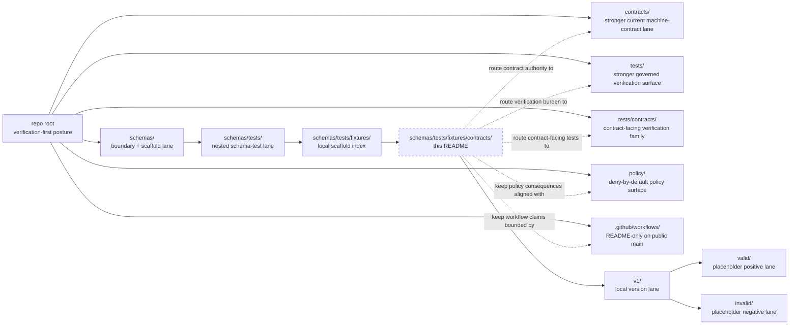

<!-- [KFM_META_BLOCK_V2]
doc_id: kfm://doc/<TODO: verify-uuid>
title: Contract Fixtures — Schema-Side Boundary Guide
type: standard
version: v1
status: draft
owners: @bartytime4life
created: 2026-03-22
updated: 2026-04-03
policy_label: <TODO: verify policy label>
related: [../../../../README.md, ../../../README.md, ../../README.md, ../README.md, ./v1/README.md, ../../../../contracts/README.md, ../../../../tests/README.md, ../../../../tests/contracts/README.md, ../../../../policy/README.md, ../../../../docs/standards/README.md, ../../../../.github/workflows/README.md]
tags: [kfm, schemas, tests, fixtures, contracts]
notes: [doc_id and policy_label still need repo-backed values; current public main now exposes a local v1 scaffold with valid/invalid child lanes under this path; schema-home and canonical fixture-home authority remain unresolved and must stay explicit.]
[/KFM_META_BLOCK_V2] -->

# Contract Fixtures — Schema-Side Boundary Guide

Boundary-and-inventory README for the live `schemas/tests/fixtures/contracts/` scaffold, keeping local visibility clear without quietly declaring canonical contract or fixture authority.

> **Status:** experimental  
> **Owners:** `@bartytime4life`  
> **Path:** `schemas/tests/fixtures/contracts/README.md`  
>        
> **Repo fit:** path `schemas/tests/fixtures/contracts/README.md` · parent scaffold index [`../README.md`](../README.md) · parent schema-test lane [`../../README.md`](../../README.md) · parent schema boundary [`../../../README.md`](../../../README.md) · stronger contract lane [`../../../../contracts/README.md`](../../../../contracts/README.md) · stronger verification lanes [`../../../../tests/README.md`](../../../../tests/README.md) and [`../../../../tests/contracts/README.md`](../../../../tests/contracts/README.md) · policy lane [`../../../../policy/README.md`](../../../../policy/README.md) · standards routing [`../../../../docs/standards/README.md`](../../../../docs/standards/README.md) · workflow gate lane [`../../../../.github/workflows/README.md`](../../../../.github/workflows/README.md)  
> **Quick jumps:** [Scope](#scope) · [Repo fit](#repo-fit) · [Accepted inputs](#accepted-inputs) · [Exclusions](#exclusions) · [Current verified snapshot](#current-verified-snapshot) · [Directory tree](#directory-tree) · [Quickstart](#quickstart) · [Usage](#usage) · [Diagram](#diagram) · [Authority matrix](#authority-matrix) · [Task list](#task-list--definition-of-done) · [FAQ](#faq) · [Appendix](#appendix)

> [!IMPORTANT]
> Current public `main` now shows this path as more than a single pointer README: the local subtree visibly includes `./v1/README.md` plus `./v1/valid/README.md` and `./v1/invalid/README.md`.
> That is **real local scaffold inventory**, not proof that this path has become the canonical fixture home.

> [!WARNING]
> `contracts/README.md` still presents `/contracts` as the stronger current machine-contract lane, `tests/README.md` still presents `/tests` as the stronger governed verification surface, and `.github/workflows/README.md` still records `.github/workflows/` as README-only on current public `main`.
> Do not let branch-visible scaffold files silently outrank those stronger neighboring surfaces.

> [!NOTE]
> The `schemas/**` family is at mixed freshness. Parent and sibling READMEs now acknowledge live child scaffolds in some places and older README-only inventory language in others.
> Keep this file synchronized with `../../README.md`, `../README.md`, and `../../../README.md` in the same PR whenever subtree reality changes.

## Scope

This README is intentionally narrow.

Its job is to make one boundary legible: **schema-side fixture scaffolds are not automatically the same thing as canonical contract law, and they are not automatically the same thing as the repo’s governed fixture home**.

At current public-branch depth, this file should help reviewers answer four questions quickly:

1. What is actually visible under `schemas/tests/fixtures/contracts/` right now?
2. Which changes are safe here without creating second-authority drift?
3. Which stronger neighboring surfaces still own machine-contract, policy, and verification law?
4. What still needs explicit verification before anyone treats this subtree as canonical?

### Truth labels used here

| Label | Meaning in this README |
|---|---|
| **CONFIRMED** | Directly visible on current public `main` or directly stated in the checked-in repo docs inspected for this revision |
| **INFERRED** | Conservative interpretation of confirmed repo structure and adjacent README language |
| **PROPOSED** | Repo-native next shape or rule that fits KFM doctrine but is not yet proven as mounted implementation law |
| **UNKNOWN / NEEDS VERIFICATION** | Not directly verified strongly enough to present as settled current reality |

[Back to top](#contract-fixtures--schema-side-boundary-guide)

## Repo fit

**Path:** `schemas/tests/fixtures/contracts/README.md`  
**Role:** local boundary-and-inventory README for the contract-flavored scaffold inside `schemas/tests/fixtures/`

| Direction | Path | Why it matters here |
|---|---|---|
| Parent | [`../README.md`](../README.md) | Documents the immediate `schemas/tests/fixtures/` scaffold and keeps this subtree from silently becoming canonical |
| Parent | [`../../README.md`](../../README.md) | Records the wider `schemas/tests/` lane and explicitly notes the visible `fixtures/contracts/v1/{valid,invalid}` scaffold |
| Parent | [`../../../README.md`](../../../README.md) | Keeps the broader `schemas/` boundary and schema-home caution visible |
| Stronger lateral surface | [`../../../../contracts/README.md`](../../../../contracts/README.md) | Stronger current machine-contract lane |
| Stronger lateral surface | [`../../../../tests/README.md`](../../../../tests/README.md) | Stronger current governed verification surface |
| Stronger lateral surface | [`../../../../tests/contracts/README.md`](../../../../tests/contracts/README.md) | Contract-facing verification family inside `/tests` |
| Lateral surface | [`../../../../policy/README.md`](../../../../policy/README.md) | Deny-by-default posture, reasons, obligations, and policy-owned behavior |
| Lateral surface | [`../../../../docs/standards/README.md`](../../../../docs/standards/README.md) | Standards routing and profile placement |
| Lateral surface | [`../../../../.github/workflows/README.md`](../../../../.github/workflows/README.md) | Workflow and merge-gate lane; still README-only on public `main` |
| Downstream | [`./v1/README.md`](./v1/README.md) | Current versioned local scaffold |
| Downstream | [`./v1/valid/README.md`](./v1/valid/README.md) | Placeholder positive lane |
| Downstream | [`./v1/invalid/README.md`](./v1/invalid/README.md) | Placeholder negative lane |

### Reading rule

When these surfaces disagree, prefer this order unless a later ADR or equivalent repo decision says otherwise:

1. root trust posture and repo-grounded evidence
2. `contracts/` for stronger current machine-contract guidance
3. `tests/` for stronger governed verification burden
4. `policy/` for executable policy posture and consequences
5. `schemas/` child lanes for local scaffold inventory, migration notes, and boundary control

### Path reconciliation note

This subtree is no longer just hypothetical.

What remains unresolved is **authority**, not **visibility**. This README should therefore describe the live local tree honestly **without** implying that the repo has already settled canonical schema-home or canonical fixture-home law.

## Accepted inputs

Use this path for material that explains or safely stages the local scaffold **without** creating a second canonical truth system.

### Belongs here

| Accept here | Why it belongs |
|---|---|
| Path-local `README.md` files | They explain what the visible subtree means and what it does not mean |
| Versioned `valid/` and `invalid/` folders that are explicitly scaffold or derived mirrors | They can keep local shape legible without silently becoming canonical |
| Migration notes between `schemas/`, `contracts/`, and `tests/` | They reduce boundary drift during tree changes |
| Cross-links to stronger contract, test, policy, and workflow docs | They make authority visible at the point of confusion |
| Tiny, clearly labeled illustrative examples | They can clarify structure when marked **non-authoritative** |
| Notes about local version lanes such as `v1/` | They help reviewers distinguish visible inventory from settled law |

### Minimum bar

Anything added here should:

- state whether it is **CONFIRMED**, **INFERRED**, **PROPOSED**, or **NEEDS VERIFICATION**
- say whether it is **scaffold**, **illustrative**, **derived**, or **canonical**
- route readers back to the stronger sibling surface instead of restating it at length
- avoid creating a new primary machine-truth surface by quiet accretion
- stay small enough that a reviewer can scan the whole local role in one pass

## Exclusions

This path is **not** the default home for authoritative assets.

| Does **not** belong here by default | Put it here instead |
|---|---|
| Canonical `*.schema.json` contract families | `../../../../contracts/` or the explicitly declared canonical schema home once resolved |
| Broad executable verification suites or harnesses | `../../../../tests/` and especially `../../../../tests/contracts/` |
| Policy bundles, policy fixtures, policy tests, reason codes, or obligation registries | `../../../../policy/` |
| Workflow YAML, merge gates, required-check definitions, or runner logic | `../../../../.github/workflows/` |
| Runtime emitters, adapters, DTOs, or service code | app/package/runtime code surfaces |
| Large mirrored fixture packs presented as primary truth | the explicitly declared canonical fixture home |
| Assertions that this subtree is already singularly canonical | an ADR or equivalent authority decision, then synchronized README updates |

> [!CAUTION]
> Branch-visible machine files or fixture folders can still be the wrong authority surface.
> In KFM, duplicate authority is usually worse than visible incompleteness.

[Back to top](#contract-fixtures--schema-side-boundary-guide)

## Current verified snapshot

| Item | Status | Why it matters |
|---|---|---|
| `schemas/tests/fixtures/contracts/README.md` exists on current public `main` | **CONFIRMED** | This file is not hypothetical |
| `schemas/tests/fixtures/contracts/v1/README.md` exists | **CONFIRMED** | The subtree now has a versioned local scaffold lane |
| `schemas/tests/fixtures/contracts/v1/valid/README.md` and `.../invalid/README.md` exist | **CONFIRMED** | Positive/negative local scaffold lanes are visible, even if minimal |
| `schemas/tests/README.md` explicitly describes `fixtures/contracts/v1/{valid,invalid}` as scaffold-only | **CONFIRMED** | Parent lane now recognizes the visible local subtree |
| `contracts/README.md` still describes `/contracts` as the stronger current machine-contract lane | **CONFIRMED / INFERRED** | Local scaffold must not silently outrank the stronger contract surface |
| `tests/README.md` still describes `/tests` as the stronger governed verification surface | **CONFIRMED** | Verification burden still routes more strongly through `/tests` |
| `tests/contracts/` exists on public `main` but is README-only in the current public tree | **CONFIRMED** | Contract-facing verification is visible as a family, but executable depth is not proven from current public tree alone |
| `.github/workflows/` contains `README.md` only on current public `main` | **CONFIRMED** | Do not claim active checked-in workflow YAMLs from this README |
| `tests/fixtures/contracts/` as a public-main path | **NEEDS VERIFICATION** | This inspection did not directly verify that root-level fixture path |
| This subtree is the singular canonical fixture home | **UNKNOWN / NEEDS VERIFICATION** | Current public docs do not yet settle that law |

[Back to top](#contract-fixtures--schema-side-boundary-guide)

## Directory tree

### Current confirmed visible tree

```text
repo-root/
├── schemas/
│   ├── README.md
│   ├── contracts/
│   │   ├── README.md
│   │   ├── v1/
│   │   └── vocab/
│   ├── standards/
│   │   └── README.md
│   ├── tests/
│   │   ├── README.md
│   │   └── fixtures/
│   │       ├── README.md
│   │       └── contracts/
│   │           ├── README.md
│   │           └── v1/
│   │               ├── README.md
│   │               ├── invalid/
│   │               │   └── README.md
│   │               └── valid/
│   │                   └── README.md
│   └── workflows/
│       └── README.md
├── contracts/
│   └── README.md
├── tests/
│   ├── README.md
│   ├── contracts/
│   │   └── README.md
│   ├── accessibility/
│   ├── e2e/
│   ├── integration/
│   ├── policy/
│   ├── reproducibility/
│   └── unit/
├── policy/
│   └── README.md
└── .github/
    └── workflows/
        └── README.md
```

### Current live role of this local subtree

```text
schemas/
└── tests/
    └── fixtures/
        └── contracts/
            ├── README.md        # local boundary + inventory README
            └── v1/
                ├── README.md    # scaffold version lane
                ├── valid/
                │   └── README.md
                └── invalid/
                    └── README.md
```

### Potential canonical fixture shape after authority resolution (`PROPOSED`)

```text
tests/
└── fixtures/
    └── contracts/
        └── v1/
            ├── valid/
            └── invalid/
```

That shape remains a **candidate**, not a current public-main fact proven by this revision.

## Quickstart

Inspect first. Reclassify later.

```bash
# 1) Inspect the immediate local scaffold and child lanes
find schemas/tests/fixtures/contracts -maxdepth 4 -type f 2>/dev/null | sort

# 2) Inspect the stronger neighboring surfaces before changing authority language
find contracts tests tests/contracts policy .github/workflows -maxdepth 3 -type f 2>/dev/null | sort

# 3) Re-open the parent schema-test lane and fixture scaffold docs together
sed -n '1,220p' schemas/tests/README.md schemas/tests/fixtures/README.md schemas/tests/fixtures/contracts/README.md
```

### Safe startup sequence

1. Confirm whether an ADR or equivalent repo decision has already settled canonical schema-home or canonical fixture-home law.
2. Confirm whether the local `v1/valid/invalid` paths are meant to stay **scaffold-only**, become **derived mirrors**, or eventually be promoted.
3. Keep edits here README-first unless the owning authority decision is explicitly documented.
4. Update `../README.md`, `../../README.md`, and `../../../README.md` in the same PR if local inventory or boundary wording changes.
5. Do not describe workflow gates here as live unless the checked-in workflow files prove them.

## Usage

### When to edit this file

Edit this README when one of these changes:

- the local `v1/` scaffold changes shape
- `valid/` or `invalid/` gains or loses local examples
- the repo explicitly settles schema-home or fixture-home authority
- sibling docs change the contract, policy, or verification routing that this file depends on
- this subtree is narrowed, promoted, mirrored, or retired

### Contributor rules

- Prefer **one explicit authority story**.
- Prefer **one clearly named canonical fixture home**.
- Treat branch-visible local scaffolds as **inventory**, not automatic law.
- Keep the stronger sibling links easy to find.
- If a file here starts to behave like canonical truth, stop and move the decision upstream.

### Practical authoring test

Before adding a file under this path, ask:

> Is this file here to explain the local scaffold, or is it trying to become the repo’s primary contract or fixture record?

If the second answer is even partly true, this is probably the wrong directory.

[Back to top](#contract-fixtures--schema-side-boundary-guide)

## Diagram



## Authority matrix

| Surface | What it should own | What it should not silently absorb |
|---|---|---|
| `contracts/` | Stronger current machine-contract guidance and human-readable contract routing | Verification harnesses, workflow wiring, second policy system |
| `tests/` | Stronger governed verification burden across proof objects, negative paths, and release/correction drills | Canonical contract law by itself |
| `tests/contracts/` | Contract-facing verification family inside `/tests` | Hidden schema-home decisions or workflow certainty not backed by the current tree |
| `policy/` | Executable policy posture, reasons, obligations, and policy-owned behavior | Duplicate schema authority |
| `.github/workflows/` | Workflow documentation and, when present, checked-in automation | Silent contract law or unverified workflow claims |
| `schemas/tests/fixtures/` | Local scaffold documentation and subtree routing | Repo-wide canonical fixture ownership |
| `schemas/tests/fixtures/contracts/` | Local boundary, inventory, and migration guidance for this subtree | Automatic canonical status merely because local `v1/valid/invalid` paths exist |
| `schemas/tests/fixtures/contracts/v1/{valid,invalid}` | Local versioned scaffold lanes | Unlabeled canonical example packs |

### Current posture snapshot

| Statement | Posture |
|---|---|
| `schemas/tests/fixtures/contracts/README.md` exists on current public `main` | **CONFIRMED** |
| A local `v1/` scaffold is visible under this path | **CONFIRMED** |
| `valid/` and `invalid/` child lanes are visible under that local `v1/` scaffold | **CONFIRMED** |
| `schemas/tests/README.md` already describes this nested subtree as scaffold-only | **CONFIRMED** |
| `contracts/` remains the stronger current machine-contract surface | **CONFIRMED / INFERRED** |
| `tests/` remains the stronger current governed verification surface | **CONFIRMED** |
| `tests/contracts/` is visible as a family on public `main` | **CONFIRMED** |
| Checked-in workflow YAMLs are visible under `.github/workflows/` on public `main` | **NOT CONFIRMED** |
| This subtree is already the singular canonical fixture home | **UNKNOWN / NEEDS VERIFICATION** |

## Task list & definition of done

- [ ] Replace placeholder `doc_id` and `policy_label` values in the KFM meta block.
- [ ] Synchronize this file with `../README.md`, `../../README.md`, and `../../../README.md` so the `schemas/**` inventory story stops drifting.
- [ ] Decide whether local `v1/valid/invalid` is **scaffold-only**, **derived mirror**, or a future promotion candidate, then document that explicitly.
- [ ] Keep `contracts/`, `tests/`, `tests/contracts/`, `policy/`, and workflow docs coherent in the same change stream.
- [ ] Do **not** add canonical `*.schema.json` families here unless schema-home authority is explicitly changed and documented.
- [ ] Do **not** describe merge gates here as live unless checked-in workflow files prove them.
- [ ] If a root-level canonical fixture home is later verified or adopted, narrow this README further into a pointer or migration note.

### Definition of done

This README is done when:

1. it records the live local scaffold truthfully
2. it does not let scaffold visibility masquerade as canonical authority
3. it routes contributors to stronger sibling surfaces fast
4. it keeps current-tree facts, inferences, and proposed next shapes visibly separate
5. a reviewer can tell in one screen what belongs here, what does not, and what still needs verification

[Back to top](#contract-fixtures--schema-side-boundary-guide)

## FAQ

### Why keep this README if stronger lanes already exist elsewhere?

Because the subtree now exists visibly on public `main`. Once a local scaffold is real, leaving it undocumented invites silent drift.

### Do `v1/valid/invalid` make this path canonical?

No. They prove local scaffold visibility, not authority.

### Where should executable contract validation live today?

Route that burden more strongly through `../../../../tests/` and especially `../../../../tests/contracts/`, while keeping machine-contract guidance aligned with `../../../../contracts/`.

### Can this lane hold illustrative examples?

Yes, but only when they are explicitly labeled as scaffold, illustrative, generated, or otherwise non-authoritative.

### What if the repo later makes this subtree canonical?

Document that decision explicitly, then synchronize this README with the parent `schemas/**` docs, the stronger sibling surfaces, and any ADR or policy decision that changes authority.

## Appendix

<details>
<summary><strong>Evidence boundary, sync pressure, and review prompts</strong></summary>

### Current working interpretation

This revision assumes the following until repo-backed evidence says otherwise:

- current public `main` materially exposes this subtree, including `v1/valid/invalid`
- the local subtree is still best read as **scaffold inventory plus boundary guidance**
- `contracts/` remains the stronger current machine-contract lane
- `tests/` remains the stronger current governed verification lane
- `tests/contracts/` is the more natural public-facing contract-test family than this schema-side scaffold
- workflow-gate reality must still be proven by checked-in YAML, not by historical or aspirational README language

### Placeholder fields to retire before merge

- `doc_id`
- `policy_label`

### Sync checklist for the same PR

- `../../../README.md`
- `../../README.md`
- `../README.md`
- `../../../../contracts/README.md`
- `../../../../tests/README.md`
- `../../../../tests/contracts/README.md`
- `../../../../.github/workflows/README.md`

### Review prompts

- Does this file describe live local inventory accurately?
- Does any sentence here turn local scaffold into silent canonical authority?
- Are stronger sibling links still correct after the change?
- Are current-tree facts, inferences, and proposed next shapes visibly separated?
- Should this file be narrowed further if authority is later settled elsewhere?

</details>

---

[Back to top](#contract-fixtures--schema-side-boundary-guide)
