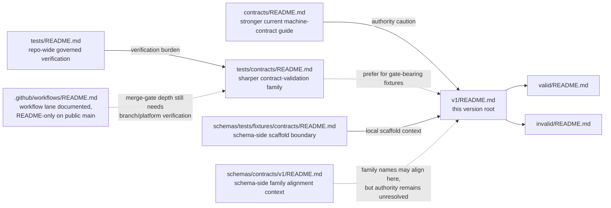

<!-- [KFM_META_BLOCK_V2]
doc_id: kfm://doc/<TODO: verify uuid>
title: Contract Fixtures v1
type: standard
version: v1
status: draft
owners: @bartytime4life
created: <TODO: verify YYYY-MM-DD>
updated: <TODO: verify YYYY-MM-DD>
policy_label: <TODO: verify policy label>
related: [../README.md, ./valid/README.md, ./invalid/README.md, ../../README.md, ../../../README.md, ../../../../README.md, ../../../../contracts/README.md, ../../../../contracts/v1/README.md, ../../../../../contracts/README.md, ../../../../../tests/README.md, ../../../../../tests/contracts/README.md, ../../../../../policy/README.md, ../../../../../docs/standards/README.md, ../../../../../.github/workflows/README.md]
tags: [kfm, schemas, tests, fixtures, contracts, v1]
notes: [Current public main verifies a versioned scaffold with local README-only `valid/` and `invalid/` leaves; canonical fixture-home and schema-home authority remain unresolved; doc_id, created, updated, and policy_label still need repo-backed confirmation.]
[/KFM_META_BLOCK_V2] -->

# Contract Fixtures v1

Versioned schema-side boundary guide for local `valid/` and `invalid/` contract example scaffolds under `schemas/tests/fixtures/contracts/`.

> [!NOTE]
> The KFM Meta Block V2 above uses reviewable placeholders for `doc_id`, `created`, `updated`, and `policy_label` because those values were not directly confirmed from the current public repo surfaces inspected for this revision.

> **Status:** experimental  
> **Doc status:** draft  
> **Owners:** `@bartytime4life` *(current public `.github/CODEOWNERS` global fallback; no narrower `/schemas/` or `/schemas/tests/**` rule was directly verified)*  
> **Path:** `schemas/tests/fixtures/contracts/v1/README.md`  
> 
> 
> 
> 
> 
>   
> **Repo fit:** path `schemas/tests/fixtures/contracts/v1/README.md` · local parent [`../README.md`](../README.md) · local leaves [`./valid/README.md`](./valid/README.md), [`./invalid/README.md`](./invalid/README.md) · schema-side boundary chain [`../../README.md`](../../README.md), [`../../../README.md`](../../../README.md), [`../../../../README.md`](../../../../README.md) · schema-side contract alignment lane [`../../../../contracts/README.md`](../../../../contracts/README.md), [`../../../../contracts/v1/README.md`](../../../../contracts/v1/README.md) · stronger current repo surfaces [`../../../../../contracts/README.md`](../../../../../contracts/README.md), [`../../../../../tests/README.md`](../../../../../tests/README.md), [`../../../../../tests/contracts/README.md`](../../../../../tests/contracts/README.md), [`../../../../../policy/README.md`](../../../../../policy/README.md), [`../../../../../docs/standards/README.md`](../../../../../docs/standards/README.md), [`../../../../../.github/workflows/README.md`](../../../../../.github/workflows/README.md)  
> **Quick jumps:** [Scope](#scope) · [Repo fit](#repo-fit) · [Accepted inputs](#accepted-inputs) · [Exclusions](#exclusions) · [Current verified snapshot](#current-verified-snapshot) · [Directory tree](#directory-tree) · [Quickstart](#quickstart) · [Usage](#usage) · [Diagram](#diagram) · [Alignment](#version-local-family-alignment) · [Task list / definition of done](#task-list--definition-of-done) · [FAQ](#faq) · [Appendix](#appendix)

> [!IMPORTANT]
> Current public `main` verifies this `v1/` subtree as a real local scaffold with `README.md`, `valid/README.md`, and `invalid/README.md`.
> That is useful inventory, but it is **not** proof that this path is the repo’s canonical fixture home.

> [!WARNING]
> Stronger current public signals still point outward: root `contracts/` for machine-contract guidance, root `tests/` for governed verification burden, `tests/contracts/` for contract-facing validation, and `.github/workflows/` for future merge-gate automation.
> Until the repo resolves authority explicitly, this `v1/` lane should not become a second source of truth by inertia.

> [!NOTE]
> The visible schema-side contract version lane at `../../../../contracts/v1/` can help keep names aligned, but that subtree is still scaffold-heavy in current public docs.
> Use it as alignment context, not as proof that local fixtures here are already enforcement-grade.

## Scope

`schemas/tests/fixtures/contracts/v1/` is the version root for schema-side contract-fixture scaffolding.

Its job is not to quietly become the canonical runner-backed fixture inventory.
Its job is to make the version boundary explicit, keep local `valid/` and `invalid/` leaves understandable, and route contributors back to stronger neighboring surfaces when a change is really about contract law, executable validation, policy, or CI.

This README should help reviewers answer five questions quickly:

1. What is currently visible in this versioned subtree?
2. What can land here without creating second-authority drift?
3. Which stronger neighboring lanes still own contract, policy, and verification burden?
4. How should local `valid/` and `invalid/` leaves be interpreted while the subtree is scaffold-only?
5. What must be verified before anyone treats this lane as canonical?

### Truth labels used here

| Label | Meaning in this README |
|---|---|
| **CONFIRMED** | Directly visible on current public `main` or directly stated in the adjacent checked-in repo docs inspected for this revision |
| **INFERRED** | Conservative interpretation of visible repo structure and repeated neighboring README language |
| **PROPOSED** | Repo-native next shape or usage rule that fits KFM doctrine but is not yet proven as mounted implementation |
| **UNKNOWN / NEEDS VERIFICATION** | Not directly verified strongly enough to present as settled current repo law |

[Back to top](#contract-fixtures-v1)

## Repo fit

**Path:** `schemas/tests/fixtures/contracts/v1/README.md`  
**Role:** versioned boundary-and-inventory README for the schema-side contract-fixture scaffold under `schemas/tests/fixtures/contracts/`

| Dimension | Current reading |
|---|---|
| Immediate parent | [`../README.md`](../README.md) |
| Local leaves | [`./valid/README.md`](./valid/README.md) · [`./invalid/README.md`](./invalid/README.md) |
| Parent scaffold context | [`../../README.md`](../../README.md) · [`../../../README.md`](../../../README.md) · [`../../../../README.md`](../../../../README.md) |
| Schema-side contract alignment lane | [`../../../../contracts/README.md`](../../../../contracts/README.md) · [`../../../../contracts/v1/README.md`](../../../../contracts/v1/README.md) |
| Stronger current machine-contract guide | [`../../../../../contracts/README.md`](../../../../../contracts/README.md) |
| Stronger current verification guides | [`../../../../../tests/README.md`](../../../../../tests/README.md) · [`../../../../../tests/contracts/README.md`](../../../../../tests/contracts/README.md) |
| Policy and workflow neighbors | [`../../../../../policy/README.md`](../../../../../policy/README.md) · [`../../../../../.github/workflows/README.md`](../../../../../.github/workflows/README.md) |
| Current authority posture | **UNKNOWN / NEEDS VERIFICATION** — visible subtree, unresolved canonical fixture-home and schema-home law |
| Current maturity reading | **Local scaffold inventory exists**; **gate-bearing validation depth is not proven from public `main`** |

### Working interpretation

Use this versioned lane to keep the local scaffold reviewable and version-explicit.

Do **not** use it to silently declare that:

- schema-side fixtures are canonical
- root `tests/` no longer owns governed verification burden
- root `tests/contracts/` no longer owns the sharper contract-validation family
- root `contracts/` no longer carries the stronger human-readable machine-contract guidance

[Back to top](#contract-fixtures-v1)

## Accepted inputs

This version root should stay narrow and deliberate.

| Accepted here | Why it belongs here |
|---|---|
| This README | The version root already exists publicly and needs an explicit boundary contract |
| Version-local inventory notes | Keeps `v1/` visible as a real subtree instead of a silent stub |
| Version-local guidance for `valid/` and `invalid/` | Clarifies how local leaf directories should be read |
| Clearly marked **illustrative**, **generated**, or **mirror** examples | Acceptable only when they are explicitly non-authoritative and version-scoped |
| Mapping notes from local examples to visible schema-side families under `../../../../contracts/v1/` | Helps reviewers keep names aligned without overstating enforcement depth |
| Migration notes when authority changes | This path sits inside an unresolved authority boundary |

### Minimum bar for anything added here

- it is obviously **version-local**
- it states whether it is **authoritative**, **illustrative**, **mirror**, or **generated**
- it does not duplicate a canonical fixture pack already owned elsewhere
- it keeps links to stronger neighboring surfaces current
- it does not make local scaffold inventory look more enforcement-ready than the repo can presently prove
- it is public-safe and rights-safe

## Exclusions

| Do **not** place here by default | Put it here instead | Why |
|---|---|---|
| Canonical JSON Schema bodies | `../../../../contracts/v1/` or the root authoritative schema home once resolved | Prevents schema-home drift |
| Gate-bearing valid/invalid packs intended to drive real validators or merge gates | `../../../../../tests/contracts/` or the canonical shared fixture home once resolved | Keeps executable verification burden in the stronger test lane |
| Policy bundles, reason codes, obligation codes, reviewer-role registries | `../../../../../policy/` or the canonical vocab surface | Policy grammar should stay singular and executable |
| Workflow YAML, runner wiring, required-check claims | `../../../../../.github/workflows/` | Control-plane execution does not belong in this scaffold |
| Release manifests, proof packs, correction artifacts, runtime envelopes | Their owning contract, release, or runtime lanes | This directory is not a release or runtime artifact home |
| Sensitive, rights-unclear, or exact-location examples | Quarantine or steward-reviewed governed lanes | Convenience scaffolds are the wrong place for unresolved publication burden |
| A second “real” fixture inventory that mirrors root `tests/` without explicit repo law | Resolve authority first | Silent duplication is worse than visible incompleteness |

> [!CAUTION]
> The main failure mode here is not missing content.
> It is a tidy `v1/` scaffold that gradually turns into an unofficial second authority surface because nobody wrote the boundary down.

[Back to top](#contract-fixtures-v1)

## Current verified snapshot

| Surface | Status | Working meaning |
|---|---|---|
| `schemas/tests/fixtures/contracts/v1/README.md` | **CONFIRMED** present | Versioned scaffold root exists on current public `main` |
| `schemas/tests/fixtures/contracts/v1/valid/README.md` | **CONFIRMED** present | Positive leaf exists, but public-tree evidence still shows scaffold-only depth |
| `schemas/tests/fixtures/contracts/v1/invalid/README.md` | **CONFIRMED** present | Negative leaf exists, but public-tree evidence still shows scaffold-only depth |
| Non-README payload examples under this `v1/` path | **UNKNOWN / NEEDS VERIFICATION** from the inspected public docs | Current public README surfaces describe this subtree as scaffold-only |
| `schemas/tests/fixtures/contracts/README.md` | **CONFIRMED** substantive | Parent boundary doc already warns that local inventory does not settle canonical fixture authority |
| `tests/contracts/README.md` | **CONFIRMED** substantive | Stronger current contract-facing verification family at repo root |
| `tests/README.md` | **CONFIRMED** substantive | Stronger repo-wide governed verification surface |
| `contracts/README.md` | **CONFIRMED** substantive | Stronger current human-readable machine-contract lane |
| `.github/workflows/README.md` | **CONFIRMED** substantive | Workflow lane is documented, but public `main` is still README-only there |
| `../../../../contracts/v1/` | **CONFIRMED** visible family tree | Useful for local naming alignment, but current public docs still describe it as scaffold-heavy rather than enforcement-ready |

### What that means in practice

The safe current reading is:

1. this `v1/` subtree is real
2. this `v1/` subtree is still scaffold-first
3. local versioned `valid/` and `invalid/` leaves do not by themselves prove executable validation depth
4. stronger neighboring lanes still carry more authority for machine contracts and governed verification

[Back to top](#contract-fixtures-v1)

## Directory tree

### Current public snapshot

```text
schemas/tests/fixtures/contracts/v1/
├── README.md
├── invalid/
│   └── README.md
└── valid/
    └── README.md
```

### Illustrative next shape if this local scaffold later carries clearly non-authoritative examples

```text
schemas/tests/fixtures/contracts/v1/
├── README.md
├── invalid/
│   ├── README.md
│   └── decision_envelope__illustrative__missing_reason_codes.example.json
└── valid/
    ├── README.md
    └── source_descriptor__mirror__minimal.example.json
```

> [!NOTE]
> The second tree is **PROPOSED illustration only**.
> It is useful for naming discipline, not as evidence that those files already belong here today.

## Quickstart

Use the inspection loop below before treating this subtree as authoritative.

```bash
# Inspect the local versioned scaffold exactly as the checked-out branch exposes it
find schemas/tests/fixtures/contracts/v1 -maxdepth 3 -type f | sort

# Check whether any non-README fixture payloads exist yet
find schemas/tests/fixtures/contracts/v1 -type f ! -name 'README.md' | sort

# Re-open the parent scaffold docs and stronger neighboring surfaces
sed -n '1,260p' schemas/tests/fixtures/contracts/README.md
sed -n '1,240p' schemas/tests/fixtures/README.md
sed -n '1,260p' schemas/tests/README.md
sed -n '1,260p' schemas/README.md
sed -n '1,260p' contracts/README.md
sed -n '1,260p' tests/README.md
sed -n '1,260p' tests/contracts/README.md
sed -n '1,220p' policy/README.md
sed -n '1,220p' .github/workflows/README.md

# Inspect the visible schema-side contract families this version root would align to
find schemas/contracts/v1 -maxdepth 3 -type f | sort

# Search for family names before introducing local examples or mirrors
grep -RIn \
  -e 'SourceDescriptor' \
  -e 'DatasetVersion' \
  -e 'DecisionEnvelope' \
  -e 'ReleaseManifest' \
  -e 'EvidenceBundle' \
  -e 'RuntimeResponseEnvelope' \
  -e 'CorrectionNotice' \
  schemas/tests/fixtures/contracts/v1 schemas/contracts/v1 contracts tests docs .github 2>/dev/null || true
```

### Minimal review questions

1. Is the file authoritative, illustrative, mirrored, or generated?
2. Would placing it here create a second live fixture inventory?
3. Does the same burden already belong in root `tests/contracts/` or another stronger lane?
4. Is the example public-safe and rights-safe?
5. If the answer depends on branch-specific evidence, is that branch evidence linked and stated explicitly?

[Back to top](#contract-fixtures-v1)

## Usage

### Decision order

1. **Start with authority.** If the file is meant to govern real validation or merge-gate behavior, assume it belongs in a stronger root verification lane first.
2. **Keep local examples visibly non-authoritative.** If an example is only here to explain the schema-side scaffold, mark it as illustrative, generated, or mirror.
3. **Use versioning on purpose.** A `v1/` folder is only useful if it stabilizes naming and review, not if it hides drift.
4. **Route executable burden outward.** Real validator entrypoints, gate-bearing fixtures, and required checks should live where the repo already puts governed verification burden.
5. **Resolve authority explicitly before scaling local inventory.** A bigger scaffold is not the same thing as a better authority model.

### Practical working rules

- Prefer links to stronger neighboring docs over duplicated prose.
- Prefer root `tests/contracts/` when the goal is to prove contract behavior rather than merely document a schema-side subtree.
- Prefer root `contracts/` or the declared schema-home surface when the goal is to define trust-bearing contract shapes.
- Keep `valid/` and `invalid/` leaf meaning stable: positive examples belong in `valid/`; deliberately failing cases belong in `invalid/`.
- Do not imply that local examples are CI-enforced unless the checked-out branch proves the exact validator path and workflow hook.

### When this README should change

Update this file when one of these happens:

- the visible `v1/` subtree changes
- the `valid/` or `invalid/` leaves stop being README-only
- the repo resolves canonical fixture-home or schema-home authority
- parent or sibling docs still describe an older tree snapshot
- local example naming or labeling rules need to become explicit

## Diagram



Reading rule: this `v1/` path can be useful as a versioned local scaffold **without** becoming the canonical fixture inventory by accident.

[Back to top](#contract-fixtures-v1)

## Version-local family alignment

The table below is a **PROPOSED alignment aid**, not a claim that this subtree already contains real examples for every family.

| If a local example later needs a family label | Closest visible schema-side family lane | Why that alignment is sensible |
|---|---|---|
| `SourceDescriptor` | [`../../../../contracts/v1/source/README.md`](../../../../contracts/v1/source/README.md) | Intake contract for a source or endpoint |
| `DatasetVersion` | [`../../../../contracts/v1/data/README.md`](../../../../contracts/v1/data/README.md) | Authoritative candidate or promoted subject set |
| `DecisionEnvelope` | [`../../../../contracts/v1/policy/README.md`](../../../../contracts/v1/policy/README.md) | Machine-readable policy result |
| `ReleaseManifest` | [`../../../../contracts/v1/release/README.md`](../../../../contracts/v1/release/README.md) | Public-safe release and proof object |
| `EvidenceBundle` | [`../../../../contracts/v1/evidence/README.md`](../../../../contracts/v1/evidence/README.md) | Support package for a claim, feature, story, export preview, or answer |
| `RuntimeResponseEnvelope` | [`../../../../contracts/v1/runtime/README.md`](../../../../contracts/v1/runtime/README.md) | Accountable outward runtime outcome |
| `CorrectionNotice` | [`../../../../contracts/v1/correction/README.md`](../../../../contracts/v1/correction/README.md) | Visible lineage under supersession, narrowing, withdrawal, or replacement |

> [!TIP]
> If a local example name cannot be mapped cleanly to one visible family, that is usually a sign the file belongs in a stronger or different lane.

## Task list / definition of done

### Task list

- [ ] Keep the current tree snapshot honest.
- [ ] Keep version-root language explicit about **scaffold** versus **canonical**.
- [ ] Add no local example here without a visible role label such as `illustrative`, `mirror`, or `generated`, unless authority is resolved explicitly.
- [ ] Update parent and sibling docs in the same PR when subtree reality changes.
- [ ] Do not claim validator coverage, required checks, or merge-blocking behavior without exact branch-backed proof.
- [ ] Keep stronger neighboring surfaces linked so contributors do not mistake local visibility for local authority.

### Definition of done

| Gate | Done when |
|---|---|
| Scope clarity | A reviewer can tell that this file governs a **versioned scaffold boundary**, not canonical contract law |
| Tree accuracy | The directory tree matches the checked-out branch |
| Authority honesty | Stronger neighboring surfaces are linked and unresolved authority stays visible |
| Local leaf clarity | `valid/` and `invalid/` are described clearly enough that contributors know how to use them |
| Non-duplication | Nothing here quietly creates a second gate-bearing fixture inventory |
| Review readiness | Quickstart commands and local decision rules make safe inspection easy |

## FAQ

### Is `schemas/tests/fixtures/contracts/v1/` the canonical fixture home?
No. Current public repo evidence shows a real local scaffold, not an explicit authoritative-home decision.

### Why keep a version root if it is still scaffold-only?
Because the version boundary is already visible on public `main`. A clear version-root README is better than a stub that leaves reviewers guessing what the subtree is for.

### When can real JSON examples land here?
When their role is explicit and safe. Until authority is resolved, examples here should be clearly marked as illustrative, generated, or mirror rather than silently treated as canonical gate inputs.

### Should `valid/` and `invalid/` mirror root test fixtures one-for-one?
Not by default. One-for-one mirroring without explicit repo law is a common way to create a second inventory that reviewers and validators can read inconsistently.

### What changes if the repo later makes this path authoritative?
Then this README, the parent scaffold docs, the stronger neighboring docs, and any workflow or validation references should all be updated together in the same reviewed change.

## Appendix

<details>
<summary><strong>Illustrative naming patterns for local examples</strong></summary>

Use names that tell reviewers how to read the file before they open it.

```text
valid/
├── source_descriptor__mirror__minimal.example.json
├── dataset_version__illustrative__release_scoped.example.json
└── evidence_bundle__generated__preview_only.example.json

invalid/
├── decision_envelope__illustrative__missing_reason_codes.example.json
├── runtime_response_envelope__mirror__missing_audit_ref.example.json
└── correction_notice__illustrative__missing_replacement_release.example.json
```

Suggested reading rule:

- `mirror` = intentionally follows a stronger source elsewhere
- `generated` = produced from another source or tool, not hand-maintained as law
- `illustrative` = explanatory example only
- `example` = not automatically canonical
</details>

<details>
<summary><strong>Fast review prompt</strong></summary>

Before approving a change under this path, confirm:

1. the file's role is explicit
2. the change does not create second-authority drift
3. the stronger neighboring contract, policy, and test lanes are still linked correctly
4. any example data is public-safe and rights-safe
5. branch-specific proof is cited when the public `main` docs are stale
</details>

[Back to top](#contract-fixtures-v1)
