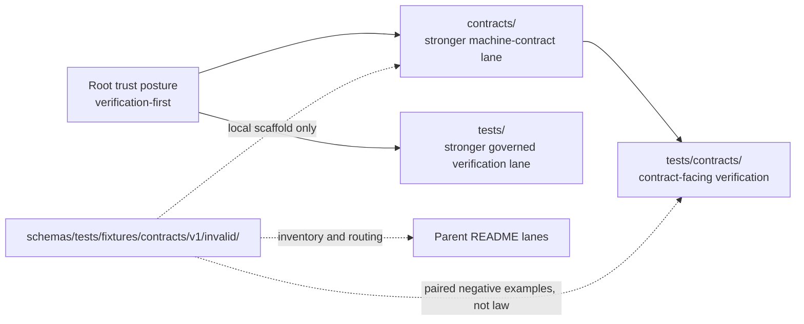

<!-- [KFM_META_BLOCK_V2]
doc_id: kfm://doc/<TODO: verify-uuid>
title: invalid
type: standard
version: v1
status: draft
owners: @bartytime4life
created: <TODO: verify YYYY-MM-DD>
updated: <TODO: verify YYYY-MM-DD>
policy_label: <TODO: verify policy label>
related: [../../../../README.md, ../../../README.md, ../../README.md, ../README.md, ../valid/README.md, ../../../../../../README.md, ../../../../../../contracts/README.md, ../../../../../../tests/README.md, ../../../../../../tests/contracts/README.md, ../../../../../../policy/README.md, ../../../../../../docs/standards/README.md, ../../../../../../.github/workflows/README.md]
tags: [kfm, schemas, tests, fixtures, contracts, invalid]
notes: [Current public main proves this leaf path exists and currently contains README.md only; canonical fixture-home authority remains unresolved; doc_id, dates, and policy_label still need working-branch verification.]
[/KFM_META_BLOCK_V2] -->

# invalid

Negative-example boundary README for `schemas/tests/fixtures/contracts/v1/invalid/`.

> [!NOTE]
> The KFM Meta Block v2 above uses reviewable placeholders for `doc_id`, `created`, `updated`, and `policy_label` because those values were not directly confirmed from the public repo surfaces inspected for this revision.

> **Status:** experimental  
> **Doc status:** draft  
> **Owners:** `@bartytime4life` *(via current public `.github/CODEOWNERS` global fallback; no narrower `/schemas/` or `/schemas/tests/**` owner rule was directly verified)*  
> **Path:** `schemas/tests/fixtures/contracts/v1/invalid/README.md`  
> 
> 
> 
> 
> 
>   
> **Repo fit:** path `schemas/tests/fixtures/contracts/v1/invalid/README.md` · upstream local version lane [`../README.md`](../README.md) · sibling positive lane [`../valid/README.md`](../valid/README.md) · parent contract-fixture boundary [`../../README.md`](../../README.md) · parent fixture scaffold [`../../../README.md`](../../../README.md) · broader schema-test lane [`../../../../README.md`](../../../../README.md) · broader schema boundary [`../../../../../README.md`](../../../../../README.md) · stronger contract / verification / policy / workflow surfaces [`../../../../../../contracts/README.md`](../../../../../../contracts/README.md), [`../../../../../../tests/README.md`](../../../../../../tests/README.md), [`../../../../../../tests/contracts/README.md`](../../../../../../tests/contracts/README.md), [`../../../../../../policy/README.md`](../../../../../../policy/README.md), [`../../../../../../docs/standards/README.md`](../../../../../../docs/standards/README.md), [`../../../../../../.github/workflows/README.md`](../../../../../../.github/workflows/README.md)  
> **Quick jumps:** [Scope](#scope) · [Repo fit](#repo-fit) · [Accepted inputs](#accepted-inputs) · [Exclusions](#exclusions) · [Current verified snapshot](#current-verified-snapshot) · [Directory tree](#directory-tree) · [Quickstart](#quickstart) · [Usage](#usage) · [Diagram](#diagram) · [Operating matrix](#operating-matrix) · [Task list / definition of done](#task-list--definition-of-done) · [FAQ](#faq) · [Appendix](#appendix)

> [!IMPORTANT]
> Current public `main` proves this leaf path is visible and currently contains `README.md` only.
> That is a real branch-visible negative-fixture lane, but it is **not** proof of a mounted invalid example pack, a canonical fixture home, or an active merge-blocking validator tied to this directory.

> [!WARNING]
> `contracts/README.md` still treats `/contracts` as the stronger current machine-contract lane, `tests/README.md` still treats `/tests` as the stronger governed verification surface, and `tests/contracts/README.md` keeps executable contract verification sharper than this schema-side scaffold.
> Invalid examples here must not silently redefine contract law, policy meaning, or test authority.

> [!CAUTION]
> In KFM, an “invalid fixture” is not arbitrary broken JSON.
> It is a deliberately failing example meant to prove that a named contract, schema, or gate rejects the wrong shape for the right reason — fail-closed, with the owning authority surface still explicit.

## Scope

This README is intentionally leaf-sized and boundary-heavy.

Its job is to keep one narrow claim legible: **`invalid/` is the local negative-example lane inside the schema-side scaffold, not a free-floating dump of malformed objects and not an automatic source of canonical verification law.**

Use this file to answer four quick questions:

1. What does the current public tree actually prove about `schemas/tests/fixtures/contracts/v1/invalid/`?
2. What kinds of negative examples are safe here without creating second-authority drift?
3. Which stronger sibling or parent surfaces still own contract meaning, policy consequence, and verification burden?
4. What remains **UNKNOWN / NEEDS VERIFICATION** before anyone treats this path as canonical or executable?

### Truth labels used here

| Label | Meaning in this README |
|---|---|
| **CONFIRMED** | Directly visible on current public `main` or directly stated in current repo docs inspected for this revision |
| **INFERRED** | Conservative interpretation of confirmed repo structure and adjacent README language |
| **PROPOSED** | Repo-native guidance that fits KFM doctrine but is not yet proven as mounted implementation |
| **UNKNOWN / NEEDS VERIFICATION** | Not directly verified strongly enough to present as settled current reality |

[Back to top](#invalid)

## Repo fit

**Path:** `schemas/tests/fixtures/contracts/v1/invalid/README.md`  
**Role:** path-local README for the negative-example leaf under the schema-side contract-fixture scaffold.

| Direction | Path | Why it matters here |
|---|---|---|
| Parent | [`../README.md`](../README.md) | Versioned `v1/` lane for the local scaffold |
| Sibling | [`../valid/README.md`](../valid/README.md) | Keeps positive and negative leaf roles paired and legible |
| Parent | [`../../README.md`](../../README.md) | Contract-fixture boundary README for the wider nested subtree |
| Parent | [`../../../README.md`](../../../README.md) | Fixture scaffold boundary for `schemas/tests/fixtures/` |
| Parent | [`../../../../README.md`](../../../../README.md) | Schema-test lane that explicitly describes `fixtures/contracts/v1/{valid,invalid}` as scaffold-only |
| Parent | [`../../../../../README.md`](../../../../../README.md) | Broader `schemas/` boundary and schema-home caution |
| Stronger lateral surface | [`../../../../../../contracts/README.md`](../../../../../../contracts/README.md) | Stronger current machine-contract lane |
| Stronger lateral surface | [`../../../../../../tests/README.md`](../../../../../../tests/README.md) | Stronger current governed verification surface |
| Stronger lateral surface | [`../../../../../../tests/contracts/README.md`](../../../../../../tests/contracts/README.md) | Sharper current contract-facing verification family |
| Lateral surface | [`../../../../../../policy/README.md`](../../../../../../policy/README.md) | Deny-by-default posture, reasons, obligations, and policy-owned behavior |
| Lateral surface | [`../../../../../../docs/standards/README.md`](../../../../../../docs/standards/README.md) | Shared standards and profile routing |
| Lateral surface | [`../../../../../../.github/workflows/README.md`](../../../../../../.github/workflows/README.md) | Workflow / merge-gate lane, still README-only on current public `main` |

### Reading rule

When these surfaces disagree, prefer this order unless a later ADR or equivalent repo decision says otherwise:

1. root trust posture and current repo-grounded evidence
2. `contracts/` for stronger machine-contract meaning
3. `tests/` and `tests/contracts/` for governed verification burden
4. `policy/` for executable decision posture
5. this leaf README for **local inventory, safe staging, and boundary reminders only**

### Path reconciliation note

This path is no longer hypothetical.

What remains unresolved is **authority**, not **visibility**. This README should therefore describe the live leaf path honestly **without** implying that the repo has already ratified this directory as the singular invalid-fixture home.

[Back to top](#invalid)

## Accepted inputs

Use this path for material that keeps the negative-example leaf understandable and reviewable **without** creating a second canonical test or contract surface.

| Accept here | Why it belongs |
|---|---|
| Path-local `README.md` updates | They explain what this leaf means and what it does not mean |
| Tiny, clearly labeled **non-authoritative** invalid examples | Useful only when they support leaf-level clarity and do not compete with stronger contract/test surfaces |
| Pairing notes that point to the corresponding positive example in [`../valid/`](../valid/) | Negative examples are easier to review when the intended valid neighbor is obvious |
| Short migration notes | They help move this lane cleanly if the repo later settles canonical fixture-home law elsewhere |
| Explanations of expected failure shape | They make negative examples reviewable instead of arbitrary |

### Minimum bar for any future invalid example

Anything added under this directory should:

- name the **owning contract family** or stronger source of truth
- say whether it is **scaffold**, **illustrative**, **derived mirror**, or **canonical**
- state the **expected failure condition** in human-readable form
- make the stronger consumer visible: `contracts/`, `tests/contracts/`, or another explicitly ratified surface
- stay public-safe and rights-safe
- avoid pretending that branch-visible presence automatically means merge-blocking enforcement already exists

> [!TIP]
> The safest authoring pattern here is “small negative example + explicit failure note + explicit upstream contract link + explicit downstream test consumer link.”

## Exclusions

These do **not** belong here by default.

| Do **not** place here | Put it here instead | Why |
|---|---|---|
| Canonical `*.schema.json` families | [`../../../../../../contracts/`](../../../../../../contracts/) or the explicitly ratified schema home | Avoids parallel machine-contract authority |
| Executable validator harnesses, test runners, or broad case suites | [`../../../../../../tests/contracts/`](../../../../../../tests/contracts/) and wider `tests/` lanes | Keeps governed verification burden in the stronger verification surface |
| Policy bundles, reason codes, obligation registries, or Rego fixtures | [`../../../../../../policy/`](../../../../../../policy/) | Policy meaning should stay executable and centralized |
| Workflow YAML, required-check wiring, or CI gate claims | [`../../../../../../.github/workflows/`](../../../../../../.github/workflows/) | This leaf is not the control plane |
| Release proof objects, runtime envelopes, or publishable artifacts | release / runtime / data surfaces | Invalid fixture scaffolds are not publication homes |
| Sensitive, rights-unclear, or real-world data dumps | stewarded or quarantine lanes | Boundary convenience does not outrank publication burden |
| Unexplained “broken examples” with no named failing rule | upstream contract + downstream verification surface first | Arbitrary breakage is noise, not governed negative coverage |

[Back to top](#invalid)

## Current verified snapshot

| Item | Status | Why it matters |
|---|---|---|
| `schemas/tests/fixtures/contracts/v1/invalid/README.md` exists on current public `main` | **CONFIRMED** | This leaf path is real, not speculative |
| Current public directory inventory is `README.md` only | **CONFIRMED** | Public `main` does **not** currently prove mounted invalid example files here |
| [`../README.md`](../README.md) exists | **CONFIRMED** | The version lane is visible |
| [`../valid/README.md`](../valid/README.md) exists | **CONFIRMED** | Positive/negative leaves are paired in the current tree |
| Parent `schemas/tests/README.md` describes `fixtures/contracts/v1/{valid,invalid}` as scaffold-only | **CONFIRMED** | This leaf should preserve that boundary language |
| Parent `schemas/tests/fixtures/contracts/README.md` treats this path as a local placeholder negative lane | **CONFIRMED** | The immediate subtree already frames this as local scaffold inventory |
| This directory contains a canonical invalid fixture pack used by blocking gates | **UNKNOWN / NEEDS VERIFICATION** | Current public evidence does not prove executable depth |
| This directory is the singular repo-wide invalid fixture home | **UNKNOWN / NEEDS VERIFICATION** | Authority remains unresolved across `schemas/`, `contracts/`, and `tests/` |
| Public `main` exposes active workflow YAML that consumes this leaf path | **UNKNOWN / NEEDS VERIFICATION** | `.github/workflows/` is README-only on current public `main` |

[Back to top](#invalid)

## Directory tree

### Current confirmed visible tree

```text
repo-root/
└── schemas/
    └── tests/
        └── fixtures/
            └── contracts/
                └── v1/
                    ├── README.md
                    ├── valid/
                    │   └── README.md
                    └── invalid/
                        └── README.md
```

### Current live role of this leaf

```text
schemas/tests/fixtures/contracts/v1/invalid/
└── README.md   # local negative-example boundary README
```

### Future leaf shape after explicit authority and consumer decisions (**PROPOSED**)

```text
schemas/tests/fixtures/contracts/v1/invalid/
├── README.md
└── <contract-family>.invalid.example.json   # illustrative or derived only unless the repo explicitly ratifies this lane
```

> [!NOTE]
> The proposed leaf shape above is intentionally narrow.
> It shows the smallest plausible way this path could gain real negative examples without quietly turning into a second canonical registry.

[Back to top](#invalid)

## Quickstart

Inspect first. Escalate authority second.

```bash
# 1) Inspect the local versioned scaffold
find schemas/tests/fixtures/contracts/v1 -maxdepth 3 -type f 2>/dev/null | sort

# 2) Re-open the parent and stronger sibling docs together
sed -n '1,220p' \
  schemas/tests/fixtures/contracts/v1/README.md \
  schemas/tests/fixtures/contracts/README.md \
  schemas/tests/README.md \
  contracts/README.md \
  tests/README.md \
  tests/contracts/README.md

# 3) Only then decide whether the change is README-only, illustrative, or authority-moving
```

### Safe startup sequence

1. Confirm whether the change is only clarifying local inventory, or whether it tries to move contract or verification authority.
2. If the change is inventory-only, keep it README-first.
3. If adding a future invalid example, name the owning contract family and the expected failing rule in the same change set.
4. Keep the paired positive lane visible through [`../valid/README.md`](../valid/README.md) or an equivalent linked example.
5. Update [`../../README.md`](../../README.md), [`../../../README.md`](../../../README.md), and [`../../../../README.md`](../../../../README.md) in the same PR whenever local subtree reality changes.
6. Do not claim merge-blocking workflow behavior from this leaf unless checked-in workflow files or working-branch evidence actually prove it.

## Usage

### What “invalid” means here

In KFM, invalid fixtures are useful only when they strengthen **fail-closed** behavior.

That means this leaf should privilege examples that help reviewers or future validators answer questions like:

- Which required field is missing?
- Which value violates the declared contract shape?
- Which time, rights, or policy field is malformed?
- Which outcome should be a governed reject, hold, or quarantine instead of a silent accept?

### Authoring rules

- Prefer the **smallest failing object** that still explains the intended rejection.
- Keep failure explanations short and explicit.
- Pair negative examples with the stronger contract surface that defines the rule.
- Pair negative examples with the stronger verification surface that is expected to consume them.
- Avoid speculative claims about enforcement depth.
- Keep the leaf readable in one scan.

### When to edit this file

Edit this README when one of these changes:

- this leaf gains or loses local example files
- the repo settles canonical fixture-home or schema-home authority
- the parent `v1/` or sibling `valid/` lane changes role
- stronger sibling docs change the routing or caution this file depends on
- the leaf is promoted, mirrored, renamed, or retired

[Back to top](#invalid)

## Diagram



## Operating matrix

| Question | Local leaf answer | Stronger answer lives in |
|---|---|---|
| What is visible here right now? | `README.md` only on current public `main` | this file + parent subtree READMEs |
| What defines contract shape? | Not this leaf by itself | `contracts/README.md` and the eventual canonical contract home |
| What proves fail-closed verification behavior? | Not this leaf by itself | `tests/README.md`, `tests/contracts/README.md`, and future executable validation surfaces |
| What defines deny / obligation / review consequence? | Not this leaf by itself | `policy/README.md` and later executable policy bundles |
| When can this leaf become authoritative? | Only after an explicit repo-level authority decision | ADR or equivalent repo-backed resolution |

## Task list / definition of done

### Definition of done for a README-only leaf revision

- [ ] The file states the local role of `invalid/` without inflating it into canonical law.
- [ ] Relative links to parent, sibling, and stronger surfaces are correct.
- [ ] Current public-tree facts and unresolved authority are kept distinct.
- [ ] README language stays synchronized with the parent subtree docs.
- [ ] No workflow, validator, or enforcement claim exceeds checked-in evidence.

### Additional gate if future invalid examples are added

- [ ] Each example names its owning contract family.
- [ ] Each example names the intended failing condition.
- [ ] A corresponding positive lane or valid example is easy to find.
- [ ] Public-safety, rights, and sensitivity risk were reviewed.
- [ ] The stronger consumer path in `tests/` or `tests/contracts/` is explicit.

[Back to top](#invalid)

## FAQ

### Does this leaf prove the repo already has a real invalid fixture pack?

No.

Current public `main` proves the directory and `README.md` exist. It does **not** yet prove a mounted pack of invalid JSON examples or an active validator consuming them from this path.

### Can this directory become the canonical invalid-fixture home just by accumulating examples?

No.

Visibility is not authority. KFM explicitly treats duplicate authority as drift, so any canonical-home decision has to be made upstream and reflected across neighboring docs.

### Where should executable validation logic live?

In the stronger verification and workflow surfaces, especially `tests/contracts/`, wider `tests/`, repo tooling, and any checked-in workflow or runner lanes that later prove enforcement.

### Should an invalid example here mirror a valid example?

Usually yes.

Negative coverage is easier to review when the nearby valid comparison and the owning contract rule are easy to locate.

## Appendix

<details>
<summary><strong>Illustrative naming pattern for future invalid examples (PROPOSED)</strong></summary>

Use names that keep the failing condition obvious without pretending the filename itself is law.

```text
<contract-family>.<failure-shape>.invalid.example.json
```

Illustrative only:

```text
source_descriptor.missing-rights.invalid.example.json
decision_envelope.unknown-result.invalid.example.json
runtime_response_envelope.missing-audit-ref.invalid.example.json
```

Keep the contract family, expected failure, and stronger consumer path explicit in the same PR.

</details>

<details>
<summary><strong>Leaf authoring reminder</strong></summary>

Before adding anything under this path, ask:

> Is this file helping readers understand the local negative-example scaffold, or is it trying to become the repo’s primary contract or verification record?

If the second answer is even partly true, this is probably the wrong directory.

</details>

[Back to top](#invalid)
