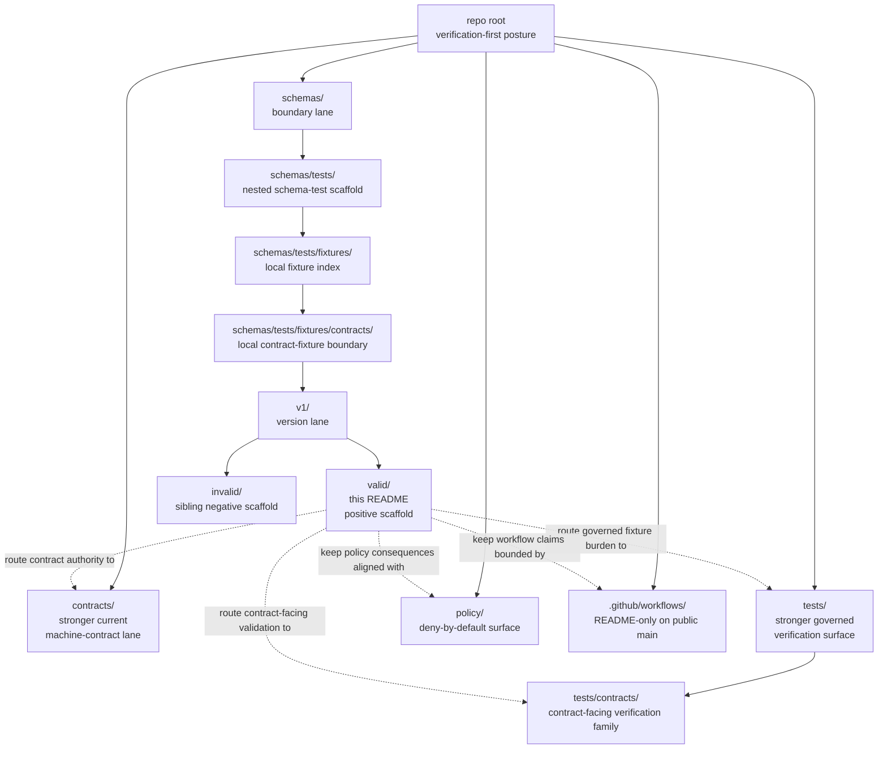

<!-- [KFM_META_BLOCK_V2]
doc_id: kfm://doc/<NEEDS_VERIFICATION_UUID>
title: valid
type: standard
version: v1
status: draft
owners: @bartytime4life
created: YYYY-MM-DD
updated: YYYY-MM-DD
policy_label: NEEDS_VERIFICATION
related: [schemas/tests/fixtures/contracts/v1/README.md, schemas/tests/fixtures/contracts/README.md, schemas/tests/fixtures/README.md, schemas/tests/README.md, contracts/README.md, tests/README.md, tests/contracts/README.md]
tags: [kfm, schemas, tests, fixtures, contracts, v1, valid]
notes: [owners are grounded in current public CODEOWNERS global fallback; doc_id, created, updated, and policy_label remain review placeholders pending working-branch or document-registry confirmation]
[/KFM_META_BLOCK_V2] -->

# valid

Positive-example boundary README for the live `schemas/tests/fixtures/contracts/v1/valid/` scaffold.

> [!NOTE]
> The KFM Meta Block V2 above uses reviewable placeholders for `doc_id`, `created`, `updated`, and `policy_label` because those values were not directly confirmed from the current public repo surfaces inspected for this revision.
>
> **Status:** experimental  
> **Doc status:** draft  
> **Owners:** `@bartytime4life` *(via current public `.github/CODEOWNERS` global fallback; no narrower `/schemas/tests/fixtures/contracts/v1/valid/` rule was directly verified)*  
> **Path:** `schemas/tests/fixtures/contracts/v1/valid/README.md`  
>       
> **Repo fit:** path `schemas/tests/fixtures/contracts/v1/valid/README.md` · parent version lane [`../README.md`](../README.md) · parent contract-fixture scaffold [`../../README.md`](../../README.md) · parent fixture scaffold [`../../../README.md`](../../../README.md) · parent schema-test lane [`../../../../README.md`](../../../../README.md) · schema boundary [`../../../../../README.md`](../../../../../README.md) · stronger current machine-contract / verification surfaces [`../../../../../../contracts/README.md`](../../../../../../contracts/README.md), [`../../../../../../tests/README.md`](../../../../../../tests/README.md), [`../../../../../../tests/contracts/README.md`](../../../../../../tests/contracts/README.md) · policy lane [`../../../../../../policy/README.md`](../../../../../../policy/README.md) · workflow guardrail [`../../../../../../.github/workflows/README.md`](../../../../../../.github/workflows/README.md) · sibling negative lane [`../invalid/README.md`](../invalid/README.md)  
> **Quick jumps:** [Scope](#scope) · [Repo fit](#repo-fit) · [Accepted inputs](#accepted-inputs) · [Exclusions](#exclusions) · [Directory tree](#directory-tree) · [Quickstart](#quickstart) · [Usage](#usage) · [Diagram](#diagram) · [Tables](#tables) · [Task list](#task-list--definition-of-done) · [FAQ](#faq) · [Appendix](#appendix)

> [!IMPORTANT]
> Current public `main` confirms this leaf exists as a checked-in directory with `README.md` only.
>
> Treat that as real local scaffold inventory, not as proof that canonical valid example packs, mounted validators, or merge-blocking workflows live here.

> [!WARNING]
> The stronger current signals still route machine-contract guidance to [`../../../../../../contracts/README.md`](../../../../../../contracts/README.md), governed verification burden to [`../../../../../../tests/README.md`](../../../../../../tests/README.md), and contract-facing validation to [`../../../../../../tests/contracts/README.md`](../../../../../../tests/contracts/README.md).

> [!NOTE]
> KFM’s contract-first thin-slice doctrine repeatedly prioritizes typed trust objects plus valid/invalid example packs and fail-closed validation.
>
> This leaf can support that pattern as a documented scaffold, but the current public tree does not yet prove mounted positive example files or active workflow enforcement at this path.

> [!IMPORTANT]
> Current branch now includes `correction_notice.supersession.valid.json` as a concrete positive fixture for the correction contract floor.

## Scope

`schemas/tests/fixtures/contracts/v1/valid/` is the positive-example leaf inside the visible schema-side contract-fixture scaffold.

Its current job is narrow on purpose: explain what a local `valid/` lane means, keep the live tree legible in review, and prevent a directory named `valid/` from being mistaken for the repo’s settled canonical fixture home.

In practice, this README should help contributors answer four questions quickly:

1. What is currently visible in this leaf?
2. What kinds of changes are safe here without creating second-authority drift?
3. Which stronger neighboring surfaces still own machine-contract and governed verification law?
4. What must be verified before anyone treats this lane as canonical?

### Truth labels used here

| Label | Meaning in this README |
|---|---|
| **CONFIRMED** | Directly visible on current public `main` or directly stated in the checked-in repo docs inspected for this revision |
| **INFERRED** | Conservative interpretation of confirmed repo structure or adjacent README language |
| **PROPOSED** | Repo-native next shape that fits KFM doctrine but is not yet proven as mounted implementation |
| **UNKNOWN / NEEDS VERIFICATION** | Not directly verified strongly enough to present as settled current repo law |

[Back to top](#valid)

## Repo fit

**Path:** `schemas/tests/fixtures/contracts/v1/valid/README.md`  
**Role:** local positive-example boundary README for the `v1` schema-side contract-fixture scaffold

| Surface | Relation | Why it matters here |
|---|---|---|
| [`../README.md`](../README.md) | Parent | Describes the local `v1/` version lane |
| [`../../README.md`](../../README.md) | Parent | Keeps the contract-fixture subtree boundary and inventory visible |
| [`../../../README.md`](../../../README.md) | Parent | Documents the nested fixture scaffold under `schemas/tests/fixtures/` |
| [`../../../../README.md`](../../../../README.md) | Parent | Describes `schemas/tests/` as scaffold-only and routes back to stronger surfaces |
| [`../../../../../README.md`](../../../../../README.md) | Parent | Keeps schema-home ambiguity visible and warns against parallel schema authority |
| [`../../../../../../contracts/README.md`](../../../../../../contracts/README.md) | Stronger lateral surface | Stronger current machine-contract guidance |
| [`../../../../../../tests/README.md`](../../../../../../tests/README.md) | Stronger lateral surface | Stronger governed verification surface |
| [`../../../../../../tests/contracts/README.md`](../../../../../../tests/contracts/README.md) | Stronger lateral surface | Contract-facing verification family under `/tests/` |
| [`../../../../../../policy/README.md`](../../../../../../policy/README.md) | Lateral surface | Deny-by-default and reason/obligation posture |
| [`../../../../../../.github/workflows/README.md`](../../../../../../.github/workflows/README.md) | Lateral surface | Bounds workflow claims to checked-in evidence |
| [`../invalid/README.md`](../invalid/README.md) | Sibling | Paired negative-example scaffold lane |

### Working interpretation

When these surfaces disagree, read them in this order unless an ADR or equivalent repo decision says otherwise:

1. current public repo evidence plus KFM doctrine
2. `contracts/` for stronger current machine-contract guidance
3. `tests/` and `tests/contracts/` for stronger governed verification burden
4. this leaf for local scaffold inventory only

[Back to top](#valid)

## Accepted inputs

Use this leaf for material that explains or safely stages the local positive-example scaffold without quietly creating a second canonical truth system.

| Accept here | Why it belongs |
|---|---|
| Path-local `README.md` updates | They explain what the visible leaf means and what it does not mean |
| Clearly labeled **scaffold** or **illustrative** positive examples | Acceptable only when they clarify the local tree and stay non-authoritative |
| Clearly labeled **derived mirrors** with a pointer to the stronger source | They can make local shape legible without redefining canonical truth |
| Migration notes about moving positive examples between `schemas/`, `contracts/`, and `tests/` | They reduce authority drift during tree changes |
| Small public-safe example packs used only for explanation or generated output | Useful when their non-canonical role is explicit in both file naming and README text |

### Minimum bar for anything added here

Anything added here should:

- declare whether it is **scaffold**, **illustrative**, **derived mirror**, or **canonical**
- point readers back to the stronger sibling surface that actually owns machine-contract or verification law
- stay small enough that a reviewer can inspect the entire leaf in one pass
- avoid creating a second “valid examples” source of truth by quiet accumulation

## Exclusions

This leaf is **not** the default home for authoritative positive fixtures.

| Do **not** place here by default | Put it here instead | Why |
|---|---|---|
| Canonical `*.schema.json` examples or shared vocabularies | [`../../../../../../contracts/`](../../../../../../contracts/) | Avoids parallel machine-contract authority |
| Repo-wide valid fixture packs used by blocking gates | [`../../../../../../tests/`](../../../../../../tests/) or [`../../../../../../tests/contracts/`](../../../../../../tests/contracts/) | Keeps governed verification burden in the stronger test surfaces |
| Invalid or negative examples | [`../invalid/README.md`](../invalid/README.md) for this local scaffold, or the stronger `/tests/` family once authority is explicit | Keeps positive and negative lanes legible |
| Policy bundles, reason codes, obligation codes, or decision grammar | [`../../../../../../policy/`](../../../../../../policy/) | Policy should stay executable and centralized |
| Workflow YAML, validator entrypoints, or merge-gate wiring | [`../../../../../../.github/workflows/`](../../../../../../.github/workflows/) and related tooling lanes | This leaf is not the workflow control plane |
| Runtime outputs, proof packs, release artifacts, or published catalog objects | governed data / release / runtime surfaces | This leaf is not a publication home |

> [!CAUTION]
> A file can be checked in at the right path and still be the wrong authority surface.
>
> In KFM, duplicate truth is usually worse than visible incompleteness.

[Back to top](#valid)

## Directory tree

### Current confirmed visible parent lane

```text
schemas/tests/fixtures/contracts/v1/
├── README.md
├── invalid/
│   └── README.md
└── valid/
    └── README.md
```

### Current confirmed visible leaf

```text
schemas/tests/fixtures/contracts/v1/valid/
├── README.md
└── correction_notice.supersession.valid.json
```

### Candidate future local shape (`PROPOSED`)

```text
schemas/tests/fixtures/contracts/v1/valid/
├── README.md
└── <positive-example>.json  # only if explicitly labeled scaffold / illustrative / derived-mirror
```

That candidate shape is **not** a statement that any checked-in positive example files currently exist here.

## Quickstart

Inspect first. Reclassify later.

```bash
# 1) Inspect the current local scaffold and sibling leaves
find schemas/tests/fixtures/contracts/v1 -maxdepth 3 -type f 2>/dev/null | sort

# 2) Re-open stronger neighboring authority surfaces before adding a positive example
sed -n '1,220p' \
  contracts/README.md \
  tests/README.md \
  tests/contracts/README.md \
  schemas/tests/README.md \
  schemas/tests/fixtures/README.md \
  schemas/tests/fixtures/contracts/README.md \
  .github/workflows/README.md

# 3) If a file still seems to belong here, label it explicitly in the file or PR
# scaffold | illustrative | derived-mirror | canonical
```

### Safe startup sequence

1. Confirm whether an ADR or equivalent repo decision has already settled canonical schema-home or canonical fixture-home law.
2. Confirm whether this `valid/` leaf is meant to stay **scaffold-only**, become a **derived mirror**, or eventually be promoted.
3. Keep edits here README-first unless the authority decision is explicitly documented.
4. Update parent and sibling READMEs in the same PR if local inventory or authority wording changes.
5. Do not describe live workflow gates here unless checked-in workflow files or working-branch proof actually show them.

[Back to top](#valid)

## Usage

### When to edit this file

Edit this README when one of these changes:

- this leaf gains or loses local files
- sibling `../invalid/README.md` changes in a way that affects positive/negative pairing
- parent `../README.md` or `../../README.md` changes the meaning of the local `v1` scaffold
- the repo explicitly settles canonical schema-home or fixture-home authority
- the stronger contract, verification, policy, or workflow surfaces change routing that this leaf depends on

### Positive-lane authoring rules

- Prefer **one explicit authority story**.
- Prefer **one clearly named canonical fixture home**.
- Treat branch-visible local scaffolds as **inventory**, not automatic law.
- Keep positive and negative leaf roles symmetrical when paired examples matter.
- Keep examples public-safe and small.
- If a file here starts to behave like canonical truth, stop and move the decision upstream.

### Practical authoring test

Before adding any file under this path, ask:

> Is this file here to explain the local scaffold, or is it trying to become the repo’s primary valid example pack?

If the second answer is even partly true, this is probably the wrong directory.

## Diagram



## Tables

### Current posture snapshot

| Statement | Posture | Why it matters |
|---|---|---|
| `schemas/tests/fixtures/contracts/v1/valid/README.md` exists on current public `main` | **CONFIRMED** | This leaf is real, not hypothetical |
| A checked-in positive correction notice fixture now exists in this leaf | **CONFIRMED** | The local positive lane is visible but still placeholder-level |
| `../invalid/README.md` exists beside this leaf | **CONFIRMED** | The `v1` scaffold has paired positive and negative leaves |
| `../../README.md` already treats `v1/{valid,invalid}` as local scaffold lanes | **CONFIRMED** | This leaf should describe inventory, not invent canonical authority |
| `../../../../../../contracts/README.md` remains the stronger current machine-contract surface | **CONFIRMED / INFERRED** | Positive examples here should not silently outrank the contract lane |
| `../../../../../../tests/README.md` and `../../../../../../tests/contracts/README.md` remain the stronger current verification surfaces | **CONFIRMED** | Repo-wide verification burden still routes more strongly through `/tests/` |
| Checked-in workflow YAMLs are visible under `../../../../../../.github/workflows/` on public `main` | **NOT CONFIRMED** | Do not claim active validator workflows from this leaf |
| This leaf is already the singular canonical valid-fixture home | **UNKNOWN / NEEDS VERIFICATION** | Current public docs do not settle that law |

### Positive-example label matrix

| Label | Meaning | Default current allowance here |
|---|---|---|
| **scaffold** | Exists to make the local tree visible and reviewable | **Yes** |
| **illustrative** | Small example used to explain shape, not to drive canonical validation | **Maybe**, if clearly marked |
| **derived mirror** | Generated copy of a stronger canonical source elsewhere | **Maybe**, if the generating source and regeneration route are explicit |
| **canonical** | Authoritative positive example pack used by blocking validation or release-bearing proof | **No**, not without an explicit authority decision and synchronized repo updates |

[Back to top](#valid)

## Task list & definition of done

### Task list

- [ ] Replace `doc_id`, `created`, `updated`, and `policy_label` placeholders in the KFM meta block once the working branch or document registry confirms them.
- [ ] Keep `../README.md`, `../../README.md`, `../../../README.md`, `../../../../README.md`, and `../../../../../README.md` synchronized when this leaf’s inventory or authority wording changes.
- [ ] If positive examples are added here, list them in this README and label each file **scaffold**, **illustrative**, **derived mirror**, or **canonical**.
- [ ] Keep `../invalid/README.md` aligned when the positive/negative pair meaning changes.
- [ ] Do not claim live workflow gates unless checked-in workflow files or working-branch proof support that claim.
- [ ] Escalate anything that starts behaving like canonical truth into the explicitly chosen authority surface.

### Definition of done

This README is done when:

1. the leaf inventory described here matches the live checked-in tree
2. the stronger neighboring surfaces are linked and easy to find
3. every local example, if any, is explicitly labeled
4. canonical fixture-home and schema-home claims remain bounded to verified evidence
5. parent and sibling README surfaces were updated in the same PR when local truth changed

## FAQ

### Is this the canonical valid fixture home for KFM?

No current public repo document inspected for this revision makes that claim. Treat this as a visible local scaffold leaf until the repo explicitly settles canonical fixture-home authority.

### Can I add a positive JSON example here now?

Only if it is clearly labeled as **scaffold**, **illustrative**, or **derived mirror**, and only if the change does not create a second authoritative fixture pack by accident. Anything meant to drive governed validation should route to the stronger `/tests/` family unless repo law changes.

### Does this leaf prove that contract validators already run in CI?

No. The current public workflow lane still documents `.github/workflows/` as README-only on public `main`, so workflow certainty is still bounded by checked-in evidence.

### Should `valid/` and `invalid/` stay paired?

Yes, when the local scaffold is explaining positive and negative example roles. If one leaf changes meaning, update the sibling or explain the asymmetry in the same PR.

## Appendix

<details>
<summary><strong>Appendix — future-shape and contract-family notes</strong></summary>

### Candidate future canonical shape (`PROPOSED`)

```text
tests/
└── fixtures/
    └── contracts/
        └── v1/
            ├── valid/
            └── invalid/
```

That shape is a candidate only. This README does **not** claim that `tests/fixtures/contracts/` is already visible or canonical on current public `main`.

### Likely contract families for future positive examples

If this leaf ever mirrors or documents positive examples, the March 2026 KFM contract wave suggests these are the most likely trust-bearing families to appear somewhere in the repo’s valid/invalid fixture ecosystem:

- `SourceDescriptor`
- `IngestReceipt`
- `ValidationReport`
- `DatasetVersion`
- `CatalogClosure`
- `DecisionEnvelope`
- `ReviewRecord`
- `ReleaseManifest` / `ReleaseProofPack`
- `ProjectionBuildReceipt`
- `EvidenceBundle`
- `RuntimeResponseEnvelope`
- `CorrectionNotice`

### Minimum bar if a temporary positive example lands here

Even a non-canonical positive example should make these seams easy to see:

- contract family and version
- required fields
- explicit time basis where relevant
- rights / sensitivity posture where relevant
- route back to the stronger contract and verification surfaces
- whether the file is human-authored, generated, or mirrored

### Relative-link cheat sheet

| Destination | Relative link |
|---|---|
| Parent `v1` README | `../README.md` |
| Parent contract-fixture README | `../../README.md` |
| Parent fixture scaffold README | `../../../README.md` |
| Parent schema-test README | `../../../../README.md` |
| Schema boundary README | `../../../../../README.md` |
| Stronger contract lane | `../../../../../../contracts/README.md` |
| Stronger tests lane | `../../../../../../tests/README.md` |
| Contract-facing tests lane | `../../../../../../tests/contracts/README.md` |
| Policy lane | `../../../../../../policy/README.md` |
| Workflow guardrail | `../../../../../../.github/workflows/README.md` |
| Sibling negative leaf | `../invalid/README.md` |

</details>

[Back to top](#valid)
