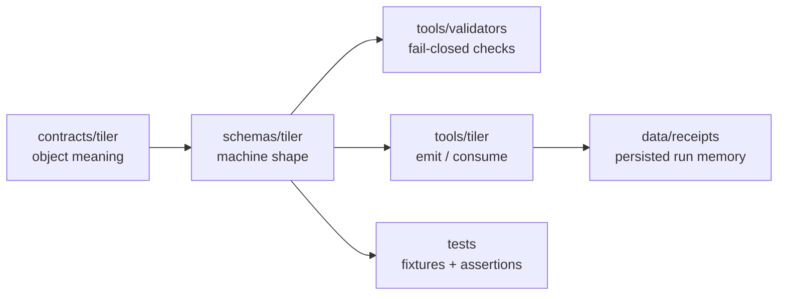

<!-- [KFM_META_BLOCK_V2]
doc_id: kfm://doc/schemas/tiler/readme
title: schemas/tiler
type: standard
version: v1
status: draft
owners: @bartytime4life
created: 2026-04-13
updated: 2026-04-13
policy_label: public
related: [
  ../README.md,
  ../../contracts/tiler/README.md,
  ../../tools/tiler/README.md,
  ../../tools/validators/README.md,
  ../../tools/diff/README.md,
  ../../data/receipts/README.md,
  ../../tests/README.md
]
tags: [kfm, schemas, tiler, receipts, summaries, validation, deterministic]
notes: [
  Proposed schema-home boundary for tiling-related machine objects.
  Public-main schema inventory remains NEEDS VERIFICATION.
  This document defines schema scope, ownership boundaries, and validation expectations without asserting landed files.
]
[/KFM_META_BLOCK_V2] -->

# schemas/tiler

Schema-home boundary for **tiling run specs**, **tiling receipts**, **tile summaries**, and related machine-readable objects used by the KFM tiling lane.

> [!NOTE]
> **Status:** draft · **Authority posture:** schema-home boundary · **Owners:** `@bartytime4life`  
> 
> 
> 
> 

**Quick jumps:** [Purpose](#purpose) · [Repo fit](#repo-fit) · [Schema set](#schema-set) · [Ownership boundary](#ownership-boundary) · [Validation](#validation-expectations) · [Examples](#example-file-layout-proposed) · [Invariants](#schema-invariants) · [FAQ](#faq)

---

## Purpose

`schemas/tiler/` is the **schema-home surface** for machine-readable objects defined by the tiling contract family.

It exists so that:

- `contracts/tiler/` defines **meaning**
- `schemas/tiler/` defines **machine shape**
- `tools/tiler/` implements **behavior**
- `tools/validators/` enforces **fail-closed checks**

This keeps KFM’s tiling lane aligned with the repo’s broader doctrine: **clear authority boundaries, explicit artifacts, and reviewable machine contracts**.

> [!IMPORTANT]
> This directory is about **schema authority**, not business logic, policy logic, or release approval.  
> It should define how tiling objects are serialized and validated, not whether a run should be permitted or promoted.

---

## Repo fit

**Path:** `schemas/tiler/`

**Primary upstream / adjacent surfaces**

- [`../../contracts/tiler/README.md`](../../contracts/tiler/README.md) — semantic contract home
- [`../../tools/tiler/README.md`](../../tools/tiler/README.md) — tooling lane consuming and emitting these objects
- [`../../tools/validators/README.md`](../../tools/validators/README.md) — fail-closed validation helpers
- [`../../tools/diff/README.md`](../../tools/diff/README.md) — deterministic comparison over summary-bearing artifacts
- [`../../data/receipts/README.md`](../../data/receipts/README.md) — process-memory destination for emitted receipts
- [`../../tests/README.md`](../../tests/README.md) — fixtures and assertions proving schema behavior
- [`../README.md`](../README.md) — top-level schema-home boundary and shared conventions

### Boundary in one view



---

## Schema set

The tiling contract family centers on a small set of schema-governed objects.

| Object | Purpose | Typical format |
|---|---|---|
| `tiling_run_spec` | declared input + shaping instructions for a run | JSON / YAML-serializable object |
| `tiling_invocation` | normalized execution-ready form | JSON |
| `tiling_receipt` | persisted process-memory record | JSON |
| `tile_summary` | review- and diff-friendly emitted summary | JSON |
| `failure_record` | normalized failed / blocked run shape | JSON |
| `tile_inventory` | optional support artifact for counts / paths / bytes | JSON |
| `geometry_summary` | optional support artifact for bounds / hierarchy / error shape | JSON |

> [!TIP]
> YAML may be acceptable for author-authored inputs such as run specs, but canonical persisted artifacts should generally normalize to **JSON-compatible schema shapes** for deterministic validation and comparison.

---

## Ownership boundary

### This directory owns

- schema names and file organization for tiling objects
- required vs optional field structure
- enum / discriminator shape where applicable
- serialization rules needed by validators and tooling
- compatibility expectations across versions
- references to shared primitive schemas when those exist upstream

### This directory does not own

- semantic meaning beyond what contracts define
- policy outcomes
- release proofs or attestation semantics
- CI orchestration
- adapter-specific CLI flags
- viewer/runtime rendering behavior
- dataset governance and rights adjudication

### Authority split

| Concern | Home |
|---|---|
| “What does `tiling_receipt` mean?” | `contracts/tiler/` |
| “Which fields are required in `tiling_receipt`?” | `schemas/tiler/` |
| “How is it emitted?” | `tools/tiler/` |
| “How is it checked?” | `tools/validators/` |
| “Where is it stored?” | `data/receipts/` |

---

## Schema design goals

All tiling schemas should be designed to support the following qualities:

### 1. Deterministic serialization

Equivalent objects should serialize into materially stable shapes so they diff cleanly and validate predictably.

### 2. Explicitness over inference

Required relationships and references must be present in the object, not guessed by consumers.

### 3. Finite status grammar

Run outcome objects must use bounded, machine-checkable states.

### 4. Validator friendliness

Schemas should make it easy for validators to fail closed on ambiguity, missing fields, or shape drift.

### 5. Reviewability

Even though these are machine objects, they should remain understandable enough for reviewer inspection.

---

## Expected schema families

## 1. Run-definition schemas

These cover the start of a tiling run.

| Schema | Role |
|---|---|
| `tiling_run_spec.schema.json` | caller-authored declared tiling request |
| `tiling_invocation.schema.json` | normalized execution form derived from the run spec |

### Design notes

- `tiling_run_spec` should tolerate author-friendly config structure while remaining strict about required declared inputs.
- `tiling_invocation` should be more normalized and stricter, because it is the adapter-facing execution object.

---

## 2. Emitted process-memory schemas

These cover what gets written after or during execution.

| Schema | Role |
|---|---|
| `tiling_receipt.schema.json` | durable run memory |
| `failure_record.schema.json` | normalized fail-closed error shape |

### Design notes

- `tiling_receipt` should never imply release approval.
- `failure_record` should support both pre-execution blocking and execution failure cases.

---

## 3. Review and diff schemas

These support downstream inspection and deterministic comparison.

| Schema | Role |
|---|---|
| `tile_summary.schema.json` | compact emitted summary |
| `tile_inventory.schema.json` | optional tile listing artifact |
| `geometry_summary.schema.json` | optional spatial / hierarchy summary |

### Design notes

- `tile_summary` is the main comparison object for `tools/diff/`.
- Optional support artifacts should stay bounded and deterministic.

---

## Serialization expectations

### Preferred persisted format

- **JSON** for persisted emitted artifacts and validator inputs
- UTF-8 text encoding
- stable key naming
- explicit `kind` + `version` discriminators where appropriate

### Canonical object posture

Each schema-governed object should generally include:

- a `kind`
- a `version`
- fields sufficient to identify the object and its role
- explicit references to adjacent objects when relevant

### Example discriminator pattern

```json
{
  "kind": "tiling_receipt",
  "version": "v1"
}
```

> [!TIP]
> This repo often benefits from stable discriminator patterns because they simplify validator routing, diff classification, and fixture authoring.

---

## Required structural expectations by object

> [!WARNING]
> The lists below describe expected structural content for schema design.  
> They are not assertions that concrete schema files already exist on public main.

## `tiling_run_spec`

Expected schema characteristics:

- required `kind`
- required `version`
- required declared input reference
- required adapter selection
- required output profile
- required output / receipt target references
- required `spec_hash`
- required spatial frame declaration such as `crs`

Should reject:

- missing input identity
- missing output destination
- undeclared adapter
- open-ended freeform status fields
- contradictory shaping policy fields

---

## `tiling_invocation`

Expected schema characteristics:

- normalized parameter object required
- normalized input object required
- normalized planned output object required
- required adapter identity
- required `spec_hash`

Should reject:

- hidden ambient defaults represented as omitted-but-required execution values
- malformed normalized parameter maps
- missing linkage to governing run spec or equivalent identity

---

## `tiling_receipt`

Expected schema characteristics:

- required finite `status`
- required `recorded_at`
- required `spec_hash`
- required adapter identity
- required source reference
- required output reference when output exists
- required summary reference when summary exists

Should reject:

- unknown status values
- success-like receipts with no usable output linkage
- ambiguous timestamps
- receipts that look like release manifests

---

## `failure_record`

Expected schema characteristics:

- required finite failed/blocked status
- required machine-readable `reason_code`
- required bounded human-readable message
- required timestamp

Should reject:

- success statuses
- vague reason fields with no stable machine code
- stack dumps or unbounded logs masquerading as structured failure objects

---

## `tile_summary`

Expected schema characteristics:

- required tile count
- required total bytes
- required bounds
- required `crs`
- required adapter identity
- required `spec_hash`
- required generation timestamp

Should reject:

- non-numeric count / byte fields
- missing bounds object
- freeform shape where diff tools cannot rely on field stability

---

## Versioning posture

Schemas in this family should be versioned explicitly.

### Expectations

- every top-level object includes `version`
- incompatible shape changes require a version bump
- validators should fail closed on unsupported versions
- examples and fixtures should clearly declare which version they target

### Compatibility guidance

| Change type | Expected treatment |
|---|---|
| additive optional field | usually same major contract version if validators tolerate it |
| required field addition | likely version bump |
| enum change affecting interpretation | likely version bump |
| field rename | version bump |
| semantic reinterpretation without shape change | contract review required; likely version bump |

---

## Validation expectations

Schemas under this directory should support **strict validation**.

### Validators should be able to enforce

- required fields present
- field types match
- finite enums remain bounded
- discriminators are correct
- timestamps and references have valid shape
- related objects agree on shared fields such as `spec_hash` where appropriate

### Validators should not need to guess

- which object type a file represents
- whether a receipt is a proof pack
- whether a run “probably succeeded”
- whether missing source identity should be tolerated

---

## Relationship to tests

Schema authority is only useful if proven with fixtures.

### Expected test surfaces

| Test type | Purpose |
|---|---|
| valid fixture tests | known-good examples validate successfully |
| invalid fixture tests | malformed objects fail closed |
| round-trip tests | normalized serialization remains stable |
| backward-compat tests | older supported versions remain accepted where intended |
| cross-object consistency tests | receipt / summary / spec continuity behaves correctly |

### Fixture guidance

Fixtures should stay:

- tiny
- deterministic
- diff-friendly
- clearly named by object kind and validity expectation

Example naming ideas:

```text
fixtures/
├── valid/
│   ├── tiling_run_spec.minimal.v1.json
│   ├── tiling_receipt.completed.v1.json
│   └── tile_summary.minimal.v1.json
└── invalid/
    ├── tiling_receipt.unknown_status.v1.json
    └── tile_summary.missing_bounds.v1.json
```

---

## Example file layout (PROPOSED)

> [!NOTE]
> This layout is proposed for alignment and review. Public-main inventory remains **NEEDS VERIFICATION**.

```text
schemas/tiler/
├── README.md
├── tiling_run_spec.schema.json
├── tiling_invocation.schema.json
├── tiling_receipt.schema.json
├── tile_summary.schema.json
├── failure_record.schema.json
├── tile_inventory.schema.json
├── geometry_summary.schema.json
└── fixtures/
    ├── README.md
    ├── valid/
    └── invalid/
```

---

## Example schema concerns by object

## `tiling_run_spec.schema.json`

Should likely define:

- object type
- required declared fields
- nested shaping policy objects
- prohibition of unknown required execution-critical ambiguity

Potential shared refs:
- common digest shape
- common timestamp shape
- common spatial reference shape

---

## `tiling_receipt.schema.json`

Should likely define:

- bounded status enum
- run identity / source linkage
- adapter and engine version fields
- output and summary references
- optional upstream receipt references
- optional notes with bounded length / shape

Potential enum:
- `completed`
- `failed`
- `partial`
- `blocked`

---

## `tile_summary.schema.json`

Should likely define:

- tile count integer
- total bytes integer
- bounds object
- content kind array or enum-bearing field
- hierarchy depth numeric field where applicable
- optional profile fingerprints for simplification / resampling

Potential structure:

```json
{
  "kind": "tile_summary",
  "version": "v1",
  "spec_hash": "<spec_hash>",
  "tiler_adapter": "cesium-terrain-imagery",
  "output_profile": "terrain_3dtiles_1_1",
  "tile_count": 8421,
  "total_bytes": 93842111,
  "bounds": {
    "west": -102.0517,
    "south": 36.9931,
    "east": -94.5884,
    "north": 40.0032
  },
  "content_kinds": ["terrain"],
  "crs": "EPSG:4326",
  "generated_at": "2026-04-13T00:00:00Z"
}
```

---

## Shared primitive opportunities

Where the wider repo has or later adopts common schema primitives, this directory should prefer reuse over duplication.

Potential shared primitives include:

- digest string / hash object
- URI or repo-relative reference shape
- timestamp shape
- finite status enum helpers
- CRS / spatial extent object
- version discriminator pattern

> [!CAUTION]
> Reuse is preferred, but this directory should not invent parallel “common” primitives if top-level `schemas/` already owns them.

---

## Schema invariants

1. **Schema-home invariant**  
   Concrete machine shape belongs here or in reconciled top-level schema authority, not in tooling READMEs.

2. **Finite-status invariant**  
   Receipt and failure objects must use bounded status vocabularies.

3. **Declared-reference invariant**  
   Tiling objects must preserve explicit references to inputs, outputs, and adjacent artifacts where required.

4. **Discriminator invariant**  
   Top-level objects should remain identifiable by stable `kind` and `version` patterns.

5. **Fail-closed invariant**  
   Ambiguous or malformed objects should be invalid, not tolerated silently.

6. **Deterministic-shape invariant**  
   Summary-bearing objects should validate in a way that supports stable comparison across runs.

---

## Open questions

> [!WARNING]
> These are intentionally marked rather than presented as settled.

- **NEEDS VERIFICATION:** whether concrete tiler schemas should live in `schemas/tiler/` or be folded into broader top-level schema organization
- **NEEDS VERIFICATION:** whether YAML-authored run specs should have first-class schema validation or normalize to JSON first
- **PROPOSED:** shared primitive refs for `digest`, `crs`, and `bounds`
- **PROPOSED:** field-level constraints for bounded note text and optional engine log references
- **PROPOSED:** whether `tile_inventory` should remain optional support artifact or become required for certain profiles
- **PROPOSED:** whether hydro-specific surface summaries should extend `tile_summary` or use sibling schema families

---

## FAQ

### Why have this README if the actual schemas should be machine files?

Because schema directories still need a human-readable authority map: what belongs here, how it relates to contracts, and what validators are expected to enforce.

### Does this document mean these schema files are already implemented?

No. This document defines the intended schema-home boundary and expected inventory without claiming those files already exist.

### Should `tools/tiler/` define its own private schema shapes?

No. Helper code can have internal structures, but the authoritative machine-readable emitted object shapes should reconcile to `schemas/tiler/` or top-level schema authority.

### Are receipts the same as release manifests?

No. Receipts are process memory. Release manifests and proof objects remain separate.

### Can adapter-specific extras appear in schema objects?

Only in a controlled, reviewable way. The base schema should not become a dumping ground for engine-specific noise that breaks comparability.

---

## Appendix A — authoring checklist

- [ ] Schema-home boundary is clearly separated from contract and tooling authority
- [ ] Proposed files are marked as proposed, not claimed as implemented
- [ ] Finite status vocabularies are explicit
- [ ] `kind` / `version` discriminator posture is clear
- [ ] Validator expectations are fail-closed
- [ ] Fixture guidance is included
- [ ] Relative links point to neighboring authoritative surfaces
- [ ] Open questions are labeled `NEEDS VERIFICATION` or `PROPOSED`

---

## Appendix B — next recommended files

```text
schemas/tiler/tiling_run_spec.schema.json
schemas/tiler/tiling_invocation.schema.json
schemas/tiler/tiling_receipt.schema.json
schemas/tiler/tile_summary.schema.json
schemas/tiler/failure_record.schema.json
```

The best next file is `schemas/tiler/tiling_receipt.schema.json`, because it anchors receipts, validators, and diff handoff first.
