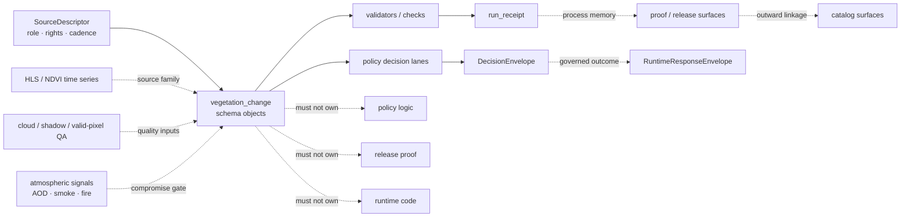

<!-- [KFM_META_BLOCK_V2]
doc_id: kfm://doc/NEEDS_VERIFICATION__schemas_vegetation_change_readme
title: schemas/vegetation_change
type: standard
version: v1
status: draft
owners: @bartytime4life
created: NEEDS_VERIFICATION__YYYY-MM-DD
updated: 2026-04-15
policy_label: public
related: [../README.md, ../contracts/README.md, ../soil_moisture/README.md, ../tests/README.md, ../../contracts/README.md, ../../docs/standards/README.md, ../../policy/README.md, ../../tests/README.md, ../../tests/contracts/README.md, ../../.github/workflows/README.md]
tags: [kfm, schemas, vegetation-change, change-detection, ndvi, spec_hash]
notes: [Revised from the existing schemas/vegetation_change README baseline. Public-tree path existence is supported by the attached baseline, but exact leaf inventory beyond README, narrower /schemas ownership, final schema-home authority, and active-branch consumers remain NEEDS VERIFICATION.]
[/KFM_META_BLOCK_V2] -->

<a id="top"></a>

# `schemas/vegetation_change/`

Schema-side landing page for vegetation-change object shapes, semantics, and validation boundaries.

> [!NOTE]
> **Status:** `experimental`  
> **Owners:** `@bartytime4life`  
> **Path:** `schemas/vegetation_change/README.md`  
> 
> 
> 
> 
> 
>   
> **Quick jumps:** [Scope](#scope) · [Repo fit](#repo-fit) · [Accepted inputs](#accepted-inputs) · [Exclusions](#exclusions) · [Directory tree](#directory-tree) · [Quickstart](#quickstart) · [Usage](#usage) · [Diagram](#diagram) · [Tables](#tables) · [Task list](#task-list--definition-of-done) · [FAQ](#faq) · [Appendix](#appendix)

> [!IMPORTANT]
> This README documents a **schema lane**, not mounted implementation proof. Its job is to make vegetation-change object boundaries reviewable and machine-checkable without inventing validators, workflows, or sibling schema files that the active branch has not yet proven.

> [!WARNING]
> Keep the split explicit: **schema ≠ receipt ≠ proof ≠ catalog ≠ runtime**. This leaf should help reviewers reason about vegetation-change object shape and semantics without quietly settling the repo’s still-visible `contracts/` versus `schemas/` authority tension.

| Field | Value |
|---|---|
| Path | `schemas/vegetation_change/` |
| Role | `shape and vocabulary for vegetation-change objects before validator, policy, proof, and publication surfaces widen` |
| Posture | `schema-first · authority-aware · reviewable · non-executable` |
| Typical object pressure | candidate signal · QA summary · atmospheric gate · decision handoff · manifest compatibility |
| Current public posture | Path is real; checked-in leaf inventory beyond `README.md` remains **NEEDS VERIFICATION** |
| Trust reminder | `schema ≠ receipt ≠ proof ≠ catalog ≠ runtime` |

---

## Scope

`schemas/vegetation_change/` is the schema-side lane for **vegetation-change-specific object shapes** and their smallest supporting notes.

This lane exists because “change” is easy to flatten incorrectly. A generic NDVI delta, raster diff, or land-cover alert object is not enough when the burden includes:

- pre- and post-collection identity
- season or baseline basis
- cloud / shadow / valid-pixel quality state
- atmospheric compromise versus true surface change
- patch- and area-based summary metrics
- raw candidate signal versus governed decision output
- deterministic identity pressure such as `spec_hash`
- downstream handoff into receipts, proofs, runtime envelopes, and correction paths without collapsing those objects together

### Truth labels used in this README

| Label | Meaning here |
|---|---|
| **CONFIRMED** | Supported by the attached baseline or adjacent public KFM documentation referenced there |
| **INFERRED** | Conservative reading that fits confirmed repo and doctrinal evidence, but is not directly verified as mounted leaf reality |
| **PROPOSED** | Commit-ready structure or practice that fits KFM doctrine but is not asserted as current branch fact |
| **UNKNOWN** | Not surfaced strongly enough to describe as settled |
| **NEEDS VERIFICATION** | Important enough to keep visible before merge or rollout |

### What this lane is for

- vegetation-change object shapes
- field-level semantic notes
- explicit pre/post collection and time-basis rules
- quality-mask and atmospheric-gate distinctions
- raw-signal versus governed-decision distinctions
- tiny illustrative examples when clearly labeled
- compatibility notes that help validators and tests pressure the right things

[Back to top](#top)

---

## Repo fit

This path is explicit in the public tree, but the baseline says the checked-in raw file body was empty. Treat this README as the leaf boundary the tree already implies, not as proof that sibling schema files, validators, or merge-blocking workflows already exist.

### Current evidence posture

| Surface | Status | Why it matters |
|---|---|---|
| `schemas/vegetation_change/README.md` path exists on public `main` | **CONFIRMED** | This leaf is not hypothetical. |
| Raw checked-in README body was empty | **CONFIRMED** | A real path exists, but the human boundary had not yet been authored. |
| `schemas/` is a real parent subtree | **CONFIRMED** | This leaf should read like a child schema lane, not an isolated scratch note. |
| `schemas/contracts/` and `schemas/contracts/v1/` are visible adjacent schema families | **CONFIRMED** | Vegetation-change schema language should stay legible beside first-wave machine-contract families. |
| `schemas/tests/` is a visible schema-side fixture scaffold | **CONFIRMED** | This leaf can reference schema-side fixture pressure without silently absorbing test authority. |
| `schemas/soil_moisture/README.md` is a live sibling schema leaf | **CONFIRMED** | It provides the nearest current on-repo style and burden analogue. |
| Exact `schemas/vegetation_change/` leaf inventory beyond `README.md` | **NEEDS VERIFICATION** | This README must not pretend to know mounted sibling files. |
| Vegetation-change object families for candidate, QA, atmospheric gate, decision input/output, and manifest handoff | **PROPOSED** | Strongly pressured by doctrine and nearby change-detection work, but not directly surfaced here as checked-in machine files. |

### Adjacent surfaces that matter

| Direction | Surface | Relationship |
|---|---|---|
| Parent | [`../README.md`](../README.md) | Parent schema boundary and subtree context |
| Adjacent | [`../contracts/README.md`](../contracts/README.md) | Schema-side contract scaffold lane |
| Adjacent | [`../soil_moisture/README.md`](../soil_moisture/README.md) | Closest live top-level schema-leaf precedent |
| Adjacent | [`../tests/README.md`](../tests/README.md) | Schema-side fixture scaffold that should stay distinct from repo-wide governed verification |
| Downstream authority | [`../../contracts/README.md`](../../contracts/README.md) | Human-readable contract meaning still leans here more strongly than anywhere else explicitly cited |
| Downstream policy | [`../../policy/README.md`](../../policy/README.md) | Threshold law, reasons, obligations, and allow/deny semantics belong there |
| Downstream verification | [`../../tests/README.md`](../../tests/README.md) | Repo-wide proof surface that should pressure-test these shapes |
| Contract-facing verification | [`../../tests/contracts/README.md`](../../tests/contracts/README.md) | Contract examples and schema drift checks should stay reviewable there |
| Workflow boundary | [`../../.github/workflows/README.md`](../../.github/workflows/README.md) | Automation intent belongs there, not in schema prose |
| Standards boundary | [`../../docs/standards/README.md`](../../docs/standards/README.md) | Cross-cutting profile and doctrine routing stays there |

> [!TIP]
> Keep the split visible: **shape and vocabulary here, human-readable contract meaning nearby, verification downstream, publication later**.

[Back to top](#top)

---

## Accepted inputs

This lane should hold **schema-facing**, **reviewable**, and **narrowly scoped** materials.

| Input class | Examples | Why it belongs here | Status |
|---|---|---|---|
| Vegetation-change JSON Schema drafts | `change_candidate`, `qa_summary`, `atmospheric_gate`, `decision_input`, `decision_output`, `candidate_manifest` | Makes domain-specific structure machine-checkable | **PROPOSED file form** |
| Field registries / enum notes | `season`, `baseline_kind`, `qa_state`, `source_family`, `decision_basis` | Prevents silent semantics drift | **INFERRED / PROPOSED** |
| Small illustrative payload fragments | one AOI, one pre/post pair, one result example | Helps reviewers see intended shape without claiming mounted fixtures | **PROPOSED** |
| Schema notes tied to source posture | HLS / Landsat / Sentinel pairing, QA masks, atmospheric compromise handling, source-role distinctions | Keeps source-risk consequences visible at the shape level | **CONFIRMED doctrine / PROPOSED local expression** |
| Compatibility notes | `spec_hash`, `run_receipt`, `DecisionEnvelope`, `EvidenceBundle`, runtime-envelope compatibility notes | Keeps downstream seams explicit without moving authority out of contracts or policy | **INFERRED / PROPOSED** |
| Version notes | breaking / non-breaking schema commentary | Reduces silent envelope drift | **PROPOSED** |

### What belongs here

- vegetation-change object shapes
- field-level semantic notes
- explicit pre/post collection and time-basis rules
- quality-mask and atmospheric-gate distinctions
- raw-signal versus governed-decision distinctions
- tiny illustrative examples when clearly labeled
- compatibility notes that help tests and validators pressure the right things

[Back to top](#top)

---

## Exclusions

| Does **not** belong here | Put it here instead | Why |
|---|---|---|
| Human-readable contract law | [`../../contracts/README.md`](../../contracts/README.md) | This leaf should support contract meaning, not replace it |
| Policy bundles, threshold law, reasons, obligations, or decision logic | [`../../policy/README.md`](../../policy/README.md) | Policy remains the source of truth for allow/deny behavior |
| Repo-wide governed verification guidance | [`../../tests/README.md`](../../tests/README.md) | Tests pressure schema law; they do not originate here |
| Raw provider snapshots, large COGs, or packaged NDVI diffs | Governed data or fixture lanes | This path is for shapes, not archives |
| `run_receipt`, proof bundles, signatures, or rollback records as primary objects | Receipt / proof / release lanes | Schema meaning must not collapse machine memory, proof, and publication into one file |
| Live watcher / pipeline / runtime code | Application, package, pipeline, or tool lanes | This README is not implementation proof |
| Workflow YAML and merge-gate logic | [`../../.github/workflows/README.md`](../../.github/workflows/README.md) | Execution belongs in the control plane |
| Prose that quietly settles `contracts/` versus `schemas/` authority | Repo-wide contract/schema decision | This leaf should stay truthful about the unresolved seam |

> [!CAUTION]
> A well-written schema README is still not proof of scheduling, signing, promotion, catalog closure, or runtime enforcement on the active branch.

[Back to top](#top)

---

## Directory tree

### Current safe claim

```text
schemas/
└── vegetation_change/
    └── README.md
```

That is the only subtree claim this README makes as current-branch fact.

### Preferred growth shape (`PROPOSED` / `NEEDS VERIFICATION`)

```text
schemas/
└── vegetation_change/
    ├── README.md
    ├── change_candidate.schema.json
    ├── qa_summary.schema.json
    ├── atmospheric_gate.schema.json
    ├── decision_input.schema.json
    ├── decision_output.schema.json
    └── candidate_manifest.schema.json
```

> [!TIP]
> Add only the files the active branch can actually support. A smaller truthful subtree is better than a broad speculative one.

[Back to top](#top)

---

## Quickstart

Use inspection-first commands so this leaf stays honest as the branch evolves.

### 1) Confirm what is actually mounted

```bash
find schemas -maxdepth 4 -print 2>/dev/null | sort
find schemas/vegetation_change -maxdepth 4 -print 2>/dev/null | sort
```

### 2) Re-read the adjacent authority surfaces

```bash
sed -n '1,220p' schemas/README.md 2>/dev/null || true
sed -n '1,220p' schemas/soil_moisture/README.md 2>/dev/null || true
sed -n '1,240p' schemas/contracts/README.md 2>/dev/null || true
sed -n '1,240p' schemas/contracts/v1/README.md 2>/dev/null || true
sed -n '1,220p' schemas/tests/README.md 2>/dev/null || true
sed -n '1,240p' contracts/README.md 2>/dev/null || true
sed -n '1,220p' docs/standards/README.md 2>/dev/null || true
sed -n '1,220p' policy/README.md 2>/dev/null || true
sed -n '1,220p' tests/README.md 2>/dev/null || true
sed -n '1,220p' .github/workflows/README.md 2>/dev/null || true
```

### 3) Reconfirm vegetation-change vocabulary before adding new shapes

```bash
grep -RIn \
  -e 'vegetation change' \
  -e 'NDVI' \
  -e 'HLS' \
  -e 'cloud_prob' \
  -e 'shadow_mask' \
  -e 'spec_hash' \
  -e 'run_receipt' \
  -e 'DecisionEnvelope' \
  -e 'EvidenceBundle' \
  schemas contracts policy tests docs tools pipelines 2>/dev/null || true
```

### 4) Add the smallest useful schema first

Start narrow, not broad:

1. one **change candidate** shape
2. one **QA summary** shape
3. one **atmospheric gate** shape only after QA semantics are stable
4. one **decision input / output** shape only after the execution seam is clear
5. one passing example and one failing example before claiming schema readiness

### 5) Document the real consumer only after it exists

If this leaf gains validators, fixtures, downstream consumers, or workflow callers, document the **actual** checked-in path and invocation.

Do not leave guessed runner, endpoint, or workflow commands behind.

[Back to top](#top)

---

## Usage

### Why this lane should exist at all

KFM doctrine treats machine-readable trust objects as first-class and repeatedly presses for explicit proof objects, finite decision grammar, deterministic identity, and visible release/runtime boundaries.

That pressure matters for vegetation change because a single “change detected” object can quietly conflate:

- observation and interpretation
- surface change and atmospheric interference
- thresholding and decision policy
- raw raster math and outward claim readiness
- deterministic execution memory and release-grade proof

A good schema leaf makes those distinctions harder to blur.

### Working rules

1. Keep **pre** and **post** collection identity explicit.
2. Keep **season** or **baseline** basis explicit.
3. Keep **QA / cloud / shadow** semantics explicit.
4. Keep **atmospheric compromise** separate from surface-change metrics.
5. Do not silently mix **raw candidate signals** with **governed decisions**.
6. Keep **observation window**, **fetch time**, **normalization time**, and **promotion time** distinct.
7. Preserve the split **schema ≠ receipt ≠ proof ≠ catalog**.
8. Make `spec_hash` compatibility visible when an object participates in deterministic candidate identity.
9. Keep area / patch / median-delta summaries reviewable rather than hiding them inside prose.

### Illustrative minimal payload

> [!NOTE]
> The shape below is illustrative only. It makes the semantic burden concrete without pretending the final key names or mounted schema family are already verified.

```json
{
  "source_family": "hls_ndvi",
  "source_role": "derived_surface_change_candidate",
  "aoi_id": "demo_aoi_001",
  "pre": {
    "collection_id": "hls_pre_2026_04_01_15",
    "window": "2026-04-01/2026-04-15"
  },
  "post": {
    "collection_id": "hls_post_2026_04_16_30",
    "window": "2026-04-16/2026-04-30"
  },
  "season": "greenup",
  "qa": {
    "cloud_prob_band": "post.cloud_prob",
    "shadow_mask_band": "post.shadow_mask",
    "qa_pass_pct": 0.93
  },
  "atmospheric_gate": {
    "aod_state": "clear",
    "fire_mask_applied": true,
    "smoke_state": "clear"
  },
  "metrics": {
    "area_pct": 3.4,
    "median_delta": 0.18,
    "largest_patch_ha": 0.7
  },
  "spec_hash": "sha256:REPLACE_WITH_REAL_HASH",
  "derived": true
}
```

### Boundary matrix

| Surface | What it is | What it is not |
|---|---|---|
| Schema object | Shape and semantic law for a vegetation-change object | Not the record that a run succeeded |
| `run_receipt` | Compact machine-readable process memory | Not the release-grade proof bundle |
| Proof / attestation bundle | Verifiable trust object for release-significant material | Not the schema leaf itself |
| Catalog object | Discoverability and outward linkage surface | Not the source-admission or policy-decision state |
| Runtime envelope | Outward answer / abstain / deny / error accountability surface | Not the raw candidate signal |

[Back to top](#top)

---

## Diagram



[Back to top](#top)

---

## Tables

### Object-family matrix

| Family | Why it matters | Safest current posture |
|---|---|---|
| `change_candidate` | Holds the smallest pre/post, QA, and metric surface before policy | **PROPOSED** |
| `qa_summary` | Prevents cloud/shadow/valid-pixel burden from disappearing into one boolean | **PROPOSED** |
| `atmospheric_gate` | Keeps smoke / aerosol / fire compromise explicit instead of quietly folded into “bad data” | **PROPOSED** |
| `decision_input` | Gives policy evaluation a typed handoff instead of free-form metrics blobs | **INFERRED / PROPOSED** |
| `decision_output` | Preserves finite outcome shape without flattening into release or runtime proof | **INFERRED / PROPOSED** |
| `candidate_manifest` | Connects deterministic identity and handoff before receipt / proof lanes widen | **PROPOSED** |

### Semantic pressure points

| Concern | Keep distinct | Why |
|---|---|---|
| Pre/post collection identity | `pre.collection_id` vs `post.collection_id` | Drift and replay become ambiguous otherwise |
| Time basis | Observation window vs fetch / normalization / promotion time | “Current” is not one timestamp |
| QA burden | Cloud / shadow / valid-pixel quality vs final decision | Quality failure is not the same as policy denial |
| Atmospheric burden | Smoke / AOD / fire compromise vs vegetation delta | False alerts hide here first |
| Signal burden | Raw change candidate vs outward governed decision | Candidate math should not masquerade as publication truth |
| Identity burden | `spec_hash` vs `run_receipt` vs proof bundle refs | Deterministic identity, process memory, and release proof are different jobs |

[Back to top](#top)

---

## Task list -- definition of done

### Immediate definition of done for this README

- [ ] Recheck the active branch before claiming any sibling schema files beyond `README.md`
- [ ] Keep `owners`, `path`, and relative links aligned with current repo evidence
- [ ] Keep parent `schemas/README.md` and this leaf consistent about current subtree reality
- [ ] Keep the `contracts/` versus `schemas/` authority seam visible instead of smoothing it away
- [ ] Keep vegetation-change examples explicitly labeled as illustrative until real machine files land
- [ ] Avoid inventing validators, workflow names, or runtime callers without direct branch proof
- [ ] Preserve the schema / receipt / proof / catalog boundary language

### Sensible next moves once the branch proves more

- [ ] Add one real `change_candidate.schema.json`
- [ ] Add one paired valid / invalid example
- [ ] Add one domain-specific vocabulary note for season / baseline / QA / atmospheric state
- [ ] Add one downstream validator link once checked in
- [ ] Add one contract-facing test reference once surfaced
- [ ] Add one standards-profile link if vegetation-change publication becomes formalized
- [ ] Add one real consumer path only after code or workflow evidence exists

[Back to top](#top)

---

## FAQ

### Why is this under `schemas/` instead of `contracts/`?

Because the public tree already places `vegetation_change/` under `schemas/`. This README follows that visible lane while keeping canonical schema-home authority explicitly unresolved.

### Does this README prove a working vegetation-change pipeline already exists?

No. It proves the leaf path exists and gives that path a truthful boundary document. Validators, workflows, runtime emitters, and release logic remain separate burdens and still need direct proof.

### Why separate atmospheric compromise from vegetation-change metrics?

Because change can be distorted by haze, smoke, or fire context. Even when those fields are only schema pressure right now, keeping them explicit prevents noisy metrics from looking more certain than they are.

### Should this lane own thresholds and pass/fail logic?

No. Threshold law, reasons, obligations, and allow/deny semantics belong to policy and downstream validator surfaces, not to the schema leaf itself.

### Why keep `spec_hash` visible if this is only a schema lane?

Because vegetation-change work is unusually sensitive to replay, diff, and handoff identity. The schema leaf should at least stay compatible with deterministic identity pressure even if receipts and proofs live elsewhere.

[Back to top](#top)

---

## Appendix

<details>
<summary><strong>Appendix A — Current evidence boundary used for this README</strong></summary>

This README is grounded in three layers:

1. the current public repo-tree statements preserved in the baseline for `schemas/` and `schemas/vegetation_change/`,
2. live sibling schema-lane reading implied by the baseline through `schemas/soil_moisture/README.md`,
3. current KFM doctrine emphasizing explicit proof objects, finite decisions, deterministic identity, and fail-closed boundaries.

That means this file can safely describe:

- the existing leaf path
- the previously empty README body
- the role of a schema-side vegetation-change lane
- the safest current-boundary interpretation

It should **not** claim:

- mounted sibling schema files
- checked-in validator inventory
- executable workflows
- merge-blocking enforcement
- published proof packs
- live runtime consumers
- final authority resolution between `contracts/` and `schemas/`

</details>

<details>
<summary><strong>Appendix B — Direct verification still needed before merge</strong></summary>

Before treating this README as fully settled local-checkout documentation, verify:

1. whether `schemas/vegetation_change/` now contains schema files beyond `README.md`
2. whether any root-side `contracts/vegetation_change/` or equivalent companion lane exists
3. whether `tests/contracts/` already carries vegetation-change cases
4. whether any `tools/validators/` or `pipelines/` surface now consumes this leaf
5. whether the active branch has narrower `/schemas/` ownership than the public fallback
6. whether policy labels or reviewer expectations differ from this draft
7. whether any release or runtime surface has already standardized vegetation-change object names

</details>

[Back to top](#top)
