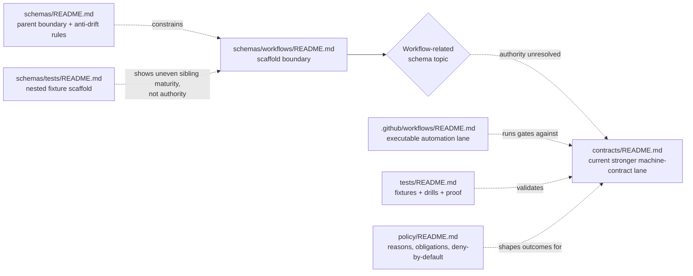

<!-- [KFM_META_BLOCK_V2]
doc_id: kfm://doc/<NEEDS_VERIFICATION_UUID>
title: Workflow Schemas
type: standard
version: v1
status: draft
owners: @bartytime4life
created: <NEEDS_VERIFICATION_YYYY-MM-DD>
updated: <NEEDS_VERIFICATION_YYYY-MM-DD>
policy_label: <NEEDS_VERIFICATION_POLICY_LABEL>
related: [schemas/README.md, contracts/README.md, .github/workflows/README.md, tests/README.md, docs/standards/README.md, policy/README.md]
tags: [kfm, schemas, workflows, contracts, ci-cd]
notes: [current public subtree is scaffold-only for this lane, owner is confirmed from current public .github/CODEOWNERS global fallback, doc_id/dates/policy_label still need repo-history or governance verification]
[/KFM_META_BLOCK_V2] -->

# Workflow Schemas

Boundary guide for the `schemas/workflows/` scaffold while KFM keeps workflow automation, machine contracts, policy, and verification in distinct governed lanes.

> **Status:** experimental · **Doc status:** draft  
> **Owners:** `@bartytime4life` *(current public `.github/CODEOWNERS` global fallback; no narrower `/schemas/` or `/schemas/workflows/` rule is visible on public `main`)*  
>        
> **Repo fit:** path `schemas/workflows/README.md` · parent [`../README.md`](../README.md) · current machine-contract lane [`../../contracts/README.md`](../../contracts/README.md) · executable workflow lane [`../../.github/workflows/README.md`](../../.github/workflows/README.md) · fixtures and drills [`../../tests/README.md`](../../tests/README.md) · policy surface [`../../policy/README.md`](../../policy/README.md)  
> **Quick jumps:** [Scope](#scope) · [Repo fit](#repo-fit) · [Accepted inputs](#accepted-inputs) · [Exclusions](#exclusions) · [Current verified snapshot](#current-verified-snapshot) · [Directory tree](#directory-tree) · [Quickstart](#quickstart) · [Usage](#usage) · [Diagram](#diagram) · [Operating tables](#operating-tables) · [Task list](#task-list--definition-of-done) · [FAQ](#faq) · [Appendix](#appendix)

> [!IMPORTANT]
> Current public `main` shows `schemas/workflows/` containing `README.md` only.
> Treat this subtree as a **scaffold and boundary surface**, not as evidence of a mounted workflow-schema registry.

> [!WARNING]
> `schemas/workflows/` is **not** the GitHub Actions execution lane.
> Checked-in automation belongs in [`../../.github/workflows/`](../../.github/workflows/), while machine-readable contract authority remains aligned more strongly with [`../../contracts/`](../../contracts/) until the repo resolves schema-home law explicitly.

> [!NOTE]
> [`../../.github/workflows/README.md`](../../.github/workflows/README.md) records historical workflow activity and deleted workflow filenames as **historical signal only**.
> That is useful context, but it is **not** proof that those YAML files are currently checked in on public `main`.

> [!NOTE]
> The parent [`../README.md`](../README.md) still carries older inventory language that describes `schemas/` as `README.md`-only.
> The live public subtree now visibly includes `contracts/`, `schemas/`, `standards/`, `tests/`, and `workflows`, with `schemas/tests/` already exposing a nested `fixtures/` scaffold.
> Use live tree inspection before repeating the older parent snapshot wording.

---

## Scope

`schemas/workflows/` exists to keep one narrow question clear:

**If KFM later needs workflow-adjacent machine-readable objects, where do they belong, and how do they avoid becoming a shadow authority surface?**

Right now, the safest answer is conservative:

- this directory may document the boundary and future intent of workflow-related schema work
- it should not quietly become the canonical home for trust-bearing workflow contracts
- it should not duplicate the role of `../../.github/workflows/`, `../../contracts/`, `../../policy/`, or `../../tests/`

In other words, this README should help maintainers distinguish four different things that are easy to blur together:

1. **workflow execution** — GitHub Actions YAML and automation policy in `.github/workflows/`
2. **workflow-governed object shapes** — trust-bearing machine contracts, currently signaled more strongly through `../../contracts/`
3. **policy outcomes and vocabularies** — deny-by-default logic, reasons, obligations, and visible negative states in `../../policy/`
4. **fixtures and proof** — valid/invalid examples, drills, and verification families in `../../tests/`

### Truth posture used in this README

| Marker | Meaning here |
| --- | --- |
| **CONFIRMED** | Directly supported by the current public repo tree or durable KFM doctrine visible in this review |
| **INFERRED** | Strongly suggested by adjacent repo docs and directory relationships, but not yet hardened as an explicit repo decision |
| **PROPOSED** | A repo-native next shape or placement rule that fits KFM doctrine but is not yet proven as live implementation |
| **UNKNOWN / NEEDS VERIFICATION** | Anything that depends on uninspected branch history, missing ADRs, exact workflow YAML, or a settled schema-home decision |

[Back to top](#workflow-schemas)

## Repo fit

| Item | Value |
| --- | --- |
| Path | `schemas/workflows/README.md` |
| Role | Directory README for the workflow-oriented schema scaffold under `schemas/` |
| Current public `main` snapshot | `schemas/workflows/` contains `README.md` only |
| Parent lane | [`../README.md`](../README.md) documents `schemas/` as a boundary surface while schema-home authority remains unresolved |
| Stronger current machine-contract signal | [`../../contracts/README.md`](../../contracts/README.md) |
| Workflow execution surface | [`../../.github/workflows/README.md`](../../.github/workflows/README.md) |
| Verification surface | [`../../tests/README.md`](../../tests/README.md) |
| Policy surface | [`../../policy/README.md`](../../policy/README.md) |
| Standards routing signal | [`../../docs/standards/README.md`](../../docs/standards/README.md) routes API endpoint schemas and machine contracts away from standards and toward `../../contracts/` |
| Owner signal | `@bartytime4life` via current public `.github/CODEOWNERS` global fallback |
| Current authority posture | **UNKNOWN / NEEDS VERIFICATION** — no explicit repo decision was directly verified that makes `schemas/workflows/` canonical for workflow-adjacent trust objects |

### Upstream, adjacent, and downstream links

| Relation | Path | Why it matters |
| --- | --- | --- |
| Upstream | [`../README.md`](../README.md) | Sets the `schemas/` boundary and warns against parallel schema law |
| Adjacent | [`../../contracts/README.md`](../../contracts/README.md) | Current strongest lane for machine-readable contract publication |
| Adjacent | [`../../.github/workflows/README.md`](../../.github/workflows/README.md) | Separates executable automation from schema/topic documentation |
| Adjacent | [`../../policy/README.md`](../../policy/README.md) | Keeps policy bundles and outcome vocabularies out of schema drift |
| Adjacent | [`../../tests/README.md`](../../tests/README.md) | Keeps fixtures, drills, and proof burdens in the governed verification lane |
| Adjacent | [`../../docs/standards/README.md`](../../docs/standards/README.md) | Keeps profile and standards guidance separate from contract execution and workflow YAML |

[Back to top](#workflow-schemas)

## Accepted inputs

### Accepted **now**

| Belongs here right now | Why |
| --- | --- |
| This README and closely related boundary guidance | The subtree currently exists as a scaffold and needs an explicit contract of use |
| ADR references or migration notes that explain future workflow-schema placement | They can narrow ambiguity without silently creating a second authority surface |
| Non-authoritative mapping notes that point workflow-related object families to their current stronger homes | They help reviewers keep execution, policy, contracts, and fixtures separate |

### Accepted **only after** an explicit authority decision

| Candidate artifact | Posture | Minimum condition before it belongs here |
| --- | --- | --- |
| Versioned workflow-adjacent schema files | **PROPOSED** | The repo must explicitly declare `schemas/` — or this subtree specifically — as an authoritative home for those objects |
| Workflow-telemetry or run-summary schemas | **PROPOSED** | Their contract family, ownership, fixture location, and validation gate must be documented together |
| Promotion, rollback, or post-deploy verification summary schemas | **PROPOSED** | The corresponding executable workflows and tests must exist, so the schema describes a real governed seam rather than a speculative placeholder |

### Minimum bar for any future artifact here

- authority is explicit, written down, and linked from sibling docs
- the object family has a real lifecycle seam in KFM
- valid and invalid fixtures have a confirmed home
- at least one deterministic validator or gate is identified
- `.github/workflows/`, `contracts/`, `tests/`, and `policy/` do not need to guess what this subtree means

## Exclusions

| Does **not** belong here | Put it here instead | Why |
| --- | --- | --- |
| GitHub Actions YAML, dispatch wiring, permissions, environment approvals | [`../../.github/workflows/`](../../.github/workflows/) | Execution and orchestration are different from schema/topic scaffolding |
| Trust-bearing workflow contracts while schema authority is unresolved | [`../../contracts/`](../../contracts/) or the later declared canonical home | Current repo signals still point machine contracts there more strongly |
| Policy bundles, reason codes, obligation codes, or reviewer-role registries | [`../../policy/`](../../policy/) | Policy must stay executable, reviewable, and distinct from schema topic organization |
| Valid/invalid fixtures, drill payloads, rollback proofs | [`../../tests/`](../../tests/) | Verification should stay tied to proof burdens, not drift into schema topic folders |
| Validator CLIs, helper scripts, or lint runners | [`../../tools/`](../../tools/) or [`../../scripts/`](../../scripts/) | Executable helpers should be discoverable as tooling, not hidden inside a schema scaffold |
| Release evidence, run receipts, attestation outputs, or published proof packs themselves | release / data / proof surfaces | Schemas describe these objects; they are not the emitted artifacts |

> [!CAUTION]
> The main failure mode here is **shadow authority**.
> A directory that starts as harmless scaffolding can become a second contract law surface if files accumulate faster than the repo’s authority rules do.

## Current verified snapshot

| Surface | Current public `main` state | What that means here |
| --- | --- | --- |
| `schemas/` | Real top-level directory with visible scaffold subdirectories | The schema lane is no longer literally README-only at tree level, even though some older parent doc text still says so |
| `schemas/workflows/` | `README.md` only | This subtree is still documentary scaffolding today |
| `schemas/contracts/` | `README.md` visible | A contract-adjacent schema sublane exists, but that does **not** settle canonical contract authority |
| `schemas/standards/` | `README.md` visible | A standards-adjacent schema sublane exists, but it is boundary-only today |
| `schemas/tests/` | `README.md` plus `fixtures/` scaffold visible | Maturity already varies across nested schema sublanes; `workflows/` should remain explicitly boundary-first unless authority changes |
| `.github/workflows/` | `README.md` only on public `main`; historical workflow names are documented as historical signal only | No checked-in workflow YAML was directly evidenced on public `main` in this review |
| `contracts/` | Real top-level lane with substantive README | Current strongest narrative signal for machine-contract publication |
| `tests/` | Real top-level lane with substantive README and visible verification subdirectories | The repo has a stronger verified verification surface than the `schemas/workflows/` scaffold |
| `docs/standards/` | README is substantive; adjacent standards descendants remain scaffold-only today | Standards remain a routing and profile lane, not the current machine-contract home |
| `.github/CODEOWNERS` | Global fallback `* @bartytime4life`; no narrower `/schemas/` or `/schemas/workflows/` rule is visible | Owner attribution for this file is grounded through fallback, not a workflow-schema-specific rule |

## Directory tree

### Current public snapshot

```text
schemas/
├── README.md
├── contracts/
│   └── README.md
├── schemas/
│   └── README.md
├── standards/
│   └── README.md
├── tests/
│   ├── README.md
│   └── fixtures/...
└── workflows/
    └── README.md
```

### Conservative working shape for **right now**

```text
schemas/workflows/
└── README.md
```

### Possible future shape **only if authority is resolved here**

```text
schemas/workflows/
├── README.md
├── v1/
│   ├── workflow_run_summary.schema.json
│   ├── promotion_outcome.schema.json
│   ├── postdeploy_verification_summary.schema.json
│   └── rollback_drill_report.schema.json
└── examples/
    ├── valid/
    └── invalid/
```

> [!NOTE]
> The future shape above is **illustrative and PROPOSED**.
> It is not a claim that these filenames, families, or locations already exist on the branch.

[Back to top](#workflow-schemas)

## Quickstart

Start by verifying the subtree and its neighbors before moving any workflow-adjacent contract discussion forward.

```bash
# 1) Inspect the subtree itself
find schemas/workflows -maxdepth 2 \( -type f -o -type d \) 2>/dev/null | sort

# 2) Read the parent and the sibling schema sub-lanes that already exist
sed -n '1,220p' schemas/README.md
sed -n '1,220p' schemas/contracts/README.md
sed -n '1,220p' schemas/standards/README.md
sed -n '1,260p' schemas/tests/README.md

# 3) Read the stronger current machine-contract lane and its execution / proof neighbors
sed -n '1,260p' contracts/README.md
sed -n '1,240p' .github/workflows/README.md
sed -n '1,260p' tests/README.md
sed -n '1,220p' policy/README.md
sed -n '1,220p' docs/standards/README.md

# 4) Search for authority language before adding files
rg -n "schema home|parallel schema|workflow|proof pack|run receipt" \
  schemas contracts policy tests .github docs 2>/dev/null
```

### Before adding the first non-README file here

1. Confirm whether the repo has resolved authoritative schema home.
2. Confirm whether the new artifact is describing **execution**, **contracts**, **policy**, or **verification**.
3. Update the sibling README surfaces in the same change.
4. Add or point to fixtures and a deterministic validation path.
5. Make rollback and deletion simple if the authority decision changes later.

## Usage

### Updating this README safely

1. Prefer corrections to inventory, path meaning, and boundary language over ambitious future-tree design.
2. Keep every claim tied to either current tree evidence or clearly labeled future intent.
3. When the live tree changes, reconcile this file with `../README.md` so the parent directory stops drifting.
4. If sibling `schemas/*/README.md` surfaces gain or lose scope, refresh the live-tree snapshot here in the same change.
5. If workflow YAML becomes real under `.github/workflows/`, update this file to preserve the separation between execution and schema/topic organization.

### Adding the first real artifact here

Only do this when all of the following are true:

- the repo has a documented schema-home decision
- the artifact would be misplaced in `.github/workflows/`, `contracts/`, `policy/`, `tests/`, `tools/`, and `scripts/`
- the object family is stable enough to justify a dedicated schema/topic home
- reviewers can tell, at a glance, whether the file is authoritative or documentary

### Preferred review questions

- Does this change create a second authority surface by accident?
- Is the artifact really about workflow **schema/topic placement**, or is it actually execution, policy, test data, or tooling?
- If this subtree were deleted tomorrow, would any trust-bearing contract law disappear with it?
- Did the same PR update the neighboring docs that a reviewer would naturally open next?

[Back to top](#workflow-schemas)

## Diagram



## Operating tables

### Placement matrix

| Change type | Put it in `schemas/workflows/` today? | Better home today | Why |
| --- | --- | --- | --- |
| Add a GitHub Actions workflow YAML | No | `.github/workflows/` | It is executable automation, not schema-topic scaffolding |
| Add a workflow-related contract schema | Usually no | `contracts/` until authority resolves | Current signals still make `contracts/` the stronger machine-contract lane |
| Add a policy outcome registry | No | `policy/` | Policy must remain executable and separately reviewable |
| Add valid/invalid workflow payload fixtures | No | `tests/` | Fixtures belong with governed verification |
| Correct or expand the boundary guidance for this subtree | Yes | `schemas/workflows/` | This README is the current authoritative meaning of the subtree |

### Current-state vs target-state summary

| Topic | Current state | Target-state direction |
| --- | --- | --- |
| Subtree maturity | README-only scaffold | Stay README-only until authority is explicit |
| Workflow execution | Separate README-only lane under `.github/workflows/` | Add executable YAML there, not here |
| Machine-contract publication | More strongly signaled through `contracts/` | Keep singular authority until an explicit move is documented |
| Verification | Root `tests/` lane is more real than this subtree today | Preserve fixture and drill ownership there unless repo law changes |
| Sibling schema sublanes | Mixed scaffold maturity under `schemas/` | Keep boundary lanes explicit and synchronized instead of letting them imply settled authority |

## Task list / definition of done

- [ ] `schemas/workflows/README.md` reflects the live public tree, not an older snapshot.
- [ ] The distinction between workflow execution and workflow-adjacent schema/topic placement is explicit.
- [ ] No new file in this subtree silently competes with `contracts/` as contract authority.
- [ ] Neighboring docs are updated in the same PR when authority language changes.
- [ ] Any live-tree note here stays synchronized with `schemas/README.md` and relevant sibling `schemas/*/README.md` surfaces.
- [ ] Any future artifact added here has a confirmed validator path and fixture strategy.
- [ ] Reviewers can tell whether this subtree is documentary, authoritative, or transitional without opening multiple unrelated files first.

## FAQ

### Why keep this directory at all if it is only scaffolding?

Because the public tree already exposes it. A visible scaffold without a boundary contract invites accidental overreach; a documented scaffold makes its limits reviewable.

### Is this where GitHub Actions workflow files should go?

No. Executable workflow files belong in [`../../.github/workflows/`](../../.github/workflows/).

### Should workflow-related schemas land here today?

Not by default. Current repo signals still route machine contracts more strongly through [`../../contracts/`](../../contracts/), and schema-home authority remains unresolved.

### What is the safest next improvement after this README?

Reconcile `schemas/README.md` with the live `schemas/` tree so the parent index stops understating current scaffold shape, then resolve schema-home authority explicitly before adding trust-bearing files.

## Appendix

<details>
<summary>Illustrative workflow-adjacent object families (PROPOSED, not branch-confirmed)</summary>

These examples are included to help reviewers think about category boundaries, not to assert that the repo already uses these names.

| Illustrative family | Likely semantic role | Better home today unless authority changes |
| --- | --- | --- |
| `workflow_run_summary` | Structured summary of what a governed workflow proved | `contracts/` |
| `promotion_outcome` | Outcome object for candidate-to-release promotion checks | `contracts/` |
| `postdeploy_verification_summary` | Structured report of post-deploy checks | `contracts/` or release-proof surfaces |
| `rollback_drill_report` | Artifact describing rollback rehearsal results | `contracts/` plus `tests/` drills |

</details>

[Back to top](#workflow-schemas)
