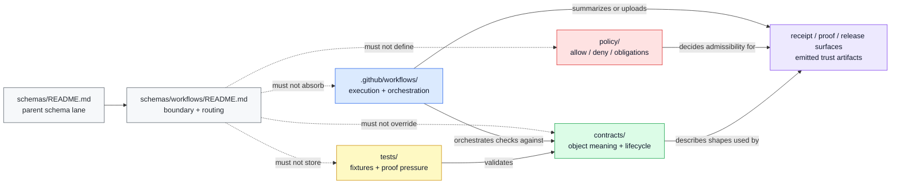

<!-- [KFM_META_BLOCK_V2]
doc_id: kfm://doc/NEEDS-VERIFICATION-schemas-workflows-readme
title: schemas/workflows
type: standard
version: v1
status: draft
owners: @bartytime4life
created: NEEDS-VERIFICATION
updated: 2026-04-23
policy_label: NEEDS-VERIFICATION
related: [../README.md, ../contracts/README.md, ../tests/README.md, ../standards/README.md, ../../contracts/README.md, ../../.github/workflows/README.md, ../../policy/README.md, ../../tests/README.md, ../../tests/contracts/README.md, ../../docs/standards/README.md]
tags: [kfm, schemas, workflows, contracts, verification]
notes: [doc_id, created date, policy_label, and narrower lane ownership need verification in the active checkout; updated date reflects this proposed revision; this README is a boundary and routing surface, not proof of workflow-schema implementation]
[/KFM_META_BLOCK_V2] -->

<a id="top"></a>

# `schemas/workflows`

Boundary README for workflow-shaped schema topics while KFM keeps executable workflows, contracts, policy, fixtures, validators, and proof artifacts in distinct governed lanes.

> [!IMPORTANT]
> **Status:** `experimental` · **Doc status:** `draft`  
> **Owners:** `@bartytime4life` *(fallback owner; narrower `/schemas/workflows/` ownership still needs verification)*  
> **Path:** `schemas/workflows/README.md`  
> **Repo fit:** child of [`../README.md`](../README.md); adjacent to schema-side contracts [`../contracts/README.md`](../contracts/README.md), schema-side fixtures [`../tests/README.md`](../tests/README.md), root contracts [`../../contracts/README.md`](../../contracts/README.md), executable workflows [`../../.github/workflows/README.md`](../../.github/workflows/README.md), policy [`../../policy/README.md`](../../policy/README.md), and governed verification [`../../tests/README.md`](../../tests/README.md)  
> **Quick jumps:** [Scope](#scope) · [Repo fit](#repo-fit) · [Accepted inputs](#accepted-inputs) · [Exclusions](#exclusions) · [Directory tree](#directory-tree) · [Quickstart](#quickstart) · [Usage](#usage) · [Diagram](#diagram) · [Operating tables](#operating-tables) · [Task list](#task-list--definition-of-done) · [FAQ](#faq) · [Appendix](#appendix)


> [!WARNING]
> `schemas/workflows/` is **not** the GitHub Actions execution lane. Workflow YAML, runner permissions, environment approvals, and merge gates belong under [`../../.github/workflows/`](../../.github/workflows/), not here.

> [!CAUTION]
> The main risk for this directory is **shadow authority**: workflow-shaped files can look harmless until they become a second place where KFM contract law, policy outcomes, or proof obligations are silently defined.

---

## Scope

`schemas/workflows/` answers one narrow placement question:

**If KFM later needs workflow-adjacent schema topics, how do those topics stay visible without becoming a duplicate source of truth?**

This lane may document boundary rules and future placement intent. It should not quietly become the canonical home for trust-bearing workflow contracts, policy decisions, CI wiring, emitted receipts, proof packs, or validator behavior.

KFM’s governing split remains:

```text
RAW -> WORK / QUARANTINE -> PROCESSED -> CATALOG / TRIPLET -> PUBLISHED
```

Workflow-shaped schema work must support that lifecycle. It must not bypass it.

### What this README preserves

| Boundary | This README keeps clear |
| --- | --- |
| **Workflow execution** | GitHub Actions YAML and orchestration belong in `.github/workflows/`. |
| **Object meaning** | Human-readable contract semantics belong in `contracts/` or the explicitly chosen canonical contract home. |
| **Machine shape** | Schema files belong only where schema-home authority is documented and linked. |
| **Policy outcomes** | Allow, deny, abstain, obligation, rights, and sensitivity logic belongs in `policy/`. |
| **Fixtures and proof** | Valid/invalid payloads, drills, and proof assertions belong in `tests/` or the chosen fixture home. |
| **Receipts and releases** | Emitted process memory and release evidence belong in governed receipt/proof/release surfaces, not in this README. |

### Truth posture used here

| Marker | Meaning in this README |
| --- | --- |
| **CONFIRMED** | Directly visible in the currently inspected public tree, surfaced project Markdown, or durable KFM doctrine. |
| **INFERRED** | Strongly suggested by neighboring docs and directory relationships, but not yet hardened by an explicit repo decision. |
| **PROPOSED** | Safe next-step guidance aligned to KFM doctrine, not asserted as implemented. |
| **UNKNOWN / NEEDS VERIFICATION** | Anything depending on active-checkout inventory, branch settings, workflow YAML, validator wiring, or schema-home authority. |

[Back to top](#top)

---

## Repo fit

| Item | Value |
| --- | --- |
| Path | `schemas/workflows/README.md` |
| Role | README-only boundary surface for workflow-shaped schema placement |
| Current working state | Documentary scaffold; no workflow-schema registry is claimed here |
| Parent lane | [`../README.md`](../README.md) |
| Schema-side siblings | [`../contracts/README.md`](../contracts/README.md), [`../tests/README.md`](../tests/README.md), [`../standards/README.md`](../standards/README.md) |
| Stronger current contract signal | [`../../contracts/README.md`](../../contracts/README.md) |
| Executable workflow surface | [`../../.github/workflows/README.md`](../../.github/workflows/README.md) |
| Policy surface | [`../../policy/README.md`](../../policy/README.md) |
| Verification surface | [`../../tests/README.md`](../../tests/README.md), [`../../tests/contracts/README.md`](../../tests/contracts/README.md) |
| Standards surface | [`../../docs/standards/README.md`](../../docs/standards/README.md) |
| Owner signal | `@bartytime4life` fallback; narrower lane owner is **NEEDS VERIFICATION** |
| Authority posture | **UNKNOWN / NEEDS VERIFICATION** — this directory is not canonical for workflow-adjacent trust objects unless a later ADR or repo decision says so. |

### Upstream, lateral, and downstream links

| Direction | Path | Why it matters |
| --- | --- | --- |
| Upstream | [`../README.md`](../README.md) | Parent schema boundary, live-tree index, and schema-home caution. |
| Lateral | [`../../contracts/README.md`](../../contracts/README.md) | Contract-first meaning and lifecycle semantics. |
| Lateral | [`../../.github/workflows/README.md`](../../.github/workflows/README.md) | Executable automation, CI orchestration, workflow permissions, and review handoff. |
| Lateral | [`../../policy/README.md`](../../policy/README.md) | Rights, sensitivity, allow/deny/obligation logic, and negative-state posture. |
| Lateral | [`../../tests/README.md`](../../tests/README.md) | Governed verification surface for fixtures, drills, and proof pressure. |
| Lateral | [`../../tests/contracts/README.md`](../../tests/contracts/README.md) | Contract-facing test and fixture pressure. |
| Lateral | [`../../docs/standards/README.md`](../../docs/standards/README.md) | Standards and profile routing; not a workflow execution surface. |
| Downstream | Future `schemas/workflows/*` files | **PROPOSED only** after schema-home authority, fixtures, validators, and sibling links are explicit. |

[Back to top](#top)

---

## Accepted inputs

### Accepted now

| Belongs here | Why it belongs here | Status |
| --- | --- | --- |
| This README | The visible directory needs a boundary contract so contributors do not infer authority from an empty scaffold. | **CONFIRMED path / PROPOSED replacement content** |
| Boundary guidance | Helps distinguish workflow schemas from workflow execution, contracts, policy, and tests. | **PROPOSED** |
| ADR links or migration notes | Can document future placement decisions without creating silent authority. | **PROPOSED** |
| Non-authoritative mapping notes | May point workflow-adjacent object families to stronger homes such as `contracts/`, `.github/workflows/`, `policy/`, and `tests/`. | **PROPOSED** |
| Sync notes for sibling READMEs | Keeps `schemas/README.md`, this file, and adjacent control-plane docs aligned. | **PROPOSED** |

### Accepted only after explicit authority is decided

| Candidate artifact | Posture | Minimum condition before it belongs here |
| --- | --- | --- |
| Versioned workflow-adjacent JSON Schemas | **PROPOSED** | A schema-home ADR or equivalent repo decision names this subtree as the canonical or delegated home. |
| Workflow run summary schema | **PROPOSED** | The corresponding workflow, fixture home, validator, and review use case are implemented or explicitly planned together. |
| Promotion / rollback / post-deploy summary schema | **PROPOSED** | Promotion, rollback, and proof surfaces are already defined elsewhere and this file only describes their shape. |
| Example payload fragments | **PROPOSED** | They are clearly illustrative or routed to the canonical fixture home. |

### Minimum bar for future files here

A future non-README file belongs here only when all of the following are true:

1. The repo has a documented schema-home decision.
2. The artifact is not better owned by `.github/workflows/`, `contracts/`, `policy/`, `tests/`, `tools/`, or runtime code.
3. The object family has a real KFM lifecycle seam.
4. Valid and invalid fixtures have a confirmed home.
5. A deterministic validator or review gate is named.
6. Neighboring READMEs are updated in the same PR.

[Back to top](#top)

---

## Exclusions

| Does **not** belong here | Put it here instead | Why |
| --- | --- | --- |
| GitHub Actions workflow YAML | [`../../.github/workflows/`](../../.github/workflows/) | Execution and runner control are not schema-boundary documentation. |
| Runner permissions, environment approvals, branch protection notes | [`../../.github/workflows/`](../../.github/workflows/) or governance docs | These are operational controls, not schema topic files. |
| Trust-bearing contract semantics | [`../../contracts/`](../../contracts/README.md) or the later declared canonical home | Meaning must stay with contract law, not drift into a boundary stub. |
| Policy bundles, reason codes, obligations, reviewer roles | [`../../policy/`](../../policy/README.md) | Policy must remain executable, auditable, and separately reviewable. |
| Valid/invalid fixtures or rollback drills | [`../../tests/`](../../tests/README.md) or a documented fixture home | Proof should not fork into schema topic folders. |
| Validator CLIs, lint runners, helper scripts | Tooling or script lanes after verification | Executable checks should be discoverable as tools, not hidden in schema prose. |
| Release evidence, run receipts, proof packs, published bundles | Governed receipt/proof/release surfaces | Schemas may describe these objects; emitted artifacts do not live here. |
| Runtime DTO handlers, API routes, UI components | App or package lanes | Runtime consumers reference contracts; they are not schema files. |

[Back to top](#top)

---

## Directory tree

### Current working shape

```text
schemas/workflows/
└── README.md
```

### Neighboring surfaces to inspect with it

```text
schemas/
├── README.md
├── contracts/
│   └── README.md
├── standards/
│   └── README.md
├── tests/
│   └── README.md
└── workflows/
    └── README.md

.github/
└── workflows/
    └── README.md

contracts/
└── README.md

policy/
└── README.md

tests/
├── README.md
└── contracts/
    └── README.md
```

### Possible future shape

> [!NOTE]
> This tree is illustrative and **PROPOSED**. It is not a claim that these files exist or that this directory is their final home.

```text
schemas/workflows/
├── README.md
├── v1/
│   ├── workflow_run_summary.schema.json
│   ├── promotion_outcome.schema.json
│   ├── postdeploy_verification_summary.schema.json
│   └── rollback_drill_report.schema.json
└── examples/
    ├── valid/
    └── invalid/
```

[Back to top](#top)

---

## Quickstart

Run these from the repository root before strengthening any claim about this lane.

```bash
# 1) Inspect this subtree.
find schemas/workflows -maxdepth 2 \( -type f -o -type d \) 2>/dev/null | sort

# 2) Read the parent and schema-side siblings.
sed -n '1,240p' schemas/README.md
sed -n '1,220p' schemas/contracts/README.md
sed -n '1,220p' schemas/standards/README.md
sed -n '1,260p' schemas/tests/README.md
sed -n '1,240p' schemas/workflows/README.md

# 3) Read the stronger execution, contract, policy, and verification surfaces.
sed -n '1,260p' .github/workflows/README.md
sed -n '1,260p' contracts/README.md
sed -n '1,220p' policy/README.md
sed -n '1,260p' tests/README.md
sed -n '1,240p' tests/contracts/README.md
sed -n '1,220p' docs/standards/README.md

# 4) Search for authority language before adding files.
rg -n "schema home|canonical schema|workflow schema|workflow_run|promotion_outcome|rollback_drill|run_receipt|proof pack" \
  schemas contracts policy tests .github docs 2>/dev/null
```

### Before adding the first non-README file here

1. Confirm schema-home authority.
2. Confirm whether the artifact describes execution, contract shape, policy, fixture data, or emitted proof.
3. Update `schemas/README.md` and adjacent contract/workflow/test docs in the same PR.
4. Add or point to valid/invalid fixtures.
5. Name a deterministic validator or gate.
6. Keep rollback simple if the placement decision changes.

[Back to top](#top)

---

## Usage

### For maintainers

Use this file as the local boundary contract for `schemas/workflows/`.

A good maintenance change improves routing, current-tree accuracy, authority clarity, or reviewability. A risky maintenance change adds schema-shaped files here before the repo has settled where workflow-adjacent object families should live.

### For contributors

Pick the most specific governed lane:

| Change you want to make | Start here |
| --- | --- |
| Add or revise workflow YAML | [`../../.github/workflows/`](../../.github/workflows/) |
| Define object meaning or lifecycle semantics | [`../../contracts/README.md`](../../contracts/README.md) |
| Add policy reasons, obligations, or allow/deny logic | [`../../policy/README.md`](../../policy/README.md) |
| Add valid/invalid examples or regression tests | [`../../tests/README.md`](../../tests/README.md) or [`../../tests/contracts/README.md`](../../tests/contracts/README.md) |
| Explain this directory’s boundary | `schemas/workflows/README.md` |
| Add future workflow-shaped schema files | Only after schema-home authority is explicit. |

### For reviewers

Reject a change to this subtree if it:

- creates a second contract authority surface by accident;
- hides workflow execution inside schema documentation;
- adds schema files without fixtures and validator routing;
- defines policy outcomes outside `policy/`;
- stores emitted receipts, proofs, or release artifacts here;
- fails to update neighboring READMEs when it changes authority language.

[Back to top](#top)

---

## Diagram



Reading rule: `schemas/workflows/` may point to these surfaces. It must not become them.

[Back to top](#top)

---

## Operating tables

### Placement matrix

| Change type | Put it in `schemas/workflows/` today? | Better home today | Why |
| --- | --- | --- | --- |
| README boundary correction | Yes | `schemas/workflows/README.md` | This file owns the local boundary. |
| GitHub Actions YAML | No | `.github/workflows/` | Execution belongs in the control plane. |
| Workflow-related contract schema | Usually no | `contracts/` or declared canonical schema home | Contract authority is unresolved; do not fork it by inertia. |
| Policy outcome registry | No | `policy/` | Policy must be executable and reviewable. |
| Valid/invalid workflow payload fixtures | No | `tests/` or declared fixture home | Fixtures prove behavior; they are not boundary prose. |
| Validator code | No | Tooling / validator lanes after verification | Executable enforcement should be visible as tooling. |
| Emitted run receipt or proof pack | No | receipt / proof / release surfaces | Instances are not schemas. |
| Proposed workflow-schema object list | Yes, with labels | Appendix or ADR link | Useful as routing guidance if clearly non-authoritative. |

### Current-state vs target-state summary

| Topic | Current state | Target-state direction |
| --- | --- | --- |
| This subtree | README-only boundary lane | Stay boundary-first until authority is explicit. |
| Workflow execution | Owned by `.github/workflows/` | Keep YAML, permissions, and gates there. |
| Object meaning | Stronger signal in `contracts/` | Keep semantic law singular. |
| Machine schema authority | **NEEDS VERIFICATION** | Decide by ADR or equivalent repo decision. |
| Fixtures | Stronger signal in `tests/` | Keep valid/invalid examples with governed verification. |
| Policy | Owned by `policy/` | Keep reasons, obligations, and deny logic outside schema folders. |
| Review posture | Experimental / draft | Mature only after fixtures, validators, workflow evidence, and docs agree. |

[Back to top](#top)

---

## Task list / definition of done

### Current README revision

- [x] Has one H1 and one-line purpose.
- [x] Includes a KFM Meta Block v2 with reviewable placeholders.
- [x] Includes status, owners, badges, repo fit, and quick jumps.
- [x] States accepted inputs and exclusions.
- [x] Separates workflow execution from workflow-shaped schema topics.
- [x] Includes a meaningful Mermaid diagram.
- [x] Includes verification-first quickstart commands.
- [x] Marks future object families as **PROPOSED**.

### Lane maturity gates

- [ ] Active checkout confirms the exact `schemas/workflows/` inventory.
- [ ] A schema-home authority decision is linked from `schemas/README.md`, `contracts/README.md`, and this file.
- [ ] Any future non-README file here has valid and invalid fixtures.
- [ ] Any future non-README file here has a deterministic validator or gate.
- [ ] `.github/workflows/` and this README stay synchronized when workflow YAML appears, moves, or is deleted.
- [ ] Policy, tests, contracts, and emitted proof objects remain in their own governed lanes.
- [ ] Narrower ownership is verified or intentionally left as fallback.
- [ ] The KFM meta block receives a stable `doc_id`, confirmed `created`, and confirmed `policy_label`.

[Back to top](#top)

---

## FAQ

### Is this where GitHub Actions files go?

No. Executable workflow files belong in [`../../.github/workflows/`](../../.github/workflows/).

### Should workflow-related schemas land here?

Not by default. This subtree is a workflow-shaped schema boundary, not a settled authority home. Workflow-related contract schemas should stay with `contracts/` or the explicitly declared canonical schema home until the repo decides otherwise.

### Why keep a README-only directory?

Because a visible scaffold without a boundary contract invites accidental overreach. This README makes the scaffold’s limits reviewable.

### What is the safest next improvement?

Resolve schema-home and fixture-home authority explicitly, then update `schemas/README.md`, `contracts/README.md`, `.github/workflows/README.md`, `tests/README.md`, and this README together.

### What should a reviewer ask first?

Ask whether the change describes workflow **execution**, workflow **contract shape**, workflow **policy**, workflow **fixtures**, or workflow **proof output**. The answer determines the lane.

[Back to top](#top)

---

## Appendix

<details>
<summary><strong>Illustrative workflow-adjacent object families</strong></summary>

These examples are **PROPOSED** and included only to clarify category boundaries.

| Illustrative family | Likely semantic role | Better home today unless authority changes |
| --- | --- | --- |
| `workflow_run_summary` | Structured summary of what a workflow checked or proved | `contracts/` or declared canonical schema home |
| `promotion_outcome` | Result object for candidate-to-release promotion checks | `contracts/`, promotion policy, and proof surfaces together |
| `postdeploy_verification_summary` | Structured report of post-deploy verification | `contracts/` plus `.github/workflows/` and `tests/` |
| `rollback_drill_report` | Structured rollback rehearsal output | `contracts/` plus `tests/` drills and proof surfaces |
| `workflow_receipt_ref` | Reference to process memory emitted by a workflow | receipt/proof contract surfaces, not this README alone |

</details>

<details>
<summary><strong>Sync checklist for future changes</strong></summary>

When this file changes meaning, review these neighboring files in the same PR:

- [`../README.md`](../README.md)
- [`../contracts/README.md`](../contracts/README.md)
- [`../tests/README.md`](../tests/README.md)
- [`../standards/README.md`](../standards/README.md)
- [`../../contracts/README.md`](../../contracts/README.md)
- [`../../.github/workflows/README.md`](../../.github/workflows/README.md)
- [`../../policy/README.md`](../../policy/README.md)
- [`../../tests/README.md`](../../tests/README.md)
- [`../../tests/contracts/README.md`](../../tests/contracts/README.md)
- [`../../docs/standards/README.md`](../../docs/standards/README.md)

If ownership changes, also verify CODEOWNERS in the active checkout.

</details>

<details>
<summary><strong>Maintainer shorthand</strong></summary>

**No workflow YAML here. No policy here. No fixtures here. No emitted proofs here. No contract authority by directory name alone.**

</details>

[Back to top](#top)