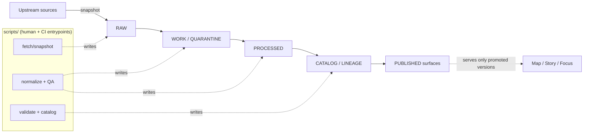

# `scripts/` — governed CLI entrypoints (KFM)

Purpose: small, focused command-line scripts that make KFM ingestion / validation / publishing tasks reproducible **without breaking governance invariants**.

**Status:** DRAFT (needs repo-specific wiring)  
**Owners:** _(UNKNOWN in repo — set CODEOWNERS / maintainers)_  
**Scope:** 🧰 utilities · 🧾 provenance-first · 🛡️ policy-aware · ♻️ reproducible

**Jump to:** [What belongs here](#what-belongs-here) · [Invariants](#invariants-you-must-not-break) · [Directory layout](#directory-layout) · [How to run](#how-to-run-scripts) · [Adding a script](#adding-a-script) · [Definition of Done](#definition-of-done)

---

## What belongs here

`scripts/` is for **human-invoked entrypoints** that wrap stable library code and enforce the KFM “truth path” lifecycle + audit trail.

Typical uses:

- Snapshot / fetch upstream sources into **RAW** (immutable) form
- Run QA / normalization steps in **WORK / QUARANTINE**
- Produce **PROCESSED** artifacts (publishable files) and checksums
- Generate / validate **CATALOG / LINEAGE** outputs (STAC / DCAT / PROV + run receipts)
- Developer utilities (e.g., link checks, schema checks, local smoke tests)

What does **not** belong here:

- Long-lived services (put those under `src/` and run via your app/runtime)
- “One-off” scripts that cannot be reproduced (either make them reproducible or don’t commit them)
- Anything that directly mutates **PUBLISHED** stores or bypasses governed APIs (see trust membrane)

> **Note (layout compatibility):** Some KFM layouts place stable utilities under `tools/` and pipelines under `src/pipelines/`. If this repo follows that pattern, keep `scripts/` as thin wrappers that call into those modules.

---

## Invariants you must not break

These are non-negotiable system rules. If you’re unsure, **fail closed**.

### 1) Truth path lifecycle

Scripts must write outputs into the correct lifecycle zone(s):

- **RAW:** immutable acquisition snapshots + checksums  
- **WORK / QUARANTINE:** intermediate transforms, QA, redaction candidates  
- **PROCESSED:** publishable artifacts + checksums  
- **CATALOG / LINEAGE:** cross-linked STAC/DCAT/PROV + run receipts  
- **PUBLISHED:** runtime surfaces serve **only promoted** dataset versions

Scripts may help generate candidate outputs for promotion, but **promotion itself must remain gated**.

### 2) Trust membrane

Scripts must not create “backdoors” around governance:

- No direct client → DB / object store access
- No core logic bypassing repository interfaces
- All runtime access flows through governed APIs that apply policy, redaction, and logging

### 3) Promotion is fail-closed

If any required evidence/metadata/policy is missing or invalid, promotion must be blocked.

**Promotion Contract (minimal gates):**

| Gate | What scripts must produce (or enable) |
|---|---|
| A | Source integrity: exact source ref + checksums; acquisition manifest |
| B | License clarity: license / rights holder recorded; “unknown license” blocks |
| C | Policy label + obligations recorded (redaction/generalization if needed) |
| D | Schema + geometry validation passes (for every artifact) |
| E | Provenance: run receipt + lineage links for inputs/outputs |
| F | Link-check / evidence resolution passes (no dead references) |
| G | Human sign-off where required (governance / SME) |

---

## How scripts fit the system



---

## Directory layout

This README does **not** assume your repo’s exact script list. Use this as a recommended shape:

```text
scripts/
  README.md
  ingest/        # snapshot/fetch + RAW writers
  transform/     # WORK/QUARANTINE normalization + QA helpers
  validate/      # schema + geometry + link check entrypoints
  publish/       # packaging of PROCESSED artifacts + catalog generation
  dev/           # local developer utilities (lint helpers, smoke tests)
```

If you already have a different structure, keep it — but document it here.

---

## How to run scripts

### Run from repo root

Scripts should assume they are executed from the repository root (or accept a `--repo-root` / `--workspace` flag).

### Always support `--help`

Every script must provide a clear help message describing:

- Inputs (source refs, dataset IDs, date ranges)
- Outputs (what files it writes and where)
- Zones it writes to (RAW / WORK / PROCESSED / CATALOG)
- Whether it emits a run receipt

### Recommended CLI contract

**Recommended flags (PROPOSED default):**

- `--dataset <dataset_id>`
- `--run-id <uuid-or-kfm-uri>` (optional; script generates if omitted)
- `--since / --until` (for time-bounded ingestion)
- `--out <path>` (or `--raw-dir`, `--work-dir`, `--processed-dir`, `--catalog-dir`)
- `--dry-run`
- `--emit-run-receipt <path>` (or default to a standard receipts location)

---

## Run receipts and logging

### Run receipts are mandatory for artifact-producing scripts

If a script writes or modifies artifacts intended for promotion, it must emit a **run receipt** that records:

- who/what ran it (actor, tool version/container digest)
- inputs + their checksums
- outputs + their checksums
- parameters
- policy decisions / redactions applied (or “none”)
- validation results

<details>
<summary>Minimal run receipt skeleton (JSON-LD style)</summary>

```json
{
  "@context": ["https://www.w3.org/ns/prov", "kfm://context/run-receipt/v1"],
  "type": "RunReceipt",
  "run_id": "kfm://run/UUID",
  "started_at": "2026-02-22T00:00:00Z",
  "ended_at": "2026-02-22T00:10:00Z",
  "actor": "user_or_ci",
  "software": {
    "name": "script_name",
    "version": "git:COMMIT_SHA",
    "container_digest": "sha256:..."
  },
  "inputs": [
    { "uri": "https://example/source", "sha256": "..." }
  ],
  "outputs": [
    { "path": "data/processed/...", "sha256": "...", "media_type": "application/x-parquet" }
  ],
  "checks": [
    { "name": "schema_validation", "result": "pass" }
  ],
  "policy": {
    "label": "public|restricted|...",
    "redactions": []
  }
}
```

</details>

### Logging requirements

Scripts should log in a way CI can parse:

- Include `run_id`, `dataset_id`, `step`, and `artifact_digest` when relevant
- Prefer structured logs (JSON) when running in CI
- Never print secrets

---

## Adding a script

### 1) Prefer library code + deterministic behavior

A script should be a small entrypoint that calls tested library functions. Aim for:

- idempotent outputs (same inputs → same outputs)
- stable sorting & stable JSON serialization where relevant
- explicit time bounds for “latest” / incremental fetches

### 2) Declare zones and outputs up front

Add a short header to each script (example):

```text
Script: scripts/ingest/<name>.py
Purpose: Snapshot <source> into RAW and write acquisition manifest
Writes: RAW
Emits: Run receipt (required)
Policy: default-deny if license/policy unknown
```

### 3) Update the registry

Maintain a small registry table below so contributors can discover what exists.

---

## Script registry

> Fill this in with the actual scripts present in this repo.

| Script | Purpose | Writes zones | Inputs | Outputs | Owner |
|---|---|---|---|---|---|
| _(add rows)_ |  |  |  |  |  |

---

## Definition of Done

A script is “done” when:

- [ ] Has `--help` with clear usage and I/O description
- [ ] Declares which truth-path zones it writes
- [ ] Fails closed on missing license / unclear rights / missing policy label
- [ ] Emits a run receipt when producing artifacts for promotion
- [ ] Produces checksums for all written artifacts
- [ ] Has at least one test (unit or golden-output) for deterministic behavior
- [ ] Does not bypass governed APIs / repository interfaces (trust membrane)
- [ ] Documented in the Script registry table above

---

## Notes and local conventions

- Avoid committing any credential material. Use environment variables and local secrets tooling.
- If handling sensitive locations or culturally restricted sites, do **not** output precise coordinates unless policy explicitly allows it. Prefer generalization and document the decision in the run receipt.

---

<a href="#scripts--governed-cli-entrypoints-kfm">Back to top</a>
