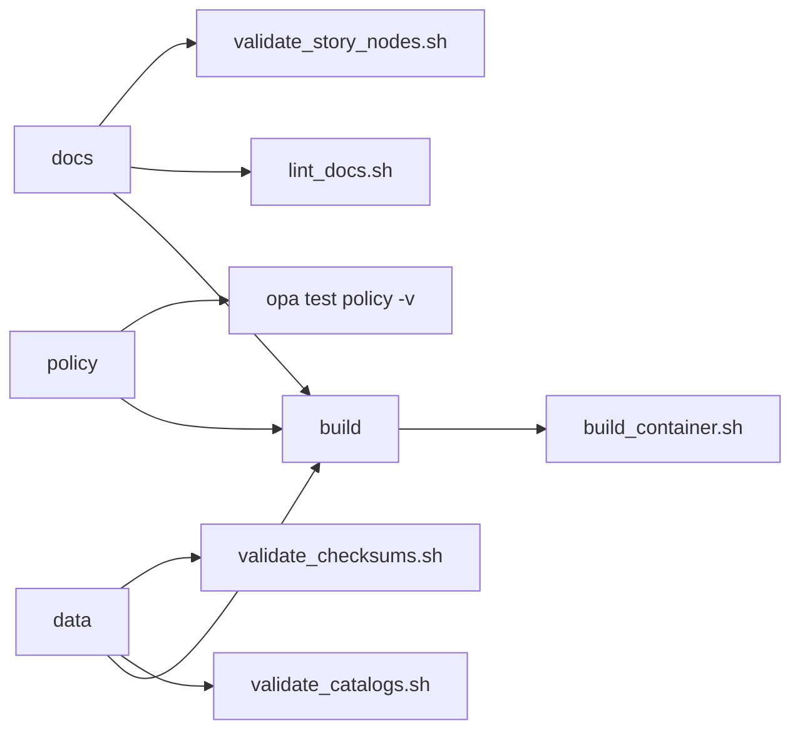

# scripts/

Stable **entrypoint scripts** used by CI and developers to run KFM’s **governance gates** (docs, story nodes, catalogs, checksums, policy tests, and build packaging).

> [!IMPORTANT]
> These scripts are part of KFM’s “hard invariants” / trust guarantees. They must **fail closed** and are expected to **block merges and/or promotion** when a governed artifact is invalid. (See the Next‑Gen Blueprint non‑negotiables and CI example.)  
> — Invariant examples include: *no UI direct DB access*, *dataset promotion only with STAC/DCAT/PROV*, and *policy checks fail closed*.:contentReference[oaicite:3]{index=3}

---

## What belongs in `scripts/`

### ✅ Yes
- Thin, stable **CLI wrappers** used by CI (e.g., `.github/workflows/*`) and local dev.
- Orchestration / “glue” that calls:
  - validators in `tools/`
  - schemas in `schemas/`
  - pipeline code in `src/pipelines/`
  - policy tests in `policy/` (if present)

### ❌ No
- Business logic / domain transformation code (that belongs under `src/`).
- One-off scripts that mutate governed data without producing run records, checksums, and catalogs (do that in the pipeline).

---

## Quick start (run locally)

Run from the **repo root**:

```bash
# Docs + Story Nodes
./scripts/lint_docs.sh
./scripts/validate_story_nodes.sh

# Data catalogs + integrity
./scripts/validate_catalogs.sh
./scripts/validate_checksums.sh

# Policy (example from blueprint CI workflow)
opa test policy -v

# Build packaging (example)
./scripts/build_container.sh
```

> [!TIP]
> If you see `permission denied`, run:
>
> ```bash
> chmod +x scripts/*.sh
> ```

---

## Script index

The following entrypoints are referenced by the Next‑Gen Blueprint CI example (treat these names as **stable interfaces** once adopted):​:contentReference[oaicite:4]{index=4}

| Script | Gate | Purpose | Typical inputs | Typical outputs |
|---|---|---|---|---|
| `lint_docs.sh` | Docs | Markdown linting, link checks, template compliance | `docs/`, `README.md` | CI log + optional report artifacts |
| `validate_story_nodes.sh` | Stories | Validate Story Node v3 structure, required fields, citations/refs (as enforced) | `docs/reports/story_nodes/**` | CI log + optional validation report |
| `validate_catalogs.sh` | Data | Validate catalog artifacts (STAC/DCAT/PROV) against schemas/profiles | `data/**/catalog/**` or `data/stac`, `data/catalog/dcat`, `data/prov` | CI log + optional validation report |
| `validate_checksums.sh` | Data | Verify deterministic checksums exist and match governed artifacts | processed assets + checksum manifests | CI log + optional diff/report |
| `build_container.sh` | Build | Build container image + supply-chain artifacts (SBOM/provenance) | Dockerfile + source | image + SBOM/provenance outputs |

> [!NOTE]
> The repo’s canonical directory layout (including `docs/`, `schemas/`, `src/`, `tools/`, `.github/`) is described in the Master Guide materials.:contentReference[oaicite:5]{index=5}:contentReference[oaicite:6]{index=6}

---

## CI mapping

A minimal CI hardening pattern described in the Next‑Gen Blueprint runs three primary gates plus build packaging:​:contentReference[oaicite:7]{index=7}



---

## Governance contract these scripts must enforce

### Promotion gates and “minimum validation gates”
KFM treats each ingest/publish as a governed workflow where promoted outputs must have:
- schema + geometry + time sanity checks
- license/attribution captured
- **PROV chain + deterministic checksums**
- catalogs emitted and clean (DCAT always; STAC/PROV as applicable)
- policy labeling/redaction for sensitive fields/locations  
These are explicitly described as minimum validation gates / DoD in the integration blueprint.:contentReference[oaicite:8]{index=8}:contentReference[oaicite:9]{index=9}

### “Trust membrane” and safety invariants
Scripts should never introduce shortcuts that bypass KFM’s trust membrane (e.g., UI bypassing API/policy). CI is one of the main enforcement points for those invariants.:contentReference[oaicite:10]{index=10}

---

## Conventions for script authors

### Shell safety and determinism
- Use strict mode:
  - `set -euo pipefail`
  - `IFS=$'\n\t'`
- Avoid non-determinism in reports (stable ordering; stable timestamps unless required).
- Prefer read-only checks; when writing artifacts, write to a designated build/report directory (and never silently modify governed sources).

### Exit codes
- `0` = success
- non‑zero = failure (CI must fail)

### Output expectations
- Human-readable summary to stdout/stderr.
- Optional machine-readable report (recommended):
  - JSON (validation report)
  - JUnit XML (CI annotations)
  - SARIF (security tooling)

### Cross-platform notes
- Assume CI runs Linux.
- If a script is intended for macOS/Windows local dev, document those constraints explicitly.

---

## Adding a new script

> [!CHECKLIST]
> Definition of Done for a new `scripts/*.sh` entrypoint:
>
> - [ ] Documented in this README (purpose + how to run)
> - [ ] Deterministic and idempotent
> - [ ] Does not bypass policy / trust membrane guarantees
> - [ ] Emits actionable failure messages
> - [ ] Has a basic `--help` output (recommended)
> - [ ] Wired into CI if it is a governance gate
> - [ ] Any new schemas/profiles it relies on are versioned in `schemas/` and referenced in docs

---

## Troubleshooting

- **“file not found” when running a script**
  - Run from repo root.
  - Verify paths referenced by the script match the repo directory layout described in the Master Guide materials.:contentReference[oaicite:11]{index=11}

- **Catalog validation fails**
  - Check that STAC/DCAT/PROV artifacts exist and validate before attempting promotion.
  - Verify checksums are computed and deterministic (promotion gates require this).:contentReference[oaicite:12]{index=12}:contentReference[oaicite:13]{index=13}

---

## Related docs (repo paths)

These are referenced as key governed artifacts and templates in the Markdown/Master Guide materials:​:contentReference[oaicite:14]{index=14}:contentReference[oaicite:15]{index=15}

- `docs/MASTER_GUIDE_v13.md`
- `docs/templates/TEMPLATE__KFM_UNIVERSAL_DOC.md`
- `docs/templates/TEMPLATE__STORY_NODE_V3.md`
- `docs/templates/TEMPLATE__API_CONTRACT_EXTENSION.md`
- `docs/standards/KFM_STAC_PROFILE.md`
- `docs/standards/KFM_DCAT_PROFILE.md`
- `docs/standards/KFM_PROV_PROFILE.md`
- `schemas/` (STAC/DCAT/PROV/storynodes/ui/telemetry schemas)

---

