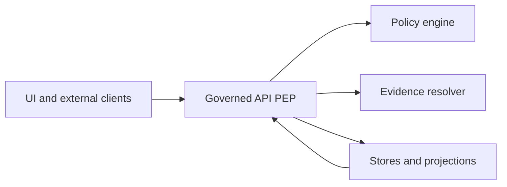

<!-- [KFM_META_BLOCK_V2]
doc_id: kfm://doc/9f9a88f5-4dd7-4ae9-8b64-5310a2b1f7fd
title: scripts/README.md
type: standard
version: v1
status: draft
owners: TBD (add CODEOWNERS rule)
created: 2026-02-26
updated: 2026-02-28
policy_label: public
related:
  - kfm://doc/<TBD>  # TODO: link to in-repo KFM governance/design guide
  - kfm://doc/<TBD>  # TODO: link to in-repo pipeline/tooling guide
tags:
  - kfm
  - scripts
  - ops
  - governance
notes:
  - This README documents conventions and governance expectations for scripts.
  - This README describes the target contract; update the directory tree + registry to match the repo.
[/KFM_META_BLOCK_V2] -->

<a id="top"></a>

# `scripts/` — Governed operational scripts (receipt-emitting, fail-closed)

Operational scripts for KFM ingestion, validation, cataloging, indexing, and maintenance — **governed, reproducible, and auditable**.


> [!IMPORTANT]
> In KFM, “scripts” are **governed operations**. If a script can change what users see (directly or indirectly),
> it must be: **scope-controlled**, **receipt-emitting**, and **fail-closed**.

---

## Quick navigation

- [Purpose](#purpose)
- [Non-negotiables](#non-negotiables)
- [Where this fits in the system](#where-this-fits-in-the-system)
- [Promotion Contract gates](#promotion-contract-gates)
- [Directory contract](#directory-contract)
- [Directory layout](#directory-layout)
- [Truth path IO discipline](#truth-path-io-discipline)
- [Run receipts](#run-receipts)
- [Conventions](#conventions)
- [Adding a new script](#adding-a-new-script)
- [Script registry](#script-registry)
- [Troubleshooting](#troubleshooting)

---

## Purpose

This directory exists for **operational scripts** that:

- snapshot upstream sources into the **Truth Path** (Upstream → RAW → WORK/QUARANTINE → PROCESSED → CATALOG/TRIPLET → PUBLISHED),
- normalize and validate datasets (QA + schema + geo/time checks),
- generate/validate catalogs (DCAT/STAC/PROV) and cross-links,
- build **rebuildable projections** (search/graph/tiles/indexes) from canonical artifacts,
- run maintenance tasks (linting, audits, migrations) **without bypassing governance**.

> [!NOTE]
> If a task can be done by re-running a deterministic pipeline from immutable inputs, prefer the pipeline runner.
> Use “scripts” for orchestration, repeatability, and operator ergonomics — not as a bypass.

[Back to top](#top)

---

## Non-negotiables

These are KFM invariants that scripts must **preserve**:

- **Truth Path** is enforced with lifecycle zones and promotion gates (no silent drift, reproducible runs).
- **Promotion Contract** blocks publishing unless minimum gates are satisfied (fail closed).
- **Trust membrane**: clients/UI never access stores directly; policy is enforced at the PEP/API boundary.
- **Catalog triplet** (DCAT + STAC + PROV) is the evidence surface; links must resolve deterministically.
- **Cite-or-abstain**: if citations/evidence cannot be verified, the system must abstain or reduce scope.

> [!WARNING]
> Scripts that mutate canonical storage without receipts, checksums, or provenance break auditability and must
> be treated as a governance incident.

[Back to top](#top)

---

## Where this fits in the system

Scripts execute *inside* the KFM Truth Path. They must not bypass enforcement boundaries.

```mermaid
flowchart LR
  U[Upstream sources] --> A[scripts acquire]
  A --> R[RAW zone]
  R --> T[scripts transform]
  T --> W[WORK and QUARANTINE zone]
  W --> P[PROCESSED zone]
  P --> C[scripts catalog]
  C --> K[CATALOG TRIPLET]
  K --> I[scripts index]
  I --> X[projections]
  X --> S[PUBLISHED runtime]
  S --> API[Governed API PEP]
  API --> UI[Map Story Focus UI]
```



### Trust membrane reminder

- UI/external clients **must not** access DB/object storage directly.
- Scripts must not create “side channels” (e.g., copying restricted artifacts into public outputs).
- Enforcement is owned by **governed APIs** and promotion gates; scripts must **invoke** those mechanisms, not replace them.



[Back to top](#top)

---

## Promotion Contract gates

The **Promotion Contract** is the fail-closed mechanism that blocks a dataset version from reaching **PUBLISHED**
unless minimum gates are satisfied.

> [!IMPORTANT]
> Promotion gates apply at each transition. The CATALOG/TRIPLET must cross-link identifiers so **EvidenceRefs resolve**
> without guessing.

### Minimum gates (v1)

| Gate | What must be present | Script implications (examples) |
|---|---|---|
| **A — Identity & versioning** | `dataset_id`, `dataset_version_id`, deterministic `spec_hash`, content digests | Scripts must compute/verify hashes and record them in receipts/manifests. |
| **B — Licensing & rights metadata** | License/rights fields + snapshot of upstream terms | Acquisition scripts must snapshot terms and fail closed if rights are unclear. |
| **C — Sensitivity classification & redaction plan** | `policy_label` + obligations (generalize geometry, remove fields, etc.) | Scripts must apply obligations and avoid leaking restricted details in logs/receipts. |
| **D — Catalog triplet validation** | DCAT/STAC/PROV validate and cross-link; EvidenceRefs resolve | Catalog/validate scripts must schema-validate and link-check deterministically. |
| **E — QA & thresholds** | Dataset-specific QA checks + documented thresholds | Transform scripts must emit QA reports; failures go to QUARANTINE. |
| **F — Run receipt & audit record** | Run receipt capturing inputs, tooling, hashes, policy decisions; append-only audit record | All artifact-writing scripts must emit receipts; treat audit outputs as append-only. |
| **G — Release manifest** | Promotion recorded in a release manifest referencing artifacts + digests | Promotion scripts must write a manifest that ties together IDs, digests, catalogs, QA, and approvals. |

> [!NOTE]
> These gates should be automatable in CI (schema validation, link-check, policy fixture tests, spec_hash golden tests).
> If a gate cannot be evaluated, **fail closed**.

[Back to top](#top)

---

## Directory contract

### What belongs here

✅ **Put these here:**

- **Acquisition scripts**: upstream snapshot → `data/raw/**` (append-only), including terms snapshot + checksums.
- **Transform scripts**: RAW/WORK → WORK/PROCESSED, producing QA outputs and checksums.
- **Validation scripts**: schema validation, link checking, promotion gate checks, policy fixture checks.
- **Catalog scripts**: generate/validate DCAT/STAC/PROV and cross-links; emit receipts.
- **Index builder scripts**: rebuild DB/search/graph/tiles from canonical artifacts (never from “mystery inputs”).
- **Maintenance scripts**: migrations/backfills only when **reversible** and **receipt-emitting**.

### What must not go here

🚫 **Do not put these here:**

- secrets (API keys, tokens, service-account JSON, kubeconfigs),
- raw datasets or large artifacts (store in governed zones; don’t commit to git),
- “one-off” scripts that aren’t reproducible or reviewed,
- scripts that bypass policy enforcement (e.g., “just copy restricted tiles to public”),
- scripts that print restricted coordinates/PII into logs or receipts.

> [!TIP]
> If it would be unsafe to paste into a public issue, it doesn’t belong in `scripts/` outputs (logs, receipts, examples).

[Back to top](#top)

---

## Directory layout

> [!IMPORTANT]
> This section describes the **target contract**.
> Keep it accurate: after changes, run `tree -L 2 scripts/` and update this README **and** the Script Registry.

```text
scripts/
├─ README.md
│
├─ registry/                                      # Machine-readable registry + schemas + fixtures (small, diff-friendly)
│  ├─ scripts.v1.json                             # Canonical registry: scripts, owners, scope, receipts, zones touched
│  ├─ scripts.lock.json                           # (Optional) digests/spec_hashes for registry + schemas (repro/audit)
│  ├─ schemas/                                    # Schemas for registry + receipt shapes (optional but recommended)
│  │  ├─ scripts_registry.v1.schema.json          # Validates scripts.v1.json
│  │  ├─ run_receipt.v1.schema.json               # Validates run receipts emitted by scripts
│  │  └─ promotion_manifest.v1.schema.json        # Validates promotion/release manifests (if standardized)
│  ├─ fixtures/                                   # Fixtures for CI validation of schemas + registry correctness
│  │  ├─ valid/
│  │  └─ invalid/
│  └─ README.md                                   # Registry contract + how to add a script entry (fail-closed rules)
│
├─ acquire/                                       # Upstream snapshot → RAW (append-only; never served)
├─ transform/                                     # RAW/WORK → WORK/PROCESSED (deterministic transforms)
├─ validate/                                      # Validators + promotion-gate checks (fail-closed)
├─ catalog/                                       # Catalog generation + normalization (DCAT/STAC/PROV)
├─ index/                                         # Rebuildable projections (never canonical truth)
├─ maintenance/                                   # One-off ops (migrations/backfills) — reversible + receipted
├─ lib/                                           # Shared helpers (prefer pure helpers; minimal side effects)
└─ _shared/                                       # Optional: tiny policy-safe fixtures and test helpers
```

[Back to top](#top)

---

## Truth path IO discipline

Scripts must respect KFM’s lifecycle zones and mutability rules.

| Zone | What it is | Script rules of the road |
|---|---|---|
| RAW | Immutable acquisitions + terms snapshot + checksums | **Append-only**. Never edit in place; supersede via new acquisition. |
| WORK / QUARANTINE | Intermediate transforms + QA + redaction candidates | WORK is regeneratable; QUARANTINE blocks promotion. Always record reasons. |
| PROCESSED | Publishable outputs (immutable per version) | Deterministic; digest-addressed; no “hand fixes” without provenance. |
| CATALOG/TRIPLET | DCAT + STAC + PROV + receipts + promotion manifest | Must validate + cross-link; this is the evidence surface. |
| PROJECTIONS | Search/graph/tiles/db indexes | Rebuildable only; never treated as source truth. |
| PUBLISHED | Governed runtime surfaces (API + UI) | Nothing reaches runtime without passing gates; logs/errors must remain policy-safe. |

> [!WARNING]
> A script that writes “public outputs” must never read from restricted artifacts unless policy explicitly allows and
> obligations are applied.

[Back to top](#top)

---

## Run receipts

Every script that produces artifacts **must** emit a run receipt that makes the run reproducible and auditable.

### Receipt rules (non-negotiable)

- Enumerate **inputs and outputs** with digests/checksums.
- Record enough environment detail to reproduce the run (prefer container image digests).
- Include policy outcomes (decision + obligations + reason codes) when relevant.
- Never store secrets, raw restricted coordinates, or PII in receipts.
- Treat the audit trail as **append-only**.

### Recommended receipt placement

- Promotion-affecting runs (catalog/prov/publish): near the dataset version’s catalog artifacts, e.g.:
  - `data/catalog/<dataset_slug>/<dataset_version_id>/receipts/<run_id>.json`
- Work-stage runs: under the work run, e.g.:
  - `data/work/<dataset_slug>/<work_run_id>/receipts/<run_id>.json`

> [!NOTE]
> Exact paths are repo-specific. The invariant is: **discoverable, deterministic location** and cross-linked from catalogs/provenance when promotion is involved.

<details>
<summary><strong>Minimal receipt shape (template)</strong></summary>

```json
{
  "run_id": "kfm://run/2026-02-28T12:00:00Z.abcd",
  "actor": { "principal": "svc:pipeline", "role": "pipeline" },
  "operation": "acquire|transform|validate|catalog|index|maintenance",

  "dataset_version_id": "2026-02.abcd1234",
  "created_at": "2026-02-28T12:05:00Z",

  "inputs": [
    { "uri": "data/raw/example_dataset/<acq_id>/artifacts/source.csv", "digest": "sha256:..." }
  ],
  "outputs": [
    { "uri": "data/processed/example_dataset/<dataset_version_id>/events.parquet", "digest": "sha256:..." },
    { "uri": "data/processed/example_dataset/<dataset_version_id>/qa/report.json", "digest": "sha256:..." }
  ],

  "environment": {
    "container_digest": "sha256:img...",
    "git_commit": "deadbeef",
    "params_digest": "sha256:..."
  },

  "validation": {
    "status": "pass",
    "checks": [
      { "id": "schema.validate", "status": "pass" },
      { "id": "geo.bounds", "status": "pass" }
    ]
  },

  "policy": {
    "decision_id": "kfm://policy_decision/xyz",
    "policy_label": "public",
    "obligations_applied": [],
    "reason_codes": ["POLICY.ALLOW.PUBLIC.READ"]
  },

  "notes": "Optional human context. Must be policy-safe."
}
```

</details>

[Back to top](#top)

---

## Conventions

### Script interface (required)

All scripts should:

- be runnable from the repo root,
- support `--help`,
- support `--dry-run` when meaningful,
- exit non-zero on failure,
- write human logs to stderr; write machine outputs to files.

### Determinism (required posture)

Prefer deterministic outputs:

- same inputs + same parameters ⇒ same outputs + same digests,
- avoid embedding timestamps in artifacts unless domain-required (timestamps belong in receipts),
- use stable ordering when writing JSON (canonical JSON if used for hashing).

### Naming

Use names that describe intent:

- `acquire_*` (upstream → RAW)
- `transform_*` (RAW/WORK → WORK/PROCESSED)
- `validate_*` (schema/link/policy/gates)
- `build_*` / `catalog_*` (DCAT/STAC/PROV)
- `index_*` (rebuildable projections)
- `migrate_*` / `backfill_*` (maintenance — reversible + receipted)

### Safety defaults (non-negotiable)

- Default-deny when licensing/sensitivity is unclear.
- Never print restricted coordinates/attributes into logs or receipts.
- If a required gate cannot be evaluated, **fail closed** and emit a remediation path.

[Back to top](#top)

---

## Adding a new script

Use this checklist to keep changes small, reviewable, and governed:

- [ ] Script has a clear purpose statement and a stable name.
- [ ] Inputs and outputs are explicit (paths/URIs + formats).
- [ ] Script writes only to the correct zone(s).
- [ ] Script emits a run receipt and output digests.
- [ ] Script is idempotent **or** documents non-idempotence + rollback.
- [ ] Script does not embed or print secrets.
- [ ] Script does not leak restricted information (including “restricted existence” inference).
- [ ] If script affects promotion/publishing, it runs required Promotion Contract gates (or is run by a promotion runner).
- [ ] Add an entry to the Script Registry (`scripts/registry/scripts.v1.json`).
- [ ] Add/adjust CODEOWNERS so scripts are reviewed by the right stewards.

### Script header (copy/paste)

```text
Purpose:
Inputs:
Outputs:
Zones touched:
Promotion gates impacted:
Policy considerations:
Receipt path:
Rollback (if non-idempotent):
Owner:
```

[Back to top](#top)

---

## Script registry

To keep scripts discoverable and reviewable, maintain a machine-readable registry.

- **Registry file (target):** `scripts/registry/scripts.v1.json`
- **Rule:** if a script exists, it must be registered with an owner and declared zones.

### Recommended registry fields

- `script_id` (stable)
- `path`
- `kind` (`acquire|transform|validate|catalog|index|maintenance`)
- `owner`
- `zones_touched[]`
- `requires_receipt` (true/false; default true for zone-writing scripts)
- `supports_dry_run` (true/false)
- `policy_sensitive` (true/false; triggers steward review)
- `notes` (policy-safe)

> [!NOTE]
> Registry content must remain policy-safe. Do not encode sensitive dataset details in registry entries.

[Back to top](#top)

---

## Troubleshooting

### “It ran, but I can’t reproduce the output”
- Confirm a run receipt exists and includes exact inputs/outputs + digests.
- Confirm environment pinning (container digest / tool versions) is present.
- Confirm the same spec/config inputs (and `spec_hash`) were used.

### “Why did it fail closed?”
Common causes:
- missing or unclear license/rights metadata,
- missing policy label or unresolved sensitivity classification,
- catalog triplet schema/linkcheck failures,
- missing digests, receipts, or release manifest required by promotion gates,
- QA thresholds not met → quarantine.

### “How do I know it’s safe to run?”
- It should be receipt-emitting, deterministic, and scoped to specific zones.
- If it touches published surfaces, it must be gated by promotion checks and produce policy-safe errors.

[Back to top](#top)
