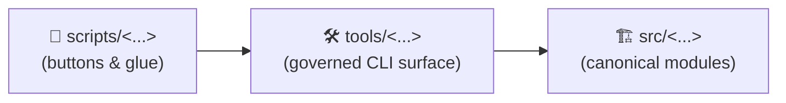
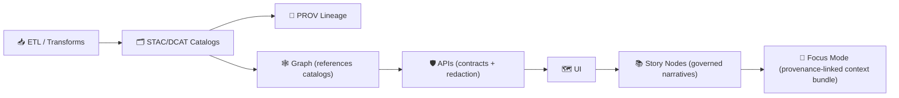
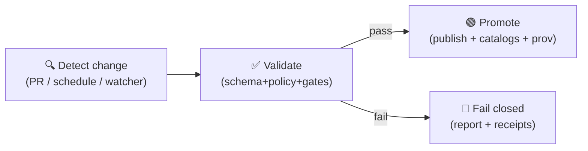

<!--
📌 This README defines the repo-wide automation surface for KFM / Kansas‑Matrix‑System.
🗓️ Last updated: 2026-01-19
🔁 Review cycle: 90 days (or anytime pipeline order / catalogs / policy pack / CI gates change)

Prime directive:
- `scripts/` = orchestration buttons & glue 🧰
- `tools/`   = governed toolchain surface 🛠️
- `src/`     = canonical implementation 🏗️

Reminder:
- No catalogs → no graph → no API → no UI → no story → no focus mode.
-->

<div align="center">

# 🧰 `scripts/` — KFM Automation Toolkit

**Repeatable commands for dev, data ops, GIS/remote‑sensing workflows, modeling/simulation orchestration, and deployment glue.**  
Safe‑by‑default ✅ • Idempotent ♻️ • Contract‑first 📜 • Provenance‑first 🧾 • Hostile‑input aware 🛡️ • “Metadata compiles” 🧬


-1f6feb)


</div>

> [!IMPORTANT]
> **`scripts/` is orchestration — not “the truth.”**  
> If behavior becomes core, move the implementation into **`src/`** (or `api/src/`) and let scripts call it.  
> If behavior becomes reusable + CI‑gated, promote it into **`tools/`** and call it from scripts.

> [!IMPORTANT]
> **KFM pipeline ordering is absolute (governed):**  
> **ETL → STAC/DCAT/PROV Catalogs → Graph → APIs → UI → Story Nodes → Focus Mode**  
> Scripts must not create **mystery artifacts** that bypass catalogs/provenance.

---

## 🔗 Quick links
- 🧭 Repo overview: **[`../README.md`](../README.md)**
- 🧩 Executable code boundary: **[`../src/README.md`](../src/README.md)** *(if present)*
- 🛠️ Governed toolchain surface: **[`../tools/README.md`](../tools/README.md)** *(if present)*
- 🧪 Repo-wide tests + QA gates: **[`../tests/README.md`](../tests/README.md)** *(if present)*
- 📦 Data + metadata boundary: **[`../data/README.md`](../data/README.md)** *(recommended)*
- 🧾 Governance (policy pack, redaction rules, SOPs): **[`../docs/governance/`](../docs/governance/)** *(recommended)*
- 📓 MCP (runs/receipts, experiments): **[`../mcp/README.md`](../mcp/README.md)** *(if present)*
- 📚 Story Nodes (draft/published): **[`../docs/reports/story_nodes/`](../docs/reports/story_nodes/)** *(recommended)*
- 🌐 Web UI boundary: **[`../web/README.md`](../web/README.md)** *(if present)*

---

<details>
<summary><b>🧭 Table of contents</b></summary>

- [🧾 Doc metadata](#-doc-metadata)
- [🧭 Where scripts live in the stack](#-where-scripts-live-in-the-stack)
- [🛂 Governance review triggers](#-governance-review-triggers)
- [🛡️ Continuous compliance: Policy Pack](#️-continuous-compliance-policy-pack)
- [🧨 Script risk levels](#-script-risk-levels)
- [🎯 What belongs here (and what doesn’t)](#-what-belongs-here-and-what-doesnt)
- [🧱 The governed boundary scripts must respect](#-the-governed-boundary-scripts-must-respect)
- [🏁 Quickstart](#-quickstart)
- [🗂️ Recommended folder map](#️-recommended-folder-map)
- [🧱 Standard script contract](#-standard-script-contract)
- [📐 Script templates (copy/paste)](#-script-templates-copypaste)
- [🧭 Data lifecycle + evidence artifacts](#-data-lifecycle--evidence-artifacts)
- [📥 Raw intake manifest standard](#-raw-intake-manifest-standard)
- [🔁 GitOps lanes: Detect → Validate → Promote](#-gitops-lanes-detect--validate--promote)
- [🧾 Observability & provenance](#-observability--provenance)
- [🧯 Rollbacks & incident playbooks](#-rollbacks--incident-playbooks)
- [🧨 Safety guardrails](#-safety-guardrails)
- [⚡ Performance, scaling, and concurrency](#-performance-scaling-and-concurrency)
- [🗺️ GIS + PostGIS scripting tips](#️-gis--postgis-scripting-tips)
- [🛰️ Remote sensing scripting tips](#️-remote-sensing-scripting-tips)
- [🧊 3D / point cloud / photogrammetry scripting tips](#-3d--point-cloud--photogrammetry-scripting-tips)
- [📚 Story Nodes & Focus Mode automation](#-story-nodes--focus-mode-automation)
- [🧪 QA scripts (contracts & acceptance gates)](#-qa-scripts-contracts--acceptance-gates)
- [🤖 Automation roadmaps (optional, proposed)](#-automation-roadmaps-optional-proposed)
- [🧩 Adding a new script (checklist)](#-adding-a-new-script-checklist)
- [📋 Script registry](#-script-registry)
- [📚 Project reference library influence map](#-project-reference-library-influence-map)
- [✅ Definition of “done” for a script](#-definition-of-done-for-a-script)
- [🕰️ Version history](#️-version-history)
- [📎 Evidence anchors](#-evidence-anchors)

</details>

---

## 🧾 Doc metadata

| Field | Value |
|---|---|
| Doc | `scripts/README.md` |
| Status | Active ✅ |
| Last updated | **2026-01-19** |
| Review cycle | 90 days 🔁 |
| Audience | Contributors shipping automation, data ops, validators, safe wrappers around `tools/` + `src/` |
| Prime directive | **No script may bypass catalogs (STAC/DCAT/PROV) or weaken governance.** |
| Canon | Scripts are “buttons”; **policy pack + catalogs + provenance** are the trust surface 🧾🛡️ |

---

## 🧭 Where scripts live in the stack

Think “buttons → instruments → engine”:



### ✅ How to decide “scripts vs tools vs src”
- **If it’s reusable and CI‑gated** → it probably belongs in `tools/`
- **If it’s core logic** → it belongs in `src/`
- **If it’s environment glue, orchestration, or local convenience** → `scripts/`

> [!TIP]
> If you find yourself duplicating validation/provenance logic in `scripts/`, stop and promote it into `tools/`. 🛠️⬆️

---

## 🛂 Governance review triggers

Some changes are “just automation,” but others are **policy changes wearing a script costume**.

> [!WARNING]
> Treat the following as **governance-significant** (require review, changelog, and usually an ADR):
> - 🔓 **New outbound data exposure** (new export target, new API distribution, new “public” artifact)
> - 🧾 **New external sources** or changed licensing terms (attribution/redistribution changes)
> - 🧬 **New catalog semantics** (STAC/DCAT/PROV schema changes; ID scheme changes)
> - 🔐 **Classification / sensitivity changes** (including “default public” behavior)
> - 🧠 **AI-derived outputs** that could be interpreted as ground truth (models, classifications, narratives)
> - 🧹 **Destructive/irreversible operations** (delete/drop/purge/revoke) or anything touching prod
> - 🌐 **Network fetchers** that can reach arbitrary URLs (SSRF risk) or ingest untrusted archives
> - 🧩 **Graph sync rules** (ontology/mapping logic, entity resolution, authority ID strategies)
> - 🛡️ **Policy pack rule changes** (OPA/Rego policies, waivers behavior, enforcement levels)

**Rule of thumb:** If the script changes what users can see, copy, or believe → it’s governance. 🧭🛡️

---

## 🛡️ Continuous compliance: Policy Pack

KFM treats automation as **policy‑gated**. Scripts are expected to run (or be run under) a **Policy Pack** that enforces repo invariants.

### ✅ What the policy pack is
- A set of rules (OPA/Rego‑style) evaluated in CI/locally that every pipeline/script must satisfy before publish.  
- Typical rules: “no publish without STAC/DCAT/PROV”, “no classification downgrade”, “deny network unless allowlisted”, “API-only UI access”, etc. 🧾🧬

### 🧪 How scripts should integrate it
Recommended pattern:
- `scripts/policy/run_policy_pack.*` → runs OPA/Conftest rules locally
- `scripts/ci/policy_gate.*` → CI entrypoint that blocks merge/publish on violations
- L2+ scripts should run policy evaluation **before** `--apply` (or as the final “commit gate”)

> [!IMPORTANT]
> A script is not “safe” because it has `--dry-run`.  
> It’s safe when **policy + provenance + catalogs** say it’s safe. ✅🛡️

---

## 🧨 Script risk levels

Every non-trivial script should declare a risk level (in docs and its `*.script.yaml` manifest).

| Level | Name | Typical actions | Hard requirements |
|---:|---|---|---|
| L0 | Read-only | validate, lint, diff, report | deterministic output; no writes unless `--outdir` |
| L1 | Work-stage writes | write `data/work/**`, temp outputs | `--dry-run` default; atomic writes; cleanup |
| L2 | Publish-stage | write `data/processed/**` **and** emit catalogs/prov | must generate STAC/DCAT/PROV + pass gates + policy pack |
| L3 | System-impacting | DB migrations, graph sync, object store writes, CI promotion | explicit env + explicit approvals; audit logs; policy pack; receipts |
| L4 | Destructive | deletes/drops/purges/overwrites | multi-confirmation; backups; “prove you meant it” flags; incident log |

> [!NOTE]
> Risk levels are about **impact**, not intent. A “simple export” can be L2/L3 if it becomes public or feeds prod.

---

## 🎯 What belongs here (and what doesn’t)

### ✅ Good fits for `scripts/`
- 🧱 **Environment bootstrap**: install deps, initialize DB schema, load seed/reference data
- 🧰 **Dev helpers**: run local stack, health checks, smoke tests, “make my laptop match CI”
- 🏷️ **Policy pack runners**: local/CI enforcement wrappers (OPA/Conftest, rule reports, waiver checks)
- 🗂️ **Catalog/provenance wrappers**: STAC/DCAT/PROV build + validate (usually calling `tools/`)
- 🗺️ **GIS wrappers**: convert formats, validate CRS, generate tiles, build COGs, reprojection helpers
- 🛰️ **Remote sensing orchestrators**: Earth Engine export triggers, download trackers, derived-product packagers
- 🧮 **Model/simulation orchestration**: run jobs with recorded configs, seeds, and output receipts
- 🧪 **Acceptance gates**: schema validation, link checks, provenance completeness, contract checks
- 🕒 **Scheduled jobs**: backups, cache cleanup, log rotation (cron/Kubernetes CronJob)
- 🧾 **MCP helpers**: generate experiment folders (`EXP-###`), receipts, and reproducibility manifests
- 📚 **Story tooling**: scaffold Story Nodes, validate citations, build offline “story packs” for UI

### ❌ Not a good fit for `scripts/`
- 🚫 **Core ETL logic** (belongs in `src/pipelines/` or equivalent)
- 🚫 **Domain/business rules** (belongs in `src/` domain/application layers or `api/src/`)
- 🚫 **Duplicate implementations** of pipeline steps (scripts should call canonical modules/tools)
- 🚫 **One-off “forever scripts”** that bypass provenance, approvals, or classification propagation
- 🚫 **“Published-looking” outputs** without STAC/DCAT/PROV boundary artifacts (orphans)

> [!TIP]
> Scripts are the “buttons and levers.” If it’s “the engine,” it belongs in `src/`. 🔧➡️🏗️

---

## 🧱 The governed boundary scripts must respect

KFM is designed so every user-facing claim traces back to evidence via a strict pipeline.  
(These stages are interfaces: each stage consumes only the prior stage’s boundary artifacts.)



### ✅ What this means for automation
- Scripts can **run ETL**, but must ensure:
  - outputs land in `data/raw → data/work → data/processed` *(stage appropriately)*
  - boundary artifacts exist **before** downstream stages run:
    - STAC → `data/stac/**`
    - DCAT → `data/catalog/dcat/**`
    - PROV → `data/prov/**`
- Scripts can **validate** contracts + metadata, and should fail fast in CI when:
  - schemas don’t validate
  - provenance is missing/incomplete
  - links/assets don’t resolve
  - governance rules fail (license, classification propagation, redaction expectations)
  - policy pack fails (unless a reviewed waiver exists)

### 🪪 Dataset ID hygiene (recommended)
Use **two IDs** (don’t overload one field):
- `dataset_id` = human meaningful (versioned) → `kfm.ks.<domain>.<dataset>.v<major>`
- `artifact_id` = information‑free stable ID → `ULID` / `UUID` / checksum-derived

> [!NOTE]
> **Don’t change meaning without changing IDs.**  
> Link revisions in provenance (e.g., `prov:wasRevisionOf`) rather than overwriting history.

---

## 🏁 Quickstart

### 1) Discover available scripts
- Browse by category folder (see map below)
- Run help first:
  - `./scripts/<path>/my_script.sh --help`
  - `pwsh ./scripts/<path>/my_script.ps1 --help`
  - `python scripts/<path>/my_script.py --help`

> [!IMPORTANT]
> Every script **must** support `--help` and include **at least 2 runnable examples**.

### 2) Set environment (no secrets in git) 🔐
- Prefer repo-level `.env.example` → `.env` *(if present)*
- Scripts should read config from:
  - environment variables ✅
  - or a config file path passed as an argument/env ✅

**Never hardcode credentials. Never print secrets.**

### 3) Default to safety ✅
Preferred contract:
- `--dry-run` (default) → prints actions
- `--apply` → performs changes
- `--yes` → skips prompts (dangerous)
- `--env {dev|staging|prod}` → required when environment matters
- `--run-id <id>` → strongly recommended for correlation + provenance
- `--no-network` default *(or explicit `--allow-network` for fetchers)*
- `--policy-pack` *(recommended)* → run policy evaluation before mutating state

---

## 🗂️ Recommended folder map

> Keep this list current as categories are introduced.

```text
📁 scripts/
├─ 🧰 _lib/                  # shared helpers (logging, env validation, guardrails)
├─ 🧰 dev/                   # local stack helpers, smoke tests, DX scripts
├─ 🧱 bootstrap/             # first-run setup (deps, DB init, seed/reference loads)
├─ 🛡️ policy/                # policy pack runners (OPA/Conftest), waivers, reports
├─ 🧾 lineage/               # PR→PROV, OpenLineage emitters, run receipt helpers
├─ 🗄️ db/                    # migrations, backups, restores, snapshots, sanity checks
├─ 🕸️ graph/                 # graph export/sync helpers (must reference catalog IDs)
├─ 🏷️ catalogs/               # STAC/DCAT/PROV build + validate wrappers (usually call tools/)
├─ 🧪 pipelines/              # pipeline runners (thin wrappers around src/pipelines)
├─ 🧩 contracts/              # dataset contract generation/validation helpers (JSON schema, templates)
├─ 📥 ingest/                # raw intake helpers (downloaders, checksums, raw manifests)
├─ 🗺️ gis/                   # vector/raster helpers (tiling, CRS checks, COG/PMTiles build)
├─ 🛰️ remote_sensing/        # GEE wrappers, export tracking, indexing helpers
├─ 🧊 3d/                    # point clouds / meshes / photogrammetry (LOD, glTF, tiles)
├─ 🧰 workers/               # background job runners (tiles, indexing, nightly QA) 🧵
├─ 📚 story_nodes/           # scaffold/validate/publish story nodes + citations
├─ 🎯 focus_mode/            # focus bundles, RAG index rebuilds, evidence-bundle checks
├─ 📦 offline_packs/         # build “offline bundles” (tiles + story + catalogs) for field/edu
├─ 🧮 simulation/            # scenario runners (must record seeds/configs + provenance)
├─ 🤖 ml/                    # train/eval runners (must record datasets + metrics + provenance)
├─ 📈 stats/                 # analysis helpers (EDA, regression diagnostics, uncertainty summaries)
├─ 🧪 qa/                    # validators, contract checks, dataset acceptance gates
├─ 🔐 security/              # secrets scans, sensitive-data scans, hostile-input checks
├─ 🧹 housekeeping/          # rotate logs, purge caches, cleanup artifacts
├─ 🧪 ci/                    # stable entrypoints used by CI (deterministic, non-interactive)
└─ 🧾 release/               # snapshot/release helpers (hash manifests, attestations, packaging)
```

> [!NOTE]
> If you add a new category folder, also add it to the Table of contents and script registry. 🧩

---

## 🧱 Standard script contract

To keep `scripts/` predictable (and safe), every script must follow the same behavioral contract.

### ✅ CLI interface requirements
All scripts must support:

- `--help` prints:
  - purpose (1–2 lines)
  - inputs/outputs (paths or tables)
  - side effects (DB writes? file writes? network calls?)
  - required env vars
  - examples (at least 2)

- `--version` prints:
  - semver (preferred) or git SHA
  - build timestamp (optional)

- Modes:
  - `--dry-run` is the default (or clearly supported)
  - `--apply` performs writes/changes

- Safety:
  - `--yes` skips interactive prompts
  - `--env {dev|staging|prod}` when environment matters
  - if `--env prod` + `--apply` → require an additional explicit prod acknowledgement flag  
    e.g. `--i-acknowledge-production`

- Governance & policy:
  - `--classification <label>` **or** `--classification-file <path>` (recommended for L2/L3)
  - `--license <SPDX|text>` (required when creating new distributions)
  - scripts must **fail closed** if classification/license cannot be determined
  - `--policy-pack` (recommended) runs policy evaluation prior to publish
  - policy waivers must be explicit:
    - `--waiver-id <ID>` (recommended) → must exist in `docs/governance/waivers.yml` *(or repo equivalent)*

- Provenance ergonomics (recommended):
  - `--run-id <id>` (or env `KFM_RUN_ID`) to correlate logs + PROV
  - `--dataset-id <id>` (when acting on a dataset)
  - `--outdir <path>` for artifact destinations
  - `--log-json` for machine-readable logs (JSONL)
  - `--no-network` default *(or explicit `--allow-network` for fetchers)*

- Resource budgets (strongly recommended for hostile inputs):
  - `--timeout-sec <n>`
  - `--max-bytes <n>` (download limit / input limit)
  - `--max-features <n>` / `--max-pixels <n>`
  - `--max-workers <n>` (avoid laptop-melters and prod stampedes)

**Exit codes (standard):**
- `0` success
- `2` usage/CLI error (bad args)
- `3` validation failure (inputs invalid; catalogs missing; schema mismatch)
- `>=10` runtime failures (I/O, network, DB, permissions, unexpected exceptions)

> [!NOTE]
> It’s okay to add flags, but don’t break the standard ones (`--help`, `--version`, `--dry-run`, `--apply`, `--yes`, `--env`).  
> Consistency beats cleverness. 🧠✅

### 🧾 “Script header” (recommended)
At the top of each script, include:
- Name + purpose
- Risk level (`L0…L4`)
- Inputs / outputs
- Side effects
- Owner/team (or “unowned”)
- Safety defaults (dry-run default, confirmation behavior)
- Provenance expectations (what IDs/receipts are written)
- Policy pack integration (which rule set applies; waiver mechanism)

### 🧾 Script manifest (recommended for discoverability)
Keep a tiny machine-readable manifest next to scripts that matter:

```yaml
# scripts/<category>/<name>.script.yaml
name: "export_county_tiles"
risk_level: "L2"
entrypoint: "scripts/gis/export_county_tiles.py"
owner: "@kfm-team"
inputs:
  - "data/processed/<domain>/**"
outputs:
  - "data/processed/<domain>/tiles/**"
  - "data/stac/**"
  - "data/catalog/dcat/**"
  - "data/prov/**"
default_mode: "dry_run"
policy_pack:
  enabled: true
  ruleset: "kfm-default"
  waiver_required_for_bypass: true
network:
  default: "deny"
  allowlist: []
budgets:
  timeout_sec: 3600
  max_bytes: 1073741824 # 1GiB
  max_workers: 4
determinism:
  stable_sorting: true
  seeded: true
gates:
  - "policy_pack_pass"
  - "stac_schema"
  - "dcat_schema"
  - "prov_schema"
  - "license_required"
  - "classification_no_downgrade"
```

---

## 📐 Script templates (copy/paste)

> [!TIP]
> Prefer **Python** for cross-platform automation. Use Bash/Pwsh when it’s truly OS-specific.  
> Treat CLI parsing + structured logging + resource limits as “table stakes.”

<details>
<summary><b>🐚 Bash (safe defaults + traps + exit codes)</b></summary>

```bash
#!/usr/bin/env bash
set -euo pipefail
IFS=$'\n\t'

# -----------------------------------------------------------------------------
# Name:        example.sh
# Risk level:  L1
# Purpose:     Example safe-by-default script template
# Inputs:      flags + env vars
# Outputs:     files in outdir (when --apply)
# Side effects: none by default (dry-run)
# Owner:       @kfm-team
# -----------------------------------------------------------------------------

DRY_RUN=1
APPLY=0
YES=0
ENVIRONMENT="dev"
RUN_ID="${KFM_RUN_ID:-}"
LOG_JSON=0

cleanup() { :; }
trap cleanup EXIT INT TERM

usage() {
  cat <<'EOF'
Usage:
  ./scripts/example.sh [--dry-run|--apply] [--env dev|staging|prod] [--run-id ID] [--log-json] [--yes]

Examples:
  ./scripts/example.sh --dry-run
  ./scripts/example.sh --apply --env staging --run-id RUN-20260119-demo --yes
EOF
}

now_iso() { date -u +"%Y-%m-%dT%H:%M:%SZ"; }

log() {
  local level="$1"; shift
  local msg="$*"
  if [[ "$LOG_JSON" -eq 1 ]]; then
    printf '{"ts":"%s","level":"%s","run_id":"%s","msg":%q}\n' "$(now_iso)" "$level" "$RUN_ID" "$msg"
  else
    printf "[%s] %s (run_id=%s) %s\n" "$level" "$(now_iso)" "$RUN_ID" "$msg"
  fi
}

die_usage() { log "ERROR" "$*"; exit 2; }
die_runtime() { log "ERROR" "$*"; exit 10; }

while [[ $# -gt 0 ]]; do
  case "$1" in
    --help) usage; exit 0 ;;
    --version) echo "v0.0.0+local"; exit 0 ;;
    --dry-run) DRY_RUN=1; APPLY=0; shift ;;
    --apply) DRY_RUN=0; APPLY=1; shift ;;
    --yes) YES=1; shift ;;
    --log-json) LOG_JSON=1; shift ;;
    --env) ENVIRONMENT="${2:-}"; shift 2 ;;
    --run-id) RUN_ID="${2:-}"; shift 2 ;;
    *) usage; exit 2 ;;
  esac
done

RUN_ID="${RUN_ID:-RUN-$(date -u +%Y%m%dT%H%M%S)}"

if [[ "$ENVIRONMENT" == "prod" && "$APPLY" -eq 1 && "$YES" -ne 1 ]]; then
  die_usage "Refusing prod apply without --yes (and ideally --i-acknowledge-production)."
fi

log "INFO" "Starting (env=$ENVIRONMENT, dry_run=$DRY_RUN)"
log "INFO" "Would do X"
if [[ "$APPLY" -eq 1 ]]; then
  log "INFO" "Doing X now"
fi
log "INFO" "Done"
exit 0
```

</details>

<details>
<summary><b>🐍 Python (argparse + JSONL logs + dry-run default + budgets)</b></summary>

```python
#!/usr/bin/env python3
from __future__ import annotations

import argparse
import json
import os
import sys
import time
from dataclasses import dataclass
from datetime import datetime, timezone
from pathlib import Path

EXIT_OK = 0
EXIT_USAGE = 2
EXIT_VALIDATION = 3
EXIT_RUNTIME = 10


def now_iso() -> str:
    return datetime.now(timezone.utc).isoformat()


def log(level: str, msg: str, *, run_id: str, jsonl: bool) -> None:
    payload = {"ts": now_iso(), "level": level, "run_id": run_id, "msg": msg}
    if jsonl:
        print(json.dumps(payload, ensure_ascii=False))
    else:
        print(f"[{level}] {payload['ts']} (run_id={run_id}) {msg}")


@dataclass(frozen=True)
class Budgets:
    timeout_sec: int
    max_workers: int


def main(argv: list[str]) -> int:
    p = argparse.ArgumentParser(
        description="Example KFM script template (safe-by-default).",
        formatter_class=argparse.RawTextHelpFormatter,
    )
    p.add_argument("--version", action="store_true", help="Print version and exit.")
    p.add_argument("--dry-run", action="store_true", help="Print actions only (default).")
    p.add_argument("--apply", action="store_true", help="Perform changes.")
    p.add_argument("--yes", action="store_true", help="Skip prompts (dangerous).")
    p.add_argument("--env", choices=["dev", "staging", "prod"], default="dev")
    p.add_argument("--run-id", default=os.environ.get("KFM_RUN_ID", ""))
    p.add_argument("--dataset-id", default="")
    p.add_argument("--log-json", action="store_true", help="Emit JSONL logs.")
    p.add_argument("--outdir", default="reports/example")
    p.add_argument("--timeout-sec", type=int, default=900)
    p.add_argument("--max-workers", type=int, default=4)
    p.add_argument("--no-network", action="store_true", help="Deny network calls (recommended default).")
    p.add_argument("--allow-network", action="store_true", help="Allow network calls (fetchers only).")
    args = p.parse_args(argv)

    if args.version:
        print("v0.0.0+local")
        return EXIT_OK

    dry_run = not args.apply
    if args.dry_run:
        dry_run = True

    run_id = args.run_id or f"RUN-{datetime.now(timezone.utc).strftime('%Y%m%dT%H%M%S')}"

    if args.env == "prod" and not dry_run and not args.yes:
        log("ERROR", "Refusing prod apply without --yes (and ideally --i-acknowledge-production).",
            run_id=run_id, jsonl=args.log_json)
        return EXIT_USAGE

    budgets = Budgets(timeout_sec=args.timeout_sec, max_workers=args.max_workers)
    start = time.time()

    outdir = Path(args.outdir)
    log("INFO", f"Starting (env={args.env}, dry_run={dry_run}, outdir={outdir}, budgets={budgets})",
        run_id=run_id, jsonl=args.log_json)

    if args.allow_network and args.no_network:
        log("ERROR", "Cannot set both --allow-network and --no-network.", run_id=run_id, jsonl=args.log_json)
        return EXIT_USAGE

    log("INFO", "Would generate artifact manifest", run_id=run_id, jsonl=args.log_json)
    if not dry_run:
        outdir.mkdir(parents=True, exist_ok=True)
        (outdir / "MANIFEST.txt").write_text(
            f"run_id={run_id}\n"
            f"dataset_id={args.dataset_id}\n"
            f"env={args.env}\n"
            f"timestamp={now_iso()}\n",
            encoding="utf-8",
        )

    elapsed = time.time() - start
    if elapsed > budgets.timeout_sec:
        log("ERROR", f"Timeout budget exceeded ({elapsed:.1f}s > {budgets.timeout_sec}s).",
            run_id=run_id, jsonl=args.log_json)
        return EXIT_RUNTIME

    log("INFO", f"Done (elapsed={elapsed:.2f}s)", run_id=run_id, jsonl=args.log_json)
    return EXIT_OK


if __name__ == "__main__":
    raise SystemExit(main(sys.argv[1:]))
```

</details>

<details>
<summary><b>🟩 Node.js (when you must live near the web toolchain)</b></summary>

```js
#!/usr/bin/env node
/**
 * Name: example.mjs
 * Risk level: L0
 * Purpose: Example KFM script template for Node tooling
 * Safety: dry-run default, explicit --apply
 */
import process from "node:process";

function usage() {
  console.log(`
Usage:
  node scripts/example.mjs [--dry-run|--apply] [--env dev|staging|prod] [--run-id ID] [--log-json] [--yes]

Examples:
  node scripts/example.mjs --dry-run
  node scripts/example.mjs --apply --env staging --run-id RUN-20260119-demo --log-json --yes
`);
}

function nowIso() { return new Date().toISOString(); }

function log(level, msg, { runId, jsonl }) {
  if (jsonl) console.log(JSON.stringify({ ts: nowIso(), level, run_id: runId, msg }));
  else console.log(`[${level}] ${nowIso()} (run_id=${runId}) ${msg}`);
}

const argv = process.argv.slice(2);
let dryRun = true;
let env = "dev";
let yes = false;
let runId = process.env.KFM_RUN_ID || "";
let jsonl = false;

for (let i = 0; i < argv.length; i++) {
  const a = argv[i];
  if (a === "--help") { usage(); process.exit(0); }
  if (a === "--version") { console.log("v0.0.0+local"); process.exit(0); }
  if (a === "--dry-run") { dryRun = true; continue; }
  if (a === "--apply") { dryRun = false; continue; }
  if (a === "--env") { env = argv[++i] || "dev"; continue; }
  if (a === "--yes") { yes = true; continue; }
  if (a === "--log-json") { jsonl = true; continue; }
  if (a === "--run-id") { runId = argv[++i] || ""; continue; }
  usage(); process.exit(2);
}

runId = runId || `RUN-${nowIso().replace(/[-:.TZ]/g, "")}`;

if (env === "prod" && !dryRun && !yes) {
  log("ERROR", "Refusing prod apply without --yes (and ideally --i-acknowledge-production).", { runId, jsonl });
  process.exit(2);
}

log("INFO", `Starting (env=${env}, dry_run=${dryRun})`, { runId, jsonl });
log("INFO", "Done", { runId, jsonl });
process.exit(0);
```

</details>

---

## 🧭 Data lifecycle + evidence artifacts

KFM’s data work is staged and traceable. Scripts that ingest or transform data must follow staging and produce boundary artifacts.

**Canonical staging shape (governed):**
1) 📥 Write raw inputs → `data/raw/<domain>/**`  
2) 🧱 Write intermediates → `data/work/<domain>/**`  
3) ✅ Write publishable outputs → `data/processed/<domain>/**`  
4) 🗃️ Emit boundary artifacts **before** anything is used downstream:
   - STAC → `data/stac/**`
   - DCAT → `data/catalog/dcat/**`
   - PROV → `data/prov/**`

> [!IMPORTANT]
> KFM treats analysis outputs / AI-generated layers / simulation outputs as **first‑class datasets** (“evidence artifacts”):  
> store them in `data/processed/…`, catalog them in STAC/DCAT, trace them in PROV, and expose them only through governed APIs.

### 🪪 Classification + sovereignty propagation (hard rule)
- Outputs cannot be less restricted than their inputs unless a reviewed redaction step exists.
- If a script cannot determine classification, it must default to **restricted** (deny-by-default).
- Avoid side-channels: never export sensitive precise coordinates by accident (e.g., debug GeoJSON dumps).

### ✅ “Thin wrapper” pattern (required for anything important)
If you’re tempted to put real transformation logic in a script:
- implement core logic in `src/…` (pipelines/domain/services)
- keep the script as a thin CLI wrapper that:
  - validates inputs + budgets
  - calls the canonical module/tool
  - writes run receipts/logs
  - triggers catalog/provenance generation and validation

---

## 📥 Raw intake manifest standard

Raw intake is the **first trust boundary**. Treat `data/raw/**` as “immutable evidence input.”

Recommended raw drop structure (per dataset drop/version):

```text
data/raw/<domain>/<dataset_or_source>/<snapshot_or_date>/
├── source.json         # who/what/when/where/how + license + classification
├── checksums.sha256    # manifest for every file in this snapshot
├── raw_index.csv       # optional: file listing + types + sizes (nice for review)
├── telemetry.ndjson    # optional: machine logs (download events, retries, timings)
└── <payload files...>  # archives / CSVs / PDFs / imagery, etc.
```

> [!TIP]
> A good raw intake script (`scripts/ingest/*`) does two things well:
> 1) **makes it hard to lie** (checksums + source manifest), and  
> 2) **makes it easy to review** (indexes + deterministic file layout). 🧾✅

---

## 🔁 GitOps lanes: Detect → Validate → Promote

KFM is designed to support **GitOps-friendly ingestion**:
- data is added/updated via PR  
- CI runs validation + policy pack  
- merge triggers the publish lane (or a controlled “promote” action)  
- catalogs/prov become the interface for graph/API/UI

### 🧭 Recommended lane structure (conceptual)



### 🧠 Automation agents (proposed, PR-only) 🤖
If you adopt a Watcher → Planner → Executor loop:
- **Watcher** detects drift or missing data
- **Planner** drafts a patch (or run config)
- **Executor** opens a PR (never auto-merges), attaching receipts, SBOM, and attestations

> [!WARNING]
> Any “agent” automation must be:
> - kill-switchable ✅
> - idempotent ✅
> - PR-only ✅
> - policy-gated ✅
> - provenance-emitting ✅

---

## 🧾 Observability & provenance

Every script should:
- 🪵 Use structured logging (`timestamp`, `level`, `component`, `run_id`)
- 🧷 Print where outputs were written + what changed (counts, bytes, features)
- 🧾 Capture provenance inputs/outputs:
  - input file list + checksums (when feasible)
  - key parameters (bbox, time window, CRS, resolution, seeds)
  - IDs/paths to produced STAC/DCAT/PROV artifacts
  - config hash + code version (git SHA)

### 🧾 “Run receipt” (🔥 strongly recommended for `--apply`)
When a script changes state, write a receipt another person can replay:

- human-readable: `mcp/runs/<RUN-ID>/MANIFEST.md`
- machine-readable: `data/prov/<RUN-ID>.jsonld`

Receipt SHOULD include:
- git SHA, environment, operator identity (if available)
- inputs + checksums
- outputs + checksums
- produced catalog IDs (collection/item/dataset IDs)
- warnings (redactions applied, schema deviations, missing optional evidence)

### 🔗 DevOps provenance (recommended)
If a script runs in CI or promotes data:
- record PR/commit metadata into PROV (PR → PROV)
- optionally emit OpenLineage events for pipeline tracking (if adopted)

---

## 🧯 Rollbacks & incident playbooks

KFM automation should assume mistakes happen and make rollbacks **boring**.

### ✅ Rollback principles
- Prefer **append-only** + “new version” over in-place mutation
- Treat publishes as **atomic swaps** (run-scoped directory → validate → promote pointer)
- Keep **run receipts** so rollback is explainable (not just reversible)

### 🧯 Suggested playbooks (scriptable)
- **Dataset rollback**
  - revert the commit/PR that introduced the publish
  - mark distribution as deprecated in DCAT (don’t pretend it never existed)
  - preserve PROV (audit trail stays)

- **Graph rollback**
  - graphs ingest from catalogs/exports → rollback is re-import of prior export snapshot
  - keep graph exports versioned (e.g., `data/graph/csv/<RUN-ID>/...`)

- **Sensitive data incident**
  - immediately restrict classification tags + remove public distributions
  - purge caches / invalidate tiles / rotate any leaked keys (if any)
  - write incident record (who/what/when/impact/remediation)

> [!IMPORTANT]
> If a rollback can’t be done with receipts + a documented sequence of steps, it’s not a rollback plan — it’s hope. 🧾🧯

---

## 🧨 Safety guardrails

### ✅ Safe-by-default behavior
- 🛑 No destructive actions by default
- 🧪 Default mode should be `--dry-run`
- 🧯 Destructive actions require explicit confirmation flags

### 🏭 Production protection
Scripts that can write to prod must:
- require explicit `--env prod`
- require `--i-acknowledge-production` *(recommended stronger-than-yes flag)*
- log who/what/when:
  - user (if detectable), host, timestamp, run_id
  - git SHA (if available)
  - container digest (if available)

### 🧊 Atomic writes (strongly recommended)
For file outputs:
- write to `*.tmp` then rename (atomic on most filesystems)
- never leave half-written “published” outputs behind
- prefer content-addressed paths (hash-in-path) for immutable artifacts

### 🛡️ Hostile input posture (always assume untrusted)
Assume inputs are hostile (files from the world, archives, rasters, JSON, PDFs, 3D assets).
- ✅ allowlist file types and content-types
- ✅ enforce size and decompression limits (zip bombs, huge rasters, nested archives)
- ✅ path traversal protections (never trust archive paths)
- ✅ treat URL fetching as high-risk (SSRF; private IP blocks; allowlists)
- ✅ isolate complex parsing when possible (containers / subprocess limits / timeouts)

### 🔎 “Derived outputs can leak” reminder
Even *model outputs* and *analytics exports* can leak sensitive information through inference.  
Scripts that expose aggregates, embeddings, or model responses should consider:
- query auditing / inference control
- rate limits + sampling
- suppressing small counts / sensitive attribute disclosure

> [!CAUTION]
> If a script can delete, drop, truncate, overwrite, revoke, or publish:  
> **dry-run default + explicit apply + explicit confirmation** is mandatory. 🚫🧨✅

---

## ⚡ Performance, scaling, and concurrency

Automation should scale from “laptop demo” to “statewide workloads” without rewrites.

### ✅ Scaling patterns (preferred)
- 📦 Chunking/partitioning: process by tile, county, watershed, time window
- 🧱 Pipeline breakers: materialize only when needed (then resume streaming)
- ♻️ Idempotency keys: `(dataset_id, version, tile_id, src_checksum)` patterns
- 🗃️ Metadata-driven access: navigate via catalogs/IDs, not brittle paths
- 🧵 Concurrency safety:
  - avoid shared mutable state without locks
  - serialize destructive ops
  - prefer job queues / worker pools over ad-hoc threading for heavy runs

### ✅ “Boring performance wins”
- cache downloads (ETag/Last-Modified when possible)
- avoid reprocessing unchanged inputs (checksum-based short-circuit)
- push expensive spatial operations into PostGIS when appropriate
- keep UI-facing assets web-friendly (tiles, COGs, simplified vectors)

### 🏎️ DB-aware scripts (when PostGIS/Neo4j are involved)
- prefer fewer, well-indexed queries over chatty loops
- measure tail latency, not just averages
- use staging tables + transactional swaps for imports
- batch writes and use explicit transactions

---

## 🗺️ GIS + PostGIS scripting tips

### ✅ Make CRS and units explicit
- refuse “unknown SRID” geometries by default
- log CRS for inputs/outputs
- document axis-order and unit conversion
- record reprojection and resampling choices (method, resolution, nodata)

### ✅ Prefer database-side spatial operations when appropriate
- buffers, intersects, within, distance joins: PostGIS is often safer/faster than Python loops
- use staging tables and transactional swaps:
  1) load → 2) validate counts/geometry → 3) swap/rename in a transaction

### ✅ Web-serving friendliness
When scripts generate assets meant for the UI:
- vectors: simplify or tile (avoid multi‑MB GeoJSON blobs)
- rasters: prefer COG (with overviews)
- tiles: verify CRS (commonly EPSG:3857 for web tiles) and metadata

### 🔐 Privacy reminder
GeoJSON is easy to copy. Treat “committed vectors” as a disclosure boundary:
- don’t export restricted geometries without explicit governance approval
- prefer catalog pointers to governed stores for sensitive layers

---

## 🛰️ Remote sensing scripting tips

Remote sensing scripts are usually orchestrators for:
- exporting derived indices (NDVI, moisture proxies, composites)
- producing COGs + thumbnails
- emitting STAC Items + linking distributions via DCAT
- capturing PROV runs (inputs, AOI, time window, method, parameters)

### ✅ Prefer derived products + provenance over raw archives
- avoid committing raw satellite archives into the repo
- store raw externally when needed; keep catalog pointers in-repo
- ensure every derived product is traceable (PROV) and discoverable (STAC/DCAT)

### ✅ Record “how it was made”
For any export, record:
- AOI (bbox/geometry), time window
- dataset/source IDs
- compositing method (median/mean/mosaic, cloud mask logic)
- resolution/CRS
- model/algorithm version if AI-assisted

### 🗺️ Georeferencing note
If a workflow involves manual georeferencing (e.g., QGIS control points), record:
- number of control points
- residual/RMS if available
- transformation method
- who performed it + when  
…and attach that to provenance metadata (PROV) and dataset docs.

---

## 🧊 3D / point cloud / photogrammetry scripting tips

KFM increasingly touches “3D GIS” realities (LiDAR, meshes, photogrammetry, archaeology, built infrastructure).  
Treat 3D assets like any other evidence: stage → catalog → provenance → QA.

### ✅ Recommended outputs (web + archival)
- **Web preview**: glTF/GLB + lightweight thumbnails
- **Point clouds**: LAS/LAZ (plus tiled/LOD derivatives if needed)
- **Meshes**: OBJ/PLY (archive) + GLB (serve)
- **Spatial tiling**: 3D Tiles / LOD pyramids *(if adopted)*
- **Metadata**: explicit CRS + vertical datum (and units!) + scale

### ✅ 3D must-haves
- coordinate reference + axis conventions (Y-up/Z-up) clearly stated
- decimation/simplification documented (what was removed and why)
- QA quicklooks (screenshots) and bounding box sanity checks
- provenance links to source surveys and processing parameters

> [!CAUTION]
> 3D assets can leak sensitive location detail fast.  
> Default to restricted until classification is explicit.

---

## 📚 Story Nodes & Focus Mode automation

KFM’s UI is **API-only** and Focus Mode is **evidence‑bound**:
- Story Nodes should cite cataloged evidence
- AI-assisted narrative must preserve provenance and citations
- Scripts can scaffold and validate story content, but may not bypass governance

### ✅ Recommended script jobs
- `scripts/story_nodes/new_*` → scaffold a Story Node (Markdown + JSON config)
- `scripts/story_nodes/validate_*` → enforce citation rules + required evidence anchors
- `scripts/focus_mode/build_bundle_*` → build a “focus bundle” of catalogs + excerpts
- `scripts/offline_packs/build_*` → bundle tiles + story + catalogs for offline/field use (if adopted)

> [!TIP]
> Treat story assets like data: validate, version, and ship with receipts. 📚🧾

---

## 🧪 QA scripts (contracts & acceptance gates)

`scripts/qa/` is for “trust checks” — scripts that keep the system honest:

- ✅ policy pack evaluation (OPA/Conftest or equivalent)
- ✅ schema validation for STAC/DCAT/PROV
- ✅ dataset contract validation (JSON schema + required fields)
- ✅ catalog link checks (assets exist; hrefs resolve)
- ✅ definition-of-done checks (data present, metadata present, provenance present)
- ✅ security scans (secrets + sensitive patterns)
- ✅ governance checks (classification propagation; “no downgrade” rules)
- ✅ “looks-right” checks (quicklook renders, bbox sanity, sample stats/EDA)

**Starter examples (conceptual)**
```bash
# JSON sanity (fast fail)
find data/stac data/catalog/dcat data/prov -name "*.json*" -print0 | xargs -0 -n 1 jq empty

# Catalog asset/link integrity
python scripts/qa/validate_stac_links.py data/stac/items

# Provenance completeness
python scripts/qa/validate_prov_bundle.py data/prov

# Policy pack (conceptual)
./scripts/policy/run_policy_pack.sh --ruleset kfm-default

# Secrets scan (repo-wide)
python scripts/security/scan_secrets.py .
```

> [!TIP]
> Keep PR checks fast. Put heavy raster QA into nightly jobs unless it blocks correctness. ⚡

---

## 🤖 Automation roadmaps (optional, proposed)

These are forward-looking patterns captured in KFM planning docs. Optional until implemented — but they shape folder naming and interfaces.

### 🔁 Detect → Validate → Promote (promotion pipeline)
A pipeline watches for changes, runs validation lanes, and promotes via PR (not direct merges), with supply‑chain attestation and lineage events proposed.

**Suggested homes (if/when implemented):**
- `scripts/ci/detect_changes.*`
- `scripts/ci/validate_lanes.*`
- `scripts/ci/promote_via_pr.*`
- `scripts/ci/emit_lineage.*`
- `scripts/release/sign_*` *(Sigstore/attestations, if adopted)*

### 🧠 Watcher → Planner → Executor (W–P–E) agent loop
Proposed agent model:
- Watcher detects drift/breakage
- Planner drafts a patch
- Executor opens a PR (never auto-merges), with kill-switch + idempotency keys

> [!WARNING]
> If you add “agent” automation, it must be:
> - kill-switchable ✅
> - idempotent ✅
> - PR-only ✅
> - policy-gated ✅
> - provenance-emitting ✅

### 🧾 PR → PROV (DevOps provenance)
Proposed integration maps GitHub PR activity into PROV JSON‑LD for audit queries (“which code change produced dataset X?”).

### 🧪 (Optional) Mini-DSLs for pipelines — but safely
If you introduce a DSL/config language:
- treat it as data (YAML/JSON first)
- parse safely (no eval)
- validate via schemas
- version it explicitly  
*(If a real grammar/DSL emerges, consider compiler-grade parsing practices rather than ad-hoc string parsing.)*

---

## 🧩 Adding a new script (checklist)

1) 📁 Put it in the right subfolder (`db/ gis/ ingest/ policy/ qa/ …`)
2) 🏷️ Name it as a verb: `import_*`, `export_*`, `generate_*`, `validate_*`, `backup_*`
3) 🧪 Add `--help` + 2 examples
4) 🛡️ Add `--dry-run` default and explicit confirmations for writes
5) 🧾 Write outputs to the correct `data/` stage + generate provenance/metadata when relevant
6) 🪵 Log clearly (what, where, record counts, elapsed time)
7) ♻️ Make it idempotent (re-runs should not duplicate or corrupt)
8) 🧪 Make it CI-friendly (non-interactive; stable exit codes)
9) 🧾 Add a `*.script.yaml` manifest (recommended) including risk level + budgets + policy pack
10) 🛡️ Ensure policy pack passes (or document waiver with `waiver_id`)
11) 📝 Update this README and the script registry below

---

## 📋 Script registry

> ✍️ Add rows as scripts are introduced. Keep this current.

| Category | Script pattern | Purpose | Safety posture |
|---|---|---|---|
| 🧰 dev | `dev/up.*` | Start local stack (compose) | read-only-ish |
| 🧰 dev | `dev/smoke.*` | Quick sanity checks | L0 |
| 🛡️ policy | `policy/run_*` | Run policy pack locally/CI | L0 |
| 🧾 lineage | `lineage/pr_to_prov.*` | PR → PROV receipts | L1/L2 |
| 🗄️ db | `db/migrate.*` | Apply DB migrations | L3 |
| 🗄️ db | `db/backup_*` | Create encrypted DB backups | L2/L3 |
| 🗄️ db | `db/restore_*` | Restore backups | L4 |
| 📥 ingest | `ingest/fetch_*` | Fetch raw inputs + checksums + source.json | L1 |
| 🗺️ gis | `gis/import_*` | Load vectors/rasters into staging | L1/L2 |
| 🗺️ gis | `gis/export_*` | Export layers to tiles/COGs/PMTiles | L2 |
| 🧊 3d | `3d/build_*` | Build LOD/tiles for 3D assets | L2 |
| 🏷️ catalogs | `catalogs/build_*` | Build STAC/DCAT/PROV artifacts | L2 |
| 🏷️ catalogs | `catalogs/validate_*` | Validate schemas + links | L0 |
| 🕸️ graph | `graph/export_*` | Export graph ingest files (CSV/Cypher/JSON) | L2 |
| 🕸️ graph | `graph/sync_*` | Sync catalog refs into graph | L3 |
| 🛰️ remote_sensing | `remote_sensing/export_*` | Trigger/track derived EO exports | L2 |
| 🧰 workers | `workers/run_*` | Run background tasks (tiles, indexing) | L2/L3 |
| 📚 story_nodes | `story_nodes/new_*` | Scaffold story nodes | L1 |
| 📚 story_nodes | `story_nodes/validate_*` | Validate citations/evidence anchors | L0/L1 |
| 🎯 focus_mode | `focus_mode/build_*` | Build focus bundles + evidence checks | L1/L2 |
| 📦 offline_packs | `offline_packs/build_*` | Build offline bundles (if adopted) | L2 |
| 🧮 simulation | `simulation/run_*` | Run scenarios/jobs | L2 |
| 🤖 ml | `ml/train_*` / `ml/eval_*` | Train/evaluate models | L2 |
| 📈 stats | `stats/eda_*` | Quick EDA + diagnostics | L0/L1 |
| 🧪 qa | `qa/validate_*` | Acceptance gates | L0 |
| 🔐 security | `security/scan_*` | Secrets/sensitive patterns | L0 |
| 🧹 housekeeping | `housekeeping/purge_*` | Cleanup caches/logs | L4 |
| 🧪 ci | `ci/check.*` | CI entrypoint | deterministic + non-interactive |

---

## 📚 Project reference library influence map

> These project files inform how we design, review, and harden automation in `scripts/`.

<details>
<summary><b>📦 Expand: project files → how they shape scripts</b></summary>

### 🧭 Core KFM specs (what scripts must serve)
- **KFM comprehensive technical blueprint** → architecture boundaries, governance posture, evidence-first ethos  
   [oai_citation:0‡Kansas Frontier Matrix (KFM) – Comprehensive Technical Documentation.pdf](file-service://file-AkqwUuYPp5zePf7pv5SMxi)
- **KFM architecture/features/design** → clean boundaries + domain-first thinking + integration surface  
   [oai_citation:1‡🌟 Kansas Frontier Matrix – Latest Ideas & Future Proposals.docx.pdf](file-service://file-SQ3f7ve8SGiusT6ThZEuCe)
- **KFM AI system overview** → policy pack gating, PR-based automation constraints, evidence-bound AI behavior  
   [oai_citation:2‡📚 Kansas Frontier Matrix (KFM) Data Intake – Technical & Design Guide.pdf](file-service://file-EbUCdsJMbu5KwpoKMrLrgj)
- **KFM UI system overview** → API-only boundary, story/focus workflows, evidence-linked narratives  
   [oai_citation:3‡Kansas Frontier Matrix – Comprehensive UI System Overview.pdf](file-service://file-KcBQruYcoFVDEixzzRHTwt)
- **KFM data intake guide** → raw trust boundary, manifest/checksum expectations, streaming watcher patterns  
   [oai_citation:4‡📚 Kansas Frontier Matrix (KFM) Data Intake – Technical & Design Guide.pdf](file-service://file-EbUCdsJMbu5KwpoKMrLrgj)
- **Latest ideas & future proposals** → agent loops, supply chain attestations, PR-only automation direction  
   [oai_citation:5‡📚 Kansas Frontier Matrix (KFM) Data Intake – Technical & Design Guide.pdf](file-service://file-EbUCdsJMbu5KwpoKMrLrgj)
- **Innovative concepts (evolution roadmap)** → advanced workflows (4D, AR storytelling, crowdsourced validation)  
   [oai_citation:6‡Innovative Concepts to Evolve the Kansas Frontier Matrix (KFM).pdf](file-service://file-G71zNoWKxsoSW44iwZaaCC)

### 📚 Reference libraries (PDF portfolios 🗂️)
These are curated “bookshelf” portfolios that influence **how** we write scripts (safety, performance, GIS, WebGL, ML discipline).  
They may require a PDF portfolio-capable viewer (or local extraction via `pdfdetach`).

- **AI/ML concepts library** (evaluation discipline, resource constraints, ML ops instincts)  
   [oai_citation:7‡AI Concepts & more.pdf](file-service://file-K6BctJjeUwvyCahLf9qdwr)
- **Data management + Bayesian methods library** (data architectures, performance, reproducibility, uncertainty)  
   [oai_citation:8‡Data Managment-Theories-Architures-Data Science-Baysian Methods-Some Programming Ideas.pdf](file-service://file-RrXMFY7cP925exsQYermf2)
- **Maps + WebGL + virtual worlds library** (cartography, 3D GIS, rendering constraints, Cesium/WebGL patterns)  
   [oai_citation:9‡Maps-GoogleMaps-VirtualWorlds-Archaeological-Computer Graphics-Geospatial-webgl.pdf](file-service://file-RshcX5sNY2wpiNjRfoP6z6)
- **Programming languages & resources library** (polyglot references: bash/python/js/java/etc; scripting ergonomics)  
   [oai_citation:10‡Various programming langurages & resources 1.pdf](file-service://file-4wp3wSSZs7gk5qHWaJVudi)

</details>

---

## ✅ Definition of “done” for a script

A script is considered complete when:
- ✅ Safe by default (`--dry-run` default or clearly supported)
- ✅ Risk level declared (docs + manifest)
- ✅ Repeatable/idempotent (re-run doesn’t duplicate or corrupt)
- ✅ Documented (`--help` + 2 examples + `--version`)
- ✅ Logs what it did (counts, paths, elapsed time) + optional JSONL (`--log-json`)
- ✅ Outputs land in the correct stage (`data/raw/ → data/work/ → data/processed/`)
- ✅ (When applicable) emits/updates boundary artifacts (STAC/DCAT/PROV)
- ✅ Policy pack pass (or documented waiver) 🛡️
- ✅ Registered in the script registry + has a `*.script.yaml` manifest (recommended)
- ✅ CI-friendly (non-interactive; stable exit codes)
- ⭐ Resource budgets supported for hostile inputs (timeouts, size caps, max workers)
- ⭐ Lintable: shellcheck/shfmt for shell, ruff/black for python, eslint/prettier for JS/TS *(when toolchains exist)*

---

## 🕰️ Version history

| Version | Date | Summary | Author |
|---:|---|---|---|
| v1.5.0 | 2026-01-19 | 🛡️ Added **Policy Pack** integration expectations; aligned canonical staging to `data/raw → data/work → data/processed` and catalog roots (`data/stac`, `data/catalog/dcat`, `data/prov`); added raw intake manifest standard; added GitOps lane language (Detect→Validate→Promote) + PR-only automation posture; added rollback/incident playbooks; expanded folder map + registry for policy/lineage/story/focus/offline/workers; refreshed influence map to include **all project files** (incl. PDF portfolios). | KFM Engineering |
| v1.4.0 | 2026-01-13 | Introduced governance review triggers + risk levels (L0–L4); expanded contracts/budgets expectations; added 3D/point-cloud category and guidance; cleaned up evidence anchors. | KFM Engineering |
| v1.3.0 | 2026-01-11 | Aligned `scripts/` with Master Guide v13 principles (contract-first + deterministic pipeline + evidence artifacts); added templates; clarified boundary artifacts + dataset versioning hygiene; captured roadmaps (Detect→Validate→Promote, W–P–E). | KFM Engineering |
| v1.2.0 | 2026-01-09 | Aligned scripts with contract-first + evidence-first rules; added sovereignty/no‑downgrade guardrails, performance/concurrency notes, tightened acceptance gates. | KFM Engineering |
| v1.1.0 | 2026-01-07 | Established repo-wide automation surface, safety defaults, folder map, standard script contract, and registry. | KFM Engineering |

---

## 📎 Evidence anchors

> These are the “load-bearing” references used to keep `scripts/` aligned with the repo doctrine.  
> If you move/rename these, update the influence map.

### 🧭 KFM system documents
- KFM Comprehensive Technical Documentation  [oai_citation:11‡Kansas Frontier Matrix (KFM) – Comprehensive Technical Documentation.pdf](file-service://file-AkqwUuYPp5zePf7pv5SMxi)  
- KFM Comprehensive Architecture, Features, and Design  [oai_citation:12‡🌟 Kansas Frontier Matrix – Latest Ideas & Future Proposals.docx.pdf](file-service://file-SQ3f7ve8SGiusT6ThZEuCe)  
- KFM AI System Overview 🧭🤖  [oai_citation:13‡📚 Kansas Frontier Matrix (KFM) Data Intake – Technical & Design Guide.pdf](file-service://file-EbUCdsJMbu5KwpoKMrLrgj)  
- KFM Comprehensive UI System Overview  [oai_citation:14‡Kansas Frontier Matrix – Comprehensive UI System Overview.pdf](file-service://file-KcBQruYcoFVDEixzzRHTwt)  
- KFM Data Intake — Technical & Design Guide  [oai_citation:15‡📚 Kansas Frontier Matrix (KFM) Data Intake – Technical & Design Guide.pdf](file-service://file-EbUCdsJMbu5KwpoKMrLrgj)  
- KFM Latest Ideas & Future Proposals 🌟  [oai_citation:16‡📚 Kansas Frontier Matrix (KFM) Data Intake – Technical & Design Guide.pdf](file-service://file-EbUCdsJMbu5KwpoKMrLrgj)  
- Innovative Concepts to Evolve KFM  [oai_citation:17‡Innovative Concepts to Evolve the Kansas Frontier Matrix (KFM).pdf](file-service://file-G71zNoWKxsoSW44iwZaaCC)  

### 📚 Reference library portfolios (bookshelf bundles)
- AI Concepts & more (PDF portfolio)  [oai_citation:18‡AI Concepts & more.pdf](file-service://file-K6BctJjeUwvyCahLf9qdwr)  
- Data Management + Bayesian Methods bundle (PDF portfolio)  [oai_citation:19‡Data Managment-Theories-Architures-Data Science-Baysian Methods-Some Programming Ideas.pdf](file-service://file-RrXMFY7cP925exsQYermf2)  
- Maps / GoogleMaps / VirtualWorlds / WebGL bundle (PDF portfolio)  [oai_citation:20‡Maps-GoogleMaps-VirtualWorlds-Archaeological-Computer Graphics-Geospatial-webgl.pdf](file-service://file-RshcX5sNY2wpiNjRfoP6z6)  
- Various programming languages & resources 1 (PDF portfolio)  [oai_citation:21‡Various programming langurages & resources 1.pdf](file-service://file-4wp3wSSZs7gk5qHWaJVudi)  

---

<div align="center">

**© 2026 Kansas Frontier Matrix** · CC‑BY 4.0 (project docs)  
🧬 FAIR+CARE · 🪶 Sovereignty-aware · 🛡️ Policy-gated builds · 🧾 Evidence-first

</div>