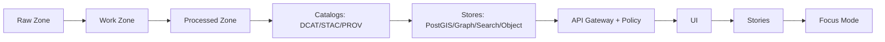

<!--
FILE: scripts/README.md
KANSAS FRONTIER MATRIX (KFM) — GOVERNED REPO ARTIFACT
-->

# `scripts/` — KFM CLI Scripts & Pipeline Runners 🧰🗺️


This folder contains **operator-facing** and **developer-facing** scripts that orchestrate KFM’s governed data workflows:

- acquire raw sources (or verify local snapshots),
- normalize / validate / enrich,
- emit **run records**, **validation reports**, **checksums**, and **STAC/DCAT/PROV** catalogs,
- (optionally) trigger controlled admin ops (reindexing, bootstrapping),
- support CI validation and local reproducibility.

> **Non-negotiable KFM invariant:** **Processed is the only publishable source of truth.**  
> Scripts MUST respect zones, catalogs, provenance, policy gates, and auditing. Raw/work are never served directly.

---

## Table of contents

- [What belongs in `scripts/`](#what-belongs-in-scripts)
- [Directory layout](#directory-layout)
- [Quickstart (local dev)](#quickstart-local-dev)
- [Common CLI contract](#common-cli-contract)
- [Script registry](#script-registry)
- [Truth path + data zones](#truth-path--data-zones)
- [Required artifacts & contracts](#required-artifacts--contracts)
  - [Run record contract (`run_record.json`)](#run-record-contract-run_recordjson)
  - [Validation report contract (`validation_report.json`)](#validation-report-contract-validation_reportjson)
  - [Audit event contract (`audit_event.json`)](#audit-event-contract-audit_eventjson)
- [Connector / ingestion pattern](#connector--ingestion-pattern)
- [Deterministic identity (`spec_hash`) and versioning](#deterministic-identity-spec_hash-and-versioning)
- [Catalogs: STAC/DCAT/PROV](#catalogs-stacdcatprov)
- [Evidence URIs + resolvers](#evidence-uris--resolvers)
- [Security requirements](#security-requirements)
- [Testing + CI gates](#testing--ci-gates)
- [Operations cookbook](#operations-cookbook)
- [Troubleshooting](#troubleshooting)
- [Contributing / adding a new script](#contributing--adding-a-new-script)
- [Appendices](#appendices)

---

## What belongs in `scripts/`

### ✅ In-scope
- **Thin runners / glue** that orchestrate pipeline work (acquire → normalize → validate → publish).
- **Validators** that confirm schemas/catalogs/checksums/geometry/time sanity/link integrity.
- **Admin/operator utilities** (dataset bootstrap, reindex triggers, controlled backfills).
- **CI helpers** that validate governed artifacts and produce machine-readable reports.

### 🚫 Out-of-scope (move elsewhere)
- Core domain logic → belongs in governed application layers (`src/...`) behind interfaces.
- Frontend/UI code → belongs under `web/`.
- Policy logic → belongs under `policy/` (OPA/Rego).
- Long-lived services → belong in `src/` with interfaces, tests, and contracts.

---

## Directory layout

> **Note:** If your repo uses different names (`tools/` vs `scripts/`, `pipelines/` vs `src/pipelines/`), update this section so it reflects reality. This README is governed; drift is not allowed.

Recommended (not confirmed in repo):

```text
scripts/
  connectors/                # dataset-specific runners (ingest/normalize/validate/publish)
  validators/                # reusable validators (stac/dcat/prov/checksums/geo/time)
  admin/                     # controlled ops (reindex, bootstrap, backfill triggers)
  ci/                        # CI entrypoints/wrappers (composite checks)
  dev/                       # safe developer utilities (non-production)
  _lib/                      # shared script helpers (logging, hashing, manifests)
  registry.yaml              # required: script registry (source of truth for this README table)
  README.md
```

---

## Quickstart (local dev)

KFM local dev is typically driven by **Docker Compose**.

1) Create environment file:
```bash
cp .env.example .env
```

2) Build & start services:
```bash
docker compose up --build
```

3) Common local endpoints (adjust to match compose):
- Web UI: `http://localhost:3000`
- API docs: `http://localhost:8000/docs`
- OPA: `http://localhost:8181`
- PostGIS: `localhost:5432`
- Neo4j: `http://localhost:7474` and `bolt://localhost:7687`
- OpenSearch: `http://localhost:9200`

> **Rule:** If a script requires a service, it must verify health (or fail fast with a clear error).

---

## Common CLI contract

Every script under `scripts/` MUST:

- support `--help`,
- accept a **dataset identifier** if it is dataset-scoped,
- support `--dry-run` when practical,
- write **machine-readable** outputs (run record + validation report when publishing),
- be **fail-closed** when governance inputs (license/sensitivity/policy labels) are missing.

### Standard flags (recommended baseline)
All dataset-scoped scripts should implement these flags *when applicable*:

| Flag | Meaning |
|---|---|
| `--dataset_id <id>` | Stable dataset identifier (required for dataset-scoped scripts). |
| `--run_id <id>` | Optional override; otherwise script generates deterministic or timestamp-based run id. |
| `--since <ISO8601>` / `--until <ISO8601>` | Time window for incremental ingest/backfill slices. |
| `--config <path>` | Connector/script config file path (YAML/JSON). |
| `--raw_dir <path>` / `--work_dir <path>` / `--processed_dir <path>` | Override default zone paths. |
| `--emit_catalogs` | Emit STAC/DCAT/PROV artifacts (where applicable). |
| `--emit_prov` | Emit PROV record (or PROV reference) for lineage. |
| `--dry-run` | No writes outside work zone; still runs validation. |
| `--force` | Requires explicit operator intent; bypasses only *non-governance* safe checks. |
| `--log_json` | Structured JSON logs for CI/ops ingestion. |

### Standard exit codes
- `0`: success
- `2`: usage / argument error
- `10`: validation failed (expected failure, machine-actionable)
- `20`: policy denied / governance missing (fail-closed)
- `30`: upstream acquisition failed (network/auth/provider issues)
- `50`: unexpected error / bug

---

## Script registry

**This table is a “nothing-left-out” guarantee.**  
Every file added/renamed/removed under `scripts/` MUST be reflected here in the same PR.

> **Recommendation:** make this table auto-generated from `scripts/registry.yaml` and CI-enforced.

| Script path | Type | What it does | Inputs (URIs / flags) | Outputs (zone + paths) | Evidence produced (run/validation/catalogs) | Sensitivity impact | Typical invocation |
|---|---|---|---|---|---|---|---|
| `scripts/<example>.py` | pipeline | Example placeholder | `--dataset_id …` | `data/work/...` → `data/processed/...` | `run_record.json + validation_report.json + STAC/DCAT/PROV` | none | `python scripts/<example>.py --dataset_id …` |
|  |  |  |  |  |  |  |  |
|  |  |  |  |  |  |  |  |

**Script types (recommended):**
- `pipeline` — dataset ingestion/transform/publish
- `validator` — schemas/catalogs/checksums/geometry/time checks
- `admin` — operational tasks (user bootstrap, reindex)
- `ci` — CI wrappers for governed checks
- `dev` — developer convenience (safe, non-production)

---

## Truth path + data zones

KFM’s “truth path” is:



### Zones (hard invariant)
- **Raw**: immutable capture of source-of-truth data; append-only writes; referenced by lineage.
- **Work**: intermediate artifacts; may be regenerated; used for QA.
- **Processed**: publishable artifacts with required catalogs and checksums.
- **Catalog**: STAC/DCAT/PROV entries runtime services consume.

> **Invariant:** processed is the only publishable source of truth. Raw/work are never served directly.

---

## Required artifacts & contracts

If a script **publishes or promotes** a dataset (anything that changes `data/processed/` or catalogs), it MUST emit:

- `run_record.json`
- `validation_report.json`
- checksums for processed artifacts
- required catalogs: **DCAT always**, and **STAC/PROV when applicable**
- an audit event (or audit-event staging artifact)

Promotion MUST be blocked unless these exist and validate (fail-closed).

### Canonical artifact paths (recommended)
Adjust to match repo, but keep the invariant.

- `data/raw/<dataset_id>/manifest.yml`
- `data/work/<dataset_id>/run_record.json`
- `data/work/<dataset_id>/validation_report.json`
- `data/processed/<dataset_id>/...` (publishable artifacts)
- `data/processed/<dataset_id>/checksums.txt` (sha256, deterministic ordering)
- `data/catalog/dcat/<dataset_id>.jsonld`
- `data/stac/collections/<dataset_id>.json` and `data/stac/items/<dataset_id>/*.json` (if spatial)
- `data/catalog/prov/<dataset_id>/<run_id>.json`

---

## Run record contract (`run_record.json`)

### Minimum required fields
A run record anchors reproducibility and governance review.

Required keys (minimum):
- `run_id`
- `dataset_id`
- `inputs[]` (each with `uri` + `sha256`)
- `code` (`git_sha` and/or `image`)
- `outputs[]` (each with `uri` + `sha256`)
- `validation_report` (path)
- `prov_ref` (path or URI)

### Recommended additional fields
- `started_at`, `ended_at`
- `actor` (service account / operator identity)
- `spec_hash` (see spec_hash section)
- `policy` summary (what labels/decisions were applied)
- `tool_versions` (python version, container digest, key libs)
- `metrics` (row counts, null rates, bbox/time ranges)
- `warnings[]` / `errors[]`

### Example `run_record.json`
```json
{
  "run_id": "run_2026-02-14T18:02:11Z_9f3c",
  "dataset_id": "example_dataset",
  "started_at": "2026-02-14T18:02:11Z",
  "ended_at": "2026-02-14T18:06:42Z",
  "actor": { "kind": "service_account", "id": "ci-bot", "role": "maintainer" },
  "spec_hash": "sha256:........................................................",
  "inputs": [
    { "uri": "data/raw/example_dataset/source.csv", "sha256": "................................" }
  ],
  "code": {
    "git_sha": "........................................",
    "image": "kfm/pipeline:........................................"
  },
  "outputs": [
    { "uri": "data/processed/example_dataset/example.parquet", "sha256": "................................" },
    { "uri": "data/processed/example_dataset/checksums.txt", "sha256": "................................" }
  ],
  "validation_report": "data/work/example_dataset/validation_report.json",
  "prov_ref": "data/catalog/prov/example_dataset/run_2026-02-14T18:02:11Z_9f3c.json",
  "catalog_refs": {
    "dcat": "data/catalog/dcat/example_dataset.jsonld",
    "stac_collection": "data/stac/collections/example_dataset.json",
    "stac_items_prefix": "data/stac/items/example_dataset/"
  },
  "policy": {
    "policy_label": "public",
    "sensitivity": "low",
    "redactions_applied": false
  },
  "metrics": {
    "row_count": 123456,
    "geometry_valid_pct": 100,
    "time_range": ["1850-01-01", "1900-12-31"],
    "bbox_wgs84": [-102.0, 36.9, -94.6, 40.0]
  },
  "warnings": [],
  "errors": []
}
```

---

## Validation report contract (`validation_report.json`)

Validation must be deterministic and machine-readable (JSON). It should support both human review and CI gating.

### Recommended shape
```json
{
  "dataset_id": "example_dataset",
  "run_id": "run_2026-02-14T18:02:11Z_9f3c",
  "overall_status": "pass",
  "checks": [
    { "id": "license.present", "status": "pass", "details": { "license": "CC-BY-4.0" } },
    { "id": "sensitivity.classified", "status": "pass", "details": { "class": "low" } },
    { "id": "schema.valid", "status": "pass", "details": { "schema_id": "kfm.schema.example.v1" } },
    { "id": "geo.valid", "status": "pass", "details": { "invalid_count": 0 } },
    { "id": "time.valid", "status": "pass", "details": { "future_dates": 0 } },
    { "id": "catalogs.valid", "status": "pass", "details": { "stac": true, "dcat": true, "prov": true } },
    { "id": "hashes.present", "status": "pass", "details": { "artifacts_hashed": 2 } }
  ],
  "policy_findings": [],
  "summary": {
    "errors": 0,
    "warnings": 0
  }
}
```

> **Fail-closed rule:** If license or sensitivity classification is missing, overall status must be `fail` and promotion must be blocked.

---

## Audit event contract (`audit_event.json`)

Scripts that cause governed effects (promotion, publish, redaction, backfill, index refresh) must emit an audit artifact.
If the repo has an API for writing the audit ledger, call it; otherwise, stage an audit artifact for ingestion.

### Recommended shape
```json
{
  "audit_ref": "audit_2026-02-14T18:06:43Z_71ab",
  "timestamp": "2026-02-14T18:06:43Z",
  "actor": { "kind": "service_account", "id": "ci-bot" },
  "action": "dataset.promote",
  "subject": { "dataset_id": "example_dataset", "run_id": "run_2026-02-14T18:02:11Z_9f3c" },
  "decision": { "result": "allow", "policy_label": "public" },
  "evidence": {
    "run_record": "data/work/example_dataset/run_record.json",
    "validation_report": "data/work/example_dataset/validation_report.json",
    "prov_ref": "data/catalog/prov/example_dataset/run_2026-02-14T18:02:11Z_9f3c.json"
  },
  "event_hash": "sha256:........................................................"
}
```

---

## Connector / ingestion pattern

Most dataset scripts follow governed stages:

1) **Discover** (capabilities, endpoints, auth needs; cache metadata)
2) **Acquire** (incremental slices when possible; else snapshot + diff)
3) **Normalize** (UTF-8, geometry WGS84, time ISO 8601)
4) **Validate** (schema, geometry, time, license, policy checks)
5) **Enrich** (join keys, place/time normalization, ER candidates)
6) **Publish** (promote to Processed; emit catalogs; trigger reindex)

### Connector configuration (recommended baseline keys)
Document (and externalize) config:

- `schedule`
- `incremental_cursor` (modified_date/eventDate/publicationDate; else snapshot+diff)
- `auth` strategy (**secrets in vault; never committed**)
- `rate_limit` + retries/backoff
- `format_targets` (JSON/CSV/GeoJSON/Parquet/COG/etc.)
- `policy_label` (`public | restricted | sensitive-location`)

---

## Deterministic identity (`spec_hash`) and versioning

> Goal: ensure that “same spec ⇒ same hash ⇒ comparable receipts,” and scripts can be audited for equivalence.

Recommended (not confirmed in repo):
- Define `spec_hash = sha256(JCS(spec))` where `spec` is a schema-defined object.
- Include `spec_schema_id` and `spec_recipe_version` so the hash meaning is stable over time.

Where used:
- raw manifest hashing
- run receipts/manifests
- dataset_version identifiers
- CI “material change” detection

---

## Catalogs: STAC/DCAT/PROV

### Cross-linking (required)
Catalog artifacts must cross-link cleanly (no dangling refs). Recommended approach:
- STAC `links[]` include a `via` link pointing to the DCAT dataset entry (e.g., `dcat://dataset/<id>`).
- PROV links raw assets → activity (run) → processed assets.

### Promotion gate checklist (merge-blocking)
Promotion to **Processed/public** must be blocked unless:

- [ ] License present
- [ ] Sensitivity classification present
- [ ] Schema + geospatial checks pass
- [ ] Checksums computed
- [ ] STAC/DCAT/PROV exist and validate
- [ ] Audit event recorded
- [ ] Human approval recorded if sensitive

---

## Evidence URIs + resolvers

KFM treats evidence references as resolvable URIs, typically:
- `prov://...`
- `stac://...`
- `dcat://...`
- `doc://...`
- `graph://...`

> **Requirement:** every citation/provenance reference MUST be resolvable via an API endpoint so the UI can “review evidence.”

---

## Security requirements

### Secrets and credentials
- Never commit secrets.
- Prefer env vars + secret managers.
- Do not log tokens, API keys, or PII.

### Sensitive locations / culturally restricted data
If a dataset includes sensitive locations:
- publish a **generalized derivative** publicly,
- store precise data under restricted access,
- maintain separate provenance chains documenting redaction/generalization.

### Least privilege & safe defaults
- Minimum role required.
- Missing policy input ⇒ **fail-closed**.

---

## Testing + CI gates

If you add/modify scripts that affect governed behavior, CI should enforce:

- Docs: lint + link-check + template validation
- Data: checksums + STAC/DCAT/PROV validation
- Policy: OPA tests (default deny; cite-or-abstain where applicable)
- Supply chain: SBOM + attestations (where enabled)
- Contract tests: API responses include provenance bundle and respect redaction

> Script changes that alter `data/processed/` MUST include run record, validation report, and catalog updates.

---

## Operations cookbook

### Enter the API container (debug)
```bash
docker compose exec api bash
```

### Run a dataset pipeline (example)
```bash
docker compose exec api python scripts/connectors/example_dataset/ingest.py --dataset_id example_dataset --emit_catalogs
```

### Reindex (if an admin script exists)
```bash
docker compose exec api python scripts/admin/reindex.py
```

---

## Troubleshooting

<details>
<summary><strong>Common failures & fixes</strong></summary>

### “Catalog validation failed”
- Ensure required STAC/DCAT/PROV files exist.
- Ensure cross-links resolve (no dangling `stac://` / `dcat://` / `prov://` pointers).
- Ensure checksums match actual artifacts.

### “Promotion blocked”
Promotion should be blocked when:
- validation report missing,
- run record missing,
- license missing,
- sensitivity classification missing,
- catalogs missing/invalid,
- audit event missing,
- sensitive dataset lacks approval.

### “Works on my machine”
If outputs differ across machines:
- pin container images/dependency versions,
- capture git SHA + image in run record,
- ensure deterministic ordering when writing outputs/checksums.

</details>

---

## Contributing / adding a new script

### Definition of Done (DoD)
- [ ] Script added to **Script registry**
- [ ] `--help` exists and is accurate
- [ ] Inputs/outputs documented (zones)
- [ ] Emits `run_record.json` + `validation_report.json` (if it publishes/promotes)
- [ ] Produces/updates catalogs (DCAT always; STAC/PROV when applicable)
- [ ] Deterministic checksums computed
- [ ] Sensitivity/policy labels applied (fail-closed if missing)
- [ ] Tests added/updated (unit/integration/contract)
- [ ] No secrets committed; no sensitive data in logs/artifacts
- [ ] CI passes

### Style rules
- Python: prefer module-backed CLIs; type hints encouraged.
- Bash: `set -euo pipefail`; quote vars; no destructive defaults.
- All: structured logs, explicit intent flags, idempotent where possible.

---

## Appendices

<details>
<summary><strong>Appendix A — Script header template (copy/paste)</strong></summary>

### Python header template
```python
"""
KFM Script: <name>
Type: pipeline|validator|admin|ci|dev
Purpose: <one sentence>
Inputs: <what it reads>
Outputs: <what it writes, include zones: raw/work/processed>
Governance:
  - Must not publish from raw/work
  - Must emit run_record + validation_report if promoting
  - Must apply sensitivity labels and fail-closed behavior
"""
```

### Bash header template
```bash
#!/usr/bin/env bash
set -euo pipefail

# KFM Script: <name>
# Type: pipeline|validator|admin|ci|dev
# Purpose: <one sentence>
# Safety: refuse to run without explicit dataset_id / output dir / confirmation flags
```

</details>

<details>
<summary><strong>Appendix B — Recommended artifacts layout (adjust to match your repo)</strong></summary>

- `data/raw/<dataset_id>/...`
- `data/work/<dataset_id>/run_record.json`
- `data/work/<dataset_id>/validation_report.json`
- `data/processed/<dataset_id>/...`
- `data/processed/<dataset_id>/checksums.txt`
- `data/catalog/dcat/<dataset_id>.jsonld`
- `data/stac/collections/<dataset_id>.json` and `data/stac/items/...`
- `data/catalog/prov/<dataset_id>/<run_id>.json`

</details>

---

## References (governance grounding)

- KFM Next-Generation Blueprint & Primary Guide (trust membrane; promotion gates; validators; audit ledger; evidence resolvers)
- KFM Comprehensive Data Source Integration Blueprint (connector contract; ingestion stages; validation gates; test plans)
- KFM Integration Report / “New Ideas Feb-2026” integration notes (spec_hash, receipts/manifests, CI acceptance harness patterns)

> This README is a governed operational artifact: keep it accurate, complete, and reviewable.
