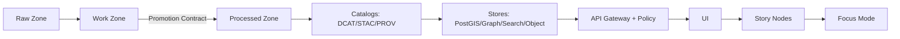

<!--
FILE: scripts/README.md
KANSAS FRONTIER MATRIX (KFM) — GOVERNED REPO ARTIFACT
If you change meaning (not just phrasing), route through governance review (CODEOWNERS + CI gates).
-->

# `scripts/` — KFM CLI Scripts & Pipeline Runners 🧰🗺️


This folder contains **operator-facing** and **developer-facing** scripts that orchestrate KFM’s governed workflows:

- acquire raw sources (or verify snapshots),
- normalize / validate / enrich,
- emit **run records**, **run manifests (receipts)**, **validation reports**, **checksums**, and **DCAT/STAC/PROV** catalogs,
- trigger controlled admin ops (reindexing, bootstrapping, backfills),
- support CI validation and local reproducibility.

> [!IMPORTANT]
> **Non-negotiable KFM invariant:** **Processed is the only publishable source of truth.**  
> Scripts must respect zones, catalogs, provenance, policy gates, and auditing. Raw/work are never served.

---

## Table of contents

- [Governance header](#governance-header)
- [What belongs in `scripts/`](#what-belongs-in-scripts)
- [Directory layout](#directory-layout)
- [Quickstart (local dev)](#quickstart-local-dev)
- [Common CLI contract](#common-cli-contract)
- [Script registry](#script-registry)
- [Truth path + data zones](#truth-path--data-zones)
- [Required artifacts & contracts](#required-artifacts--contracts)
  - [Run record contract (`run_record.json`)](#run-record-contract-run_recordjson)
  - [Run manifest contract (`run_manifest.json`)](#run-manifest-contract-run_manifestjson)
  - [Validation report contract (`validation_report.json`)](#validation-report-contract-validation_reportjson)
  - [Audit event contract (`audit_event.json`)](#audit-event-contract-audit_eventjson)
- [Deterministic identity (`spec_hash`) and versioning](#deterministic-identity-spec_hash-and-versioning)
- [Catalogs: DCAT/STAC/PROV](#catalogs-dcatstacprov)
- [Evidence refs + resolvers](#evidence-refs--resolvers)
- [Security requirements](#security-requirements)
- [Testing + CI gates](#testing--ci-gates)
- [Operations cookbook](#operations-cookbook)
- [Troubleshooting](#troubleshooting)
- [Contributing / adding a new script](#contributing--adding-a-new-script)
- [Appendices](#appendices)

---

## Governance header

| Field | Value |
|---|---|
| Document | `scripts/README.md` |
| Status | **Governed** |
| Applies to | CLI orchestration, promotion/publish tooling, validators, CI wrappers |
| Version | `v2.0.0-draft` |
| Effective date | 2026-02-15 |
| Owners | `.github/CODEOWNERS` *(required; if missing, treat as governance gap)* |
| Review triggers | any change affecting promotion rules, receipts, catalogs, policy posture, or evidence resolution |

> [!WARNING]
> **Fail-closed rule:** if required governance inputs are missing (license/sensitivity/receipts/catalogs), scripts must deny or abstain rather than proceed.

---

## What belongs in `scripts/`

### ✅ In-scope
- **Thin runners / glue** that orchestrate pipeline work (acquire → normalize → validate → promote/publish).
- **Validators** that confirm schemas/catalogs/checksums/geometry/time sanity/link integrity.
- **Admin/operator utilities** (bootstrap, controlled backfills, reindex triggers).
- **CI helpers** that validate governed artifacts and produce machine-readable reports.

### 🚫 Out-of-scope (move elsewhere)
- Core domain logic → belongs in governed application layers (`src/...`) behind interfaces.
- UI code → belongs under `web/`.
- Policy logic → belongs under `policy/` (OPA/Rego).
- Long-lived services → belong in `src/` with tests + contracts.

---

## Directory layout

> [!NOTE]
> If your repo uses different names (`tools/` vs `scripts/`, `pipelines/` vs `src/pipelines/`), update this section to reflect reality.
> This README is governed; drift is not allowed.

Recommended (not confirmed in repo):

```text
scripts/
├─ README.md                                   # this file
├─ registry.yaml                               # REQUIRED: script registry (source of truth for tables/links)
│
├─ connectors/                                 # dataset-scoped runners (ingest/transform/publish)
│  └─ <dataset_id>/                            # stable dataset id or source slug
│     ├─ ingest.(py|sh)                        # acquire → raw/work
│     ├─ validate.(py|sh)                      # work validation gates
│     ├─ promote.(py|sh)                       # controlled promotion to processed + catalogs
│     └─ backfill.(py|sh)                      # explicit backfill runner (optional)
│
├─ validators/                                 # reusable validators (schemas/catalogs/checksums/geo/time)
│  ├─ catalogs/                                # DCAT/STAC/PROV validators + link-check
│  ├─ receipts/                                # run_record/run_manifest schema checks
│  ├─ checksums/                               # sha256sum verify helpers
│  └─ policy/                                  # policy input validation prerequisites (fail closed)
│
├─ admin/                                      # controlled ops (reindex, bootstrap, maintenance)
├─ ci/                                         # CI wrappers (composite checks; fail-closed)
├─ dev/                                        # safe developer utilities (no side effects by default)
└─ _lib/                                       # shared helpers (logging, hashing, manifests, IO)
```

---

## Quickstart (local dev)

Local dev is typically driven by Docker Compose.

1) Create environment file:
```bash
cp .env.example .env
```

2) Build & start services:
```bash
docker compose up --build
```

3) Common local endpoints (adjust to match compose):
- Web UI: `http://localhost:3000`
- API docs: `http://localhost:8000/docs`
- OPA (optional): `http://localhost:8181`
- PostGIS: `localhost:5432`
- Neo4j: `http://localhost:7474` and `bolt://localhost:7687`

> [!IMPORTANT]
> If a script requires a service, it must verify health (or fail fast with a clear error).

---

## Common CLI contract

Every script under `scripts/` must:

- support `--help`,
- accept a dataset identifier if dataset-scoped,
- support `--dry-run` when practical,
- write machine-readable outputs (receipts/reports),
- be fail-closed when governance inputs (license/sensitivity/policy labels) are missing.

### Standard flags (recommended baseline)

| Flag | Meaning |
|---|---|
| `--dataset_id <id>` | stable dataset identifier (required for dataset-scoped scripts) |
| `--run_id <id>` | optional override; otherwise generate deterministic or timestamp-based run id |
| `--spec <path>` | governed spec file used for reproducibility (should produce `spec_hash`) |
| `--since <ISO8601>` / `--until <ISO8601>` | time window for incremental ingest/backfill slices |
| `--config <path>` | connector/script config path (YAML/JSON) |
| `--raw_dir <path>` / `--work_dir <path>` / `--processed_dir <path>` | override default zone paths |
| `--emit_catalogs` | emit DCAT/STAC/PROV artifacts where applicable |
| `--dry-run` | no writes outside work; still runs validation |
| `--force` | requires explicit operator intent; may bypass only non-governance safety checks |
| `--log_json` | structured JSON logs for CI/ops ingestion |

### Standard exit codes (recommended)
- `0`: success
- `2`: usage/argument error
- `10`: validation failed (expected failure, machine-actionable)
- `20`: policy denied / governance missing (fail-closed)
- `30`: upstream acquisition failed (network/auth/provider issues)
- `50`: unexpected error/bug

---

## Script registry

**This table is a “nothing-left-out” guarantee.**  
Every file added/renamed/removed under `scripts/` must be reflected here in the same PR.

> [!TIP]
> Prefer generating this table from `scripts/registry.yaml` and enforcing via CI.

| Script path | Type | What it does | Inputs | Outputs (zones) | Evidence produced | Sensitivity impact | Typical invocation |
|---|---|---|---|---|---|---|---|
| `scripts/connectors/<dataset_id>/ingest.py` | pipeline | acquire + normalize to raw/work | `--dataset_id` `--spec` | raw + work | run_record + validation_report | depends | `python ... --dataset_id ... --spec ...` |
| `scripts/connectors/<dataset_id>/promote.py` | pipeline | promote to processed + catalogs | `--dataset_id` `--run_id` | processed + catalog | run_manifest + catalogs + checksums + audit | high | `python ... --dataset_id ... --run_id ...` |
| `scripts/validators/catalogs/validate_catalogs.py` | validator | validate DCAT/STAC/PROV | paths | none | report only | none | `python ... --all` |
| `scripts/admin/reindex.py` | admin | rebuild indexes from catalogs | `--scope` | stores (derived) | audit event | medium | `python ... --scope ...` |

**Script types**
- `pipeline` — ingest/transform/promote/publish
- `validator` — schemas/catalogs/checksums/geo/time checks
- `admin` — operational tasks (reindex, maintenance)
- `ci` — CI wrappers for governed checks
- `dev` — developer convenience (safe by default)

---

## Truth path + data zones

KFM’s truth path:



### Zones (hard invariant)
- **Raw**: immutable capture; append-only; referenced by lineage.
- **Work**: intermediate artifacts; regeneratable; QA/profiling/receipts live here.
- **Processed**: publishable artifacts with required checksums + catalogs.
- **Catalog**: DCAT/STAC/PROV entries runtime services consume.

> [!IMPORTANT]
> Processed is the only publishable source of truth. Raw/work are never served directly.

---

## Required artifacts & contracts

If a script **publishes or promotes** a dataset (any change to `data/processed/` or `data/catalog/`), it must emit:

- `run_record.json`
- `validation_report.json`
- `run_manifest.json` *(Promotion Contract receipt; fail-closed)*
- processed checksums
- required catalogs: **DCAT always**, and **STAC/PROV when applicable**
- an audit event (or staged audit artifact)

Promotion must be blocked unless these exist and validate.

### Canonical artifact paths (recommended)
- `data/raw/<dataset_id>/manifest.yml`
- `data/work/<dataset_id>/runs/<run_id>/run_record.json`
- `data/work/<dataset_id>/runs/<run_id>/validation_report.json`
- `data/work/<dataset_id>/runs/<run_id>/run_manifest.json`
- `data/processed/<dataset_id>/<version_id>/checksums.sha256`
- `data/catalog/dcat/<dataset_id>.json` (+ version records where used)
- `data/catalog/stac/<dataset_id>/...` (if spatial)
- `data/catalog/prov/<dataset_id>/run_<run_id>.json`

---

## Run record contract (`run_record.json`)

### Minimum required fields
Required keys:
- `run_id`
- `dataset_id`
- `inputs[]` (each has `uri` + `sha256`)
- `code` (`git_sha` and/or image digest reference)
- `outputs[]` (each has `uri` + `sha256`)
- `validation_report` (path)
- `prov_ref` (path or evidence ref)

### Recommended additional fields
- `started_at`, `ended_at`
- `actor` (service account/operator identity)
- `spec_hash`, `spec_schema_id`, `spec_recipe_version`
- `policy` summary (classification/flags/redactions)
- `tool_versions`
- `metrics` (row counts, null rates, bbox/time ranges)
- `warnings[]` / `errors[]`

---

## Run manifest contract (`run_manifest.json`)

The run manifest is the **Promotion Contract receipt**. It is the merge/publish blocker.

### Minimum required fields (baseline)
- `run_id`, `dataset_id`
- `spec_hash` (+ `spec_schema_id`, `spec_recipe_version` recommended)
- `inputs[]` and `outputs[]` digests
- `code` identity (git SHA + image digest when available)
- `validation_report` reference
- catalog references (DCAT required; STAC conditional; PROV required)
- policy classification/sensitivity flags
- optional: attestations/signature refs when supply-chain verification is enabled

> [!IMPORTANT]
> If `run_manifest.json` is missing or invalid, promotion must deny.

---

## Validation report contract (`validation_report.json`)

Validation must be deterministic and machine-readable.

### Fail-closed rule (required)
If license or sensitivity classification is missing/unknown, overall status must be `fail` and promotion must be blocked.

Recommended shape:
```json
{
  "dataset_id": "example_dataset",
  "run_id": "run_...",
  "overall_status": "pass|fail",
  "checks": [
    { "id": "license.present", "status": "pass|fail", "details": {} },
    { "id": "sensitivity.classified", "status": "pass|fail", "details": {} },
    { "id": "schema.valid", "status": "pass|fail", "details": {} },
    { "id": "geo.valid", "status": "pass|fail", "details": {} },
    { "id": "time.valid", "status": "pass|fail", "details": {} },
    { "id": "catalogs.valid", "status": "pass|fail", "details": { "dcat": true, "stac": false, "prov": true } },
    { "id": "checksums.present", "status": "pass|fail", "details": {} }
  ],
  "summary": { "errors": 0, "warnings": 0 }
}
```

---

## Audit event contract (`audit_event.json`)

Scripts causing governed effects (promotion, publish, redaction, backfill, index refresh) must emit an audit artifact.
If an audit ledger API exists, call it; otherwise stage an audit artifact for ingestion.

Recommended shape:
```json
{
  "audit_ref": "audit_...",
  "timestamp": "2026-02-15T00:00:00Z",
  "actor": { "kind": "service_account", "id": "ci-bot" },
  "action": "dataset.promote|dataset.backfill|index.refresh|policy.change",
  "subject": { "dataset_id": "example_dataset", "run_id": "run_..." },
  "decision": { "result": "allow|deny", "policy_label": "public|restricted" },
  "evidence": {
    "run_record": "...",
    "run_manifest": "...",
    "validation_report": "...",
    "prov_ref": "..."
  },
  "event_hash": "sha256:..."
}
```

---

## Deterministic identity (`spec_hash`) and versioning

Goal: “same spec ⇒ same hash ⇒ comparable receipts.”

### Required definition
- `spec_hash = sha256(JCS(spec))` (RFC 8785 canonical JSON)
- include `spec_schema_id` and `spec_recipe_version` where possible

Used for:
- raw manifest identity
- watcher/connector specs
- run manifests/receipts
- material-change detection in CI

---

## Catalogs: DCAT/STAC/PROV

### Cross-linking (required)
Catalog artifacts must cross-link cleanly (no dangling refs):
- DCAT is always required for promoted dataset versions
- STAC is required when spatial assets are published
- PROV is required to link raw → processed lineage

### Promotion gate checklist (merge-blocking)
Promotion to processed/public must be blocked unless:
- [ ] license present
- [ ] sensitivity classification present
- [ ] schema/geo/time checks pass
- [ ] checksums computed and verified
- [ ] DCAT validates (required)
- [ ] STAC validates when spatial assets exist
- [ ] PROV validates (required)
- [ ] audit event recorded (or staged)

---

## Evidence refs + resolvers

KFM treats evidence references as resolvable URIs:
- `prov://...`
- `stac://...`
- `dcat://...`
- `doc://...`
- `graph://...`
- optional: `oci://...` for digest bundles

> [!IMPORTANT]
> Every citation/provenance reference must be resolvable via API so the UI can “review evidence” in a bounded number of calls.

---

## Security requirements

### Secrets and credentials
- never commit secrets
- prefer env vars + secret managers
- do not log tokens/API keys/PII

### Sensitive locations / culturally restricted data
- publish generalized derivatives publicly
- store precise data under restricted access
- record generalization/redaction in PROV
- fail closed if classification/flags are missing

### Least privilege
- scripts should assume minimum privileges
- missing governance inputs ⇒ deny (exit code 20)

---

## Testing + CI gates

Script changes affecting governed behavior should be enforced by CI:

- docs/stories validation when docs are touched
- data checksums + DCAT/STAC/PROV validation
- receipt schema validation (run_record + run_manifest)
- policy tests (`opa test` + conftest regression)
- API contract tests where scripts affect servable surfaces
- optional supply-chain verification (SBOM/attestations) when enabled

> [!IMPORTANT]
> Any script that writes to `data/processed/` must produce receipts and catalogs.

---

## Operations cookbook

### Enter the API container (debug)
```bash
docker compose exec api sh
```

### Run a dataset ingest (example shape)
```bash
docker compose exec api python scripts/connectors/example_dataset/ingest.py \
  --dataset_id example_dataset --spec specs/ingest/example_dataset.json --log_json
```

### Promote (controlled step)
```bash
docker compose exec api python scripts/connectors/example_dataset/promote.py \
  --dataset_id example_dataset --run_id run_2026-02-15T00:00:00Z --emit_catalogs
```

### Reindex (if present)
```bash
docker compose exec api python scripts/admin/reindex.py --scope all
```

---

## Troubleshooting

<details>
<summary><strong>Common failures & fixes</strong></summary>

### “Catalog validation failed”
- ensure required DCAT/STAC/PROV files exist
- ensure cross-links resolve (no dangling refs)
- ensure catalogs match the digests/checksums they claim

### “Promotion blocked”
Expected causes:
- run manifest missing/invalid
- validation report missing/failed
- license missing
- sensitivity classification missing
- catalogs missing/invalid
- audit event missing (or cannot be written)
- sensitive dataset lacks explicit approval path (repo-specific)

### “Works on my machine”
If outputs differ across machines:
- pin container images/deps
- capture git SHA + image digest in receipts
- ensure deterministic ordering for checksums and catalog writers

</details>

---

## Contributing / adding a new script

### Definition of Done (DoD)
- [ ] script added to registry
- [ ] `--help` exists and is accurate
- [ ] inputs/outputs documented (zones)
- [ ] emits `run_record.json` + `validation_report.json` + `run_manifest.json` if promoting/publishing
- [ ] produces/updates catalogs (DCAT always; STAC/PROV as applicable)
- [ ] deterministic checksums computed and verified
- [ ] sensitivity/policy labels applied (fail closed if missing)
- [ ] tests added/updated
- [ ] no secrets committed; no sensitive data in logs/artifacts
- [ ] CI passes

### Style rules
- Python: prefer module-backed CLIs; type hints encouraged.
- Bash: `set -euo pipefail`; quote vars; no destructive defaults.
- All: structured logs, explicit intent flags, idempotent where possible.

---

## Appendices

<details>
<summary><strong>Appendix A — Script header template (copy/paste)</strong></summary>

### Python header
```python
"""
KFM Script: <name>
Type: pipeline|validator|admin|ci|dev
Purpose: <one sentence>
Inputs: <what it reads>
Outputs: <what it writes (zones: raw/work/processed/catalog)>
Governance:
  - processed-only publishable truth
  - fail-closed if license/sensitivity/receipts missing
  - emit receipts (run_record, run_manifest) + validation_report when promoting
  - catalogs required: DCAT always; STAC conditional; PROV required
"""
```

### Bash header
```bash
#!/usr/bin/env bash
set -euo pipefail

# KFM Script: <name>
# Type: pipeline|validator|admin|ci|dev
# Purpose: <one sentence>
# Safety: refuse to run without explicit dataset_id/spec; no destructive defaults
```

</details>

<details>
<summary><strong>Appendix B — Canonical artifacts (quick reference)</strong></summary>

- `data/raw/<dataset_id>/manifest.yml`
- `data/work/<dataset_id>/runs/<run_id>/run_record.json`
- `data/work/<dataset_id>/runs/<run_id>/validation_report.json`
- `data/work/<dataset_id>/runs/<run_id>/run_manifest.json`
- `data/processed/<dataset_id>/<version_id>/checksums.sha256`
- `data/catalog/dcat/<dataset_id>.json`
- `data/catalog/stac/<dataset_id>/**` (if spatial)
- `data/catalog/prov/<dataset_id>/run_<run_id>.json`

</details>

---

## References (governance grounding)

- `.github/README.md` — repo governance + required CI gates
- KFM Next-Gen Blueprint & Primary Guide — trust membrane; promotion gates; audit/evidence requirements
- KFM Comprehensive Data Source Integration Blueprint — ingestion stages; validation gates; test plans
- Feb-2026 integration patterns — spec_hash semantics (RFC 8785), receipts/manifests, acceptance harness patterns

> This README is a governed operational artifact: keep it accurate, complete, and reviewable.
