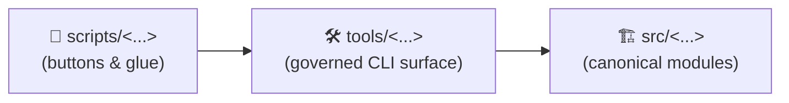
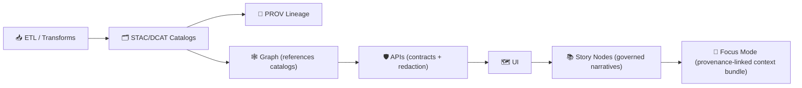

<!--
📌 This README defines the repo-wide automation surface for KFM / Kansas‑Matrix‑System.
🗓️ Last updated: 2026-01-11
🔁 Review cycle: 90 days (or anytime pipeline order / catalogs / policy pack / CI gates change)

Prime directive:
- `scripts/` = orchestration buttons & glue 🧰
- `tools/`   = governed toolchain surface 🛠️
- `src/`     = canonical implementation 🏗️
-->

<div align="center">

# 🧰 `scripts/` — KFM Automation Toolkit

**Repeatable commands for dev, data ops, GIS/remote‑sensing workflows, modeling/simulation orchestration, and deployment “glue”.**  
Safe-by-default ✅ • Idempotent ♻️ • Provenance-first 🧾 • Hostile-input aware 🛡️ • Contract-first 📜


</div>

> [!IMPORTANT]
> **`scripts/` is orchestration — not “the truth.”**  
> If behavior becomes **core**, move the implementation into **`src/`** (or `api/src/`) and let scripts call it.  
> This aligns with KFM’s “clean architecture + modular” posture: thin command surfaces, canonical engines, and testable contracts. :contentReference[oaicite:0]{index=0} :contentReference[oaicite:1]{index=1}

> [!IMPORTANT]
> **KFM pipeline ordering is absolute (governed):**  
> **ETL → STAC/DCAT/PROV Catalogs → Graph → APIs → UI → Story Nodes → Focus Mode**  
> Scripts must not create **mystery artifacts** that bypass catalogs/provenance. :contentReference[oaicite:2]{index=2}

---

## 🔗 Quick links
- 🧭 Repo overview: **[`../README.md`](../README.md)**
- 🛠️ Governed toolchain surface: **[`../tools/README.md`](../tools/README.md)** *(recommended)*
- 🧪 Repo-wide tests + QA gates: **[`../tests/README.md`](../tests/README.md)** *(recommended)*
- 🧩 Executable code boundary: **[`../src/README.md`](../src/README.md)** *(if present)*
- 📦 Data + metadata boundary: **[`../data/README.md`](../data/README.md)** *(if present)*
- 📓 MCP (runs/receipts, experiments): **[`../mcp/MCP-README.md`](../mcp/MCP-README.md)** *(recommended, if present)*
- 🌐 Web UI boundary: **[`../web/README.md`](../web/README.md)** *(if present)*

---

<details>
<summary><b>🧭 Table of contents</b></summary>

- [🧾 Doc metadata](#-doc-metadata)
- [🧭 Where scripts live in the stack](#-where-scripts-live-in-the-stack)
- [🎯 What belongs here (and what doesn’t)](#-what-belongs-here-and-what-doesnt)
- [🧱 The governed boundary scripts must respect](#-the-governed-boundary-scripts-must-respect)
- [🏁 Quickstart](#-quickstart)
- [🗂️ Recommended folder map](#️-recommended-folder-map)
- [🧱 Standard script contract](#-standard-script-contract)
- [📐 Script templates (copy/paste)](#-script-templates-copypaste)
- [🧭 Data lifecycle + evidence artifacts](#-data-lifecycle--evidence-artifacts)
- [🧾 Observability & provenance](#-observability--provenance)
- [🧨 Safety guardrails (non-negotiable)](#-safety-guardrails-non-negotiable)
- [⚡ Performance, scaling, and concurrency](#-performance-scaling-and-concurrency)
- [🗺️ GIS + PostGIS scripting tips](#️-gis--postgis-scripting-tips)
- [🛰️ Remote sensing scripting tips](#️-remote-sensing-scripting-tips)
- [🧪 QA scripts (contracts & acceptance gates)](#-qa-scripts-contracts--acceptance-gates)
- [🤖 Automation roadmaps (optional, proposed)](#-automation-roadmaps-optional-proposed)
- [🧩 Adding a new script (checklist)](#-adding-a-new-script-checklist)
- [📋 Script registry](#-script-registry)
- [📚 Project reference library influence map](#-project-reference-library-influence-map)
- [✅ Definition of “done” for a script](#-definition-of-done-for-a-script)
- [🕰️ Version history](#️-version-history)

</details>

---

## 🧾 Doc metadata

| Field | Value |
|---|---|
| Doc | `scripts/README.md` |
| Status | Active ✅ |
| Last updated | **2026-01-11** |
| Audience | Contributors shipping automation, data ops, validators, safe wrappers around `tools/` + `src/` |
| Prime directive | **No script may bypass catalogs (STAC/DCAT/PROV) or weaken governance.** |

---

## 🧭 Where scripts live in the stack

Think “buttons → instruments → engine”:



### ✅ How to decide “scripts vs tools vs src”
- **If it’s reusable and CI‑gated** → it probably belongs in `tools/`
- **If it’s core logic** → it belongs in `src/`
- **If it’s environment glue, orchestration, or local convenience** → `scripts/`

> [!TIP]
> Scripts can call `tools/` directly for governed actions.  
> If you find yourself duplicating validation/provenance logic in `scripts/`, stop and promote it into `tools/`. :contentReference[oaicite:3]{index=3}

---

## 🎯 What belongs here (and what doesn’t)

### ✅ Good fits for `scripts/`
- 🧱 **Environment bootstrap**: install deps, initialize DB schema, load seed/reference data
- 🧰 **Dev helpers**: run local stack, health checks, smoke tests, “make my laptop match CI”
- 🗺️ **GIS tooling wrappers**: convert formats, validate CRS, generate tiles, build COGs, reprojection helpers
- 🛰️ **Remote sensing orchestrators**: Earth Engine export triggers, download trackers, derived-product packagers
- 🧮 **Model/simulation orchestration**: run jobs with recorded configs, seeds, and output receipts
- 🧪 **Acceptance gates**: schema validation, link checks, provenance completeness, contract checks
- 🕒 **Scheduled jobs**: backups, cache cleanup, log rotation (cron/Kubernetes CronJob)
- 🧾 **MCP helpers**: generate experiment folders (`EXP-###`), receipts, and reproducibility manifests :contentReference[oaicite:4]{index=4}

### ❌ Not a good fit for `scripts/`
- 🚫 **Core ETL logic** (belongs in `src/pipelines/`)
- 🚫 **Domain/business rules** (belongs in `src/` domain/application layers or `api/src/`)
- 🚫 **Duplicate implementations** of pipeline steps (scripts should call canonical modules)
- 🚫 **One-off “forever scripts”** that bypass provenance, approvals, or classification propagation
- 🚫 **Unreviewed publishing** that creates “published-looking” outputs without STAC/DCAT/PROV boundary artifacts :contentReference[oaicite:5]{index=5}

> [!TIP]
> Scripts are the “buttons and levers.” If it’s “the engine,” it belongs in `src/`. 🔧➡️🏗️

---

## 🧱 The governed boundary scripts must respect

KFM is designed so every user-facing claim traces back to evidence via a strict pipeline.  
(These stages are *interfaces*: each stage consumes only the prior stage’s boundary artifacts.) :contentReference[oaicite:6]{index=6}



### ✅ What this means for automation
- Scripts can **run** ETL, but must ensure:
  - outputs land in `data/raw → data/work → data/processed`
  - boundary artifacts exist **before** downstream stages run:
    - STAC → `data/stac/**`
    - DCAT → `data/catalog/dcat/**`
    - PROV → `data/prov/**` :contentReference[oaicite:7]{index=7}
- Scripts can **validate** contracts + metadata, and should fail fast in CI when:
  - schemas don’t validate
  - provenance is missing/incomplete
  - links/assets don’t resolve
  - governance rules fail (license, classification propagation, redaction expectations)

### 🪪 Dataset ID hygiene (recommended)
Use **two IDs** (don’t overload one field):
- `dataset_id` = human meaningful (versioned)
- `artifact_id` = information‑free stable ID (hash/UUID/ULID)

When a script needs a dataset identifier, prefer a stable, versioned ID (example pattern):
- `kfm.<region>.<theme>.<year_range>.v<version>`

> [!NOTE]
> Dataset versioning should link revisions in DCAT/PROV (e.g., `prov:wasRevisionOf`). :contentReference[oaicite:8]{index=8}

---

## 🏁 Quickstart

### 1) Discover available scripts
- Browse by category folder (see map below)
- Run help first:
  - `./scripts/<path>/my_script.sh --help`
  - `pwsh ./scripts/<path>/my_script.ps1 --help`
  - `python scripts/<path>/my_script.py --help`

> [!IMPORTANT]
> Every script **must** support `--help` and include **at least 2 runnable examples**.

### 2) Set environment (no secrets in git) 🔐
- Prefer repo-level `.env.example` → `.env` *(if present)*
- Scripts should read config from:
  - environment variables ✅
  - or a config file *path* passed as an argument/env ✅

**Never hardcode credentials. Never print secrets.**

### 3) Default to safety ✅
Preferred contract:
- `--dry-run` (default) → prints actions
- `--apply` → performs changes
- `--yes` → skips prompts
- `--env {dev|staging|prod}` → required when environment matters
- `--run-id <id>` → strongly recommended for correlation + provenance

---

## 🗂️ Recommended folder map

> Keep this list current as categories are introduced.

```text
📁 scripts/
├─ 🧰 _lib/               # shared helpers (logging, env validation, guardrails)
├─ 🧰 dev/                # local stack helpers, smoke tests, DX scripts
├─ 🧱 bootstrap/          # first-run setup (deps, DB init, seed/reference loads)
├─ 🗄️ db/                 # migrations, backups, restores, snapshots, sanity checks
├─ 🕸️ graph/              # graph sync/load helpers (must reference catalog IDs)
├─ 🏷️ catalogs/            # STAC/DCAT/PROV build + validate wrappers (usually call tools/)
├─ 🧪 pipelines/           # pipeline runners (thin wrappers around src/pipelines)
├─ 🗺️ gis/                # geoprocessing helpers (vector/raster, tiling, CRS checks)
├─ 🛰️ remote_sensing/     # GEE wrappers, export tracking, indexing helpers
├─ 🧮 simulation/         # scenario runners (must record seeds/configs + provenance)
├─ 🤖 ml/                 # train/eval runners (must record datasets + metrics + provenance)
├─ 🧪 qa/                 # validators, contract checks, dataset acceptance gates
├─ 🔐 security/           # secrets scans, sensitive-data scans, hostile-input checks
├─ 🧹 housekeeping/       # rotate logs, purge caches, cleanup artifacts
└─ 🧪 ci/                 # stable entrypoints used by CI (deterministic, non-interactive)
```

> [!NOTE]
> If you add a new category folder, also add it to the Table of contents and script registry. 🧩

---

## 🧱 Standard script contract

To keep `scripts/` predictable (and safe), every script **must** follow the same behavioral contract.

### ✅ CLI interface requirements
All scripts must support:

- `--help` prints:
  - purpose (1–2 lines)
  - inputs/outputs (paths or tables)
  - side effects (DB writes? file writes? network calls?)
  - required env vars
  - examples (at least 2)

- `--version` prints:
  - semver (preferred) or git SHA
  - build timestamp (optional)

- Modes:
  - `--dry-run` is the default (or clearly supported)
  - `--apply` performs writes/changes

- Safety:
  - `--yes` skips interactive prompts
  - `--env {dev|staging|prod}` when environment matters
  - if `--env prod` + `--apply` → require an additional explicit prod acknowledgement flag  
    e.g. `--i-acknowledge-production`

- Provenance ergonomics (recommended):
  - `--run-id <id>` (or env `KFM_RUN_ID`) to correlate logs + PROV
  - `--dataset-id <id>` (when acting on a dataset)
  - `--outdir <path>` for artifact destinations
  - `--log-json` for machine-readable logs (JSONL)
  - `--no-network` default *(or explicit `--allow-network` for fetchers)*

**Exit codes (standard):**
- `0` success
- `2` usage/CLI error (bad args)
- `3` validation failure (inputs invalid; catalogs missing; schema mismatch) *(recommended)*
- `>=10` runtime failures (I/O, network, DB, permissions, unexpected exceptions)

> [!NOTE]
> It’s okay to add flags, but don’t break the standard ones (`--help`, `--version`, `--dry-run`, `--apply`, `--yes`, `--env`).  
> Consistency beats cleverness. 🧠✅

### 🧾 “Script header” (recommended)
At the top of each script, include:
- Name + purpose
- Inputs / outputs
- Side effects
- Owner/team (or “unowned”)
- Safety defaults (`dry-run` default, confirmation behavior)
- Provenance expectations (what IDs/receipts are written)

### 🧾 Script manifest (recommended for discoverability)
Keep a tiny machine-readable manifest next to scripts that matter:

```yaml
# scripts/<category>/<name>.script.yaml
name: "export_county_tiles"
entrypoint: "scripts/gis/export_county_tiles.py"
owner: "@kfm-team"
inputs:
  - "data/processed/<domain>/**"
outputs:
  - "data/processed/<domain>/tiles/**"
  - "data/stac/**"
  - "data/catalog/dcat/**"
  - "data/prov/**"
default_mode: "dry_run"
network:
  default: "deny"
determinism:
  stable_sorting: true
  seeded: true
gates:
  - "stac_schema"
  - "dcat_schema"
  - "prov_schema"
  - "license_required"
```

---

## 📐 Script templates (copy/paste)

> [!TIP]
> Prefer **Python** for cross‑platform automation. Use Bash/Pwsh when it’s truly OS‑specific.  
> Treat CLI parsing + structured logging as “table stakes.”

<details>
<summary><b>🐚 Bash (safe defaults + exit codes)</b></summary>

```bash
#!/usr/bin/env bash
set -euo pipefail
IFS=$'\n\t'

# -----------------------------------------------------------------------------
# Name:        example.sh
# Purpose:     Example safe-by-default script template
# Inputs:      flags + env vars
# Outputs:     files in outdir (when --apply)
# Side effects: none by default (dry-run)
# Owner:       @kfm-team
# -----------------------------------------------------------------------------

DRY_RUN=1
APPLY=0
YES=0
ENVIRONMENT="dev"
RUN_ID="${KFM_RUN_ID:-}"
LOG_JSON=0

usage() {
  cat <<'EOF'
Usage:
  ./scripts/example.sh [--dry-run|--apply] [--env dev|staging|prod] [--run-id ID] [--log-json] [--yes]

Examples:
  ./scripts/example.sh --dry-run
  ./scripts/example.sh --apply --env staging --run-id RUN-2026-01-11-demo --yes
EOF
}

log() {
  local level="$1"; shift
  local msg="$*"
  if [[ "$LOG_JSON" -eq 1 ]]; then
    printf '{"ts":"%s","level":"%s","run_id":"%s","msg":%q}\n' "$(date -Is)" "$level" "$RUN_ID" "$msg"
  else
    printf "[%s] %s (run_id=%s) %s\n" "$level" "$(date -Is)" "$RUN_ID" "$msg"
  fi
}

die() { log "ERROR" "$*"; exit 10; }

# Parse args (minimal)
while [[ $# -gt 0 ]]; do
  case "$1" in
    --help) usage; exit 0 ;;
    --version) echo "v0.0.0+local"; exit 0 ;;
    --dry-run) DRY_RUN=1; APPLY=0; shift ;;
    --apply) DRY_RUN=0; APPLY=1; shift ;;
    --yes) YES=1; shift ;;
    --log-json) LOG_JSON=1; shift ;;
    --env) ENVIRONMENT="${2:-}"; shift 2 ;;
    --run-id) RUN_ID="${2:-}"; shift 2 ;;
    *) usage; exit 2 ;;
  esac
done

if [[ -z "$RUN_ID" ]]; then
  RUN_ID="RUN-$(date +%Y%m%dT%H%M%S)"
fi

if [[ "$ENVIRONMENT" == "prod" && "$APPLY" -eq 1 && "$YES" -ne 1 ]]; then
  die "Refusing prod apply without --yes (and ideally a stronger prod ack flag)."
fi

log "INFO" "Starting (env=$ENVIRONMENT, dry_run=$DRY_RUN)"

# ...work...
log "INFO" "Would do X"
if [[ "$APPLY" -eq 1 ]]; then
  log "INFO" "Doing X now"
fi

log "INFO" "Done"
exit 0
```

</details>

<details>
<summary><b>🐍 Python (argparse + JSONL logs + dry-run default)</b></summary>

```python
#!/usr/bin/env python3
from __future__ import annotations

import argparse
import json
import os
import sys
from datetime import datetime, timezone
from pathlib import Path
from typing import Any

EXIT_OK = 0
EXIT_USAGE = 2
EXIT_VALIDATION = 3
EXIT_RUNTIME = 10


def now_iso() -> str:
    return datetime.now(timezone.utc).isoformat()


def log(level: str, msg: str, *, run_id: str, jsonl: bool) -> None:
    if jsonl:
        print(json.dumps({"ts": now_iso(), "level": level, "run_id": run_id, "msg": msg}))
    else:
        print(f"[{level}] {now_iso()} (run_id={run_id}) {msg}")


def main(argv: list[str]) -> int:
    p = argparse.ArgumentParser(
        description="Example KFM script template (safe-by-default).",
        formatter_class=argparse.RawTextHelpFormatter,
    )
    p.add_argument("--version", action="store_true", help="Print version and exit.")
    p.add_argument("--dry-run", action="store_true", help="Print actions only (default).")
    p.add_argument("--apply", action="store_true", help="Perform changes.")
    p.add_argument("--yes", action="store_true", help="Skip prompts (dangerous).")
    p.add_argument("--env", choices=["dev", "staging", "prod"], default="dev")
    p.add_argument("--run-id", default=os.environ.get("KFM_RUN_ID", ""))
    p.add_argument("--log-json", action="store_true", help="Emit JSONL logs.")
    p.add_argument("--outdir", default="reports/example")
    args = p.parse_args(argv)

    if args.version:
        print("v0.0.0+local")
        return EXIT_OK

    dry_run = True
    if args.apply:
        dry_run = False
    if args.dry_run:
        dry_run = True

    run_id = args.run_id or f"RUN-{datetime.now().strftime('%Y%m%dT%H%M%S')}"

    if args.env == "prod" and not dry_run and not args.yes:
        log("ERROR", "Refusing prod apply without --yes (and ideally a stronger prod ack flag).",
            run_id=run_id, jsonl=args.log_json)
        return EXIT_USAGE

    outdir = Path(args.outdir)
    log("INFO", f"Starting (env={args.env}, dry_run={dry_run}, outdir={outdir})", run_id=run_id, jsonl=args.log_json)

    # Example validation
    if not outdir.parent.exists() and not dry_run:
        outdir.parent.mkdir(parents=True, exist_ok=True)

    # Example action
    log("INFO", "Would generate artifact manifest", run_id=run_id, jsonl=args.log_json)
    if not dry_run:
        outdir.mkdir(parents=True, exist_ok=True)
        (outdir / "MANIFEST.txt").write_text(f"run_id={run_id}\n", encoding="utf-8")

    log("INFO", "Done", run_id=run_id, jsonl=args.log_json)
    return EXIT_OK


if __name__ == "__main__":
    raise SystemExit(main(sys.argv[1:]))
```

</details>

<details>
<summary><b>🟩 Node.js (when you must live near the web toolchain)</b></summary>

```js
#!/usr/bin/env node
/**
 * Name: example.mjs
 * Purpose: Example KFM script template for Node tooling
 * Safety: dry-run default, explicit --apply
 */
import process from "node:process";

function usage() {
  console.log(`
Usage:
  node scripts/example.mjs [--dry-run|--apply] [--run-id ID] [--log-json]

Examples:
  node scripts/example.mjs --dry-run
  node scripts/example.mjs --apply --run-id RUN-2026-01-11-demo --log-json
`);
}

function nowIso() {
  return new Date().toISOString();
}

function log(level, msg, { runId, jsonl }) {
  if (jsonl) {
    console.log(JSON.stringify({ ts: nowIso(), level, run_id: runId, msg }));
  } else {
    console.log(`[${level}] ${nowIso()} (run_id=${runId}) ${msg}`);
  }
}

const argv = process.argv.slice(2);
let dryRun = true;
let runId = process.env.KFM_RUN_ID || "";
let jsonl = false;

for (let i = 0; i < argv.length; i++) {
  const a = argv[i];
  if (a === "--help") { usage(); process.exit(0); }
  if (a === "--version") { console.log("v0.0.0+local"); process.exit(0); }
  if (a === "--dry-run") { dryRun = true; continue; }
  if (a === "--apply") { dryRun = false; continue; }
  if (a === "--log-json") { jsonl = true; continue; }
  if (a === "--run-id") { runId = argv[++i] || ""; continue; }
  usage(); process.exit(2);
}

runId = runId || `RUN-${nowIso().replace(/[-:.TZ]/g, "")}`;
log("INFO", `Starting (dry_run=${dryRun})`, { runId, jsonl });
// ...
log("INFO", "Done", { runId, jsonl });
process.exit(0);
```

</details>

---

## 🧭 Data lifecycle + evidence artifacts

KFM’s data work is **staged** and **traceable**. Scripts that ingest or transform data must follow required staging and produce boundary artifacts. :contentReference[oaicite:9]{index=9}

1) 📥 Write raw inputs → `data/raw/<domain>/`  
2) 🧱 Write intermediates → `data/work/<domain>/`  
3) ✅ Write publishable outputs → `data/processed/<domain>/`  
4) 🗃️ Emit boundary artifacts **before** anything is used downstream:
   - STAC → `data/stac/**`
   - DCAT → `data/catalog/dcat/**`
   - PROV → `data/prov/**`

> [!IMPORTANT]
> KFM treats analysis outputs / AI-generated layers / simulation outputs as **first‑class datasets** (“evidence artifacts”):  
> store them in `data/processed/…`, catalog them in STAC/DCAT, trace them in PROV, and expose them only through governed APIs. :contentReference[oaicite:10]{index=10}

### 🪪 Classification + sovereignty propagation (hard rule)
- Outputs cannot be **less restricted** than their inputs unless a reviewed redaction step exists.
- If a script cannot determine classification, it must default to **restricted** (deny-by-default).
- Avoid “side-channels”: never export sensitive precise coordinates by accident (e.g., debug GeoJSON dumps). :contentReference[oaicite:11]{index=11}

### ✅ “Thin wrapper” pattern (required for anything important)
If you’re tempted to put real transformation logic in a script, do this instead:
- implement core logic in `src/…` (pipelines/domain/services)
- keep the script as a thin CLI wrapper that:
  - validates inputs
  - calls the canonical module/tool
  - writes run receipts/logs
  - triggers catalog/provenance generation and validation

---

## 🧾 Observability & provenance

Every script should:
- 🪵 Use structured logging (`timestamp`, `level`, `component`, `run_id`)
- 🧷 Print where outputs were written + what changed (counts, bytes, features)
- 🧾 Capture provenance inputs/outputs:
  - input file list + checksums (when feasible)
  - key parameters (bbox, time window, CRS, resolution, seeds)
  - IDs/paths to produced STAC/DCAT/PROV artifacts
  - config hash + code version (git SHA) :contentReference[oaicite:12]{index=12}

### 🧾 “Run receipt” (🔥 strongly recommended for `--apply`)
When a script changes state, write a receipt that another person can replay:

- human-readable: `mcp/runs/<RUN-ID>/MANIFEST.md`
- machine-readable: `data/prov/<RUN-ID>.jsonld`

Receipt SHOULD include:
- git SHA, environment, operator identity (if available)
- inputs + checksums
- outputs + checksums
- produced catalog IDs (collection/item/dataset IDs)
- warnings (redactions applied, schema deviations, missing optional evidence)

> [!TIP]
> MCP expects **protocols + IDs** (e.g., `EXP-001`) and traceable results (timestamp/ID → code → data). :contentReference[oaicite:13]{index=13}

---

## 🧨 Safety guardrails (non-negotiable)

### ✅ Safe-by-default behavior
- 🛑 **No destructive actions by default**
- 🧪 Default mode should be `--dry-run`
- 🧯 Destructive actions require explicit confirmation flags

### 🏭 Production protection
Scripts that can write to prod must:
- require explicit `--env prod`
- require `--i-acknowledge-production` *(recommended stronger-than-yes flag)*
- log who/what/when:
  - user (if detectable), host, timestamp, run_id
  - git SHA (if available)
  - container digest (if available)

### 🧊 Atomic writes (strongly recommended)
For file outputs:
- write to `*.tmp` then rename (atomic on most filesystems)
- never leave half-written “published” outputs behind
- prefer content-addressed paths (hash-in-path) for immutable artifacts

### 🧯 Hostile input posture
Assume inputs are hostile (files from the world, archives, rasters, JSON, PDFs, 3D assets).
- validate file types (allowlists)
- enforce size limits and decompression limits
- treat URL fetching as high-risk (SSRF; private IP blocks; allowlists)
- isolate complex parsing when possible (containers / sandboxing / subprocess limits)

> [!CAUTION]
> If a script can delete, drop, truncate, overwrite, revoke, or publish:  
> **dry-run default + explicit apply + explicit confirmation** is mandatory. 🚫🧨✅

---

## ⚡ Performance, scaling, and concurrency

Automation should scale from “laptop demo” to “statewide workloads” without rewrites.

### ✅ Scaling patterns (preferred)
- 📦 **Chunking/partitioning**: process by tile, county, watershed, time window
- 🧱 **Pipeline breakers**: materialize only when needed (then resume streaming)
- ♻️ **Idempotency keys**: `(dataset_id, version, tile_id, src_checksum)` patterns
- 🗃️ **Metadata-driven access**: scripts should navigate via catalogs/IDs, not brittle paths
- 🧵 **Concurrency safety**:
  - avoid shared mutable state without locks
  - serialize destructive ops
  - prefer job queues / worker pools over ad-hoc threading for heavy runs

### ✅ “Boring performance wins”
- cache downloads (ETag/Last-Modified when possible)
- avoid reprocessing unchanged inputs
- push expensive spatial operations into PostGIS when appropriate
- keep UI-facing assets web-friendly (tiles, COGs, simplified vectors)

---

## 🗺️ GIS + PostGIS scripting tips

### ✅ Make CRS and units explicit
- refuse “unknown SRID” geometries by default
- log CRS for inputs/outputs
- document axis-order and unit conversion
- record reprojection and resampling choices (method, resolution, nodata)

### ✅ Prefer database-side spatial operations when appropriate
- buffers, intersects, within, distance joins: PostGIS is often safer/faster than Python loops
- use staging tables and transactional swaps:
  1) load → 2) validate counts/geometry → 3) swap/rename in a transaction

### ✅ Web-serving friendliness
When scripts generate assets meant for the UI:
- vectors: simplify or tile (avoid multi‑MB GeoJSON blobs)
- rasters: prefer COG (with overviews)
- tiles: verify CRS (commonly EPSG:3857 for web tiles) and metadata

### 🔐 Privacy reminder
GeoJSON is easy to copy. Treat “committed vectors” as a disclosure boundary:
- don’t export restricted geometries without explicit governance approval
- prefer catalog pointers to governed stores for sensitive layers

---

## 🛰️ Remote sensing scripting tips

Remote sensing scripts are usually orchestrators for:
- exporting derived indices (NDVI, moisture proxies, composites)
- producing COGs + thumbnails
- emitting STAC Items + linking distributions via DCAT
- capturing PROV runs (inputs, AOI, time window, method, parameters)

### ✅ Prefer derived products + provenance over raw archives
- avoid committing raw satellite archives into the repo
- store raw externally when needed; keep catalog pointers in-repo
- ensure every derived product is traceable (PROV) and discoverable (STAC/DCAT)

### ✅ Record “how it was made”
For any export, record:
- AOI (bbox/geometry), time window
- dataset/source IDs
- compositing method (median/mean/mosaic, cloud mask logic)
- resolution/CRS
- model/algorithm version if AI-assisted

### 🗺️ Georeferencing note
If a workflow involves manual georeferencing (e.g., QGIS control points), record:
- number of control points
- residual/RMS if available
- transformation method
- who performed it + when  
…and attach that to provenance metadata (PROV) and dataset docs.

---

## 🧪 QA scripts (contracts & acceptance gates)

`scripts/qa/` is for “trust checks” — scripts that keep the system honest:
- ✅ schema validation for STAC/DCAT/PROV
- ✅ catalog link checks (assets exist; hrefs resolve)
- ✅ definition-of-done checks (data present, metadata present, provenance present)
- ✅ contract checks (OpenAPI snapshots, schema diffs) *(if present)*
- ✅ security scans (secrets + sensitive patterns)
- ✅ governance checks (classification propagation; “no downgrade” rules)

**Starter examples (conceptual)**
```bash
# JSON sanity (fast fail)
find data/stac data/catalog/dcat data/prov -name "*.json*" -print0 | xargs -0 -n 1 jq empty

# Catalog asset/link integrity
python scripts/qa/validate_stac_links.py data/stac/items

# Provenance completeness
python scripts/qa/validate_prov_bundle.py data/prov

# Secrets scan (repo-wide)
python scripts/security/scan_secrets.py .
```

> [!TIP]
> Keep PR checks fast. Put heavy raster QA into nightly jobs unless it blocks correctness. ⚡

---

## 🤖 Automation roadmaps (optional, proposed)

These are **forward-looking** patterns captured in KFM planning docs.  
They are optional until implemented — but they shape how we name folders and design interfaces. :contentReference[oaicite:14]{index=14}

### 🔁 Detect → Validate → Promote (promotion pipeline)
A “promotion pipeline” watches for changes, runs validation lanes, and promotes via PR (not direct merges), with supply-chain attestation and lineage events (Sigstore/OpenLineage) proposed. :contentReference[oaicite:15]{index=15}

**Suggested homes (if/when implemented):**
- `scripts/ci/detect_changes.*`
- `scripts/ci/validate_lanes.*`
- `scripts/ci/promote_via_pr.*`
- `scripts/ci/emit_lineage.*`

### 🧠 Watcher → Planner → Executor (W–P–E) agent loop
An agent model is proposed where:
- Watcher detects drift/breakage
- Planner drafts a patch
- Executor opens a PR (never auto-merges), with kill-switch + idempotency keys :contentReference[oaicite:16]{index=16}

> [!WARNING]
> If you add automation with “agent” behavior, it must be:
> - kill-switchable ✅
> - idempotent ✅
> - PR-only ✅
> - policy-gated ✅
> - provenance-emitting ✅

### 🧾 PR → PROV (DevOps provenance)
A proposed integration maps GitHub PR activity into PROV JSON-LD that can be ingested into the graph for audit queries (“which code change produced dataset X?”). :contentReference[oaicite:17]{index=17}

---

## 🧩 Adding a new script (checklist)

1) 📁 Put it in the right subfolder (`db/ gis/ remote_sensing/ qa/ …`)
2) 🏷️ Name it as a **verb**: `import_*`, `export_*`, `generate_*`, `validate_*`, `backup_*`
3) 🧪 Add `--help` + **2 examples**
4) 🛡️ Add `--dry-run` default and explicit confirmations for writes
5) 🧾 Write outputs to the correct `data/` stage + generate provenance/metadata when relevant
6) 🪵 Log clearly (what, where, record counts, elapsed time)
7) ♻️ Make it idempotent (re-runs should not duplicate or corrupt)
8) 🧪 Make it CI-friendly (non-interactive; stable exit codes)
9) 📝 Add a `*.script.yaml` manifest (recommended)
10) 📝 Update this README **and** the script registry below

---

## 📋 Script registry

> ✍️ Add rows as scripts are introduced. Keep this current.

| Category | Script pattern | Purpose | Safety posture |
|---|---|---|---|
| 🧰 dev | `dev/up.*` | Start local stack (compose) | read-only-ish |
| 🧰 dev | `dev/smoke.*` | Quick sanity checks | read-only |
| 🗄️ db | `db/migrate.*` | Apply DB migrations | `--apply` gated |
| 🗄️ db | `db/backup_*` | Create encrypted DB backups | `--dry-run` default |
| 🗄️ db | `db/restore_*` | Restore backups | multi-confirm required |
| 🗺️ gis | `gis/import_*` | Load vectors/rasters into staging | `--dry-run` + `--apply` |
| 🗺️ gis | `gis/export_*` | Export layers to tiles/COGs | safe defaults |
| 🏷️ catalogs | `catalogs/build_*` | Build STAC/DCAT/PROV artifacts | writes artifacts |
| 🏷️ catalogs | `catalogs/validate_*` | Validate schemas + links | read-only |
| 🕸️ graph | `graph/sync_*` | Sync catalog references into graph | `--apply` gated |
| 🛰️ remote_sensing | `remote_sensing/export_*` | Trigger/track derived EO exports | provenance required |
| 🧮 simulation | `simulation/run_*` | Run scenarios/jobs | seed + provenance required |
| 🤖 ml | `ml/train_*` / `ml/eval_*` | Train/evaluate models | dataset IDs + metrics required |
| 🧪 qa | `qa/validate_*` | Acceptance gates | read-only |
| 🔐 security | `security/scan_*` | Secrets/sensitive patterns | read-only |
| 🧹 housekeeping | `housekeeping/purge_*` | Cleanup caches/logs | confirmations required |
| 🧪 ci | `ci/check.*` | CI entrypoint | deterministic + non-interactive |
| 🤖 ci (proposed) | `ci/detect_*` | Detect changes via checksums/ETags | read-only |
| 🤖 ci (proposed) | `ci/promote_*` | Open PRs for promotion | PR-only |

---

## 📚 Project reference library influence map

> These project files inform how we design, review, and harden automation in `scripts/`.

<details>
<summary><b>📦 Expand: project files → how they shape scripts</b></summary>

### 🧭 System governance & repo discipline
- `MARKDOWN_GUIDE_v13.md.gdoc` :contentReference[oaicite:18]{index=18} — contract-first + deterministic pipeline + evidence artifacts + CI gates + governed ordering
- `Scientific Method _ Research _ Master Coder Protocol Documentation.pdf` :contentReference[oaicite:19]{index=19} — protocols, experiment IDs (EXP-###), reproducibility receipts, environment capture, model cards
- `Kansas Frontier Matrix (KFM) – Comprehensive Technical Documentation.docx` :contentReference[oaicite:20]{index=20} — mission, architecture boundaries, governance posture, formatting/tooling conventions
- `🌟 Kansas Frontier Matrix – Latest Ideas & Future Proposals.docx` :contentReference[oaicite:21]{index=21} — optional roadmaps: detect→validate→promote, W–P–E agents, Sigstore/OpenLineage, PR→PROV
- `Kansas-Frontier-Matrix_ Open-Source Geospatial Historical Mapping Hub Design.pdf` :contentReference[oaicite:22]{index=22} — recommends scripts stay simple until promoted into structured modules + tested tooling

### 🛰️ Geospatial & mapping
- `python-geospatial-analysis-cookbook.pdf`
- `making-maps-a-visual-guide-to-map-design-for-gis.pdf`
- `Mobile Mapping_ Space, Cartography and the Digital - 9789048535217.pdf`
- `Cloud-Based Remote Sensing with Google Earth Engine-Fundamentals and Applications.pdf`
- `compressed-image-file-formats-jpeg-png-gif-xbm-bmp.pdf`

### 🌐 Web & 3D constraints
- `responsive-web-design-with-html5-and-css3.pdf`
- `webgl-programming-guide-interactive-3d-graphics-programming-with-webgl.pdf`

### 🗄️ Data systems & scaling
- `PostgreSQL Notes for Professionals - PostgreSQLNotesForProfessionals.pdf`
- `Data Spaces.pdf`
- `Scalable Data Management for Future Hardware.pdf` :contentReference[oaicite:23]{index=23} — partitions, locality, concurrency safety, “pipeline breakers”, morsel-driven chunking

### 🧪 Modeling, simulation, and rigor
- `Scientific Modeling and Simulation_ A Comprehensive NASA-Grade Guide.pdf`
- `Understanding Statistics & Experimental Design.pdf`
- `regression-analysis-with-python.pdf` + `Regression analysis using Python - slides-linear-regression.pdf`
- `think-bayes-bayesian-statistics-in-python.pdf`
- `graphical-data-analysis-with-r.pdf`
- `Generalized Topology Optimization for Structural Design.pdf`

### 🕸️ Graph analytics & optimization
- `Spectral Geometry of Graphs.pdf`

### ❤️ Human systems & ethics
- `Introduction to Digital Humanism.pdf` :contentReference[oaicite:24]{index=24} — sovereignty-aware design & supply-chain trust mindset
- `Principles of Biological Autonomy - book_9780262381833.pdf`

### ⚖️ AI governance & security posture
- `On the path to AI Law’s prophecies and the conceptual foundations of the machine learning age.pdf`
- `ethical-hacking-and-countermeasures-secure-network-infrastructures.pdf` *(defensive posture only)*
- `Gray Hat Python - Python Programming for Hackers and Reverse Engineers (2009).pdf` *(defensive awareness only)*
- `concurrent-real-time-and-distributed-programming-in-java-threads-rtsj-and-rmi.pdf`

### 🧷 Polyglot reference collections
- `A programming Books.pdf`
- `B-C programming Books.pdf` :contentReference[oaicite:25]{index=25}
- `D-E programming Books.pdf`
- `F-H programming Books.pdf`
- `I-L programming Books.pdf`
- `M-N programming Books.pdf`
- `O-R programming Books.pdf` :contentReference[oaicite:26]{index=26}
- `S-T programming Books.pdf`
- `U-X programming Books.pdf`

</details>

---

## ✅ Definition of “done” for a script

A script is considered complete when:
- ✅ Safe by default (`--dry-run` default or clearly supported)
- ✅ Repeatable/idempotent (re-run doesn’t duplicate or corrupt)
- ✅ Documented (`--help` + 2 examples + `--version`)
- ✅ Logs what it did (counts, paths, elapsed time) + optional JSONL (`--log-json`)
- ✅ Outputs land in the correct stage (`raw/ → work/ → processed/`)
- ✅ (When applicable) emits/updates boundary artifacts (STAC/DCAT/PROV)
- ✅ Registered in the script registry (table above) + has a `*.script.yaml` manifest *(recommended)*
- ⭐ (Recommended) CI-friendly (non-interactive prompts require `--yes`; stable exit codes)
- ⭐ (Recommended) Lintable: shellcheck/shfmt for shell, ruff/black for python, eslint/prettier for JS/TS *(when those toolchains exist in-repo)*

---

## 🕰️ Version history

| Version | Date | Summary | Author |
|---:|---|---|---|
| v1.3.0 | 2026-01-11 | Aligned `scripts/` with Master Guide v13 principles (contract-first + deterministic pipeline + evidence artifacts); added script templates; clarified boundary artifacts, dataset versioning hygiene, and future automation roadmaps (Detect→Validate→Promote, W–P–E). | KFM Engineering |
| v1.2.0 | 2026-01-09 | Aligned scripts with contract-first + evidence-first rules; added dataset-id hygiene, sovereignty/no‑downgrade guardrails, performance/concurrency notes, and tightened acceptance-gate expectations. | KFM Engineering |
| v1.1.0 | 2026-01-07 | Established repo-wide automation surface, safety defaults, folder map, standard script contract, and registry. | KFM Engineering |

---

<!--
📎 Evidence anchors (project docs used to update this README)
- Contract-first + deterministic pipeline principles: :contentReference[oaicite:27]{index=27}
- Data staging + boundary artifacts (STAC/DCAT/PROV locations): :contentReference[oaicite:28]{index=28}
- Evidence artifact pattern (AI/analysis outputs as first-class datasets; API-only exposure): :contentReference[oaicite:29]{index=29}
- Focus Mode hard gates (provenance-linked content, opt-in AI, no sensitive location leaks): :contentReference[oaicite:30]{index=30}
- Experiment protocols + EXP-### IDs + lab notebook mindset: :contentReference[oaicite:31]{index=31} and :contentReference[oaicite:32]{index=32}
- Detect→Validate→Promote + Sigstore/OpenLineage proposals; PR-based promotion: :contentReference[oaicite:33]{index=33}
- “Scripts stay simple; promote into structured modules as system grows” guidance: :contentReference[oaicite:34]{index=34}
-->
