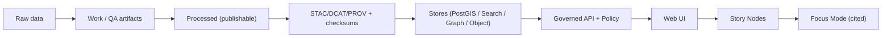

# scripts/

Governed command-line scripts used to build, validate, and operate Kansas Frontier Matrix (KFM).

> [!IMPORTANT]
> Anything in `scripts/` can affect dataset promotion, policy enforcement, and evidence provenance.
> Treat changes as production changes: review, test, and keep outputs deterministic.

## Principles (non-negotiables)

These scripts exist to help enforce KFM’s hard system guarantees:

- **Trust membrane:** UI and external clients never access databases directly; all access is via the governed API + policy boundary.
- **Fail-closed policy:** if policy cannot be evaluated or evidence is incomplete, deny by default.
- **Dataset promotion gates:** Raw → Work → Processed; promotion requires deterministic checksums and STAC/DCAT/PROV catalogs.
- **Focus Mode cite-or-abstain:** AI answers must include citations (or refuse) and produce an audit reference.
- **Processed-only publishing:** the processed zone is the only publishable source of truth; raw/work are never served directly.

## What belongs in `scripts/`

✅ Good fits:

- **CI entrypoints** (thin wrappers) that run validators locally exactly as CI does.
- **Operational runbooks as code:** backfills, connector dry-runs, index refreshes (when approved).
- **Developer utilities** that do *not* weaken governance (e.g., seeding *demo* data).

🚫 Not a good fit:

- One-off personal experiments (use `notebooks/` or `tools/`, and label as non-governed).
- Anything that bypasses governance (e.g., “quick” direct DB writes that skip catalogs/policy).

## Quickstart

Run from the repository root:

```bash
chmod +x scripts/*.sh

./scripts/lint_docs.sh
./scripts/validate_story_nodes.sh

./scripts/validate_catalogs.sh     # STAC/DCAT/PROV
./scripts/validate_checksums.sh

opa test policy -v
```

### Prerequisites (repo-specific)

Typical dependencies (adjust to your environment):

- bash + coreutils
- OPA CLI (`opa`) for policy tests
- python3 (only if you use Python scripts)
- docker / podman (only if scripts call containerized services)

## Script catalog

> [!NOTE]
> The **script names below are referenced by the KFM CI blueprint**. If any are missing in your repo, create them (or update CI and this table together).

| Script | Role | Expected inputs *(defaults)* | Expected outputs |
|---|---|---|---|
| `lint_docs.sh` | Lint governed Markdown docs | `docs/**`, `stories/**` *(recommended)* | Non-zero exit on violations |
| `validate_story_nodes.sh` | Validate Story Node bundles (template, required sections, citation rules) | `stories/**` *(recommended)* | Non-zero exit + optional report |
| `validate_catalogs.sh` | Validate STAC/DCAT/PROV artifacts for changed datasets | `data/catalog/**` *(recommended)* | Non-zero exit + optional report |
| `validate_checksums.sh` | Compute/verify deterministic checksums for promoted artifacts | `data/**` | Non-zero exit + optional manifest |

## Where scripts fit in the KFM “truth path”

KFM’s provenance chain is designed as:

Raw → Work → Processed → STAC/DCAT/PROV → Stores → API → UI → Stories → Focus Mode (cited)



Scripts primarily cover:

- building and validating **raw/work/processed** artifacts
- validating **catalogs** (STAC/DCAT/PROV)
- validating **Story Nodes**
- running **policy tests** (`opa test policy -v`) so failures are caught before deploy

## Data promotion gates

Promotion to `processed/` (and anything public-facing) must be blocked unless all gates pass:

- license present
- sensitivity classification present
- schema + geospatial checks pass
- checksums computed
- STAC/DCAT/PROV artifacts exist and validate
- audit event recorded
- human approval if sensitive

Operational expectations:

- `validate_checksums.sh` must fail if any promoted artifact is missing a deterministic checksum.
- `validate_catalogs.sh` must fail if STAC/DCAT/PROV are missing, invalid, or inconsistent (e.g., broken cross-links).
- Any pipeline/connector script that transforms data should emit:
  - a `run_record.json`
  - a `validation_report.json`
  - and the catalogs/checksums needed for promotion

## Sensitivity and redaction

KFM treats some domains as sensitive (examples include ownership/PII risk, precise archaeological site locations, and sensitive species locations).

Rules of thumb for scripts:

- Assume **Restricted** until proven otherwise when dealing with ownership/parcel data.
- For **Sensitive-location** datasets, produce a generalized derivative for public use and keep precise geometries behind role-based policy.
- Treat **redaction as a first-class transformation**:
  - the raw dataset remains immutable
  - the redacted derivative is a separate version (and sometimes a separate dataset)
  - the redaction step must be recorded in PROV

CI policy regression should include:

- golden queries that previously leaked restricted fields must keep failing forever
- negative tests: sensitive-location layers must not return high precision to unauthorized roles
- field-level tests: owner names, exact coordinates, and small-count health/crime indicators are redacted
- audit integrity tests: every API response includes an audit reference (and, ideally, an evidence bundle hash)

## Script design standards

### Bash (`.sh`)

- Use strict mode: `set -euo pipefail`
- Print usage on `-h/--help`
- Never echo secrets (tokens, keys)
- Be idempotent (safe to rerun)
- Prefer machine-readable output for validation (JSON) when practical
- Exit codes *(recommended)*:
  - `0` success
  - `1` validation failed / policy denied
  - `2` misuse (bad args)
  - `>2` unexpected error

### Python (`.py`)

- Use `argparse` (or equivalent) with `--help`
- Write deterministic outputs:
  - stable ordering
  - explicit hashing
  - explicit schema versions
- Prefer calling governed library code (e.g., validators under `src/`) over ad-hoc DB access
- For any script that creates/promotes artifacts, produce:
  - `run_record.json`
  - `validation_report.json`
  - checksums for every output artifact

## Adding a new script

When adding a new script, aim for “CI-ready by default”.

### Definition of Done

- [ ] Has `--help` and at least one concrete example
- [ ] Deterministic outputs + checksums (when producing artifacts)
- [ ] Writes a validation report + run record (for pipeline-style scripts)
- [ ] Annotated with governance notes if it touches sensitive data
- [ ] Covered by CI (or explicitly documented why it is not)
- [ ] Updates the Script catalog table in this README

<details>
<summary>Bash script skeleton</summary>

```bash
#!/usr/bin/env bash
set -euo pipefail

usage() {
  cat <<'EOF'
Usage: ./scripts/<name>.sh [options]

Description:
  (Fill in)

Options:
  -h, --help   Show help
EOF
}

if [[ "${1:-}" == "-h" || "${1:-}" == "--help" ]]; then
  usage
  exit 0
fi

# Script body...
```
</details>

<details>
<summary>Python script skeleton</summary>

```python
#!/usr/bin/env python3
from __future__ import annotations

import argparse
import json
import sys

def main() -> int:
    parser = argparse.ArgumentParser()
    # add args...
    _args = parser.parse_args()

    report = {"ok": True, "notes": []}
    json.dump(report, sys.stdout, indent=2)
    sys.stdout.write("\n")
    return 0

if __name__ == "__main__":
    raise SystemExit(main())
```
</details>

## Troubleshooting

- `validate_catalogs.sh` fails:
  - missing license/sensitivity label
  - STAC/DCAT/PROV schema mismatch
  - broken links between catalogs (e.g., STAC collection not linking to DCAT dataset)

- `validate_checksums.sh` fails:
  - artifact changed but checksum manifest not updated
  - non-deterministic build output (timestamps, unordered fields)

- Policy tests fail:
  - new endpoint missing policy coverage
  - cite-or-abstain checks reject an AI answer without citations/audit ref

## Grounding references

This README is aligned to KFM’s 2026-02-12 governed design artifacts:

- **KFM Next-Generation Blueprint & Primary Guide** (draft)
- **KFM Comprehensive Data Source Integration Blueprint** (v1.0)

Update this file if the official CI workflow, promotion gates, or policy expectations change.
