<!--
FILE: scripts/README.md
KANSAS FRONTIER MATRIX (KFM) — GOVERNED REPO ARTIFACT
If you change meaning (not just phrasing), route through governance review (CODEOWNERS + CI gates).
-->

# `scripts/` — KFM CLI Orchestration, Validators, and Pipeline Runners 🧰🗺️


The `scripts/` folder contains **operator-facing** and **developer-facing** command-line tooling that *orchestrates* KFM’s governed workflows:

- acquire raw sources (or verify snapshots),
- normalize / transform / enrich into reproducible intermediates,
- validate governance prerequisites (license, sensitivity, schema, geo/time sanity),
- promote **only** when Promotion Contract proofs exist (receipts + checksums + catalogs),
- support controlled admin operations (reindexing, backfills, bootstraps),
- generate machine-readable outputs for CI, audit, and evidence UX.

> [!IMPORTANT]
> **Non-negotiable KFM invariant:** **Processed is the only publishable source of truth.**  
> `scripts/` may *write* to `raw/` and `work/` as part of ingestion, but **only `processed/` artifacts backed by receipts + catalogs are eligible for serving**.

---

## Table of contents

- [Governance header](#governance-header)
- [Core invariants (read this first)](#core-invariants-read-this-first)
- [What belongs in `scripts/`](#what-belongs-in-scripts)
- [Directory layout and naming conventions](#directory-layout-and-naming-conventions)
- [Quickstart](#quickstart)
- [Common CLI contract](#common-cli-contract)
- [Run artifacts and “receipts”](#run-artifacts-and-receipts)
  - [`run_record.json` (execution receipt)](#run_recordjson-execution-receipt)
  - [`validation_report.json` (gate report)](#validation_reportjson-gate-report)
  - [`run_manifest.json` (Promotion Contract receipt)](#run_manifestjson-promotion-contract-receipt)
  - [`audit_event.json` (governed side-effect trail)](#audit_eventjson-governed-side-effect-trail)
- [Deterministic identity and versioning](#deterministic-identity-and-versioning)
- [Zones, truth path, and publish boundary](#zones-truth-path-and-publish-boundary)
- [Catalog obligations: DCAT, STAC, PROV](#catalog-obligations-dcat-stac-prov)
- [Policy + sensitivity handling](#policy--sensitivity-handling)
- [Security requirements](#security-requirements)
- [Testing, CI gates, and “fail closed” behavior](#testing-ci-gates-and-fail-closed-behavior)
- [Operations cookbook](#operations-cookbook)
- [Troubleshooting](#troubleshooting)
- [Adding a new script (DoD + checklist)](#adding-a-new-script-dod--checklist)
- [Appendices](#appendices)
  - [A. Script header templates](#a-script-header-templates)
  - [B. Canonical artifact paths (quick reference)](#b-canonical-artifact-paths-quick-reference)
  - [C. Recommended exit codes](#c-recommended-exit-codes)
  - [D. Glossary](#d-glossary)
- [References](#references)

---

## Governance header

| Field | Value |
|---|---|
| Document | `scripts/README.md` |
| Status | **Governed** |
| Applies to | CLI orchestration, validators, promotion/publish tooling, CI wrappers |
| Version | `v3.0.0-draft` |
| Effective date | 2026-02-16 |
| Owners | `.github/CODEOWNERS` *(required; if missing, treat as governance gap)* |
| Review triggers | Any change affecting promotion rules, receipts, catalogs, policy posture, evidence resolution, or sensitivity handling |

> [!WARNING]
> **Fail-closed rule:** If required governance inputs are missing (license, sensitivity class, receipts, catalogs, policy inputs), scripts must **deny** or **abstain** rather than proceed.

---

## Core invariants (read this first)

These are KFM’s “constitutional” rules for anything under `scripts/`:

1) **Processed-only serving truth**  
   - Raw and work are **never** publishable or served.
   - Promotion to processed requires checksums + catalogs + receipts.

2) **Promotion is not “copy files”**  
   Promotion is a governed act with proofs:
   - `run_record.json` + `validation_report.json` + `run_manifest.json`
   - processed checksums (`sha256`)
   - DCAT always; STAC when geospatial assets exist; PROV always for lineage
   - audit event emitted or staged

3) **Default deny / fail closed**  
   Any uncertainty in policy inputs, licensing, or sensitivity classification is a **hard stop**.

4) **Evidence-first everywhere**  
   Scripts must emit machine-readable artifacts that downstream systems can resolve (UI, Story Nodes, Focus Mode, auditors).

> [!NOTE]
> These invariants are system-wide, but `scripts/` is where they become operational and testable.

---

## What belongs in `scripts/`

### ✅ In-scope

- **Thin orchestration** of pipeline stages (acquire → normalize → validate → promote).
- **Validators** (schemas, catalogs, checksums, geo/time, policy prereqs).
- **Controlled admin utilities** (reindex, bootstrap, backfills) that produce audit events.
- **CI wrappers** that run deterministic checks and output machine-readable reports.
- **Shared CLI helpers** (_lib) that enforce the common contract (logging, hashing, receipt IO, path conventions).

### 🚫 Out-of-scope

- **Core domain logic** belongs in the governed application layer (`src/`) behind interfaces.
- **Policy logic** belongs in `policy/` (OPA/Rego); scripts can *invoke* policy checks but must not fork the rules.
- **Long-lived services/daemons** belong in the runtime stack, not as scripts.
- **UI code** belongs under `web/`.

---

## Directory layout and naming conventions

> [!NOTE]
> Layout below is a **recommended** contract. If your repo uses different names, update this README to match reality (this file is governed; drift is not allowed).

```text
scripts/
├─ README.md
├─ registry.yaml                     # REQUIRED: script registry (source-of-truth for CI + docs tables)
│
├─ connectors/                       # dataset-scoped orchestration (thin glue around src/ pipelines)
│  └─ <dataset_id>/                  # stable dataset identifier (slug)
│     ├─ ingest.(py|ts|sh)           # acquire → raw/work (no processed writes)
│     ├─ transform.(py|ts|sh)        # optional: work→work (deterministic transform steps)
│     ├─ validate.(py|ts|sh)         # required: work validations + policy prereqs
│     ├─ promote.(py|ts|sh)          # required: promotion to processed + catalogs + manifest
│     └─ backfill.(py|ts|sh)         # optional: explicit windowed reruns (must emit receipts)
│
├─ validators/
│  ├─ receipts/                      # run_record / run_manifest schema validation
│  ├─ catalogs/                      # DCAT / STAC / PROV validation + cross-link integrity
│  ├─ checksums/                     # sha256 generation + verification helpers
│  ├─ geo_time/                      # CRS/time range/bbox sanity checks
│  └─ policy_inputs/                 # validate inputs required for policy evaluation
│
├─ admin/                            # controlled ops (reindex, bootstrap, maintenance)
├─ ci/                               # CI composites / “acceptance harness” wrappers
├─ dev/                              # safe developer utilities (no side effects by default)
└─ _lib/                             # shared CLI helpers (logging, hashing, paths, JSON I/O)
```

### Naming rules

- **dataset-scoped scripts** live under `scripts/connectors/<dataset_id>/...`
- use verbs that map to governance stages:
  - `ingest` (raw/work only)
  - `transform` (work only; deterministic)
  - `validate` (work gating)
  - `promote` (processed + catalogs + manifest)
  - `backfill` (explicit incremental reruns)
- **validators** must be reusable across datasets and never embed dataset-specific assumptions.

---

## Quickstart

### Prerequisites

- You can run the KFM stack locally (typically via Docker Compose).
- You have a `.env` configured (or your CI provides equivalents).

> [!IMPORTANT]
> If a script requires services (PostGIS, OPA, object storage, etc.), it must verify health and fail fast with actionable errors.

### Typical local usage pattern

```bash
# inside the container where runtime deps exist (recommended)
docker compose exec api python scripts/connectors/<dataset_id>/ingest.py --help
```

> [!TIP]
> When possible, prefer “inside-container” execution for deterministic dependencies and consistent hashing.

---

## Common CLI contract

Every script in `scripts/` must:

- implement `--help` (and keep it accurate),
- accept a dataset identifier for dataset-scoped runners,
- support `--dry-run` where practical,
- produce machine-readable receipts/reports,
- be **idempotent** when possible (safe to re-run with same inputs),
- be **fail-closed** when governance inputs are missing.

### Standard flags (baseline)

| Flag | Purpose |
|---|---|
| `--dataset_id <id>` | stable dataset identifier (required for dataset-scoped scripts) |
| `--run_id <id>` | optional override; otherwise generate a stable ID per run policy |
| `--spec <path>` | governed spec used for reproducibility (must emit `spec_hash`) |
| `--since <ISO8601>` / `--until <ISO8601>` | time window for incremental runs/backfills |
| `--config <path>` | connector config path (YAML/JSON) |
| `--raw_dir <path>` / `--work_dir <path>` / `--processed_dir <path>` | override zone roots (rare; CI or special ops only) |
| `--emit_catalogs` | generate DCAT/STAC/PROV as applicable |
| `--dry-run` | no writes outside `work/`; still runs validations |
| `--force` | requires explicit operator intent; **must never bypass governance checks** |
| `--log_json` | structured JSON logs (recommended for CI ingestion) |

### Logging contract

Scripts should support:

- human-readable console output by default,
- `--log_json` for structured logs,
- a **stable** event shape for CI parsers (timestamp, level, dataset_id, run_id, msg, details).

---

## Run artifacts and “receipts”

KFM treats receipts as first-class, merge-blocking proof objects.

> [!IMPORTANT]
> If a script writes to `data/processed/` or `data/catalog/`, it **must** emit:
> - `run_record.json`
> - `validation_report.json`
> - `run_manifest.json`
> - checksums for processed assets
> - DCAT (always), STAC (conditional), PROV (always)
> - audit event (or staged audit artifact)

### `run_record.json` (execution receipt)

A `run_record.json` captures **what happened** and **what was used**.

Minimum required fields:

- `run_id`
- `dataset_id`
- `started_at`, `ended_at` *(recommended even if not required)*
- `inputs[]` with `{ uri, sha256 }`
- `code` identity: `{ git_sha, image_digest? }`
- `outputs[]` with `{ uri, sha256 }`
- `validation_report` (path or evidence ref)
- `prov_ref` (path or evidence ref)

Recommended fields:

- `actor` (operator/service identity)
- `spec_hash`, `spec_schema_id`, `spec_recipe_version`
- `tool_versions`
- `metrics` (row counts, bbox/time range summaries, null rates)
- `warnings[]` / `errors[]`

### `validation_report.json` (gate report)

A deterministic, machine-readable summary of validation checks.

**Fail-closed rule:** missing license or missing sensitivity classification → `overall_status: "fail"`.

Recommended shape:

```json
{
  "dataset_id": "example_dataset",
  "run_id": "run_2026-02-16T00:00:00Z",
  "overall_status": "pass",
  "checks": [
    { "id": "license.present", "status": "pass", "details": {} },
    { "id": "sensitivity.classified", "status": "pass", "details": { "class": "public|restricted|high" } },
    { "id": "schema.valid", "status": "pass", "details": {} },
    { "id": "geo.valid", "status": "pass", "details": { "crs": "EPSG:4326" } },
    { "id": "time.valid", "status": "pass", "details": { "min": "...", "max": "..." } },
    { "id": "catalogs.valid", "status": "pass", "details": { "dcat": true, "stac": true, "prov": true } },
    { "id": "checksums.present", "status": "pass", "details": {} }
  ],
  "summary": { "errors": 0, "warnings": 1 }
}
```

### `run_manifest.json` (Promotion Contract receipt)

The Promotion Contract receipt is the **merge/publish blocker**.

If this file is missing or invalid, promotion must deny.

Minimum fields:

- `run_id`, `dataset_id`
- `spec_hash` (+ schema/version fields recommended)
- `inputs[]` + `outputs[]` (digests)
- `code` identity (git SHA + image digest if available)
- `validation_report` ref
- catalog refs: DCAT required; STAC conditional; PROV required
- policy summary: license + sensitivity classification + any redactions
- optional attestations/signatures (supply chain)

### `audit_event.json` (governed side-effect trail)

Any script that causes governed side effects must emit an audit artifact:

- promotion/publish
- redaction/generalization
- backfill
- index refresh
- policy bundle change application

Recommended shape:

```json
{
  "audit_ref": "audit_...",
  "timestamp": "2026-02-16T00:00:00Z",
  "actor": { "kind": "service_account", "id": "ci-bot" },
  "action": "dataset.promote|dataset.backfill|index.refresh|policy.apply",
  "subject": { "dataset_id": "example_dataset", "run_id": "run_..." },
  "decision": { "result": "allow|deny", "policy_label": "public|restricted" },
  "evidence": {
    "run_record": "...",
    "run_manifest": "...",
    "validation_report": "...",
    "prov_ref": "..."
  },
  "event_hash": "sha256:..."
}
```

---

## Deterministic identity and versioning

KFM’s reproducibility principle: **same spec ⇒ same `spec_hash` ⇒ comparable receipts**.

### `spec_hash` (required)

Recommended definition:

- `spec_hash = sha256(JCS(spec))` where `JCS` is RFC 8785 JSON Canonicalization Scheme.

Use `spec_hash` for:

- pipeline recipe identity
- run manifests/receipts
- CI material-change detection
- promotion comparison (“did the recipe change?”)

### Recommended identifier set

| Identifier | Purpose | Stability |
|---|---|---|
| `dataset_id` | dataset family slug | stable |
| `run_id` | one execution instance | stable per run |
| `version_id` | promoted processed version | immutable |
| `spec_hash` | canonical recipe hash | deterministic |

> [!TIP]
> Prefer a `version_id` derived from `{dataset_id, spec_hash, run_id}` (or from processed artifact digests) so “what shipped” is always reconstructable.

---

## Zones, truth path, and publish boundary

KFM’s truth path is:

```mermaid
flowchart LR
  A["Raw Zone (immutable capture)"] --> B["Work Zone (reproducible intermediates)"]
  B -->|"Promotion Contract (run_manifest + catalogs + checksums)"| C["Processed Zone (publishable truth)"]
  C --> D["Catalogs (DCAT / STAC / PROV)"]
  D --> E["Stores (PostGIS / Graph / Search / Object)"]
  E --> F["API Gateway + Policy (trust membrane)"]
  F --> G["UI / Story Nodes / Focus Mode"]
```



### Zone semantics

- **Raw**: immutable capture; append-only; referenced by lineage.
- **Work**: intermediates; regeneratable; where validators run; receipts live here.
- **Processed**: immutable publishable outputs backed by proofs.
- **Catalog**: machine-readable discovery + lineage metadata used by runtime services.

> [!WARNING]
> If anything in runtime (API/UI/Focus Mode) reads from raw/work directly, the trust model is broken.

---

## Catalog obligations: DCAT, STAC, PROV

KFM requires cross-linkable catalogs:

- **DCAT**: always required for promoted datasets (catalog interoperability).
- **STAC**: required when publishing spatial/temporal assets (imagery, tiles, geospatial items).
- **PROV**: required to link raw → processed lineage and transformations.

### Cross-link integrity (merge-blocking)

Catalogs must:

- contain no dangling references,
- accurately reflect checksums/digests claimed in receipts,
- be schema-valid against their respective profiles.

### Promotion gate checklist (must pass)

- [ ] license present
- [ ] sensitivity classification present
- [ ] schema checks pass
- [ ] geo/time checks pass
- [ ] processed checksums computed and verified
- [ ] DCAT validates
- [ ] STAC validates (if spatial assets exist)
- [ ] PROV validates
- [ ] `run_manifest.json` validates
- [ ] audit event recorded or staged

---

## Policy + sensitivity handling

KFM treats sensitivity as a first-class concern:

- sensitive locations may require generalization or redaction in publishable derivatives,
- restricted data must not leak via logs, catalogs, or “helpful” debug output,
- missing classification is a hard stop.

**Recommended classes (example):**
- `public`
- `restricted`
- `high_sensitivity` (e.g., culturally restricted sites)

> [!IMPORTANT]
> Generalization/redaction must be recorded in provenance (PROV) and summarized in receipts.

---

## Security requirements

### Secrets and credentials

- Never commit secrets.
- Prefer environment variables + secret managers.
- Never print tokens/keys/PII to logs.
- Ensure CI does not expose secrets to untrusted forks.

### Least privilege

- Scripts should use the minimum permissions required.
- If policy inputs are missing → deny (not “warn and continue”).

### Supply-chain hygiene (repo-level guidance)

Scripts should assume the repo enforces:
- protected branches,
- required CI checks,
- controlled modifications to workflow files (CODEOWNERS),
- pinned dependencies where possible.

---

## Testing, CI gates, and “fail closed” behavior

Changes under `scripts/` are high leverage and should be gated.

### Required CI expectations (project-level)

- receipt schema validation (run_record + run_manifest)
- catalog validation (DCAT/STAC/PROV)
- checksum verification (processed assets)
- policy regression tests (OPA + conftest if used)
- documentation lint where applicable

### Script-level test expectations

- unit tests for `_lib/` helpers
- fixture-based validation tests (known-good and known-bad receipts/catalogs)
- deterministic output tests (stable ordering, stable hashing)

> [!TIP]
> Treat CI as the “acceptance harness” for governance promises: **if the harness can’t prove it, the system must not publish it.**

---

## Operations cookbook

> [!NOTE]
> Commands below are shapes. Adjust paths and container names to match your actual stack.

### Enter the API container

```bash
docker compose exec api sh
```

### Ingest a dataset (raw/work only)

```bash
docker compose exec api python scripts/connectors/example_dataset/ingest.py \
  --dataset_id example_dataset \
  --spec specs/ingest/example_dataset.json \
  --log_json
```

### Validate (work gating)

```bash
docker compose exec api python scripts/connectors/example_dataset/validate.py \
  --dataset_id example_dataset \
  --run_id run_2026-02-16T00:00:00Z \
  --log_json
```

### Promote (processed + catalogs + receipts)

```bash
docker compose exec api python scripts/connectors/example_dataset/promote.py \
  --dataset_id example_dataset \
  --run_id run_2026-02-16T00:00:00Z \
  --emit_catalogs \
  --log_json
```

### Reindex (if implemented)

```bash
docker compose exec api python scripts/admin/reindex.py --scope all --log_json
```

---

## Troubleshooting

<details>
<summary><strong>Catalog validation failed</strong></summary>

- Verify DCAT/STAC/PROV files exist where the manifest says they do.
- Verify cross-links resolve (no dangling refs).
- Ensure catalogs reference the correct checksums/digests for processed outputs.
- Ensure the correct profile/schema version is being validated against.

</details>

<details>
<summary><strong>Promotion blocked</strong></summary>

Common (expected) blockers:

- missing/invalid `run_manifest.json`
- `validation_report.json` reports `fail`
- license missing
- sensitivity classification missing
- processed checksums missing or mismatch
- catalogs missing/invalid
- audit event missing or cannot be written

Remember: this is the system working as intended — **fail closed**.

</details>

<details>
<summary><strong>Non-deterministic outputs (“works on my machine”)</strong></summary>

- run scripts inside pinned containers
- capture `git_sha` + `image_digest` in receipts
- ensure stable file ordering when hashing
- avoid timestamps in content-addressed artifacts (timestamps belong in receipts, not in deterministic payloads)

</details>

---

## Adding a new script (DoD + checklist)

### Definition of Done (DoD)

- [ ] script is registered in `scripts/registry.yaml`
- [ ] `--help` exists and matches actual behavior
- [ ] inputs/outputs documented (including zone writes)
- [ ] **if promotion/publish occurs**: emits `run_record.json`, `validation_report.json`, `run_manifest.json`
- [ ] checksums computed and verified for processed outputs
- [ ] DCAT emitted and validates; STAC/PROV emitted as applicable
- [ ] sensitivity classification enforced (missing ⇒ fail)
- [ ] policy prereqs enforced (missing ⇒ fail)
- [ ] structured logs supported (`--log_json`)
- [ ] tests added (fixtures + negative cases)
- [ ] no secrets committed; no sensitive data in logs
- [ ] CI passes (merge-blocking gates)

### “Smallest safe” integration pattern

1) add the dataset connector skeleton under `scripts/connectors/<dataset_id>/`
2) implement `ingest → validate → promote` with receipts
3) wire validators (receipt + catalogs) into CI
4) only then scale to additional datasets

---

## Appendices

### A. Script header templates

#### Python

```python
"""
KFM Script: <name>
Type: pipeline|validator|admin|ci|dev

Purpose:
  <one sentence>

Inputs:
  <what it reads>

Outputs:
  <what it writes, explicitly listing zones raw/work/processed/catalog>

Governance:
  - Processed-only publishable truth
  - Fail-closed if license/sensitivity/receipts/catalogs missing
  - Emit receipts (run_record, validation_report, run_manifest) when promoting
  - Catalog obligations: DCAT always; STAC conditional; PROV required
"""
```

#### Bash

```bash
#!/usr/bin/env bash
set -euo pipefail

# KFM Script: <name>
# Type: pipeline|validator|admin|ci|dev
# Purpose: <one sentence>
# Safety:
#   - Refuse to run without explicit dataset_id/spec when applicable
#   - No destructive defaults
#   - Fail closed when governance inputs are missing
```

### B. Canonical artifact paths (quick reference)

```text
data/raw/<dataset_id>/manifest.yml
data/work/<dataset_id>/runs/<run_id>/run_record.json
data/work/<dataset_id>/runs/<run_id>/validation_report.json
data/work/<dataset_id>/runs/<run_id>/run_manifest.json
data/processed/<dataset_id>/<version_id>/checksums.sha256
data/catalog/dcat/<dataset_id>.json
data/catalog/stac/<dataset_id>/**            # if spatial assets exist
data/catalog/prov/<dataset_id>/run_<run_id>.json
```

### C. Recommended exit codes

| Code | Meaning |
|---:|---|
| 0 | success |
| 2 | usage / argument error |
| 10 | validation failed (expected, machine-actionable) |
| 20 | policy denied / governance missing (fail-closed) |
| 30 | upstream acquisition failed (network/auth/provider) |
| 50 | unexpected error/bug |

### D. Glossary

| Term | Meaning |
|---|---|
| **Truth path** | Raw → Work → Processed lifecycle ending in cataloged, receipt-backed publishable artifacts |
| **Promotion Contract** | The rule that processed outputs require checksums + catalogs + receipts (run manifest) |
| **Receipt** | Machine-readable proof artifact (run record/manifest/validation report/audit event) |
| **Fail closed** | When uncertain, deny/abstain; never “best-effort publish” |
| **Trust membrane** | UI/clients never access storage directly; all access via API + policy boundary |

---

## References

These are the primary governance and engineering guides that shape this folder’s contracts:

- KFM Next-Generation Blueprint & Primary Guide (draft, 2026-02-12). :contentReference[oaicite:0]{index=0}  
- KFM Comprehensive Data Source Integration Blueprint (2026-02-12). :contentReference[oaicite:1]{index=1}  
- Kansas Frontier Matrix Project Blueprint (2026-02-15). :contentReference[oaicite:2]{index=2}  
- Kansas Frontier Matrix Companion Blueprint (2026-02-15). :contentReference[oaicite:3]{index=3}  
- Kansas Frontier Matrix Cultivated Integration Ideas (2026-02-15). :contentReference[oaicite:4]{index=4}  
- KFM Master Corpus Consolidation and Build-Integration Specification (2026-02-15). :contentReference[oaicite:5]{index=5}  
- Software Security Guide for Developers (2026 Edition) — Expanded Sections. :contentReference[oaicite:6]{index=6}  
- Professional Markdown Guide for GitHub Documentation. :contentReference[oaicite:7]{index=7}  

> This README is a governed operational artifact. Keep it accurate, complete, and reviewable.
