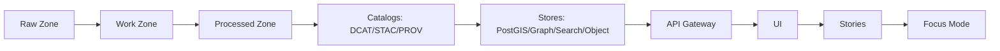

<!--
FILE: scripts/README.md
KANSAS FRONTIER MATRIX (KFM) — GOVERNED REPO ARTIFACT
-->

# `scripts/` — KFM CLI Scripts & Pipeline Runners 🧰🗺️


This folder is the **operator-facing** and **developer-facing** home for KFM scripts that:
- fetch/acquire raw sources,
- normalize/validate/enrich datasets,
- emit catalogs (DCAT/STAC/PROV) and run records,
- (optionally) run administrative ops (reindexing, bootstrapping),
- support CI validation and local workflows.

> **Non-negotiable KFM invariant (reminder):** **Processed is the only publishable source of truth**. Raw/work are never served directly to users.  
> Scripts MUST respect zones, catalogs, provenance, and policy gates.

---

## Table of contents

- [What belongs in `scripts/`](#what-belongs-in-scripts)
- [Repository context](#repository-context)
- [Quickstart (local dev)](#quickstart-local-dev)
- [How to run scripts](#how-to-run-scripts)
- [Script registry (MUST be complete)](#script-registry-must-be-complete)
- [KFM truth path + data zones](#kfm-truth-path--data-zones)
- [Run records, validation reports, and promotion gates](#run-records-validation-reports-and-promotion-gates)
- [Connector / ingestion pattern](#connector--ingestion-pattern)
- [Audit, evidence, and policy (trust membrane)](#audit-evidence-and-policy-trust-membrane)
- [Security requirements (secrets, sensitive locations, least privilege)](#security-requirements-secrets-sensitive-locations-least-privilege)
- [Testing + CI gates](#testing--ci-gates)
- [Operations cookbook](#operations-cookbook)
- [Troubleshooting](#troubleshooting)
- [Contributing / adding a new script](#contributing--adding-a-new-script)
- [Appendices](#appendices)

---

## What belongs in `scripts/`

### ✅ In-scope
- **Thin runners / glue** that orchestrate pipeline work (fetch → normalize → validate → publish).
- **Validators** that confirm catalogs, checksums, schemas, geometry/time sanity, link integrity.
- **Admin/operator utilities** (dataset bootstrap, reindex triggers, controlled backfills).
- **CI helpers** that validate governed artifacts and produce machine-readable reports.

### 🚫 Out-of-scope (move elsewhere)
- **Core domain logic** → should live in the governed application layers (e.g., `src/pipelines/`, `src/server/`, etc.).
- **Frontend/UI code** → belongs under `web/`.
- **Policy logic** → belongs under `policy/` (OPA/Rego).
- **Long-lived services** → belong in `src/` with proper interfaces, tests, and contracts.

> **Repo layout note:** Some KFM layouts place “utility scripts” under `tools/` and pipeline code under `src/pipelines/`. If your repo contains both `tools/` and `scripts/`, treat `scripts/` as *operator runners* and `tools/` as *generic utilities/validators*. Keep script responsibilities crisp and traceable.

---

## Repository context

KFM is governed by a clean architecture + “trust membrane” boundary. In practice, that means:
- the UI does **not** directly access databases,
- data is served from the **Processed** zone + catalogs,
- all access and AI output flows are policy checked and audit logged.

> If you are writing a script that touches storage directly (PostGIS/Neo4j/Search/Object store), stop and confirm you are not bypassing governance, catalog invariants, or audit/provenance requirements.

---

## Quickstart (local dev)

KFM local dev is typically driven by **Docker Compose**.

1) Create environment file:
```bash
cp .env.example .env
```

2) Build & start services:
```bash
docker compose up --build
```

3) Common local endpoints:
- **Web UI:** `http://localhost:3000`
- **API docs:** `http://localhost:8000/docs`
- **OPA:** typically `http://localhost:8181`
- **PostGIS:** typically exposed on `localhost:5432`
- **Neo4j:** typically `http://localhost:7474` (browser) and `bolt://localhost:7687`
- **OpenSearch:** typically `http://localhost:9200`

> If your compose baseline includes `api/web/postgis/neo4j/opensearch/opa`, ensure all are healthy before running scripts that depend on them.

---

## How to run scripts

### Pattern A — run from host (preferred for pure file-based steps)
```bash
python scripts/<script>.py --help
bash scripts/<script>.sh --help
```

### Pattern B — run inside the API container (preferred when the script uses server libs/contracts)
```bash
docker compose exec api python scripts/<script>.py --help
```

### Pattern C — “manage” / admin CLI (if present)
Some KFM setups include a `manage.py`-style CLI (or similar) for administrative tasks (e.g., create admin user, reindex). If present, usage often looks like:
```bash
docker compose exec api python manage.py <command> [args...]
```

> **Rule:** every script MUST support `--help` (or equivalent) and document inputs/outputs in the registry below.

---

## Script registry (MUST be complete)

**This table is the “nothing-left-out” guarantee.**  
Every script added, renamed, or removed MUST be reflected here in the same PR.

> Tip: If you’re reviewing a PR and you see a new file under `scripts/` without an entry here, request changes.

| Script path | Type | What it does | Inputs (URIs / flags) | Outputs (zone + paths) | Catalog / provenance produced | Sensitivity impact | Typical invocation |
|---|---|---|---|---|---|---|---|
| `scripts/<example>.py` | pipeline | Example placeholder | `--dataset_id …` | `data/work/...` → `data/processed/...` | `DCAT/STAC/PROV + run_record.json` | none | `python scripts/<example>.py --dataset_id …` |
|  |  |  |  |  |  |  |  |
|  |  |  |  |  |  |  |  |
|  |  |  |  |  |  |  |  |

**Script types (recommended):**
- `pipeline` — dataset ingestion/transform/publish
- `validator` — schemas/catalogs/checksums/geometry/time checks
- `admin` — operational tasks (user bootstrap, reindex)
- `ci` — CI wrappers for governed checks
- `dev` — developer convenience (safe, non-production)

---

## KFM truth path + data zones

KFM’s “truth path” is (conceptually):



### Data zones (hard invariant)
- **Raw**: immutable capture of source-of-truth data; append-only writes; referenced by lineage.
- **Work**: intermediate artifacts; may be regenerated; used for QA.
- **Processed**: publishable artifacts with required catalogs and checksums.
- **Catalog**: DCAT/STAC/PROV entries runtime services consume.

> **Invariant:** processed is the only publishable source of truth. Raw/work are never served directly to users.

---

## Run records, validation reports, and promotion gates

### Required outputs for any script that “publishes” a dataset

If a script promotes or updates a dataset, it MUST emit:
- a **run record** (JSON),
- a **validation report** (machine-readable),
- and a **PROV record** (or PROV reference) linking inputs → activity → outputs.

#### Run record (recommended minimal fields)
A run record should capture:
- `run_id`
- `dataset_id`
- **inputs**: URI + checksum
- **code provenance**: git SHA and/or image ID
- **outputs**: URI + checksum
- validation report path
- PROV reference path

> Promotion is blocked unless a run record and validation report exist and are complete.

#### Validation gates (promotion checklist)
Promotion to **Processed/public** must be blocked unless **all** of the following are true:

- [ ] License present  
- [ ] Sensitivity classification present  
- [ ] Schema + geospatial checks pass  
- [ ] Checksums computed  
- [ ] STAC/DCAT/PROV artifacts exist and validate  
- [ ] Audit event recorded  
- [ ] Human approval if sensitive  

---

## Connector / ingestion pattern

Most dataset scripts follow the same governed ingestion stages:

1) **Acquire** (fetch slices when possible; else snapshot + diff)
2) **Normalize** (canonical encodings/geometry/time)
3) **Validate** (schema, geometry validity, timestamp sanity, license/policy checks)
4) **Enrich** (derive join keys, place/time normalization, entity resolution candidates)
5) **Publish** (promote to Processed, update catalogs, trigger index refresh)

### Connector configuration (recommended baseline keys)
When your script behaves like a connector, document (and ideally externalize) config for:
- schedule / cadence
- incremental cursor (modified date, event date, etc.)
- auth strategy (**secrets stored in vault; never committed**)
- rate limiting + retries
- format targets (GeoJSON/Parquet/COG/etc.)
- policy label (public / restricted / sensitive-location)

---

## Audit, evidence, and policy (trust membrane)

### Trust membrane mechanics (what scripts must not bypass)
Any reads/writes that cross the trust membrane must go through:
- authentication,
- policy evaluation,
- query shaping / redaction,
- audit + provenance logging,

…and this is enforced by tests.

### Focus Mode / AI outputs (if your script touches AI workflows)
If a script triggers or validates Focus Mode outputs, it must enforce:
- **cite-or-abstain**
- **sensitivity_ok**
- default deny / fail-closed policy behavior

### Audit records
Where scripts create governed effects (promotion, publish, redaction, backfill), they should emit or append an audit record containing at minimum:
- `audit_ref`
- timestamp
- event type
- subject
- event hash

> If your current implementation doesn’t have an API endpoint to append audit records, scripts must still generate a local audit artifact so a later governed step can ingest it into the ledger.

---

## Security requirements (secrets, sensitive locations, least privilege)

### Secrets and credentials
- Never commit secrets.
- Prefer environment variables / secret managers.
- Avoid logging tokens, API keys, raw credentials, or PII into console output or artifacts.

### Sensitive locations / culturally restricted data
If a dataset includes sensitive locations or culturally restricted knowledge:
- publish a **generalized derivative** for general audiences,
- store precise data under restricted access,
- maintain **separate provenance chains** documenting the transformation/redaction.

### Least privilege & safe defaults
- Run scripts with the minimum role required.
- If policy input is incomplete or uncertain, behavior must be **fail-closed** (deny by default).

---

## Testing + CI gates

If you add or modify scripts that affect governed behavior, expect CI to enforce:

- **Docs:** lint + link-check + template validation
- **Data:** checksum validation + STAC/DCAT/PROV validation
- **Policy:** OPA tests (default deny; cite-or-abstain)
- **Supply chain:** SBOM + provenance attestations (where enabled)

> Script changes that alter outputs in `data/processed/` MUST include run records, validation reports, and catalog updates.

---

## Operations cookbook

### 1) Enter the API container (for debugging)
```bash
docker compose exec api bash
```

### 2) Run an admin CLI (if present)
Examples (may vary by repo):
```bash
docker compose exec api python manage.py createuser --username=admin --password='***' --role=maintainer
docker compose exec api python manage.py reindex
```

### 3) Rebuild and rerun the world (local)
```bash
docker compose down -v
docker compose up --build
```

> Warning: `down -v` deletes volumes (including local DB state). Use intentionally.

---

## Troubleshooting

<details>
<summary><strong>Common failures & fixes</strong></summary>

### Port conflicts
If `:3000`, `:8000`, `:5432`, `:7474`, `:7687`, `:9200`, or `:8181` are already in use:
- stop the conflicting local services, or
- remap ports in compose, or
- run profiles (if supported).

### “Catalog validation failed”
- Ensure required DCAT/STAC/PROV files exist.
- Ensure link references resolve (no dangling `stac://` / `dcat://` / `prov://` pointers).
- Ensure checksums match actual artifacts.

### “Promotion blocked”
Promotion should be blocked when:
- validation report missing,
- run record missing,
- license missing,
- sensitivity classification missing,
- catalogs missing or invalid,
- audit event missing,
- sensitive dataset lacks human approval.

### “Works on my machine”
If artifacts differ across machines:
- pin container images / dependency versions,
- capture git SHA + image in run record,
- ensure deterministic ordering when producing outputs.

</details>

---

## Contributing / adding a new script

### Definition of Done (DoD) — a new `scripts/` entry is complete when:
- [ ] Script added to the **Script registry** table above
- [ ] `--help` output exists and is accurate
- [ ] Inputs/outputs are documented (including zones)
- [ ] Emits **run record** + **validation report** (if it publishes/promotes)
- [ ] Produces/updates catalogs (DCAT always; STAC/PROV when applicable)
- [ ] Checksums are computed deterministically
- [ ] Sensitivity/policy labels are applied
- [ ] Tests added/updated (unit/integration/contract as applicable)
- [ ] No secrets committed; no sensitive data leaked in logs/artifacts
- [ ] CI passes

### Style rules (recommended)
- **Python:** `python -m <module>` preferred when scripts are module-backed; type hints encouraged.
- **Bash:** `set -euo pipefail` at top; quote variables; no destructive defaults.
- **All scripts:** support `--dry-run` when practical; provide structured logs; avoid side effects without explicit intent flags.

---

## Appendices

<details>
<summary><strong>Appendix A — Script header template (copy/paste)</strong></summary>

### Python header template
```python
"""
KFM Script: <name>
Type: pipeline|validator|admin|ci|dev
Purpose: <one sentence>
Inputs: <what it reads>
Outputs: <what it writes, include zones: raw/work/processed>
Governance:
  - Must not publish from raw/work
  - Must emit run_record + validation_report if promoting
  - Must apply sensitivity labels and fail-closed behavior
"""
```

### Bash header template
```bash
#!/usr/bin/env bash
set -euo pipefail

# KFM Script: <name>
# Type: pipeline|validator|admin|ci|dev
# Purpose: <one sentence>
# Safety: refuse to run without explicit dataset_id / output dir / confirmation flags
```

</details>

<details>
<summary><strong>Appendix B — Recommended artifacts layout (adjust to match your repo)</strong></summary>

This is a *recommended* convention for where scripts write outputs:

- `data/raw/<dataset_id>/...`  
- `data/work/<dataset_id>/...`  
- `data/processed/<dataset_id>/...`  
- `data/catalog/dcat/<dataset_id>.jsonld`  
- `data/stac/collections/<dataset_id>.json` and `data/stac/items/...` (if spatial)  
- `data/prov/<dataset_id>/<run_id>.json`  
- `data/work/<dataset_id>/validation_report.json`  
- `data/work/<dataset_id>/run_record.json`

If your repo uses different paths, update this appendix and keep it consistent across scripts.

</details>

---

## References (governance grounding)

- **KFM Next-Gen Blueprint** (truth path, invariants, run records, validation gates, OPA patterns)
- **KFM Data Source Integration Blueprint** (trust membrane mechanics, zones, promotion gates, connector pattern)
- **KFM repo layout guidance** (where scripts/tools/pipelines belong)

> This README is considered a governed operational artifact: keep it accurate, complete, and reviewable.