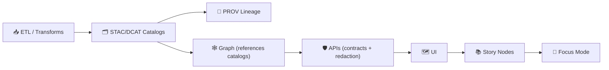

<!--
📌 This README defines the repo-wide automation surface for KFM.
🗓️ Last updated: 2026-01-09
-->

<div align="center">

# 🧰 `scripts/` — KFM Automation Toolkit

**Repeatable commands for dev, data ops, GIS/remote‑sensing workflows, modeling/simulation orchestration, and deployment “glue”.**  
Safe-by-default ✅ • Idempotent ♻️ • Provenance-first 🧾 • Hostile-input aware 🛡️


</div>

> [!IMPORTANT]
> **`scripts/` is orchestration — not “the truth.”**  
> If behavior becomes **core**, move the implementation into **`src/`** (or `api/src/`) and let scripts call it.

> [!IMPORTANT]
> **KFM pipeline ordering is absolute (governed):**  
> **ETL → STAC/DCAT/PROV Catalogs → Graph → APIs → UI → Story Nodes → Focus Mode**  
> Scripts must not create **mystery artifacts** that bypass catalogs/provenance.

---

## 🔗 Quick links
- 🧭 Repo overview: **[`../README.md`](../README.md)**
- 🧪 Executable code boundary: **[`../src/README.md`](../src/README.md)** *(if present)*
- 📦 Data + metadata boundary: **[`../data/README.md`](../data/README.md)** *(if present)*
- 📓 MCP (runs/receipts, experiments): **[`../mcp/MCP-README.md`](../mcp/MCP-README.md)** *(recommended, if present)*
- 🌐 Web UI boundary: **[`../web/README.md`](../web/README.md)** *(if present)*

---

<details>
<summary><b>🧭 Table of contents</b></summary>

- [🧾 Doc metadata](#-doc-metadata)
- [🎯 What belongs here (and what doesn’t)](#-what-belongs-here-and-what-doesnt)
- [🧱 The governed boundary scripts must respect](#-the-governed-boundary-scripts-must-respect)
- [🏁 Quickstart](#-quickstart)
- [🗂️ Recommended folder map](#️-recommended-folder-map)
- [🧱 Standard script contract](#-standard-script-contract)
- [🧭 Data lifecycle + evidence artifacts](#-data-lifecycle--evidence-artifacts)
- [🧾 Observability & provenance](#-observability--provenance)
- [🧨 Safety guardrails (non-negotiable)](#-safety-guardrails-non-negotiable)
- [⚡ Performance, scaling, and concurrency](#-performance-scaling-and-concurrency)
- [🗺️ GIS + PostGIS scripting tips](#️-gis--postgis-scripting-tips)
- [🛰️ Remote sensing scripting tips](#️-remote-sensing-scripting-tips)
- [🧪 QA scripts (contracts & acceptance gates)](#-qa-scripts-contracts--acceptance-gates)
- [🧩 Adding a new script (checklist)](#-adding-a-new-script-checklist)
- [📋 Script registry](#-script-registry)
- [📚 Project reference library influence map](#-project-reference-library-influence-map)
- [✅ Definition of “done” for a script](#-definition-of-done-for-a-script)
- [🕰️ Version history](#️-version-history)

</details>

---

## 🧾 Doc metadata

| Field | Value |
|---|---|
| Doc | `scripts/README.md` |
| Status | Active ✅ |
| Last updated | **2026-01-09** |
| Audience | Contributors shipping automation, data ops, validators, and safe wrappers around `src/` |
| Prime directive | **No script may bypass catalogs (STAC/DCAT/PROV) or weaken governance.** |

---

## 🎯 What belongs here (and what doesn’t)

### ✅ Good fits for `scripts/`
- 🧱 **Environment bootstrap**: install deps, initialize DB schema, load seed/reference data
- 🧰 **Dev helpers**: run local stack, health checks, smoke tests, “make my laptop match CI”
- 🗺️ **GIS tooling wrappers**: convert formats, validate CRS, generate tiles, build COGs, reprojection helpers
- 🛰️ **Remote sensing orchestrators**: Earth Engine export triggers, download trackers, derived-product packagers
- 🧮 **Model/simulation orchestration**: run pipelines/jobs with recorded configs, seeds, and output receipts
- 🧪 **Acceptance gates**: schema validation, link checks, provenance completeness, contract checks
- 🕒 **Scheduled jobs**: backups, cache cleanup, log rotation (cron/Kubernetes CronJob)

### ❌ Not a good fit for `scripts/`
- 🚫 **Core ETL logic** (belongs in `src/pipelines/`)
- 🚫 **Domain/business rules** (belongs in `src/` domain/application layers or `api/src/`)
- 🚫 **Duplicate implementations** of pipeline steps (scripts should call canonical modules)
- 🚫 **One-off “forever scripts”** that bypass provenance, approvals, or classification propagation
- 🚫 **Unreviewed publishing** that creates “published-looking” outputs without STAC/DCAT/PROV

> [!TIP]
> Scripts are the “buttons and levers.” If it’s “the engine,” it belongs in `src/`. 🔧➡️🏗️

---

## 🧱 The governed boundary scripts must respect

KFM is designed so every user-facing claim traces back to evidence via a strict pipeline:



### ✅ What this means for automation
- Scripts can **run** ETL, but must ensure:
  - outputs land in `data/raw → data/work → data/processed`
  - catalogs are generated/updated (`data/stac`, `data/catalog/dcat`, `data/prov`)
  - graph loads reference **catalog IDs**, not ad-hoc file paths
- Scripts can **validate** contracts + metadata, and should fail fast in CI when:
  - schemas don’t validate
  - provenance is missing/incomplete
  - links/assets don’t resolve
  - secrets/sensitive patterns appear in logs/configs

### 🧩 Dataset ID hygiene (recommended)
When a script needs a dataset identifier, prefer a stable, versioned ID (example pattern):
- `kfm.<state|region>.<theme>.<year_range>.v<version>`

(Exact naming is governed by `docs/standards/` when present.)

---

## 🏁 Quickstart

### 1) Discover available scripts
- Browse by category folder (see map below)
- Run help first:
  - `./scripts/<path>/my_script.sh --help`
  - `pwsh ./scripts/<path>/my_script.ps1 --help`
  - `python scripts/<path>/my_script.py --help`

> [!IMPORTANT]
> Every script **must** support `--help` and include **at least 2 runnable examples**.

### 2) Set environment (no secrets in git) 🔐
- Prefer repo-level `.env.example` → `.env` *(if present)*
- Scripts should read config from:
  - environment variables ✅
  - or a config file *path* passed as an argument/env ✅

**Never hardcode credentials. Never print secrets.**

### 3) Default to safety ✅
Preferred contract:
- `--dry-run` (default) → prints actions
- `--apply` → performs changes
- `--yes` → skips prompts
- `--env {dev|staging|prod}` → required when environment matters
- `--run-id <id>` → strongly recommended for correlation + provenance

---

## 🗂️ Recommended folder map

> Keep this list current as categories are introduced.

```text
📁 scripts/
├─ 🧰 _lib/               # shared helpers (logging, env validation, guardrails)
├─ 🧰 dev/                # local stack helpers, smoke tests, DX scripts
├─ 🧱 bootstrap/          # first-run setup (deps, DB init, seed/reference loads)
├─ 🗄️ db/                 # migrations, backups, restores, snapshots, sanity checks
├─ 🕸️ graph/              # graph sync/load helpers (must reference catalog IDs)
├─ 🏷️ catalogs/            # STAC/DCAT/PROV build + validate wrappers (usually call src/)
├─ 🧪 pipelines/           # pipeline runners (thin wrappers around src/pipelines)
├─ 🗺️ gis/                # geoprocessing helpers (vector/raster, tiling, CRS checks)
├─ 🛰️ remote_sensing/     # GEE wrappers, export tracking, indexing helpers
├─ 🧮 simulation/         # scenario runners (must record seeds/configs + provenance)
├─ 🤖 ml/                 # train/eval runners (must record datasets + metrics + provenance)
├─ 🧪 qa/                 # validators, contract checks, dataset acceptance gates
├─ 🔐 security/           # secrets scans, sensitive-data scans, hostile-input checks
├─ 🧹 housekeeping/       # rotate logs, purge caches, cleanup artifacts
└─ 🧪 ci/                 # stable entrypoints used by CI (deterministic, non-interactive)
```

> [!NOTE]
> If you add a new category folder, also add it to the Table of contents and script registry. 🧩

---

## 🧱 Standard script contract

To keep `scripts/` predictable (and safe), every script **must** follow the same behavioral contract.

### ✅ CLI interface requirements
All scripts must support:

- `--help` prints:
  - purpose (1–2 lines)
  - inputs/outputs (paths or tables)
  - side effects (DB writes? file writes? network calls?)
  - required env vars
  - examples (at least 2)

- Modes:
  - `--dry-run` is the default (or clearly supported)
  - `--apply` performs writes/changes

- Safety:
  - `--yes` skips interactive prompts
  - `--env {dev|staging|prod}` when environment matters
  - if `--env prod` + `--apply` → require an additional explicit prod acknowledgement flag  
    e.g. `--i-acknowledge-production`

- Provenance ergonomics (recommended):
  - `--run-id <id>` (or env `KFM_RUN_ID`) to correlate logs + PROV
  - `--dataset-id <id>` (when acting on a dataset)
  - `--outdir <path>` for artifact destinations
  - `--log-json` for machine-readable logs (JSONL)
  - `--no-network` default *(or explicit `--allow-network` for fetchers)*

**Exit codes (standard):**
- `0` success
- `2` usage/CLI error (bad args)
- `3` validation failure (inputs invalid; catalogs missing; schema mismatch) *(recommended)*
- `>=10` runtime failures (I/O, network, DB, permissions, unexpected exceptions)

> [!NOTE]
> It’s okay to add flags, but don’t break the standard ones (`--help`, `--dry-run`, `--apply`, `--yes`, `--env`).  
> Consistency beats cleverness. 🧠✅

### 🧾 “Script header” (recommended)
At the top of each script, include:
- Name + purpose
- Inputs / outputs
- Side effects
- Owner/team (or “unowned”)
- Safety defaults (`dry-run` default, confirmation behavior)
- Provenance expectations (what IDs/receipts are written)

---

## 🧭 Data lifecycle + evidence artifacts

KFM’s data work is **staged** and **traceable**. Scripts that ingest or transform data must:

1) 📥 Write raw inputs → `data/raw/<domain>/`  
2) 🧱 Write intermediates → `data/work/<domain>/`  
3) ✅ Write publishable outputs → `data/processed/<domain>/`  
4) 🗃️ Emit metadata + lineage artifacts **before** anything is used downstream:
   - STAC → `data/stac/**`
   - DCAT → `data/catalog/dcat/**`
   - PROV → `data/prov/**`

> [!IMPORTANT]
> If a script produces **evidence artifacts** (derived analysis, ML outputs, simulation outputs, OCR corpora),  
> treat them like first-class datasets: store them correctly, catalog them, and capture provenance. 🧾🧬

### 🪪 Classification + sovereignty propagation (hard rule)
- Outputs cannot be **less restricted** than their inputs unless a reviewed redaction step exists.
- If a script cannot determine classification, it must default to **restricted** (deny-by-default).

### ✅ “Thin wrapper” pattern (required for anything important)
If you’re tempted to put real transformation logic in a script, do this instead:
- implement core logic in `src/…` (pipelines/domain/services)
- keep the script as a thin CLI wrapper that:
  - validates inputs
  - calls the canonical module
  - writes run receipts/logs
  - triggers catalog/provenance generation and validation

---

## 🧾 Observability & provenance

Every script should:
- 🪵 Use structured logging (`timestamp`, `level`, `component`, `run_id`)
- 🧷 Print where outputs were written + what changed (counts, bytes, features)
- 🧾 Capture provenance inputs/outputs:
  - input file list + checksums (when feasible)
  - key parameters (bbox, time window, CRS, resolution, seeds)
  - IDs/paths to produced STAC/DCAT/PROV artifacts

### 🧾 Recommended “run receipt” (🔥 strongly recommended for `--apply`)
When a script changes state, write a receipt that another person can replay:

- human-readable: `mcp/runs/<RUN-ID>/MANIFEST.md`
- machine-readable: `data/prov/<RUN-ID>.jsonld`

Receipt SHOULD include:
- git SHA, environment, operator identity (if available)
- inputs + checksums
- outputs + checksums
- produced catalog IDs (collection/item/dataset IDs)
- warnings (redactions applied, schema deviations, missing optional evidence)

> 🎛️ If it’s not reproducible, it’s not done.

---

## 🧨 Safety guardrails (non-negotiable)

### ✅ Safe-by-default behavior
- 🛑 **No destructive actions by default**
- 🧪 Default mode should be `--dry-run`
- 🧯 Destructive actions require explicit confirmation flags

### 🏭 Production protection
Scripts that can write to prod must:
- require explicit `--env prod`
- require `--i-acknowledge-production`
- log who/what/when:
  - user (if detectable), host, timestamp, run_id
  - git SHA (if available)
  - container digest (if available)

### 🧊 Atomic writes (strongly recommended)
For file outputs:
- write to `*.tmp` then rename (atomic on most filesystems)
- never leave half-written “published” outputs behind
- prefer content-addressed paths (hash-in-path) for immutable artifacts

### 🧯 Hostile input posture
Assume inputs are hostile (files from the world, archives, rasters, JSON, PDFs, 3D assets).
- validate file types (allowlists)
- enforce size limits and decompression limits
- treat URL fetching as high-risk (SSRF; private IP blocks; allowlists)
- isolate complex parsing when possible (containers / sandboxing / subprocess limits)

> [!CAUTION]
> If a script can delete, drop, truncate, overwrite, revoke, or publish:  
> **dry-run default + explicit apply + explicit confirmation** is mandatory. 🚫🧨✅

---

## ⚡ Performance, scaling, and concurrency

Automation should scale from “laptop demo” to “statewide workloads” without rewrites.

### ✅ Scaling patterns (preferred)
- 📦 **Chunking/partitioning**: process by tile, county, watershed, time window
- 🧱 **Pipeline breakers**: materialize only when needed (then resume streaming)
- ♻️ **Idempotency keys**: `(dataset_id, version, tile_id, src_checksum)` patterns
- 🗃️ **Metadata-driven access**: scripts should navigate via catalogs/IDs, not brittle paths
- 🧵 **Concurrency safety**:
  - avoid shared mutable state without locks
  - serialize destructive ops
  - prefer job queues / worker pools over ad-hoc threading for heavy runs

### ✅ “Boring performance wins”
- cache downloads (ETag/Last-Modified when possible)
- avoid reprocessing unchanged inputs
- push expensive spatial operations into PostGIS when appropriate
- keep UI-facing assets web-friendly (tiles, COGs, simplified vectors)

---

## 🗺️ GIS + PostGIS scripting tips

### ✅ Make CRS and units explicit
- refuse “unknown SRID” geometries by default
- log CRS for inputs/outputs
- document axis-order and unit conversion
- record reprojection and resampling choices (method, resolution, nodata)

### ✅ Prefer database-side spatial operations when appropriate
- buffers, intersects, within, distance joins: PostGIS is often safer/faster than Python loops
- use staging tables and transactional swaps:
  1) load → 2) validate counts/geometry → 3) swap/rename in a transaction

### ✅ Web-serving friendliness
When scripts generate assets meant for the UI:
- vectors: simplify or tile (avoid multi‑MB GeoJSON blobs)
- rasters: prefer COG (with overviews)
- tiles: verify CRS (commonly EPSG:3857 for web tiles) and metadata

### 🔐 Privacy reminder
GeoJSON is easy to copy. Treat “committed vectors” as a disclosure boundary:
- don’t export restricted geometries without explicit governance approval
- prefer catalog pointers to governed stores for sensitive layers

---

## 🛰️ Remote sensing scripting tips

Remote sensing scripts are usually orchestrators for:
- exporting derived indices (NDVI, moisture proxies, composites)
- producing COGs + thumbnails
- emitting STAC Items + linking distributions via DCAT
- capturing PROV runs (inputs, AOI, time window, method, parameters)

### ✅ Prefer derived products + provenance over raw archives
- avoid committing raw satellite archives into the repo
- store raw externally when needed; keep catalog pointers in-repo
- ensure every derived product is traceable (PROV) and discoverable (STAC/DCAT)

### ✅ Record “how it was made”
For any export, record:
- AOI (bbox/geometry), time window
- dataset/source IDs
- compositing method (median/mean/mosaic, cloud mask logic)
- resolution/CRS
- model/algorithm version if AI-assisted

### 🗺️ Georeferencing note
If a workflow involves manual georeferencing (e.g., QGIS control points), record:
- number of control points
- residual/RMS if available
- transformation method
- who performed it + when  
…and attach that to provenance metadata (PROV) and dataset docs.

---

## 🧪 QA scripts (contracts & acceptance gates)

`scripts/qa/` is for “trust checks” — scripts that keep the system honest:
- ✅ schema validation for STAC/DCAT/PROV
- ✅ catalog link checks (assets exist; hrefs resolve)
- ✅ definition-of-done checks (data present, metadata present, provenance present)
- ✅ contract checks (OpenAPI snapshots, schema diffs) *(if present)*
- ✅ security scans (secrets + sensitive patterns)
- ✅ governance checks (classification propagation; “no downgrade” rules)

**Starter examples (conceptual)**
```bash
# JSON sanity (fast fail)
find data/stac data/catalog/dcat data/prov -name "*.json*" -print0 | xargs -0 -n 1 jq empty

# Catalog asset/link integrity
python scripts/qa/validate_stac_links.py data/stac/items

# Provenance completeness
python scripts/qa/validate_prov_bundle.py data/prov

# Secrets scan (repo-wide)
python scripts/security/scan_secrets.py .
```

> [!TIP]
> Keep PR checks fast. Put heavy raster QA into nightly jobs unless it blocks correctness. ⚡

---

## 🧩 Adding a new script (checklist)

1) 📁 Put it in the right subfolder (`db/ gis/ remote_sensing/ qa/ …`)
2) 🏷️ Name it as a **verb**: `import_*`, `export_*`, `generate_*`, `validate_*`, `backup_*`
3) 🧪 Add `--help` + **2 examples**
4) 🛡️ Add `--dry-run` default and explicit confirmations for writes
5) 🧾 Write outputs to the correct `data/` stage + generate provenance/metadata when relevant
6) 🪵 Log clearly (what, where, record counts, elapsed time)
7) ♻️ Make it idempotent (re-runs should not duplicate or corrupt)
8) 🧪 Make it CI-friendly (non-interactive; stable exit codes)
9) 📝 Update this README **and** the script registry below

---

## 📋 Script registry

> ✍️ Add rows as scripts are introduced. Keep this current.

| Category | Script pattern | Purpose | Safety posture |
|---|---|---|---|
| 🧰 dev | `dev/up.*` | Start local stack (compose) | read-only-ish |
| 🧰 dev | `dev/smoke.*` | Quick sanity checks | read-only |
| 🗄️ db | `db/migrate.*` | Apply DB migrations | `--apply` gated |
| 🗄️ db | `db/backup_*` | Create encrypted DB backups | `--dry-run` default |
| 🗄️ db | `db/restore_*` | Restore backups | multi-confirm required |
| 🗺️ gis | `gis/import_*` | Load vectors/rasters into staging | `--dry-run` + `--apply` |
| 🗺️ gis | `gis/export_*` | Export layers to tiles/COGs | safe defaults |
| 🏷️ catalogs | `catalogs/build_*` | Build STAC/DCAT/PROV artifacts | writes artifacts |
| 🏷️ catalogs | `catalogs/validate_*` | Validate schemas + links | read-only |
| 🕸️ graph | `graph/sync_*` | Sync catalog references into graph | `--apply` gated |
| 🛰️ remote_sensing | `remote_sensing/export_*` | Trigger/track derived EO exports | provenance required |
| 🧮 simulation | `simulation/run_*` | Run scenarios/jobs | seed + provenance required |
| 🤖 ml | `ml/train_*` / `ml/eval_*` | Train/evaluate models | dataset IDs + metrics required |
| 🧪 qa | `qa/validate_*` | Acceptance gates | read-only |
| 🔐 security | `security/scan_*` | Secrets/sensitive patterns | read-only |
| 🧹 housekeeping | `housekeeping/purge_*` | Cleanup caches/logs | confirmations required |
| 🧪 ci | `ci/check.*` | CI entrypoint | deterministic + non-interactive |

---

## 📚 Project reference library influence map

> These project files inform how we design, review, and harden automation in `scripts/`.

<details>
<summary><b>📦 Expand: project files → how they shape scripts</b></summary>

### 🧭 System governance & repo discipline
- `Kansas Frontier Matrix (KFM) – Comprehensive Technical Documentation.docx` — pipeline ordering, provenance expectations, naming conventions, onboarding clarity
- `MARKDOWN_GUIDE_v13.md.gdoc` — contract-first + evidence-first repo rules; catalog/provenance as boundary artifacts; CI gates; “no downgrade” governance

### 🛰️ Geospatial & mapping
- `python-geospatial-analysis-cookbook.pdf` — PostGIS + GIS scripting patterns (with a reminder: **do not hardcode secrets**)
- `making-maps-a-visual-guide-to-map-design-for-gis.pdf` — export defaults matter (legends, ramps, aggregation can mislead)
- `Mobile Mapping_ Space, Cartography and the Digital - 9789048535217.pdf` — offline/bandwidth constraints inform tiling + simplification scripts
- `Cloud-Based Remote Sensing with Google Earth Engine-Fundamentals and Applications.pdf` — export orchestration patterns; recording AOI/time/method
- `compressed-image-file-formats-jpeg-png-gif-xbm-bmp.pdf` — thumbnail/QA artifact compression choices

### 🌐 Web & 3D constraints
- `responsive-web-design-with-html5-and-css3.pdf` — payload budgets + responsive asset generation
- `webgl-programming-guide-interactive-3d-graphics-programming-with-webgl.pdf` — coordinate conventions + LOD/tiling expectations for 3D assets

### 🗄️ Data systems & scaling
- `PostgreSQL Notes for Professionals - PostgreSQLNotesForProfessionals.pdf` — migrations/backups/transactional safety for DB scripts
- `Data Spaces.pdf` — prefer dataset IDs + catalogs over local-only assumptions
- `Scalable Data Management for Future Hardware.pdf` — partitions, locality, concurrency safety, pipeline breakers

### 🧪 Modeling, simulation, and rigor
- `Scientific Modeling and Simulation_ A Comprehensive NASA-Grade Guide.pdf` — V&V posture; seeds/params; run receipts
- `Understanding Statistics & Experimental Design.pdf` — QA scripts should challenge assumptions, avoid false confidence
- `regression-analysis-with-python.pdf` + `Regression analysis using Python - slides-linear-regression.pdf` — baseline eval scripts, diagnostics, assumptions
- `think-bayes-bayesian-statistics-in-python.pdf` — uncertainty reporting; priors/assumptions should be recorded
- `graphical-data-analysis-with-r.pdf` — EDA sanity plots as acceptance gates

### 🕸️ Graph analytics & optimization
- `Spectral Geometry of Graphs.pdf` — interpret graph metrics carefully; validate integrity/meaning
- `Generalized Topology Optimization for Structural Design.pdf` — optimization runs should record constraints/objectives + determinism

### ❤️ Human systems & ethics
- `Introduction to Digital Humanism.pdf` — transparency + accountability defaults for automation
- `Principles of Biological Autonomy - book_9780262381833.pdf` — systems thinking: feedback loops, resilience, observability

### ⚖️ AI governance & security posture
- `On the path to AI Law’s prophecies and the conceptual foundations of the machine learning age.pdf` — label AI involvement; traceability; risk framing
- `ethical-hacking-and-countermeasures-secure-network-infrastructures.pdf` — threat modeling mindset for automation touching networks/infra
- `Gray Hat Python - Python Programming for Hackers and Reverse Engineers (2009).pdf` — hostile-input awareness; parser hardening
- `concurrent-real-time-and-distributed-programming-in-java-threads-rtsj-and-rmi.pdf` — concurrency is hard: avoid races; design for determinism

### 🧷 Polyglot reference collections
- `A programming Books.pdf`
- `B-C programming Books.pdf`
- `D-E programming Books.pdf`
- `F-H programming Books.pdf`
- `I-L programming Books.pdf`
- `M-N programming Books.pdf`
- `O-R programming Books.pdf`
- `S-T programming Books.pdf`
- `U-X programming Books.pdf`

</details>

---

## ✅ Definition of “done” for a script

A script is considered complete when:
- ✅ Safe by default (`--dry-run` default or clearly supported)
- ✅ Repeatable/idempotent (re-run doesn’t duplicate or corrupt)
- ✅ Documented (`--help` + 2 examples)
- ✅ Logs what it did (counts, paths, elapsed time)
- ✅ Outputs land in the correct stage (`raw/ → work/ → processed/`)
- ✅ (When applicable) emits/updates metadata + provenance artifacts (STAC/DCAT/PROV)
- ✅ Registered in the script registry (table above)
- ⭐ (Recommended) CI-friendly (non-interactive prompts require `--yes`; stable exit codes)

---

## 🕰️ Version history

| Version | Date | Summary | Author |
|---:|---|---|---|
| v1.2.0 | 2026-01-09 | Aligned scripts with v13 contract-first + evidence-first rules; added dataset-id hygiene, sovereignty/no‑downgrade guardrails, performance/concurrency notes, and tightened acceptance-gate expectations. | KFM Engineering |
| v1.1.0 | 2026-01-07 | Established repo-wide automation surface, safety defaults, folder map, standard script contract, and registry. | KFM Engineering |

