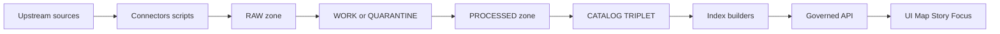

<!-- [KFM_META_BLOCK_V2]
doc_id: kfm://doc/9f9a88f5-4dd7-4ae9-8b64-5310a2b1f7fd
title: scripts/README.md
type: standard
version: v1
status: draft
owners: TBD (add CODEOWNERS rule)
created: 2026-02-26
updated: 2026-02-26
policy_label: public
related:
  - kfm://doc/???  # TODO: link to KFM governance/design guide in-repo
tags: [kfm, scripts, ops, governance]
notes:
  - This README documents *conventions* and *governance expectations* for scripts. Update the directory tree + registry to match the actual repo.
[/KFM_META_BLOCK_V2] -->

# scripts
Operational scripts for KFM ingestion, validation, cataloging, and maintenance — **governed, reproducible, receipt-emitting**.


---

## Quick navigation
- [Purpose](#purpose)
- [Where this fits in the system](#where-this-fits-in-the-system)
- [What belongs here](#what-belongs-here)
- [Directory layout](#directory-layout-update-to-match-repo)
- [What must not go here](#what-must-not-go-here)
- [Truth-path IO discipline](#truth-path-io-discipline)
- [Run receipts](#run-receipts)
- [Conventions](#conventions)
- [Adding a new script](#adding-a-new-script)
- [Script registry](#script-registry)
- [Troubleshooting](#troubleshooting)

---

## Purpose
This directory exists for **operational scripts** that:
- fetch/snapshot upstream sources (into the truth path),
- normalize/validate datasets,
- generate or validate catalogs (DCAT/STAC/PROV),
- build rebuildable projections (indexes, tiles),
- perform maintenance tasks (linting, audits, migrations),
- support local/dev workflows **without** bypassing governance.

> **NOTE**
> In KFM, “scripts” are not “random utilities.” Treat them as *governed operations* that can affect published outputs.

[Back to top](#quick-navigation)

---

## Where this fits in the system
Scripts typically execute **inside** the truth path (RAW → WORK/QUARANTINE → PROCESSED → CATALOG/TRIPLET → indexes), and must not bypass the enforcement boundary.



### Trust membrane reminder
- **No direct “client” access** from UI/external callers to DB/object store.
- Prefer going through the governed API (policy + evidence) and shared repository interfaces.

> **WARNING**
> Scripts that directly mutate canonical storage without emitting receipts, checksums, and provenance break the trust membrane and make results non-auditable.

[Back to top](#quick-navigation)

---

## What belongs here
✅ Put these here:
- **Connectors / acquisition scripts** (snapshot upstream → RAW; store checksums + terms snapshot).
- **Transform scripts** (RAW/WORK → WORK/PROCESSED; produce QA reports).
- **Catalog scripts** (generate + validate DCAT/STAC/PROV; cross-link).
- **Index builder scripts** (build PostGIS/search/graph/tiles from canonical sources).
- **Validation / gate scripts** (promotion contract checks; schema validators; citation link checks).
- **One-off maintenance scripts** (migrations, backfills) **only** if they are receipt-emitting and reversible.

[Back to top](#quick-navigation)

---

## Directory layout (update to match repo)
The actual contents of `scripts/` are **not enumerated here** unless this table is kept current. Use this as a suggested shape and adjust to reality.

```text
scripts/
  acquire/        # Upstream snapshot → RAW
  transform/      # RAW/WORK → WORK/PROCESSED
  validate/       # QA + promotion gate checks
  catalog/        # DCAT/STAC/PROV generation + validation
  index/          # Rebuildable projections (db/search/graph/tiles)
  maintenance/    # One-off ops (migrations/backfills) — receipt-emitting
  lib/            # Shared helpers (no side effects)
  README.md
```

> **TIP**
> Keep scripts *small and composable*. Prefer one responsibility per script plus shared functions in `scripts/lib/`.

[Back to top](#quick-navigation)

---

## What must not go here
🚫 Do **not** put these in `scripts/`:
- application/runtime code (belongs in `src/` / `web/` / services),
- ad-hoc scripts that mutate data with no receipts/provenance,
- secrets (API keys, tokens, service account JSON),
- large raw datasets (these belong in the data zones, not in git),
- anything that bypasses policy redaction/labeling obligations.

> **TIP**
> If a script requires credentials, load them via environment variables or your secrets manager, and ensure the script never prints secrets or restricted data.

[Back to top](#quick-navigation)

---

## Truth-path IO discipline
Scripts must respect the data lifecycle zones.

| Zone | What it is | Script rules of the road |
|---|---|---|
| RAW | Immutable acquisition artifacts + checksums + terms snapshot | Append-only. Never edit; supersede via new acquisition. |
| WORK / QUARANTINE | Intermediate transforms + QA reports + candidate redactions | Allowed to rewrite (work) as part of runs; QUARANTINE blocks promotion. |
| PROCESSED | Publishable artifacts + derived runtime metadata + checksums | Deterministic outputs; no promotion unless gates pass. |
| CATALOG/TRIPLET | DCAT + STAC + PROV + run receipts | Must validate + cross-link; this is the evidence surface. |
| PUBLISHED | Runtime surfaces (API/UI) | Must serve **only promoted** dataset versions. |

[Back to top](#quick-navigation)

---

## Run receipts
Every script that produces artifacts **MUST** emit a run receipt that makes the run reproducible and auditable.

### Minimum receipt shape (template)
Create a JSON file per run (location is repo-specific; keep it deterministic and discoverable):

```json
{
  "run_id": "uuid-or-content-hash",
  "run_kind": "ingest|transform|catalog|index|maintenance",
  "started_at": "2026-02-26T00:00:00Z",
  "ended_at": "2026-02-26T00:00:00Z",
  "git_sha": "optional-but-recommended",
  "command": "exact CLI invocation",
  "parameters": { "example": "value" },
  "inputs": [
    {"uri": "raw://… or file://…", "sha256": "…", "media_type": "…"}
  ],
  "outputs": [
    {"uri": "processed://… or file://…", "sha256": "…", "media_type": "…"}
  ],
  "environment": {
    "container_image": "repo/image@sha256:…",
    "tool_versions": { "python": "3.12.x" }
  },
  "policy": {
    "policy_label": "public|restricted|…",
    "obligations_applied": ["redact_precise_locations", "…"],
    "decision": "allow|deny",
    "reason_codes": ["…"]
  },
  "notes": "human-readable context"
}
```

### Receipt invariants
- **Inputs and outputs must be enumerated with checksums.**
- Record enough environment detail to make the run reproducible (e.g., container image digest).
- If policy denies or licensing is unclear, **fail closed** and write the dataset to QUARANTINE rather than PROCESSED/PUBLISHED.

[Back to top](#quick-navigation)

---

## Conventions

### Script interface
All scripts should:
- be runnable from the repo root,
- support `--help`,
- accept `--dry-run` (or equivalent) where meaningful,
- return non-zero exit codes on failure,
- log progress to stderr; write machine outputs to files.

### Naming
Use names that describe intent:
- `acquire_*` (upstream → RAW)
- `normalize_*` / `transform_*` (RAW/WORK → WORK/PROCESSED)
- `validate_*` (QA, schema, promotion gates)
- `catalog_*` (DCAT/STAC/PROV generation + validation)
- `index_*` (rebuildable projections)
- `migrate_*` (reversible data/metadata migrations)

### Determinism
Prefer deterministic outputs:
- same inputs + same parameters ⇒ same outputs + same digests
- avoid “now()” timestamps in artifacts unless explicitly part of the domain model (timestamps belong in receipts)

### Safety defaults
- Default-deny if licensing, sensitivity, or required metadata is unclear.
- Never emit restricted coordinates/attributes into public artifacts; generate generalized derivatives when required.

[Back to top](#quick-navigation)

---

## Adding a new script
Use this checklist (keep it small, reviewable, reversible):

- [ ] Script has a clear purpose statement at top-of-file.
- [ ] Script declares *inputs* and *outputs* (paths/URIs + formats).
- [ ] Script writes to the correct zone(s) only.
- [ ] Script emits a run receipt (see template above).
- [ ] Script produces checksums for every output artifact.
- [ ] Script is idempotent or clearly documents non-idempotent behavior + rollback plan.
- [ ] Script includes `--dry-run` (when practical).
- [ ] Script includes a minimal test or “smoke run” fixture (when feasible).
- [ ] Script does **not** embed secrets and does not print sensitive data.
- [ ] If the script affects promotion/publishing, it runs (or is run by) the Promotion Contract gates.

### Header template (copy/paste)
```text
Purpose:
Inputs:
Outputs:
Policy considerations:
Run receipt:
Owner:
```

[Back to top](#quick-navigation)

---

## Script registry
Keep a lightweight registry so operators can discover scripts quickly.

> **NOTE**
> The entries below are placeholders until populated from the actual repo.

| Script | Kind | What it does | Inputs | Outputs | Zone(s) touched | Owner |
|---|---|---|---|---|---|---|
| (add) | ingest |  |  |  | RAW |  |
| (add) | transform |  |  |  | WORK/PROCESSED |  |
| (add) | catalog |  |  |  | CATALOG/TRIPLET |  |
| (add) | index |  |  |  | INDEXES (rebuildable) |  |

[Back to top](#quick-navigation)

---

## Troubleshooting

### “It ran but I can’t reproduce the output”
- Confirm a run receipt exists and includes exact inputs/outputs + checksums.
- Confirm the environment section pins versions (prefer container digests).

### “Why did it fail closed?”
- Look for missing rights metadata, unclear licensing, sensitivity flags, or failed validation.
- QUARANTINE is expected when policy or reproducibility is uncertain.

### “How do I know a script is safe to run?”
- It should be receipt-emitting, deterministic, and should not bypass policy enforcement.
- If it touches published surfaces, it must be gated by Promotion Contract checks.

[Back to top](#quick-navigation)
