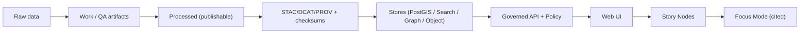

<!--
Path: scripts/README.md
Governance: This is a governed document. Treat edits as production changes.
-->

# scripts

Governed command-line scripts used to **build**, **validate**, and **operate** Kansas Frontier Matrix (KFM).

**Status:** Governed 🔒  
**Default posture:** Fail-closed ✅ • Deterministic outputs ✅ • CI-parity ✅ • No trust-membrane bypass ✅

> [!IMPORTANT]
> Anything in `scripts/` can affect **dataset promotion**, **policy enforcement**, and **evidence provenance**.  
> Treat changes as **production changes**: review, test, and keep outputs deterministic.

---

## Table of Contents

- [Purpose and Scope](#purpose-and-scope)
- [Non-Negotiable System Guarantees](#non-negotiable-system-guarantees)
- [Repository Layout](#repository-layout)
- [Quickstart](#quickstart)
- [Script Catalog](#script-catalog)
- [Where Scripts Fit in the KFM Truth Path](#where-scripts-fit-in-the-kfm-truth-path)
- [Promotion Gates and Required Artifacts](#promotion-gates-and-required-artifacts)
- [Standard Script Interface](#standard-script-interface)
- [Determinism Checklist](#determinism-checklist)
- [Sensitivity, Redaction, and Safety](#sensitivity-redaction-and-safety)
- [Script Design Standards](#script-design-standards)
- [Adding or Changing a Script](#adding-or-changing-a-script)
- [Troubleshooting](#troubleshooting)
- [Grounding References](#grounding-references)

---

## Purpose and Scope

`scripts/` exists to make KFM’s governance **enforceable**:

- Run the same validations locally that CI runs.
- Provide operational “runbooks as code” that are **safe by default**.
- Prevent regressions into ad-hoc or uncited behavior by enforcing checks for:
  - catalogs (STAC/DCAT/PROV)
  - checksums
  - Story Node structure/citation rules
  - policy-as-code (OPA)

> [!NOTE]
> If a script can change what gets published, what gets served, or what gets cited, it is governed.

---

## Non-Negotiable System Guarantees

These scripts exist to enforce KFM’s hard invariants:

- **Trust membrane:** UI and external clients never access databases directly; all access is via the governed API + policy boundary.
- **Fail-closed policy:** if policy cannot be evaluated or evidence is incomplete, **deny by default**.
- **Dataset promotion gates:** Raw → Work → Processed; promotion requires deterministic checksums and STAC/DCAT/PROV catalogs.
- **Focus Mode cite-or-abstain:** AI answers must include citations (or refuse) and produce an audit reference.
- **Processed-only publishing:** the processed zone is the only publishable source of truth; raw/work are never served directly.

---

## Repository Layout

Recommended (and easiest to keep governed):

```text
scripts/
  README.md
  lint_docs.sh
  validate_story_nodes.sh
  validate_catalogs.sh
  validate_checksums.sh

  lib/                    # optional shared helpers (pure functions, no side effects)
    common.sh
    json.sh
```

> [!TIP]
> Keep shared helpers in `scripts/lib/` and source them. Avoid copy/paste drift.

---

## Quickstart

Run from the repository root:

```bash
chmod +x scripts/*.sh

./scripts/lint_docs.sh
./scripts/validate_story_nodes.sh

./scripts/validate_catalogs.sh     # STAC/DCAT/PROV
./scripts/validate_checksums.sh

opa test policy -v
```

### Prerequisites

Typical dependencies (adjust to your environment):

- `bash` + coreutils
- OPA CLI (`opa`) for policy tests
- `python3` (only if you use Python scripts)
- `docker` / `podman` (only if scripts call containerized services)
- Optional linters (recommended): `shellcheck`, `shfmt`

> [!NOTE]
> Scripts should run in **CI and local dev** with minimal extra setup. If you add a new dependency, document it here and pin versions where practical.

---

## Script Catalog

> [!IMPORTANT]
> The scripts in the **Required** table are referenced by KFM CI expectations.  
> If you rename them, update CI and this README in the **same PR**.

### Required

| Script | Type | Role | Inputs (defaults) | Outputs | Fails when |
|---|---|---|---|---|---|
| `lint_docs.sh` | Validator | Lint governed Markdown docs | `docs/**`, `stories/**` | Exit code only *(optionally a report)* | Markdown violates governed style or structure |
| `validate_story_nodes.sh` | Validator | Validate Story Node bundles | `stories/**` | Exit code + optional report | Template/required sections/citations are invalid |
| `validate_catalogs.sh` | Validator | Validate STAC/DCAT/PROV artifacts | `data/catalog/**` | Exit code + optional report | Catalogs missing/invalid/broken links |
| `validate_checksums.sh` | Validator | Verify deterministic checksums for promoted artifacts | `data/**` | Exit code + optional manifest | Any promoted artifact lacks checksum or checksum mismatch |

### Optional

These are allowed, but must follow the same governance and determinism rules:

| Script pattern | Examples | Special rules |
|---|---|---|
| Operational runbooks | `backfill_*.sh`, `refresh_index_*.sh` | Default **dry-run**; require explicit `--apply` |
| Connector dry-runs | `run_connector_*.py` | Must emit `run_record.json` + `validation_report.json` |
| Dev-only utilities | `seed_demo_data.sh` | Must not weaken governance; never seed real restricted data |

> [!CAUTION]
> “Quick fixes” that bypass catalogs/policy (e.g., direct DB writes) are **not allowed** in `scripts/`.

---

## Where Scripts Fit in the KFM Truth Path

KFM’s provenance chain is designed as:

Raw → Work → Processed → STAC/DCAT/PROV → Stores → API → UI → Stories → Focus Mode



### What scripts cover

- building and validating **raw/work/processed** artifacts
- validating **catalogs** (STAC/DCAT/PROV)
- validating **Story Nodes**
- running **policy tests** (`opa test policy -v`) so failures are caught before deploy

---

## Promotion Gates and Required Artifacts

Promotion into `processed/` (and anything public-facing) must be blocked unless all gates pass:

- license present
- sensitivity classification present
- schema + geospatial checks pass
- checksums computed
- STAC/DCAT/PROV artifacts exist and validate
- audit event recorded
- human approval if sensitive

Operational expectations:

- `validate_checksums.sh` must fail if any promoted artifact is missing a deterministic checksum.
- `validate_catalogs.sh` must fail if STAC/DCAT/PROV are missing, invalid, or inconsistent (e.g., broken cross-links).
- Any pipeline/connector script that transforms data should emit:
  - a `run_record.json`
  - a `validation_report.json`
  - and the catalogs/checksums needed for promotion

---

## Standard Script Interface

To keep scripts predictable and CI-friendly, **new scripts** should implement a common interface.

### Minimum CLI contract

- `-h, --help` prints usage + examples
- `--format text|json` *(recommended)* for machine-readable validation output
- `--report <path>` *(recommended)* to write a JSON report artifact
- `--paths <glob-or-dir>` *(recommended)* to scope validation
- Exit codes:
  - `0` success
  - `1` validation failed / policy denied
  - `2` misuse (bad args)
  - `>2` unexpected error

### Default safety posture

Scripts that can modify state MUST:

- default to `--dry-run` behavior
- require explicit `--apply` to change anything
- never write directly across the trust membrane
- never publish from raw/work zones

> [!TIP]
> If a script can change data, treat it like a migration: require a ticket/issue reference and produce a run record.

---

## Determinism Checklist

Deterministic outputs prevent “it passed locally but failed in CI” and make provenance reproducible.

Recommended baseline:

- Set stable locale/time assumptions:
  - `TZ=UTC`
  - `LC_ALL=C`
- Avoid embedding timestamps in generated artifacts unless explicitly required and then:
  - store them in `run_record.json` (not inside the data artifact)
- Ensure stable ordering:
  - sort file lists
  - sort JSON keys when writing JSON (`jq -S`, Python `sort_keys=True`)
- Use content hashing for artifacts:
  - prefer `sha256sum`
  - avoid platform-specific hash tools unless pinned

---

## Sensitivity, Redaction, and Safety

KFM treats some domains as sensitive (examples: ownership/PII risk, precise archaeological site locations, sensitive species locations).

Rules of thumb for scripts:

- Assume **Restricted** until proven otherwise when dealing with ownership/parcel data.
- For **Sensitive-location** datasets, produce a generalized derivative for public use and keep precise geometries behind role-based policy.
- Treat **redaction as a first-class transformation**:
  - the raw dataset remains immutable
  - the redacted derivative is a separate version (and sometimes a separate dataset)
  - the redaction step must be recorded in PROV

CI policy regression should include:

- golden queries that previously leaked restricted fields must keep failing forever
- negative tests: sensitive-location layers must not return high precision to unauthorized roles
- field-level tests: owner names, exact coordinates, and small-count health/crime indicators are redacted
- audit integrity tests: every API response includes an audit reference (and, ideally, an evidence bundle hash)

> [!CAUTION]
> Never add scripts that print secrets, dump restricted rows, or “temporarily” bypass policy checks. This is exactly how governance regressions happen.

---

## Script Design Standards

### Bash

- Use strict mode: `set -euo pipefail`
- Print usage on `-h/--help`
- Never echo secrets (tokens, keys)
- Be idempotent (safe to rerun)
- Prefer machine-readable output (JSON) for validators when practical

<details>
<summary>Bash skeleton</summary>

```bash
#!/usr/bin/env bash
set -euo pipefail

usage() {
  cat <<'EOF'
Usage: ./scripts/<name>.sh [options]

Description:
  (Fill in)

Options:
  -h, --help         Show help
  --format <fmt>     text|json (default: text)
  --report <path>    Write JSON report to file
  --paths <path>     Paths/globs to operate on
EOF
}

FORMAT="text"
REPORT=""
PATHS=""

while [[ $# -gt 0 ]]; do
  case "$1" in
    -h|--help) usage; exit 0 ;;
    --format) FORMAT="${2:-}"; shift 2 ;;
    --report) REPORT="${2:-}"; shift 2 ;;
    --paths) PATHS="${2:-}"; shift 2 ;;
    *) echo "Unknown arg: $1" >&2; usage; exit 2 ;;
  esac
done

# Script body...
# - Print human output to stderr
# - Print JSON to stdout (if FORMAT=json)
```
</details>

### Python

- Use `argparse` with `--help`
- Write deterministic outputs:
  - stable ordering
  - explicit hashing
  - explicit schema versions
- Prefer calling governed library code (e.g., validators under `src/`) over ad-hoc DB access
- For any script that creates/promotes artifacts, produce:
  - `run_record.json`
  - `validation_report.json`
  - checksums for every output artifact

<details>
<summary>Python skeleton</summary>

```python
#!/usr/bin/env python3
from __future__ import annotations

import argparse
import json
import sys
from dataclasses import dataclass, asdict

@dataclass(frozen=True)
class Report:
  ok: bool
  notes: list[str]

def main() -> int:
  parser = argparse.ArgumentParser()
  parser.add_argument("--format", choices=["text", "json"], default="text")
  parser.add_argument("--report", default="")
  args = parser.parse_args()

  report = Report(ok=True, notes=[])

  if args.format == "json":
    json.dump(asdict(report), sys.stdout, indent=2, sort_keys=True)
    sys.stdout.write("\n")
  else:
    sys.stderr.write("OK\n")

  if args.report:
    with open(args.report, "w", encoding="utf-8") as f:
      json.dump(asdict(report), f, indent=2, sort_keys=True)
      f.write("\n")

  return 0

if __name__ == "__main__":
  raise SystemExit(main())
```
</details>

---

## Adding or Changing a Script

Aim for **CI-ready by default**.

### Definition of Done

- [ ] Has `--help` and at least one concrete example
- [ ] Deterministic outputs + checksums (when producing artifacts)
- [ ] Writes a validation report + run record (for pipeline-style scripts)
- [ ] Annotated with governance notes if it touches sensitive data
- [ ] Covered by CI (or explicitly documented why it is not)
- [ ] Updates the Script Catalog table in this README
- [ ] Includes a minimal regression test (fixture-based when possible)

### PR Review Checklist

- [ ] No trust membrane bypass (no direct DB access from scripts unless through governed adapters)
- [ ] No raw/work publishing paths
- [ ] Output is stable across reruns
- [ ] Secrets are not logged
- [ ] Failure modes are fail-closed with clear exit codes

---

## Troubleshooting

### `validate_catalogs.sh` fails

Common causes:

- missing license/sensitivity label
- STAC/DCAT/PROV schema mismatch
- broken links between catalogs (e.g., STAC collection not linking to DCAT dataset)

### `validate_checksums.sh` fails

Common causes:

- artifact changed but checksum manifest not updated
- non-deterministic build output (timestamps, unordered fields)

### Policy tests fail

Common causes:

- new endpoint missing policy coverage
- cite-or-abstain checks reject an AI answer without citations/audit ref

---

## Grounding References

This README aligns to the following governed design artifacts:

- **KFM Next-Generation Blueprint & Primary Guide** (draft, 2026-02-12)
- **KFM Comprehensive Data Source Integration Blueprint** (v1.0, 2026-02-12)

> [!IMPORTANT]
> If the official CI workflow, promotion gates, or policy expectations change, update this file in the same PR as the workflow/policy change.