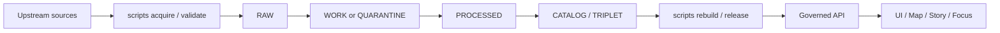

<!-- [KFM_META_BLOCK_V2]
doc_id: kfm://doc/e2c22a5a-aeb3-4ed5-9f49-47f1baa0c6cc
title: scripts/README.md
type: standard
version: v1
status: draft
owners: TODO
created: 2026-03-07
updated: 2026-03-07
policy_label: public
related: [../README.md, ../data/, ../policy/, ../tests/, ../tools/]
tags: [kfm, scripts, operations, governance]
notes: [Align to live repo shape; keep recommended layout synced with actual script subdirectories]
[/KFM_META_BLOCK_V2] -->

# scripts
Operational scripts for governed build, validation, promotion, rebuild, and release tasks.

> **Status:** Experimental  
> **Owners:** TODO — assign maintainers / CODEOWNERS entry  
> 
> 
> 
>   
> **Quick links:** [Scope](#scope) · [Repo fit](#repo-fit) · [Accepted inputs](#accepted-inputs) · [Exclusions](#exclusions) · [Directory tree](#directory-tree) · [Quickstart](#quickstart) · [Diagram](#diagram) · [Script matrix](#script-matrix) · [Definition of done](#definition-of-done) · [FAQ](#faq)

## Status & posture
This directory is the governed home for small operational scripts that help move KFM artifacts through the truth path without bypassing policy, provenance, or release gates.

## Scope
Use `scripts/` for lightweight, reviewable, reversible repository operations such as:

- acquiring or snapshotting upstream data into the correct zone
- validating data, metadata, schemas, and promotion gates
- rebuilding derived indexes, tiles, or other rebuildable projections
- performing controlled maintenance tasks such as migrations, backfills, or receipt generation
- supporting local developer workflows that must still respect KFM governance

## Repo fit
**Path:** `scripts/`

**Upstream dependencies:** [`../configs/`](../configs/), [`../contracts/`](../contracts/), [`../data/`](../data/), [`../policy/`](../policy/), [`../schemas/`](../schemas/)

**Downstream consumers:** [`../apps/`](../apps/), [`../packages/`](../packages/), [`../tests/`](../tests/), [`../tools/`](../tools/), and CI workflows in [`../.github/workflows/`](../.github/workflows/)

**Why this exists:** application code should stay inside runtime/service packages; `scripts/` exists so operational tasks are discoverable, documented, auditable, and easy to run consistently from CI and from a local checkout.

## Accepted inputs
The following belong here:

- parameterized CLI scripts (`.sh`, `.py`, `.mjs`, and similar)
- side-effecting operational tasks with clearly declared inputs and outputs
- small shared helpers in `scripts/lib/` with no hidden side effects
- references to governed repo inputs such as:
  - `../data/**`
  - `../configs/**`
  - `../contracts/**`
  - `../policy/**`
  - `../schemas/**`
- environment-variable or secret-manager based credentials
- dry-run / smoke-run fixtures that support safe verification

## Exclusions
The following do **not** belong here:

- application/runtime code — put it in [`../apps/`](../apps/) or [`../packages/`](../packages/)
- large datasets or generated artifacts — put them in the appropriate zone under [`../data/`](../data/)
- notebooks, experiments, or analyst-only one-offs — prefer the relevant docs, examples, or workbench area
- secrets, tokens, service account JSON, or `.env` files
- scripts that mutate canonical data without receipts, checksums, rollback notes, or policy evaluation
- code that bypasses the governed API / policy / evidence boundary

## Directory tree

### Current minimum
```text
scripts/
└── README.md
```

### Recommended shape
Update this tree as real directories land in the repo.

```text
scripts/
├── dev/          # local helpers, smoke runs, setup shortcuts
├── lint/         # repo, schema, and policy linting
├── promote/      # promotion-contract helpers and publication gates
├── rebuild/      # rebuildable projections (indexes, tiles, caches)
├── release/      # release manifests, receipts, and index helpers
├── maintenance/  # reversible backfills, migrations, audits
├── lib/          # shared helpers with no hidden side effects
└── README.md
```

| Area | Purpose | Typical inputs | Typical outputs |
|---|---|---|---|
| `dev/` | Local developer ergonomics | local checkout, config templates | logs, smoke-run results |
| `lint/` | Validate contracts and repo invariants | schemas, policy, examples | pass/fail signals, reports |
| `promote/` | Enforce promotion contract | processed artifacts, metadata | allow/deny decision, receipts |
| `rebuild/` | Recreate rebuildable projections | canonical artifacts | tiles, indexes, cacheable projections |
| `release/` | Write release evidence and manifests | approved outputs | release entries, SBOM/receipt attachments |
| `maintenance/` | Controlled corrective operations | canonical data + migration plans | reversible changes + receipts |
| `lib/` | Shared helpers only | reusable functions | imported utilities |

[Back to top](#scripts)

## Quickstart
Commands below are examples. Replace placeholder paths with real scripts that exist in this directory.

```bash
# Discover scripts
find scripts -maxdepth 2 -type f | sort

# Read help
./scripts/<group>/<script>.sh --help
python scripts/<group>/<script>.py --help
node scripts/<group>/<script>.mjs --help

# Prefer dry runs when supported
./scripts/<group>/<script>.sh --dry-run
```

## Usage rules

### Interface contract
Every operational script should:

- run from the repo root
- support `--help`
- support `--dry-run` where meaningful
- exit non-zero on failure
- write human-oriented progress to stderr/stdout and machine-oriented outputs to files
- declare inputs, outputs, and affected zones
- emit or attach a deterministic run receipt when it changes or creates artifacts

### Naming
Use names that communicate intent:

- `acquire_*`
- `transform_*` / `normalize_*`
- `validate_*`
- `catalog_*`
- `index_*`
- `promote_*`
- `release_*`
- `migrate_*`

### Safety defaults
- Fail closed when rights, sensitivity, required metadata, or validation state is unclear.
- Never publish precise sensitive coordinates or restricted attributes into public outputs.
- Never embed secrets in scripts or logs.
- Prefer deterministic outputs: same inputs + same parameters ⇒ same outputs.

## Diagram

```mermaid
flowchart LR
    A[Upstream sources] --> B[scripts acquire / validate]
    B --> C[RAW]
    C --> D[WORK or QUARANTINE]
    D --> E[PROCESSED]
    E --> F[CATALOG / TRIPLET]
    F --> G[scripts rebuild / release]
    G --> H[Governed API]
    H --> I[UI / Map / Story / Focus]
```

## Governance rules
`scripts/` lives inside the KFM trust system, not outside it.

| Rule | Meaning for this directory |
|---|---|
| Truth path | Scripts must write only to the correct zone and never “skip ahead” to published surfaces. |
| Trust membrane | Scripts must not create side channels that let clients bypass API + policy + evidence checks. |
| Cite-or-abstain | If a script contributes to public output, its artifacts must be traceable to evidence and receipts. |
| Default-deny | Missing rights or failed validation means stop, quarantine, and document. |
| Separation of duty | Scripts may prepare artifacts, but policy-significant promotion still needs governed review/gates. |

## Receipt template
Every script that creates or mutates governed artifacts should emit a receipt discoverable by humans and CI.

```json
{
  "run_id": "uuid-or-content-hash",
  "run_kind": "lint|promote|rebuild|release|maintenance",
  "started_at": "2026-03-07T00:00:00Z",
  "ended_at": "2026-03-07T00:00:00Z",
  "git_sha": "optional-but-recommended",
  "command": "exact invocation",
  "parameters": {},
  "inputs": [],
  "outputs": [],
  "environment": {
    "container_image": "optional",
    "tool_versions": {}
  },
  "policy": {
    "policy_label": "public|restricted|unknown",
    "decision": "allow|deny",
    "reason_codes": []
  },
  "notes": "human-readable context"
}
```

## Script matrix
Keep this table current as scripts are added.

| Script | Kind | What it does | Inputs | Outputs | Zones touched | Owner |
|---|---|---|---|---|---|---|
| _TBD_ | _TBD_ | _Describe intent_ | _Declare inputs_ | _Declare outputs_ | _RAW / WORK / PROCESSED / CATALOG / rebuildable_ | _Assign_ |

## Definition of done
A new script is ready to merge when all boxes below are true.

- [ ] Purpose is stated at the top of the file.
- [ ] Inputs, outputs, and affected zones are documented.
- [ ] `--help` works.
- [ ] `--dry-run` exists when practical.
- [ ] Non-zero exit codes are used on failure.
- [ ] Secrets are not embedded or echoed.
- [ ] Receipts and checksums are emitted when artifacts change.
- [ ] A rollback path is documented for non-idempotent behavior.
- [ ] A minimal smoke test or fixture exists.
- [ ] The relevant promotion / policy / schema gates are wired in CI if the script affects publication.

## Troubleshooting

### A script ran, but the output is not reproducible
- Check whether a run receipt was written.
- Confirm inputs and outputs have digests.
- Pin tool or container versions.

### A script failed closed
- Look for missing rights metadata, unclear licensing, failed schema checks, or sensitivity flags.
- Prefer quarantine over silent partial success.

### I need application logic, not an ops script
- Put runtime code in [`../apps/`](../apps/) or [`../packages/`](../packages/) instead.

## FAQ

### Why not keep these utilities in random locations?
Because KFM treats operational behavior as part of the trust surface. Centralizing scripts makes them easier to review, discover, test, and govern.

### Can a script touch published surfaces directly?
No. It can prepare or rebuild artifacts, but published exposure must remain behind governed promotion and API boundaries.

### Should one-off cleanup code live here?
Only if it is reversible, receipt-emitting, documented, and worth keeping for future audits or reruns.

<details>
<summary>Appendix: per-script header template</summary>

```text
Purpose:
Inputs:
Outputs:
Zones touched:
Policy considerations:
Rollback:
Run receipt:
Owner:
```

</details>

[Back to top](#scripts)