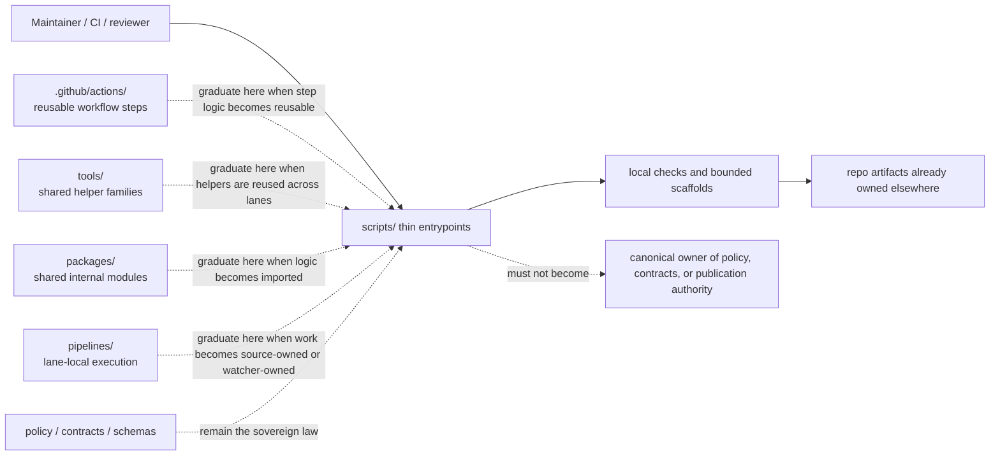

<!-- [KFM_META_BLOCK_V2]
doc_id: kfm://doc/TODO-VERIFY-UUID
title: scripts/
type: standard
version: v1
status: draft
owners: @bartytime4life
created: TODO(verify-created-date)
updated: 2026-04-12
policy_label: TODO(verify-policy-label)
related: [../README.md, ../tools/README.md, ../packages/README.md, ../pipelines/README.md, ../policy/README.md, ../contracts/README.md, ../schemas/README.md, ../tests/README.md, ../.github/actions/README.md, ../.github/workflows/README.md, ../.github/CODEOWNERS, ../Makefile]
tags: [kfm, scripts, automation, validation, promotion, evidence]
notes: [Public main now exposes checked-in entrypoints under scripts/ in addition to README.md; this revision replaces stale README-only language while keeping the thin-entrypoint boundary explicit.]
[/KFM_META_BLOCK_V2] -->

# scripts/

Repo-local entrypoints for repeatable, reviewable KFM validation, scaffold checks, sample ingest, and operator-safe developer tasks.

**Status:** experimental  
**Owners:** `@bartytime4life`  
**Path:** `scripts/README.md`  
        
**Quick jumps:** [Scope](#scope) · [Repo fit](#repo-fit) · [Accepted inputs](#accepted-inputs) · [Exclusions](#exclusions) · [Directory tree](#directory-tree) · [Quickstart](#quickstart) · [Usage](#usage) · [Diagram](#diagram) · [Reference tables](#reference-tables) · [Task list](#task-list) · [FAQ](#faq) · [Appendix](#appendix)

> [!IMPORTANT]
> This README is **evidence-bounded**.
>
> Public `main` now exposes `scripts/` as a small but real executable lane: `README.md`, `bootstrap.sh`, `catalog_validate.py`, `dev_up.sh`, `sample_ingest.sh`, and `validate_schemas.py`. That is stronger than a README-only scaffold, but still consistent with KFM's doctrine that `scripts/` should stay **thin, explicit, and non-sovereign**.
>
> The role of this directory remains narrow: local entrypoints and repeatable wrappers, not hidden policy law, canonical schemas, long-lived runtime services, or lane-owned execution systems.

## Scope

`scripts/` is the repo surface where KFM turns a few repeatable developer and maintainer tasks into explicit local entrypoints.

Today that surface is intentionally conservative. The checked-in helpers do not stand up services, publish datasets, or define new domain law. They verify basic preconditions, parse JSON, check catalog scaffolds, and generate a sample ingest artifact that stays clearly local and reviewable.

> [!TIP]
> `scripts/` should expose a governed lane, not become the lane’s sovereign owner.

That rule still means two things at once:

1. durable meaning belongs in stronger surfaces such as contracts, policy, packages, apps, governed APIs, and lane-local pipelines
2. `scripts/` exists to make bounded checks and developer tasks repeatable, visible, and fail-closed

### Current public snapshot

| Status | What current evidence supports |
| --- | --- |
| **CONFIRMED** | `scripts/` on public `main` contains `README.md`, `bootstrap.sh`, `catalog_validate.py`, `dev_up.sh`, `sample_ingest.sh`, and `validate_schemas.py` |
| **CONFIRMED** | `.github/CODEOWNERS` assigns `/scripts/` to `@bartytime4life` |
| **CONFIRMED** | the root `Makefile` standardizes local entrypoints for `bootstrap`, `validate-schemas`, `test`, `dev-up`, `sample-ingest`, and `catalog-validate` |
| **CONFIRMED** | the checked-in script behaviors stay thin: bootstrap checks for `python3`; `dev_up.sh` explicitly says no long-running services are defined; `catalog_validate.py` checks for catalog README scaffolds; `sample_ingest.sh` writes a local sample JSON plus receipt; `validate_schemas.py` parses repo JSON and checks one schema header |
| **CONFIRMED** | `.github/actions/` remains a placeholder-heavy adjacent action seam and `.github/workflows/` remains README-only on current public `main` |
| **CONFIRMED** | `packages/` and `pipelines/` are now visibly real adjacent surfaces, which sharpens the graduation boundary for anything in `scripts/` that stops being entrypoint-sized |
| **UNKNOWN / NEEDS VERIFICATION** | deeper caller coverage across local checkout state, non-public branches, unpublished automation, and whether additional branch-local scripts exist outside current public `main` |

[Back to top](#scripts)

## Repo fit

| Field | Value |
| --- | --- |
| Target file | `scripts/README.md` |
| Directory role | Thin, reviewable entrypoints for developer bootstrap, schema checks, catalog scaffold checks, sample ingest scaffolding, and other bounded local automation |
| Current public repo fit | A small checked-in executable lane, still doctrinally **thin** rather than subsystem-sized |
| Upstream context | [`../README.md`](../README.md) · [`../policy/README.md`](../policy/README.md) · [`../contracts/README.md`](../contracts/README.md) · [`../schemas/README.md`](../schemas/README.md) · [`../tests/README.md`](../tests/README.md) |
| Task entrypoint | [`../Makefile`](../Makefile) |
| Sibling helper lane | [`../tools/README.md`](../tools/README.md) |
| Shared module boundary | [`../packages/README.md`](../packages/README.md) |
| Lane-local execution surface | [`../pipelines/README.md`](../pipelines/README.md) |
| Adjacent control surfaces | [`../.github/actions/README.md`](../.github/actions/README.md) · [`../.github/workflows/README.md`](../.github/workflows/README.md) |
| Governing rule | `scripts/` may wrap checks and local developer flows; it must not silently become the canonical owner of policy, contracts, runtime truth, or publication authority |

### Why this directory matters in KFM

KFM's doctrine is unusually explicit that trust-bearing transitions should be inspectable. Even small local helpers matter because they become the repeated command surfaces maintainers and CI copy into habit. If those entrypoints stay honest, narrow, and evidence-friendly, they strengthen the repo. If they accumulate hidden business law, they weaken it.

### Actual checked-in entrypoint family

The current public tree now proves a minimal helper family rather than a README-only placeholder.

| Entrypoint | Current checked-in behavior | Keep it here because |
| --- | --- | --- |
| `bootstrap.sh` | verifies `python3` is present and prints a docs-first bootstrap message | it is a minimal environment sanity check, not an installer or runtime owner |
| `validate_schemas.py` | parses repo JSON files and checks the correction notice schema's declared `$schema` | it is a thin validation wrapper over visible repo artifacts |
| `dev_up.sh` | states that no long-running local services are currently defined and points users to validation commands | it preserves an explicit no-service posture instead of implying more runtime than the repo proves |
| `sample_ingest.sh` | copies a valid correction notice fixture into `data/work/sample_ingest/` and writes a matching receipt JSON | it creates a bounded local scaffold without claiming real source-onboarding or promotion |
| `catalog_validate.py` | asserts the presence of catalog README scaffolds under `data/catalog/`, `stac/`, `dcat/`, and `prov/` | it enforces visible scaffold integrity rather than catalog law |
| `make test` | delegates to contract-facing unittest discovery under `tests/contracts/` | it is a repo entrypoint, while the actual proof burden remains in `tests/` |

### Boundary pressure is higher now

The directory matters more now because the surrounding lanes are clearer than older drafts assumed:

- `.github/actions/` is the repo-local reusable step seam
- `.github/workflows/` is the workflow/control lane, even if it is still README-only on public `main`
- `packages/` is the shared internal module boundary
- `pipelines/` is the lane-specific execution surface
- `tools/` remains the governed helper family surface

That makes graduation decisions easier, not harder. If a helper becomes imported, shared, lane-owned, or promotion-bearing, it should stop living here.

## Accepted inputs

The following belong in `scripts/` **when they remain entrypoint-sized**.

| Family | Typical contents | Keep it here when |
| --- | --- | --- |
| Bootstrap / environment | local sanity checks, interpreter presence checks, explicit "nothing to start" developer entrypoints | the command sets expectations without becoming an installer or runtime manager |
| Validation wrappers | JSON parse checks, scaffold-presence checks, bounded lint or validation entrypoints | the logic is thin and the law lives elsewhere |
| Sample scaffolds | local example materializations, fixture copies, receipt stubs for review or demo flows | the result is obviously non-authoritative and clearly local |
| Developer task aliases | Makefile-facing shims that normalize how maintainers call one small task | the wrapper improves repeatability without hiding behavior |
| Evidence-friendly local utilities | commands that emit receipts or clearly scoped local artifacts | the outputs remain reconstructable and non-sovereign |

### Minimum bar for anything added here

A new helper should usually satisfy all of the following:

- it has one clear purpose
- it runs non-interactively unless interaction is genuinely necessary
- it exits non-zero on failure
- it documents inputs, outputs, and side effects
- it makes destructive work unmistakable
- it does not require committed secrets
- it does not smuggle policy or schema law into shell glue
- it does not quietly become a reusable action, shared library, or lane-local pipeline

## Exclusions

| Do not keep here | Better home | Why |
| --- | --- | --- |
| Canonical contracts or schema law | [`../contracts/README.md`](../contracts/README.md) and related schema surfaces | machine-readable law should not hide in helper scripts |
| Policy bundles, allow/deny semantics, obligation logic | [`../policy/README.md`](../policy/README.md) | policy must stay explicit, testable, and independently reviewable |
| Reusable helper families or mature CLIs | [`../tools/README.md`](../tools/README.md) | shared helper behavior deserves a stronger lifecycle |
| Reusable workflow-step contracts | [`../.github/actions/README.md`](../.github/actions/README.md) | step-level reuse should stay visible as repo-local action surfaces |
| Workflow choreography and merge gates | [`../.github/workflows/README.md`](../.github/workflows/README.md) | merge-state automation belongs in checked-in control logic |
| Lane-local fetch / transform / validate / emit flows | [`../pipelines/README.md`](../pipelines/README.md) | source-local execution deserves lane-local ownership |
| Imported internal modules | [`../packages/README.md`](../packages/README.md) | hidden library behavior inside entrypoints makes review harder |
| Long-lived services or operators | app / runtime / infra surfaces | runtime ownership deserves stronger operational discipline |
| Secrets, tokens, or workstation-only overrides | secret manager or untracked local config | helper directories must never become secret stores |

> [!WARNING]
> If deleting one script would erase important knowledge about what is publishable, what policy decided, or how release truth is reconstructed, the directory is carrying too much meaning.

## Truth labels used here

| Marker | Meaning in this README |
| --- | --- |
| **CONFIRMED** | directly supported by current public repo-tree evidence, current public Markdown, or directly inspectable checked-in files |
| **INFERRED** | conservative synthesis from multiple project sources |
| **PROPOSED** | doctrine-consistent realization or improvement not yet verified as current checked-in repo reality |
| **UNKNOWN** | not established strongly enough in this revision to present as settled fact |
| **NEEDS VERIFICATION** | a path, behavior, owner, or implementation detail that should be checked against the actual checkout or branch before merge |

## Directory tree

### Confirmed on current public `main`

```text
scripts/
├── README.md
├── bootstrap.sh
├── catalog_validate.py
├── dev_up.sh
├── sample_ingest.sh
└── validate_schemas.py
```

### Adjacent public tree cues

```text
.github/actions/
├── action.yml
├── metadata-validate/
├── metadata-validate-v2/
├── opa-gate/
├── provenance-guard/
├── sbom-produce-and-sign/
├── src/
└── README.md

.github/workflows/
└── README.md

packages/
├── catalog/
├── domain/
├── evidence/
├── genealogy_ingest/
├── indexers/
├── ingest/
├── policy/
└── README.md

pipelines/
├── README.md
├── hls-ndvi/
├── soils/
├── ssurgo_to_catchment.md
└── wbd-huc12-watcher/
```

### Document-grounded target/example shape

> [!NOTE]
> These names recur in KFM design notes and example validation lanes. They remain useful as target-state or illustrative entrypoints, but they are **not** current public-tree proof.

```text
scripts/
├── catalog/
│   ├── validate_stac.py
│   └── validate_jsonld.sh
├── evidence/
│   ├── crosslink_consistency.py
│   └── verify_checksums.sh
├── lint/
│   └── md_required_sections.sh
├── policy/
│   └── focus_mode_gate.sh
└── provenance/
    ├── validate_prov.py
    └── verify_fingerprint.py
```

[Back to top](#scripts)

## Quickstart

Use the current checked-in entrypoints first.

```bash
# Bootstrap the local docs-first environment.
make bootstrap

# Parse every JSON file in the repo and verify the correction notice schema header.
make validate-schemas

# Run the contract-facing unittest discovery path exposed by the root Makefile.
make test

# Confirm the current "no local services" posture.
make dev-up

# Materialize a local sample ingest artifact and matching receipt.
make sample-ingest SOURCE=example_fixture

# Verify the visible catalog README scaffold.
make catalog-validate
```

Inspect what is actually mounted before you change any helper behavior:

```bash
# Inspect the current lane.
find scripts -maxdepth 1 -type f | sort

# Review direct script contents.
sed -n '1,120p' scripts/bootstrap.sh
sed -n '1,200p' scripts/validate_schemas.py
sed -n '1,120p' scripts/dev_up.sh
sed -n '1,200p' scripts/sample_ingest.sh
sed -n '1,200p' scripts/catalog_validate.py

# Check likely callers before renaming or removing an entrypoint.
for d in .github docs tests tools policy contracts schemas data apps packages pipelines infra examples; do
  [ -d "$d" ] && grep -R --line-number "scripts/" "$d" || true
done
```

## Usage

### Current checked-in behavior

#### `bootstrap.sh`

This is a minimal environment sanity check. It verifies that `python3` is available and prints a docs-first note that no package install step is currently defined.

#### `validate_schemas.py`

This script walks every `*.json` file under the repo root, fails on invalid JSON, and performs one explicit schema-header check against `schemas/contracts/v1/correction/correction_notice.schema.json`.

It is intentionally **not** full JSON Schema enforcement for the entire repo. It is a thin parse plus one focused contract-header assertion.

#### `dev_up.sh`

This script is deliberately anti-magical. It says no long-running local services are currently defined and routes the user back to `make test` and `make validate-schemas`.

#### `sample_ingest.sh`

This is a bounded local scaffold. It copies `schemas/tests/fixtures/contracts/v1/valid/correction_notice.supersession.valid.json` into `data/work/sample_ingest/` and writes a small receipt JSON beside it.

#### `catalog_validate.py`

This script checks that the catalog README scaffold exists at:

- `data/catalog/README.md`
- `data/catalog/stac/README.md`
- `data/catalog/dcat/README.md`
- `data/catalog/prov/README.md`

It verifies visible scaffold presence, not full STAC/DCAT/PROV semantic validity.

### Working rules

#### Keep scripts thin

Parse explicit inputs, delegate durable logic outward, normalize repeated invocations, and return a clear exit status.

#### Make destructive work unmistakable

If a helper can mutate, publish, overwrite, promote, withdraw, or rebuild anything consequential, require explicit target identifiers and document side effects clearly.

#### Prefer parameterization over workstation folklore

Do not bury host-specific paths, unpublished dataset IDs, or one-person conventions in helper code.

#### Emit evidence-friendly outputs

When a helper crosses a trust boundary, it should produce stable IDs, receipts, validation reports, or other reconstructable proof objects.

#### Graduate on complexity

Move work out of `scripts/` when it starts to need shared internal modules, schema law, policy semantics, durable state, a reusable workflow-step contract, or lane-specific execution ownership.

## Diagram


```mermaid
flowchart LR
    A[Maintainer / CI / reviewer] --> B[scripts/ thin entrypoints]
    B --> C[local checks and bounded scaffolds]
    C --> D[repo artifacts already owned elsewhere]

    J[.github/actions/<br/>reusable workflow steps] -. graduate here when step logic becomes reusable .-> B
    K[tools/<br/>shared helper families] -. graduate here when helpers are reused across lanes .-> B
    L[packages/<br/>shared internal modules] -. graduate here when logic becomes imported .-> B
    M[pipelines/<br/>lane-local execution] -. graduate here when work becomes source-owned or watcher-owned .-> B
    N[policy / contracts / schemas] -. remain the sovereign law .-> B

    B -. must not become .-> O[canonical owner of policy, contracts, or publication authority]
```

## Reference tables

### Current executable entrypoints

| Command | Underlying file | What it currently does | Truth posture |
| --- | --- | --- | --- |
| `make bootstrap` | `./scripts/bootstrap.sh` | checks for `python3` and prints a docs-first bootstrap note | **CONFIRMED** |
| `make validate-schemas` | `python3 ./scripts/validate_schemas.py` | parses repo JSON and checks the correction notice schema header | **CONFIRMED** |
| `make test` | `python3 -m unittest discover -s tests/contracts -p 'test_*.py' -v` | runs contract-facing unittest discovery | **CONFIRMED** for the Makefile target; deeper suite breadth remains **NEEDS VERIFICATION** |
| `make dev-up` | `./scripts/dev_up.sh` | explicitly reports that no long-running local services are defined | **CONFIRMED** |
| `make sample-ingest SOURCE=<name>` | `./scripts/sample_ingest.sh <name>` | writes a local sample ingest JSON plus receipt under `data/work/sample_ingest/` | **CONFIRMED** |
| `make catalog-validate` | `python3 ./scripts/catalog_validate.py` | checks for catalog README scaffold presence | **CONFIRMED** |

### Public-state reading for this lane

| Layer | Current reading |
| --- | --- |
| `scripts/` tree | **CONFIRMED:** current public `main` shows five executable helpers plus `README.md` |
| `/scripts/` ownership | **CONFIRMED:** `.github/CODEOWNERS` maps `/scripts/` to `@bartytime4life` |
| checked-in helper depth | **CONFIRMED:** helpers are small, explicit, and bounded |
| long-running dev services | **CONFIRMED:** `dev_up.sh` states none are currently defined |
| installer/bootstrap depth | **CONFIRMED:** `bootstrap.sh` only checks for `python3` and prints a docs-first message |
| richer script families from doctrine | **PROPOSED / document-grounded examples**, not current checked-in public inventory |

### Graduation rules

| Smell | Better home | Why |
| --- | --- | --- |
| multiple entrypoints need shared implementation | `tools/` or `packages/` | shared logic deserves tests, ownership, and reuse boundaries |
| helper defines canonical object law | `contracts/` / schema surfaces | contract law must remain singular and machine-checkable |
| helper decides allow / deny semantics | `policy/` | policy must stay explicit and independently reviewable |
| helper becomes a reusable workflow step | `.github/actions/` | step-level reuse should stay visible and reviewable |
| helper becomes source-local execution | `pipelines/` | lane-specific runtime deserves its own receipt and publish story |
| helper starts a real service | app / runtime / infra surface | services deserve stronger deployment and operations discipline |

[Back to top](#scripts)

## Task list

**Definition of done for a `scripts/` change:**

- [ ] the helper is entrypoint-sized rather than subsystem-sized
- [ ] inputs, outputs, and side effects are documented
- [ ] failure returns a non-zero exit code
- [ ] destructive behavior is explicit, not implied
- [ ] trust-bearing outputs are emitted or preserved where required
- [ ] no committed secrets or workstation-only assumptions were introduced
- [ ] callers in docs, CI, tests, and neighboring surfaces were checked against the actual checkout
- [ ] any invocation changes were reflected in docs, examples, actions, or workflows where relevant
- [ ] anything reusable enough to belong in `tools/`, `packages/`, `.github/actions/`, or `pipelines/` was explicitly left in `scripts/` for a documented reason
- [ ] negative outcomes remain first-class: deny, abstain, stale-visible, quarantined, superseded, withdrawn, or error
- [ ] correction or rollback implications were considered where trust state can change
- [ ] placeholders in the meta block were verified before stabilization

## FAQ

### Why keep `scripts/` at all?

Because a small visible entrypoint layer is better than governance-critical commands being scattered across local notes, ad hoc terminal history, or copy-pasted CI snippets.

### What changed from the earlier draft?

The biggest correction is factual: current public `main` is no longer README-only here. The directory now exposes a small checked-in helper family, and the README should describe that reality directly instead of preserving stale scaffold language.

### Are these scripts already lane-sized automation systems?

No. The checked-in helpers are intentionally small. They validate presence, parse JSON, materialize a sample scaffold, or state explicit non-behavior. That is useful, but it is not proof of deep workflow or runtime maturity.

### Should public clients or UI surfaces call these scripts directly?

No. KFM’s trust membrane still requires public and normal client surfaces to consume governed APIs and published artifacts, not repo-local helper scripts.

### Why keep document-grounded helper names in the appendix?

Because they still capture the intended shape of richer validation and evidence lanes without pretending those files are checked in today.

## Appendix

<details>
<summary><strong>Document-grounded helper names already used in KFM examples</strong></summary>

These names are useful design evidence. They show the intended shape of validation and evidence lanes without claiming current public-tree presence.

```text
scripts/catalog/validate_stac.py
scripts/catalog/validate_jsonld.sh
scripts/evidence/verify_checksums.sh
scripts/evidence/crosslink_consistency.py
scripts/lint/md_required_sections.sh
scripts/policy/focus_mode_gate.sh
scripts/provenance/validate_prov.py
scripts/provenance/verify_fingerprint.py
```

</details>

<details>
<summary><strong>Verification backlog before this README is stabilized</strong></summary>

Check these against the checked-out branch before promoting this README from draft:

- verify `doc_id`, `created`, and `policy_label` values for the meta block
- recheck the exact caller surfaces that reference each checked-in script
- confirm whether additional non-public or branch-local scripts exist beyond current public `main`
- decide whether `make test` should remain documented here as a sibling task entrypoint or move entirely into `tests/README.md`
- resolve whether any current script has outgrown `scripts/` and should graduate into `tools/`, `packages/`, `.github/actions/`, or `pipelines/`

</details>

[Back to top](#scripts)
