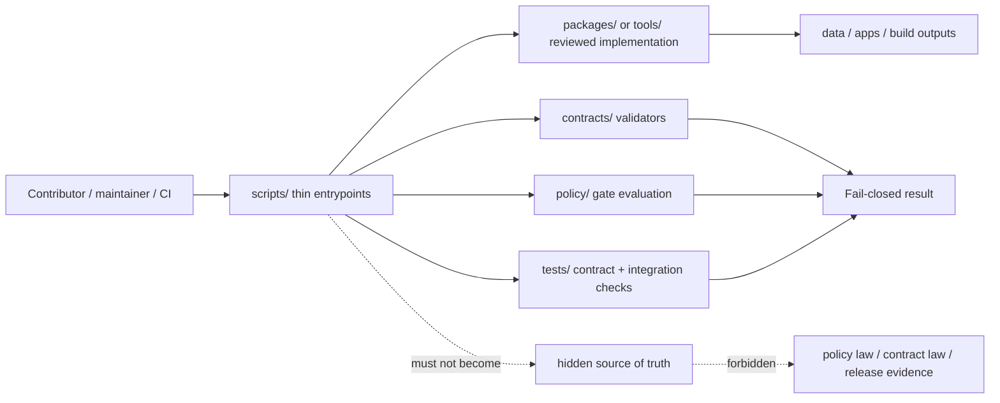

# scripts/
Repo-local helper entrypoints for repeatable KFM validation, rebuild, promotion, packaging, and operator-safe automation.

**Status:** experimental  
**Owners:** TODO(verify maintainers / release owners)  
      
**Quick jumps:** [Scope](#scope) · [Repo fit](#repo-fit) · [Accepted inputs](#accepted-inputs) · [Exclusions](#exclusions) · [Directory tree](#directory-tree) · [Quickstart](#quickstart) · [Usage rules](#usage-rules) · [Diagram](#diagram) · [Tables](#tables) · [Task list](#task-list) · [FAQ](#faq) · [Appendix](#appendix)

> [!IMPORTANT]
> This README is **evidence-bounded**.
>
> `scripts/` is a real top-level path in the repository, but KFM doctrine matters more than folder existence: scripts may help enforce the governed path, yet they must **not** quietly become the canonical home of policy, contracts, source truth, or release evidence.
>
> Read repo-shaped statements in this file as:
> - **CONFIRMED** — grounded in current repo visibility or mounted KFM doctrine
> - **PROPOSED** — repo-native implementation direction consistent with that doctrine
> - **UNKNOWN** — not established strongly enough in the current session
> - **NEEDS VERIFICATION** — owner, tool, or subpath detail that must be checked in the actual checkout

## Scope

`scripts/` is the reviewed home for **thin helper entrypoints** that make repeated KFM work safer, more consistent, and easier to run in CI or by maintainers.

That includes helpers for tasks such as:

- validation
- cross-link checking
- provenance verification
- repo hygiene
- rebuild / reindex orchestration
- promotion wrappers
- safe bootstrap flows

What it does **not** mean: this directory is not allowed to become a shadow application layer.

If a helper starts owning domain rules, policy meaning, schema law, long-lived runtime behavior, or substantial reusable logic, it should graduate into a first-class home such as `packages/`, `apps/`, `tools/`, `contracts/`, or `policy/`.

Scripts are acceptable when they are **entrypoints**. They are a problem when they become **sovereign logic**.

[Back to top](#scripts)

## Repo fit

| Field | Value |
| --- | --- |
| Path | `scripts/README.md` |
| Directory role | Repo-local helper entrypoints for validation, rebuild, promotion, packaging, and safe operator routines |
| Upstream | [`../README.md`](../README.md) · [`../docs/`](../docs/) · [`../contracts/`](../contracts/) · [`../policy/`](../policy/) · [`../configs/`](../configs/) |
| Downstream | [`../.github/`](../.github/) · [`../tests/`](../tests/) · [`../apps/`](../apps/) · [`../packages/`](../packages/) · [`../tools/`](../tools/) · [`../data/`](../data/) |
| Trust rule | `scripts/` may orchestrate, lint, validate, or verify, but it must not become the canonical owner of policy, contract law, source onboarding truth, or release evidence |
| Working posture | Keep this directory intentionally small; add helpers only when they replace repeated, reviewable manual work |

### Why this directory exists

KFM’s mounted doctrine repeatedly converges on one operational lesson: reviewable automation is good, but hidden automation is not.

A well-kept `scripts/` directory helps with that boundary by giving maintainers a visible place for:

- explicit helper entrypoints
- documented repo chores
- fail-closed validation wrappers
- deterministic rebuild and promotion helpers
- CI bootstrap steps that should remain inspectable

## Accepted inputs

The following belong in `scripts/` when they remain thin, reviewable, and repo-local.

| Category | Typical contents | Why it belongs here |
| --- | --- | --- |
| Bootstrap helpers | environment/tool bootstrap entrypoints such as CI setup wrappers | They prepare execution without becoming the policy or contract source of truth |
| Validation wrappers | shell or Python entrypoints that call catalog, evidence, or provenance validators | They make repeated checks runnable and consistent |
| Evidence / cross-link checks | checksum, receipt, cross-catalog, or citation-support helpers | They support fail-closed verification on the governed path |
| Lint / hygiene helpers | markdown, path, naming, or repo consistency checks | They keep docs and repo surfaces aligned |
| Promotion / rebuild wrappers | explicit entrypoints for rebuild, reindex, or promotion-oriented chores | They reduce operator drift when the action is repeated and documented |
| Safe local operator helpers | narrowly scoped, documented maintainer tasks with explicit inputs and outputs | They help humans do the same work the same way |

### Minimum expectations for anything added here

A new script should usually satisfy all of the following:

- it has a clear purpose
- it is callable non-interactively unless interaction is essential
- it exits non-zero on failure
- it makes destructive work explicit
- it documents inputs, outputs, and side effects
- it delegates substantial logic outward instead of hoarding it
- it is testable or at least syntax-checkable
- it does not require committed secrets

## Exclusions

The following do **not** belong in `scripts/`.

| Do not keep here | Put it instead | Why |
| --- | --- | --- |
| Long-lived service code, workers, API routes, UI behavior | `../apps/` or `../packages/` | Runtime logic should live in versioned code surfaces, not ad hoc entrypoints |
| Canonical policy bundles, registries, or reason/obligation law | `../policy/` | Governance must stay explicit and independently reviewable |
| JSON Schemas, OpenAPI files, or envelope definitions | `../contracts/` | Contract law should stay machine-readable and first-class |
| Dataset/source registry entries | `../data/` or registry-specific paths | Source onboarding is a contract, not a shell script |
| Database migrations | `../migrations/` | Schema evolution needs its own review and execution discipline |
| Release manifests, proof packs, receipts, correction notices | designated release / evidence paths | Publication evidence must not masquerade as convenience automation |
| Reusable libraries or validators with their own lifecycle | `../tools/` or `../packages/` | If it has real reuse and complexity, give it a stronger home |
| Secrets, tokens, workstation-only overrides | untracked local secret surface / secret manager | Never commit secrets into repo helper paths |

> [!WARNING]
> A script is the wrong home if removing that script would erase institutional knowledge about:
> - what is allowed
> - what is publishable
> - what a contract means
> - what a policy decision means
> - how a runtime surface is supposed to behave

## Status markers used in this README

| Marker | Meaning here |
| --- | --- |
| **CONFIRMED** | Grounded in current repo visibility or mounted KFM doctrine |
| **PROPOSED** | A repo-native implementation direction that fits that doctrine |
| **UNKNOWN** | Not established strongly enough in the current session |
| **NEEDS VERIFICATION** | Placeholder owner, path detail, invocation, or subpath that must be checked in the actual checkout |

## Directory tree

### Current working rule

Treat `scripts/` as a **reserved helper surface**, not as a promise that every subfolder below already exists.

### PROPOSED working shape

```text
scripts/
├── README.md
├── bootstrap_ci.sh              # CI/bootstrap helper named in corpus
├── catalog/                     # STAC / DCAT validation wrappers
├── evidence/                    # checksums, crosslinks, receipt checks
├── lint/                        # markdown and repo hygiene helpers
├── policy/                      # thin wrappers that call canonical policy
├── provenance/                  # fingerprint / PROV validation helpers
├── promote/                     # explicit promotion / release entrypoints
└── rebuild/                     # deterministic rebuild / reindex helpers
```

The important separation of concerns is:

- `scripts/` for **thin entrypoints**
- `packages/` or `tools/` for **reusable implementation**
- `contracts/` for **schema and envelope law**
- `policy/` for **governance rules**
- `tests/` for **assertions about behavior**
- release / evidence paths for **proof objects**

[Back to top](#scripts)

## Quickstart

Use this sequence before adding or editing a helper.

1. Inspect the current directory, not the imagined one.
2. Find every caller before changing behavior.
3. Decide whether the change belongs in `scripts/` at all.
4. Prefer the smallest wrapper that keeps semantics explicit.
5. Re-run syntax, lint, and relevant validation before merge.

```bash
# 1) Inspect the current helper surface.
find scripts -maxdepth 3 -type f 2>/dev/null | sort

# 2) Discover where repo docs, CI, or tests already reference scripts.
grep -R "scripts/" .github docs tests configs contracts 2>/dev/null || true

# 3) Syntax-check common script types when present.
find scripts -type f -name "*.sh" -print0 2>/dev/null | xargs -0 -r -n1 bash -n
find scripts -type f -name "*.py" -print0 2>/dev/null | xargs -0 -r -n1 python -m py_compile

# 4) Review the first lines of human-facing entrypoints.
find scripts -maxdepth 2 -type f \( -name "*.sh" -o -name "*.py" \) \
  -exec sh -c 'echo "---- $1"; sed -n "1,20p" "$1"' _ {} \;
```

Illustrative header pattern for a small shell entrypoint:

```bash
#!/usr/bin/env bash
set -euo pipefail

# Purpose: verify one governed KFM artifact lane.
# Inputs: explicit flags or paths only.
# Output: non-zero exit on failure.
# Side effects: none unless explicitly documented below.
```

## Usage rules

### 1) Keep scripts thin

A good script usually does one of four things:

- parse explicit inputs
- call reviewed tools or package code
- normalize repeated invocation patterns
- convert failure into a clear exit status

It should **not** become the hidden place where the real system behavior lives.

### 2) Make destructive work explicit

If a helper can mutate, publish, rebuild, delete, promote, overwrite, or invalidate anything meaningful, require one or more of:

- explicit path arguments
- explicit target identifiers
- dry-run mode
- clear operator acknowledgement
- machine-readable logs or receipts where appropriate

Silent mutation is the opposite of KFM’s evidence posture.

### 3) Prefer parameterization over machine folklore

Do not bury assumptions such as:

- hostnames
- local absolute paths
- unpublished dataset IDs
- one-person workstation defaults
- credentials
- one-off branch names

Use flags, environment variables, documented defaults, or checked-in examples instead.

### 4) Emit evidence-friendly outputs

For scripts that verify or transform anything on the governed path, prefer outputs that can be inspected later:

- explicit success / failure exit codes
- stable stdout messages
- file paths written deterministically
- dataset/version identifiers echoed clearly
- digests, run IDs, or manifest references when relevant

### 5) Graduate on complexity

Move a helper out of `scripts/` when it starts to need any of the following:

- shared internal modules
- unit tests beyond smoke checks
- runtime service ownership
- schema or policy semantics
- non-trivial state management
- wider reuse than a repo-local entrypoint deserves

A thin wrapper can stay here. A subsystem should not.

### 6) Keep docs and callers aligned

When invocation changes, update the same change stream that touches:

- `.github/` workflows
- docs and runbooks
- examples
- tests
- sibling READMEs that point to the helper

## Diagram


```mermaid
flowchart LR
    A[Contributor / maintainer / CI] --> B[scripts/ thin entrypoints]
    B --> C[packages/ or tools/ reviewed implementation]
    B --> D[contracts/ validators]
    B --> E[policy/ gate evaluation]
    B --> F[tests/ contract + integration checks]
    C --> G[data / apps / build outputs]
    D --> H[Fail-closed result]
    E --> H
    F --> H
    B -. must not become .-> I[hidden source of truth]
    I -. forbidden .-> J[policy law / contract law / release evidence]
```

## Tables

### Lane map

| Lane | Typical role | Preferred pattern | Must not own |
| --- | --- | --- | --- |
| `bootstrap_ci.sh` | prepare CI/runtime prerequisites | thin shell wrapper with explicit steps | policy meaning, schema law |
| `catalog/` | STAC / DCAT validation helpers | call versioned validators | catalog truth definitions |
| `evidence/` | checksum, crosslink, receipt checks | deterministic CLI or Python entrypoints | authoritative evidence storage |
| `lint/` | repo hygiene and doc checks | fail-fast wrappers around linters | source content semantics |
| `policy/` | convenience gate entrypoints | wrappers around canonical policy bundles | policy bundles themselves |
| `provenance/` | PROV and fingerprint verification | small tools with explicit inputs | provenance vocabulary ownership |
| `promote/` | controlled promotion helpers | explicit target + dry-run-first posture | promotion policy law |
| `rebuild/` | deterministic rebuild / reindex chores | narrow orchestration wrappers | long-lived worker logic |

### Graduation rules

| Smell | Better home | Why |
| --- | --- | --- |
| multiple scripts need the same internal logic | `../packages/` or `../tools/` | shared implementation should be reusable and testable |
| script defines contract shape or response envelope meaning | `../contracts/` | canonical shape belongs in machine-readable contract surfaces |
| script defines allow/deny semantics or reason codes | `../policy/` | governance must remain explicit and reviewable |
| script behaves like a service or worker | `../apps/` | runtime ownership belongs with deployable code |
| script exists only to support tests | `../tests/` or `../tools/` | test helpers should stay near the assertions they support |

## Task list

**Definition of done for changes under `scripts/`:**

- [ ] The helper is genuinely entrypoint-sized and not secretly a subsystem
- [ ] Inputs, outputs, and side effects are documented
- [ ] Failure returns a non-zero exit code
- [ ] Destructive behavior is explicit, not implied
- [ ] Secrets are not committed and not required from tracked files
- [ ] Shared logic was moved to `packages/` or `tools/` when complexity grew
- [ ] Referenced `contracts/`, `policy/`, `tests/`, and workflow paths were checked against the actual checkout
- [ ] Docs, examples, or CI callers were updated when invocation changed
- [ ] The helper preserves KFM’s fail-closed posture instead of introducing convenience bypasses
- [ ] Placeholder owners and provisional path assumptions were verified before stabilization

## FAQ

### Why keep `scripts/` if the directory is small?

Because a small, explicit helper surface is better than repeated tribal commands spread across PR comments, local notes, or CI YAML.

### Why not put every validator here?

Because some validators are really reusable tools or package code. `scripts/` is for thin entrypoints, not for hiding durable implementation.

### Can a script call policy or contract validators?

Yes. That is one of the best uses of this directory. The script should call those surfaces, not redefine them.

### Where should secrets live?

Not here. Use the repo’s untracked local secret surface, CI secret store, or secret manager.

### When should a script move to `tools/` instead?

When it has meaningful reuse, internal modules, or a lifecycle independent of one repo-local entrypoint.

### Can a script publish directly?

Only if the publish action remains explicit, reviewed, and bounded by the same governed checks KFM expects elsewhere. Convenience is never permission to bypass promotion discipline.

## Appendix

<details>
<summary><strong>Doc-grounded script examples already named in KFM materials</strong></summary>

These examples are useful because they show the kinds of helpers the mounted corpus already expects, even if the live checkout has not yet materialized every path shown below.

```text
scripts/bootstrap_ci.sh
scripts/evidence/crosslink_consistency.py
scripts/evidence/verify_checksums.sh
scripts/catalog/validate_stac.py
scripts/catalog/validate_jsonld.sh
scripts/provenance/validate_prov.py
scripts/provenance/verify_fingerprint.py
scripts/lint/md_required_sections.sh
scripts/policy/focus_mode_gate.sh
scripts/rebuild
```

Interpret these as **doc-grounded examples**, not as a claim that every file already exists in the live repo.

</details>

<details>
<summary><strong>Authoring notes for maintainers</strong></summary>

Keep wording stable with current KFM doctrine:

- governed path
- trust membrane
- authoritative versus derived
- cite-or-abstain
- fail-closed
- docs as production surface
- evidence-linked public claims

Prefer:

- explicit placeholders over invented values
- small helpers over sprawling shell frameworks
- relative links over hard-coded repo URLs
- wrappers around reviewed code instead of hidden business logic

</details>

[Back to top](#scripts)# scripts

This directory is intentionally kept in the repository, even when empty.
