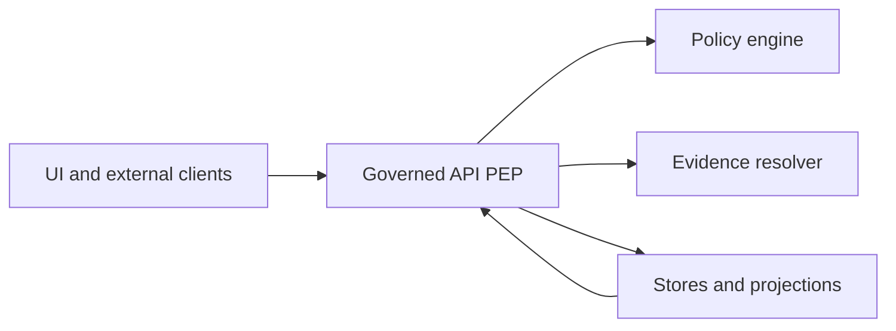

<!-- [KFM_META_BLOCK_V2]
doc_id: kfm://doc/9f9a88f5-4dd7-4ae9-8b64-5310a2b1f7fd
title: scripts/README.md
type: standard
version: v1
status: draft
owners: TBD (add CODEOWNERS rule)
created: 2026-02-26
updated: 2026-03-02
policy_label: public
related:
  - kfm://doc/<TBD>  # TODO: link to in-repo KFM governance/design guide (truth path, promotion contract, trust membrane)
  - kfm://doc/<TBD>  # TODO: link to in-repo pipeline/tooling guide (validators, policy gates, receipts)
tags:
  - kfm
  - scripts
  - ops
  - governance
notes:
  - This README documents conventions and governance expectations for scripts.
  - This README is a governed directory contract; keep Confirmed vs Proposed vs Unknown explicit.
  - 2026-03-02: upgraded contract language + added gate alignment notes, registry/receipt contract, and verification checklist.
[/KFM_META_BLOCK_V2] -->

<a id="top"></a>

# `scripts/` — Governed operational scripts

Operational scripts for KFM ingestion/orchestration, validation, cataloging, indexing, and maintenance — **receipt‑emitting, deterministic, and fail‑closed**.


> [!IMPORTANT]
> In KFM, **scripts are governed operations**.
> If a script can change what users see (directly or indirectly), it must be:
> **scope‑controlled**, **receipt‑emitting**, and **fail‑closed**.

> [!WARNING]
> **Do not** treat “it ran on my machine” as success.
> If evidence (catalog links, digests, policy decisions, receipts) is missing or unverifiable, scripts must **abstain** or **quarantine**.

---

## Quick navigation

- [Legend and truth discipline](#legend-and-truth-discipline)
- [Purpose](#purpose)
- [What counts as a script](#what-counts-as-a-script)
- [Non-negotiables](#non-negotiables)
- [Where this fits in the system](#where-this-fits-in-the-system)
- [Truth path and lifecycle zones](#truth-path-and-lifecycle-zones)
- [Promotion contract](#promotion-contract)
- [Directory contract](#directory-contract)
- [Directory layout](#directory-layout)
- [Run receipts](#run-receipts)
- [Policy gates](#policy-gates)
- [Conventions](#conventions)
- [Adding a new script](#adding-a-new-script)
- [Script registry](#script-registry)
- [Minimum verification steps](#minimum-verification-steps)
- [Troubleshooting](#troubleshooting)
- [Appendix](#appendix)

---

## Legend and truth discipline

This README intentionally separates claims:

| Label | Meaning | How to treat it |
|---|---|---|
| **Confirmed** | Backed by KFM governance/briefing artifacts or verified repo tree | Use as policy/CI blocking rules |
| **Proposed** | A recommended pattern that improves safety/reproducibility | Safe to adopt, but don’t claim it exists |
| **Unknown** | Repo-specific (paths, tools, CI gates) not verified here | Must be verified or treated fail‑closed |

> [!NOTE]
> When editing this README: **never silently “upgrade” Unknown → Confirmed** without attaching evidence (tree output, workflow listing, schema paths, etc.).

[Back to top](#top)

---

## Purpose

This directory exists for **operational scripts** that:

- snapshot upstream sources into the **Truth Path** (Upstream → RAW → WORK/QUARANTINE → PROCESSED → CATALOG/TRIPLET → PUBLISHED),
- normalize and validate datasets (QA + schema + geo/time checks),
- generate/validate catalogs (DCAT/STAC/PROV) and cross-links,
- build **rebuildable projections** (search/graph/tiles/indexes) from canonical artifacts,
- run maintenance tasks (linting, audits, migrations) **without bypassing governance**.

> [!TIP]
> Prefer **thin scripts / fat libraries**:
> - Put core logic in versioned libraries/use‑cases (domain + validators + catalog builders).
> - Keep scripts as deterministic orchestration wrappers.

[Back to top](#top)

---

## What counts as a script

**Confirmed intent:** `scripts/` is for operational automation such as build/release/promotion and other governed orchestration. Validators and reusable utilities typically belong in `tools/`, and migrations belong in `migrations/`. (Exact subtrees are repo‑specific; verify in the live repo.)

### A practical boundary

- **Script** = a runnable entrypoint that orchestrates a governed operation and emits a receipt.
- **Tool** = a reusable validator/utility invoked by scripts and CI.
- **Library** = domain/use‑case code imported by scripts and services.

> [!IMPORTANT]
> If a script writes into RAW/PROCESSED/CATALOG/PUBLISHED, it must:
> - declare zones touched,
> - emit receipts + digests,
> - and pass promotion gates or route through a promotion runner.

[Back to top](#top)

---

## Non-negotiables

Scripts must preserve these KFM invariants:

- **Truth Path** is enforced with lifecycle zones and promotion gates (no silent drift; reproducible runs).
- **Promotion Contract** blocks publishing unless minimum gates are satisfied (**fail‑closed**).
- **Trust membrane**: UI/clients never access stores directly; policy enforced at the governed API PEP boundary.
- **Catalog triplet** (DCAT + STAC + PROV) is the evidence surface; links must resolve deterministically.
- **Cite‑or‑abstain**: if evidence cannot be verified, the system must abstain or reduce scope.

> [!WARNING]
> Any script that mutates canonical storage without receipts, checksums/digests, or provenance breaks auditability and must be treated as a governance incident.

[Back to top](#top)

---

## Where this fits in the system

Scripts execute *inside* the KFM Truth Path. They must not bypass enforcement boundaries.


```mermaid
flowchart LR
  U[Upstream sources] --> A[Acquire scripts]
  A --> R[RAW zone]
  R --> T[Transform scripts]
  T --> W[WORK and QUARANTINE zone]
  W --> P[PROCESSED zone]
  P --> C[Catalog scripts]
  C --> K[CATALOG TRIPLET]
  K --> I[Index scripts]
  I --> X[Rebuildable projections]
  X --> S[PUBLISHED runtime]
  S --> API[Governed API PEP]
  API --> UI[Map Story Focus UI]
```

### Trust membrane reminder

- UI/external clients **must not** access DB/object storage directly.
- Scripts must not create “side channels” (e.g., copying restricted artifacts into public outputs).
- Enforcement is owned by **governed APIs** and promotion gates; scripts must **invoke** those mechanisms, not replace them.


```mermaid
flowchart LR
  Client[UI and external clients] --> PEP[Governed API PEP]
  PEP --> Policy[Policy engine]
  PEP --> Evidence[Evidence resolver]
  PEP --> Stores[Stores and projections]
  Stores --> PEP
```

[Back to top](#top)

---

## Truth path and lifecycle zones

Scripts must respect lifecycle zones and mutability rules.

| Zone | Typical contents | Script rules of the road |
|---|---|---|
| RAW | raw artifacts (original files/API responses), license/terms snapshot, checksums/digests, acquisition manifest | **Append‑only**. Never edit in place; supersede via new acquisition. |
| WORK | normalized intermediates, QA reports, redaction/generalization candidates | Regeneratable; can be rewritten; must record reasons and inputs. |
| QUARANTINE | failed validation, unclear licensing, sensitivity concerns, unreproducible upstream | **Blocks promotion**. Requires remediation evidence to exit. |
| PROCESSED | publishable artifacts in KFM‑approved formats + digests | Deterministic; digest‑addressed; no “hand fixes” without provenance. |
| CATALOG/TRIPLET | cross‑linked DCAT + STAC + PROV + run receipts + release references | Must validate + cross‑link; this is the evidence surface. |
| PROJECTIONS | search/graph/tiles/db indexes | **Rebuildable only**; never treated as source truth. |
| PUBLISHED | governed runtime surfaces (API + UI) serving promoted versions only | Nothing reaches runtime without passing gates; errors/logs must remain policy‑safe. |

> [!WARNING]
> A script that writes “public outputs” must never read from restricted artifacts unless policy explicitly allows and obligations are applied.

[Back to top](#top)

---

## Promotion contract

Promotion is fail‑closed: a dataset version must not reach **PUBLISHED** unless minimum gates are satisfied.

> [!IMPORTANT]
> Promotion gates apply at each transition.
> The CATALOG/TRIPLET must cross‑link identifiers so **EvidenceRefs resolve** without guessing.

### Promotion contract v1 gates

| Gate | What must be present | Script implications |
|---|---|---|
| **A — Identity and versioning** | `dataset_id`, `dataset_version_id`, deterministic `spec_hash`, content digests | Compute + verify digests; store IDs in receipts and catalogs. |
| **B — Licensing and rights metadata** | license/rights fields + snapshot of upstream terms | Snapshot terms; fail‑closed if unclear; quarantine when needed. |
| **C — Sensitivity classification and redaction plan** | `policy_label` + obligations when needed | Apply obligations; avoid leaking restricted info in logs/receipts. |
| **D — Catalog triplet validation** | DCAT/STAC/PROV validate and cross‑link; EvidenceRefs resolve | Schema‑validate + link‑check deterministically. |
| **E — QA and thresholds** | dataset‑specific QA checks + documented thresholds | Emit QA report; failures route to QUARANTINE. |
| **F — Run receipt and audit record** | run receipt capturing inputs/tooling/hashes/policy decisions; append‑only audit record | Every artifact‑writing script emits receipts; treat audit as append‑only. |
| **G — Release manifest** | promotion recorded as a release manifest referencing artifacts + digests | Write a manifest tying IDs, digests, catalogs, QA, and approvals. |

> [!NOTE]
> If any gate cannot be evaluated (missing evidence, missing policy pack, missing fixtures), **fail closed**.

### Gate alignment note

Different KFM briefs may label Gate E/F/G differently.
This README uses the **“A–G with QA + release manifest”** framing because it is CI‑friendly.
If another doc defines Gate E as “run receipt + checksums” and Gate F as “policy + contract tests”, treat that as:
- **Run receipt + checksums** ⇒ must still be satisfied (here covered by **A/F/G**),
- **Policy + contract tests** ⇒ must still be satisfied (here enforced as part of **C/D/F** and CI requirements),
- “Optional” items ⇒ keep as best‑practice posture, but do not weaken default‑deny.

[Back to top](#top)

---

## Directory contract

### What belongs here

✅ Put these here:

- **Acquire scripts**: upstream snapshot → RAW (append‑only), including terms snapshot + digests.
- **Transform scripts**: RAW/WORK → WORK/PROCESSED, producing QA outputs and digests.
- **Validate scripts**: schema validation, link checking, promotion gate checks, policy fixture checks.
- **Catalog scripts**: generate/validate DCAT/STAC/PROV and cross‑links; emit receipts.
- **Index scripts**: rebuild DB/search/graph/tiles from canonical artifacts (never from “mystery inputs”).
- **Maintenance scripts**: migrations/backfills only when **reversible** and **receipt‑emitting**.

### What must not go here

🚫 Do not put these here:

- secrets (API keys, tokens, service‑account JSON, kubeconfigs),
- raw datasets or large artifacts (store in governed zones; don’t commit to git),
- one‑off scripts that aren’t reproducible or reviewed,
- scripts that bypass policy enforcement,
- scripts that print restricted coordinates/PII into logs or receipts.

> [!TIP]
> If it would be unsafe to paste into a public issue, it doesn’t belong in `scripts/` outputs (logs, receipts, examples).

[Back to top](#top)

---

## Directory layout

> [!IMPORTANT]
> This section is the **target contract**.
> After changes, run `tree -L 2 scripts/` and update this README and the Script Registry.

```text
scripts/
├─ README.md
│
├─ registry/
│  ├─ scripts.v1.json
│  ├─ scripts.lock.json                      # optional (digests/spec hashes for registry + schemas)
│  ├─ schemas/
│  │  ├─ scripts_registry.v1.schema.json
│  │  ├─ run_receipt.v1.schema.json
│  │  └─ promotion_manifest.v1.schema.json
│  ├─ fixtures/
│  │  ├─ valid/
│  │  └─ invalid/
│  └─ README.md
│
├─ acquire/
├─ transform/
├─ validate/
├─ catalog/
├─ index/
├─ maintenance/
├─ lib/
└─ _shared/
```

[Back to top](#top)

---

## Run receipts

Every script that produces artifacts **must** emit a run receipt that makes the run reproducible and auditable.

### Receipt rules

- Enumerate **inputs and outputs** with digests/checksums.
- Record enough environment detail to reproduce the run (prefer container image digests).
- Include policy outcomes (decision + obligations + reason codes) when relevant.
- Never store secrets, raw restricted coordinates, or PII in receipts.
- Treat audit trails as **append‑only**.

### Recommended placement

- Promotion‑affecting runs (catalog/prov/publish): co‑locate near catalog artifacts for the dataset version.
- Work‑stage runs: co‑locate under the work run directory.

> [!NOTE]
> Exact paths are repo‑specific. The invariant is: **discoverable, deterministic location** and cross‑linked from catalogs/provenance when promotion is involved.

<details>
<summary><strong>Minimal receipt shape</strong></summary>

```json
{
  "@type": "prov:run_receipt",
  "run_id": "kfm://run/2026-03-02T12:00:00Z.abcd",
  "actor": { "principal": "svc:pipeline", "role": "pipeline" },
  "operation": "acquire|transform|validate|catalog|index|maintenance",

  "dataset_id": "example_dataset",
  "dataset_version_id": "2026-03.abcd1234",
  "spec_hash": "sha256:...",

  "created_at": "2026-03-02T12:05:00Z",

  "inputs": [
    { "uri": "data/raw/example_dataset/<acq_id>/artifacts/source.csv", "digest": "sha256:..." }
  ],
  "outputs": [
    { "uri": "data/processed/example_dataset/<dataset_version_id>/events.parquet", "digest": "sha256:..." },
    { "uri": "data/processed/example_dataset/<dataset_version_id>/qa/report.json", "digest": "sha256:..." }
  ],

  "environment": {
    "container_digest": "sha256:img...",
    "git_commit": "deadbeef",
    "params_digest": "sha256:..."
  },

  "validation": {
    "status": "pass",
    "checks": [
      { "id": "schema.validate", "status": "pass" },
      { "id": "geo.bounds", "status": "pass" }
    ]
  },

  "policy": {
    "decision_id": "kfm://policy_decision/xyz",
    "policy_label": "public",
    "obligations_applied": [],
    "reason_codes": ["POLICY.ALLOW.PUBLIC.READ"]
  },

  "notes": "Optional human context. Must be policy-safe."
}
```

</details>

[Back to top](#top)

---

## Policy gates

Policy gates are how governance intent becomes enforceable behavior. Scripts should run gates locally when practical, and CI must run them pre‑merge.

> [!IMPORTANT]
> If a policy gate cannot be evaluated (missing policy pack, fixtures, evidence), **fail closed**.

### Local receipt gate pattern

1) Run script → emits `receipt.json`  
2) Validate receipt schema (JSON Schema)  
3) Evaluate policy pack (deny‑by‑default) over the receipt and/or manifests

```bash
# Illustrative only. Replace with real repo commands once verified.
conftest test receipt.json -p policy/opa
```

[Back to top](#top)

---

## Conventions

### Script interface

All scripts should:

- be runnable from the repo root,
- support `--help`,
- support `--dry-run` when meaningful,
- exit non‑zero on failure,
- write human logs to stderr; write machine outputs to files.

### Determinism

Prefer deterministic outputs:

- same inputs + same parameters ⇒ same outputs + same digests,
- avoid embedding timestamps in artifacts unless domain‑required (timestamps belong in receipts),
- use stable ordering when writing JSON (canonical JSON if used for hashing).

### Safety defaults

- Default‑deny when licensing/sensitivity is unclear.
- Never print restricted coordinates/attributes into logs or receipts.
- If a required gate cannot be evaluated, **fail closed** and emit a remediation path.

### Idempotency and rollback

- Prefer idempotent scripts keyed by `spec_hash` (or equivalent).
- If non‑idempotent: document rollback (and test rollback if possible).

[Back to top](#top)

---

## Adding a new script

Keep changes small, reviewable, and governed:

- [ ] Script has a clear purpose statement and stable name.
- [ ] Core logic lives in libraries/use‑cases; script is orchestration‑only where possible.
- [ ] Inputs and outputs are explicit (paths/URIs + formats).
- [ ] Script writes only to the correct zone(s).
- [ ] Script emits a run receipt and output digests.
- [ ] Script is idempotent or documents rollback.
- [ ] Script does not embed or print secrets.
- [ ] Script does not leak restricted information (including “restricted existence” inference).
- [ ] If script affects promotion/publishing, it runs required gates or routes via a promotion runner.
- [ ] Add an entry to the Script Registry (`scripts/registry/scripts.v1.json`).
- [ ] Add/adjust CODEOWNERS so scripts are reviewed by the right stewards.

### Script header template

```text
Purpose:
Inputs:
Outputs:
Zones touched:
Promotion gates impacted:
Policy considerations:
Receipt path:
Rollback (if non-idempotent):
Owner:
```

[Back to top](#top)

---

## Script registry

To keep scripts discoverable and reviewable, maintain a machine‑readable registry.

- **Registry file (target):** `scripts/registry/scripts.v1.json`
- **Rule:** if a script exists, it must be registered with an owner and declared zones.

### Recommended registry fields

- `script_id` (stable)
- `path`
- `kind` (`acquire|transform|validate|catalog|index|maintenance`)
- `owner`
- `zones_touched[]`
- `requires_receipt` (true/false; default true for zone‑writing scripts)
- `supports_dry_run` (true/false)
- `policy_sensitive` (true/false; triggers steward review)
- `spec_hash_required` (true/false; required for RAW/PROCESSED/CATALOG/PUBLISHED touching scripts)
- `notes` (policy‑safe)

<details>
<summary><strong>Example registry entry</strong></summary>

```json
{
  "script_id": "catalog_build_triplet",
  "path": "scripts/catalog/catalog_build_triplet.py",
  "kind": "catalog",
  "owner": "team:governance",
  "zones_touched": ["catalog"],
  "requires_receipt": true,
  "supports_dry_run": true,
  "policy_sensitive": true,
  "spec_hash_required": true,
  "notes": "Generates DCAT/STAC/PROV + linkcheck. Writes receipts."
}
```

</details>

> [!NOTE]
> Registry content must remain policy‑safe. Do not encode sensitive dataset details in registry entries.

[Back to top](#top)

---

## Minimum verification steps

Use this “smallest acceptable” checklist when changing scripts that touch the truth path:

- [ ] Capture repo commit hash and scripts subtree: `git rev-parse HEAD` + `tree -L 3 scripts/`
- [ ] Registry validates (JSON Schema) and every script path is registered
- [ ] If the change produces artifacts: receipt exists, validates, and includes digests + `spec_hash`
- [ ] Catalog changes pass schema validation + linkcheck (DCAT/STAC/PROV)
- [ ] Policy gates run (deny‑by‑default) and pass for intended policy label(s)
- [ ] If promotion/publishing is involved: release manifest produced and cross‑linked

[Back to top](#top)

---

## Troubleshooting

### It ran, but I can’t reproduce the output

- Confirm a run receipt exists and includes exact inputs/outputs + digests.
- Confirm environment pinning (container digest / tool versions) is present.
- Confirm the same spec/config inputs (and `spec_hash`) were used.

### Why did it fail closed

Common causes:

- missing or unclear license/rights metadata,
- missing policy label or unresolved sensitivity classification,
- catalog triplet schema/linkcheck failures,
- missing digests, receipts, or release manifest required by promotion gates,
- QA thresholds not met → quarantine,
- policy gate failures.

### How do I know it is safe to run

- It should be receipt‑emitting, deterministic, and scoped to specific zones.
- If it touches published surfaces, it must be gated by promotion checks and produce policy‑safe errors.

[Back to top](#top)

---

## Appendix

### Controlled vocabulary reminders

Keep controlled vocabularies versioned and referenced from schemas/policies (repo‑specific).

- Example `policy_label` starter set:
  - `public`, `public_generalized`, `restricted`, `restricted_sensitive_location`, `internal`, `embargoed`, `quarantine`
- Example `artifact.zone` starter set:
  - `raw`, `work`, `processed`, `catalog`, `published`

### Glossary

- **EvidenceRef**: a stable reference that resolves to an EvidenceBundle via the evidence resolver.
- **EvidenceBundle**: policy‑filtered evidence cards + artifacts + digests suitable for UI/Focus Mode.
- **spec_hash**: deterministic hash representing the “exact run spec” used to produce artifacts.
- **Promotion**: the governed act of moving a dataset version through gates into runtime surfaces.

[Back to top](#top)
