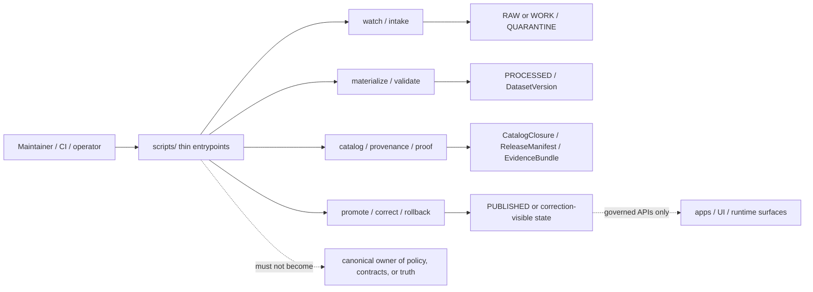

<!-- [KFM_META_BLOCK_V2]
doc_id: kfm://doc/TODO-VERIFY-UUID
title: scripts/
type: standard
version: v1
status: draft
owners: TODO(verify maintainers / release owners)
created: TODO(verify-created-date)
updated: 2026-03-21
policy_label: TODO(verify-policy-label)
related: [TODO(verify: ../README.md), TODO(verify: ../docs/), TODO(verify: ../tools/), TODO(verify: ../tests/), TODO(verify: ../policy/), TODO(verify: ../contracts/)]
tags: [kfm, scripts, automation, validation, promotion, evidence]
notes: [Current-session verification found only PDF corpus and no mounted repo tree; exact owners, doc_id, created date, policy label, related links, and live paths need checkout verification]
[/KFM_META_BLOCK_V2] -->

# scripts/

Repo-local entrypoints for repeatable, reviewable, fail-closed KFM validation, evidence assembly, promotion support, rollback support, and operator-safe automation.

**Status:** experimental  
**Owners:** TODO(verify maintainers / release owners)  
      
**Quick jumps:** [Scope](#scope) · [Repo fit](#repo-fit) · [Accepted inputs](#accepted-inputs) · [Exclusions](#exclusions) · [Truth labels](#truth-labels-used-here) · [Directory tree](#directory-tree) · [Quickstart](#quickstart) · [Usage](#usage) · [Diagram](#diagram) · [Reference tables](#reference-tables) · [Task list](#task-list) · [FAQ](#faq) · [Appendix](#appendix)

> [!IMPORTANT]
> This README is **evidence-bounded**.
>
> The March 2026 KFM corpus is strong on `scripts/` doctrine, target responsibilities, governance posture, and proof-bearing expectations. The current revision did **not** have a mounted repository checkout, workflow inventory, or runtime logs. Treat exact paths, owners, filenames, and neighbor-directory presence here as **PROPOSED** or **NEEDS VERIFICATION** unless the checked-out repo confirms them.

## Scope

`scripts/` is where KFM turns governed intent into **repeatable entrypoints**.

This directory is the repo-local home for thin helpers that make validation, evidence assembly, catalog closure, release checks, correction drills, smoke checks, and documentation gates easier to run the same way every time. It is useful precisely because it is **not** the place where durable system law should quietly accumulate.

In practical terms, `scripts/` is a good home for:

- deterministic wrappers around already-owned logic
- fail-closed checks
- reviewable operator workflows
- CI-friendly transition helpers
- thin automation that emits proof objects, receipts, or machine-checkable failures

It is the wrong home for policy semantics, canonical contract law, or hidden business meaning.

> [!TIP]
> A strong rule of thumb is simple:
>
> `scripts/` should expose a governed lane, not become the lane's sovereign owner.

Two operating principles follow from that:

1. Keep durable meaning in stronger surfaces such as `contracts/`, `policy/`, `packages/`, `apps/`, and governed APIs.
2. Use `scripts/` to expose reviewed transitions and checks, not to smuggle system law into shell glue.

[Back to top](#scripts)

## Repo fit

| Field | Value |
| --- | --- |
| Target file | `scripts/README.md` |
| Directory role | Thin, reviewable entrypoints for governed validation, evidence assembly, promotion support, rollback or correction support, and operator-safe automation |
| Repo position | Top-level helper/orchestration surface in the **documented target skeleton** |
| Upstream context | [`../README.md`](../README.md) · [`../docs/`](../docs/) · [`../policy/`](../policy/) · [`../contracts/`](../contracts/) *(documented target neighbors; verify in checkout)* |
| Downstream callers or dependents | [`../.github/`](../.github/) · [`../tests/`](../tests/) · [`../tools/`](../tools/) · [`../data/`](../data/) *(documented target neighbors; verify in checkout)* |
| Stronger homes for durable logic | [`../packages/`](../packages/) · [`../apps/`](../apps/) · [`../contracts/`](../contracts/) · [`../policy/`](../policy/) *(documented target neighbors; verify in checkout)* |
| Governing trust rule | `scripts/` may orchestrate, validate, verify, lint, assemble evidence, or reconcile state; it must not become the canonical owner of contract law, policy law, or public truth |
| Current verification boundary | PDF corpus plus direct current-session filesystem inspection; no mounted KFM repo tree, workflow YAML, manifests, tests, dashboards, or runtime logs were directly visible |

## Accepted inputs

The following belong in `scripts/` **when they remain thin entrypoints**.

| Family | Typical contents | Keep it here when |
| --- | --- | --- |
| Bootstrap / environment / local bring-up | `bootstrap_ci.sh`, environment sanity checks, bounded local proof helpers | The script establishes a safe execution surface without owning long-lived runtime behavior |
| Source onboarding / watcher / intake wrappers | descriptor-aware fetchers, watermark/spec-hash helpers, bounded ingest wrappers | The script detects or acquires change and emits receipts instead of silently publishing |
| Transformation / normalization / packaging | deterministic build wrappers, materializers, export packagers | The heavy logic lives elsewhere and the script exists to make a governed lane repeatable |
| Validation / QA / policy / verification | schema checks, catalog checks, compatibility checks, policy wrappers | The script turns gates into explicit, deny-by-default entrypoints |
| Catalog / provenance / evidence assembly | cross-link checks, digest verification, closure builders, release-support emitters | The script assembles or verifies trust-bearing proof objects rather than redefining them |
| Projection / search / vector / graph / export refresh | rebuild wrappers for tiles, search, graph, vectors, export sidecars | Outputs are explicitly derived, freshness-linked, and rebuildable |
| Release / promotion / rollback / correction | release-evidence assembly, signed promotion helpers, rollback drills, correction/tombstone helpers | The script participates in governed trust-state change and preserves lineage |
| Runtime ops / health / audit / reconciliation | smoke tests, canary checks, audit emitters, reconciliation helpers | The governed API remains the only trust-visible public entrypoint |
| CI/CD / PR / release control | merge-gate wrappers, attest/verify steps, post-deploy checks | The helper proves or gates promotion rather than hiding review |
| Local model/runtime and Focus helpers | local-only model wrappers, contract-bound inference helpers, runtime boundary checks | Execution stays private-first and subordinate to evidence, policy, and governed APIs |
| Docs / build / report / export helpers | docs gates, README checks, report builders, evidence-viewer helpers | The helper changes release trust or reviewability and therefore belongs in governed machinery |

### Minimum bar for anything added here

A new helper should usually satisfy all of the following:

- it has one clear purpose
- it runs non-interactively unless interaction is truly required
- it exits non-zero on failure
- it documents inputs, outputs, and side effects
- it emits machine-readable evidence when it changes trust state
- it keeps destructive work explicit
- it does not require committed secrets

## Exclusions

The following do **not** belong in `scripts/`.

| Do not keep here | Better home | Why |
| --- | --- | --- |
| Long-lived service code, workers, route handlers, UI logic | [`../apps/`](../apps/) or [`../packages/`](../packages/) | Runtime ownership belongs with deployable or reusable code, not with ad hoc entrypoints |
| Canonical contracts, JSON Schemas, OpenAPI, registry definitions | [`../contracts/`](../contracts/) | Contract law should stay first-class and machine-checkable |
| Policy bundles, reason codes, obligation codes, review-class rules | [`../policy/`](../policy/) | Governance should remain explicit, reviewable, and independently testable |
| Reusable validator libraries or mature CLIs | [`../tools/`](../tools/) or [`../packages/`](../packages/) | Shared implementation should graduate out of shell glue |
| Database migrations and stateful schema evolution | [`../migrations/`](../migrations/) | Migration discipline needs its own review and rollback surface |
| Secrets, tokens, workstation overrides, bind-time credentials | secret manager or untracked local secret surfaces | Never commit trust-bearing secrets into helper directories |
| Published proof packs, final manifests, or authoritative evidence stores | designated release or evidence paths | Convenience automation must not masquerade as canonical release truth |

> [!WARNING]
> If deleting a script would erase institutional knowledge about what is publishable, how policy decided, or how release evidence is reconstructed, the script is carrying too much meaning and should graduate.

## Truth labels used here

| Marker | Meaning in this README |
| --- | --- |
| **CONFIRMED** | Directly supported by the mounted March 2026 KFM corpus or direct current-session evidence |
| **INFERRED** | A conservative synthesis from multiple mounted documents, still kept below direct proof |
| **PROPOSED** | A doctrine-consistent realization, placement, or implementation pattern not verified as mounted repo reality |
| **UNKNOWN** | Not established strongly enough in the current session to present as settled fact |
| **NEEDS VERIFICATION** | A path, filename, owner, workflow, or repo-local detail that should be checked in the actual checkout before merge |

## Directory tree

### Current verification boundary

> [!NOTE]
> No live repository tree was directly visible in this revision. The inventory below is a **documented target shape**, not a mounted listing.

### Documented target shape

```text
scripts/
├── README.md
├── bootstrap_ci.sh
├── catalog/
│   ├── validate_stac.py
│   └── validate_jsonld.sh
├── evidence/
│   ├── crosslink_consistency.py
│   └── verify_checksums.sh
├── lint/
│   └── md_required_sections.sh
├── policy/
│   └── focus_mode_gate.sh
├── provenance/
│   ├── validate_prov.py
│   └── verify_fingerprint.py
├── release/      # PROPOSED family; exact presence NEEDS VERIFICATION
├── rollback/     # PROPOSED family; exact presence NEEDS VERIFICATION
└── runtime/      # PROPOSED family; exact presence NEEDS VERIFICATION
```

### How to read this tree

The explicit filenames above are **document-grounded examples already named in the mounted corpus**. They are useful because they show what the project expects this surface to do.

A practical reading is:

- `catalog/`, `evidence/`, `policy/`, and `provenance/` hold fail-closed gate entrypoints
- `bootstrap_ci.sh` establishes a reproducible CI or local proof baseline
- `lint/` keeps docs and README surfaces from drifting away from behavior
- `release/`, `rollback/`, and `runtime/` are kept visible here only as **plausible family destinations**; their actual mounted presence still needs checkout verification

Additional placements outside `scripts/` also appear in the corpus — including `.github/workflows/*`, `policy/*`, `data/**`, and app/runtime surfaces — but those remain neighboring signals, not proof that the live repo currently contains them.

[Back to top](#scripts)

## Quickstart

Use this sequence before adding, renaming, or deleting a helper.

1. Verify that `scripts/` exists in the checkout you are actually changing.
2. Find every caller before moving or renaming an entrypoint.
3. Decide whether the work belongs in `scripts/` at all.
4. Syntax-check the helper types you touched.
5. Re-run the relevant validation, promotion, or runtime checks before merge.

```bash
# 1) Confirm the directory exists before assuming any shape.
test -d scripts && find scripts -maxdepth 3 -type f | sort || echo "scripts/ not present in this checkout"

# 2) Find likely callers without assuming every neighbor exists.
for d in .github docs tests tools policy contracts data apps packages; do
  [ -d "$d" ] && grep -R --line-number "scripts/" "$d" || true
done

# 3) Syntax-check common helper types when present.
find scripts -type f -name "*.sh" -print0 2>/dev/null | xargs -0 -r -n1 bash -n
find scripts -type f -name "*.py" -print0 2>/dev/null | xargs -0 -r -n1 python -m py_compile

# 4) Review entrypoints before changing behavior.
find scripts -maxdepth 2 -type f \( -name "*.sh" -o -name "*.py" \) \
  -exec sh -c 'echo "---- $1"; sed -n "1,40p" "$1"' _ {} \;
```

Illustrative shell header for a thin entrypoint:

```bash
#!/usr/bin/env bash
set -euo pipefail

# Purpose: one governed transition helper.
# Inputs: explicit flags or paths only.
# Output: non-zero exit on failure.
# Side effects: state changes must be documented below.
```

## Usage

### Documented target gate lane

The mounted corpus already names a compact verification lane for a dataset or release candidate. Treat the sequence below as a **documented target flow** whose exact mounted paths still need checkout verification.

```bash
scripts/bootstrap_ci.sh

scripts/evidence/verify_checksums.sh \
  data/processed/<theme>/<dataset>/<version> \
  SHA256SUMS.txt

scripts/catalog/validate_stac.py \
  data/catalog/stac/items/<dataset>__<version>.json

scripts/catalog/validate_jsonld.sh \
  data/catalog/dcat/datasets/<dataset>__<version>.jsonld

scripts/provenance/validate_prov.py \
  data/catalog/prov/<dataset>__<version>.prov.json

scripts/evidence/crosslink_consistency.py \
  --stac data/catalog/stac/items/<dataset>__<version>.json \
  --dcat data/catalog/dcat/datasets/<dataset>__<version>.jsonld \
  --prov data/catalog/prov/<dataset>__<version>.prov.json \
  --manifest data/processed/<theme>/<dataset>/<version>/manifest.json

scripts/policy/focus_mode_gate.sh \
  data/catalog/{stac,dcat}/**/* \
  <dataset>__<version>
```

### Operating rules

#### 1) Keep scripts thin

A good script parses explicit inputs, delegates durable logic outward, normalizes a repeated invocation pattern, and returns a clear exit status. It should not become the hidden place where the real product rules live.

#### 2) Make destructive work unmistakable

If a helper can mutate, publish, overwrite, promote, withdraw, or rebuild anything consequential, require explicit target identifiers, document side effects, and prefer a dry-run mode when feasible.

#### 3) Prefer parameterization over workstation folklore

Do not bury workstation-only paths, hostnames, unpublished dataset IDs, or one-person conventions in helper code. Use flags, environment variables, checked-in examples, or documented defaults instead.

#### 4) Emit evidence-friendly outputs

When a helper crosses a trust boundary, it should produce stable IDs, run manifests or receipts where relevant, validation reports, and enough linkage to reconstruct what happened later.

#### 5) Keep derived work visibly derived

Projection refresh, export packaging, and index rebuild scripts should prove freshness and release linkage. They must not quietly become authoritative truth by convenience.

#### 6) Separate watcher, planner, and executor responsibilities when trust is affected

Change detection, plan generation, and effectful execution are easier to review when they are not collapsed into one opaque automation surface.

#### 7) Graduate on complexity

Move work out of `scripts/` when it starts to need shared internal modules, durable workflow state, schema law, policy semantics, or a lifecycle that deserves real versioned ownership.

#### 8) Prefer build-once, promote-many release identity

Anything that changes trust state should carry digest-first, reviewable, reversible identity rather than being rebuilt under pressure from drifting source state.

#### 9) Keep docs, tests, and callers aligned

A helper change is not complete until the relevant docs, examples, workflows, and verification surfaces are updated in the same change stream.

## Diagram


```mermaid
flowchart LR
    A[Maintainer / CI / operator] --> B[scripts/ thin entrypoints]

    B --> C[watch / intake]
    B --> D[materialize / validate]
    B --> E[catalog / provenance / proof]
    B --> F[promote / correct / rollback]

    C --> G[RAW or WORK / QUARANTINE]
    D --> H[PROCESSED / DatasetVersion]
    E --> I[CatalogClosure / ReleaseManifest / EvidenceBundle]
    F --> J[PUBLISHED or correction-visible state]

    J -. governed APIs only .-> K[apps / UI / runtime surfaces]
    B -. must not become .-> L[canonical owner of policy, contracts, or truth]
```

## Reference tables

### Script family model

| Family | Primary purpose | Typical proof pressure |
| --- | --- | --- |
| Bootstrap / environment / local bring-up | Small safe runtime and proof surfaces | version pins, local/private binds, no accidental authoritative writes |
| Source onboarding / watcher / intake | Detect admissible change and acquire inputs | descriptors, validators, quarantine routing, ingest receipts |
| Transformation / normalization / packaging | Produce deterministic processed artifacts and versioned bundles | schema/CRS/unit/nullability discipline, digests, deterministic identity |
| Validation / QA / policy / verification | Deny by default before promotion | schema/catalog/runtime checks, compatibility reports |
| Catalog / provenance / evidence assembly | Build the evidence-bearing release surface | catalog closure, manifests, provenance, attestations, evidence linkage |
| Projection / search / vector / graph / export refresh | Rebuild derived delivery layers | release linkage, freshness visibility, explicit stale handling |
| Release / promotion / rollback / correction | Move or reverse trust state safely | approvals, signatures/attestations, correction or tombstone evidence |
| Runtime ops / health / audit / reconciliation | Keep governed runtime correct and observable | smoke/canary, audit joins, emergency deny paths |
| CI/CD / PR / release control | Treat delivery as evidence-bearing promotion | merge-blocking checks, digest pinning, environment approvals |
| Local model/runtime and Focus helpers | Keep model execution subordinate to evidence and policy | private-first binds, provider-neutral adapter, no direct client path |
| Docs / build / report / export helpers | Produce machine-readable support artifacts | same evidence discipline as data/code lanes when trust-bearing |

### Execution contexts

| Context | Role in KFM | Posture in this revision |
| --- | --- | --- |
| Local CLI | Deterministic local proof runs, dry runs, replay helpers, spec-hash utilities | **CONFIRMED** family; concrete commands remain **PROPOSED** |
| CI runner | Merge-blocking checks, attest/verify steps, policy gates, post-deploy verification | **CONFIRMED** family; exact workflow files remain **PROPOSED** |
| Governed API / internal services | Policy mediation, evidence resolution, bounded synthesis calls, audit writing | **CONFIRMED** boundary; exact mounted code remains **PROPOSED** |
| Scheduled jobs / timers | Reconciliation, freshness rechecks, periodic proof runs | **INFERRED** pattern; specific jobs remain **PROPOSED** |
| Private model/runtime helpers | Local/private bounded inference support behind governed APIs | **CONFIRMED** family; exact runtime wiring remains **UNKNOWN** |
| Host orchestration surfaces | Single-host or hosted runtime control surfaces | concept is valid; actual manifests or units remain **UNKNOWN** |

### Graduation rules

| Smell | Better home | Why |
| --- | --- | --- |
| multiple entrypoints need the same internal logic | [`../tools/`](../tools/) or [`../packages/`](../packages/) | shared implementation should be reusable and testable |
| the helper defines canonical contract shape | [`../contracts/`](../contracts/) | contract law should not hide in shell code |
| the helper decides allow/deny or obligation semantics | [`../policy/`](../policy/) | policy must stay explicit and independently reviewable |
| the helper behaves like a service or durable workflow engine | [`../apps/`](../apps/) or worker-owned code | runtime ownership deserves a stronger lifecycle |
| the helper only exists to support tests | [`../tests/`](../tests/) or [`../tools/`](../tools/) | test scaffolding should live near the assertions it supports |

[Back to top](#scripts)

## Task list

**Definition of done for a change under `scripts/`:**

- [ ] The helper is entrypoint-sized rather than subsystem-sized
- [ ] Inputs, outputs, and side effects are documented
- [ ] Failure returns a non-zero exit code
- [ ] Destructive behavior is explicit, not implied
- [ ] The helper emits or preserves the proof objects its lane requires
- [ ] Secrets are not committed and not required from tracked files
- [ ] Caller surfaces in CI, docs, tests, runtime, or release gates were checked against the actual checkout
- [ ] Docs, examples, or workflows were updated when invocation changed
- [ ] Negative outcomes remain first-class: hold, quarantine, deny, abstain, stale-visible, superseded, withdrawn, or error
- [ ] At least one correction or rollback implication was considered where trust state can change
- [ ] Any path, owner, or filename placeholders were verified before stabilization

## FAQ

### Why keep `scripts/` at all?

Because a small, visible entrypoint layer is better than governance-critical commands being scattered across CI YAML, local notes, or one-off operator habits.

### Can a script write canonical truth?

Only a narrow, controlled subset should participate in canonical write, catalog closure, promotion, correction, or runtime trust outcomes — and those lanes need stronger proof and permission boundaries than ordinary helper scripts.

### Should public UI or client code call scripts directly?

No. Client-visible surfaces should consume governed APIs and approved outputs, not shell helpers or direct control scripts.

### When should something move to `tools/` or `packages/`?

When the logic becomes reusable, shared, stateful, policy-bearing, contract-bearing, or important enough to deserve its own tests and lifecycle.

### Why are so many paths marked PROPOSED or NEEDS VERIFICATION?

Because the mounted March 2026 corpus is strong on script doctrine and target-state shape, but this revision did not have a live repo checkout. The README should preserve that honesty instead of polishing it away.

## Appendix

<details>
<summary><strong>Document-grounded example entrypoints already named in the mounted corpus</strong></summary>

These names are useful because they show the kinds of helper entrypoints the corpus already expects. They are **document-grounded examples**, not proof that every file already exists in the live checkout.

```text
scripts/bootstrap_ci.sh
scripts/catalog/validate_stac.py
scripts/catalog/validate_jsonld.sh
scripts/evidence/verify_checksums.sh
scripts/evidence/crosslink_consistency.py
scripts/lint/md_required_sections.sh
scripts/policy/focus_mode_gate.sh
scripts/provenance/validate_prov.py
scripts/provenance/verify_fingerprint.py
```

The same corpus also documents adjacent target-state placements outside `scripts/`, including `.github/workflows/*`, `policy/*`, `data/**`, and runtime or tooling surfaces that consume the proof objects emitted here. Those are valuable neighboring signals, but they are not mounted repo facts in this revision.

</details>

<details>
<summary><strong>Direct verification backlog before this README is stabilized</strong></summary>

Check these in the actual checkout before removing placeholders:

- confirm that `scripts/` exists and capture its real tree
- verify caller surfaces under `.github/`, `docs/`, `tests/`, `tools/`, `policy/`, `contracts/`, `data/`, `apps/`, and `packages/`
- confirm which helper families are mounted today and which remain target-state only
- surface actual workflow files, task runners, manifests, schemas, fixtures, and registry locations
- verify the emitted proof-object chain for at least one governed slice: receipt, validation report, dataset version, catalog closure, release manifest, evidence path, runtime envelope, and correction/rollback evidence
- confirm which execution contexts are actually mounted today: CLI, CI, scheduled jobs, internal runtime helpers, or other bounded surfaces
- verify owners, `doc_id`, created date, policy label, and related-path metadata in the KFM meta block

</details>

[Back to top](#scripts)
