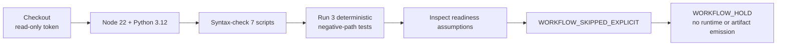

<!-- [KFM_META_BLOCK_V2]
doc_id: kfm://doc/scripts-readme
title: scripts/ — Governed Operational Helper and Graduation Root
type: README
version: v0.4
status: draft; repository-grounded; canonical-helper-root; mixed-maturity; maplibre-runtime-held; trust-shaped-builders-present; non-authoritative
owner: NEEDS VERIFICATION — default CODEOWNERS route is @bartytime4life; no explicit /scripts/ rule, accepted script-root stewardship assignment, required-review enforcement, or independent approval control was established
created: NEEDS VERIFICATION — a short root stub existed before v0.2
updated: 2026-07-23
supersedes: v0.3 documentation at the same path; no script, workflow, command, validator, artifact, receipt, proof, release, runtime, deployment, or publication behavior is superseded
policy_label: repository-facing; operational-helpers; dev; maintenance; one-off; dry-run-first; no-hidden-authority; no-direct-public-path; no-secrets; graduation-required; correction-aware; rollback-aware
owning_root: scripts/
responsibility: hold small operational wrappers and bounded repository helpers while making their reads, writes, network use, failure states, generated candidates, review burden, graduation triggers, correction path, and rollback path inspectable
truth_posture: cite-or-abstain; script presence and successful execution prove only the bounded command behavior observed, not evidence sufficiency, policy approval, lifecycle promotion, release authority, publication, or production readiness
evidence_snapshot:
  repository: bartytime4life/Kansas-Frontier-Matrix
  base_ref: main
  base_commit: fae69bb52e0ebc7670dc7d20c9eb05cb587520ff
  prior_blob: f603cb013ff86511a65dae4799c54d77c029e082
  prior_evidence_commit: 15d88fceced7050abac4493b9cf66f5bc288c1e6
  intervening_commits: 854
  dev_readme_blob: 390687c80912d52def5909b66bec7bb08b9d0bfa
  maintenance_readme_blob: bd4ef697d7118074be44d00e6e77a8a311afe5f4
  one_off_readme_blob: 46e85d9b2e9bba3dd48c697dfc020b456e4cae18
  package_json_blob: 62f45306aef7376a2d68042b0c9e7f556edf0e78
  makefile_blob: 51537af34ee065c2de571134688415042b83b22a
  maplibre_workflow_blob: bfb36a84ba72bec68d964976dc7964cde7f5d603
  promotion_gate_workflow_blob: c22941d5e1fad3317f46591705091ef2b6e7d265
  codeowners_blob: dd2a84aa514d8ecd9208bc347f90f9a2ed37dd61
  directory_rules_blob: 2affb080e6f0043867c64c7f06c1ca52030fbd55
  drift_register_blob: 5c5078b93c467e66f4cc8b86a7a696dbce5ae7e0
  generated_receipt_schema_blob: fba21ed27ebccf1362fe397fe0c3ebd85e072685
  maplibre_smoke_blob: 699dd4cf42d355dd2ed7620852b7fd1f3000bbe2
  maplibre_render_diff_blob: ee24890c0e06bd941e0f1ead919e9e7b9bc37460
  maplibre_attest_blob: 0c8187e0c4d88926a7cd2de413564d2d942dd9b3
  maplibre_manifest_blob: 566731bd6ad1510ecd1e01e0275ffa04b3993a86
  maplibre_proof_pack_blob: 8396c912a75c803baf8a92abe7a2f8cad582ba41
  maplibre_correction_blob: dc75786fbc0343dba17eef8f122eb1d67728f541
  maplibre_failure_bundle_blob: f22f248084bc231212915b4e40a653faef566b64
related:
  - ./dev/README.md
  - ./maintenance/README.md
  - ./one_off/README.md
  - ../tools/README.md
  - ../tools/validators/README.md
  - ../pipelines/README.md
  - ../packages/README.md
  - ../tests/README.md
  - ../fixtures/README.md
  - ../configs/README.md
  - ../artifacts/README.md
  - ../data/receipts/README.md
  - ../data/proofs/README.md
  - ../release/README.md
  - ../package.json
  - ../Makefile
  - ../.github/workflows/maplibre-perf-governance.yml
  - ../.github/workflows/promotion-gate.yml
  - ../.github/CODEOWNERS
  - ../docs/quality/maplibre-perf-governance.md
  - ../docs/doctrine/directory-rules.md
  - ../docs/registers/DRIFT_REGISTER.md
notes:
  - "v0.4 is a same-path documentation modernization and evidence refresh after 854 intervening commits from the v0.3 evidence base."
  - "The first twelve H2 sections follow the Directory Rules §15 folder-README contract exactly."
  - "The seven root-level MapLibre scripts and local package/Make entry points remain present, but the current MapLibre workflow now performs syntax and three bounded negative-path checks, then records WORKFLOW_SKIPPED_EXPLICIT and WORKFLOW_HOLD without running a browser or emitting artifacts."
  - "The MapLibre scripts remain trust-shaped candidate builders under artifacts/perf; the current drift register records this authority conflict as OPEN / BLOCKED_ADR."
  - "The maintenance child README still states that promotion-gate directly invokes a maintenance checker; the current workflow instead runs repository tests and readiness inspection. Child-document correction is tracked separately to preserve this task's exact path scope."
  - "No executable behavior, generated artifact, lifecycle state, release state, deployment, or public surface is changed by this README update."
[/KFM_META_BLOCK_V2] -->

<a id="top"></a>

# `scripts/` — Governed Operational Helper and Graduation Root

[](#status)
[](#authority-level)
[](#status)
[](#root-level-maplibre-performance-chain)
[](#generated-artifact-and-trust-object-boundary)
[](#authority-level)

> **One-line purpose.** `scripts/` holds small, explicit, reversible operational wrappers while enforcing a visible graduation boundary so convenience code cannot become hidden validation, pipeline, evidence, policy, release, or publication authority.

**Quick navigation:** [Purpose](#purpose) · [Authority](#authority-level) · [Status](#status) · [Belongs](#what-belongs-here) · [Does not belong](#what-does-not-belong-here) · [Inputs](#inputs) · [Outputs](#outputs) · [Validation](#validation) · [Review](#review-burden) · [Related roots](#related-folders) · [ADRs](#adrs) · [Last reviewed](#last-reviewed) · [Inventory](#confirmed-current-inventory) · [Child lanes](#child-lane-contracts) · [MapLibre](#root-level-maplibre-performance-chain) · [Execution](#safe-execution-contract) · [Artifact boundary](#generated-artifact-and-trust-object-boundary) · [Outcomes](#finite-outcomes-and-failure-semantics) · [Graduation](#graduation-and-promotion-rules) · [Rollback](#correction-and-rollback) · [Open verification](#open-verification-register)

> [!IMPORTANT]
> A script may execute work, but successful execution grants no KFM authority. Output is not automatically evidence, proof, policy approval, lifecycle promotion, release approval, correction authority, rollback authorization, or public truth.

> [!WARNING]
> The current MapLibre workflow does **not** run the browser/performance/trust-object chain. It syntax-checks seven scripts, invokes three deterministic negative-path tests, and records an explicit governance hold. It emits no screenshot, receipt, attestation, proof, release record, correction, rollback object, failure bundle, or uploaded artifact.

> [!CAUTION]
> Local `package.json` and `Makefile` entry points still expose the full MapLibre candidate-builder chain. Those commands depend on live network assets and currently missing runtime/baseline fixtures, permissive placeholder schemas, placeholder governance verifiers, and unsigned attestation. Command availability is not readiness.

---

## Purpose

`scripts/` is the canonical KFM root for **small operational helpers, developer wrappers, bounded maintenance commands, and temporary one-off automation**.

A script belongs here only while all of these remain true:

1. its purpose is narrow and named;
2. its inputs, outputs, side effects, network calls, and failure states are inspectable;
3. its logic is not the sole implementation of a trust-bearing rule;
4. it can be disabled, deleted, or graduated without changing a public contract;
5. its outputs remain temporary results or candidates until validated and routed to the owning responsibility root;
6. it does not bypass source admission, evidence, policy, rights, sensitivity, review, promotion, correction, or rollback gates.

The controlling pattern is:

```text
small bounded helper
  -> reliance, repetition, or trust burden appears
  -> responsibility and risk review
  -> graduate durable logic to tools/, pipelines/, packages/, tests/, infra/,
     release/, or another accepted owning root
  -> retain only a thin compatibility wrapper when justified
```

This README defines routing and review posture. It does not claim that graduation is automatically enforced.

[Back to top](#top)

---

## Authority level

**Canonical operational-helper root; non-authoritative execution surface.**

Directory Rules distinguish `scripts/` from the roots that own long-lived behavior and trust objects:

| Concern | Authority home | `scripts/` role |
|---|---|---|
| Small local or operational wrapper | `scripts/` | Owns the thin command and bounded usage contract. |
| Long-lived validator, generator, builder, proof assembler, release helper, or QA tool | [`tools/`](../tools/) | May invoke it; must not replace its accepted implementation and tests. |
| Repeatable lifecycle or production orchestration | [`pipelines/`](../pipelines/) | May launch it; orchestration remains with the pipeline. |
| Reusable implementation | [`packages/`](../packages/) | Shared logic belongs in importable, versioned, tested code. |
| Executable proof | [`tests/`](../tests/) | Script success is not a substitute for assertions. |
| Fixtures and baselines | [`fixtures/`](../fixtures/) | May read or propose regeneration; fixture authority remains separate. |
| Semantic meaning and machine shape | `contracts/`, `schemas/` | Consumes them; cannot create parallel contract or schema authority. |
| Policy, rights, sensitivity, access | `policy/` plus governed review | Obeys decisions; cannot grant permission. |
| Lifecycle state | governed `data/` phases | May produce candidates only through declared transitions. |
| Receipts and proofs | [`data/receipts/`](../data/receipts/), [`data/proofs/`](../data/proofs/) | May emit candidates through accepted contracts; path or filename does not confer status. |
| Release, correction, withdrawal, rollback | [`release/`](../release/) | May draft or assist; cannot approve or publish. |
| Deployment and public behavior | `infra/`, runtime, apps | Cannot authorize service exposure or public routes. |
| Secrets | approved external mechanism | Uses references or injected values; never stores committed secrets. |

### Anti-collapse rules

`scripts/` must not collapse:

- command convenience into canonical implementation;
- generated JSON into contract conformance;
- validator invocation into validator authority;
- CI success into runtime, release, or publication proof;
- QA artifact upload into promotion;
- receipt-, proof-, or manifest-shaped output into a governed trust object;
- a draft correction or rollback object into an authorized state transition;
- local success into production readiness;
- a one-off mutation into a durable dependency.

Public clients and normal UI surfaces must never execute arbitrary repository scripts.

[Back to top](#top)

---

## Status

<a id="status-and-evidence-boundary"></a>

### Repository-grounded maturity summary

| Surface | Current evidence | Safe conclusion |
|---|---:|---|
| `scripts/README.md` | **CONFIRMED v0.3 baseline** | Strong guardrails exist, but the evidence snapshot and workflow description are stale. |
| [`scripts/dev/`](./dev/) | **CONFIRMED placeholder-only** | `bootstrap.sh` and `regen_fixtures.sh` do not implement setup or fixture regeneration. |
| [`scripts/maintenance/`](./maintenance/) | **CONFIRMED mixed maturity** | Substantive maintenance commands exist, but command-by-command ownership, output homes, and graduation remain unsettled. |
| [`scripts/one_off/`](./one_off/) | **CONFIRMED README-only in bounded evidence** | Deletion-first temporary lane; no direct executable was established by inspected evidence. |
| Seven root-level MapLibre scripts | **CONFIRMED substantive candidate builders** | They can perform browser smoke, render diff, unsigned attestation shaping, manifest/proof shaping, correction/rollback drafting, and failure capture when invoked locally. |
| Root `package.json` and `Makefile` | **CONFIRMED command entry points** | Local commands exist; availability does not establish prerequisites, deterministic fixtures, or release readiness. |
| `MapLibre Perf Governance` workflow | **CONFIRMED bounded checks plus explicit hold** | It syntax-checks scripts, runs three negative-path tests, inspects readiness, and emits only logs/summary. It does not run the browser chain or emit artifacts. |
| `promotion-gate` workflow | **CONFIRMED test/readiness workflow** | It runs doctrine and PromotionDecision shape tests and records holds; it does not invoke the old maintenance checker path or create promotion authority. |
| MapLibre schemas | **CONFIRMED eight accept-any-object placeholders** | Object names exist, but meaningful machine-shape proof is not established. |
| MapLibre governance verifiers | **CONFIRMED placeholders** | Runtime/performance/release assertions remain held. |
| Canonical trust-object placement | **CONFLICTED / open `BLOCKED_ADR` drift** | Candidate builders target `artifacts/perf/`; accepted receipts, proofs, and release records belong in governed data/release roots. |
| Workflow success and branch-protection significance | **NEEDS VERIFICATION per run** | A workflow definition or green hold check is not runtime or release evidence. |
| Production use and downstream consumers | **UNKNOWN** | No deployment, schedule, runtime, SLO, incident, or consumer evidence was inspected. |
| Ownership | **NEEDS VERIFICATION** | Default CODEOWNERS routing exists; explicit script-root stewardship and review enforcement do not. |

### Maturity classes

| Class | Meaning | Current examples |
|---|---|---|
| `PLACEHOLDER` | Exists but does not perform the advertised future action. | Dev helpers; selected MapLibre governance verifiers. |
| `LOCAL_HELPER` | Bounded workstation/operator convenience. | Future reviewed `dev/` wrappers. |
| `TEMPORARY` | Task- and expiry-bound helper. | `one_off/`. |
| `OPERATIONAL_HELPER` | Substantive bounded maintenance or QA behavior. | Doctrine maintenance commands. |
| `COMMAND_EXPOSED` | Reachable through a repository command surface. | MapLibre package/Make targets. |
| `CI_CHECKED` | Syntax, static assumptions, or selected behavior is exercised by CI. | Seven MapLibre scripts and three negative-path tests. |
| `CI_RUNTIME_EXECUTED` | Runtime command itself is exercised by CI. | **Not established for the MapLibre browser chain.** |
| `TRUST_ADJACENT` | Produces or evaluates receipt-, proof-, release-, correction-, rollback-, or publication-support candidates. | MapLibre candidate builders; selected maintenance commands. |
| `GRADUATION_REQUIRED` | Responsibility or reliance exceeds the intended script-root role. | **PROPOSED current posture for MapLibre candidate builders and selected maintenance commands.** |

A file may occupy more than one class. `CI_CHECKED` does not mean canonical; `TRUST_ADJACENT` does not mean accepted authority.

[Back to top](#top)

---

## What belongs here

- This root README and child-lane indexes.
- Small shell, Python, Node, or other wrappers with bounded command contracts.
- Workstation-focused helpers under [`dev/`](./dev/).
- Bounded repository maintenance wrappers under [`maintenance/`](./maintenance/).
- Temporary, expiry-bound task scripts under [`one_off/`](./one_off/).
- Thin launchers around accepted tools, validators, tests, packages, or pipelines.
- Read-only inspection, reporting, and planning helpers.
- Transitional wrappers while a documented graduation or migration is active.
- Script-local usage notes that state inputs, outputs, effects, network behavior, secret posture, finite outcomes, validation, retention, rollback, and graduation triggers.

Every consequential script should carry or link:

- stable command identity and accountable maintenance route;
- purpose and non-goals;
- exact read, write, and delete sets;
- network hosts and dependency-integrity posture;
- secret references, never secret values;
- deterministic inputs or recorded variability;
- finite outcome and exit-code mapping;
- generated-output classification and destination;
- validation commands and limitations;
- retention, cleanup, correction, rollback, and graduation rules.

[Back to top](#top)

---

## What does NOT belong here

| Do not place or retain here | Correct home or action |
|---|---|
| Long-lived validators, generators, builders, proof assemblers, release helpers, or QA frameworks | [`tools/`](../tools/) with accepted contracts, tests, and ownership |
| Repeatable lifecycle or production orchestration | [`pipelines/`](../pipelines/) |
| Shared or domain implementation logic | [`packages/`](../packages/) |
| Tests and assertions | [`tests/`](../tests/) |
| Fixtures, baselines, golden outputs, invalid examples | [`fixtures/`](../fixtures/) |
| Semantic contracts or JSON Schema | `contracts/`, `schemas/` |
| Policy rules, source activation, rights, sensitivity, consent, or access grants | `policy/`, registries, and governed review |
| RAW, WORK, QUARANTINE, PROCESSED, CATALOG, TRIPLET, or PUBLISHED payloads | governed `data/` lifecycle roots |
| Canonical receipts and accepted proofs | [`data/receipts/`](../data/receipts/), [`data/proofs/`](../data/proofs/) |
| Authoritative release manifests, PromotionDecisions, CorrectionNotices, WithdrawalNotices, RollbackCards, or signatures | [`release/`](../release/) |
| Shared configuration defaults or reusable templates | [`configs/`](../configs/) |
| Deployment definitions, service units, production schedules, firewall/proxy rules | `infra/`, runtime, or apps |
| Credentials, tokens, keys, passwords, private endpoints, secret-bearing `.env` files | approved external secret system |
| Public API routes, UI components, browser bundles, arbitrary script-execution endpoints | accepted app/API/UI roots |
| Unowned experiments or forgotten temporary scripts | delete, or admit to `one_off/` with expiry and rollback |
| Generated files committed without classification, validation, review, and rollback | classify, route, or delete before merge |

[Back to top](#top)

---

## Inputs

A script may consume only inputs appropriate to its declared scope.

### Permitted input classes

- explicit CLI arguments;
- tracked manifests, lockfiles, schemas, contracts, config examples, and fixtures;
- accepted tool, validator, package, pipeline, and test entry points;
- ignored workstation-local overrides where the consumer contract allows them;
- non-secret environment variables;
- approved injected secret references;
- reviewed local services or remote endpoints;
- artifacts generated earlier in the same bounded run;
- repository metadata such as commit SHA, branch, or changed paths.

### Required input controls

A consequential script must:

1. reject unknown arguments;
2. validate required paths and tool versions;
3. distinguish tracked, ignored, generated, and external inputs;
4. pin or record dependencies;
5. avoid broad scans of secrets or protected data;
6. deny unreviewed network sources;
7. resolve symlinks and path traversal safely before writes;
8. record freshness, rights, sensitivity, policy, and release state when material;
9. stop rather than invent authority-bearing defaults;
10. avoid direct public-client access to canonical/internal stores.

### Forbidden assumptions

A script must not assume that:

- path presence means an object is accepted;
- schema validity means a claim is true;
- a registry row means a source is active;
- a JSON filename makes an object a governed receipt or proof;
- a `candidate` manifest is release approval;
- local or CI behavior equals production;
- credentials exist or may be printed;
- network access is harmless;
- generated content is safe to commit, promote, or publish.

[Back to top](#top)

---

## Outputs

Script outputs remain **terminal results, temporary artifacts, or candidates** until the owning root validates and accepts them.

| Output class | Examples | Required handling |
|---|---|---|
| Terminal-only | status, plan, warning, finite outcome | No secret/protected content; stable outcome mapping. |
| Local temporary | cache, scratch report, preview | Ignore or delete; not evidence or release material. |
| Build/QA artifact | screenshots, diffs, performance diagnostics, failure bundle | Temporary `artifacts/` use may be valid; classify retention and sensitivity. |
| Fixture candidate | regenerated examples | Compare deterministically; validate and review before replacing fixtures. |
| Lifecycle candidate | transformed or derived data | Route to WORK/QUARANTINE; never directly to PUBLISHED. |
| Receipt candidate | run- or validation-receipt-shaped object | Validate and route to an accepted receipt lane before treating as process memory. |
| Proof candidate | ProofPack, integrity report, render comparison | Validate and route to the proof lane before treating as proof. |
| Release candidate | manifest, correction, withdrawal, rollback-shaped record | Route to `release/`; scripts cannot approve it. |
| Code/config mutation | source, docs, configs, registries | Dry run, exact diff, tests, owner review, correction, rollback. |

### Minimum effect declaration

```yaml
command_id: <stable-id>
mode: inspect | plan | apply | verify
outcome: NOOP | PLANNED | APPLIED | PARTIAL | HELD | DENIED | ERROR
reads: []
writes: []
deletes: []
network_profile: none | <reviewed-profile>
secret_refs: []
generated_objects:
  - path: <path>
    class: terminal | temporary | artifact | fixture_candidate | lifecycle_candidate | receipt_candidate | proof_candidate | release_candidate | mutation
validation:
  - <command or check>
rollback: <mechanical restoration>
maintenance_route: <verified route or NEEDS VERIFICATION>
```

This declaration is **PROPOSED**, not a confirmed schema.

[Back to top](#top)

---

## Validation

Validation must match the claim being made.

### Static inventory and syntax

```bash
find scripts -maxdepth 3 -type f | sort

find scripts -name '*.sh' -print0 |
  xargs -0 -r bash -n

find scripts -name '*.py' -print0 |
  xargs -0 -r python -m py_compile

find scripts -name '*.mjs' -print0 |
  xargs -0 -r -n1 node --check
```

Static syntax proves parseability only. It does not prove safe mutation, network behavior, fixture availability, deterministic output, schema meaning, or release eligibility.

### Current MapLibre CI coverage

The inspected workflow definition:

1. runs `node --check` against the seven root-level MapLibre scripts;
2. parses MapLibre Python validator and test syntax;
3. directly invokes three deterministic negative-path test functions;
4. verifies that runtime fixtures, canonical migration targets, meaningful schemas, substantive verifiers, signing, and tracked trust-shaped artifacts have **not** silently appeared;
5. records `WORKFLOW_SKIPPED_EXPLICIT` and `WORKFLOW_HOLD`.

It does **not** install package dependencies or a browser, run Playwright, start the fixture server, execute performance smoke, compare render output, sign anything, build a proof/release candidate, or upload `artifacts/perf/`.

### Current local command surfaces

`package.json` and `Makefile` expose the candidate-builder commands. Before a maintainer runs the full chain, they must verify:

- accepted package manager and lockfile;
- browser and Node dependencies;
- local slim/heavy style fixtures and baselines;
- approved network hosts or mirrored assets;
- meaningful schemas and valid/invalid fixtures;
- substantive validators and finite outcomes;
- output staging, cleanup, retention, and sensitivity;
- signing posture;
- canonical receipt/proof/release destinations;
- rollback and correction behavior.

<details>
<summary><strong>Current command names — availability only, not a run recommendation</strong></summary>

```bash
npm run maplibre:perf
npm run maplibre:render-diff
npm run maplibre:attest
npm run maplibre:manifest
npm run maplibre:govern
npm run maplibre:proof
npm run maplibre:proof:validate
npm run maplibre:failure-bundle
npm run maplibre:correction
npm run maplibre:perf:full
npm run maplibre:clean

make maplibre-perf
make maplibre-govern
make maplibre-proof
make maplibre-clean
```

</details>

### Child-lane checks

```bash
bash -n scripts/dev/bootstrap.sh
bash -n scripts/dev/regen_fixtures.sh

python -m py_compile scripts/maintenance/*.py
bash -n scripts/maintenance/*.sh
python scripts/maintenance/run_doctrine_artifact_preflight.py --help
bash scripts/maintenance/run_doctrine_artifact_test_suite.sh
```

Review command help, strict flags, output paths, and write behavior before executing maintenance reconciliation.

### Documentation and mutation review

```bash
git status --short
git diff -- scripts package.json Makefile .github/workflows
git diff -- artifacts data release configs fixtures tests tools
```

### Claim limits

For this README modernization:

- the complete Markdown baseline and current repository definitions were inspected;
- executable script commands were not run in the authoring environment;
- no generated MapLibre artifact was inspected as a current run product;
- no package build, browser test, network call, signing operation, migration, graduation, or rollback drill was performed;
- repository CI runs only after the draft PR is opened.

[Back to top](#top)

---

## Review burden

CODEOWNERS currently routes unmatched paths to `@bartytime4life`. No explicit `/scripts/` rule was found. That route is not proof of a stewardship assignment, review completion, required code-owner review, branch protection, or independent approval.

| Change class | Minimum review posture |
|---|---|
| README-only clarification with no behavior claim | Default repository review route; verify links, anchors, claims, and rollback. |
| Non-mutating local helper | Maintainer familiar with the affected command and operating environment. |
| Write-capable script | Reviewer for every mutated responsibility root plus rollback review. |
| Schema, contract, policy, source, registry, fixture, or lifecycle mutation | Owning-root reviewer and applicable governance review. |
| Network, download, archive, shell-from-input, deletion, secrets, or protected logs | Security review plus affected owner. |
| CI-required, scheduled, or monitored command | CI/operations review and a graduation decision. |
| Receipt-, proof-, release-, correction-, rollback-, or signature-shaped output | Evidence/release review, canonical-home decision, validators, and separation-of-duty review. |
| Sensitive-domain or precise-location handling | Applicable sensitivity/steward review before exposure. |

The same implementation must not silently become generator, validator, approver, signer, and publisher.

[Back to top](#top)

---

## Related folders

| Path | Relationship |
|---|---|
| [`scripts/dev/`](./dev/) | Placeholder and future local-development wrappers. |
| [`scripts/maintenance/`](./maintenance/) | Mixed-maturity maintenance and doctrine-preflight commands. |
| [`scripts/one_off/`](./one_off/) | Temporary, deletion-first quarantine lane. |
| [`tools/`](../tools/) | Long-lived validators, generators, builders, proof assemblers, release helpers, and governed tooling. |
| [`tools/validators/`](../tools/validators/) | Validator implementation authority. |
| [`pipelines/`](../pipelines/) | Repeatable lifecycle and production orchestration. |
| [`packages/`](../packages/) | Reusable implementation. |
| [`tests/`](../tests/) | Executable proof. |
| [`fixtures/`](../fixtures/) | Valid, invalid, negative, and golden examples. |
| [`configs/`](../configs/) | Shared safe defaults and configuration templates. |
| [`artifacts/`](../artifacts/) | Compatibility root for build/docs/QA/temporary outputs—not sovereign truth. |
| [`data/receipts/`](../data/receipts/) | Governed process-memory records. |
| [`data/proofs/`](../data/proofs/) | Governed proof objects. |
| [`release/`](../release/) | Promotion, release, correction, withdrawal, and rollback authority. |
| [`package.json`](../package.json) | Root Node command surface, including local MapLibre candidate builders. |
| [`Makefile`](../Makefile) | Root orchestration surface, including MapLibre targets. |
| [MapLibre workflow](../.github/workflows/maplibre-perf-governance.yml) | Bounded syntax/negative-path/readiness check with explicit hold. |
| [Promotion workflow](../.github/workflows/promotion-gate.yml) | Doctrine/shape/readiness checks; no promotion authority. |
| [MapLibre governance draft](../docs/quality/maplibre-perf-governance.md) | Proposed graduation and artifact-placement design. |
| [Directory Rules](../docs/doctrine/directory-rules.md) | Placement, root responsibility, migration, and §15 README doctrine. |
| [Drift register](../docs/registers/DRIFT_REGISTER.md) | Current open artifacts/trust-object authority conflict. |
| [CODEOWNERS](../.github/CODEOWNERS) | GitHub review routing, not stewardship or approval. |

[Back to top](#top)

---

## ADRs

### Governing doctrine and current decision state

- Directory Rules make `scripts/` the small-helper root and require long-lived trust-bearing logic to graduate.
- Directory Rules restrict `artifacts/` to build, docs, QA, and temporary material.
- The current drift register records the MapLibre artifact-placement conflict as open and `BLOCKED_ADR`.
- The MapLibre performance-governance document proposes graduation and canonical receipt/proof/release homes but is a draft, not an accepted decision.
- No accepted ADR settling the final MapLibre script destination, canonical trust-object migration, generic script command contract, or script-risk model was surfaced in this review.

### Decisions still required

| Decision | Status |
|---|---|
| Assign script-root stewardship and explicit review enforcement. | NEEDS VERIFICATION |
| Decide the final home for the seven MapLibre candidate builders. | ADR or reviewed migration decision required |
| Decide whether `artifacts/perf/` remains ephemeral QA staging only. | Open / `BLOCKED_ADR` drift |
| Define accepted schemas, contracts, fixtures, validators, and outcomes for MapLibre candidate objects. | NEEDS VERIFICATION |
| Define dependency lock, browser/runtime fixture, network, and signing posture. | NEEDS VERIFICATION |
| Classify each maintenance command as wrapper, validator, mutator, orchestrator, renderer, or placeholder. | NEEDS VERIFICATION |
| Resolve maintenance output homes and stale child documentation. | NEEDS VERIFICATION |
| Define one-off admission, expiry, cleanup, and delete-or-promote enforcement. | PROPOSED |
| Define compatibility-wrapper and cleanup rules after graduation. | PROPOSED |

No path is moved and no ADR is accepted by this README update.

[Back to top](#top)

---

## Last reviewed

| Field | Value |
|---|---|
| Last reviewed | 2026-07-23 |
| Evidence base | `main@fae69bb52e0ebc7670dc7d20c9eb05cb587520ff` |
| Target prior blob | `f603cb013ff86511a65dae4799c54d77c029e082` |
| Prior evidence base | `15d88fceced7050abac4493b9cf66f5bc288c1e6` |
| Evidence delta | 854 intervening commits |
| Review mode | Complete-baseline, same-path, repository-grounded documentation modernization |
| Implementation effect | None—Markdown and generated provenance only |
| Runtime/CI effect | None—no script, workflow, command, dependency, fixture, validator, or artifact changed |
| Rollback | Revert the documentation/provenance commits or restore the prior README blob |

Re-review when:

- a script is added, removed, moved, renamed, or made executable;
- a child-lane README changes or conflicts with current callers;
- a placeholder gains real behavior;
- a script is added to CI, branch protection, a schedule, or production operation;
- a lockfile, runtime fixture, baseline, meaningful schema, or substantive validator appears;
- a script writes a new artifact family;
- MapLibre scripts graduate or `artifacts/perf/` placement changes;
- maintenance output homes or workflow callers change;
- network, dependency, secret, logging, retention, correction, or rollback posture changes;
- Directory Rules, the drift register, or an accepted ADR changes placement.

[Back to top](#top)

---

## Confirmed current inventory

### Child lanes

```text
scripts/
├── README.md
├── dev/
│   ├── README.md
│   ├── bootstrap.sh
│   └── regen_fixtures.sh
├── maintenance/
│   ├── README.md
│   ├── Python maintenance CLIs and helpers
│   └── shell wrappers and a bounded test bundle
└── one_off/
    └── README.md
```

### Root-level MapLibre candidate builders

```text
scripts/
├── maplibre-smoke-perf.mjs
├── build-maplibre-render-diff.mjs
├── attest-maplibre-perf.mjs
├── build-maplibre-perf-release-manifest.mjs
├── build-maplibre-perf-proof-pack.mjs
├── build-maplibre-perf-correction-and-rollback.mjs
└── build-maplibre-perf-failure-bundle.mjs
```

### Bounded inventory limits

This inventory does not prove absence of:

- ignored or untracked scripts;
- branch-only or historical scripts;
- local operator copies;
- dynamically downloaded scripts;
- generated executables;
- workflow commands outside inspected definitions;
- deeper files not surfaced by the inspected child documents.

[Back to top](#top)

---

## Child-lane contracts

### `dev/` — local development helpers

Current posture:

- `bootstrap.sh` and `regen_fixtures.sh` are six-line TODO placeholders;
- no dependency installation or fixture regeneration is implemented;
- no CI or production authority is established;
- future mutation must be explicit, dry-run capable, tested, and reversible.

Use `dev/` for small workstation-oriented wrappers only. Graduate behavior when it becomes shared setup infrastructure, a generator, validator, or test harness.

### `maintenance/` — bounded repository maintenance

Current posture:

- substantive doctrine-artifact registry, provenance, readiness, synchronization, preflight, and test-bundle commands exist;
- some commands are mutation-sensitive or trust-adjacent;
- the current `promotion-gate` workflow no longer directly invokes the maintenance checker path described by the child README;
- long-term placement and accepted output homes remain unresolved.

> [!NOTE]
> The stale caller statement in `scripts/maintenance/README.md` is a separate same-path correction target. This parent update records the discrepancy without editing a second README or masking the lineage.

### `one_off/` — temporary quarantine

Current posture:

- README-only in bounded evidence;
- empty by default;
- deletion first;
- dry run first;
- network denied by default;
- every temporary script requires task, maintenance route, risk, inputs, outputs, rollback, expiry, and delete-or-promote decision.

One-off scripts must never become the normal path for ingestion, validation, evidence resolution, policy enforcement, promotion, publication, correction, or rollback.

[Back to top](#top)

---

## Root-level MapLibre performance chain

### Local candidate-builder flow

The current local command surfaces can invoke:

```text
configs/maplibre/perf-envelope.v1.json
  -> maplibre-smoke-perf.mjs
  -> build-maplibre-render-diff.mjs
  -> attest-maplibre-perf.mjs
  -> build-maplibre-perf-release-manifest.mjs
  -> tools/validators/maplibre/validate_perf_governance.py
  -> build-maplibre-perf-proof-pack.mjs
  -> tools/validators/maplibre/validate_perf_proof_pack.py
  -> release-manifest rebuild
  -> final governance-validator invocation
```

Failure-oriented helpers can draft:

```text
candidate failure
  -> build-maplibre-perf-correction-and-rollback.mjs
  -> build-maplibre-perf-failure-bundle.mjs
```

### Current CI flow


```mermaid
flowchart LR
    A["Checkout<br/>read-only token"] --> B["Node 22 + Python 3.12"]
    B --> C["Syntax-check 7 scripts"]
    C --> D["Run 3 deterministic<br/>negative-path tests"]
    D --> E["Inspect readiness assumptions"]
    E --> F["WORKFLOW_SKIPPED_EXPLICIT"]
    F --> G["WORKFLOW_HOLD<br/>no runtime or artifact emission"]
```

This diagram reflects the inspected workflow definition. It is not a performance result.

### Why the hold exists

The workflow confirms that:

- no supported dependency lockfile is present;
- referenced runtime style fixtures and executable MapLibre fixture payloads are absent;
- the eight MapLibre performance schemas remain permissive placeholders;
- several governance verifiers remain placeholders;
- the browser smoke depends on live CDN/glyph endpoints;
- attestation is unsigned;
- trust-shaped builders target `artifacts/perf/`;
- tracked MapLibre performance artifacts must not silently appear.

A green run of this workflow therefore means the **hold contract behaved as designed**, not that performance, rendering, signing, proof closure, release eligibility, or publication safety passed.

[Back to top](#top)

---

## Safe execution contract

Every consequential script should expose this sequence:

```text
inspect
  -> validate prerequisites
  -> plan exact reads, writes, deletes, and network calls
  -> dry run
  -> explicit apply
  -> validate outputs
  -> emit finite outcome
  -> preserve review evidence
  -> route or clean outputs
```

Default rules:

- no-argument mode is read-only unless the command is inherently read-only;
- writes require `--apply`, `--write`, or an equally explicit action;
- destructive changes require narrower confirmation;
- unknown arguments and fields fail;
- scripts do not automatically stage, commit, push, merge, release, or publish;
- stale or conflicted preconditions block canonical mutation;
- partial effects return `PARTIAL` or `ERROR`;
- temporary output is cleaned or retained under explicit policy;
- governed candidates are validated and routed to owning roots;
- local and CI behavior differences are declared;
- network access is denied unless the command contract lists approved endpoints;
- secrets are injected through approved mechanisms and redacted;
- incident evidence and prior recoverable state are preserved.

Where practical, repeated execution with identical inputs should be deterministic or record the nondeterminism, and a second successful apply should produce `NOOP` or a declared update.

[Back to top](#top)

---

## Generated-artifact and trust-object boundary

### Staging is not promotion

```text
script result
  -> temporary or WORK candidate
  -> schema and contract validation
  -> policy, rights, sensitivity, and evidence checks
  -> receipt/proof/release assembly in the correct authority root
  -> accountable review
  -> PromotionDecision and ReleaseManifest where applicable
  -> PUBLISHED
```

A script must never shortcut this flow by writing directly to a path and treating placement as approval.

### `artifacts/` compatibility rule

`artifacts/` may carry temporary QA output, screenshots, render diffs, build reports, CI bundles, and disposable candidates. It must not become the sovereign home for:

- canonical receipts;
- accepted proofs;
- release manifests;
- policy or promotion decisions;
- correction or withdrawal records;
- rollback authority;
- catalog records;
- published material.

### MapLibre candidate outputs

The inspected builders can target `artifacts/perf/` with:

- performance results and frame-time CSVs;
- screenshots and render-diff output;
- `RunReceipt`-shaped JSON;
- unsigned DSSE-shaped envelope and checksum;
- `ReleaseManifest`-shaped candidate;
- `ProofPack`-shaped candidate;
- draft correction and rollback records;
- failure bundle.

These are **candidate shapes**, not accepted trust objects. The drift register records the placement conflict as open and `BLOCKED_ADR`.

### Candidate handoff record

When a script produces a trust-adjacent candidate, record:

| Field | Purpose |
|---|---|
| Candidate path and class | Temporary location and object family claimed. |
| Owning root | Canonical destination if admitted. |
| Schema and contract | Shape and semantic authority. |
| Validator and fixtures | Executable checks and representative cases. |
| Evidence refs | Support used by the candidate. |
| Policy and review refs | Decisions and accountable review required. |
| Digest and tool identity | Integrity and reproducibility. |
| Promotion status | `staged`, `held`, `denied`, `accepted`, or `superseded`. |
| Correction and rollback | Invalidating or reversing path. |
| Retention | Cleanup or preservation period. |

This profile is **PROPOSED**.

[Back to top](#top)

---

## Finite outcomes and failure semantics

### Script execution outcomes

| Outcome | Meaning |
|---|---|
| `NOOP` | Preconditions were valid and no change was needed. |
| `PLANNED` | A reviewable no-write plan was produced. |
| `APPLIED` | The bounded mutation completed and required verification passed. |
| `PARTIAL` | Some effects occurred; reconciliation and review are required. |
| `HELD` | Execution or output waits on evidence, dependency, freshness, placement, or review. |
| `DENIED` | Policy, rights, sensitivity, access, release, or scope forbids the action. |
| `ERROR` | Technical execution failed. |

These execution outcomes are not interchangeable with public API outcomes, policy enums, validation `PASS`/`FAIL`, workflow `HOLD`, or document truth labels.

### Mandatory failure behavior

- `PARTIAL`, `HELD`, `DENIED`, and `ERROR` must not be converted to silent success.
- A failed or placeholder validator cannot support a trust claim.
- Missing receipts, proofs, review, signatures, or release records must not be invented.
- Failure handlers may capture diagnostics and draft correction/rollback candidates; they cannot authorize either.
- Failures must not print secrets, protected context, precise sensitive locations, living-person data, or private reasoning.
- Cleanup must not destroy incident evidence or the prior recoverable state.
- Retry logic distinguishes transient failure from deterministic invalid input.
- Stale or superseded candidates are not silently reused.

Exact numeric exit codes remain command-specific until accepted contracts define them.

[Back to top](#top)

---

## Graduation and promotion rules

Review a script for graduation when any of these becomes true:

| Trigger | Expected action |
|---|---|
| Reused by multiple apps, packages, or domains | Move reusable logic to `packages/`; retain a thin CLI only when useful. |
| Becomes a long-lived validator, generator, builder, or proof assembler | Move to `tools/` with tests, contracts, schemas, and ownership. |
| Orchestrates repeatable lifecycle or production work | Move to `pipelines/`. |
| Defines public/runtime behavior | Move to the owning app, package, runtime, or infra lane. |
| Is required by CI or branch protection | Define command contract, tests, ownership, failure semantics, and placement. |
| Writes or validates receipts, proofs, release records, corrections, rollback, or signatures | Establish canonical homes, validators, review, and likely graduate implementation. |
| Mutates schemas, contracts, policy, registries, fixtures, or release records | Require dry run, owning-root review, and mechanical rollback; graduate repeated logic. |
| Requires secrets, broad network access, or production credentials | Move to governed tooling/infra/runtime or deny casual use. |
| Becomes scheduled or operationally monitored | Move to a durable service, pipeline, or maintenance tool. |
| One-off task finishes | Delete the script or promote useful logic. |
| Script and documentation disagree | Hold use, correct docs/code, and preserve rollback. |

A graduation change should record callers, destination root, reason, stable interface, compatibility-wrapper plan, artifact migration, tests, CI, maintenance route, deprecation window, correction, rollback, and deletion date.

### Current determinations

- **MapLibre candidate builders:** graduation review is warranted because they are multi-step, networked, command-exposed, validator-integrated, and trust-adjacent. Current CI checks them but deliberately does not execute the runtime chain.
- **Maintenance commands:** classify command by command. Do not bulk-move the directory; thin wrappers may remain while validators, mutators, shared helpers, and orchestration move to their owning roots.
- **Dev helpers:** remain placeholders; graduation is premature until behavior exists.
- **One-off lane:** delete or promote after the task; accumulation is drift.

This README does not select destinations or move files.

[Back to top](#top)

---

## Correction and rollback

### Documentation rollback

Before merge, close the draft PR and delete or abandon its review branch. After merge, revert the README and generated-receipt commits or restore README blob `f603cb013ff86511a65dae4799c54d77c029e082`.

### Script correction triggers

Correct, hold, or retire a script when:

- documented and actual effects differ;
- an output uses the wrong authority root;
- a candidate fails schema, contract, policy, integrity, or evidence checks;
- secrets or protected context appear;
- network dependencies drift;
- a workflow silently ignores failure;
- reliance exceeds reviewed maturity;
- a maintenance route or rollback target is missing;
- a one-off passes its expiry;
- public clients or production systems depend directly on it;
- generated receipt/proof/release claims overstate authority.

### Operational rollback expectations

For a mutating script:

1. stop further runs;
2. preserve bounded logs and incident evidence without exposing secrets;
3. record exact partial state;
4. restore prior files, registry rows, configuration, fixtures, or artifacts;
5. invalidate candidates and caches;
6. rerun validators and tests;
7. notify known downstream consumers;
8. issue correction, withdrawal, or rollback records through the owning authority root when required;
9. document cause and fix;
10. decide whether to restrict, retire, or graduate the script.

Until MapLibre promotion is resolved, treat `artifacts/perf/` as ephemeral staging and prevent its trust-shaped candidates from being cited as released objects.

[Back to top](#top)

---

## Open verification register

| ID | Item | Evidence needed |
|---|---|---|
| KFM-SCR-01 | Complete recursive tracked/generated/ignored script inventory | Commit-pinned tree, ignore rules, history, and classification |
| KFM-SCR-02 | Script-root stewardship and required review | Approved assignment, explicit CODEOWNERS/ruleset, separation-of-duty evidence |
| KFM-SCR-03 | Every workflow, Make, package, and external caller | Search plus current run evidence |
| KFM-SCR-04 | MapLibre local chain prerequisites | Accepted package manager/lockfile, browser setup, fixtures, baselines, mirrors |
| KFM-SCR-05 | MapLibre runtime/performance behavior | Deterministic browser run, metrics, render comparisons, retained run evidence |
| KFM-SCR-06 | Meaningful MapLibre schemas and fixtures | Typed schemas, nonempty valid/invalid fixtures, expected errors |
| KFM-SCR-07 | Substantive MapLibre validators | Accepted CLI, finite outcomes, negative cases, aggregate command |
| KFM-SCR-08 | MapLibre candidate-builder destination | Accepted ADR or migration decision |
| KFM-SCR-09 | Canonical receipt/proof/release homes | Contracts, schemas, validators, review, promotion, correction, rollback |
| KFM-SCR-10 | Signing posture | Signer, keyed/keyless policy, verification, revocation, protected environment |
| KFM-SCR-11 | Network reproducibility | Allowed hosts, integrity, mirroring, cache/outage behavior, source-version receipts |
| KFM-SCR-12 | `artifacts/perf/` retention and cleanup | Ignore/tracking state, TTL, sensitivity, deletion, incident preservation |
| KFM-SCR-13 | Maintenance command classification and graduation | Per-command responsibility, callers, tests, outputs, rollback |
| KFM-SCR-14 | Maintenance output home | Accepted temporary/validation-receipt contract and migration |
| KFM-SCR-15 | Correct stale maintenance caller documentation | Same-path child README update grounded in current `promotion-gate.yml` |
| KFM-SCR-16 | Dev helper future behavior | Platforms, package managers, network/secrets, tests, rollback |
| KFM-SCR-17 | One-off admission and expiry enforcement | Metadata contract, CI scan, cleanup cadence, maintenance route |
| KFM-SCR-18 | Public-boundary proof | Tests showing normal public clients cannot invoke repository scripts |
| KFM-SCR-19 | Production use | Deployments, schedules, operators, logs, SLOs, incidents |
| KFM-SCR-20 | Graduation cleanup | Inbound links, wrapper window, deletion, correction, rollback |
| KFM-SCR-21 | Workflow and branch-protection significance | Current checks, rulesets, required names, bypass controls |
| KFM-SCR-22 | Current workflow outcomes after this change | PR checks and job/step evidence |

[Back to top](#top)

---

## No-loss ledger

| Baseline surface | v0.4 disposition |
|---|---|
| Stable path, doc ID, H1, and root purpose | Preserved |
| Operational-helper and non-authority boundary | Preserved and tightened |
| Anti-collapse rules | Preserved |
| Maturity classification | Preserved; CI runtime distinction added |
| What belongs / does not belong | Preserved in required §15 order |
| Input and output controls | Preserved and clarified |
| Child-lane boundaries | Preserved |
| Root-level MapLibre inventory | Preserved |
| Local MapLibre builder chain | Preserved as command availability |
| Workflow claim | Corrected from full-chain execution to static/negative checks plus explicit hold |
| Artifacts-versus-trust-object boundary | Preserved and grounded in the current drift register |
| Safe execution, finite outcomes, graduation | Preserved |
| Validation commands and claim limits | Preserved and updated |
| Review burden | Preserved; placeholder role list replaced with verified routing limits |
| ADR and verification backlog | Preserved and refreshed |
| Correction and rollback | Preserved |
| Legacy fragments | Preserved with custom anchors |
| Current child-document discrepancy | Newly disclosed without expanding path scope |

[Back to top](#top)

---

## Evidence ledger

| Evidence | Observation supported | Status |
|---|---|---:|
| `scripts/README.md@fae69bb5…` / blob `f603cb01…` | Complete 1,067-line v0.3 baseline and no-loss surface | `CONFIRMED` |
| `scripts/dev/README.md` / blob `390687c8…` | Placeholder dev lane | `CONFIRMED` |
| `scripts/maintenance/README.md` / blob `bd4ef697…` | Mixed-maturity lane and stale direct-caller statement | `CONFIRMED` |
| `scripts/one_off/README.md` / blob `46e85d9b…` | README-only deletion-first lane in bounded evidence | `CONFIRMED` |
| `package.json` / blob `62f45306…` | Local MapLibre command surface | `CONFIRMED` |
| `Makefile` / blob `51537af3…` | Local MapLibre targets and readiness-marker distinctions | `CONFIRMED` |
| `maplibre-perf-governance.yml` / blob `bfb36a84…` | Static/negative checks and explicit runtime/trust hold; no artifact emission | `CONFIRMED definition` |
| `promotion-gate.yml` / blob `c22941d5…` | Test/shape/readiness hold; no maintenance checker invocation or promotion authority | `CONFIRMED definition` |
| Seven MapLibre scripts / pinned blobs | Substantive local candidate builders and `artifacts/perf/` outputs | `CONFIRMED source` |
| `docs/doctrine/directory-rules.md` / blob `2affb080…` | Scripts graduation rule, artifacts boundary, §15 order | `CONFIRMED doctrine` |
| `docs/registers/DRIFT_REGISTER.md` / blob `5c5078b9…` | Open `BLOCKED_ADR` artifact-authority conflict | `CONFIRMED` |
| `.github/CODEOWNERS` / blob `dd2a84aa…` | Default review route; no explicit `/scripts/` route; routing is not approval | `CONFIRMED` |
| Generated-receipt schema / blob `fba21ed2…` | Provenance record shape for this AI-authored change | `CONFIRMED schema file` |

[Back to top](#top)

---

## Changelog

| Version | Date | Change | Rollback |
|---|---|---|---|
| v0.2 | 2026-07-16 or earlier lineage | Root helper/graduation guide before current child and workflow evidence | Retained in Git history |
| v0.3 | 2026-07-16 | Added detailed child lanes, MapLibre chain, artifact boundary, finite outcomes, graduation, review, and rollback | Restore prior v0.2 blob recorded in v0.3 |
| v0.4 | 2026-07-23 | Reordered to Directory Rules §15, refreshed current evidence, corrected MapLibre CI and promotion-workflow claims, replaced placeholder ownership with verified routing limits, preserved strong doctrine and legacy anchors, added no-loss/evidence ledgers | Restore blob `f603cb013ff86511a65dae4799c54d77c029e082` |

<p align="right"><a href="#top">Back to top</a></p>
