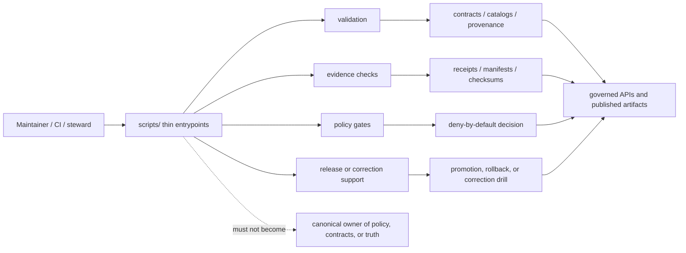

<!-- [KFM_META_BLOCK_V2]
doc_id: kfm://doc/TODO-VERIFY-UUID
title: scripts/
type: standard
version: v1
status: draft
owners: TODO(verify from .github/CODEOWNERS)
created: TODO(verify-created-date)
updated: 2026-03-22
policy_label: TODO(verify-policy-label)
related: [../README.md, ../tools/README.md, ../policy/README.md, ../contracts/README.md, ../schemas/README.md, ../tests/README.md, ../.github/workflows/README.md]
tags: [kfm, scripts, automation, validation, promotion, evidence]
notes: [Fresh repo-grounded evidence confirms scripts/README.md exists as a documentary surface; exact scripts subtree inventory and live executable coverage still need direct checkout verification.]
[/KFM_META_BLOCK_V2] -->

# scripts/

Repo-local entrypoints for repeatable, reviewable KFM validation, evidence assembly, promotion support, and operator-safe automation.

**Status:** experimental  
**Owners:** TODO(verify from `.github/CODEOWNERS`)  
      
**Quick jumps:** [Scope](#scope) · [Repo fit](#repo-fit) · [Accepted inputs](#accepted-inputs) · [Exclusions](#exclusions) · [Truth labels](#truth-labels-used-here) · [Directory tree](#directory-tree) · [Quickstart](#quickstart) · [Usage](#usage) · [Diagram](#diagram) · [Reference tables](#reference-tables) · [Task list](#task-list) · [FAQ](#faq) · [Appendix](#appendix)

> [!IMPORTANT]
> This README is **evidence-bounded**.
>
> Fresh repo-grounded project evidence confirms that `scripts/README.md` exists in the repository, but the same evidence also says the `scripts/` lane is still primarily **documentary** today: intended validator and entrypoint patterns are described, while active merge-gate workflow YAML and a verified mounted script inventory were **not** evidenced in the inspected repo snapshot.
>
> In this file, exact subdirectories and filenames are treated as **CONFIRMED** only where stated explicitly. Everything else remains **PROPOSED**, **UNKNOWN**, or **NEEDS VERIFICATION**.

## Scope

`scripts/` is the repo surface where KFM turns governed intent into **repeatable entrypoints**.

This is the home for thin helpers that make validation, evidence assembly, cross-link checks, catalog closure, promotion support, correction drills, smoke checks, and documentation gates easier to run the same way every time. It is useful precisely because it is **not** where durable business meaning should quietly accumulate.

A strong rule of thumb:

> [!TIP]
> `scripts/` should expose a governed lane, not become the lane’s sovereign owner.

That means two things stay true at the same time:

1. durable meaning belongs in stronger surfaces such as contracts, policy, packages, apps, and governed APIs
2. `scripts/` exists to make reviewed transitions and checks repeatable, visible, and fail-closed

### Current state snapshot

| Status | What current evidence supports |
| --- | --- |
| **CONFIRMED** | `scripts/README.md` exists as a repo surface |
| **CONFIRMED** | the broader `scripts/` lane is currently described more as **documented helper intent** than as a directly verified mounted script inventory |
| **CONFIRMED** | adjacent repo documentation surfaces such as `tools/README.md`, `policy/README.md`, `contracts/README.md`, `schemas/README.md`, `tests/README.md`, and `.github/workflows/README.md` are part of the current repo evidence |
| **UNKNOWN** | exact live contents of `scripts/` beyond this README |
| **UNKNOWN** | whether the named helpers below are already mounted executable files, historical targets, or partial stubs in the current checkout |

[Back to top](#scripts)

## Repo fit

| Field | Value |
| --- | --- |
| Target file | `scripts/README.md` |
| Directory role | Thin, reviewable entrypoints for validation, evidence checks, linting, release support, correction drills, and other operator-safe automation |
| Current repo fit | **CONFIRMED:** a documentary lane describing intended script responsibilities and patterns |
| Upstream context | [`../README.md`](../README.md) · [`../policy/README.md`](../policy/README.md) · [`../contracts/README.md`](../contracts/README.md) · [`../schemas/README.md`](../schemas/README.md) · [`../.github/workflows/README.md`](../.github/workflows/README.md) |
| Neighboring surfaces | [`../tools/README.md`](../tools/README.md) · [`../tests/README.md`](../tests/README.md) |
| Stronger homes for durable logic | governed APIs, contract surfaces, policy bundles, reusable packages, and long-lived app/runtime code |
| Governing trust rule | `scripts/` may orchestrate, validate, lint, verify, and emit receipts; it must not silently become the canonical owner of contract law, policy law, or public truth |
| Current verification boundary | repo-grounded documentary evidence plus March 2026 KFM manuals; live checkout contents beyond documented surfaces were not directly mounted in this session |

### Why this directory matters in KFM

KFM’s doctrine is unusually clear about **artifactization**: receipts, manifests, proof packs, policy results, release records, and correction objects are not fluff around the system — they are part of the system’s trust model.

`scripts/` is where many of those checks and transitions become operational, provided the logic remains thin, explicit, and reviewable.

## Accepted inputs

The following belong in `scripts/` **when they remain thin entrypoints**.

| Family | Typical contents | Keep it here when |
| --- | --- | --- |
| Bootstrap / environment | CI bootstrap, environment sanity checks, bounded local proof helpers | the script establishes a safe execution surface without owning long-lived runtime behavior |
| Catalog checks | STAC/DCAT/PROV validation wrappers, cross-link consistency checks | the script enforces or verifies a gate rather than redefining metadata law |
| Evidence verification | checksum verification, manifest integrity, receipt linkage checks | the script emits or verifies trust-bearing proof objects |
| Policy gates | deny-by-default wrappers, Focus readiness checks, policy smoke tests | policy semantics live elsewhere and the script makes the policy executable in a repeatable lane |
| Provenance checks | fingerprint verification, provenance validation, release linkage checks | the script validates lineage instead of inventing it |
| Documentation gates | README linting, required-section checks, render smoke tests | the helper protects reviewability and consistency |
| Release support | additive helpers for packaging, signing, attestation, rollback drills, post-deploy checks | the helper supports promotion or correction without becoming the release system itself |
| Operator utilities | bounded helpers for replay, diffing, auditing, or corrective action | the helper makes a governed action inspectable and repeatable |

### Minimum bar for anything added here

A new helper should usually satisfy all of the following:

- it has one clear purpose
- it runs non-interactively unless interaction is genuinely necessary
- it exits non-zero on failure
- it documents inputs, outputs, and side effects
- it makes destructive work unmistakable
- it emits machine-readable evidence when it changes trust state
- it does not require committed secrets
- it does not smuggle policy or schema law into shell glue

## Exclusions

| Do not keep here | Better home | Why |
| --- | --- | --- |
| Canonical contracts, JSON Schemas, API object law, registry definitions | the **single authoritative schema/contract home** declared by repo governance (`contracts/` is the stronger current candidate; `schemas/` also exists today and authority still needs explicit resolution) | machine-readable law should not hide in helper scripts |
| Policy bundles, reason codes, obligation codes, review logic | [`../policy/README.md`](../policy/README.md) and its governed descendants | policy must remain explicit, testable, and reviewable |
| Long-lived service code, workers, handlers, UI logic | app or package surfaces | runtime ownership deserves a stronger lifecycle than ad hoc entrypoints |
| Reusable validator libraries or mature CLIs | `tools/` or reusable package surfaces | shared implementation should graduate out of shell glue |
| Secrets, tokens, workstation overrides, bind-time credentials | secret manager or untracked local secret surfaces | helper directories must never become secret stores |
| Published proof packs, canonical manifests, authoritative evidence stores | release or catalog surfaces | convenience automation must not masquerade as canonical release truth |

> [!WARNING]
> If deleting a script would erase institutional knowledge about what is publishable, how policy decided, or how release evidence is reconstructed, the script is carrying too much meaning and should graduate.

## Truth labels used here

| Marker | Meaning in this README |
| --- | --- |
| **CONFIRMED** | directly supported by fresh repo-grounded evidence or directly inspectable current-session evidence |
| **INFERRED** | conservative synthesis from multiple project documents |
| **PROPOSED** | doctrine-consistent realization or structure not yet verified as mounted repo reality |
| **UNKNOWN** | not established strongly enough in the current session to present as settled fact |
| **NEEDS VERIFICATION** | a path, filename, owner, or implementation detail that should be checked in the actual checkout before merge |

## Directory tree

### Confirmed in current evidence

```text
scripts/
└── README.md
```

### Document-grounded target entrypoints and examples

> [!NOTE]
> The inventory below is **not** a mounted repo listing. These are document-grounded helper names and folder patterns already used in KFM design notes and gate examples.

```text
scripts/
├── bootstrap_ci.sh
├── catalog/
│   ├── validate_stac.py
│   └── validate_jsonld.sh
├── evidence/
│   ├── crosslink_consistency.py
│   └── verify_checksums.sh
├── lint/
│   └── md_required_sections.sh
├── policy/
│   └── focus_mode_gate.sh
└── provenance/
    ├── validate_prov.py
    └── verify_fingerprint.py
```

### How to read this tree

Use the split above intentionally:

- the first tree is the **confirmed** minimum current-state surface
- the second tree is the **document-grounded target/example lane** already named in project materials
- anything beyond that remains **UNKNOWN** until the actual checkout is inspected

That distinction matters. KFM is explicit about visible boundedness and visible uncertainty; this README should preserve that posture rather than polishing it away.

[Back to top](#scripts)

## Quickstart

Use this sequence before adding, renaming, or deleting anything under `scripts/`.

1. Verify what is actually mounted in the checkout.
2. Find every caller before renaming an entrypoint.
3. Decide whether the work belongs in `scripts/` at all.
4. Syntax-check only what actually exists.
5. Re-run the relevant gates before merge.

```bash
# 1) Inspect the lane you are about to change.
test -d scripts && find scripts -maxdepth 3 -type f | sort || echo "scripts/ not present in this checkout"

# 2) Find likely callers and references.
for d in .github docs tests tools policy contracts schemas data apps packages; do
  [ -d "$d" ] && grep -R --line-number "scripts/" "$d" || true
done

# 3) Syntax-check common helper types when present.
find scripts -type f -name "*.sh" -print0 2>/dev/null | xargs -0 -r -n1 bash -n
find scripts -type f -name "*.py" -print0 2>/dev/null | xargs -0 -r -n1 python -m py_compile

# 4) Review helper headers before changing behavior.
find scripts -maxdepth 2 -type f \( -name "*.sh" -o -name "*.py" \) \
  -exec sh -c 'echo "---- $1"; sed -n "1,40p" "$1"' _ {} \;
```

Illustrative shell header for a thin entrypoint:

```bash
#!/usr/bin/env bash
set -euo pipefail

# Purpose: one governed transition helper.
# Inputs: explicit flags or paths only.
# Output: non-zero exit on failure.
# Side effects: state changes must be documented below.
```

## Usage

### Current rule

A good script in KFM should do one or more of these well:

- normalize a repeated invocation pattern
- enforce a validation or policy gate
- emit machine-checkable evidence
- make an operator workflow safer, clearer, or more repeatable

It should not become the place where the real product or governance law secretly lives.

### Document-grounded validation lane

The following sequence is **document-grounded** and useful as a target pattern for dataset or release checks. Treat it as a verified design/example lane, not as proof that every file already exists in the current checkout.

```bash
scripts/bootstrap_ci.sh

scripts/evidence/verify_checksums.sh \
  data/processed/<theme>/<dataset>/<version> \
  SHA256SUMS.txt

scripts/catalog/validate_stac.py \
  data/catalog/stac/items/<dataset>__<version>.json

scripts/catalog/validate_jsonld.sh \
  data/catalog/dcat/datasets/<dataset>__<version>.jsonld

scripts/provenance/validate_prov.py \
  data/catalog/prov/<dataset>__<version>.prov.json

scripts/evidence/crosslink_consistency.py \
  --stac data/catalog/stac/items/<dataset>__<version>.json \
  --dcat data/catalog/dcat/datasets/<dataset>__<version>.jsonld \
  --prov data/catalog/prov/<dataset>__<version>.prov.json \
  --manifest data/processed/<theme>/<dataset>/<version>/manifest.json

scripts/policy/focus_mode_gate.sh \
  data/catalog/{stac,dcat}/**/* \
  <dataset>__<version>
```

### Working rules

#### Keep scripts thin

Parse explicit inputs, delegate durable logic outward, normalize repeated invocations, and return a clear exit status.

#### Make destructive work unmistakable

If a helper can mutate, publish, overwrite, promote, withdraw, or rebuild anything consequential, require explicit target identifiers and document side effects clearly.

#### Prefer parameterization over workstation folklore

Do not bury host-specific paths, unpublished dataset IDs, or one-person conventions in helper code.

#### Emit evidence-friendly outputs

When a helper crosses a trust boundary, it should produce stable IDs, receipts, validation reports, or other reconstructable proof objects.

#### Graduate on complexity

Move work out of `scripts/` when it starts to need shared internal modules, schema law, policy semantics, durable state, or a lifecycle that deserves stronger ownership.

## Diagram


```mermaid
flowchart LR
    A[Maintainer / CI / steward] --> B[scripts/ thin entrypoints]

    B --> C[validation]
    B --> D[evidence checks]
    B --> E[policy gates]
    B --> F[release or correction support]

    C --> G[contracts / catalogs / provenance]
    D --> H[receipts / manifests / checksums]
    E --> I[deny-by-default decision]
    F --> J[promotion, rollback, or correction drill]

    G --> K[governed APIs and published artifacts]
    H --> K
    I --> K
    J --> K

    B -. must not become .-> L[canonical owner of policy, contracts, or truth]
```

## Reference tables

### Script family model

| Family | Primary purpose | Typical proof pressure |
| --- | --- | --- |
| Bootstrap / environment | create a repeatable local or CI execution surface | pinned tools, bounded side effects, no accidental authoritative writes |
| Catalog validation | verify STAC/DCAT/PROV shape and closure | schema checks, cross-link checks, failure on broken metadata |
| Evidence verification | verify manifests, checksums, receipts, and consistency | digests, linkage, replayability |
| Policy gating | apply deny-by-default and cite-or-abstain checks | explicit allow/deny, reason codes, negative-path tests |
| Provenance checks | validate fingerprints and lineage | reproducibility, container/tool/version stamps, drift detection |
| Documentation gates | stop README or report drift from silently degrading trust | required sections, consistency, renderability |
| Release / correction support | support governed state transitions and drills | proof packs, review context, rollback visibility |

### Current-state vs target-state reading

| Layer | Current reading |
| --- | --- |
| `scripts/README.md` | **CONFIRMED** repo documentary surface |
| concrete helper inventory | **UNKNOWN** until direct checkout verification |
| named validation helpers in KFM notebooks | **PROPOSED / document-grounded target entrypoints** |
| active merge-gate workflow YAML | **not evidenced in-tree** in the freshest repo-grounded source |
| policy/contract doctrine behind the lane | **CONFIRMED** at the documentation/doctrine level |

### Graduation rules

| Smell | Better home | Why |
| --- | --- | --- |
| multiple helpers need shared implementation | reusable tool or package surface | shared logic deserves tests and versioned ownership |
| helper defines canonical object law | schema/contract surface | contract law must be machine-checkable and singular |
| helper decides allow/deny semantics | policy surface | policy must stay explicit and independently reviewable |
| helper behaves like a service | app/runtime surface | services deserve stronger deployment and operations discipline |
| helper only supports tests | tests or dedicated tooling surface | scaffolding should live near the assertions it serves |

[Back to top](#scripts)

## Task list

**Definition of done for a `scripts/` change:**

- [ ] the helper is entrypoint-sized rather than subsystem-sized
- [ ] inputs, outputs, and side effects are documented
- [ ] failure returns a non-zero exit code
- [ ] destructive behavior is explicit, not implied
- [ ] trust-bearing outputs are emitted or preserved where required
- [ ] no committed secrets or workstation-only assumptions were introduced
- [ ] callers in docs, CI, tests, or neighboring surfaces were checked against the actual checkout
- [ ] any invocation changes were reflected in docs, examples, or workflows
- [ ] negative outcomes remain first-class: deny, abstain, stale-visible, quarantined, superseded, withdrawn, or error
- [ ] correction or rollback implications were considered where trust state can change
- [ ] placeholders in the meta block were verified before stabilization

## FAQ

### Why keep `scripts/` at all?

Because a small visible entrypoint layer is better than governance-critical commands being scattered across CI YAML, local notes, or one-off operator habits.

### Why is the confirmed tree so small?

Because the freshest repo-grounded evidence confirms this README surface, but it does **not** prove the full mounted helper inventory. Showing a speculative full tree as if it were checked out would weaken KFM’s truth posture.

### Why keep document-grounded filenames at all?

Because they are already useful design evidence. They show the intended shape of validation and evidence lanes without pretending those files are all mounted today.

### Should client or public UI code ever call scripts directly?

No. KFM’s trust membrane requires public and normal client surfaces to consume governed APIs and published artifacts, not helper scripts.

### Why mention both `contracts/` and `schemas/`?

Because fresh repo-grounded evidence says both exist today as top-level documentation surfaces, and that duality is itself a design issue that must be resolved before a safe machine gate can become canonical.

## Appendix

<details>
<summary><strong>Document-grounded helper names already used in KFM examples</strong></summary>

These names are useful because they recur in KFM design notes as part of a one-shot dataset or release gate. They are **document-grounded examples**, not proof that every file already exists in the mounted checkout.

```text
scripts/bootstrap_ci.sh
scripts/catalog/validate_stac.py
scripts/catalog/validate_jsonld.sh
scripts/evidence/verify_checksums.sh
scripts/evidence/crosslink_consistency.py
scripts/lint/md_required_sections.sh
scripts/policy/focus_mode_gate.sh
scripts/provenance/validate_prov.py
scripts/provenance/verify_fingerprint.py
```

</details>

<details>
<summary><strong>Verification backlog before this README is stabilized</strong></summary>

Check these in the actual checkout before removing placeholders or promoting this README from draft:

- capture the real `scripts/` tree
- verify whether the named helpers above are mounted files, stubs, or still target-state only
- confirm caller surfaces under `.github/`, `tests/`, `tools/`, `policy/`, `contracts/`, `schemas/`, and any data/catalog lanes
- confirm whether `.github/workflows/README.md` is still placeholder-only or now accompanied by active workflow YAML
- resolve the authoritative machine-schema home if `contracts/` and `schemas/` still coexist as parallel documentation surfaces
- verify owners from `.github/CODEOWNERS`
- verify doc UUID, created date, and policy label for the meta block

</details>

[Back to top](#scripts)
