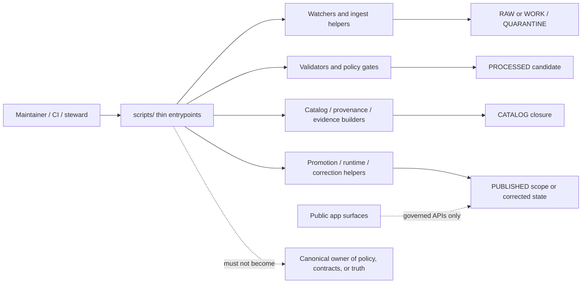

<!-- [KFM_META_BLOCK_V2]
doc_id: kfm://doc/TODO-VERIFY-UUID
title: scripts/
type: standard
version: v1
status: draft
owners: TODO(verify maintainers / release owners)
created: TODO(verify-created-date)
updated: 2026-03-18
policy_label: TODO(verify-policy-label)
related: [../README.md, ../docs/, ../tools/, ../tests/, ../policy/, ../contracts/]
tags: [kfm, scripts, automation, validation, promotion]
notes: [mounted corpus PDFs only; live repo tree, owners, doc_id, created date, policy label, and related-path presence need verification]
[/KFM_META_BLOCK_V2] -->

# scripts/

Repo-local entrypoints for repeatable KFM validation, promotion, evidence assembly, rollback, and operator-safe automation.

**Status:** experimental  
**Owners:** TODO(verify maintainers / release owners)  
      
**Quick jumps:** [Scope](#scope) · [Repo fit](#repo-fit) · [Accepted inputs](#accepted-inputs) · [Exclusions](#exclusions) · [Truth labels](#truth-labels-used-here) · [Directory tree](#directory-tree) · [Quickstart](#quickstart) · [Operating rules](#operating-rules) · [Diagram](#diagram) · [Reference tables](#reference-tables) · [Task list](#task-list) · [FAQ](#faq) · [Appendix](#appendix)

> [!IMPORTANT]
> This README is **evidence-bounded**.
>
> The mounted March 2026 KFM corpus clearly documents the role, control burden, and target-state shape of the `scripts/` surface. The current session did **not** expose a live repository checkout, so family-level doctrine is stronger than file-level repo proof. Treat exact paths, filenames, and neighbor directories here as **PROPOSED** or **NEEDS VERIFICATION** unless the checked-out repo confirms them.

## Scope

`scripts/` is the repo-local home for **thin entrypoints** that make KFM transitions repeatable, inspectable, and fail-closed.

That includes helpers for source watches, validation, catalog closure, provenance checks, release evidence, rollback or correction drills, runtime smoke checks, documentation gates, and local proof runs.

It does **not** exist to become a hidden application layer.

> [!TIP]
> Scripts are acceptable when they are **entrypoints**.
>
> Scripts are the wrong home when they become **sovereign logic**.

Two working rules follow from that:

1. Keep durable meaning in stronger surfaces such as contracts, policy bundles, packages, apps, and governed APIs.
2. Use `scripts/` to expose reviewed transitions, not to smuggle system law into shell glue.

[Back to top](#scripts)

## Repo fit

| Field | Value |
| --- | --- |
| Target file | `scripts/README.md` |
| Directory role | Thin, reviewable entrypoints for governed validation, evidence assembly, promotion support, rollback or correction support, and operator-safe automation |
| Upstream context | [`../README.md`](../README.md) · [`../docs/`](../docs/) · [`../policy/`](../policy/) · [`../contracts/`](../contracts/) *(documented target neighbors; live presence needs verification)* |
| Downstream callers or dependents | [`../.github/`](../.github/) · [`../tests/`](../tests/) · [`../tools/`](../tools/) · [`../data/`](../data/) *(documented target neighbors; live presence needs verification)* |
| Stronger promotion homes | [`../packages/`](../packages/) · [`../apps/`](../apps/) · [`../contracts/`](../contracts/) · [`../policy/`](../policy/) *(documented target neighbors; live presence needs verification)* |
| Trust rule | `scripts/` may orchestrate, validate, verify, lint, assemble evidence, or reconcile state; it must not become the canonical owner of contract law, policy law, or public truth |
| Current-session repo evidence | PDF corpus only; no directly visible repo tree, task runner, workflow YAML, schema registry, manifests, or runtime logs |

## Accepted inputs

The following belong in `scripts/` **when they remain thin entrypoints**.

| Family | Typical contents | Belongs here when |
| --- | --- | --- |
| Bootstrap and local proof helpers | `bootstrap_ci.sh`, local bring-up wrappers, environment sanity checks | The script prepares a safe execution surface without owning long-lived runtime behavior |
| Source onboarding, watcher, and ingest helpers | conditional fetchers, watcher wrappers, checkpoint or replay helpers | The script detects or acquires source changes and emits receipts rather than silently publishing |
| Transformation and packaging entrypoints | small wrappers around deterministic materializers, packagers, or build steps | The heavy logic lives elsewhere and the script exists to make the lane repeatable and auditable |
| Validation, QA, and policy gates | schema checks, STAC/DCAT/PROV validation, provenance checks, policy wrappers | The script turns gates into explicit, fail-closed entrypoints |
| Catalog, provenance, and evidence assembly | cross-link checks, digest verification, closure builders, evidence-pack helpers | The script assembles or verifies trust-bearing proof objects rather than redefining them |
| Projection, refresh, and export helpers | rebuild wrappers for tiles, graph/search/vector refresh, export packaging | The output is explicitly derived, freshness-linked, and rebuildable |
| CI/CD, GitOps, and PR control helpers | merge-gate wrappers, attestation or verification steps, post-deploy checks | The helper proves or gates promotion rather than hiding review |
| Promotion, rollback, and correction helpers | release-evidence assembly, rollback drills, correction or tombstone helpers | The script participates in governed state change and emits visible proof |
| Runtime, audit, and model-boundary helpers | smoke tests, canary checks, audit emitters, local-only model wrappers | The governed API remains the only trust-visible entrypoint |
| Documentation, report, and export helpers | docs-quality gates, README checks, receipt/report generators, evidence-viewer templates | The helper changes release trust or reviewability and therefore belongs in the governed machinery |

### Minimum bar for anything added here

A new helper should usually satisfy all of the following:

- it has one clear purpose
- it runs non-interactively unless interaction is truly required
- it exits non-zero on failure
- it documents inputs, outputs, and side effects
- it emits machine-readable evidence when it changes trust state
- it keeps destructive work explicit
- it does not require committed secrets

## Exclusions

The following do **not** belong in `scripts/`.

| Do not keep here | Better home | Why |
| --- | --- | --- |
| Long-lived service code, workers, route handlers, UI logic | [`../apps/`](../apps/) or [`../packages/`](../packages/) | Runtime ownership belongs with deployable or reusable code, not with ad hoc entrypoints |
| Canonical contracts, JSON Schemas, OpenAPI, registry definitions | [`../contracts/`](../contracts/) | Contract law should stay first-class and machine-checkable |
| Policy bundles, reason codes, obligation codes, review-class rules | [`../policy/`](../policy/) | Governance should remain explicit, reviewable, and independently testable |
| Reusable validator libraries or mature CLIs | [`../tools/`](../tools/) or [`../packages/`](../packages/) | Shared implementation should graduate out of shell glue |
| Database migrations and stateful schema evolution | [`../migrations/`](../migrations/) | Migration discipline needs its own review and rollback surface |
| Secrets, tokens, workstation overrides, bind-time credentials | secret manager or untracked local secret surfaces | Never commit trust-bearing secrets into helper directories |
| Published proof packs, final manifests, or authoritative evidence stores | designated release or evidence paths | Convenience automation must not masquerade as canonical release truth |

> [!WARNING]
> If deleting a script would erase institutional knowledge about what is publishable, what policy decided, or how release evidence is reconstructed, the script is carrying too much meaning and should graduate.

## Truth labels used here

| Marker | Meaning in this README |
| --- | --- |
| **CONFIRMED** | Grounded in the mounted March 2026 corpus or direct current-session workspace evidence |
| **PROPOSED** | Documented target-state realization or recommended shape that fits KFM doctrine but was not verified as mounted repo reality |
| **UNKNOWN** | Not established strongly enough in the current session to present as settled fact |
| **NEEDS VERIFICATION** | A path, filename, owner, or repo-local detail that should be checked in the actual checkout before merge |

## Directory tree

### Current verification boundary

> [!NOTE]
> No live repo tree was directly visible in this session. The inventory below is a **documented target shape**, not a mounted listing.

### Documented target shape

```text
scripts/
├── README.md
├── bootstrap_ci.sh
├── catalog/
│   ├── validate_jsonld.sh
│   └── validate_stac.py
├── evidence/
│   ├── crosslink_consistency.py
│   └── verify_checksums.sh
├── lint/
│   └── md_required_sections.sh
├── policy/
│   └── focus_mode_gate.sh
├── provenance/
│   ├── validate_prov.py
│   └── verify_fingerprint.py
├── release/
├── runtime/
└── rollback/
```

### How to read this tree

The explicit filenames above are **doc-grounded examples** named in the mounted corpus. The `release/`, `runtime/`, and `rollback/` families are also strongly implied, but their exact mounted filenames were not directly visible here.

A practical reading is:

- `catalog/`, `evidence/`, `provenance/`, and `policy/` hold fail-closed gate entrypoints
- `bootstrap_ci.sh` establishes a reproducible CI or local proof baseline
- `lint/` keeps docs and README surfaces from drifting away from behavior
- `release/`, `runtime/`, and `rollback/` exist to preserve governed promotion, post-deploy verification, and correction lineage

Additional documented placements outside `scripts/` also appear in the corpus — including `.github/workflows/*`, `src/pipelines/<domain>/**`, `policy/*.rego`, `data/{stac,dcat,prov}/**`, and `tools/*` — but those remain neighbor surfaces, not proof that the live repo currently contains them.

[Back to top](#scripts)

## Quickstart

Use this sequence before adding, renaming, or deleting a helper.

1. Verify that `scripts/` exists in the checkout you are actually changing.
2. Find every caller before moving or renaming an entrypoint.
3. Decide whether the work belongs in `scripts/` at all.
4. Syntax-check the helper types you touched.
5. Re-run the relevant validation, promotion, or runtime checks before merge.

```bash
# 1) Confirm the directory exists before assuming any shape.
test -d scripts && find scripts -maxdepth 3 -type f | sort || echo "scripts/ not present in this checkout"

# 2) Find likely callers without assuming every neighbor exists.
for d in .github docs tests tools policy contracts data; do
  [ -d "$d" ] && grep -R --line-number "scripts/" "$d" || true
done

# 3) Syntax-check common helper types when present.
find scripts -type f -name "*.sh" -print0 2>/dev/null | xargs -0 -r -n1 bash -n
find scripts -type f -name "*.py" -print0 2>/dev/null | xargs -0 -r -n1 python -m py_compile

# 4) Review entrypoints before changing behavior.
find scripts -maxdepth 2 -type f \( -name "*.sh" -o -name "*.py" \) \
  -exec sh -c 'echo "---- $1"; sed -n "1,30p" "$1"' _ {} \;
```

Illustrative shell header for a thin entrypoint:

```bash
#!/usr/bin/env bash
set -euo pipefail

# Purpose: one governed transition helper.
# Inputs: explicit flags or paths only.
# Output: non-zero exit on failure.
# Side effects: state changes must be documented below.
```

## Operating rules

### 1) Keep scripts thin

A good script parses explicit inputs, delegates durable logic outward, normalizes a repeated invocation pattern, and returns a clear exit status. It should not become the hidden place where the real product rules live.

### 2) Make destructive work unmistakable

If a helper can mutate, publish, overwrite, promote, withdraw, or rebuild anything consequential, require explicit target identifiers, document side effects, and prefer a dry-run mode when feasible.

### 3) Prefer parameterization over machine folklore

Do not bury workstation-only paths, hostnames, tokens, unpublished dataset IDs, or one-person conventions in helper code. Use flags, environment variables, checked-in examples, or documented defaults instead.

### 4) Emit evidence-friendly outputs

When a helper crosses a trust boundary, it should produce stable IDs, run manifests or receipts where relevant, validation reports, and enough linkage to reconstruct what happened later.

### 5) Keep derived work visibly derived

Projection refresh, export packaging, and index rebuild scripts should prove freshness and release linkage. They must not quietly become authoritative truth by convenience.

### 6) Graduate on complexity

Move work out of `scripts/` when it starts to need shared internal modules, durable workflow state, schema law, policy semantics, or a lifecycle that deserves real versioned ownership.

### 7) Keep docs, tests, and callers aligned

A helper change is not complete until the relevant docs, examples, workflows, and verification surfaces are updated in the same change stream.

## Diagram


```mermaid
flowchart LR
    A[Maintainer / CI / steward] --> B[scripts/ thin entrypoints]
    B --> C[Watchers and ingest helpers]
    B --> D[Validators and policy gates]
    B --> E[Catalog / provenance / evidence builders]
    B --> F[Promotion / runtime / correction helpers]

    C --> G[RAW or WORK / QUARANTINE]
    D --> H[PROCESSED candidate]
    E --> I[CATALOG closure]
    F --> J[PUBLISHED scope or corrected state]

    K[Public app surfaces] -. governed APIs only .-> J
    B -. must not become .-> L[Canonical owner of policy, contracts, or truth]
```

## Reference tables

### Confirmed family taxonomy

| Family | Primary purpose | Typical outputs | Typical control burden |
| --- | --- | --- | --- |
| Bootstrap / local bring-up | Establish the smallest safe runtime or proof surface | local proof logs, temporary receipts, reproducible environment state | localhost or private bind, pinned versions, minimal secrets |
| Watcher / ingest | Detect source change and acquire admissible inputs | checkpoints, update records, `ingest_receipt` | rights posture, cadence, conditional fetch, quarantine routing |
| Transform / packaging | Convert staged inputs into deterministic processed artifacts | `dataset_version`, digests, `run_manifest`, `run_receipt` | schema, CRS, unit, geometry, nullability, deterministic identity |
| Validation / policy / verification | Deny by default before promotion or publication | `validation_report`, gate reports, policy decisions | JSON Schema, OPA/Rego, fixtures, compatibility checks |
| Catalog / provenance / evidence | Assemble releasable closure and support objects | `catalog_closure`, STAC/DCAT/PROV updates, release candidates | cross-link integrity, provenance completeness, review readiness |
| Projection / refresh / export | Rebuild derived delivery layers | `projection_build_receipt`, export manifests, freshness reports | release linkage, rebuildability, stale handling |
| CI/CD / PR control | Gate merge and promotion with inspectable evidence | check runs, attestation outputs, policy results | merge-blocking checks, approvals, post-deploy verification |
| Promotion / rollback / correction | Change or reverse trust state under control | `release_manifest`, correction or tombstone evidence | signatures, lineage, rollback discipline, preserved history |
| Runtime / audit / model boundary | Keep visible trust behavior honest and model execution subordinate | `runtime_response_envelope`, `audit_ref`, smoke reports | cite-or-abstain, no direct client path, local-only/private model bind |
| Docs / report / export helpers | Preserve release trust and reviewability around docs | docs-gate reports, generated receipts, evidence-viewer templates | same trust burden as code when behavior or publication trust changes |

### Graduation rules

| Smell | Better home | Why |
| --- | --- | --- |
| multiple entrypoints need the same internal logic | [`../tools/`](../tools/) or [`../packages/`](../packages/) | shared implementation should be reusable and testable |
| the helper defines canonical contract shape | [`../contracts/`](../contracts/) | contract law should not hide in shell code |
| the helper decides allow/deny or obligation semantics | [`../policy/`](../policy/) | policy must stay explicit and independently reviewable |
| the helper behaves like a service or durable workflow engine | [`../apps/`](../apps/) or orchestrator-owned code | runtime ownership deserves a stronger lifecycle |
| the helper only exists to support tests | [`../tests/`](../tests/) or [`../tools/`](../tools/) | test scaffolding should live near the assertions it supports |

## Task list

**Definition of done for a change under `scripts/`:**

- [ ] The helper is entrypoint-sized rather than subsystem-sized
- [ ] Inputs, outputs, and side effects are documented
- [ ] Failure returns a non-zero exit code
- [ ] Destructive behavior is explicit, not implied
- [ ] The helper emits or preserves the proof objects its lane requires
- [ ] Secrets are not committed and not required from tracked files
- [ ] Caller surfaces in CI, docs, tests, or runtime were checked against the actual checkout
- [ ] Docs, examples, or workflows were updated when invocation changed
- [ ] Negative outcomes remain first-class: hold, quarantine, deny, abstain, stale-visible, superseded, withdrawn, or error
- [ ] Any path, owner, or filename placeholders were verified before stabilization

## FAQ

### Why keep `scripts/` at all?

Because a small, visible entrypoint layer is better than governance-critical commands being scattered across CI YAML, local notes, or one-off operator habits.

### Can a script write canonical truth?

Only a narrow, controlled subset should participate in canonical write, catalog closure, promotion, correction, or runtime trust outcomes — and those lanes need stronger proof and permission boundaries than ordinary helper scripts.

### Should public UI or client code call scripts directly?

No. Client-visible surfaces should consume governed APIs and approved outputs, not shell helpers or direct control scripts.

### When should something move to `tools/` or `packages/`?

When the logic becomes reusable, shared, stateful, policy-bearing, contract-bearing, or important enough to deserve its own tests and lifecycle.

### Why are so many paths marked PROPOSED or NEEDS VERIFICATION?

Because the mounted March 2026 corpus is strong on script doctrine and target-state shape, but this session did not expose a live repo checkout. The README should preserve that honesty instead of polishing it away.

## Appendix

<details>
<summary><strong>Doc-grounded example filenames already named in the mounted corpus</strong></summary>

These names are useful because they show the kinds of helper entrypoints the corpus already expects. They are **doc-grounded examples**, not proof that every file already exists in the live checkout.

```text
scripts/bootstrap_ci.sh
scripts/catalog/validate_stac.py
scripts/catalog/validate_jsonld.sh
scripts/evidence/verify_checksums.sh
scripts/evidence/crosslink_consistency.py
scripts/lint/md_required_sections.sh
scripts/policy/focus_mode_gate.sh
scripts/provenance/validate_prov.py
scripts/provenance/verify_fingerprint.py
```

The same corpus also documents adjacent target-state placements outside `scripts/`, including `.github/workflows/*`, `src/pipelines/<domain>/**`, `policy/*.rego`, `data/{stac,dcat,prov}/**`, and `tools/rollback.py`. Those are valuable neighboring signals, but they are not mounted repo facts in this session.

</details>

<details>
<summary><strong>Verification backlog before this README is stabilized</strong></summary>

Check these in the actual checkout before removing placeholders:

- confirm that `scripts/` exists and capture its real tree
- verify caller surfaces under `.github/`, `docs/`, `tests/`, `tools/`, `policy/`, and `contracts/`
- confirm which helper families are mounted today and which remain target-state only
- surface actual workflow files, task runners, manifests, and schema or fixture locations
- publish or point to one real thin-slice proof set: descriptor, receipt, validation report, catalog closure, release evidence, runtime outcome, and correction or rollback drill
- verify owners, `doc_id`, dates, policy label, and related-path metadata in the KFM meta block

</details>

[Back to top](#scripts)
