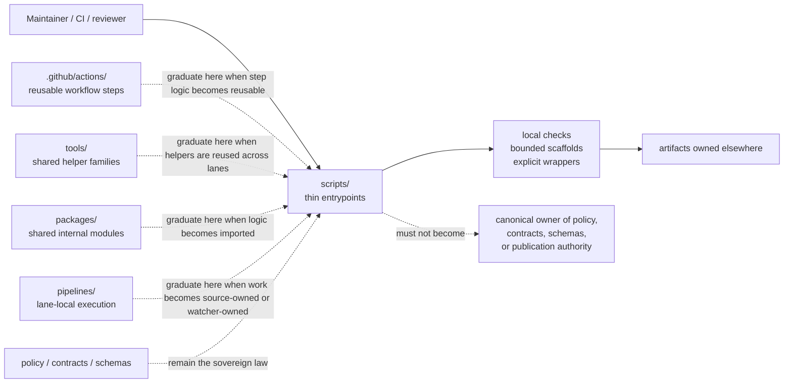

<!-- [KFM_META_BLOCK_V2]
doc_id: kfm://doc/TODO-VERIFY-UUID
title: scripts/
type: standard
version: v1
status: draft
owners: @bartytime4life
created: TODO(verify-created-date)
updated: 2026-04-23
policy_label: TODO(verify-policy-label)
related: [../README.md, ../tools/README.md, ../packages/README.md, ../pipelines/README.md, ../policy/README.md, ../contracts/README.md, ../schemas/README.md, ../tests/README.md, ../.github/actions/README.md, ../.github/workflows/README.md, ../.github/CODEOWNERS, ../Makefile]
tags: [kfm, scripts, automation, validation, promotion, evidence]
notes: [Owner and current public-main script inventory are based on retrieved repo-facing evidence; recheck against the active checkout before stabilization.]
[/KFM_META_BLOCK_V2] -->

# scripts/

Repo-local entrypoints for repeatable, reviewable KFM validation, scaffold checks, sample ingest, and operator-safe developer tasks.

| Status | Owners | Path | Evidence posture |
| --- | --- | --- | --- |
| `experimental` | `@bartytime4life` | `scripts/README.md` | Public-main evidence is surfaced; active checkout still needs verification before promotion |


**Quick jumps:** [Scope](#scope) · [Repo fit](#repo-fit) · [Accepted inputs](#accepted-inputs) · [Exclusions](#exclusions) · [Directory tree](#directory-tree) · [Quickstart](#quickstart) · [Usage](#usage) · [Diagram](#diagram) · [Reference tables](#reference-tables) · [Task list](#task-list) · [FAQ](#faq) · [Appendix](#appendix)

> [!IMPORTANT]
> `scripts/` is a **thin entrypoint lane**.
>
> It may make local checks, bounded scaffolds, and maintainer workflows easier to run. It must not become the hidden owner of policy, contracts, schemas, publication authority, long-running services, or public runtime behavior.

---

## Scope

`scripts/` is where KFM exposes small, reviewable commands for developer and maintainer tasks that are useful enough to standardize but not large enough to become their own tool, package, pipeline, service, or policy surface.

Use this directory for helpers that are:

- explicit about inputs, outputs, and side effects
- runnable from the repository root
- easy to inspect in review
- safe to call from `Makefile`, tests, or CI wrappers
- bounded enough to remain an entrypoint rather than a subsystem

The governing rule is simple:

> [!TIP]
> Keep durable meaning in stronger lanes. Keep `scripts/` as the visible, fail-closed way to invoke bounded work.

[Back to top](#scripts)

---

## Repo fit

| Relationship | Link | Role |
| --- | --- | --- |
| Parent | [`../README.md`](../README.md) | Root orientation, project posture, and verification-first navigation |
| Task surface | [`../Makefile`](../Makefile) | Human-facing command aliases that call script entrypoints |
| Ownership surface | [`../.github/CODEOWNERS`](../.github/CODEOWNERS) | Review responsibility for script changes |
| Policy lane | [`../policy/README.md`](../policy/README.md) | Executable governance and allow/deny semantics |
| Contract lane | [`../contracts/README.md`](../contracts/README.md) | Human-readable meaning for trust-bearing objects |
| Schema lane | [`../schemas/README.md`](../schemas/README.md) | Machine-readable validation surfaces |
| Test lane | [`../tests/README.md`](../tests/README.md) | Fixture and regression expectations |
| Tooling lane | [`../tools/README.md`](../tools/README.md) | Reusable helper families and deeper validation logic |
| Package lane | [`../packages/README.md`](../packages/README.md) | Shared importable implementation logic |
| Pipeline lane | [`../pipelines/README.md`](../pipelines/README.md) | Lane-local source execution, watchers, and transform flows |
| Action lane | [`../.github/actions/README.md`](../.github/actions/README.md) | Reusable workflow steps |
| Workflow lane | [`../.github/workflows/README.md`](../.github/workflows/README.md) | CI orchestration documentation |

### Boundary statement

`scripts/` may call stronger surfaces. It does not replace them.

| Stronger surface | `scripts/` may do | `scripts/` must not do |
| --- | --- | --- |
| `contracts/` | call a contract validator | redefine object meaning |
| `schemas/` | invoke schema checks | create a second schema authority |
| `policy/` | run a policy test | decide policy semantics inline |
| `tools/` | wrap a reusable tool | hide reusable logic in shell glue forever |
| `packages/` | call imported logic through a stable CLI | become an untested importable library |
| `pipelines/` | trigger a local dry-run or fixture check | own long-running source execution |
| `data/receipts/` | write bounded local receipts when documented | publish, promote, or treat receipts as proof |
| `data/proofs/` | reference proof objects | mint release proof implicitly |

[Back to top](#scripts)

---

## Accepted inputs

Good inputs are explicit, reviewable, and repo-relative.

| Input type | Accepted here | Notes |
| --- | --- | --- |
| CLI arguments | Yes | Prefer named arguments or documented positional arguments |
| Environment variables | Yes, when documented | Defaults should be safe and visible |
| Local fixtures | Yes | Prefer no-network fixtures for repeatable checks |
| Repo-owned paths | Yes | Use paths relative to the repository root |
| Make targets | Yes | Keep `Makefile` as a contributor-friendly entrypoint |
| Validation reports | Yes | Emit stable JSON or clear text when downstream tools need it |
| Receipts | Yes, when bounded | Receipts preserve process memory; they are not release proof by themselves |

### What good input looks like

```bash
bash scripts/sample_ingest.sh example_fixture
python3 scripts/validate_schemas.py
make catalog-validate
```

### What bad input looks like

```bash
# Bad: hidden workstation state, secret-bearing path, unclear side effects.
bash scripts/publish_everything.sh ~/Desktop/private-data
```

[Back to top](#scripts)

---

## Exclusions

| Does **not** belong here | Put it in | Why |
| --- | --- | --- |
| Canonical schema definitions | [`../schemas/README.md`](../schemas/README.md) | Validation law must stay singular |
| Human semantic contracts | [`../contracts/README.md`](../contracts/README.md) | Object meaning should not hide inside scripts |
| Allow/deny policy decisions | [`../policy/README.md`](../policy/README.md) | Policy must remain reviewable as policy |
| Reusable helper logic | [`../tools/README.md`](../tools/README.md) or [`../packages/README.md`](../packages/README.md) | Shared behavior needs tests and ownership |
| Long-running watchers or source ETL | [`../pipelines/README.md`](../pipelines/README.md) | Source-owned execution needs receipts, cadence, and lane docs |
| Public API handlers or runtime services | app/runtime lanes | Public clients must use governed APIs, not repo-local helpers |
| Release promotion shortcuts | release/proof/policy surfaces | Promotion is a governed state transition, not a helper side effect |
| Secrets, credentials, or workstation-only paths | nowhere | Scripts must remain safe to clone, review, and run in CI-like contexts |
| Silent auto-fixers for doctrine, policy, or publication state | nowhere | KFM requires inspectable correction and rollback, not hidden mutation |

> [!WARNING]
> A helper that silently mutates trust state, publishes artifacts, decides policy, or rewrites canonical meaning has crossed out of `scripts/`.

[Back to top](#scripts)

---

## Directory tree

### Public-main evidence surfaced for this lane

```text
scripts/
├── README.md
├── bootstrap.sh
├── catalog_validate.py
├── dev_up.sh
├── sample_ingest.sh
└── validate_schemas.py
```

> [!NOTE]
> Recheck this tree in the active checkout before changing this README from `draft` to `review` or `published`.

### Adjacent public-tree cues

```text
.github/actions/
├── action.yml
├── metadata-validate/
├── metadata-validate-v2/
├── opa-gate/
├── provenance-guard/
├── sbom-produce-and-sign/
├── src/
└── README.md

.github/workflows/
└── README.md

packages/
├── catalog/
├── domain/
├── evidence/
├── genealogy_ingest/
├── indexers/
├── ingest/
├── policy/
└── README.md

pipelines/
├── README.md
├── hls-ndvi/
├── soils/
├── ssurgo_to_catchment.md
└── wbd-huc12-watcher/
```

<details>
<summary><strong>Document-grounded future helper shape</strong></summary>

These names appear in KFM design notes as useful target-state or illustrative script families. They are **not** claimed as current checked-in files unless the active checkout proves them.

```text
scripts/
├── catalog/
│   ├── validate_stac.py
│   └── validate_jsonld.sh
├── evidence/
│   ├── crosslink_consistency.py
│   └── verify_checksums.sh
├── lint/
│   └── md_required_sections.sh
├── policy/
│   └── focus_mode_gate.sh
└── provenance/
    ├── validate_prov.py
    └── verify_fingerprint.py
```

</details>

[Back to top](#scripts)

---

## Quickstart

Run commands from the repository root.

```bash
# Bootstrap the local docs-first environment.
make bootstrap

# Parse repo JSON and run the current focused schema-header check.
make validate-schemas

# Run the contract-facing unittest discovery path exposed by the root Makefile.
make test

# Confirm the current "no local services" posture.
make dev-up

# Materialize a local sample ingest artifact and matching receipt.
make sample-ingest SOURCE=example_fixture

# Verify the visible catalog README scaffold.
make catalog-validate
```

Inspect the active checkout before changing helper behavior:

```bash
# Inspect the current lane.
find scripts -maxdepth 1 -type f | sort

# Review direct script contents.
sed -n '1,120p' scripts/bootstrap.sh
sed -n '1,200p' scripts/validate_schemas.py
sed -n '1,120p' scripts/dev_up.sh
sed -n '1,200p' scripts/sample_ingest.sh
sed -n '1,200p' scripts/catalog_validate.py

# Check likely callers before renaming, moving, or deleting entrypoints.
for d in .github docs tests tools policy contracts schemas data apps packages pipelines infra examples; do
  [ -d "$d" ] && grep -R --line-number "scripts/" "$d" || true
done
```

> [!CAUTION]
> `make sample-ingest` writes local files under `data/work/sample_ingest/`. Inspect or clean those outputs before committing.

[Back to top](#scripts)

---

## Usage

### Current checked-in behavior

#### `bootstrap.sh`

Minimal environment sanity check.

It verifies that `python3` is available and prints a docs-first note that no package install step is currently defined.

```bash
bash scripts/bootstrap.sh
```

#### `validate_schemas.py`

Repo JSON parse check plus one focused schema-header assertion.

```bash
python3 scripts/validate_schemas.py
```

Current scope:

- walks `*.json` files under the repo root
- fails on invalid JSON
- checks the correction notice schema header at `schemas/contracts/v1/correction/correction_notice.schema.json`

It is intentionally **not** full JSON Schema enforcement for the entire repository.

#### `dev_up.sh`

Explicit no-service posture helper.

```bash
bash scripts/dev_up.sh
```

Current scope:

- states that no long-running local services are currently defined
- routes maintainers back to `make test` and `make validate-schemas`

#### `sample_ingest.sh`

Bounded local scaffold helper.

```bash
bash scripts/sample_ingest.sh example_fixture
```

Current scope:

- copies `schemas/tests/fixtures/contracts/v1/valid/correction_notice.supersession.valid.json`
- writes a local sample JSON under `data/work/sample_ingest/`
- writes a small receipt JSON beside the sample artifact

#### `catalog_validate.py`

Catalog README scaffold presence check.

```bash
python3 scripts/catalog_validate.py
```

Current scope verifies that these files exist:

```text
data/catalog/README.md
data/catalog/stac/README.md
data/catalog/dcat/README.md
data/catalog/prov/README.md
```

It verifies scaffold presence, not full STAC/DCAT/PROV semantic validity.

### Working rules

#### Keep scripts thin

Parse explicit inputs, delegate durable logic outward, normalize repeated invocation, and return a clear exit status.

#### Make destructive work unmistakable

If a helper can mutate, publish, overwrite, promote, withdraw, or rebuild anything consequential, require explicit target identifiers and document side effects clearly.

#### Prefer parameters over workstation folklore

Do not bury host-specific paths, unpublished dataset IDs, one-person conventions, or hidden dependencies in helper code.

#### Emit evidence-friendly outputs

When a helper crosses a trust boundary, it should emit stable IDs, receipts, validation reports, or other reconstructable proof objects.

#### Graduate on complexity

Move work out of `scripts/` when it starts to need shared modules, schema law, policy semantics, durable state, reusable workflow-step contracts, or lane-specific execution ownership.

[Back to top](#scripts)

---

## Diagram


```mermaid
flowchart LR
    A[Maintainer / CI / reviewer] --> B[scripts/<br/>thin entrypoints]
    B --> C[local checks<br/>bounded scaffolds<br/>explicit wrappers]
    C --> D[artifacts owned elsewhere]

    J[".github/actions/<br/>reusable workflow steps"] -. "graduate here when step logic becomes reusable" .-> B
    K["tools/<br/>shared helper families"] -. "graduate here when helpers are reused across lanes" .-> B
    L["packages/<br/>shared internal modules"] -. "graduate here when logic becomes imported" .-> B
    M["pipelines/<br/>lane-local execution"] -. "graduate here when work becomes source-owned or watcher-owned" .-> B
    N["policy / contracts / schemas"] -. "remain the sovereign law" .-> B

    B -. "must not become" .-> O[canonical owner of policy,<br/>contracts, schemas,<br/>or publication authority]
```

[Back to top](#scripts)

---

## Reference tables

### Current executable entrypoints

Labels here reflect retrieved public-main evidence. Verify against the active branch before promotion.

| Command | Underlying file | Current behavior | Truth posture |
| --- | --- | --- | --- |
| `make bootstrap` | `./scripts/bootstrap.sh` | checks for `python3` and prints a docs-first bootstrap note | **CONFIRMED** in surfaced public-main evidence |
| `make validate-schemas` | `python3 ./scripts/validate_schemas.py` | parses repo JSON and checks the correction notice schema header | **CONFIRMED** in surfaced public-main evidence |
| `make test` | `python3 -m unittest discover -s tests/contracts -p 'test_*.py' -v` | runs contract-facing unittest discovery | **CONFIRMED** for target; deeper suite breadth **NEEDS VERIFICATION** |
| `make dev-up` | `./scripts/dev_up.sh` | explicitly reports that no long-running local services are defined | **CONFIRMED** in surfaced public-main evidence |
| `make sample-ingest SOURCE=<name>` | `./scripts/sample_ingest.sh <name>` | writes local sample ingest JSON plus receipt under `data/work/sample_ingest/` | **CONFIRMED** in surfaced public-main evidence |
| `make catalog-validate` | `python3 ./scripts/catalog_validate.py` | checks for catalog README scaffold presence | **CONFIRMED** in surfaced public-main evidence |

### Public-state reading for this lane

| Layer | Current reading |
| --- | --- |
| `scripts/` tree | **CONFIRMED:** surfaced public-main evidence shows five executable helpers plus `README.md` |
| `/scripts/` ownership | **CONFIRMED:** surfaced evidence maps `/scripts/` to `@bartytime4life` |
| Helper depth | **CONFIRMED:** helpers are small, explicit, and bounded |
| Long-running dev services | **CONFIRMED:** `dev_up.sh` states none are currently defined |
| Bootstrap depth | **CONFIRMED:** `bootstrap.sh` checks for `python3` and prints a docs-first message |
| Richer script families | **PROPOSED / document-grounded examples**, not current public-tree proof |

### Graduation rules

| Smell | Better home | Why |
| --- | --- | --- |
| Multiple entrypoints need shared implementation | `../tools/` or `../packages/` | Shared logic deserves tests, ownership, and reuse boundaries |
| Helper defines canonical object law | `../contracts/` or `../schemas/` | Contract and schema law must remain singular |
| Helper decides allow/deny semantics | `../policy/` | Policy must stay explicit and independently reviewable |
| Helper becomes a reusable workflow step | `../.github/actions/` | Step-level reuse should stay visible |
| Helper becomes source-local execution | `../pipelines/` | Watchers and transforms need lane-local receipts and cadence |
| Helper starts a real service | app/runtime/infra surface | Services need stronger deployment and operations discipline |
| Helper produces release-significant proof | proof/release surfaces | Proof is not the same thing as process memory or scaffolding |

[Back to top](#scripts)

---

## Task list

### Definition of done for a `scripts/` change

- [ ] The helper is entrypoint-sized rather than subsystem-sized.
- [ ] Inputs, outputs, and side effects are documented.
- [ ] Failure returns a non-zero exit code.
- [ ] Destructive behavior is explicit, not implied.
- [ ] Trust-bearing outputs are emitted or preserved where required.
- [ ] No committed secrets or workstation-only assumptions were introduced.
- [ ] Callers in docs, CI, tests, and neighboring surfaces were checked against the active checkout.
- [ ] Invocation changes were reflected in docs, examples, actions, workflows, or `Makefile` where relevant.
- [ ] Anything reusable enough to belong in `tools/`, `packages/`, `.github/actions/`, or `pipelines/` was explicitly left in `scripts/` for a documented reason.
- [ ] Negative outcomes remain first-class: deny, abstain, stale-visible, quarantined, superseded, withdrawn, or error.
- [ ] Correction or rollback implications were considered where trust state can change.
- [ ] Placeholders in the meta block were verified before stabilization.

### Pre-publish checks for this README

- [ ] Verify `doc_id`, `created`, and `policy_label`.
- [ ] Re-run the `find scripts -maxdepth 1 -type f | sort` inventory in the active checkout.
- [ ] Verify `@bartytime4life` remains the correct owner for `/scripts/`.
- [ ] Confirm `Makefile` targets still map to the documented files.
- [ ] Confirm relative links from `scripts/README.md` resolve.
- [ ] Confirm no script has outgrown the thin-entrypoint boundary.
- [ ] Confirm no workflow, route, or runtime enforcement is implied without direct evidence.

[Back to top](#scripts)

---

## FAQ

### Why keep `scripts/` at all?

Because a small visible entrypoint layer is better than governance-critical commands being scattered across local notes, ad hoc terminal history, or copy-pasted CI snippets.

### Are these scripts already lane-sized automation systems?

No. The surfaced helpers are intentionally small. They validate presence, parse JSON, materialize a sample scaffold, or state explicit non-behavior. That is useful, but it is not proof of deep workflow or runtime maturity.

### Should public clients or UI surfaces call these scripts directly?

No. Public and ordinary client surfaces should consume governed APIs, released artifacts, and trust-visible payloads. Repo-local helpers are maintainer tools, not public runtime interfaces.

### What changed from the earlier README-only posture?

The surfaced public-main evidence now shows `scripts/` as a small executable helper lane rather than only a placeholder README. This document preserves that stronger reading while keeping the boundary explicit.

### Can a script write files?

Yes, when the side effect is bounded, documented, reviewable, and safe. `sample_ingest.sh` is the current example: it writes local work artifacts and a receipt under `data/work/sample_ingest/`.

### When should a helper move out of `scripts/`?

Move it when it becomes reusable logic, source-owned execution, policy law, schema authority, release proof, a workflow action, or a service.

[Back to top](#scripts)

---

## Appendix

<details>
<summary><strong>Document-grounded helper names used in KFM examples</strong></summary>

These names are useful design evidence. They show the intended shape of validation and evidence lanes without claiming current checked-in presence.

```text
scripts/catalog/validate_stac.py
scripts/catalog/validate_jsonld.sh
scripts/evidence/verify_checksums.sh
scripts/evidence/crosslink_consistency.py
scripts/lint/md_required_sections.sh
scripts/policy/focus_mode_gate.sh
scripts/provenance/validate_prov.py
scripts/provenance/verify_fingerprint.py
```

</details>

<details>
<summary><strong>Verification backlog before stabilization</strong></summary>

- Verify active-branch script inventory.
- Verify current owner and CODEOWNERS coverage.
- Verify exact `Makefile` command mappings.
- Verify caller references in `.github/`, `docs/`, `tests/`, `tools/`, `policy/`, `contracts/`, `schemas/`, `data/`, `apps/`, `packages/`, `pipelines/`, `infra/`, and `examples/`.
- Decide whether `make test` should stay documented here or move entirely to `tests/README.md`.
- Resolve meta block placeholders.
- Promote any repeated, reusable helper logic into `tools/` or `packages/`.
- Keep future script-family examples marked **PROPOSED** until the files are actually present.

</details>

[Back to top](#scripts)