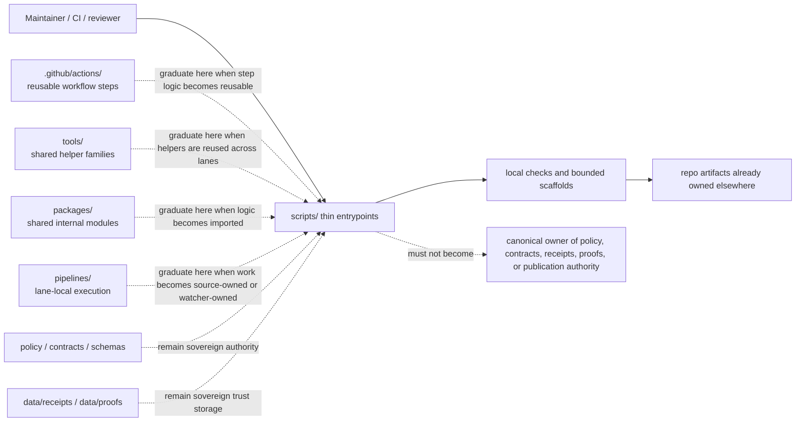

<!-- [KFM_META_BLOCK_V2]
doc_id: kfm://doc/NEEDS_VERIFICATION
title: scripts
type: standard
version: v1
status: draft
owners: @bartytime4life
created: NEEDS_VERIFICATION
updated: 2026-04-16
policy_label: public
related: [
  ../README.md,
  ../tools/README.md,
  ../packages/README.md,
  ../pipelines/README.md,
  ../policy/README.md,
  ../contracts/README.md,
  ../schemas/README.md,
  ../tests/README.md,
  ../data/receipts/README.md,
  ../data/proofs/README.md,
  ../tools/probes/README.md,
  ../tools/validators/README.md,
  ../tools/validators/promotion_gate/README.md,
  ../tools/attest/README.md,
  ../tools/ci/README.md,
  ../tools/docs/README.md,
  ../.github/README.md,
  ../.github/actions/README.md,
  ../.github/workflows/README.md,
  ../.github/watchers/README.md,
  ../.github/CODEOWNERS,
  ../Makefile
]
tags: [kfm, scripts, automation, orchestration, validation, receipts, proofs, promotion]
notes: [
  Public main now exposes checked-in entrypoints under scripts/ in addition to README.md; this revision preserves that stronger inventory truth while tightening the thin-entrypoint and non-sovereign boundary.
  Updated to align the lane with newer watcher, receipt/proof, validator, attestation, docs-tooling, CI-renderer, and workflow boundary documentation.
  doc_id, created date, and any stronger claims about non-public callers, unpublished automation, or branch-local additional scripts remain NEEDS VERIFICATION until the checked-out branch proves them directly.
]
[/KFM_META_BLOCK_V2] -->

<a id="top"></a>

# `scripts/`

Repo-local thin entrypoints for repeatable, reviewable KFM validation, scaffold checks, sample ingest, and operator-safe developer tasks.

> [!IMPORTANT]
> **Status:** experimental  
> **Owners:** `@bartytime4life`  
> **Path:** `scripts/README.md`  
> **Repo fit:** thin orchestration and entrypoint lane adjacent to [`../tools/README.md`](../tools/README.md), [`../packages/README.md`](../packages/README.md), [`../pipelines/README.md`](../pipelines/README.md), [`../.github/actions/README.md`](../.github/actions/README.md), [`../.github/workflows/README.md`](../.github/workflows/README.md), and [`../.github/watchers/README.md`](../.github/watchers/README.md)  
> **Quick jumps:** [Scope](#scope) · [Repo fit](#repo-fit) · [Accepted inputs](#accepted-inputs) · [Exclusions](#exclusions) · [Current verified snapshot](#current-verified-snapshot) · [Directory tree](#directory-tree) · [Quickstart](#quickstart) · [Usage](#usage) · [Diagram](#diagram) · [Reference tables](#reference-tables) · [Task list](#task-list--definition-of-done) · [FAQ](#faq) · [Appendix](#appendix)


> [!TIP]
> Keep the KFM trust split visible here:
>
> **script entrypoint ≠ tool lane ≠ package/module boundary ≠ pipeline/runtime lane ≠ action wrapper ≠ workflow authority**
>
> - `scripts/` normalizes small repeatable commands
> - `tools/` owns reusable helper families
> - `packages/` owns shared internal modules
> - `pipelines/` owns lane-local execution
> - `.github/actions/` owns repo-local reusable workflow steps
> - `.github/workflows/` owns orchestration and permissions
> - receipts remain process memory
> - proofs remain higher-order trust objects

> [!WARNING]
> `scripts/` is a real executable lane on current public `main`, not a README-only scaffold.
>
> But it still should stay:
>
> - thin
> - explicit
> - non-sovereign
> - fail-closed
>
> This lane must not become the hidden home of policy meaning, contract law, release authority, publication logic, or trust-object ownership.

---

## Scope

`scripts/` is where KFM exposes a small number of **repo-local entrypoints** for repeatable developer and maintainer work.

This lane exists so that common local tasks are:

- explicit
- reviewable
- callable from `Makefile`, maintainers, CI, or adjacent automation
- small enough to understand in one pass
- honest about inputs, outputs, and side effects

Today’s public tree shows a narrow but real helper family. These entrypoints:

- validate basic preconditions
- parse JSON
- check visible catalog scaffolds
- materialize a local sample ingest plus receipt
- preserve an explicit “no local services defined” posture

### What belongs here

- small shell or Python entrypoints
- repeatable local wrappers around existing repo truth
- bounded validation commands
- sample scaffolds for local operator understanding
- thin orchestration across stronger lanes such as `tools/`, `tests/`, or `.github/actions/`
- local process-memory emission such as sample receipts, when clearly non-sovereign
- commands that normalize a repeated maintainer task without hiding the real underlying behavior

### What does **not** belong here

- canonical contract or schema law
- policy bundles or decision meaning
- lane-local pipelines that deserve their own runtime ownership
- shared imported logic that belongs in `packages/`
- reusable helper families that belong in `tools/`
- reusable workflow steps that belong in `.github/actions/`
- multi-job orchestration that belongs in `.github/workflows/`
- release authority, publication shortcuts, or self-approving promotion logic
- receipt/proof storage ownership

### Working rule

Use `scripts/` when the main job is:

> **normalize one small repeated repo task**

Move out of `scripts/` when the main job becomes:

> **own shared logic, own lane execution, own policy, own contracts, own workflow choreography, or own trust-bearing state**

[Back to top](#top)

---

## Repo fit

| Field | Value |
| --- | --- |
| Target file | `scripts/README.md` |
| Directory role | Thin, reviewable local entrypoints for bounded validation, sanity checks, scaffold checks, sample ingest, and developer-safe orchestration |
| Current public repo fit | A small checked-in executable lane with five visible entrypoints plus `README.md` |
| Root posture | [`../README.md`](../README.md) |
| Adjacent helper family | [`../tools/README.md`](../tools/README.md) |
| Shared module boundary | [`../packages/README.md`](../packages/README.md) |
| Lane-local execution boundary | [`../pipelines/README.md`](../pipelines/README.md) |
| Canonical policy truth | [`../policy/README.md`](../policy/README.md) |
| Canonical contract truth | [`../contracts/README.md`](../contracts/README.md) and [`../schemas/README.md`](../schemas/README.md) |
| Verification surfaces | [`../tests/README.md`](../tests/README.md) and sibling test-family docs |
| Trust-boundary docs | [`../data/receipts/README.md`](../data/receipts/README.md), [`../data/proofs/README.md`](../data/proofs/README.md) |
| Repo-local reusable steps | [`../.github/actions/README.md`](../.github/actions/README.md) |
| Workflow orchestration | [`../.github/workflows/README.md`](../.github/workflows/README.md) |
| Watcher/process-memory adjacency | [`../.github/watchers/README.md`](../.github/watchers/README.md) |
| Ownership signal | [`../.github/CODEOWNERS`](../.github/CODEOWNERS) |
| Task alias surface | [`../Makefile`](../Makefile) |

### Why this lane matters

Even small entrypoints matter in KFM because maintainers and CI tend to repeat them. If the entrypoint layer stays honest and bounded, it strengthens the repo. If it quietly accumulates business law, trust-state mutation, or hidden orchestration, it weakens reviewability.

### Current checked-in entrypoint family

| Entrypoint | Current checked-in behavior | Keep it here because |
| --- | --- | --- |
| `bootstrap.sh` | verifies `python3` is present and prints a docs-first bootstrap note | minimal environment sanity check, not an installer or runtime owner |
| `validate_schemas.py` | parses repo JSON files and checks the correction notice schema header | thin validation wrapper over visible repo artifacts |
| `dev_up.sh` | explicitly says no long-running local services are currently defined | preserves an honest no-service posture |
| `sample_ingest.sh` | writes a local sample ingest JSON plus a matching receipt under `data/work/sample_ingest/` | bounded local scaffold without claiming real onboarding or promotion |
| `catalog_validate.py` | asserts visible catalog README scaffold presence under `data/catalog/` and child lanes | scaffold integrity check, not catalog law |

### Boundary pressure is higher now

The lane should stay thinner now that adjacent ownership is clearer:

- reusable workflow-step contracts → `.github/actions/`
- workflow choreography and gate sequencing → `.github/workflows/`
- reusable helper families → `tools/`
- imported/shared internal code → `packages/`
- source-owned execution and watcher lanes → `pipelines/`
- sovereign trust/state meaning → `policy/`, `contracts/`, `schemas/`, `data/receipts/`, `data/proofs/`

[Back to top](#top)

---

## Accepted inputs

Use this directory for artifacts that remain **entrypoint-sized**.

| Family | Typical contents | Keep it here when |
| --- | --- | --- |
| Bootstrap / environment checks | interpreter presence checks, explicit no-op startup posture | the command sets expectations without becoming an installer or runtime manager |
| Thin validation wrappers | JSON parse checks, scaffold checks, bounded lint/validation entrypoints | the logic stays thin and the law lives elsewhere |
| Sample local scaffolds | fixture copies, local workdir stubs, sample receipts | the result is obviously local and non-authoritative |
| Task aliases | maintainers’ normalized entrypoints over one small task | the wrapper improves repeatability without hiding behavior |
| Bounded orchestration | one or two-step handoffs to stronger tool lanes | orchestration stays small and transparent |
| Trust-aware local outputs | process-memory receipts or reports tied to one local task | outputs remain reconstructable and non-sovereign |

### Input rules

1. One clear purpose per entrypoint.
2. Inputs, outputs, and side effects must be explicit.
3. Exit non-zero on failure.
4. Keep secrets external and least-privilege.
5. If the script emits receipts, proofs, summaries, or decisions, keep those roles explicit instead of flattening them.
6. Graduate out of `scripts/` as soon as shared logic or lane ownership becomes the real burden.

[Back to top](#top)

---

## Exclusions

| Do not keep here | Better home | Why |
| --- | --- | --- |
| Canonical contracts or schema law | [`../contracts/README.md`](../contracts/README.md), [`../schemas/README.md`](../schemas/README.md) | machine-readable law should not hide in wrappers |
| Policy bundles or allow/deny semantics | [`../policy/README.md`](../policy/README.md) | policy must stay explicit and independently reviewable |
| Reusable helper families or mature CLIs | [`../tools/README.md`](../tools/README.md) | shared helper behavior deserves stronger lifecycle and tests |
| Reusable workflow-step contracts | [`../.github/actions/README.md`](../.github/actions/README.md) | repeated workflow steps should stay visible as local actions |
| Workflow choreography and merge gates | [`../.github/workflows/README.md`](../.github/workflows/README.md) | job orchestration belongs in workflows |
| Lane-local fetch / transform / validate / emit flows | [`../pipelines/README.md`](../pipelines/README.md) | source-local execution deserves source-local ownership |
| Imported internal modules | [`../packages/README.md`](../packages/README.md) | hidden shared behavior inside entrypoints weakens review |
| Long-lived services or operators | app / runtime / infra surfaces | services need stronger operational discipline |
| Receipt or proof storage | [`../data/receipts/README.md`](../data/receipts/README.md), [`../data/proofs/README.md`](../data/proofs/README.md) | scripts may emit or reference them, not own them |
| Reviewer summary rendering | [`../tools/ci/README.md`](../tools/ci/README.md) | rendering belongs in CI helper lanes |
| Trust verification logic | [`../tools/attest/README.md`](../tools/attest/README.md), [`../tools/validators/README.md`](../tools/validators/README.md) | keep signing and validation logic durable and testable outside wrappers |

> [!IMPORTANT]
> If deleting one script would erase important knowledge about publishability, policy meaning, or trust-state reconstruction, the script is carrying too much authority for this lane.

[Back to top](#top)

---

## Current verified snapshot

The current public `main` branch proves the following:

- `scripts/` exists and currently contains:
  - `README.md`
  - `bootstrap.sh`
  - `catalog_validate.py`
  - `dev_up.sh`
  - `sample_ingest.sh`
  - `validate_schemas.py`
- `/.github/CODEOWNERS` assigns `/scripts/` to `@bartytime4life`
- the root `Makefile` standardizes local entrypoints for:
  - `bootstrap`
  - `validate-schemas`
  - `test`
  - `dev-up`
  - `sample-ingest`
  - `catalog-validate`
- `bootstrap.sh` checks for `python3` and prints a docs-first message
- `dev_up.sh` explicitly says no long-running local services are currently defined
- `catalog_validate.py` checks for catalog README scaffolds, not full STAC/DCAT/PROV semantic validity
- `sample_ingest.sh` writes a local sample JSON plus receipt under `data/work/sample_ingest/`
- `validate_schemas.py` parses repo JSON and performs one focused schema-header assertion
- `.github/actions/` is now visible as a placeholder-heavy adjacent action seam
- `.github/workflows/` remains README-only on current public `main`
- `packages/` and `pipelines/` are visibly real adjacent surfaces, which sharpens the graduation boundary for anything in `scripts/`

### What is still **not** proven from current evidence

- deeper caller coverage across non-public branches
- additional unpublished or branch-local scripts
- merge-blocking workflow wiring for these entrypoints
- any hidden runtime service owned by `scripts/`
- whether `make test` should remain documented here long-term versus only under `tests/`
- mounted receipt/proof-aware script behaviors beyond the visible sample-ingest process-memory pattern

[Back to top](#top)

---

## Directory tree

### Confirmed on current public `main`

```text
scripts/
├── README.md
├── bootstrap.sh
├── catalog_validate.py
├── dev_up.sh
├── sample_ingest.sh
└── validate_schemas.py
```

### Adjacent public-tree cues

```text
.github/actions/
├── action.yml
├── metadata-validate/
├── metadata-validate-v2/
├── opa-gate/
├── provenance-guard/
├── sbom-produce-and-sign/
├── src/
└── README.md

.github/workflows/
└── README.md

packages/
├── catalog/
├── domain/
├── evidence/
├── genealogy_ingest/
├── indexers/
├── ingest/
├── policy/
└── README.md

pipelines/
├── README.md
├── hls-ndvi/
├── soils/
├── ssurgo_to_catchment.md
└── wbd-huc12-watcher/
```

### Document-grounded target/example shape (**PROPOSED**)

> [!NOTE]
> The names below recur in KFM design notes and example validation lanes. They remain useful as target-state or illustrative entrypoints, but they are **not** current public-tree proof.

```text
scripts/
├── catalog/
│   ├── validate_stac.py
│   └── validate_jsonld.sh
├── evidence/
│   ├── crosslink_consistency.py
│   └── verify_checksums.sh
├── lint/
│   └── md_required_sections.sh
├── policy/
│   └── focus_mode_gate.sh
└── provenance/
    ├── validate_prov.py
    └── verify_fingerprint.py
```

[Back to top](#top)

---

## Quickstart

Use the current checked-in entrypoints first.

```bash
# Bootstrap the local docs-first environment.
make bootstrap

# Parse every JSON file in the repo and verify the correction notice schema header.
make validate-schemas

# Run the contract-facing unittest discovery path exposed by the root Makefile.
make test

# Confirm the current "no local services" posture.
make dev-up

# Materialize a local sample ingest artifact and matching receipt.
make sample-ingest SOURCE=example_fixture

# Verify the visible catalog README scaffold.
make catalog-validate
```

Inspect what is actually mounted before changing helper behavior:

```bash
# Inspect the current lane.
find scripts -maxdepth 1 -type f | sort

# Review direct script contents.
sed -n '1,120p' scripts/bootstrap.sh
sed -n '1,200p' scripts/validate_schemas.py
sed -n '1,120p' scripts/dev_up.sh
sed -n '1,200p' scripts/sample_ingest.sh
sed -n '1,200p' scripts/catalog_validate.py

# Check likely callers before renaming or removing an entrypoint.
for d in .github docs tests tools policy contracts schemas data apps packages pipelines infra examples; do
  [ -d "$d" ] && grep -R --line-number "scripts/" "$d" || true
done

# Re-read adjacent boundary docs before widening this lane.
sed -n '1,220p' tools/README.md
sed -n '1,220p' packages/README.md
sed -n '1,220p' pipelines/README.md
sed -n '1,220p' .github/actions/README.md
sed -n '1,220p' .github/workflows/README.md
sed -n '1,220p' .github/watchers/README.md
sed -n '1,220p' data/receipts/README.md
sed -n '1,220p' data/proofs/README.md
```

[Back to top](#top)

---

## Usage

### Current checked-in behavior

#### `bootstrap.sh`

A minimal environment sanity check. It verifies that `python3` is available and prints a docs-first note that no package install step is currently defined.

#### `validate_schemas.py`

Walks repo `*.json` files, fails on invalid JSON, and performs one explicit schema-header check against `schemas/contracts/v1/correction/correction_notice.schema.json`.

It is intentionally **not** full JSON Schema enforcement for the entire repo.

#### `dev_up.sh`

Deliberately anti-magical. It says no long-running local services are currently defined and routes the user to validation/test commands instead of pretending a runtime exists.

#### `sample_ingest.sh`

A bounded local scaffold. It copies `schemas/tests/fixtures/contracts/v1/valid/correction_notice.supersession.valid.json` into `data/work/sample_ingest/` and writes a small receipt JSON beside it.

#### `catalog_validate.py`

Checks that the catalog README scaffold exists at:

- `data/catalog/README.md`
- `data/catalog/stac/README.md`
- `data/catalog/dcat/README.md`
- `data/catalog/prov/README.md`

It verifies visible scaffold presence, not full semantic validity.

### Working rules

#### Keep scripts thin

Parse explicit inputs, delegate durable logic outward, normalize repeated invocations, and return a clear exit status.

#### Make destructive work unmistakable

If a helper can mutate, publish, overwrite, promote, withdraw, or rebuild anything consequential, require explicit target identifiers and document side effects clearly.

#### Prefer parameterization over folklore

Do not bury host-specific paths, unpublished dataset IDs, or one-person conventions in helper code.

#### Emit evidence-friendly outputs

When a helper crosses a trust boundary, it should produce stable IDs, receipts, validation reports, or other reconstructable process-memory artifacts.

#### Graduate on complexity

Move work out of `scripts/` when it starts to need:

- shared internal modules
- schema law
- policy semantics
- durable state
- reusable workflow-step contracts
- lane-specific execution ownership
- trust verification behavior
- summary rendering logic

### Trust-surface rule

Where a script emits or consumes trust-bearing values:

- keep receipts as **process memory**
- keep proofs as **higher-order trust objects**
- keep machine decisions as **machine decisions**
- keep rendered summaries as **secondary review aids**
- do not flatten all of them into one generic “artifact passed” story

[Back to top](#top)

---

## Diagram


```mermaid
flowchart LR
    A[Maintainer / CI / reviewer] --> B[scripts/ thin entrypoints]
    B --> C[local checks and bounded scaffolds]
    C --> D[repo artifacts already owned elsewhere]

    J[.github/actions/<br/>reusable workflow steps] -. graduate here when step logic becomes reusable .-> B
    K[tools/<br/>shared helper families] -. graduate here when helpers are reused across lanes .-> B
    L[packages/<br/>shared internal modules] -. graduate here when logic becomes imported .-> B
    M[pipelines/<br/>lane-local execution] -. graduate here when work becomes source-owned or watcher-owned .-> B
    N[policy / contracts / schemas] -. remain sovereign authority .-> B
    R[data/receipts / data/proofs] -. remain sovereign trust storage .-> B

    B -. must not become .-> O[canonical owner of policy, contracts, receipts, proofs, or publication authority]
```

[Back to top](#top)

---

## Reference tables

### Current executable entrypoints

| Command | Underlying file | What it currently does | Truth posture |
| --- | --- | --- | --- |
| `make bootstrap` | `./scripts/bootstrap.sh` | checks for `python3` and prints a docs-first bootstrap note | **CONFIRMED** |
| `make validate-schemas` | `python3 ./scripts/validate_schemas.py` | parses repo JSON and checks the correction notice schema header | **CONFIRMED** |
| `make test` | `python3 -m unittest discover -s tests/contracts -p 'test_*.py' -v` | runs contract-facing unittest discovery | **CONFIRMED** for the Makefile target; deeper suite breadth remains **NEEDS VERIFICATION** |
| `make dev-up` | `./scripts/dev_up.sh` | explicitly reports that no long-running local services are defined | **CONFIRMED** |
| `make sample-ingest SOURCE=<name>` | `./scripts/sample_ingest.sh <name>` | writes a local sample ingest JSON plus receipt under `data/work/sample_ingest/` | **CONFIRMED** |
| `make catalog-validate` | `python3 ./scripts/catalog_validate.py` | checks for catalog README scaffold presence | **CONFIRMED** |

### Public-state reading for this lane

| Layer | Current reading |
| --- | --- |
| `scripts/` tree | **CONFIRMED:** current public `main` shows five executable helpers plus `README.md` |
| `/scripts/` ownership | **CONFIRMED:** `.github/CODEOWNERS` maps `/scripts/` to `@bartytime4life` |
| helper depth | **CONFIRMED:** helpers are small, explicit, and bounded |
| long-running dev services | **CONFIRMED:** `dev_up.sh` states none are currently defined |
| installer/bootstrap depth | **CONFIRMED:** `bootstrap.sh` only checks for `python3` and prints a docs-first message |
| trust-output posture | **CONFIRMED:** sample-ingest emits a local receipt-like process-memory artifact |
| richer script families from doctrine | **PROPOSED / document-grounded examples**, not current checked-in public inventory |

### Graduation rules

| Smell | Better home | Why |
| --- | --- | --- |
| multiple entrypoints need shared implementation | `tools/` or `packages/` | shared logic deserves tests, ownership, and reuse boundaries |
| helper defines canonical object law | `contracts/` / schema surfaces | contract law must remain singular and machine-checkable |
| helper decides allow / deny semantics | `policy/` | policy must stay explicit and independently reviewable |
| helper becomes a reusable workflow step | `.github/actions/` | step-level reuse should stay visible and reviewable |
| helper becomes source-local execution | `pipelines/` | lane-specific runtime deserves its own receipt and publish story |
| helper starts a real service | app / runtime / infra surface | services deserve stronger deployment and operations discipline |
| helper emits trust-bearing summaries or annotations beyond thin wrappers | `tools/ci/` | rendering belongs in its own helper lane |
| helper verifies trust objects or signatures durably | `tools/attest/` / `tools/validators/` | keep verification logic testable outside wrapper scripts |

[Back to top](#top)

---

## Task list / definition of done

A `scripts/` change is ready when:

- [ ] the helper is entrypoint-sized rather than subsystem-sized
- [ ] inputs, outputs, and side effects are documented
- [ ] failure returns a non-zero exit code
- [ ] destructive behavior is explicit, not implied
- [ ] trust-bearing outputs are emitted or preserved where required
- [ ] no committed secrets or workstation-only assumptions were introduced
- [ ] callers in docs, CI, tests, and neighboring surfaces were checked against the actual checkout
- [ ] any invocation changes were reflected in docs, examples, actions, or workflows where relevant
- [ ] anything reusable enough to belong in `tools/`, `packages/`, `.github/actions/`, or `pipelines/` was explicitly left in `scripts/` for a documented reason
- [ ] negative outcomes remain first-class: deny, abstain, stale-visible, quarantined, superseded, withdrawn, or error when relevant to the helper
- [ ] correction or rollback implications were considered where trust state can change
- [ ] receipts, proofs, decisions, and summaries remain distinct when they participate in one helper path
- [ ] placeholders in the meta block were verified before stabilization

[Back to top](#top)

---

## FAQ

### Why keep `scripts/` at all?

Because a small visible entrypoint layer is better than governance-critical commands being scattered across terminal history, private notes, or copied CI snippets.

### What changed from the older README posture?

The biggest correction is factual: current public `main` is no longer README-only here. The lane now exposes a small checked-in helper family, and the README should describe that reality directly.

### Are these scripts already lane-sized automation systems?

No. The checked-in helpers are intentionally small. They validate presence, parse JSON, materialize a sample scaffold, or state explicit non-behavior. That is useful, but it is not proof of deep workflow or runtime maturity.

### Should public clients or UI surfaces call these scripts directly?

No. Public and normal client surfaces should consume governed APIs and published artifacts, not repo-local helper scripts.

### Why mention receipts and proofs here?

Because even thin wrappers can flatten trust-state semantics if they emit local receipts, summaries, or verification notes carelessly. Mentioning them keeps process memory and higher-order proof roles explicit.

### Should `make test` stay documented here?

For now, yes, because the root `Makefile` currently exposes it as a repo entrypoint alongside the other script-backed commands. The long-term placement of its documentation still deserves branch-level review.

[Back to top](#top)

---

## Appendix

<details>
<summary><strong>Document-grounded helper names already used in KFM examples</strong></summary>

These names are useful design evidence. They show the intended shape of richer validation and evidence lanes without claiming current public-tree presence.

```text
scripts/catalog/validate_stac.py
scripts/catalog/validate_jsonld.sh
scripts/evidence/verify_checksums.sh
scripts/evidence/crosslink_consistency.py
scripts/lint/md_required_sections.sh
scripts/policy/focus_mode_gate.sh
scripts/provenance/validate_prov.py
scripts/provenance/verify_fingerprint.py
```

</details>

<details>
<summary><strong>Verification backlog before this README is stabilized</strong></summary>

Check these against the checked-out branch before promoting this README from draft:

- verify `doc_id`, `created`, and `policy_label` values for the meta block
- recheck the exact caller surfaces that reference each checked-in script
- confirm whether additional non-public or branch-local scripts exist beyond current public `main`
- decide whether `make test` should remain documented here as a sibling task entrypoint or move entirely into `tests/README.md`
- resolve whether any current script has outgrown `scripts/` and should graduate into `tools/`, `packages/`, `.github/actions/`, or `pipelines/`

</details>

[Back to top](#top)
