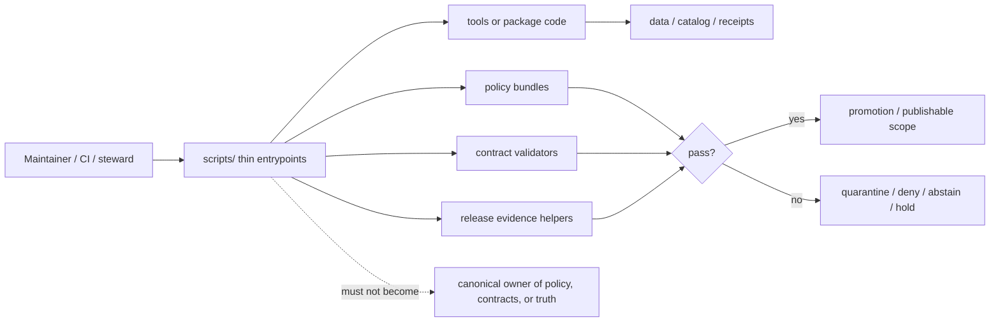

<!-- [KFM_META_BLOCK_V2]
doc_id: kfm://doc/TODO-VERIFY-UUID
title: scripts/
type: standard
version: v1
status: draft
owners: TODO(verify maintainers / release owners)
created: YYYY-MM-DD
updated: YYYY-MM-DD
policy_label: TODO(verify-policy-label)
related: [../README.md, ../docs/, ../tools/, ../tests/, ../policy/, ../contracts/]
tags: [kfm, scripts, automation, validation, promotion]
notes: [doc_id, owners, dates, policy_label, and related paths need verification; current session exposed corpus PDFs but not a live repo checkout]
[/KFM_META_BLOCK_V2] -->

# scripts/

Repo-local helper entrypoints for repeatable KFM validation, rebuild, promotion, packaging, and operator-safe automation.

**Status:** experimental  
**Owners:** TODO(verify maintainers / release owners)  
      
**Quick jumps:** [Scope](#scope) · [Repo fit](#repo-fit) · [Accepted inputs](#accepted-inputs) · [Exclusions](#exclusions) · [Directory tree](#directory-tree) · [Quickstart](#quickstart) · [Usage rules](#usage-rules) · [Diagram](#diagram) · [Tables](#tables) · [Task list](#task-list) · [FAQ](#faq) · [Appendix](#appendix)

> [!IMPORTANT]
> This README is **evidence-bounded**.
>
> In the current session, KFM doctrine and March 2026 realization notes document `scripts/` as a target automation surface, but the live repository checkout was **not** directly visible. Read statements in this file with these labels:
>
> - **CONFIRMED** — grounded in mounted doctrine or current-session workspace evidence
> - **PROPOSED** — documented target shape or implementation direction consistent with KFM doctrine
> - **UNKNOWN** — not established strongly enough in the current session
> - **NEEDS VERIFICATION** — a path, owner, caller, or filename detail that should be checked in the actual checkout before merge

## Scope

`scripts/` is the reviewed home for **thin helper entrypoints** that make repeated KFM work safer, more consistent, and easier to run in CI or by maintainers.

That includes entrypoints for work such as validation, cross-link checks, provenance verification, repo hygiene, release-evidence assembly, controlled promotion helpers, safe bootstrap flows, and other narrowly scoped operator routines.

What it must **not** become: a shadow application layer.

If a helper starts owning domain rules, policy meaning, schema law, durable service behavior, or substantial reusable logic, it should graduate into a stronger long-lived home such as [`../tools/`](../tools/), [`../packages/`](../packages/), [`../apps/`](../apps/), [`../contracts/`](../contracts/), or [`../policy/`](../policy/) — all **NEEDS VERIFICATION** in the live checkout.

### Working rule

Scripts are acceptable when they are **entrypoints**.

Scripts are the wrong home when they become **sovereign logic**.

[Back to top](#scripts)

## Repo fit

| Field | Value |
| --- | --- |
| Target path | `scripts/README.md` |
| Directory role | Thin repo-local entrypoints for validation, provenance checks, release-evidence assembly, bootstrap, and maintainer-safe automation |
| Upstream context | [`../README.md`](../README.md) · [`../docs/`](../docs/) · [`../policy/`](../policy/) · [`../contracts/`](../contracts/) *(documented target neighbors; live presence **NEEDS VERIFICATION**)* |
| Downstream callers / dependents | [`../.github/`](../.github/) · [`../tests/`](../tests/) · [`../tools/`](../tools/) · [`../data/`](../data/) *(documented target neighbors; live presence **NEEDS VERIFICATION**)* |
| Trust rule | `scripts/` may orchestrate, lint, validate, verify, or assemble evidence, but it must not become the canonical owner of policy law, contract law, source truth, or release truth |
| Current-session repo evidence | No live repo checkout was directly visible; treat all neighbor paths and contents as **NEEDS VERIFICATION** unless the checked-out repository confirms them |

### Why this directory exists

KFM repeatedly prefers **inspectable automation** over hidden operator folklore.

A well-kept `scripts/` directory gives maintainers a visible, reviewable home for:

- repeated validation entrypoints
- fail-closed policy and promotion checks
- provenance and receipt verification
- explicit bootstrap steps for CI or local review
- small release helpers that assemble evidence rather than invent it

## Accepted inputs

The following belong in `scripts/` when they remain thin, reviewable, and repo-local.

| Category | Typical contents | Why it belongs here |
| --- | --- | --- |
| Bootstrap helpers | `scripts/bootstrap_ci.sh`, environment/setup wrappers, tool bootstrap entrypoints | They prepare execution without becoming the policy or contract source of truth |
| Catalog and metadata validation | STAC/DCAT/JSON-LD checks, catalog cross-link checks, schema wrapper calls | They make promotion gates repeatable and fail-closed |
| Evidence and provenance checks | checksum verification, fingerprint verification, cross-link integrity, receipt checks | They support auditable publication and runtime trust |
| Policy gate wrappers | focused shell or Python entrypoints that call canonical policy bundles | They expose policy execution without relocating policy meaning |
| Release-evidence assembly | helpers that attach evidence, write release index entries, or package proof artifacts | They make governed delivery repeatable while keeping release state explicit |
| Repo hygiene and doc checks | Markdown required-section checks, naming/path consistency checks, lightweight QA | They keep documentation and artifact surfaces aligned |
| Maintainer-only rebuild helpers | deterministic rebuild / reindex wrappers for governed outputs | Useful **only** when they remain narrow, explicit, and easy to audit |

### Minimum expectations for anything added here

A new helper should usually satisfy all of the following:

- it has one clear purpose
- it runs non-interactively unless interaction is essential
- it exits non-zero on failure
- it makes destructive work explicit
- it documents inputs, outputs, and side effects
- it delegates durable logic outward instead of hoarding it
- it is syntax-checkable, testable, or both
- it does not require committed secrets

## Exclusions

The following do **not** belong in `scripts/`.

| Do not keep here | Put it instead | Why |
| --- | --- | --- |
| Long-lived service code, workers, API routes, UI behavior | [`../apps/`](../apps/) or [`../packages/`](../packages/) | Runtime logic should live in versioned code surfaces, not ad hoc entrypoints |
| Canonical policy bundles, registries, allow/deny law, obligation codes | [`../policy/`](../policy/) | Governance must stay explicit and independently reviewable |
| JSON Schemas, OpenAPI files, event envelopes, contract profiles | [`../contracts/`](../contracts/) | Contract law should stay first-class and machine-readable |
| Reusable validators or CLIs with their own lifecycle | [`../tools/`](../tools/) | Once a helper becomes a tool, promote it |
| Release manifests, proof packs, correction notices, final receipts | designated release / evidence paths | Publication evidence must not masquerade as convenience automation |
| Database migrations | [`../migrations/`](../migrations/) | Schema evolution needs its own execution and review discipline |
| Secrets, tokens, workstation overrides | untracked local secret surfaces / secret manager | Never commit secrets into helper paths |

> [!WARNING]
> A script is the wrong home if deleting it would erase institutional knowledge about:
>
> - what is publishable
> - what a contract means
> - what policy decided
> - what a runtime surface owes the user
> - how to reconstruct release evidence

## Status markers used in this README

| Marker | Meaning here |
| --- | --- |
| **CONFIRMED** | Grounded in mounted doctrine or direct current-session workspace evidence |
| **PROPOSED** | A documented target shape or implementation direction that fits that doctrine |
| **UNKNOWN** | Not established strongly enough in the current session |
| **NEEDS VERIFICATION** | A path, owner, caller, or filename detail that should be checked in the actual checkout |

## Directory tree

### Current verification boundary

> [!NOTE]
> The current session did **not** expose a live KFM repo tree. The inventory below is therefore a **documented target shape**, assembled from March 2026 corpus examples, not a live directory listing.

### PROPOSED documented shape

```text
scripts/
├── README.md
├── bootstrap_ci.sh
├── catalog/
│   ├── validate_stac.py
│   └── validate_jsonld.sh
├── evidence/
│   ├── crosslink_consistency.py
│   └── verify_checksums.sh
├── lint/
│   └── md_required_sections.sh
├── policy/
│   └── focus_mode_gate.sh
├── provenance/
│   ├── validate_prov.py
│   └── verify_fingerprint.py
├── release/
│   ├── attach_evidence.sh
│   └── write_index_entry.sh
└── validators/
    ├── has_metadata.sh
    ├── spdx_ok.sh
    ├── spec_hash_valid.sh
    ├── run_receipt_valid.sh
    ├── stac_valid.sh
    ├── example_record_valid.sh
    ├── domain_freshness.sh
    └── emit_error_json.sh
```

### Interpreting the tree

Two script-family patterns appear across the mounted March 2026 notes:

1. A **catalog / evidence / provenance / policy** family used in dataset and promotion gates.
2. A **validators / release** family used in fail-closed PR gates and release-evidence assembly.

The live checkout may contain one, both, or a refactored successor. Verify before stabilizing this README.

[Back to top](#scripts)

## Quickstart

Use this sequence before adding or editing a helper.

1. Confirm the directory exists in the checkout you are actually changing.
2. Find every caller before renaming or moving an entrypoint.
3. Decide whether the work belongs in `scripts/` at all.
4. Prefer the smallest wrapper that keeps semantics explicit.
5. Re-run syntax, lint, and the relevant promotion or validation checks before merge.

```bash
# 1) Confirm the helper surface before assuming anything.
test -d scripts && find scripts -maxdepth 3 -type f | sort || echo "scripts/ not present in this checkout"

# 2) Discover likely callers without assuming every neighbor path exists.
for d in .github docs tests configs policy data; do
  [ -d "$d" ] && grep -R --line-number "scripts/" "$d" || true
done

# 3) Syntax-check common helper types when present.
find scripts -type f -name "*.sh" -print0 2>/dev/null | xargs -0 -r -n1 bash -n
find scripts -type f -name "*.py" -print0 2>/dev/null | xargs -0 -r -n1 python -m py_compile

# 4) Review human-facing entrypoints before changing behavior.
find scripts -maxdepth 2 -type f \( -name "*.sh" -o -name "*.py" \) \
  -exec sh -c 'echo "---- $1"; sed -n "1,20p" "$1"' _ {} \;
```

Illustrative header pattern for a small shell entrypoint:

```bash
#!/usr/bin/env bash
set -euo pipefail

# Purpose: verify one governed KFM artifact lane.
# Inputs: explicit flags or paths only.
# Output: non-zero exit on failure.
# Side effects: none unless explicitly documented below.
```

## Usage rules

### 1) Keep scripts thin

A good script usually does one or more of these and little else:

- parse explicit inputs
- call reviewed tool or package code
- normalize repeated invocation patterns
- convert failure into a clear exit status
- emit paths, digests, or receipts a human can inspect later

It should **not** become the hidden place where real system behavior lives.

### 2) Make destructive work explicit

If a helper can mutate, publish, rebuild, delete, promote, overwrite, or invalidate anything meaningful, require one or more of:

- explicit target paths or identifiers
- a dry-run mode when feasible
- visible operator acknowledgement for risky actions
- machine-readable logs or proof objects where appropriate
- unmistakable failure exit codes

### 3) Prefer parameterization over machine folklore

Do not bury assumptions such as:

- absolute local paths
- workstation-only defaults
- unpublished dataset IDs
- one-person branch conventions
- credentials
- hostnames or ports that belong in configuration

Use flags, environment variables, documented defaults, or checked-in examples instead.

### 4) Emit evidence-friendly outputs

For governed-path work, prefer outputs that can be inspected later:

- explicit success / failure exit codes
- stable stdout or JSON error output
- deterministic file paths
- echoed dataset/version identifiers
- digests, run IDs, or manifest references when relevant

### 5) Graduate on complexity

Move a helper out of `scripts/` when it starts to need any of the following:

- shared internal modules
- real unit-test depth beyond smoke checks
- schema or policy semantics
- stateful service ownership
- wider reuse than a repo-local entrypoint deserves

A thin wrapper can stay here. A subsystem should not.

### 6) Keep docs and callers aligned

When invocation changes, update the same change stream that touches:

- CI callers under [`.github/`](../.github/)
- docs and runbooks under [`../docs/`](../docs/)
- tests under [`../tests/`](../tests/)
- data/package examples that shell out to the helper
- sibling READMEs that point to it

## Diagram


```mermaid
flowchart LR
    A[Maintainer / CI / steward] --> B[scripts/ thin entrypoints]
    B --> C[tools or package code]
    B --> D[policy bundles]
    B --> E[contract validators]
    B --> F[release evidence helpers]
    C --> G[data / catalog / receipts]
    D --> H{pass?}
    E --> H
    F --> H
    H -->|yes| I[promotion / publishable scope]
    H -->|no| J[quarantine / deny / abstain / hold]
    B -. must not become .-> K[canonical owner of policy, contracts, or truth]
```

## Tables

### Documented script families named in the corpus

| Family | Doc-grounded examples | Primary job | Live repo status |
| --- | --- | --- | --- |
| Catalog / evidence / provenance gate | `bootstrap_ci.sh`, `evidence/verify_checksums.sh`, `catalog/validate_stac.py`, `catalog/validate_jsonld.sh`, `provenance/validate_prov.py`, `evidence/crosslink_consistency.py`, `policy/focus_mode_gate.sh`, `lint/md_required_sections.sh` | Validate dataset and catalog closure, provenance, cross-links, README minimums, and Focus readiness | **NEEDS VERIFICATION** |
| Validators / release gate | `validators/has_metadata.sh`, `spdx_ok.sh`, `spec_hash_valid.sh`, `run_receipt_valid.sh`, `stac_valid.sh`, `example_record_valid.sh`, `domain_freshness.sh`, `validators/emit_error_json.sh`, `release/attach_evidence.sh`, `release/write_index_entry.sh` | Fail-closed PR gating, machine-readable failure output, and release-evidence assembly | **NEEDS VERIFICATION** |

### Graduation rules

| Smell | Better home | Why |
| --- | --- | --- |
| multiple scripts need the same internal logic | [`../tools/`](../tools/) or [`../packages/`](../packages/) | shared implementation should be reusable and testable |
| script defines contract shape or envelope meaning | [`../contracts/`](../contracts/) | canonical structure belongs in machine-readable contract surfaces |
| script defines allow/deny semantics or obligation codes | [`../policy/`](../policy/) | governance must remain explicit and reviewable |
| script behaves like a service or long-running worker | [`../apps/`](../apps/) | runtime ownership belongs with deployable code |
| script exists only to support tests | [`../tests/`](../tests/) or [`../tools/`](../tools/) | test helpers should stay near the assertions they support |

## Task list

**Definition of done for changes under `scripts/`:**

- [ ] The helper is genuinely entrypoint-sized and not secretly a subsystem
- [ ] Inputs, outputs, and side effects are documented
- [ ] Failure returns a non-zero exit code
- [ ] Destructive behavior is explicit, not implied
- [ ] Secrets are not committed and not required from tracked files
- [ ] Shared logic was moved to a stronger home when complexity grew
- [ ] Callers in CI, docs, tests, or release paths were checked against the actual checkout
- [ ] Docs, examples, or workflows were updated when invocation changed
- [ ] The helper preserves KFM’s fail-closed posture instead of introducing convenience bypasses
- [ ] Placeholder owners, dates, and path assumptions were verified before stabilization

## FAQ

### Why keep `scripts/` if the directory is small?

Because a small, explicit helper surface is better than repeated tribal commands spread across PR comments, local notes, or CI YAML.

### Why not put every validator here?

Because some validators are really reusable tools or package code. `scripts/` is for thin entrypoints, not for hiding durable implementation.

### Can a script call policy or contract validators?

Yes. That is one of the best uses of this directory. The script should call those surfaces, not redefine them.

### Where should secrets live?

Not here. Use the repo’s secret-management surface, untracked local secret files, or CI secret store.

### When should a script move to `tools/`?

When it has meaningful reuse, internal modules, or a lifecycle independent of one repo-local entrypoint.

### Can this directory exist before helpers land?

Yes — as a documentation and review boundary — but the actual checkout still decides whether `scripts/` is already present, empty, partially populated, or renamed.

## Appendix

<details>
<summary><strong>Doc-grounded script examples already named in March 2026 notes</strong></summary>

These names are useful because they show the kinds of entrypoints the mounted corpus already expects, even though the live checkout was not directly visible in this session.

```text
scripts/bootstrap_ci.sh
scripts/evidence/verify_checksums.sh
scripts/evidence/crosslink_consistency.py
scripts/catalog/validate_stac.py
scripts/catalog/validate_jsonld.sh
scripts/lint/md_required_sections.sh
scripts/provenance/validate_prov.py
scripts/provenance/verify_fingerprint.py
scripts/policy/focus_mode_gate.sh
scripts/validators/has_metadata.sh
scripts/validators/spdx_ok.sh
scripts/validators/spec_hash_valid.sh
scripts/validators/run_receipt_valid.sh
scripts/validators/stac_valid.sh
scripts/validators/example_record_valid.sh
scripts/validators/domain_freshness.sh
scripts/validators/emit_error_json.sh
scripts/release/attach_evidence.sh
scripts/release/write_index_entry.sh
```

Interpret these as **doc-grounded examples**, not as a claim that every file already exists in the live repo.

</details>

<details>
<summary><strong>Authoring guardrails for maintainers</strong></summary>

Keep wording stable with current KFM doctrine:

- trust membrane
- authoritative versus derived
- evidence-linked public claims
- cite-or-abstain
- fail-closed
- promotion as a governed state change
- docs as production surface

Prefer:

- explicit placeholders over invented values
- tiny wrappers over shell frameworks
- relative links over hard-coded repo URLs
- wrappers around reviewed code instead of hidden business logic
- visible UNKNOWNs over polished overclaiming

</details>

[Back to top](#scripts)
