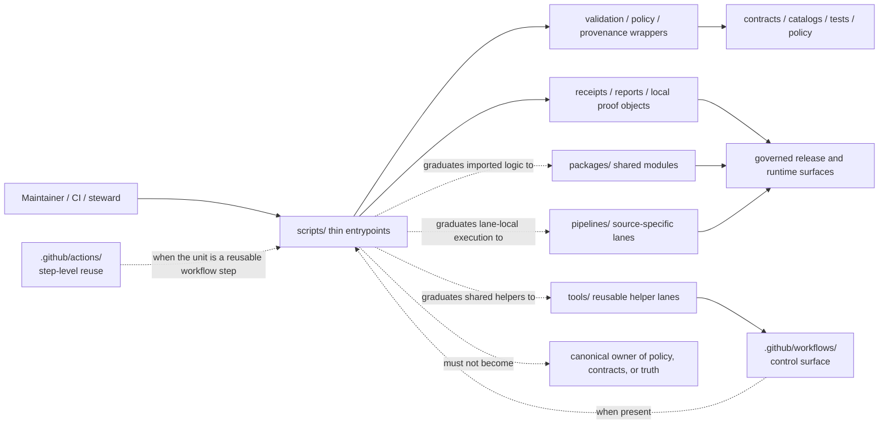

<!-- [KFM_META_BLOCK_V2]
doc_id: kfm://doc/TODO-VERIFY-UUID
title: scripts/
type: standard
version: v1
status: draft
owners: @bartytime4life
created: TODO(verify-created-date)
updated: 2026-04-04
policy_label: TODO(verify-policy-label)
related: [../README.md, ../tools/README.md, ../packages/README.md, ../pipelines/README.md, ../policy/README.md, ../contracts/README.md, ../schemas/README.md, ../tests/README.md, ../.github/actions/README.md, ../.github/workflows/README.md, ../.github/CODEOWNERS]
tags: [kfm, scripts, automation, validation, promotion, evidence]
notes: [Current public main inspection showed scripts/ containing README.md only; .github/CODEOWNERS assigns /scripts/ to @bartytime4life; adjacent public docs now also define .github/actions/ as a repo-local action seam, packages/ as a shared module boundary, and pipelines/ as a lane-specific execution surface; deeper executable inventory still needs direct checkout verification.]
[/KFM_META_BLOCK_V2] -->

# scripts/

Repo-local entrypoints for repeatable, reviewable KFM validation, evidence assembly, promotion support, and operator-safe automation.

**Status:** experimental  
**Owners:** `@bartytime4life`  
**Path:** `scripts/README.md`  
        
**Quick jumps:** [Scope](#scope) · [Repo fit](#repo-fit) · [Accepted inputs](#accepted-inputs) · [Exclusions](#exclusions) · [Truth labels](#truth-labels-used-here) · [Directory tree](#directory-tree) · [Quickstart](#quickstart) · [Usage](#usage) · [Diagram](#diagram) · [Reference tables](#reference-tables) · [Task list](#task-list) · [FAQ](#faq) · [Appendix](#appendix)

> [!IMPORTANT]
> This README is **evidence-bounded**.
>
> Current public `main` inspection shows `scripts/` containing `README.md` only. March–April 2026 KFM doctrine and repo docs still support `scripts/` primarily as a **thin entrypoint lane**: a place for bounded wrappers and reviewable invocation surfaces, not a proven public-main executable inventory.
>
> Current public docs now also make the surrounding boundary clearer than earlier drafts did: `.github/actions/` is the repo-local action seam, `packages/` is the shared internal module boundary, and `pipelines/` is the lane-specific execution surface. That sharpens the role of `scripts/`; it does not widen it.

## Scope

`scripts/` is the repo surface where KFM turns governed intent into **repeatable entrypoints**.

This is the home for thin helpers that make validation, evidence assembly, cross-link checks, catalog closure, promotion support, correction drills, smoke checks, and documentation gates easier to run the same way every time. It is useful precisely because it is **not** where durable business meaning should quietly accumulate.

A strong rule of thumb:

> [!TIP]
> `scripts/` should expose a governed lane, not become the lane’s sovereign owner.

That means two things stay true at the same time:

1. durable meaning belongs in stronger surfaces such as contracts, policy, packages, apps, governed APIs, and lane-specific pipelines
2. `scripts/` exists to make reviewed transitions and checks repeatable, visible, and fail-closed

### Current public snapshot

| Status | What current evidence supports |
| --- | --- |
| **CONFIRMED** | public `main` currently shows `scripts/` containing `README.md` only |
| **CONFIRMED** | `.github/CODEOWNERS` currently assigns `/scripts/` to `@bartytime4life` |
| **CONFIRMED** | `.github/workflows/` is a neighboring control lane and currently shows `README.md` only on public `main` |
| **CONFIRMED** | `.github/actions/` is now a visible adjacent repo-local action seam, but public `main` still shows it as placeholder-heavy rather than fully implemented |
| **CONFIRMED** | `tools/` is a sibling helper lane; current public tree shows `attest/`, `catalog/`, `ci/`, `diff/`, `docs/`, `probes/`, `validators/`, and `README.md` |
| **CONFIRMED** | `packages/` is a visible shared internal module boundary with public child README surfaces |
| **CONFIRMED** | `pipelines/` is a visible lane-specific execution surface with `soils/gssurgo-ks/` and `wbd-huc12-watcher/` child lane READMEs |
| **NEEDS VERIFICATION** | deeper contents inside sibling helper lanes, local checkout parity, and branch-only artifacts not visible on current public `main` |
| **UNKNOWN** | whether the document-grounded helper names below already exist on a non-public branch, in a local working tree, or only as target-state patterns |

[Back to top](#scripts)

## Repo fit

| Field | Value |
| --- | --- |
| Target file | `scripts/README.md` |
| Directory role | Thin, reviewable entrypoints for validation, evidence checks, linting, release support, correction drills, and other operator-safe automation |
| Current public repo fit | **CONFIRMED:** a documentary lane with README-backed expectations and a currently README-only public tree |
| Upstream context | [`../README.md`](../README.md) · [`../policy/README.md`](../policy/README.md) · [`../contracts/README.md`](../contracts/README.md) · [`../schemas/README.md`](../schemas/README.md) · [`../tests/README.md`](../tests/README.md) |
| Sibling helper lane | [`../tools/README.md`](../tools/README.md) — the stronger reusable-helper surface once entrypoints stop being thin |
| Adjacent shared module surface | [`../packages/README.md`](../packages/README.md) — shared internal logic should graduate here once it becomes imported rather than merely invoked |
| Adjacent execution surface | [`../pipelines/README.md`](../pipelines/README.md) — lane-specific ingest, watcher, normalize, and package flows belong there when they stop being generic wrappers |
| Adjacent control surfaces | [`../.github/actions/README.md`](../.github/actions/README.md) · [`../.github/workflows/README.md`](../.github/workflows/README.md) |
| Stronger homes for durable logic | governed APIs, contract surfaces, policy bundles, reusable packages, lane-specific pipelines, and long-lived app/runtime code |
| Governing trust rule | `scripts/` may orchestrate, validate, lint, verify, and emit receipts; it must not silently become the canonical owner of contract law, policy law, runtime truth, or publication authority |
| Current verification boundary | current public `main` tree plus March–April 2026 KFM doctrine; deeper local checkout parity, non-public branches, and executable coverage remain **NEEDS VERIFICATION** |

### Why this directory matters in KFM

KFM’s doctrine is unusually clear about **artifactization**: receipts, manifests, proof packs, policy results, release records, and correction objects are not fluff around the system — they are part of the system’s trust model.

`scripts/` is where many of those checks and transitions become operational, provided the logic remains thin, explicit, and reviewable.

### Adjacent public execution seams now visible

These neighboring surfaces matter because they keep `scripts/` honest.

| Surface | Current public role | Consequence for `scripts/` |
| --- | --- | --- |
| `.github/actions/` | step-level reuse seam for repo-local workflow actions | if the value is a reusable workflow step rather than a CLI entrypoint, do not hide it in shell glue |
| `packages/` | shared internal module boundary | if multiple helpers depend on the same imported logic, graduate that logic here |
| `pipelines/` | lane-specific execution surface | source-local watchers, ingest flows, and package/publish lanes belong there once they become lane-owned |
| `.github/workflows/` | checked-in automation/control lane | merge-state choreography belongs there when real workflow YAML is present |
| `tools/` | reusable helper family surface | mature validators, diff helpers, probes, and attestation utilities should graduate there |

### Why the `scripts/` / `tools/` / `pipelines/` boundary matters more now

Current public repo evidence shows several adjacent seams at once:

- `scripts/` is still README-only in public view
- `tools/` is the sibling reusable-helper surface
- `packages/` is the shared internal module boundary
- `pipelines/` is the lane-specific execution surface
- `.github/actions/` is the repo-local action seam
- `.github/workflows/` is the checked-in automation lane, even though it is still README-only on current public `main`

That makes graduation rules more important, not less:

- use `scripts/` for thin invocation surfaces and operator-safe wrappers
- move reusable validator logic, mature CLIs, and family-scale helper behavior into `tools/`
- move imported shared logic into `packages/`
- move lane-local ingest/watcher/package behavior into `pipelines/`
- keep repo-local reusable step logic in `.github/actions/`
- keep merge-gate choreography in `.github/workflows/` when real workflow YAML appears

## Accepted inputs

The following belong in `scripts/` **when they remain thin entrypoints**.

| Family | Typical contents | Keep it here when |
| --- | --- | --- |
| Bootstrap / environment | CI bootstrap, environment sanity checks, bounded local proof helpers | the script establishes a safe execution surface without owning long-lived runtime behavior |
| Catalog checks | STAC/DCAT/PROV validation wrappers, cross-link consistency checks | the script enforces or verifies a gate rather than redefining metadata law |
| Evidence verification | checksum verification, manifest integrity, receipt linkage checks | the script emits or verifies trust-bearing proof objects |
| Policy gates | deny-by-default wrappers, Focus readiness checks, policy smoke tests | policy semantics live elsewhere and the script makes the policy executable in a repeatable lane |
| Provenance checks | fingerprint verification, provenance validation, release linkage checks | the script validates lineage instead of inventing it |
| Documentation gates | README linting, required-section checks, render smoke tests | the helper protects reviewability and consistency |
| Release support | additive helpers for packaging, signing, attestation, rollback drills, post-deploy checks | the helper supports promotion or correction without becoming the release system itself |
| Operator utilities | bounded helpers for replay, diffing, auditing, or corrective action | the helper makes a governed action inspectable and repeatable |
| Local invocation shims | thin wrappers that make a repo-local action, tool, or validator runnable the same way in CI and by maintainers | the wrapper is still only a command surface and the meaning lives elsewhere |

### Minimum bar for anything added here

A new helper should usually satisfy all of the following:

- it has one clear purpose
- it runs non-interactively unless interaction is genuinely necessary
- it exits non-zero on failure
- it documents inputs, outputs, and side effects
- it makes destructive work unmistakable
- it emits machine-readable evidence when it changes trust state
- it does not require committed secrets
- it does not smuggle policy or schema law into shell glue
- it does not quietly become a lane-specific pipeline or reusable action contract

## Exclusions

| Do not keep here | Better home | Why |
| --- | --- | --- |
| Canonical contracts, JSON Schemas, API object law, registry definitions | the **single authoritative schema / contract home** declared by repo governance (`contracts/` is still routed prominently by public root docs; `schemas/` is no longer README-only and authority remains unresolved) | machine-readable law should not hide in helper scripts |
| Policy bundles, reason codes, obligation codes, review logic | [`../policy/README.md`](../policy/README.md) and its governed descendants | policy must remain explicit, testable, and reviewable |
| Reusable validator libraries or mature CLIs | [`../tools/README.md`](../tools/README.md) and its sibling helper lanes | shared implementation deserves its own lifecycle, tests, and versioned ownership |
| Repo-local action contracts or reusable workflow step wrappers | [`../.github/actions/README.md`](../.github/actions/README.md) | step-level reuse should remain visible to reviewers as action contracts, not shell folklore |
| Workflow choreography, required checks, promotion gates, or merge-blocking automation | [`../.github/workflows/README.md`](../.github/workflows/README.md) and checked-in workflow YAML when present | release-state automation belongs in the control surface, not in README-only invocation glue |
| Lane-specific ingest, watcher, normalize, or package-and-publish flows | [`../pipelines/README.md`](../pipelines/README.md) and the owning child lane | source-local execution deserves lane-local ownership and evidence |
| Shared internal modules imported by multiple helpers | [`../packages/README.md`](../packages/README.md) | hidden library behavior inside entrypoints makes review and reuse harder |
| Long-lived service code, workers, handlers, UI logic | app or runtime/package surfaces | runtime ownership deserves a stronger lifecycle than ad hoc entrypoints |
| Fixtures, harnesses, or end-to-end proof packs whose main purpose is verification | [`../tests/README.md`](../tests/README.md) and related verification lanes | proof burdens should live near the assertions they serve |
| Secrets, tokens, workstation overrides, bind-time credentials | secret manager or untracked local secret surfaces | helper directories must never become secret stores |
| Published proof packs, canonical manifests, authoritative evidence stores | release or catalog surfaces | convenience automation must not masquerade as canonical release truth |

> [!WARNING]
> If deleting a script would erase institutional knowledge about what is publishable, how policy decided, or how release evidence is reconstructed, the script is carrying too much meaning and should graduate.

## Truth labels used here

| Marker | Meaning in this README |
| --- | --- |
| **CONFIRMED** | directly supported by current public repo-tree evidence, current public Markdown, or directly inspectable doctrinal material used in this revision |
| **INFERRED** | conservative synthesis from multiple project sources |
| **PROPOSED** | doctrine-consistent realization or structure not yet verified as current checked-in repo reality |
| **UNKNOWN** | not established strongly enough in this revision to present as settled fact |
| **NEEDS VERIFICATION** | a path, filename, owner, or implementation detail that should be checked against the actual checkout, branch history, or live repo settings before merge |

## Directory tree

### Confirmed on current public `main`

```text
scripts/
└── README.md
```

### Adjacent public tree cues

> [!NOTE]
> These are **boundary cues**, not `scripts/` inventory. They are shown here to make the current public separation between entrypoints, reusable helpers, shared modules, and lane-specific execution easier to read.

```text
.github/actions/
├── action.yml
├── metadata-validate/
├── metadata-validate-v2/
├── opa-gate/
├── provenance-guard/
├── sbom-produce-and-sign/
├── src/
└── README.md

.github/workflows/
└── README.md

packages/
├── catalog/
├── domain/
├── evidence/
├── indexers/
├── ingest/
├── policy/
└── README.md

pipelines/
├── README.md
├── soils/
│   └── gssurgo-ks/
│       └── README.md
└── wbd-huc12-watcher/
    └── README.md

tools/
├── attest/
├── catalog/
├── ci/
├── diff/
├── docs/
├── probes/
├── validators/
└── README.md
```

### Document-grounded target entrypoints and examples

> [!NOTE]
> The inventory below is **not** current public-tree proof. These names recur in KFM design notes, gate examples, and doctrinal implementation patterns, so they remain useful as target-state or example entrypoints.

```text
scripts/
├── bootstrap_ci.sh
├── catalog/
│   ├── validate_stac.py
│   └── validate_jsonld.sh
├── evidence/
│   ├── crosslink_consistency.py
│   └── verify_checksums.sh
├── lint/
│   └── md_required_sections.sh
├── policy/
│   └── focus_mode_gate.sh
└── provenance/
    ├── validate_prov.py
    └── verify_fingerprint.py
```

### How to read this tree

Use the split above intentionally:

- the first tree is the **confirmed** current public-tree surface
- the second tree shows **adjacent confirmed repo cues** that sharpen lane boundaries
- the third tree is **document-grounded target/example shape**
- anything beyond that remains **UNKNOWN** until the actual checkout is inspected or a future public tree makes it visible

That distinction matters. KFM is explicit about visible boundedness and visible uncertainty; this README should preserve that posture rather than polishing it away.

[Back to top](#scripts)

## Quickstart

Use this sequence before adding, renaming, or deleting anything under `scripts/`.

1. Verify what is actually mounted in the checkout.
2. Compare the current branch against public `main` if branch-local helper growth is expected.
3. Find every caller before renaming an entrypoint.
4. Check adjacent action, package, and pipeline seams if the helper might have outgrown `scripts/`.
5. Syntax-check only what actually exists.
6. Re-run the relevant gates before merge.

```bash
# 1) Inspect the lane you are about to change.
test -d scripts && find scripts -maxdepth 3 -type f | sort || echo "scripts/ not present in this checkout"

# 2) Compare current branch against origin/main when git history is available.
git rev-parse --is-inside-work-tree >/dev/null 2>&1 && \
  git diff --name-status origin/main...HEAD -- scripts || true

# 3) Find likely callers and references.
for d in .github docs tests tools policy contracts schemas data apps packages pipelines infra examples; do
  [ -d "$d" ] && grep -R --line-number "scripts/" "$d" || true
done

# 4) If the change may belong somewhere stronger, inspect the neighboring lanes too.
for d in .github/actions packages pipelines; do
  [ -d "$d" ] && find "$d" -maxdepth 3 -type f | sort
done

# 5) Syntax-check common helper types when present.
find scripts -type f -name "*.sh" -print0 2>/dev/null | xargs -0 -r -n1 bash -n
find scripts -type f -name "*.py" -print0 2>/dev/null | xargs -0 -r -n1 python -m py_compile

# 6) Review helper headers before changing behavior.
find scripts -maxdepth 2 -type f \( -name "*.sh" -o -name "*.py" \) \
  -exec sh -c 'echo "---- $1"; sed -n "1,40p" "$1"' _ {} \;
```

Illustrative shell header for a thin entrypoint:

```bash
#!/usr/bin/env bash
set -euo pipefail

# Purpose: one governed transition helper.
# Inputs: explicit flags or paths only.
# Output: non-zero exit on failure.
# Side effects: state changes must be documented below.
```

## Usage

### Current rule

A good script in KFM should do one or more of these well:

- normalize a repeated invocation pattern
- enforce a validation or policy gate
- emit machine-checkable evidence
- make an operator workflow safer, clearer, or more repeatable

It should not become the place where the real product or governance law secretly lives.

### Current repo separation

Use the current helper / control split deliberately:

- `scripts/` stays thin, local, explicit, and entrypoint-sized
- `tools/` is the sibling lane for reusable helper families and shared CLIs
- `.github/actions/` is the step-level reuse seam for repo-local workflow steps
- `.github/workflows/` is the control surface for checked-in automation and merge-gate choreography once YAML is present
- `packages/` is the shared internal module boundary once logic becomes imported rather than simply invoked
- `pipelines/` is the lane-specific execution surface for source-local or watcher-local flows
- `.github/watchers/` is currently a docs-only watcher lane on public `main`; it may describe watcher posture but does not replace runtime or publish authority
- `tests/` remains the place where proof burdens, fixtures, and verification families become first-class

### Document-grounded validation lane

The following sequence is **document-grounded** and useful as a target pattern for dataset or release checks. Treat it as a verified design/example lane, not as proof that every file already exists in the current checkout.

```bash
scripts/bootstrap_ci.sh

scripts/evidence/verify_checksums.sh \
  data/processed/<theme>/<dataset>/<version> \
  SHA256SUMS.txt

scripts/catalog/validate_stac.py \
  data/catalog/stac/items/<dataset>__<version>.json

scripts/catalog/validate_jsonld.sh \
  data/catalog/dcat/datasets/<dataset>__<version>.jsonld

scripts/provenance/validate_prov.py \
  data/catalog/prov/<dataset>__<version>.prov.json

scripts/evidence/crosslink_consistency.py \
  --stac data/catalog/stac/items/<dataset>__<version>.json \
  --dcat data/catalog/dcat/datasets/<dataset>__<version>.jsonld \
  --prov data/catalog/prov/<dataset>__<version>.prov.json \
  --manifest data/processed/<theme>/<dataset>/<version>/manifest.json

scripts/policy/focus_mode_gate.sh \
  data/catalog/{stac,dcat}/**/* \
  <dataset>__<version>
```

### Working rules

#### Keep scripts thin

Parse explicit inputs, delegate durable logic outward, normalize repeated invocations, and return a clear exit status.

#### Make destructive work unmistakable

If a helper can mutate, publish, overwrite, promote, withdraw, or rebuild anything consequential, require explicit target identifiers and document side effects clearly.

#### Prefer parameterization over workstation folklore

Do not bury host-specific paths, unpublished dataset IDs, or one-person conventions in helper code.

#### Emit evidence-friendly outputs

When a helper crosses a trust boundary, it should produce stable IDs, receipts, validation reports, or other reconstructable proof objects.

#### Graduate on complexity

Move work out of `scripts/` when it starts to need shared internal modules, schema law, policy semantics, durable state, a reusable workflow-step contract, or a lane-specific execution lifecycle that deserves stronger ownership.

## Diagram


```mermaid
flowchart LR
    A[Maintainer / CI / steward] --> B[scripts/ thin entrypoints]

    J[.github/actions/<br/>step-level reuse] -. when the unit is a reusable workflow step .-> B
    F[.github/workflows/<br/>control surface] -. when present .-> B
    B --> C[validation / policy / provenance wrappers]
    B --> D[receipts / reports / local proof objects]
    B -. graduates shared helpers to .-> E[tools/ reusable helper lanes]
    B -. graduates imported logic to .-> K[packages/ shared modules]
    B -. graduates lane-local execution to .-> L[pipelines/ source-specific lanes]

    C --> G[contracts / catalogs / tests / policy]
    D --> H[governed release and runtime surfaces]

    E --> F
    K --> H
    L --> H

    B -. must not become .-> I[canonical owner of policy, contracts, or truth]
```

## Reference tables

### Script family model

| Family | Primary purpose | Typical proof pressure |
| --- | --- | --- |
| Bootstrap / environment | create a repeatable local or CI execution surface | pinned tools, bounded side effects, no accidental authoritative writes |
| Catalog validation | verify STAC/DCAT/PROV shape and closure | schema checks, cross-link checks, failure on broken metadata |
| Evidence verification | verify manifests, checksums, receipts, and consistency | digests, linkage, replayability |
| Policy gating | apply deny-by-default and cite-or-abstain checks | explicit allow/deny, reason codes, negative-path tests |
| Provenance checks | validate fingerprints and lineage | reproducibility, container/tool/version stamps, drift detection |
| Documentation gates | stop README or report drift from silently degrading trust | required sections, consistency, renderability |
| Release / correction support | support governed state transitions and drills | proof packs, review context, rollback visibility |
| Local invocation shims | normalize how maintainers and CI call the same underlying check | stable CLI surface, bounded side effects, no hidden policy meaning |

### Current public state vs target-state reading

| Layer | Current reading |
| --- | --- |
| `scripts/` tree | **CONFIRMED:** current public `main` shows `README.md` only |
| `/scripts/` ownership | **CONFIRMED:** `.github/CODEOWNERS` maps `/scripts/` to `@bartytime4life` |
| `.github/workflows/` | **CONFIRMED:** current public `main` shows `README.md` only; historical workflow activity is not the same thing as current checked-in YAML |
| `.github/actions/` | **CONFIRMED:** public docs now describe a real but placeholder-heavy repo-local action seam |
| `tools/` sibling lane | **CONFIRMED:** public tree shows named child directories; deeper contents still need checkout verification |
| `packages/` | **CONFIRMED:** public docs now describe a shared internal module boundary with visible child README surfaces |
| `pipelines/` | **CONFIRMED:** public docs now describe a lane-specific execution surface with visible child lane READMEs |
| concrete script inventory beyond `README.md` | **UNKNOWN** until direct checkout verification or later public-tree evidence |
| named validation helpers in doctrine and idea packets | **PROPOSED / document-grounded target entrypoints** |
| policy / contract doctrine behind the lane | **CONFIRMED** at the documentation / doctrine level |

### Graduation rules

| Smell | Better home | Why |
| --- | --- | --- |
| multiple helpers need shared implementation | reusable tool or package surface | shared logic deserves tests and versioned ownership |
| helper defines canonical object law | schema / contract surface | contract law must be machine-checkable and singular |
| helper decides allow / deny semantics | policy surface | policy must stay explicit and independently reviewable |
| helper becomes a reusable workflow step | `.github/actions/` | step-level reuse should stay visible and reviewable |
| helper behaves like a service | app / runtime surface | services deserve stronger deployment and operations discipline |
| helper becomes source-local execution | `pipelines/` | lane-specific runtime deserves its own receipt and publish story |
| helper only supports tests | tests or dedicated tooling surface | scaffolding should live near the assertions it serves |
| helper is mainly workflow choreography | `.github/workflows/` | merge-state automation should remain visible as checked-in control logic |

[Back to top](#scripts)

## Task list

**Definition of done for a `scripts/` change:**

- [ ] the helper is entrypoint-sized rather than subsystem-sized
- [ ] inputs, outputs, and side effects are documented
- [ ] failure returns a non-zero exit code
- [ ] destructive behavior is explicit, not implied
- [ ] trust-bearing outputs are emitted or preserved where required
- [ ] no committed secrets or workstation-only assumptions were introduced
- [ ] callers in docs, CI, tests, and neighboring surfaces were checked against the actual checkout
- [ ] any invocation changes were reflected in docs, examples, actions, or workflows where relevant
- [ ] anything reusable enough to belong in `tools/`, `packages/`, `.github/actions/`, or `pipelines/` was explicitly left in `scripts/` for a documented reason
- [ ] negative outcomes remain first-class: deny, abstain, stale-visible, quarantined, superseded, withdrawn, or error
- [ ] correction or rollback implications were considered where trust state can change
- [ ] placeholders in the meta block were verified before stabilization

## FAQ

### Why keep `scripts/` at all?

Because a small visible entrypoint layer is better than governance-critical commands being scattered across CI YAML, local notes, or one-off operator habits.

### Why is the confirmed tree still so small?

Because current public `main` shows `scripts/` containing `README.md` only. Pretending a richer mounted inventory exists would weaken KFM’s truth posture.

### Why mention `tools/`, `.github/actions/`, `packages/`, `pipelines/`, and `.github/workflows/` so prominently?

Because current repo evidence now makes those boundaries materially important: `tools/` is the sibling reusable-helper surface, `.github/actions/` is the step-level reuse seam, `packages/` is the shared module boundary, `pipelines/` is the lane-specific execution surface, and `.github/workflows/` is the control lane for checked-in automation once workflow YAML is present.

### Why keep document-grounded filenames at all?

Because they are already useful design evidence. They show the intended shape of validation and evidence lanes without pretending those files are all checked in today.

### Should client or public UI code ever call scripts directly?

No. KFM’s trust membrane requires public and normal client surfaces to consume governed APIs and published artifacts, not helper scripts.

### Why mention both `contracts/` and `schemas/`?

Because current public repo evidence still exposes both top-level documentation surfaces, and the authority split remains unresolved enough that the repo itself warns against treating visible machine files as automatic sovereign truth.

### Why call out `pipelines/` now?

Because current public `main` no longer makes source-local execution a hypothetical surface. If a helper starts to look like a lane-specific watcher, ingest, normalize, or package flow, `scripts/` is now clearly the wrong long-term home.

## Appendix

<details>
<summary><strong>Document-grounded helper names already used in KFM examples</strong></summary>

These names are useful because they recur in KFM design notes as part of a one-shot dataset or release gate. They are **document-grounded examples**, not proof that every file already exists in the checked-in public tree.

```text
scripts/bootstrap_ci.sh
scripts/catalog/validate_stac.py
scripts/catalog/validate_jsonld.sh
scripts/evidence/verify_checksums.sh
scripts/evidence/crosslink_consistency.py
scripts/lint/md_required_sections.sh
scripts/policy/focus_mode_gate.sh
scripts/provenance/validate_prov.py
scripts/provenance/verify_fingerprint.py
```

</details>

<details>
<summary><strong>Verification backlog before this README is stabilized</strong></summary>

Check these against the actual checkout before promoting this README from draft:

- verify the real branch-local `scripts/` tree beyond current public `main`
- confirm whether the named helpers above are mounted files, stubs, historical remnants, or still target-state only
- verify caller surfaces under `.github/`, `.github/actions/`, `tests/`, `tools/`, `packages/`, `pipelines/`, `policy/`, `contracts/`, `schemas/`, and any data / catalog lanes
- confirm whether future workflow YAML appears under `.github/workflows/` and update any README-only language when it does
- resolve the authoritative machine-schema home if `contracts/` and `schemas/` still coexist as parallel documentation surfaces
- verify `doc_id`, `created`, and `policy_label` values for the meta block
- recheck whether sibling helper-lane directory listings and their README narratives still match before merge

</details>

[Back to top](#scripts)

## Current executable entrypoints (verified 2026-04-11)

The root `Makefile` now standardizes local developer entrypoints that were already referenced by the root README:

- `make bootstrap` → `./scripts/bootstrap.sh`
- `make validate-schemas` → `python3 ./scripts/validate_schemas.py`
- `make test` → `python3 -m unittest discover -s tests/contracts -p 'test_*.py' -v`
- `make dev-up` → `./scripts/dev_up.sh`
- `make sample-ingest SOURCE=<name>` → `./scripts/sample_ingest.sh <name>`
- `make catalog-validate` → `python3 ./scripts/catalog_validate.py`

These commands are intentionally conservative and evidence-first; they scaffold repeatable validation without claiming unverified runtime services.
