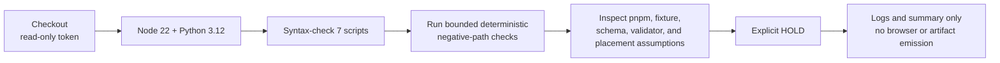

<!-- [KFM_META_BLOCK_V2]
doc_id: kfm://doc/scripts-readme
title: scripts/ — Thin Operational Wrappers and Graduation Boundary
type: README
version: v0.5
status: draft; repository-grounded; canonical-thin-script-root; mixed-maturity; two-governed-planner-wrappers-confirmed; maplibre-runtime-held; trust-shaped-builders-present; non-authoritative
owner: "@bartytime4life — current root-registry owner, permitted writer, reviewer, and default CODEOWNERS route; independent review separation remains NEEDS VERIFICATION"
created: NEEDS VERIFICATION — a short root stub existed before v0.2
updated: 2026-08-09
supersedes: v0.4 documentation at the same path; no script, workflow, command, validator, package, schema, contract, artifact, receipt, proof, release, runtime, deployment, or publication behavior is superseded
policy_label: repository-facing; thin-script; operational-helpers; dev; maintenance; one-off; planning-only; dry-run-first; no-hidden-authority; no-direct-public-path; no-secrets; graduation-required; correction-aware; rollback-aware
owning_root: scripts/
root_class: canonical
allowed_artifact_kind: thin_script
validation_profile: thin_wrapper_only
responsibility: hold thin non-authoritative invocation wrappers around governed tools and routine maintenance while making reads, writes, network use, failure states, generated candidates, review burden, graduation triggers, correction paths, and rollback paths inspectable
truth_posture: cite-or-abstain; script presence and successful execution prove only the bounded command behavior observed, not evidence sufficiency, policy approval, lifecycle promotion, release authority, publication, or production readiness
evidence_snapshot:
  repository: bartytime4life/Kansas-Frontier-Matrix
  base_ref: main
  base_commit: 3a9715582adf17a682920ca98f15aa3582ee8cdc
  prior_blob: 8ab7b3f740f21822310fa8bf40a18527bf2057a1
  directory_rules_blob: fd49a0b83e55cef52c1124281f093e263526898d
  directory_rules_adr_blob: b01322ef64f8c2b1ecb41de7ef4685b97cfa2a62
  root_registry_blob: 024f668b5f0a9239bafa4f8b09e2afd86300ff8c
  codeowners_blob: dd2a84aa514d8ecd9208bc347f90f9a2ed37dd61
  package_json_blob: 5cba790c88c40b885cc65fe2d585f3205aa1ef9d
  makefile_blob: 4abc7f941ce25d7d14703e87e387cef6e96d1592
  maplibre_workflow_blob: 306040e1c9283be5a95de76c09d205a58038f380
  promotion_gate_workflow_blob: 50efdbdb5e8ef8b6e702df50ca3aaae448b31a0b
  drift_register_blob: 5c5078b93c467e66f4cc8b86a7a696dbce5ae7e0
  generated_receipt_schema_blob: fba21ed27ebccf1362fe397fe0c3ebd85e072685
  backfill_wrapper_blob: 6b3927af11756db011699cf093a9c85a264b39b0
  resilience_wrapper_blob: 0e4f0265ddc91a2b05958099d405cd78658e0c93
  backfill_test_blob: b8e7ded70481d875051fa6b54b9c1db134a0116d
  resilience_test_blob: d63900f835cb182ed0a12946341ccf2f0603ddf1
related:
  - ./dev/README.md
  - ./maintenance/README.md
  - ./one_off/README.md
  - ../control_plane/root_registry.yaml
  - ../docs/adr/ADR-0029-adopt-directory-governance-standard-v2.md
  - ../docs/doctrine/directory-rules.md
  - ../tools/README.md
  - ../tools/validators/README.md
  - ../pipelines/README.md
  - ../packages/README.md
  - ../packages/pipelines-core/README.md
  - ../tests/README.md
  - ../fixtures/README.md
  - ../configs/README.md
  - ../artifacts/README.md
  - ../data/receipts/README.md
  - ../data/proofs/README.md
  - ../release/README.md
  - ../contracts/runtime/backfill_window_plan.md
  - ../contracts/runtime/pipeline_resilience_plan.md
  - ../schemas/contracts/v1/runtime/backfill_window_request.schema.json
  - ../schemas/contracts/v1/runtime/backfill_window_plan.schema.json
  - ../schemas/contracts/v1/runtime/pipeline_resilience_request.schema.json
  - ../schemas/contracts/v1/runtime/pipeline_resilience_plan.schema.json
  - ../tests/packages/pipelines_core/test_backfill_window.py
  - ../tests/packages/pipelines_core/test_pipeline_resilience.py
  - ../package.json
  - ../Makefile
  - ../.github/workflows/maplibre-perf-governance.yml
  - ../.github/workflows/promotion-gate.yml
  - ../.github/CODEOWNERS
  - ../docs/quality/maplibre-perf-governance.md
  - ../docs/registers/DRIFT_REGISTER.md
notes:
  - "v0.5 is a same-path documentation modernization grounded in current main, accepted ADR-0029, Directory Rules v2, and the active root registry."
  - "The first twelve H2 sections follow the Directory Rules v2 §16 ROOT_FULL README profile."
  - "Two root-level Python CLIs now demonstrate the intended thin-wrapper pattern: reusable deterministic planning logic lives in packages/pipelines-core, while scripts validate bounded JSON input and emit no-write envelopes."
  - "The seven root-level MapLibre scripts remain trust-adjacent candidate builders under artifacts/perf; the current drift register records that authority conflict as OPEN / BLOCKED_ADR."
  - "The current MapLibre workflow validates syntax, selected negative paths, and hold assumptions only; it does not execute a browser or emit artifacts."
  - "The maintenance child README still contains a stale direct-caller statement about promotion-gate; this parent records the discrepancy without expanding the requested path scope."
  - "No executable behavior, generated lifecycle object, release state, deployment, or public surface is changed by this README update."
[/KFM_META_BLOCK_V2] -->

<a id="top"></a>

# `scripts/` — Thin Operational Wrappers and Graduation Boundary

[](#status)
[](#authority-level)
[](#governed-planning-wrappers)
[](#status)
[](#root-level-maplibre-performance-chain)
[](#authority-level)

> **One-line purpose.** `scripts/` exposes thin, explicit, reversible command wrappers around governed implementation while keeping reusable logic, trust decisions, lifecycle orchestration, proof, release, and publication authority in their owning roots.

**Quick navigation:** [Purpose](#purpose) · [Authority](#authority-level) · [Status](#status) · [Belongs](#what-belongs-here) · [Does not belong](#what-does-not-belong-here) · [Inputs](#inputs) · [Outputs](#outputs) · [Validation](#validation) · [Review](#review-burden) · [Related roots](#related-folders) · [ADRs](#adrs) · [Last reviewed](#last-reviewed) · [Inventory](#confirmed-current-inventory) · [Child lanes](#child-lane-contracts) · [Planner wrappers](#governed-planning-wrappers) · [MapLibre](#root-level-maplibre-performance-chain) · [Execution](#safe-execution-contract) · [Artifact boundary](#generated-artifact-and-trust-object-boundary) · [Outcomes](#finite-outcomes-and-failure-semantics) · [Graduation](#graduation-and-promotion-rules) · [Rollback](#correction-and-rollback) · [Open verification](#open-verification-register)

> [!IMPORTANT]
> A script may execute work, but successful execution grants no KFM authority. Output is not automatically evidence, proof, policy approval, lifecycle promotion, release approval, correction authority, rollback authorization, or public truth.

> [!NOTE]
> The current backfill-window and pipeline-resilience CLIs are **planning-only front ends**. Their reusable decision logic lives under `packages/pipelines-core/`; their emitted authority maps are all false; and their source establishes no network, database, workflow, promotion, release, or publication effect.

> [!WARNING]
> The current MapLibre workflow does **not** run the browser/performance/trust-object chain. It syntax-checks seven scripts, invokes bounded negative-path checks, inspects readiness assumptions, and records a hold. It emits no screenshot, receipt, attestation, proof, release record, correction, rollback object, failure bundle, or uploaded artifact.

---

## Purpose

Directory Rules v2 and the active root registry classify `scripts/` as the canonical home for `thin_script` artifacts with the `thin_wrapper_only` validation profile. Its responsibility is **thin non-authoritative wrappers around governed tools and routine maintenance**.

A script belongs here only while all of these remain true:

1. its purpose is narrow and named;
2. its command surface is useful independently of where reusable logic lives;
3. its inputs, outputs, side effects, network calls, and failure states are inspectable;
4. it does not become the sole implementation of a reusable or trust-bearing rule;
5. it can be disabled, deleted, or graduated without changing a public contract;
6. its outputs remain terminal results, temporary artifacts, or candidates until validated and routed to the owning responsibility root;
7. it does not bypass source admission, evidence, policy, rights, sensitivity, review, promotion, correction, rollback, or publication gates.

The controlling pattern is:

```text
governed implementation in owning root
  -> thin CLI or compatibility wrapper in scripts/
  -> bounded input validation and finite outcome
  -> no hidden authority or direct public path
  -> reliance, repetition, or trust burden appears
  -> graduate durable logic and retain only a justified thin wrapper
```

This README defines routing and review posture. It does not claim that every script currently conforms or that graduation is automatically enforced.

[Back to top](#top)

---

## Authority level

**Canonical thin-script root; non-authoritative execution surface.**

ADR-0029 accepts Directory Rules v2 at `docs/doctrine/directory-rules.md`. The active machine projection in `control_plane/root_registry.yaml` records:

| Field | Current projection |
|---|---|
| Root | `scripts/` |
| Class | `canonical` |
| Allowed artifact kind | `thin_script` |
| Prohibited artifact kinds | `policy_rule`, `release_decision`, `repository_tool` |
| Responsibility | Thin non-authoritative wrappers around governed tools and routine maintenance |
| Validation profile | `thin_wrapper_only` |
| Owner / permitted writer / reviewer | `@bartytime4life` |
| Authority limit | Machine projection only; it does not create release, policy, evidence, or publication authority |

Directory Rules §10.1 routes executable responsibilities by role:

| Concern | Authority home | `scripts/` role |
|---|---|---|
| Thin invocation or compatibility wrapper | `scripts/` | Owns the command-facing adapter and bounded usage contract. |
| Long-lived validator, generator, builder, inspector, or repository operator | [`tools/`](../tools/) | May invoke it; must not replace its accepted implementation and tests. |
| Repeatable lifecycle or production orchestration | [`pipelines/`](../pipelines/) | May launch it; orchestration remains with the pipeline. |
| Reusable implementation | [`packages/`](../packages/) | Shared logic belongs in importable, versioned, tested code. |
| Source-specific acquisition and admission | `connectors/` | A wrapper may call an admitted connector; it cannot activate a source. |
| Executable conformance | [`tests/`](../tests/) | Script success is not a substitute for assertions. |
| Fixtures and baselines | [`fixtures/`](../fixtures/) | May read them; fixture authority remains separate. |
| Semantic meaning and machine shape | `contracts/`, `schemas/` | Consumes them; cannot create parallel contract or schema authority. |
| Policy, rights, sensitivity, and access | `policy/` plus governed review | Obeys decisions; cannot grant permission. |
| Lifecycle state and accountability instances | governed `data/` lanes | May produce bounded candidates only through declared transitions. |
| Receipts and proofs | [`data/receipts/`](../data/receipts/), [`data/proofs/`](../data/proofs/) | May emit candidates through accepted contracts; path or filename does not confer status. |
| Release, correction, withdrawal, rollback, and signatures | [`release/`](../release/) | May draft or invoke governed tooling; cannot approve or publish. |
| Deployment and public behavior | `infra/`, `runtime/`, `apps/` | Cannot authorize exposure or create arbitrary script-execution routes. |

### Anti-collapse rules

`scripts/` must not collapse:

- command convenience into canonical implementation;
- generated JSON into contract conformance;
- schema conformance into truth or admissibility;
- validator invocation into validator authority;
- CI success into runtime, release, or publication proof;
- QA artifact upload into promotion;
- receipt-, proof-, manifest-, correction-, or rollback-shaped output into a governed trust object;
- a plan into write authority;
- local success into production readiness;
- a one-off mutation into a durable dependency.

Public clients and normal UI surfaces must never execute arbitrary repository scripts.

[Back to top](#top)

---

## Status

<a id="status-and-evidence-boundary"></a>

### Repository-grounded maturity summary

| Surface | Current evidence at `main@3a971558…` | Safe conclusion |
|---|---:|---|
| `scripts/README.md` | **CONFIRMED v0.4 baseline** | Strong guardrails exist, but the inventory predates two planner CLIs and still cites pre-adoption Directory Rules numbering. |
| ADR-0029 and Directory Rules v2 | **CONFIRMED accepted decision and pinned doctrine path** | Same-path README update is placement-safe; `scripts/` is governed as a canonical thin-script root. |
| Active root registry | **CONFIRMED machine projection** | `scripts/` allows `thin_script` and prohibits `repository_tool`, `policy_rule`, and `release_decision`. |
| `plan_backfill_window.py` | **CONFIRMED substantive thin wrapper** | Validates bounded JSON and delegates deterministic planning to `packages/pipelines-core`; no network or writes. |
| `plan_pipeline_resilience.py` | **CONFIRMED substantive thin wrapper** | Validates bounded JSON, delegates to package logic, emits an operator-safe projection, and grants no write authority. |
| Planner contracts, schemas, fixtures, and tests | **CONFIRMED present** | Shape and focused behavior surfaces exist; adoption breadth and production consumers remain `NEEDS VERIFICATION`. |
| [`scripts/dev/`](./dev/) | **CONFIRMED placeholder-only** | `bootstrap.sh` and `regen_fixtures.sh` do not implement setup or fixture regeneration. |
| [`scripts/maintenance/`](./maintenance/) | **CONFIRMED mixed maturity** | Substantive maintenance commands exist; command-by-command ownership, output homes, and graduation remain unsettled. |
| [`scripts/one_off/`](./one_off/) | **CONFIRMED README-only in bounded evidence** | Deletion-first temporary lane; no direct executable was established by inspected evidence. |
| Seven root-level MapLibre scripts | **CONFIRMED substantive candidate builders** | They remain command-exposed and trust-adjacent; final placement and canonical handoff remain unresolved. |
| Root `package.json` and `Makefile` | **CONFIRMED command entry points** | MapLibre commands exist; availability does not establish browser fixtures, deterministic runtime evidence, signing, or release readiness. |
| `MapLibre Perf Governance` workflow | **CONFIRMED bounded checks plus explicit hold** | It checks source/negative boundaries and emits logs/summary only; no browser run or artifact emission. |
| `promotion-gate` workflow | **CONFIRMED test/readiness workflow** | It runs doctrine and promotion-readiness checks with explicit holds; it never promotes or publishes. |
| Canonical MapLibre trust-object placement | **CONFLICTED / open `BLOCKED_ADR` drift** | Candidate builders target `artifacts/perf/`; canonical accountability and release families belong elsewhere. |
| Workflow success and branch-protection significance | **NEEDS VERIFICATION per run** | A workflow definition or green hold check is not runtime or release evidence. |
| Production use and downstream consumers | **UNKNOWN** | No deployment, schedule, runtime, SLO, incident, or complete caller evidence was inspected. |
| Ownership | **CONFIRMED current route; independent review NEEDS VERIFICATION** | Root registry and CODEOWNERS route to `@bartytime4life`; that is not proof of independent approval. |

### Maturity classes

| Class | Meaning | Current examples |
|---|---|---|
| `PLACEHOLDER` | Exists but does not perform the advertised future action. | Dev helpers; selected MapLibre governance verifiers. |
| `THIN_WRAPPER` | Bounded CLI over reusable governed implementation, with no unique trust logic. | Backfill-window and pipeline-resilience planners. |
| `LOCAL_HELPER` | Bounded workstation/operator convenience. | Future reviewed `dev/` wrappers. |
| `TEMPORARY` | Task- and expiry-bound helper. | `one_off/`. |
| `OPERATIONAL_HELPER` | Substantive bounded maintenance behavior. | Doctrine maintenance commands. |
| `COMMAND_EXPOSED` | Reachable through a repository command surface. | MapLibre package/Make targets; planner CLIs through direct Python invocation. |
| `CI_CHECKED` | Syntax, static assumptions, or selected behavior is exercised by CI. | MapLibre source and negative-path boundaries. |
| `CI_RUNTIME_EXECUTED` | Runtime command itself is exercised by CI. | Not established for the MapLibre browser chain. |
| `TRUST_ADJACENT` | Produces or evaluates receipt-, proof-, release-, correction-, rollback-, or publication-support candidates. | MapLibre candidate builders; selected maintenance commands. |
| `GRADUATION_REQUIRED` | Responsibility or reliance exceeds the intended root role. | Proposed current posture for MapLibre candidate builders and selected maintenance commands. |

A file may occupy more than one class. A thin wrapper may remain in `scripts/` after reusable logic graduates, provided the wrapper stays bounded and does not regain unique trust logic.

[Back to top](#top)

---

## What belongs here

- Thin CLI front ends over reusable code in `packages/`, `tools/`, `pipelines/`, or another accepted implementation root.
- Small development wrappers whose behavior is local, explicit, reversible, and non-authoritative.
- Bounded repository-maintenance entry points whose durable logic and validators live in their owning roots.
- Temporary one-off helpers with an owner, task, expiry, dry run, rollback, and delete-or-promote decision.
- Read-only inspection, reporting, and planning helpers.
- Transitional compatibility wrappers during a documented graduation or migration.
- Script-local usage notes that state inputs, outputs, effects, network behavior, secret posture, finite outcomes, validation, retention, rollback, and graduation triggers.

Every consequential script should carry or link:

- stable command identity and accountable maintenance route;
- purpose and non-goals;
- exact read, write, and delete sets;
- network and dependency-integrity posture;
- secret references, never secret values;
- deterministic inputs or recorded variability;
- finite outcome and exit-code mapping;
- generated-output classification and destination;
- validation commands and limitations;
- retention, cleanup, correction, rollback, and graduation rules.

[Back to top](#top)

---

## What does NOT belong here

| Do not place or retain here | Correct home or action |
|---|---|
| Long-lived validators, generators, builders, proof assemblers, release helpers, or QA frameworks | [`tools/`](../tools/) with accepted contracts, tests, and ownership |
| Repeatable lifecycle or production orchestration | [`pipelines/`](../pipelines/) |
| Shared or domain implementation logic | [`packages/`](../packages/) |
| Source-specific fetch, capture, or admission implementation | `connectors/` |
| Tests and assertions | [`tests/`](../tests/) |
| Fixtures, baselines, golden outputs, invalid examples | [`fixtures/`](../fixtures/) |
| Semantic contracts or JSON Schema | `contracts/`, `schemas/` |
| Policy rules, source activation, rights, sensitivity, consent, or access grants | `policy/`, registries, and governed review |
| RAW, WORK, QUARANTINE, PROCESSED, CATALOG, TRIPLET, or PUBLISHED payloads | governed `data/` lifecycle roots |
| Canonical receipts and accepted proofs | [`data/receipts/`](../data/receipts/), [`data/proofs/`](../data/proofs/) |
| Authoritative release manifests, PromotionDecisions, CorrectionNotices, WithdrawalNotices, RollbackCards, or signatures | [`release/`](../release/) |
| Shared configuration defaults or reusable templates | [`configs/`](../configs/) |
| Deployment definitions, service units, production schedules, firewall/proxy rules | `infra/`, `runtime/`, or `apps/` |
| Credentials, tokens, keys, passwords, private endpoints, secret-bearing `.env` files | approved external secret system |
| Public API routes, UI components, browser bundles, arbitrary script-execution endpoints | accepted app/API/UI roots |
| Unowned experiments or forgotten temporary scripts | delete, or admit to `one_off/` with expiry and rollback |
| Generated files committed without classification, validation, review, and rollback | classify, route, or delete before merge |

[Back to top](#top)

---

## Inputs

A script may consume only inputs appropriate to its declared scope.

### Permitted input classes

- explicit CLI arguments;
- tracked manifests, lockfiles, schemas, contracts, safe config examples, and fixtures;
- accepted tool, validator, package, pipeline, connector, and test entry points;
- ignored workstation-local overrides where the consumer contract allows them;
- non-secret environment variables;
- approved injected secret references;
- reviewed local services or remote endpoints;
- artifacts generated earlier in the same bounded run;
- repository metadata such as commit SHA, branch, or changed paths.

### Required input controls

A consequential script must:

1. reject unknown arguments and undeclared fields where the contract requires closure;
2. validate required paths, file types, sizes, encodings, and tool versions;
3. distinguish tracked, ignored, generated, and external inputs;
4. pin or record dependencies;
5. avoid broad scans of secrets or protected data;
6. deny unreviewed network sources;
7. resolve symlinks and path traversal safely before reads or writes;
8. record freshness, rights, sensitivity, policy, and release state when material;
9. stop rather than invent authority-bearing defaults;
10. avoid direct public-client access to canonical or internal stores.

### Forbidden assumptions

A script must not assume that:

- path presence means an object is accepted;
- schema validity means a claim is true;
- a registry row means a source is active;
- a JSON filename makes an object a governed receipt or proof;
- a `candidate` manifest is release approval;
- local or CI behavior equals production;
- credentials exist or may be printed;
- network access is harmless;
- generated content is safe to commit, promote, or publish.

[Back to top](#top)

---

## Outputs

Script outputs remain **terminal results, temporary artifacts, or candidates** until the owning root validates and accepts them.

| Output class | Examples | Required handling |
|---|---|---|
| Terminal-only | status, plan, warning, finite outcome | No secret or protected content; stable outcome mapping. |
| Local temporary | cache, scratch report, preview | Ignore or delete; not evidence or release material. |
| Build/QA artifact | screenshots, diffs, performance diagnostics, failure bundle | Temporary `artifacts/` use may be valid; classify retention and sensitivity. |
| Fixture candidate | regenerated examples | Compare deterministically; validate and review before replacing fixtures. |
| Lifecycle candidate | transformed or derived data | Route to WORK/QUARANTINE; never directly to PUBLISHED. |
| Receipt candidate | run- or validation-receipt-shaped object | Validate and route to an accepted receipt lane before treating as process memory. |
| Proof candidate | ProofPack, integrity report, render comparison | Validate and route to the proof lane before treating as proof. |
| Release candidate | manifest, correction, withdrawal, rollback-shaped record | Route to `release/`; scripts cannot approve it. |
| Code/config mutation | source, docs, configs, registries | Dry run, exact diff, tests, owner review, correction, rollback. |

### Minimum effect declaration

```yaml
command_id: <stable-id>
mode: inspect | plan | apply | verify
outcome: NOOP | PLANNED | APPLIED | PARTIAL | HELD | DENIED | ERROR
reads: []
writes: []
deletes: []
network_profile: none | <reviewed-profile>
secret_refs: []
generated_objects:
  - path: <path>
    class: terminal | temporary | artifact | fixture_candidate | lifecycle_candidate | receipt_candidate | proof_candidate | release_candidate | mutation
validation:
  - <command or check>
rollback: <mechanical restoration>
maintenance_route: <verified route or NEEDS VERIFICATION>
```

This declaration is **PROPOSED**, not a confirmed schema.

[Back to top](#top)

---

## Validation

Validation must match the claim being made.

### Static inventory and syntax

```bash
find scripts -maxdepth 3 -type f | sort

find scripts -name '*.sh' -print0 |
  xargs -0 -r bash -n

find scripts -name '*.py' -print0 |
  xargs -0 -r python -m py_compile

find scripts -name '*.mjs' -print0 |
  xargs -0 -r -n1 node --check
```

Static syntax proves parseability only. It does not prove safe mutation, network behavior, fixture availability, deterministic output, schema meaning, or release eligibility.

### Focused planner checks

Repository-owned focused tests bind each thin wrapper to its reusable package logic, request/plan schemas, valid and invalid fixtures, deterministic identity, finite outcomes, and no-authority envelope:

```bash
python -m pytest -q \
  tests/packages/pipelines_core/test_backfill_window.py \
  tests/packages/pipelines_core/test_pipeline_resilience.py
```

Direct fixture-backed smoke invocations:

```bash
python scripts/plan_backfill_window.py \
  fixtures/contracts/v1/runtime/backfill_window_plan/valid/rebuild.request.json

python scripts/plan_pipeline_resilience.py \
  fixtures/contracts/v1/runtime/pipeline_resilience_plan/valid/allow_start.request.json
```

These commands establish only the bounded planner result they actually emit. They do not start a pipeline, perform a backfill, retry work, mutate a queue, activate a kill switch, evaluate policy, create a receipt, or publish anything.

### Current MapLibre CI coverage

The inspected workflow definition:

1. runs `node --check` against the seven root-level MapLibre scripts;
2. parses the MapLibre Python validator and test surfaces;
3. invokes bounded deterministic negative-path tests;
4. verifies the current pnpm workspace/lockfile boundary and absence of silently surfaced runtime or trust maturity;
5. records a governance hold and writes only logs, annotations, and a step summary.

It does **not** install workspace packages or a browser, run Playwright, start a fixture server, execute performance smoke, compare render output, sign anything, build a proof/release candidate, or upload `artifacts/perf/`.

### Current local MapLibre command surfaces

`package.json` and `Makefile` expose candidate-builder commands. Before a maintainer runs the full chain, verify:

- the pinned `pnpm@11.17.0` workspace and lockfile;
- browser and Node dependencies in the intended execution environment;
- local slim/heavy style fixtures and baselines;
- approved network hosts or mirrored assets;
- meaningful schemas and valid/invalid fixtures;
- substantive validators and finite outcomes;
- output staging, cleanup, retention, and sensitivity;
- signing posture;
- canonical receipt/proof/release destinations;
- rollback and correction behavior.

<details>
<summary><strong>Current command names — availability only, not a run recommendation</strong></summary>

```bash
npm run maplibre:perf
npm run maplibre:render-diff
npm run maplibre:attest
npm run maplibre:manifest
npm run maplibre:govern
npm run maplibre:proof
npm run maplibre:proof:validate
npm run maplibre:failure-bundle
npm run maplibre:correction
npm run maplibre:perf:full
npm run maplibre:clean

make maplibre-perf
make maplibre-govern
make maplibre-proof
make maplibre-clean
```

</details>

### Child-lane checks

```bash
bash -n scripts/dev/bootstrap.sh
bash -n scripts/dev/regen_fixtures.sh

python -m py_compile scripts/maintenance/*.py
bash -n scripts/maintenance/*.sh
python scripts/maintenance/run_doctrine_artifact_preflight.py --help
bash scripts/maintenance/run_doctrine_artifact_test_suite.sh
```

Review command help, strict flags, output paths, and write behavior before executing maintenance reconciliation.

### Documentation and receipt checks

```bash
git diff --check
python -m json.tool data/receipts/generated/<receipt>.json >/dev/null
python tools/validators/validate_generated_receipt.py \
  data/receipts/generated/<receipt>.json
```

### Claim limits for this modernization

- The complete v0.4 baseline and current repository evidence named in the meta block were inspected.
- The two planner wrappers and focused tests were inspected as source.
- Executable planner, maintenance, MapLibre, browser, package-install, network, signing, migration, and rollback commands were not run in the authoring environment.
- Markdown structure and generated-receipt shape are validated locally against the authored bytes.
- Hosted repository checks begin only after the draft pull request is opened and are reported separately.
- No green check is treated as release, deployment, promotion, or publication evidence.

[Back to top](#top)

---

## Review burden

The root registry and CODEOWNERS currently route `scripts/` changes to `@bartytime4life`. That route is not proof of independent stewardship, completed review, branch-protection enforcement, or approval.

| Change class | Minimum review posture |
|---|---|
| README-only clarification with no behavior claim | Current repository review route; verify links, anchors, claims, receipt, and rollback. |
| Thin no-write wrapper over existing reusable logic | Maintainer familiar with the package/tool contract plus focused tests. |
| Non-mutating local helper | Maintainer familiar with the affected command and operating environment. |
| Write-capable script | Reviewer for every mutated responsibility root plus rollback review. |
| Schema, contract, policy, source, registry, fixture, or lifecycle mutation | Owning-root reviewer and applicable governance review. |
| Network, download, archive, shell-from-input, deletion, secrets, or protected logs | Security review plus affected owner. |
| CI-required, scheduled, or monitored command | CI/operations review and a graduation decision. |
| Receipt-, proof-, release-, correction-, rollback-, or signature-shaped output | Evidence/release review, canonical-home decision, validators, and separation-of-duty review. |
| Sensitive-domain or precise-location handling | Applicable sensitivity/steward review before exposure. |

The same implementation must not silently become generator, validator, approver, signer, and publisher.

[Back to top](#top)

---

## Related folders

| Path | Relationship |
|---|---|
| [`scripts/dev/`](./dev/) | Placeholder and future local-development wrappers. |
| [`scripts/maintenance/`](./maintenance/) | Mixed-maturity maintenance and doctrine-preflight commands. |
| [`scripts/one_off/`](./one_off/) | Temporary, deletion-first quarantine lane. |
| [`control_plane/root_registry.yaml`](../control_plane/root_registry.yaml) | Active machine projection of the canonical `thin_script` root contract. |
| [`ADR-0029`](../docs/adr/ADR-0029-adopt-directory-governance-standard-v2.md) | Accepted decision adopting Directory Rules v2. |
| [`Directory Rules`](../docs/doctrine/directory-rules.md) | Placement, executable routing, dependency, migration, and §16 README doctrine. |
| [`tools/`](../tools/) | Long-lived validators, generators, builders, inspectors, and operators. |
| [`tools/validators/`](../tools/validators/) | Validator implementation authority. |
| [`pipelines/`](../pipelines/) | Repeatable lifecycle and production orchestration. |
| [`packages/pipelines-core/`](../packages/pipelines-core/) | Reusable deterministic logic behind the two planner wrappers. |
| [`tests/packages/pipelines_core/`](../tests/packages/pipelines_core/) | Focused package and CLI behavior tests. |
| [`fixtures/contracts/v1/runtime/`](../fixtures/contracts/v1/runtime/) | Valid and invalid request/plan fixture families. |
| [`configs/`](../configs/) | Shared safe defaults and configuration templates. |
| [`artifacts/`](../artifacts/) | Compatibility root for build/docs/QA/temporary output, not sovereign truth. |
| [`data/receipts/`](../data/receipts/) | Governed process-memory records. |
| [`data/proofs/`](../data/proofs/) | Governed proof objects. |
| [`release/`](../release/) | Promotion, release, correction, withdrawal, and rollback authority. |
| [`package.json`](../package.json) | Root Node command surface, including local MapLibre candidate builders. |
| [`Makefile`](../Makefile) | Root orchestration surface, including MapLibre targets. |
| [MapLibre workflow](../.github/workflows/maplibre-perf-governance.yml) | Bounded syntax/negative/readiness check with explicit hold. |
| [Promotion workflow](../.github/workflows/promotion-gate.yml) | Doctrine/shape/readiness checks; no promotion authority. |
| [MapLibre governance draft](../docs/quality/maplibre-perf-governance.md) | Proposed graduation and artifact-placement design. |
| [Drift register](../docs/registers/DRIFT_REGISTER.md) | Open `artifacts/perf/` trust-object authority conflict. |
| [CODEOWNERS](../.github/CODEOWNERS) | GitHub review routing, not independent approval. |

[Back to top](#top)

---

## ADRs

### Governing decisions

- **ADR-0029 is accepted.** It adopts the exact Directory Rules v2 bytes at `docs/doctrine/directory-rules.md` as the single writable human-readable authority.
- Directory Rules §10.1 says `scripts/` owns thin invocation wrappers with no unique trust logic.
- Directory Rules `DIR-EXEC-007` requires trust-bearing or reused logic to graduate to `tools/`, `pipelines/`, `packages/`, or `connectors/`; production implementations do not import scripts.
- The active root registry projects the same boundary as `thin_script` / `thin_wrapper_only`.
- The current drift register records the MapLibre `artifacts/perf/` authority conflict as open and `BLOCKED_ADR`.

### Decisions still required

| Decision | Status |
|---|---|
| Establish independent script-root review separation beyond the current single-owner route. | NEEDS VERIFICATION |
| Decide the final home for the seven MapLibre candidate builders. | ADR or reviewed migration decision required |
| Decide whether `artifacts/perf/` remains ephemeral QA staging only. | Open / `BLOCKED_ADR` drift |
| Define accepted schemas, contracts, fixtures, validators, and outcomes for MapLibre candidate objects. | NEEDS VERIFICATION |
| Define browser/runtime fixture, network, and signing posture for the MapLibre chain. | NEEDS VERIFICATION |
| Classify each maintenance command as thin wrapper, repository tool, validator, mutator, or orchestrator. | NEEDS VERIFICATION |
| Resolve maintenance output homes and stale child documentation. | NEEDS VERIFICATION |
| Define one-off admission, expiry, cleanup, and delete-or-promote enforcement. | PROPOSED |
| Define compatibility-wrapper cleanup after graduation. | PROPOSED |
| Confirm whether the two planner CLIs need first-class Make/package entry points or should remain direct invocations. | NEEDS VERIFICATION |

No path is moved and no ADR is created, amended, or accepted by this README update.

[Back to top](#top)

---

## Last reviewed

| Field | Value |
|---|---|
| Last reviewed | 2026-08-09 |
| Evidence base | `main@3a9715582adf17a682920ca98f15aa3582ee8cdc` |
| Target prior blob | `8ab7b3f740f21822310fa8bf40a18527bf2057a1` |
| Governing decision | Accepted `ADR-0029` |
| Root projection | `control_plane/root_registry.yaml` blob `024f668b…` |
| Review mode | Complete-baseline, same-path, repository-grounded documentation modernization |
| Change class | Editorial + additive documentation; no executable behavior |
| Implementation effect | README plus generated provenance receipt only |
| Runtime/CI effect | None—no script, workflow, command, dependency, fixture, validator, package, or artifact behavior changed |
| Rollback | Revert this documentation packet or restore prior README blob `8ab7b3f740f21822310fa8bf40a18527bf2057a1` |

Re-review when:

- a script is added, removed, moved, renamed, or made executable;
- a thin wrapper absorbs reusable or trust-bearing logic;
- a planner gains network, writes, queue/runtime effects, policy evaluation, signatures, or promotion authority;
- a child-lane README changes or conflicts with current callers;
- a placeholder gains real behavior;
- a script is added to CI, branch protection, a schedule, or production operation;
- a script writes a new artifact family;
- MapLibre scripts graduate or `artifacts/perf/` placement changes;
- maintenance output homes or workflow callers change;
- network, dependency, secret, logging, retention, correction, or rollback posture changes;
- Directory Rules, the root registry, the drift register, or an accepted ADR changes placement.

[Back to top](#top)

---

## Confirmed current inventory

Directory Rules §16 requests a direct-child map rather than a recursive dump.

```text
scripts/
├── README.md
├── attest-maplibre-perf.mjs
├── build-maplibre-perf-correction-and-rollback.mjs
├── build-maplibre-perf-failure-bundle.mjs
├── build-maplibre-perf-proof-pack.mjs
├── build-maplibre-perf-release-manifest.mjs
├── build-maplibre-render-diff.mjs
├── dev/
├── maintenance/
├── maplibre-smoke-perf.mjs
├── one_off/
├── plan_backfill_window.py
└── plan_pipeline_resilience.py
```

### Direct-child classification

| Direct child | Classification | Current boundary |
|---|---|---|
| `dev/` | Placeholder/local-helper lane | No implementation authority established. |
| `maintenance/` | Mixed operational/trust-adjacent lane | Requires command-by-command graduation review. |
| `one_off/` | Temporary quarantine lane | README-only in bounded evidence; delete or promote after use. |
| `plan_backfill_window.py` | Thin planning wrapper | Reusable logic in `packages/pipelines-core`; no network or writes. |
| `plan_pipeline_resilience.py` | Thin planning wrapper | Reusable logic in `packages/pipelines-core`; operator-safe no-write output. |
| Seven `*maplibre*` / MapLibre builder scripts | Trust-adjacent candidate-builder family | Command-exposed; CI-held; `artifacts/perf/` placement conflicted. |

### Bounded inventory limits

This inventory does not prove absence of:

- ignored or untracked scripts;
- branch-only or historical scripts;
- local operator copies;
- dynamically downloaded scripts;
- generated executables;
- workflow commands outside inspected definitions;
- deeper files not surfaced by child-lane evidence.

[Back to top](#top)

---

## Child-lane contracts

### `dev/` — local development helpers

Current posture:

- `bootstrap.sh` and `regen_fixtures.sh` are TODO placeholders;
- no dependency installation or fixture regeneration is implemented;
- no CI or production authority is established;
- future mutation must be explicit, dry-run capable, tested, and reversible.

Use `dev/` for small workstation-oriented wrappers only. Graduate behavior when it becomes shared setup infrastructure, a generator, validator, or test harness.

### `maintenance/` — bounded repository maintenance

Current posture:

- substantive doctrine-artifact registry, provenance, readiness, synchronization, preflight, and test-bundle commands exist;
- some commands are mutation-sensitive or trust-adjacent;
- the current `promotion-gate` workflow does not directly invoke the maintenance checker path described by the child README;
- long-term placement and accepted output homes remain unresolved.

> [!NOTE]
> The stale caller statement in `scripts/maintenance/README.md` is a separate same-path correction target. This parent update records the discrepancy without editing a second README or masking the lineage.

### `one_off/` — temporary quarantine

Current posture:

- README-only in bounded evidence;
- empty by default;
- deletion first;
- dry run first;
- network denied by default;
- every temporary script requires task, maintenance route, risk, inputs, outputs, rollback, expiry, and delete-or-promote decision.

One-off scripts must never become the normal path for ingestion, validation, evidence resolution, policy enforcement, promotion, publication, correction, or rollback.

[Back to top](#top)

---

## Governed planning wrappers

The two Python planners are the clearest current examples of the accepted `scripts/` pattern: the script is a bounded interface, while reusable logic, contracts, schemas, fixtures, and tests live in their owning roots.

### Dependency-closed map

| Wrapper | Reusable logic | Semantic contract | Request / result schemas | Fixture root | Focused test |
|---|---|---|---|---|---|
| `plan_backfill_window.py` | `packages/pipelines-core/src/pipelines_core/backfill_window.py` | `contracts/runtime/backfill_window_plan.md` | `backfill_window_request.schema.json`; `backfill_window_plan.schema.json` | `fixtures/contracts/v1/runtime/backfill_window_plan/` | `tests/packages/pipelines_core/test_backfill_window.py` |
| `plan_pipeline_resilience.py` | `packages/pipelines-core/src/pipelines_core/pipeline_resilience.py` | `contracts/runtime/pipeline_resilience_plan.md` | `pipeline_resilience_request.schema.json`; `pipeline_resilience_plan.schema.json` | `fixtures/contracts/v1/runtime/pipeline_resilience_plan/` | `tests/packages/pipelines_core/test_pipeline_resilience.py` |

### Shared input and effect boundary

Both wrappers:

- accept one JSON file path;
- deny symlink input;
- require a regular file no larger than 4 MiB;
- parse UTF-8 JSON with duplicate-key and non-finite-number denial;
- validate Draft 2020-12 request and result schemas;
- emit one compact JSON envelope to stdout;
- return process exit `0` on `ANSWER` and `1` on `DENY` or `ERROR`;
- declare all authority flags false;
- perform no network fetch, source activation, artifact write, policy evaluation, signature operation, promotion, release, or publication.

The pipeline-resilience wrapper additionally:

- projects only operator-safe fields;
- omits authorization and environment-gate references from stdout;
- declares no workflow or database mutation;
- delegates trigger, retry, backpressure, circuit-breaker, delivery, replay, and kill-switch planning to the package implementation.

### Finite planner results

The outer CLI envelope uses:

| Outcome | Meaning |
|---|---|
| `ANSWER` | Input and generated plan passed the bounded parser/schema/semantic path. |
| `DENY` | The request or planned result failed a declared validation or semantic rule. |
| `ERROR` | Input could not be safely read or parsed as the required finite JSON object. |

These labels describe the planner invocation. `ANSWER` is not a public KFM answer, approval, policy decision, execution grant, or release decision.

The inner backfill plan distinguishes no-op versus rebuild planning. The resilience plan may recommend bounded states such as allow start/retry/replay, pause, quarantine, deny, no action, or operator-required. Those are planning outputs only; no executor is invoked.

### Placement determination

**CONFIRMED current fit:** reusable decision logic lives in `packages/pipelines-core`, and the scripts retain bounded input/output adaptation. This matches `thin_wrapper_only`.

Re-review or graduate when a wrapper:

- gains unique reusable or trust-bearing decision logic;
- performs network, queue, database, workflow, file, or lifecycle mutation;
- begins policy evaluation, signing, promotion, release, or publication;
- becomes the only supported API for another production implementation;
- accumulates multiple domains or transport protocols;
- is imported by production code rather than invoked as a command;
- diverges from its package, schema, fixture, or test contract.

[Back to top](#top)

---

## Root-level MapLibre performance chain

### Local candidate-builder flow

The current local command surfaces can invoke:

```text
configs/maplibre/perf-envelope.v1.json
  -> maplibre-smoke-perf.mjs
  -> build-maplibre-render-diff.mjs
  -> attest-maplibre-perf.mjs
  -> build-maplibre-perf-release-manifest.mjs
  -> tools/validators/maplibre/validate_perf_governance.py
  -> build-maplibre-perf-proof-pack.mjs
  -> tools/validators/maplibre/validate_perf_proof_pack.py
  -> release-manifest rebuild
  -> final governance-validator invocation
```

Failure-oriented helpers can draft:

```text
candidate failure
  -> build-maplibre-perf-correction-and-rollback.mjs
  -> build-maplibre-perf-failure-bundle.mjs
```

### Current CI flow


```mermaid
flowchart LR
    A["Checkout<br/>read-only token"] --> B["Node 22 + Python 3.12"]
    B --> C["Syntax-check 7 scripts"]
    C --> D["Run bounded deterministic<br/>negative-path checks"]
    D --> E["Inspect pnpm, fixture,<br/>schema, validator, and placement assumptions"]
    E --> F["Explicit HOLD"]
    F --> G["Logs and summary only<br/>no browser or artifact emission"]
```

This diagram reflects the inspected workflow definition. It is not a performance result.

### Why the hold exists

The workflow confirms a current pnpm workspace and lockfile boundary, then deliberately holds runtime/trust claims because:

- `@kfm/maplibre` remains dependency-free in the reviewed boundary;
- the workflow installs no workspace packages or browser;
- runtime style fixtures and executable browser baselines are not admitted to this lane;
- meaningful schema and substantive verifier maturity remains bounded by readiness checks;
- the local browser smoke can depend on external assets unless a governed mirror/offline profile is established;
- attestation and signing posture is not proven by this workflow;
- trust-shaped builders target `artifacts/perf/`;
- no tracked performance receipt, proof, release, correction, or rollback object may silently appear.

A green run therefore means the **hold contract behaved as designed**, not that performance, rendering, signing, proof closure, release eligibility, or publication safety passed.

[Back to top](#top)

---

## Safe execution contract

Every consequential script should expose this sequence:

```text
inspect
  -> validate prerequisites
  -> plan exact reads, writes, deletes, and network calls
  -> dry run
  -> explicit apply
  -> validate outputs
  -> emit finite outcome
  -> preserve review evidence
  -> route or clean outputs
```

Default rules:

- no-argument mode is read-only unless the command is inherently read-only;
- writes require `--apply`, `--write`, or an equally explicit action;
- destructive changes require narrower confirmation;
- unknown arguments and fields fail;
- scripts do not automatically stage, commit, push, merge, release, or publish;
- stale or conflicted preconditions block canonical mutation;
- partial effects return `PARTIAL` or `ERROR`;
- temporary output is cleaned or retained under explicit policy;
- governed candidates are validated and routed to owning roots;
- local and CI behavior differences are declared;
- network access is denied unless the command contract lists approved endpoints;
- secrets are injected through approved mechanisms and redacted;
- incident evidence and prior recoverable state are preserved.

Where practical, repeated execution with identical inputs should be deterministic or record the nondeterminism, and a second successful apply should produce `NOOP` or a declared update.

[Back to top](#top)

---

## Generated-artifact and trust-object boundary

### Staging is not promotion

```text
script result
  -> terminal result, temporary artifact, or WORK candidate
  -> schema and contract validation
  -> policy, rights, sensitivity, and evidence checks
  -> receipt/proof/release assembly in the correct authority root
  -> accountable review
  -> PromotionDecision and ReleaseManifest where applicable
  -> PUBLISHED
```

A script must never shortcut this flow by writing directly to a path and treating placement as approval.

### `artifacts/` compatibility rule

`artifacts/` may carry temporary QA output, screenshots, render diffs, build reports, CI bundles, and disposable candidates. It must not become the sovereign home for:

- canonical receipts;
- accepted proofs;
- release manifests;
- policy or promotion decisions;
- correction or withdrawal records;
- rollback authority;
- catalog records;
- published material.

### MapLibre candidate outputs

The inspected builders can target `artifacts/perf/` with:

- performance results and frame-time CSVs;
- screenshots and render-diff output;
- `RunReceipt`-shaped JSON;
- unsigned DSSE-shaped envelope and checksum;
- `ReleaseManifest`-shaped candidate;
- `ProofPack`-shaped candidate;
- draft correction and rollback records;
- failure bundle.

These are **candidate shapes**, not accepted trust objects. The drift register records the placement conflict as open and `BLOCKED_ADR`.

### Candidate handoff record

When a script produces a trust-adjacent candidate, record:

| Field | Purpose |
|---|---|
| Candidate path and class | Temporary location and object family claimed. |
| Owning root | Canonical destination if admitted. |
| Schema and contract | Shape and semantic authority. |
| Validator and fixtures | Executable checks and representative cases. |
| Evidence refs | Support used by the candidate. |
| Policy and review refs | Decisions and accountable review required. |
| Digest and tool identity | Integrity and reproducibility. |
| Promotion status | `staged`, `held`, `denied`, `accepted`, or `superseded`. |
| Correction and rollback | Invalidating or reversing path. |
| Retention | Cleanup or preservation period. |

This profile is **PROPOSED**.

[Back to top](#top)

---

## Finite outcomes and failure semantics

### Generic script execution outcomes

| Outcome | Meaning |
|---|---|
| `NOOP` | Preconditions were valid and no change was needed. |
| `PLANNED` | A reviewable no-write plan was produced. |
| `APPLIED` | The bounded mutation completed and required verification passed. |
| `PARTIAL` | Some effects occurred; reconciliation and review are required. |
| `HELD` | Execution or output waits on evidence, dependency, freshness, placement, or review. |
| `DENIED` | Policy, rights, sensitivity, access, release, or scope forbids the action. |
| `ERROR` | Technical execution failed. |

The current planner wrappers use `ANSWER` / `DENY` / `ERROR`; the MapLibre workflow uses explicit hold language; policy and public APIs may use other finite vocabularies. These are not interchangeable.

### Mandatory failure behavior

- `PARTIAL`, `HELD`, `DENIED`, `DENY`, and `ERROR` must not be converted to silent success.
- A failed or placeholder validator cannot support a trust claim.
- Missing receipts, proofs, review, signatures, or release records must not be invented.
- Failure handlers may capture diagnostics and draft correction/rollback candidates; they cannot authorize either.
- Failures must not print secrets, protected context, precise sensitive locations, living-person data, or private reasoning.
- Cleanup must not destroy incident evidence or the prior recoverable state.
- Retry logic distinguishes transient failure from deterministic invalid input.
- Stale or superseded candidates are not silently reused.

Exact numeric exit codes remain command-specific and must be documented by the command contract.

[Back to top](#top)

---

## Graduation and promotion rules

Review a script for graduation when any of these becomes true:

| Trigger | Expected action |
|---|---|
| Reused by multiple apps, packages, or domains | Move reusable logic to `packages/`; retain a thin CLI only when useful. |
| Becomes a long-lived validator, generator, builder, inspector, or proof assembler | Move to `tools/` with tests, contracts, schemas, and ownership. |
| Orchestrates repeatable lifecycle or production work | Move to `pipelines/`. |
| Implements source-specific acquisition or admission | Move to `connectors/`. |
| Defines public/runtime behavior | Move to the owning app, package, runtime, or infra lane. |
| Is required by CI or branch protection | Define command contract, tests, ownership, failure semantics, and placement. |
| Writes or validates receipts, proofs, release records, corrections, rollback, or signatures | Establish canonical homes, validators, review, and likely graduate implementation. |
| Mutates schemas, contracts, policy, registries, fixtures, or release records | Require dry run, owning-root review, and mechanical rollback; graduate repeated logic. |
| Requires secrets, broad network access, or production credentials | Move to governed tooling, infra, runtime, or deny casual use. |
| Becomes scheduled or operationally monitored | Move to a durable service, pipeline, or maintenance tool. |
| One-off task finishes | Delete the script or promote useful logic. |
| Script and documentation disagree | Hold use, correct docs/code, and preserve rollback. |

A graduation change should record callers, destination root, reason, stable interface, compatibility-wrapper plan, artifact migration, tests, CI, maintenance route, deprecation window, correction, rollback, and deletion date.

### Current determinations

- **Backfill and resilience planner wrappers:** currently fit `scripts/` because reusable logic lives in `packages/pipelines-core` and the wrappers stay no-write, schema-bound, and finite.
- **MapLibre candidate builders:** graduation review is warranted because they are multi-step, network-sensitive, command-exposed, validator-integrated, and trust-adjacent. Current CI checks them but deliberately does not execute the browser chain.
- **Maintenance commands:** classify command by command. Do not bulk-move the directory; thin wrappers may remain while validators, mutators, shared helpers, and orchestration move to their owning roots.
- **Dev helpers:** remain placeholders; graduation is premature until behavior exists.
- **One-off lane:** delete or promote after the task; accumulation is drift.

This README does not select destinations or move files.

[Back to top](#top)

---

## Correction and rollback

### Documentation rollback

Before merge, close the draft PR and abandon its review branch. After merge, transparently revert this documentation packet or restore README blob `8ab7b3f740f21822310fa8bf40a18527bf2057a1`. Do not rewrite shared history.

### Script correction triggers

Correct, hold, or retire a script when:

- documented and actual effects differ;
- a thin wrapper absorbs unique reusable or trust-bearing logic;
- an output uses the wrong authority root;
- a candidate fails schema, contract, policy, integrity, or evidence checks;
- secrets or protected context appear;
- network dependencies drift;
- a workflow silently ignores failure;
- reliance exceeds reviewed maturity;
- a maintenance route or rollback target is missing;
- a one-off passes its expiry;
- public clients or production systems depend directly on it;
- generated receipt/proof/release claims overstate authority.

### Operational rollback expectations

For a mutating script:

1. stop further runs;
2. preserve bounded logs and incident evidence without exposing secrets;
3. record exact partial state;
4. restore prior files, registry rows, configuration, fixtures, or artifacts;
5. invalidate candidates and caches;
6. rerun validators and tests;
7. notify known downstream consumers;
8. issue correction, withdrawal, or rollback records through the owning authority root when required;
9. document cause and fix;
10. decide whether to restrict, retire, or graduate the script.

Until MapLibre placement is resolved, treat `artifacts/perf/` as ephemeral staging and prevent its trust-shaped candidates from being cited as released objects.

[Back to top](#top)

---

## Open verification register

| ID | Item | Evidence needed |
|---|---|---|
| KFM-SCR-01 | Complete recursive tracked/generated/ignored script inventory | Commit-pinned tree, ignore rules, history, and classification |
| KFM-SCR-02 | Independent script-root stewardship and required review | Approved assignment, ruleset, separation-of-duty evidence |
| KFM-SCR-03 | Every workflow, Make, package, and external caller | Search plus current run evidence |
| KFM-SCR-04 | MapLibre local chain prerequisites | Browser setup, fixtures, baselines, mirrors, dependency execution profile |
| KFM-SCR-05 | MapLibre runtime/performance behavior | Deterministic browser run, metrics, render comparisons, retained run evidence |
| KFM-SCR-06 | Meaningful MapLibre schemas and fixtures | Typed schemas, nonempty valid/invalid fixtures, expected errors |
| KFM-SCR-07 | Substantive MapLibre validators | Accepted CLI, finite outcomes, negative cases, aggregate command |
| KFM-SCR-08 | MapLibre candidate-builder destination | Accepted ADR or migration decision |
| KFM-SCR-09 | Canonical receipt/proof/release homes | Contracts, schemas, validators, review, promotion, correction, rollback |
| KFM-SCR-10 | Signing posture | Signer, keyed/keyless policy, verification, revocation, protected environment |
| KFM-SCR-11 | Network reproducibility | Allowed hosts, integrity, mirroring, cache/outage behavior, source-version receipts |
| KFM-SCR-12 | `artifacts/perf/` retention and cleanup | Ignore/tracking state, TTL, sensitivity, deletion, incident preservation |
| KFM-SCR-13 | Maintenance command classification and graduation | Per-command responsibility, callers, tests, outputs, rollback |
| KFM-SCR-14 | Maintenance output home | Accepted temporary/validation-receipt contract and migration |
| KFM-SCR-15 | Correct stale maintenance caller documentation | Same-path child README update grounded in current `promotion-gate.yml` |
| KFM-SCR-16 | Dev helper future behavior | Platforms, package managers, network/secrets, tests, rollback |
| KFM-SCR-17 | One-off admission and expiry enforcement | Metadata contract, CI scan, cleanup cadence, maintenance route |
| KFM-SCR-18 | Public-boundary proof | Tests showing normal public clients cannot invoke repository scripts |
| KFM-SCR-19 | Production use | Deployments, schedules, operators, logs, SLOs, incidents |
| KFM-SCR-20 | Graduation cleanup | Inbound links, wrapper window, deletion, correction, rollback |
| KFM-SCR-21 | Workflow and branch-protection significance | Current checks, rulesets, required names, bypass controls |
| KFM-SCR-22 | Current workflow outcomes after this change | Exact-head PR checks and job/step evidence |
| KFM-SCR-23 | Planner caller and consumer inventory | Code/workflow search, command telemetry, operator documentation |
| KFM-SCR-24 | Planner contract/schema adoption breadth | Accepted decision or registry state plus downstream compatibility tests |
| KFM-SCR-25 | Planner execution integration | Decision on direct CLI versus Make/package/pipeline entry points |
| KFM-SCR-26 | `thin_wrapper_only` enforcement | Root/path validator that detects unique trust or repository-tool logic under `scripts/` |
| KFM-SCR-27 | Planner operational graduation triggers | Reviewed thresholds for network, writes, runtime mutation, scheduling, and public dependency |

[Back to top](#top)

---

## No-loss ledger

| Baseline surface | v0.5 disposition |
|---|---|
| Stable path, doc ID, H1 purpose, and root role | Preserved; H1 sharpened to accepted thin-wrapper vocabulary |
| Operational-helper and non-authority boundary | Preserved and aligned to the active root registry |
| Anti-collapse rules | Preserved |
| Maturity classification | Preserved; `THIN_WRAPPER` added |
| What belongs / does not belong | Preserved in required §16 order |
| Input and output controls | Preserved and clarified |
| Child-lane boundaries | Preserved |
| Root-level MapLibre inventory and chain | Preserved |
| MapLibre CI hold | Preserved and corrected for the current pnpm/lockfile boundary |
| Artifacts-versus-trust-object boundary | Preserved and grounded in the current drift register |
| Safe execution, finite outcomes, graduation | Preserved |
| Validation commands and claim limits | Preserved and expanded for the planner wrappers |
| Review burden | Preserved and aligned to current owner/routing evidence |
| ADR and verification backlog | Preserved and refreshed |
| Correction and rollback | Preserved with the v0.4 blob as rollback target |
| Legacy custom anchors | Preserved (`top`, `status-and-evidence-boundary`) |
| Planner wrapper dependency closure | Newly documented |
| Current child-document discrepancy | Preserved without expanding path scope |

[Back to top](#top)

---

## Evidence ledger

| Evidence | Observation supported | Status |
|---|---|---:|
| `scripts/README.md@3a971558…` / blob `8ab7b3f7…` | Complete v0.4 baseline and no-loss surface | `CONFIRMED` |
| `ADR-0029` / blob `b01322ef…` | Accepted Directory Rules v2 decision | `CONFIRMED accepted decision` |
| `docs/doctrine/directory-rules.md` / blob `fd49a0b8…` | Thin-wrapper routing, graduation, dependency, and §16 README rules | `CONFIRMED doctrine` |
| `control_plane/root_registry.yaml` / blob `024f668b…` | Active `scripts/` class, allowed/prohibited kinds, owner, and validation profile | `CONFIRMED machine projection` |
| `scripts/plan_backfill_window.py` / blob `6b3927af…` | No-network/no-write schema-bound wrapper and finite envelope | `CONFIRMED source` |
| `scripts/plan_pipeline_resilience.py` / blob `0e4f0265…` | Operator-safe no-write resilience wrapper | `CONFIRMED source` |
| Planner focused tests / blobs `b8e7ded7…`, `d63900f8…` | Fixture binding, deterministic identity, negative paths, CLI boundary | `CONFIRMED source; not run in this authoring environment` |
| `scripts/dev/README.md` and child files | Placeholder dev lane | `CONFIRMED bounded evidence` |
| `scripts/maintenance/README.md` and child inventory | Mixed-maturity lane and stale direct-caller statement | `CONFIRMED bounded evidence` |
| `scripts/one_off/README.md` | README-only deletion-first lane in bounded evidence | `CONFIRMED` |
| `package.json` / blob `5cba790c…` | `pnpm@11.17.0`, workspace boundary, local MapLibre command surface | `CONFIRMED` |
| `Makefile` / blob `4abc7f94…` | MapLibre targets and readiness-marker distinctions | `CONFIRMED` |
| `maplibre-perf-governance.yml` / blob `306040e1…` | Static/negative/readiness checks and explicit hold; no artifact emission | `CONFIRMED definition` |
| `promotion-gate.yml` / blob `50efdbdb…` | Test/readiness workflow with no promotion authority | `CONFIRMED definition` |
| `docs/registers/DRIFT_REGISTER.md` / blob `5c5078b9…` | Open `BLOCKED_ADR` artifact-authority conflict | `CONFIRMED` |
| `.github/CODEOWNERS` / blob `dd2a84aa…` | Default review route; routing is not approval | `CONFIRMED` |
| Generated-receipt schema / blob `fba21ed2…` | Provenance record shape for this AI-authored change | `CONFIRMED schema file` |

[Back to top](#top)

---

## Changelog

| Version | Date | Change | Rollback |
|---|---|---|---|
| v0.2 | 2026-07-16 or earlier lineage | Root helper/graduation guide before current child and workflow evidence | Retained in Git history |
| v0.3 | 2026-07-16 | Added detailed child lanes, MapLibre chain, artifact boundary, finite outcomes, graduation, review, and rollback | Restore prior v0.2 blob recorded in v0.3 |
| v0.4 | 2026-07-23 | Reordered to the then-current Directory Rules README profile, refreshed workflow evidence, corrected MapLibre CI claims, and added no-loss/evidence ledgers | Restore the v0.3 blob recorded in v0.4 |
| v0.5 | 2026-08-09 | Aligned the same-path README with accepted ADR-0029 and the active root registry; documented two compliant package-backed planner wrappers; refreshed the direct-child map, pnpm-aware MapLibre hold, validation, graduation, evidence, and rollback boundaries | Restore blob `8ab7b3f740f21822310fa8bf40a18527bf2057a1` |

<p align="right"><a href="#top">Back to top</a></p>
