<!-- [KFM_META_BLOCK_V2]
doc_id: kfm://doc/9f9a88f5-4dd7-4ae9-8b64-5310a2b1f7fd
title: scripts/README.md
type: standard
version: v1
status: draft
owners: TBD (add CODEOWNERS rule)
created: 2026-02-26
updated: 2026-02-26
policy_label: public
related:
  - kfm://doc/???  # TODO: link to KFM governance/design guide in-repo
tags: [kfm, scripts, ops, governance]
notes:
  - This README documents *conventions* and *governance expectations* for scripts. Update the directory tree + registry to match the actual repo.
[/KFM_META_BLOCK_V2] -->

# scripts
Operational scripts for KFM ingestion, validation, cataloging, and maintenance — **governed, reproducible, receipt-emitting**.


---

## Quick navigation
- [Purpose](#purpose)
- [Where this fits in the system](#where-this-fits-in-the-system)
- [What belongs here](#what-belongs-here)
- [Directory layout](#directory-layout-update-to-match-repo)
- [What must not go here](#what-must-not-go-here)
- [Truth-path IO discipline](#truth-path-io-discipline)
- [Run receipts](#run-receipts)
- [Conventions](#conventions)
- [Adding a new script](#adding-a-new-script)
- [Script registry](#script-registry)
- [Troubleshooting](#troubleshooting)

---

## Purpose
This directory exists for **operational scripts** that:
- fetch/snapshot upstream sources (into the truth path),
- normalize/validate datasets,
- generate or validate catalogs (DCAT/STAC/PROV),
- build rebuildable projections (indexes, tiles),
- perform maintenance tasks (linting, audits, migrations),
- support local/dev workflows **without** bypassing governance.

> **NOTE**
> In KFM, “scripts” are not “random utilities.” Treat them as *governed operations* that can affect published outputs.

[Back to top](#quick-navigation)

---

## Where this fits in the system
Scripts typically execute **inside** the truth path (RAW → WORK/QUARANTINE → PROCESSED → CATALOG/TRIPLET → indexes), and must not bypass the enforcement boundary.


### Trust membrane reminder
- **No direct “client” access** from UI/external callers to DB/object store.
- Prefer going through the governed API (policy + evidence) and shared repository interfaces.

> **WARNING**
> Scripts that directly mutate canonical storage without emitting receipts, checksums, and provenance break the trust membrane and make results non-auditable.

[Back to top](#quick-navigation)

---

## What belongs here
✅ Put these here:
- **Connectors / acquisition scripts** (snapshot upstream → RAW; store checksums + terms snapshot).
- **Transform scripts** (RAW/WORK → WORK/PROCESSED; produce QA reports).
- **Catalog scripts** (generate + validate DCAT/STAC/PROV; cross-link).
- **Index builder scripts** (build PostGIS/search/graph/tiles from canonical sources).
- **Validation / gate scripts** (promotion contract checks; schema validators; citation link checks).
- **One-off maintenance scripts** (migrations, backfills) **only** if they are receipt-emitting and reversible.

[Back to top](#quick-navigation)

---

## Directory layout (update to match repo)
The actual contents of `scripts/` are **not enumerated here** unless this table is kept current. Use this as a suggested shape and adjust to reality.

```text
scripts/
  acquire/        # Upstream snapshot → RAW
  transform/      # RAW/WORK → WORK/PROCESSED
  validate/       # QA + promotion gate checks
  catalog/        # DCAT/STAC/PROV generation + validation
  index/          # Rebuildable projections (db/search/graph/tiles)
  maintenance/    # One-off ops (migrations/backfills) — receipt-emitting
  lib/            # Shared helpers (no side effects)
  README.md
```

> **TIP**
> Keep scripts *small and composable*. Prefer one responsibility per script plus shared functions in `scripts/lib/`.

[Back to top](#quick-navigation)

---

## What must not go here
🚫 Do **not** put these in `scripts/`:
- application/runtime code (belongs in `src/` / `web/` / services),
- ad-hoc scripts that mutate data with no receipts/provenance,
- secrets (API keys, tokens, service account JSON),
- large raw datasets (these belong in the data zones, not in git),
- anything that bypasses policy redaction/labeling obligations.

> **TIP**
> If a script requires credentials, load them via environment variables or your secrets manager, and ensure the script never prints secrets or restricted data.

[Back to top](#quick-navigation)

---

## Truth-path IO discipline
Scripts must respect the data lifecycle zones.

| Zone | What it is | Script rules of the road |
|---|---|---|
| RAW | Immutable acquisition artifacts + checksums + terms snapshot | Append-only. Never edit; supersede via new acquisition. |
| WORK / QUARANTINE | Intermediate transforms + QA reports + candidate redactions | Allowed to rewrite (work) as part of runs; QUARANTINE blocks promotion. |
| PROCESSED | Publishable artifacts + derived runtime metadata + checksums | Deterministic outputs; no promotion unless gates pass. |
| CATALOG/TRIPLET | DCAT + STAC + PROV + run receipts | Must validate + cross-link; this is the evidence surface. |
| PUBLISHED | Runtime surfaces (API/UI) | Must serve **only promoted** dataset versions. |

[Back to top](#quick-navigation)

---

## Run receipts
Every script that produces artifacts **MUST** emit a run receipt that makes the run reproducible and auditable.

### Minimum receipt shape (template)
Create a JSON file per run (location is repo-specific; keep it deterministic and discoverable):

```json
{
  "run_id": "uuid-or-content-hash",
  "run_kind": "ingest|transform|catalog|index|maintenance",
  "started_at": "2026-02-26T00:00:00Z",
  "ended_at": "2026-02-26T00:00:00Z",
  "git_sha": "optional-but-recommended",
  "command": "exact CLI invocation",
  "parameters": { "example": "value" },
  "inputs": [
    {"uri": "raw://… or file://…", "sha256": "…", "media_type": "…"}
  ],
  "outputs": [
    {"uri": "processed://… or file://…", "sha256": "…", "media_type": "…"}
  ],
  "environment": {
    "container_image": "repo/image@sha256:…",
    "tool_versions": { "python": "3.12.x" }
  },
  "policy": {
    "policy_label": "public|restricted|…",
    "obligations_applied": ["redact_precise_locations", "…"],
    "decision": "allow|deny",
    "reason_codes": ["…"]
  },
  "notes": "human-readable context"
}
```

### Receipt invariants
- **Inputs and outputs must be enumerated with checksums.**
- Record enough environment detail to make the run reproducible (e.g., container image digest).
- If policy denies or licensing is unclear, **fail closed** and write the dataset to QUARANTINE rather than PROCESSED/PUBLISHED.

[Back to top](#quick-navigation)

---

## Conventions

### Script interface
All scripts should:
- be runnable from the repo root,
- support `--help`,
- accept `--dry-run` (or equivalent) where meaningful,
- return non-zero exit codes on failure,
- log progress to stderr; write machine outputs to files.

### Naming
Use names that describe intent:
- `acquire_*` (upstream → RAW)
- `normalize_*` / `transform_*` (RAW/WORK → WORK/PROCESSED)
- `validate_*` (QA, schema, promotion gates)
- `catalog_*` (DCAT/STAC/PROV generation + validation)
- `index_*` (rebuildable projections)
- `migrate_*` (reversible data/metadata migrations)

### Determinism
Prefer deterministic outputs:
- same inputs + same parameters ⇒ same outputs + same digests
- avoid “now()” timestamps in artifacts unless explicitly part of the domain model (timestamps belong in receipts)

### Safety defaults
- Default-deny if licensing, sensitivity, or required metadata is unclear.
- Never emit restricted coordinates/attributes into public artifacts; generate generalized derivatives when required.

[Back to top](#quick-navigation)

---

## Adding a new script
Use this checklist (keep it small, reviewable, reversible):

- [ ] Script has a clear purpose statement at top-of-file.
- [ ] Script declares *inputs* and *outputs* (paths/URIs + formats).
- [ ] Script writes to the correct zone(s) only.
- [ ] Script emits a run receipt (see template above).
- [ ] Script produces checksums for every output artifact.
- [ ] Script is idempotent or clearly documents non-idempotent behavior + rollback plan.
- [ ] Script includes `--dry-run` (when practical).
- [ ] Script includes a minimal test or “smoke run” fixture (when feasible).
- [ ] Script does **not** embed secrets and does not print sensitive data.
- [ ] If the script affects promotion/publishing, it runs (or is run by) the Promotion Contract gates.

### Header template (copy/paste)
```text
Purpose:
Inputs:
Outputs:
Policy considerations:
Run receipt:
Owner:
```

[Back to top](#quick-navigation)

---

## Script registry
Keep a lightweight registry so operators can discover scripts quickly.

> **NOTE**
> The entries below are placeholders until populated from the actual repo.

| Script | Kind | What it does | Inputs | Outputs | Zone(s) touched | Owner |
|---|---|---|---|---|---|---|
| (add) | ingest |  |  |  | RAW |  |
| (add) | transform |  |  |  | WORK/PROCESSED |  |
| (add) | catalog |  |  |  | CATALOG/TRIPLET |  |
| (add) | index |  |  |  | INDEXES (rebuildable) |  |

[Back to top](#quick-navigation)

---

## Troubleshooting

### “It ran but I can’t reproduce the output”
- Confirm a run receipt exists and includes exact inputs/outputs + checksums.
- Confirm the environment section pins versions (prefer container digests).

### “Why did it fail closed?”
- Look for missing rights metadata, unclear licensing, sensitivity flags, or failed validation.
- QUARANTINE is expected when policy or reproducibility is uncertain.

### “How do I know a script is safe to run?”
- It should be receipt-emitting, deterministic, and should not bypass policy enforcement.
- If it touches published surfaces, it must be gated by Promotion Contract checks.

[Back to top](#quick-navigation)<!-- [KFM_META_BLOCK_V2]
doc_id: kfm://doc/7b7e5d4a-8f1a-4a7b-8fda-3efcfb9b2b5d
title: scripts/README.md
type: standard
version: v1
status: draft
owners: <TBD>
created: 2026-02-22
updated: 2026-02-22
policy_label: restricted
related:
  - <TBD: link to pipeline runbook or docs index>
tags:
  - kfm
  - scripts
  - pipelines
  - governance
  - devops
notes:
  - This file defines *how scripts must behave* (fail-closed, reproducible, receipt-emitting).
  - Update “Inventory” and “Directory layout” once actual scripts are present.
[/KFM_META_BLOCK_V2] -->

# `scripts/` — Automation entrypoints (pipelines • gates • ops)
**Purpose:** A home for *repeatable, auditable* command-line entrypoints that operate on KFM datasets and system surfaces.  
**Status:** `draft` • **Owners:** `<TBD>` • **Policy label:** `restricted`


---

## Quick navigation
- [What belongs here](#what-belongs-here)
- [Non-goals](#non-goals)
- [Safety and governance invariants](#safety-and-governance-invariants)
- [Directory layout](#directory-layout)
- [Script contract](#script-contract)
- [Inventory](#inventory)
- [Common tasks](#common-tasks)
- [Adding a new script](#adding-a-new-script)
- [Troubleshooting](#troubleshooting)
- [Appendix: minimal receipt skeleton](#appendix-minimal-receipt-skeleton)

---

## What belongs here
Scripts in this directory are for:
- **Dataset lifecycle operations**: acquire → transform → validate → package artifacts → generate catalogs/provenance.
- **Promotion gates**: CI-friendly checks that block promotion/publishing when requirements are not met.
- **Catalog/provenance helpers**: generate/validate **DCAT + STAC + PROV** bundles and cross-links.
- **Admin / ops tooling**: backups, smoke tests, index rebuild triggers, environment diagnostics.
- **Developer utilities**: formatting, local bootstrap, fixture generation (must be safe and reversible).

> NOTE  
> If a script can change promoted outputs or user-visible behavior, it is a **governed artifact producer** and must follow the [Script contract](#script-contract).

[Back to top](#quick-navigation)

---

## Non-goals
This directory is **not** for:
- Long-running services (those belong in the server/runtime modules).
- UI code.
- One-off personal experiments (use a dedicated experiments area and keep it isolated).
- “Just run it” shortcuts that bypass validation, provenance, or policy.

[Back to top](#quick-navigation)

---

## Safety and governance invariants
These are *hard requirements* for KFM automation tooling:

### 1) Respect the truth path lifecycle
Scripts that touch data must treat the lifecycle as ordered zones:
- **RAW** → immutable acquisition snapshots + checksums  
- **WORK / QUARANTINE** → intermediate transforms, QA, normalization, redaction candidates  
- **PROCESSED** → publishable artifacts + checksums  
- **CATALOG / LINEAGE** → cross-linked DCAT/STAC/PROV + run receipts  
- **PUBLISHED** → governed runtime surfaces read only promoted artifacts

If a script produces outputs that will be used by runtime services or the UI, it must not “skip ahead” (e.g., writing a tile file without generating matching catalog/prov + receipts).

### 2) Enforce fail-closed promotion behavior
Promotion must be blocked unless: identity/versioning is deterministic, artifacts exist and are digested, catalogs validate, cross-links resolve, policy obligations are applied, QA passes, and audit records exist.

### 3) Emit receipts for reproducibility
Every pipeline-style run should produce a **run receipt** (run record) capturing:
- who/what ran (actor), dataset_slug/version, spec hash or equivalent deterministic input hash
- inputs/outputs with digests
- validation results
- policy decision references + obligations applied
- environment capture (git commit, container/image digest where relevant)
- timestamps

### 4) Default-deny when policy/rights are unclear
If policy, rights, or citation/evidence resolution is unclear, scripts must **fail closed** (block promotion/publishing), and produce an actionable error that indicates what is missing.

> WARNING  
> Scripts that handle sensitive locations or restricted materials must **never** leak precise coordinates or restricted attributes into public artifacts. If a policy obligation requires generalization/redaction, that transformation must be explicit, recorded, and testable.

[Back to top](#quick-navigation)

---

## Directory layout
**UNKNOWN (repo-dependent):** the actual contents of `scripts/` in your working tree.

**Recommended (update to match reality):**
```text
scripts/
├─ README.md                 # this file
├─ _lib/                     # shared helpers (logging, receipt writer, hashing, IO)
├─ data/                     # dataset lifecycle scripts (acquire/transform/package)
├─ gates/                    # fail-closed validators for CI/promotion
├─ catalog/                  # DCAT/STAC/PROV generation + link checking
├─ policy/                   # policy fixtures, policy tests, redaction/generalization tooling
├─ ops/                      # operational scripts (backups, index rebuilds, health checks)
└─ dev/                      # developer experience helpers (doctor, bootstrap)
```

**Rule of thumb:** If a script produces governed outputs, it should live under `data/`, `catalog/`, or `gates/` (not `dev/`).

[Back to top](#quick-navigation)

---

## Script contract
All scripts in `scripts/` MUST:

### Behavior
- Be **idempotent** where feasible (re-running should not corrupt outputs).
- Support `--help`.
- Prefer `--dry-run` for anything that writes, deletes, promotes, or publishes.
- Be **deterministic** for a given `(inputs, parameters, environment)`.

### IO + zones
- Write outputs to the correct lifecycle zone paths.
- Never mutate **RAW** artifacts except by creating new immutable snapshots.
- Record digests/checksums for inputs and outputs.
- Avoid embedding secrets in files; rely on environment/secret manager injection.

### Policy + governance
- Evaluate policy labels and obligations **before** producing public-facing derivatives.
- Fail closed on unclear rights, missing policy label, or missing obligations.

### Logging
- Emit structured logs (prefer JSON lines) with:
  - `run_id` (stable for a run)
  - `operation`
  - `dataset_slug` and `dataset_version_id` (when applicable)
  - `status` and `reason_codes` on failure

### Exit codes
- `0` success
- non-zero on failure (use consistent codes per category if you adopt a convention)

### Receipts
- If the script is a pipeline step, promotion gate, or publish step:
  - **Write a run receipt**
  - Ensure the receipt references all artifacts and checks that matter

> TIP  
> If you’re not sure whether a script needs receipts: if it can change *what the UI/API can serve* or *what a Story Node/Focus Mode can cite*, assume **YES**.

[Back to top](#quick-navigation)

---

## Inventory
Update this table as scripts are added/changed.

| Area | Script | Purpose | Writes? | Produces receipt? | Notes |
|---|---|---:|:---:|:---:|---|
| data | `<TBD>` | acquire/transform/package | ✅/❌ | ✅/❌ | |
| gates | `<TBD>` | validate + block promotion | ❌ | ✅ | |
| catalog | `<TBD>` | generate DCAT/STAC/PROV | ✅ | ✅ | |
| ops | `<TBD>` | maintenance tasks | ✅/❌ | ✅/❌ | |

[Back to top](#quick-navigation)

---

## Common tasks
Because the actual script names are repo-specific, use these patterns.

### Discover available scripts
```bash
ls -la scripts
find scripts -maxdepth 2 -type f \( -name "*.sh" -o -name "*.py" -o -name "*.js" \)
```

### Run help for a script
```bash
./scripts/<path>/<script> --help
```

### Prefer dry-run for write operations
```bash
./scripts/<path>/<script> --dry-run --dataset <slug>
```

### Gate checks (intended for CI)
```bash
./scripts/gates/<gate_name> --dataset-version <dataset_version_id>
```

[Back to top](#quick-navigation)

---

## Adding a new script
### Checklist
- [ ] Choose the correct home (`data/`, `catalog/`, `gates/`, `ops/`, `dev/`).
- [ ] Add `--help` and (if it writes) `--dry-run`.
- [ ] Define inputs/outputs and which lifecycle zones are touched.
- [ ] Compute and record digests for all produced artifacts.
- [ ] Emit a run receipt (if the script is lifecycle/gate/publish relevant).
- [ ] Add/extend tests (unit or integration) so CI can fail closed.
- [ ] Update the [Inventory](#inventory) table.
- [ ] Ensure secrets are never written to disk or logged.

### Minimal “script header” convention (recommended)
At the top of each script, include:
- a one-line purpose
- expected inputs
- outputs + zones
- whether it emits receipts
- owner/contact

[Back to top](#quick-navigation)

---

## Troubleshooting
### “Promotion blocked” / “gate failed”
- Read the failure output: it should identify missing artifacts, invalid catalogs, unresolved cross-links, policy/rights issues, or missing receipts.
- Re-run with verbose logging if supported.
- Confirm you are operating on the intended dataset_version_id (no accidental drift).

### “Catalog validation failed”
Common causes:
- schema violations
- broken `href` paths
- missing digest fields
- missing cross-links between DCAT ↔ STAC ↔ PROV
- dataset version mismatch

### “Policy denied / obligations required”
- Treat this as expected behavior.
- Implement required obligations (generalize geometry, remove fields, etc.) and ensure outputs are labeled/recorded.

[Back to top](#quick-navigation)

---

## Appendix: minimal receipt skeleton
Use this as a *shape reference* (adjust to match the repo’s receipt schema/profile):

```json
{
  "run_id": "kfm://run/<timestamp>.<op>.<nonce>",
  "run_type": "pipeline|gate|ops",
  "operation": "<verb>",
  "dataset_slug": "<slug>",
  "dataset_version_id": "<version>",
  "inputs": [{"uri": "<raw/work path>", "digest": "sha256:<...>"}],
  "outputs": [{"uri": "<processed/catalog path>", "digest": "sha256:<...>", "media_type": "<...>"}],
  "validation": {"status": "pass|fail", "reports": []},
  "policy": {"policy_label": "<label>", "decision_id": "kfm://policy_decision/<id>", "obligations": []},
  "environment": {"git_commit": "<sha>", "container_digest": "sha256:<...>"},
  "timestamps": {"started_at": "<iso>", "ended_at": "<iso>"}
}
```

---

## Appendix: conceptual flow (truth path → promotion → published)

```mermaid
flowchart LR
  A[Acquire source] --> B[RAW\nimmutable snapshots + digests]
  B --> C[WORK/QUARANTINE\ntransform • QA • redaction candidates]
  C --> D[PROCESSED\npublishable artifacts + digests]
  D --> E[CATALOG/LINEAGE\nDCAT • STAC • PROV • receipts]
  E --> F{Promotion gates\nfail-closed}
  F -->|pass| G[PUBLISHED\nGoverned APIs + UI surfaces]
  F -->|fail| H[Quarantine\nfix inputs/validation/policy]
```


[Back to top](#quick-navigation)
