# `scripts/admin/` — KFM Admin Scripts 🛠️⚠️


Administrative scripts for **KFM maintainers**. These scripts exist to support operations that are **not part of normal runtime** (API/UI) but are required for maintenance, migrations, controlled backfills, and governance checks.

> [!IMPORTANT]
> **This folder is a “high blast radius” zone.**  
> Scripts here may require elevated permissions and can modify governed artifacts (data, catalogs, indices, policy config).  
> Follow the safety contract below (dry-run, provenance, auditability, and review).

---

## What belongs here ✅

Use `scripts/admin/` for tasks that are:
- **Privileged / operational**: maintenance tasks, migrations, backups/restore checks, reindexing, admin-only bootstrap.
- **Cross-cutting**: tasks that span multiple subsystems (data → catalogs → graph → API), but still respect boundaries.
- **Governed**: tasks that must leave an audit trail and produce/verify required artifacts (e.g., PROV).

Examples (illustrative; add only what the repo actually implements):
- Rebuilding or validating catalog outputs (STAC/DCAT/PROV)
- Controlled reprocessing/backfills with provenance output
- Graph rebuild/re-sync jobs (via canonical graph tooling)
- Policy test harness / “fail-closed” verification checks
- Production-safe backup + restore verification

---

## What does *not* belong here 🚫

- **Production application logic** → belongs in `src/` (domain/use-cases/interfaces/infrastructure), not in ad-hoc scripts.
- **Dataset ETL pipelines** → belong in `src/pipelines/` (deterministic, idempotent, config-driven).
- **Standalone validators / dev tooling** → belong in `tools/` (unless this folder is explicitly your repo’s tooling home).
- **Story Nodes / narratives** → belong in governed docs (e.g., `docs/reports/story_nodes/`), never in admin scripts.
- **Anything that enables bypass of the governed API boundary** (no “secret backdoor endpoints”, no UI-side DB access).

---

## Trust membrane rule (operational version)

Admin scripts **must not create alternate data paths** that bypass KFM’s governed boundary.

- Frontend/external clients **never** access databases directly.
- Prefer calling **use-case entrypoints** or **governed APIs** over direct DB edits.
- If a script must touch infrastructure directly (e.g., migrations), it must be:
  - tightly scoped,
  - logged,
  - review-gated,
  - and reversible when feasible.

---

## Suggested directory layout 🗂️

> [!NOTE]
> This is a **recommended** layout. Create subfolders only as scripts are added.

```text
scripts/admin/
├── README.md                 # you are here
├── db/                       # migrations, backup/restore verification, maintenance
├── catalogs/                 # rebuild/validate STAC/DCAT/PROV outputs
├── graph/                    # graph rebuild/sync utilities (wrappers around src/graph/)
├── policy/                   # policy-as-code test harness, fail-closed verification
├── ops/                      # operational helpers (telemetry checks, smoke workflows)
└── _templates/               # script templates + example manifests (optional)
```

---

## Admin Script Safety Contract (must)

Every script in this folder **MUST**:

### 1) Provide safe defaults
- Default behavior is **read-only** or **dry-run**.
- Any destructive action requires an explicit `--apply` (or similar) flag.

### 2) Require an environment target
- Support an explicit environment selector (e.g., `--env dev|staging|prod`).
- Hard-block dangerous operations in `prod` unless:
  - there is an approval mechanism (ticket/runbook), and
  - an explicit “I know what I’m doing” confirmation flag is provided.

### 3) Emit audit + provenance artifacts
At minimum, log:
- `run_id` (unique per execution)
- timestamp range
- git commit (if available)
- operator identity (human/service)
- inputs and outputs (paths/IDs/checksums)
- what changed (diff summary)

Where applicable, write:
- a **PROV bundle** for derivations/backfills
- a **manifest** of inputs/outputs/checksums
- a **validation report** (schema checks, link checks, policy checks)

### 4) Be deterministic / idempotent where possible
- Re-running should not corrupt state.
- If not idempotent, the README for the script must state why and how to recover safely.

### 5) Never leak secrets or sensitive locations
- No credentials in logs.
- If the script handles sensitive spatial data, it must respect classification and redaction rules.

---

## Standard CLI shape (recommended)

Scripts should converge on a consistent interface:

```bash
./scripts/admin/<script> --help

# Safe, default execution
./scripts/admin/<script> --env dev --dry-run

# Explicit apply
./scripts/admin/<script> --env dev --apply --run-id "2026-02-16T120000Z__catalog_rebuild"

# Optional outputs
./scripts/admin/<script> --env dev --dry-run \
  --out-dir "runs/2026-02-16/catalog_rebuild/" \
  --log-format jsonl
```

**Exit codes**
- `0` success
- `1` generic failure
- `2` invalid arguments / configuration
- `3` policy denied / governance gate failed
- `4` validation failed (schema, checksums, link checks, etc.)

---

## How admin scripts should interact with KFM (layering) 🧱

```mermaid
flowchart LR
  A["scripts/admin/*"] --> B["Use-case entrypoints (preferred)"]
  B --> C["Ports / Contracts"]
  C --> D["Infrastructure adapters"]
  D --> E[(PostGIS / Neo4j / Object Store / Search)]
  B --> F["Catalog writers (STAC/DCAT/PROV)"]
  F --> G["data/stac • data/catalog/dcat • data/prov"]
  B --> H["Governance gates\n(policy checks + validation)"]
```



**Rule of thumb:**  
Admin scripts should mostly be **thin orchestration wrappers** around existing, testable code in the proper layer.

---

## Adding a new admin script ✅ Definition of Done

Before merging a new script, ensure:

- [ ] Script has `--help` and a safe default (**dry-run**).
- [ ] Script documents:
  - [ ] purpose + scope
  - [ ] inputs/outputs
  - [ ] rollback plan (or why rollback is not feasible)
  - [ ] governance review triggers
- [ ] Script produces a `run_id` and structured logs.
- [ ] Script writes/updates required artifacts (e.g., PROV/manifest/validation report) when it changes data.
- [ ] Script is covered by at least one:
  - [ ] unit test (logic) and/or
  - [ ] integration/smoke test (execution in a controlled env)
- [ ] CI gate exists (or is updated) to prevent silent regression.
- [ ] No secrets committed; no sensitive data printed.
- [ ] If it touches production resources: linked runbook + approval path exists.

---

## Script index 📇

> [!TIP]
> Keep this table updated as scripts are added.

| Script | Purpose | Safe default | Writes artifacts | Owner |
|---|---|---:|---:|---|
| *(add scripts here)* |  |  |  |  |

---

## Troubleshooting & incident hygiene 🧯

- If a script fails **mid-run**, do **not** immediately rerun with `--apply`.
- Capture:
  - the log output,
  - the `run_id`,
  - and any generated manifests/reports.
- Prefer recovery via:
  - idempotent rerun in `--dry-run`,
  - or executing a documented rollback procedure.

---

## References (repo-internal)

These are the docs that define the invariants this folder must respect:

- `docs/MASTER_GUIDE_v13.md` (canonical pipeline ordering; directory homes; invariants)
- `docs/architecture/*` (blueprints, ADRs)
- `docs/standards/*` (STAC/DCAT/PROV profiles; validation expectations)
- `docs/governance/*` (review triggers; ethics; sovereignty; policy-as-code expectations)

---
