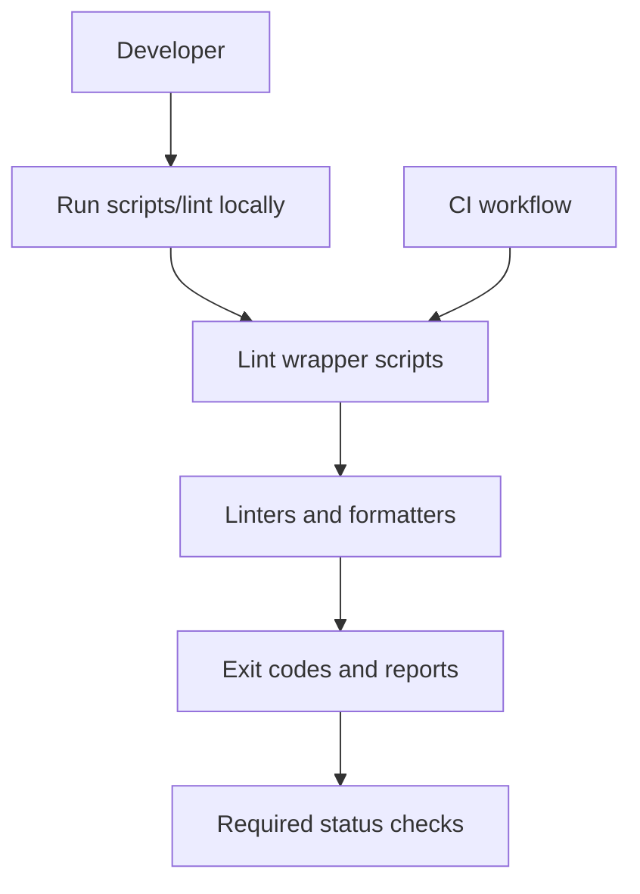

<!-- [KFM_META_BLOCK_V2]
doc_id: kfm://doc/1b4e6c9a-2c2d-4c7b-9c2c-7b29c2a0c4c7
title: scripts/lint/README.md
type: standard
version: v1
status: draft
owners: TBD
created: 2026-02-22
updated: 2026-02-22
policy_label: public
related:
  - ../../.github/workflows/               # (if present) CI wiring that calls these scripts
  - ../../docs/                            # (if present) repo-wide engineering + governance docs
tags: [kfm, lint, ci, devex]
notes:
  - This README documents conventions/contracts. Exact scripts/tools may differ by repo; keep the registry up-to-date.
[/KFM_META_BLOCK_V2] -->

# Lint scripts
Repo-local wrappers for linting/formatting that keep **local dev** and **CI** consistent (and fail-closed).

**Status:** draft • **Owners:** TBD


---

## Quick navigation
- [Purpose](#purpose)
- [Directory layout](#directory-layout)
- [How to run](#how-to-run)
- [Contracts](#contracts)
- [Linter registry](#linter-registry)
- [CI integration](#ci-integration)
- [Adding a new linter wrapper](#adding-a-new-linter-wrapper)
- [Troubleshooting](#troubleshooting)
- [Security and governance guardrails](#security-and-governance-guardrails)

---

## Purpose

This directory exists so we can:

- Run the **same** lint checks locally and in CI (no “works on my machine” rule drift).
- Keep lint commands **discoverable** and **standardized** across languages/subprojects.
- Make linting **safe** and **predictable** (no hidden network calls, no surprise write operations in CI).
- Provide a single place to update tool versions, configs, and invocation patterns.

> NOTE  
> This README is intentionally “contract-first”. If you add/rename scripts, update the [Linter registry](#linter-registry).

([↑ Back to top](#lint-scripts))

---

## Directory layout

### What’s confirmed
The only file you should assume exists from this README alone:

```text
scripts/lint/
└─ README.md
```

### Typical contents (update to match this repo)
Below is a **suggested** structure (not guaranteed to exist in your checkout):

```text
scripts/lint/
├─ all.sh                  # runs all enabled linters
├─ changed.sh              # runs linters only on changed files (git diff)
├─ eslint.sh               # JS/TS lint
├─ prettier.sh             # JS/TS/MD formatting
├─ ruff.sh                 # Python lint/format
├─ shellcheck.sh           # Shell script lint
├─ markdownlint.sh         # Markdown lint
├─ yamllint.sh             # YAML lint
└─ _lib.sh                 # shared helpers: logging, file discovery, arg parsing
```

([↑ Back to top](#lint-scripts))

---

## How to run

### Discover available commands
From repo root:

```bash
ls -la scripts/lint
```

If you see an `all.*` wrapper, that is usually the best starting point.

### Recommended local workflow
These are common patterns (adjust to match available scripts):

```bash
# Run everything (check mode)
./scripts/lint/all.sh

# Run everything (autofix mode)
./scripts/lint/all.sh --fix

# Only lint files changed vs main (fast)
./scripts/lint/changed.sh --since origin/main
```

### CI workflow
CI should run in **check mode** (no auto-fixes, no interactive prompts), e.g.:

```bash
./scripts/lint/all.sh --ci
```

([↑ Back to top](#lint-scripts))

---

## Contracts

Lint wrappers should follow these rules so they compose cleanly in CI and developer tooling.

### Exit codes
- `0` — all checks passed
- `1` — lint violations found (action required)
- `2` — wrapper/tool execution error (misconfiguration, missing dependency, crash)

### Default mode and flags
Wrappers SHOULD support:

- `--help`  
- `--ci` (non-interactive, stable output, no writes)  
- `--fix` (apply auto-fixes where the tool supports it)  
- `--files <...>` (optional: explicitly lint specific files)  
- `--since <git-ref>` / `--changed` (optional: lint only changed files)

Wrappers MUST:

- **Fail closed**: never use `|| true` or otherwise mask failures in CI.
- Print the **exact tool command** executed when failing (so failures are reproducible).
- Avoid network access by default (especially in CI).
- Be deterministic (pin tool versions via lockfiles, containers, or tool managers where applicable).

### Output discipline
- Human-friendly output by default.
- If machine-readable output is needed (SARIF, JSON), prefer `--format` or a dedicated CI flag and document it.

([↑ Back to top](#lint-scripts))

---

## Linter registry

Keep this table accurate for *this repo*. It’s the “single source of truth” for what CI expects.

| Scope | Wrapper script | Tool | Config files | Fix support |
|---|---|---|---|---|
| Shell | `scripts/lint/shellcheck.*` | ShellCheck | `.shellcheckrc` (if used) | N/A |
| JS/TS | `scripts/lint/eslint.*` | ESLint | `.eslintrc*` | Limited (rule-dependent) |
| JS/TS/MD | `scripts/lint/prettier.*` | Prettier | `.prettierrc*` | Yes |
| Python | `scripts/lint/ruff.*` | Ruff | `pyproject.toml` | Yes |
| Markdown | `scripts/lint/markdownlint.*` | markdownlint | `.markdownlint*` | Some |
| YAML | `scripts/lint/yamllint.*` | yamllint | `.yamllint*` | N/A |
| Dockerfiles | `scripts/lint/hadolint.*` | hadolint | `.hadolint.yaml` | N/A |

> TIP  
> If a tool is not used, remove the row. If a new tool is added, add a row and wire it into `all.*`.

([↑ Back to top](#lint-scripts))

---

## CI integration

Lint scripts are designed to be called from CI workflows directly, so CI stays thin and consistent.



### Principles
- CI calls wrappers, wrappers call tools.
- CI must treat any non-zero exit as a **blocking** failure.
- Prefer running “changed-only” checks on PRs, and “full” checks on merge/main (when speed matters).

([↑ Back to top](#lint-scripts))

---

## Adding a new linter wrapper

1. **Pick a wrapper name** under `scripts/lint/`  
   - Use clear names: `eslint.sh`, `ruff.sh`, `markdownlint.sh`
2. **Implement the contract**  
   - flags, exit codes, no `|| true`, no network calls by default
3. **Add configuration**  
   - prefer repo-root config files (tool-standard)
4. **Wire it into the aggregator**  
   - update `all.*` (if present)
5. **Update the registry table**  
   - add row in [Linter registry](#linter-registry)
6. **Add a minimal CI check**  
   - call the wrapper from the workflow (if CI exists)

### Minimal wrapper template (bash)
```bash
#!/usr/bin/env bash
set -euo pipefail

usage() {
  echo "Usage: $0 [--ci] [--fix] [--files <...>]" >&2
}

CI=0
FIX=0
FILES=()

while [[ $# -gt 0 ]]; do
  case "$1" in
    --help) usage; exit 0 ;;
    --ci) CI=1; shift ;;
    --fix) FIX=1; shift ;;
    --files) shift; while [[ $# -gt 0 && "$1" != --* ]]; do FILES+=("$1"); shift; done ;;
    *) echo "Unknown arg: $1" >&2; usage; exit 2 ;;
  esac
done

# TODO: run your tool here (print the command on failure)
```

([↑ Back to top](#lint-scripts))

---

## Troubleshooting

### “Command not found”
- Ensure you installed repo dependencies (Node/Python/etc).
- Prefer repo-local tool installs (e.g., `node_modules/.bin`) over global installs.

### CI passes locally but fails in GitHub Actions
- Check tool versions: lockfiles or container digests should be the source of truth.
- Check OS differences (GNU vs BSD utilities, line endings, etc.).
- Ensure wrappers aren’t reading from user-specific config paths.

### Lint wants to rewrite files in CI
- CI should run `--ci` / check mode.
- Local autofix should be explicit (`--fix`).

([↑ Back to top](#lint-scripts))

---

## Security and governance guardrails

- Wrappers MUST NOT exfiltrate data (no uploading source, logs, or artifacts to third parties).
- Wrappers SHOULD avoid network calls unless explicitly required and documented.
- Wrappers MUST NOT modify generated/canonical artifacts in CI (CI is validation, not mutation).
- Any lint step that depends on secrets MUST be carefully scoped and reviewed (least privilege).

([↑ Back to top](#lint-scripts))
