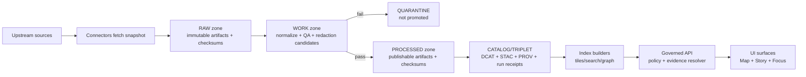

<!-- [KFM_META_BLOCK_V2]
doc_id: kfm://doc/7d1a1d67-3f10-4d6a-9d21-2f7a4a2b9b25
title: scripts/promote — Promotion Contract tooling
type: standard
version: v1
status: draft
owners: KFM Platform + Governance (TBD)
created: 2026-02-22
updated: 2026-02-22
policy_label: internal
related:
  - kfm://doc/promotion-contract
  - kfm://doc/run-receipts
  - kfm://doc/catalog-triplet
tags: [kfm, promotion, governance, pipelines, gitops]
notes:
  - This README is contract-first; filenames/entrypoints may need to be aligned to the repo’s actual implementation.
[/KFM_META_BLOCK_V2] -->

# scripts/promote
Promotion Contract tooling — **fail-closed** gates for moving dataset versions into governed runtime surfaces.  
**Status:** draft • **Owners:** KFM Platform + Governance (TBD)


---

## Navigation
- [Purpose](#purpose)
- [Concepts](#concepts)
- [Directory layout](#directory-layout)
- [Promotion Contract v1 gates](#promotion-contract-v1-gates)
- [Quarantine and fail-closed behavior](#quarantine-and-fail-closed-behavior)
- [Workflow](#workflow)
- [CLI interface contract](#cli-interface-contract)
- [Inputs and outputs](#inputs-and-outputs)
- [Troubleshooting](#troubleshooting)
- [Appendix: templates](#appendix-templates)

---

## Purpose

The `scripts/promote/` area defines (and/or contains) the **promotion** automation that enforces KFM’s governance intent as **enforceable behavior**.

Promotion is the act of moving a dataset version from **Raw/Work** into **Processed + Catalog/Lineage**, enabling it to be served by governed runtime surfaces (API + UI).

> **NOTE (not confirmed in repo):** If the concrete script names differ from what’s described below, keep the *contract* stable and update only the entrypoint names/paths.

---

## Concepts

### The truth path and lifecycle zones

KFM’s data lifecycle is explicitly zoned:

- **RAW**: immutable acquisition artifacts + checksums + minimal metadata
- **WORK / QUARANTINE**: intermediate transforms, QA reports, redaction candidates; quarantine for items that must not be promoted
- **PROCESSED**: publishable artifacts in approved formats + checksums + runtime-derived metadata
- **CATALOG/TRIPLET**: metadata + lineage surface (DCAT + STAC + PROV)
- **PUBLISHED**: governed runtime serving only promoted dataset versions



### Catalog triplet responsibilities

- **DCAT**: dataset-level metadata (publisher, license/rights, distributions)
- **STAC**: asset-level spatiotemporal metadata (collections, items, assets)
- **PROV**: lineage (inputs, tools, parameters, runs)

---

## Directory layout

### Current inventory
> **Unknown (not confirmed in repo):** This README cannot assert what scripts already exist.  
> Update this section after implementation to list the *actual* entrypoints and versions.

### Expected layout (contract target)

```text
scripts/
└─ promote/
   ├─ README.md
   ├─ promote.*                # main entrypoint: validate gates + write manifest
   ├─ validate.*               # preflight validation (gates A–F at minimum)
   ├─ schemas/                 # JSON Schemas (promotion manifest, run receipt, profiles)
   ├─ templates/               # canonical templates (promotion manifest, run receipt)
   ├─ fixtures/                # tiny fixture datasets for CI policy + contract tests
   └─ libs/                    # shared helpers (hashing, canonicalization, link checks)
```

---

## Promotion Contract v1 gates

A dataset version promotion **MUST** be blocked unless all required artifacts exist and validate.

| Gate | What it enforces (fail-closed) |
|---|---|
| **A — Identity and versioning** | Dataset ID is stable and follows naming conventions. DatasetVersion ID is immutable and derived from a stable `spec_hash`. |
| **B — Licensing and rights metadata** | License is explicit and compatible with intended use. Rights holder + attribution requirements captured. If unclear ⇒ stay in **QUARANTINE**. |
| **C — Sensitivity classification and redaction plan** | `policy_label` assigned. If sensitive-location/restricted ⇒ redaction or generalization plan exists and is recorded in PROV. |
| **D — Catalog triplet validation** | DCAT validates against KFM profile. STAC validates (if applicable). PROV validates. Cross-links between DCAT/STAC/PROV are resolvable. |
| **E — Run receipt and checksums** | `run_receipt` exists per producing run. Inputs/outputs enumerated with checksums. Environment recorded (container digest, params). |
| **F — Policy + contract tests** | OPA policy tests pass for dataset version (fixtures-driven). Evidence resolver can resolve at least one EvidenceRef in CI. API contracts/schemas validate. |
| **G — Optional but recommended** | SBOM + build provenance for pipeline images & API/UI artifacts; performance smoke checks; accessibility smoke checks. |

---

## Quarantine and fail-closed behavior

Promotion must be **fail-closed**.

Quarantine triggers (non-exhaustive):

- license unclear
- validation fails
- sensitivity unclear
- upstream instability prevents reproducible acquisition

Quarantine requirements:

- reason code
- remediation plan (who, by when)
- default policy decision: **deny publish**

**Do not “temporarily promote” quarantined datasets.**

---

## Workflow

### PR-based workflow (recommended)

1. Contributor opens PR adding:
   - source registry entry
   - pipeline spec
   - fixture data (small sample) + expected outputs
2. CI runs:
   - schema validation
   - policy tests
   - `spec_hash` stability test
   - link checks for catalogs
3. Steward review:
   - licensing + sensitivity
   - approve `policy_label`
4. Operator merges and triggers pipeline run in controlled environment.
5. Outputs written to **processed + catalogs**.
6. Release manifest created and tagged.

This makes promotion both **social + technical**, not ad hoc.

---

## CLI interface contract

> **PROPOSED:** Keep these flags stable once implemented. If your repo uses a different entrypoint name, update the command examples, not the behavior.

### Validate (preflight)

```bash
# Validate gates A–F (minimum) without writing PUBLISHED pointers.
./scripts/promote/validate \
  --dataset-slug "<dataset_slug>" \
  --dataset-version-id "<dataset_version_id>" \
  --spec "path/to/spec.json" \
  --workspace "path/to/work_or_build_dir"
```

### Promote (emit manifest + append audit)

```bash
# Promote a dataset version: validate gates, then emit promotion manifest + receipts + catalogs.
./scripts/promote/promote \
  --dataset-slug "<dataset_slug>" \
  --dataset-version-id "<dataset_version_id>" \
  --spec "path/to/spec.json" \
  --outputs "path/to/processed_and_catalog_outputs" \
  --approver "principal:<id>" \
  --approver-role "steward"
```

### Dry-run mode (recommended)

```bash
./scripts/promote/promote ... --dry-run
```

Expected dry-run behavior:
- validates all gates
- prints what would be written (paths + digests)
- does **not** mutate pointers used by runtime

---

## Inputs and outputs

### Inputs (minimum)

- **Dataset identity**
  - `dataset_slug`
  - `dataset_version_id`
  - `spec_hash` (derived from canonical spec)
- **Zone artifacts**
  - RAW acquisition artifacts + checksums
  - WORK outputs (QA, redaction candidates)
  - PROCESSED artifacts + checksums
- **Catalogs**
  - DCAT dataset record
  - STAC collection/items (if applicable)
  - PROV bundle
- **Governance**
  - `policy_label`
  - decision record / approval metadata (when required)

### Outputs (minimum)

- **Promotion manifest** (release descriptor)
- **Run receipt(s)** (per producing run)
- **Validated catalog triplet** (DCAT/STAC/PROV)
- **Audit ledger append** (immutable record of what/when/who/why)
- **(Optional)** release tag / bundle artifact

---

## Troubleshooting

Common failures and what they usually mean:

- **Gate A fails (identity/spec_hash)**  
  Your spec canonicalization is not stable (ordering, timestamps, platform-dependent fields). Fix canonical JSON + add a stability test.

- **Gate B fails (license/rights)**  
  Rights unclear ⇒ dataset must remain in QUARANTINE. Capture license snapshot / rights holder / attribution.

- **Gate C fails (sensitivity)**  
  You are missing a `policy_label` and/or redaction/generalization plan recorded in PROV.

- **Gate D fails (catalog triplet)**  
  Schema mismatch against KFM profiles or broken links between DCAT/STAC/PROV.

- **Gate E fails (receipts/digests)**  
  Missing `run_receipt`, missing checksums, or environment not recorded (container digest, params).

- **Gate F fails (policy/contract tests)**  
  OPA fixtures failing, evidence resolver cannot resolve EvidenceRefs, or API/schema contracts invalid.

---

## Appendix: templates

### Promotion manifest (v1)

```json
{
  "kfm_promotion_manifest_version": "v1",
  "dataset_slug": "example_dataset",
  "dataset_version_id": "2026-02.abcd1234",
  "spec_hash": "sha256:abcd1234",
  "released_at": "2026-02-20T13:00:00Z",
  "artifacts": [
    {
      "path": "events.parquet",
      "digest": "sha256:2222",
      "media_type": "application/x-parquet"
    }
  ],
  "catalogs": [
    { "path": "dcat.jsonld", "digest": "sha256:4444" },
    { "path": "stac/collection.json", "digest": "sha256:5555" },
    { "path": "prov/bundle.jsonld", "digest": "sha256:6666" }
  ],
  "qa": { "status": "pass", "report_digest": "sha256:7777" },
  "policy": { "policy_label": "public", "decision_id": "kfm://policy_decision/xyz" },
  "approvals": [
    { "role": "steward", "principal": "<id>", "approved_at": "2026-02-20T12:59:00Z" }
  ]
}
```

### Run receipt (v1)

```json
{
  "run_id": "kfm://run/2026-02-20T12:00:00Z.abcd",
  "actor": { "principal": "svc:pipeline", "role": "pipeline" },
  "operation": "ingest+publish",
  "dataset_version_id": "2026-02.abcd1234",
  "inputs": [
    { "uri": "raw/source.csv", "digest": "sha256:1111" }
  ],
  "outputs": [
    { "uri": "processed/events.parquet", "digest": "sha256:2222" }
  ],
  "environment": {
    "container_digest": "sha256:img...",
    "git_commit": "deadbeef",
    "params_digest": "sha256:3333"
  },
  "validation": { "status": "pass", "report_digest": "sha256:7777" },
  "policy": { "decision_id": "kfm://policy_decision/xyz" },
  "created_at": "2026-02-20T12:05:00Z"
}
```

---

[Back to top](#scriptspromote)
