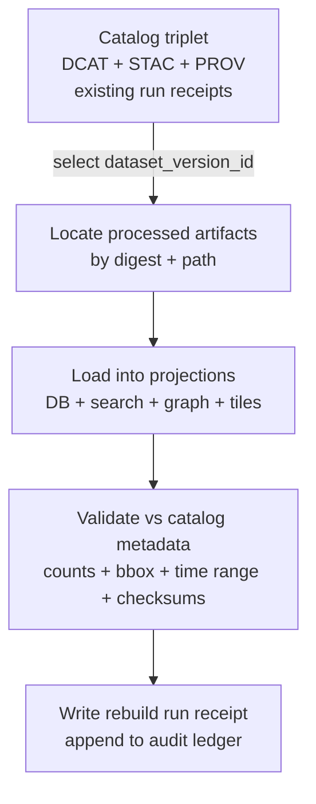

<!-- [KFM_META_BLOCK_V2]
doc_id: kfm://doc/52168ddd-4e1d-479a-94a6-11a3672925fa
title: scripts/rebuild — Rebuildable Projections Runbook
type: standard
version: v1
status: draft
owners: TBD
created: 2026-02-22
updated: 2026-02-22
policy_label: public
related:
  - kfm://doc/UNKNOWN (KFM Definitive Design & Governance Guide vNext, 2026-02-20)
tags: [kfm, rebuild, pipelines, provenance, governance]
notes:
  - Contract-first README. Replace TBD/UNKNOWN once repo wiring is confirmed.
[/KFM_META_BLOCK_V2] -->

# scripts/rebuild
Deterministic rebuild of **rebuildable projections** from **canonical catalogs + promoted artifacts**.  
**Status:** draft • **Owners:** TBD


## Quick links
- [Overview](#overview)
- [What rebuild is not](#what-rebuild-is-not)
- [When to run rebuild](#when-to-run-rebuild)
- [Directory tree](#directory-tree)
- [Canonical storage layout](#canonical-storage-layout-recommended)
- [Rebuild pipeline](#rebuild-pipeline)
- [Targets and contracts](#targets-and-contracts)
- [CLI contract](#cli-contract)
- [Run receipts and audit ledger](#run-receipts-and-audit-ledger)
- [Safety and governance invariants](#safety-and-governance-invariants)
- [Disaster recovery](#disaster-recovery)
- [Troubleshooting](#troubleshooting)
- [Contributing](#contributing)

---

## Overview

KFM treats **object storage + catalogs + provenance + audit ledger** as the **canonical source of truth**.  
Everything else (databases, search, graph, tile caches, vector indexes) is a **projection** that must be **rebuildable**.

This directory is the **operational + engineering home** for those rebuild steps.

> [!NOTE]
> The *concept* “projections are rebuildable” is **CONFIRMED**.  
> Specific store choices (e.g., which search engine) are **PROPOSED/UNKNOWN** until this repo’s implementation is verified.

### Canonical vs rebuildable (mental model)

| Category | Examples | Mutation rules |
|---|---|---|
| Canonical (source of truth) | promoted artifacts; DCAT/STAC/PROV catalogs; run receipts; audit ledger | **Append-only**. New version supersedes old. |
| Rebuildable projections | PostGIS feature tables; text search index; graph edges; tile bundles | **Disposable**. Can be dropped and rebuilt from canonical. |

[Back to top](#scriptsrebuild)

---

## What rebuild is not

> [!WARNING]
> **Rebuild is not promotion.**  
> Rebuild consumes **already-promoted** dataset versions and populates projections.

Rebuild scripts MUST NOT:
- “fix data in place” by editing canonical artifacts or catalogs
- silently rewrite catalog metadata
- create unverifiable “shadow truth” (e.g., a search index that returns results that can’t be traced to an EvidenceRef)

If the canonical truth needs to change, create a **new DatasetVersion** (new spec_hash / new receipt) via ingestion + promotion.

[Back to top](#scriptsrebuild)

---

## When to run rebuild

Typical triggers:
- **Fresh environment** (new dev machine / new cluster)
- **After disaster recovery** (object store restored; databases wiped)
- **After projection schema changes** (e.g., DB migration for a projection)
- **After index corruption** (search or graph needs re-index)

Non-triggers:
- “We need a dataset to become visible” → that’s **promotion**, not rebuild.

[Back to top](#scriptsrebuild)

---

## Directory tree

> [!TIP]
> Keep this tree accurate. If you add new rebuild targets, add them here.

```text
scripts/
└─ rebuild/
   └─ README.md  # this file
```

[Back to top](#scriptsrebuild)

---

## Canonical storage layout (recommended)

This is the **recommended** (PROPOSED) canonical object-store layout used by KFM to make rebuild and disaster recovery predictable.
If this repo uses a different layout, **update this section** and keep the *rules* unchanged.

```text
data/
  raw/
    <dataset_slug>/
      <acquisition_id>/
        manifest.json
        artifacts/...
  work/
    <dataset_slug>/
      <work_run_id>/...
  processed/
    <dataset_slug>/
      <dataset_version_id>/
        artifacts/<artifact_name>.<ext>
        checksums.json
        qa/validation_report.json
  catalog/
    <dataset_slug>/
      <dataset_version_id>/
        dcat.jsonld
        stac/
          collection.json
          items/<item_id>.json
        prov/bundle.jsonld
        receipts/run_receipt.json
```

**Rules (MUST):**
- Only **processed** + **catalog** artifacts are eligible to be served to runtime (API/UI).
- Every artifact is addressed by a **digest** and must appear in `checksums.json`.
- Keep manifests and receipts **close to artifacts** so the truth path is navigable even without a database.

[Back to top](#scriptsrebuild)

---

## Rebuild pipeline

### Contract (must exist)

At minimum, a rebuild pipeline is:

1) read catalogs for a `dataset_version_id`  
2) locate processed artifacts by digest/path  
3) load into projections (PostGIS, search, graph, tile caches)  
4) validate counts/extents against catalog metadata  
5) record a rebuild receipt in the audit ledger

### Mermaid (conceptual)



[Back to top](#scriptsrebuild)

---

## Targets and contracts

This table is **contract-first**: it describes what each rebuild target MUST guarantee, regardless of which underlying technology is used.

| Target | Purpose | Hard requirements (fail-closed) | Notes |
|---|---|---|---|
| `postgis` (projection) | spatial filtering & query acceleration | Every feature row carries `dataset_version_id` and `evidence_ref`. Projection is rebuildable from processed GeoParquet. | Store selection is repo-dependent. |
| `search` (projection) | dataset/story/document discovery | Index entries include `dataset_version_id`, `artifact digest`, `evidence_ref`, `policy_label`, spatial+temporal extents. Search results MUST resolve to EvidenceRefs. | Avoid “shadow sources”. |
| `graph` (projection, optional early) | relationship traversal / entity linking | Nodes/edges must be derivable from catalogs + governed entity-resolution outputs. | Introduce dedicated graph DB only when needed. |
| `tiles` (projection) | fast map rendering | Tile bundles are derived from processed features and inherit policy label + generalization. | PMTiles/MBTiles/etc are implementation details. |
| `vector` (projection, optional) | semantic retrieval | Embeddings keyed by artifact digest + chunk id. Retrieval returns EvidenceRefs; must not bypass evidence resolution. | Store chunk text only if allowed by policy. |

### Minimum inputs for every target

Every rebuild target MUST be able to operate from:

- `dataset_version_id` (immutable version identifier)
- validated catalogs (DCAT + STAC + PROV) for that dataset version
- processed artifacts referenced by those catalogs (by digest)
- policy label and any redaction/generalization obligations (from catalogs / provenance)

[Back to top](#scriptsrebuild)

---

## CLI contract

**Repo wiring is UNKNOWN**, so the exact executable(s) may differ.  
However, every rebuild entrypoint SHOULD implement the same stable CLI contract so operators and CI can run it consistently.

### Required flags (MUST)

- `--dataset-version-id <id>`  
- `--dataset-slug <slug>` *(or resolvable from the catalog path)*  
- `--targets postgis,search,...` *(at least one)*

### Recommended flags (SHOULD)

- `--data-root <path>` (default: `./data` or repo-configured)
- `--catalog-root <path>` (default derived from `--data-root`)
- `--processed-root <path>` (default derived from `--data-root`)
- `--audit-root <path>` (append-only ledger location)
- `--dry-run` (no writes)
- `--force` (rebuild even if projection appears “up to date”)
- `--max-records <n>` (for safe local testing)
- `--log-json` (machine-readable logs)
- `--policy-context <file|json>` (explicit policy inputs for validation)

### Exit codes (MUST)

- `0` success
- non-zero on **any** validation failure, checksum mismatch, missing artifact, or policy denial

[Back to top](#scriptsrebuild)

---

## Run receipts and audit ledger

Every rebuild is a **governed operation** and MUST emit a run receipt capturing:

- inputs and outputs (by digest)
- environment (container digest, git commit, params digest)
- validation results (pass/fail + report digest)
- policy decision reference(s)
- timestamps and operator identity (principal/role)

### Receipt template (JSON)

```json
{
  "run_id": "kfm://run/<timestamp>.<shortid>",
  "actor": { "principal": "svc:rebuild", "role": "pipeline" },
  "operation": "rebuild_projections",
  "dataset_version_id": "<dataset_version_id>",
  "targets": ["postgis", "search"],
  "inputs": [
    { "uri": "catalog/<dataset_slug>/<dataset_version_id>/dcat.jsonld", "digest": "sha256:..." },
    { "uri": "processed/<dataset_slug>/<dataset_version_id>/checksums.json", "digest": "sha256:..." }
  ],
  "outputs": [
    { "uri": "projection://postgis/<dataset_version_id>", "digest": "sha256:optional" },
    { "uri": "projection://search/<dataset_version_id>", "digest": "sha256:optional" }
  ],
  "environment": {
    "container_digest": "sha256:...",
    "git_commit": "<commit>",
    "params_digest": "sha256:..."
  },
  "validation": { "status": "pass|fail", "report_digest": "sha256:..." },
  "policy": { "decision_id": "kfm://policy_decision/..." },
  "created_at": "2026-02-22T00:00:00Z"
}
```

> [!IMPORTANT]
> Audit logs and receipts can be sensitive. Apply redaction + retention policy. Do not log secrets.

[Back to top](#scriptsrebuild)

---

## Safety and governance invariants

These are **non-negotiable** for rebuild scripts.

### Fail-closed checklist (operator / CI)

- [ ] Catalog triplet exists for the `dataset_version_id`
- [ ] Catalogs validate against profiles (DCAT/STAC/PROV)
- [ ] Cross-links resolve (DCAT ↔ STAC ↔ PROV ↔ receipts)
- [ ] All referenced artifacts exist and match `checksums.json`
- [ ] Policy label is present and honored by the projection (no de-generalization)
- [ ] Projection build completes and validation checks pass (counts/extents)
- [ ] A rebuild run receipt is written (and appended to audit ledger)

### Trust membrane note

Rebuild scripts are *operator tooling*, not end-user surfaces, but they must still preserve the trust model:

- Projections must not become alternate sources of truth
- Anything served to UI/API must still be explainable via catalogs + evidence resolution

[Back to top](#scriptsrebuild)

---

## Disaster recovery

Disaster recovery is intentionally simple:

1) restore object storage and catalogs (canonical)  
2) replay rebuild pipeline to regenerate all projections

### Minimal DR runbook

- [ ] Restore canonical `data/` (or equivalent object store prefix)
- [ ] Verify catalogs + checksums (spot check at least one dataset_version_id)
- [ ] Run rebuild for all promoted dataset versions (batched)
- [ ] Smoke test: evidence resolver resolves a public EvidenceRef end-to-end
- [ ] Smoke test: API can serve a known public tile/feature query

[Back to top](#scriptsrebuild)

---

## Troubleshooting

### “Catalog exists but rebuild can’t find artifacts”
- Verify you’re using the same `data-root` / processed storage prefix the catalogs were generated with.
- Verify `checksums.json` paths align to your runtime environment.

### “Search results appear but can’t be cited”
- Your search index is likely missing or corrupting `evidence_ref` or `dataset_version_id`.
- Treat this as a **hard failure**: the index is not valid until citations resolve.

### “Rebuild succeeded but UI/API can’t see data”
- Rebuild populates projections; API must still be configured to point at those projections.
- Verify governed API configuration + policy settings.

[Back to top](#scriptsrebuild)

---

## Contributing

When adding a new rebuild target:

1) Define the target contract (inputs, outputs, validation rules)  
2) Implement a rebuild script that is deterministic and idempotent  
3) Add CI tests (schema validation, checksum checks, citation-resolve smoke test)  
4) Update the [Directory tree](#directory-tree) and [Targets and contracts](#targets-and-contracts)

---
