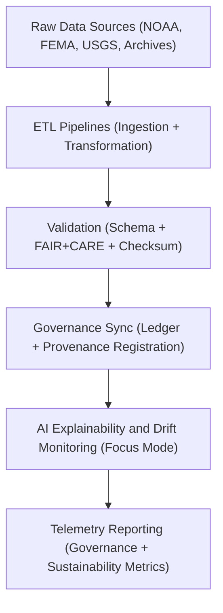
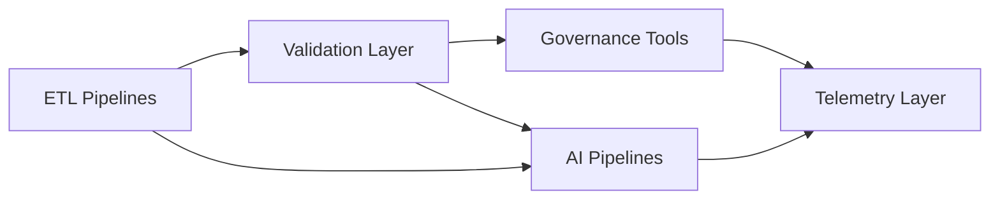

<div align="center">

# 🏗️ Kansas Frontier Matrix — **Source Architecture & Pipeline Design**
`src/ARCHITECTURE.md`

**Purpose:**  
This document defines the **structural, modular, and ethical design of the KFM source system**, covering all ETL, AI, governance, and telemetry pipelines.  
It establishes FAIR+CARE-aligned development principles ensuring **transparency, reproducibility, and sustainability** across every automated process in the Kansas Frontier Matrix.

[](../docs/standards/faircare-validation.md)
[](../LICENSE)
[](../docs/architecture/repo-focus.md)

</div>

---

## 📚 Overview

The **Source Architecture** provides the structural backbone for all data operations in the Kansas Frontier Matrix (KFM).  
It unifies ETL workflows, AI explainability, governance synchronization, and telemetry collection through modular, FAIR+CARE-compliant Python code.  

Every pipeline operates under:
- ISO and FAIR+CARE certification  
- Reproducibility-first design  
- Provenance and checksum validation  
- AI explainability and ethics integration  

---

## 🧩 Core Architectural Layers

| Layer | Purpose | Directory | Compliance |
|--------|----------|------------|-------------|
| **ETL** | Extract, transform, and load raw datasets into standardized FAIR+CARE schemas. | `src/pipelines/etl/` | FAIR+CARE + ISO 19115 |
| **AI** | Manage explainable AI pipelines for Focus Mode, ethics validation, and bias detection. | `src/pipelines/ai/` | CARE + AI Act + ISO/IEC 42001 |
| **Validation** | Perform schema, checksum, and FAIR+CARE ethics audits on all datasets. | `src/pipelines/validation/` | FAIR+CARE + DCAT 3.0 |
| **Governance** | Maintain blockchain-ledger synchronization and provenance updates. | `src/pipelines/governance/` | FAIR+CARE + MCP-DL v6.3 |
| **Telemetry** | Monitor pipeline health, sustainability, and performance for Focus Mode dashboards. | `src/pipelines/telemetry/` | FAIR + ISO 50001 |

---

## ⚙️ Architectural Workflow



### Design Philosophy
- **Traceability:** Every process is checksum-verified and ledger-logged.  
- **Ethics:** All transformations follow FAIR+CARE and ISO governance frameworks.  
- **Modularity:** Independent pipelines share interoperable utility libraries.  
- **Sustainability:** Energy and performance telemetry tracked under ISO 50001.  

---

## 🧠 FAIR+CARE Architectural Alignment

| FAIR+CARE Principle | Implementation Strategy |
|----------------------|--------------------------|
| **Findable** | Each pipeline registered with manifest entries and provenance records. |
| **Accessible** | Source code licensed under MIT and documented with MCP-DL v6.3 templates. |
| **Interoperable** | Compliant with DCAT 3.0, STAC 1.0, and ISO metadata schemas. |
| **Reusable** | Modular design allows reusability across domains and FAIR+CARE audits. |
| **Collective Benefit** | Encourages open, ethical data reuse and reproducibility. |
| **Authority to Control** | FAIR+CARE Council validates code changes via governance workflows. |
| **Responsibility** | All developers follow documented governance and ethics review cycles. |
| **Ethics** | AI and automation pipelines continuously monitored for bias and sustainability. |

---

## 🧩 Module Dependencies



### Dependency Rules
- ETL pipelines produce standardized data contracts for validation and AI use.  
- Validation results feed governance synchronization processes.  
- AI and telemetry layers exchange explainability and sustainability data.  
- All modules report to FAIR+CARE governance ledgers in `data/reports/audit/`.  

---

## 🧩 Example Provenance Record

```json
{
  "id": "src_architecture_pipeline_v9.5.0_2025Q4",
  "modules": ["ETL", "AI", "Validation", "Governance", "Telemetry"],
  "pipelines_active": 32,
  "checksum_verified": true,
  "ai_explainability_score": 0.991,
  "fairstatus": "certified",
  "sustainability_metrics": {
    "energy_wh": 24.8,
    "carbon_offset_gco2e": 19.7
  },
  "governance_registered": true,
  "telemetry_ref": "releases/v9.5.0/focus-telemetry.json",
  "governance_ref": "reports/audit/ai_src_architecture_ledger.json",
  "created": "2025-11-02T23:59:00Z",
  "validator": "@kfm-architecture"
}
```

---

## 🧾 Design Standards & Compliance

| Standard | Description | Alignment |
|-----------|--------------|------------|
| **MCP-DL v6.3** | Documentation-first architecture compliance. | Full |
| **ISO 19115** | Metadata lineage and schema governance. | Full |
| **ISO 50001** | Energy management and telemetry tracking. | Full |
| **ISO 14064** | Sustainability reporting and emissions tracking. | Partial |
| **FAIR+CARE Framework** | Ethical and transparent data governance. | Full |
| **AI Act (Draft EU 2025)** | AI accountability, explainability, and bias prevention. | Partial |

---

## 🧾 Retention Policy

| Asset Type | Retention Duration | Policy |
|-------------|--------------------|--------|
| Source Code | Permanent | Version-controlled with lineage and SBOM tracking. |
| Validation Artifacts | 365 days | Archived for reproducibility. |
| FAIR+CARE Certifications | Permanent | Stored under governance registry. |
| Provenance Records | Permanent | Maintained in immutable blockchain ledger. |

Automation managed by `src_architecture_sync.yml`.

---

## 🧾 Internal Use Citation

```text
Kansas Frontier Matrix (2025). Source Architecture & Pipeline Design (v9.5.0).
Comprehensive FAIR+CARE-certified architectural framework defining ETL, AI, governance, and telemetry systems.
Ensures transparent, reproducible, and ethical automation under MCP-DL v6.3 and ISO standards.
```

---

## 🧾 Version Notes

| Version | Date | Notes |
|----------|------|--------|
| v9.5.0 | 2025-11-02 | Added ISO sustainability metrics and AI explainability alignment. |
| v9.3.2 | 2025-10-28 | Integrated governance synchronization layer with checksum validation. |
| v9.3.0 | 2025-10-26 | Established source architecture and modular FAIR+CARE-compliant design. |

---

<div align="center">

**Kansas Frontier Matrix** · *Architecture × FAIR+CARE Governance × Provenance Integrity*  
[🔗 Repository](https://github.com/bartytime4life/Kansas-Frontier-Matrix) • [🧭 Docs Portal](../docs/) • [⚖️ Governance Ledger](../docs/standards/governance/)

</div>
