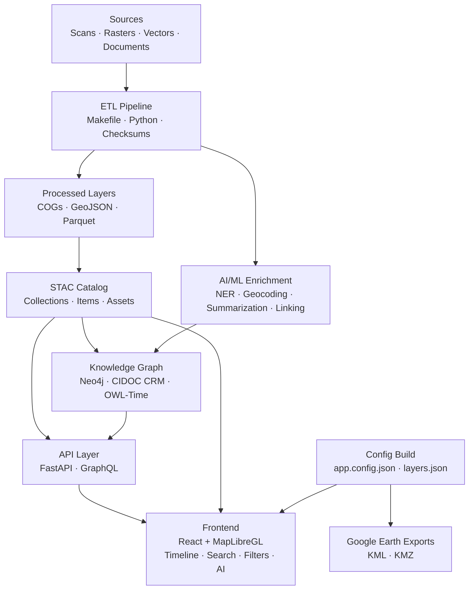
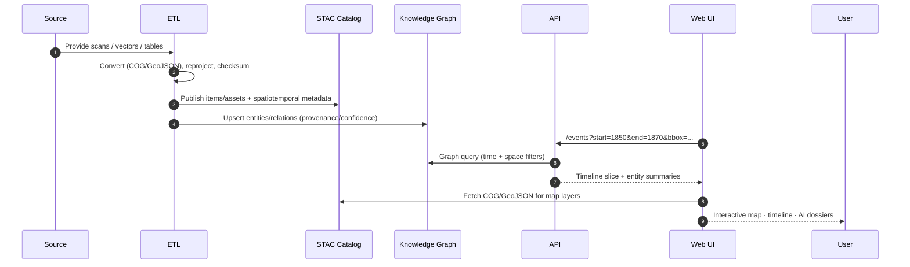

<div align="center">

# 🏛 Kansas Frontier Matrix — **System Architecture**  
`src/ARCHITECTURE.md`

**⛰ Time · 🌍 Terrain · 📜 History · 🔗 Knowledge Graphs**  
_A mission-grade, open-source, reproducible spatiotemporal knowledge hub for Kansas_

[](../.github/workflows/site.yml)  
[](../.github/workflows/stac-validate.yml)  
[](../.github/workflows/codeql.yml)  
[](../.github/workflows/trivy.yml)  
[](../docs/)  
[](../LICENSE)

</div>

---

```yaml
---
title: "KFM • System Architecture"
version: "v1.7.0"
last_updated: "2025-10-17"
created: "2024-12-12"
owners: ["@kfm-architecture", "@kfm-engineering"]
status: "Stable"
maturity: "Production"
tags: ["architecture","etl","stac","nlp","knowledge-graph","api","web","mcp","observability"]
license: "MIT | CC-BY 4.0"
semantic_alignment:
  - STAC 1.0.0
  - CIDOC CRM
  - OWL-Time
  - DCAT 2.0
  - PeriodO
  - FAIR Principles
  - MCP-DL v6.3 (Reproducibility · Provenance · Accessibility)
---
```

## 📚 Table of Contents

1. [🔭 Overview](#-overview)  
2. [🏗 System Layers](#-system-layers)  
3. [🧭 High-Level Architecture](#-high-level-architecture)  
4. [📦 Pipeline Sequence (Swimlane)](#-pipeline-sequence-swimlane)  
5. [🎨 Layer Timeline Legend](#-layer-timeline-legend)  
6. [🗂 Data Standards & Semantics](#-data-standards--semantics)  
7. [🔬 Reproducibility & Observability](#-reproducibility--observability)  
8. [🚀 Extending the System](#-extending-the-system)  
9. [📁 Repository & Data Layout](#-repository--data-layout)  
10. [🧮 Versioning & Metadata](#-versioning--metadata)  
11. [🧾 Changelog](#-changelog)  
12. [📖 References](#-references)

---

## 🔭 Overview

**Kansas Frontier Matrix (KFM)** is a **spatiotemporal knowledge platform** that unites **geography, climate, archaeology, treaties, disasters, and oral histories** into a single **map + timeline + knowledge graph**.  
Built for **reproducibility**, **provenance**, and **auditability** under **MCP-DL v6.3**, KFM couples **open standards** (STAC, CIDOC, OWL-Time, DCAT, PeriodO) with **deterministic ETL/AI** to produce a transparent, queryable “living atlas” of Kansas.

---

## 🏗 System Layers

- **ETL / Ingestion** — normalize inputs (COG / GeoJSON / Parquet), compute checksums, emit **STAC Items**  
- **AI/ML Enrichment** — NER, geoparsing, entity linking, summarization, confidence scoring  
- **Knowledge Graph** — **Neo4j** schema mapped to **CIDOC CRM** + **OWL-Time** with PeriodO period tags  
- **API Layer** — **FastAPI / GraphQL**: time/space search, dossiers, exports (KML/KMZ)  
- **Frontend** — React + MapLibre: timeline, layers, legends, **AI Assistant**, a11y-first UI

---

## 🧭 High-Level Architecture


<!-- END OF MERMAID -->

> **Design Tenets:** documentation-first, deterministic dataflow, explicit schema contracts, and total provenance from source to screen.

---

## 📦 Pipeline Sequence (Swimlane)


<!-- END OF MERMAID -->

---

## 🎨 Layer Timeline Legend

| Category               | Examples                      | Time Range   | Color Token | Notes                           |
| :--------------------- | :---------------------------- | :----------- | :---------- | :------------------------------ |
| 🏔 Terrain & DEMs      | LiDAR 1m DEM, Hillshade       | 2018–2020    | `#6C757D`   | Basemap + hillshade             |
| 🗺 Historic Topos      | USGS 1894 Larned, 1930s Topos | 1890–1950s   | `#8D5524`   | Scanned topos (COGs)            |
| 🧾 Treaties & Cessions | 1854 Treaty, Royce Polygons   | 1820–1870s   | `#0077B6`   | Polygons linked to treaty docs  |
| 🌊 Hydrology           | 1951 Flood, Streamflow        | 1850–Present | `#0096C7`   | Floodplains, reservoirs         |
| 🌾 Land Use & Soils    | 1937 Soil, NLCD               | 1850–Present | `#52B788`   | Cropland/prairie change         |
| 🚂 Infrastructure      | Railroads, Trails             | 1850–1950s   | `#E63946`   | Trails/rails fade on disuse     |
| 🌪 Hazards             | Tornado Tracks, Disasters     | 1950–Present | `#F77F00`   | Tornado lines/points, drought   |
| 🏛 Cultural/Oral       | Oral Histories, Sites         | Any          | `#9D4EDD`   | Linked to documents & summaries |

**Canonical `layers.json` example**:

```json
{
  "id": "treaty_1854",
  "label": "Treaty of 1854",
  "type": "vector-geojson",
  "source": { "url": "/data/processed/treaty_1854.geojson" },
  "time": { "start": "1854-01-01", "end": "1854-12-31" },
  "style": { "fillColor": "#0077B6", "fillOpacity": 0.35, "strokeColor": "#004C7F", "strokeWidth": 1 },
  "legend": { "category": "Treaties & Cessions" },
  "visible": false
}
```

---

## 🗂 Data Standards & Semantics

- **Formats:** GeoJSON, COG GeoTIFF, CSVW, Parquet  
- **Catalog:** **STAC 1.0.0** (Collections/Items/Assets) with JSON Schema CI checks  
- **Ontologies:** **CIDOC CRM** (heritage/semantics), **OWL-Time** (temporality), **PeriodO** (period tags)  
- **Catalog Interop:** **DCAT 2.0** mapping for machine indexing; optional JSON-LD export  
- **UI Config:** `web/config/layers.json`, `app.config.json` — built deterministically from STAC and validated in CI

---

## 🔬 Reproducibility & Observability

- **Docs-First:** `docs/architecture.md`, `docs/sop.md`, `docs/experiment.md`, `docs/model_card.md`  
- **CI/CD:** Lint/tests, **STAC validation**, **CodeQL**, **Trivy**, coverage gates, preview deploys  
- **Containers:** Docker Compose stack (ETL, API, DB, UI) with pinned digests  
- **Integrity:** `.sha256` sidecars + manifest lock; optional DVC/LFS for large artifacts  
- **Telemetry (opt-in):** ETL metrics, API latency, graph upsert counters; logs persisted per run

---

## 🚀 Extending the System

1. **Create manifest** → `data/sources/{id}.json`  
2. **Run ETL**

   ```bash
   make fetch convert stac
   ```
3. **Graph upsert** → `src/graph/schema.py` & pipeline inserts  
4. **Web layer** → add in `web/config/layers.json` (time · style · legend)  
5. **Docs/Tests** → update `docs/sop.md`; add tests in `tests/pipelines/`

> Each step emits logs + checksums and is validated in CI.

---

## 📁 Repository & Data Layout

```text
KansasFrontierMatrix/
├─ src/               # Python ETL + AI/ML + API code
├─ web/               # React frontend (MapLibre + Canvas)
├─ data/
│  ├─ sources/        # dataset manifests
│  ├─ raw/            # fetched artifacts (DVC/LFS optional)
│  ├─ processed/      # COG, GeoJSON, CSV/Parquet outputs
│  └─ stac/           # STAC catalog (collections/items/assets)
├─ docs/              # architecture, SOPs, experiments, model cards
├─ tools/             # CLI + automation helpers
├─ tests/             # unit/integration (Python/JS), fixtures, e2e
└─ .github/           # CI/CD workflows, PR/issue templates
```

---

## 🧮 Versioning & Metadata

| Field | Value |
| :-- | :-- |
| **Version** | `v1.7.0` |
| **Codename** | *Atlas Engine Cohesion* |
| **Last Updated** | 2025-10-17 |
| **Maintainers** | @kfm-architecture · @kfm-engineering |
| **License** | MIT (code) · CC-BY 4.0 (docs) |
| **Semantic Alignment** | STAC 1.0 · CIDOC CRM · OWL-Time · DCAT 2.0 · PeriodO · FAIR |
| **Maturity** | Production |
| **Integrity** | CI: CodeQL · Trivy · STAC validate · Reproducible builds |

---

## 🧾 Changelog

| Version | Date | Author | Summary |
| :-- | :-- | :-- | :-- |
| **v1.7.0** | 2025-10-17 | @kfm-architecture | Upgrade to MCP-DL v6.3; add DCAT mapping; clarify TOC anchors; strengthen CI gates |
| **v1.6.0** | 2025-10-14 | @kfm-engineering | Expanded swimlane; added Layer Timeline Legend; refined ETL notes |
| **v1.5.0** | 2025-10-01 | @kfm-architecture | Unified ontology notes; API/Graph boundaries documented |

---

## 📖 References

- **Standards:** STAC 1.0.0 · CIDOC CRM · OWL-Time · DCAT 2.0 · PeriodO · FAIR  
- **System Docs:** Architecture · AI/ML Developer Guide · Web UI Design · File/Data Architecture · Monorepo Design  
- **Primary Data Hubs:** USGS 3DEP · NOAA NCEI · FEMA OpenFEMA · Kansas GIS Hub · Kansas Historical Society Archives

---

<div align="center">

**KFM is a living atlas — reproducible, explainable, and discoverable by design.**

</div>