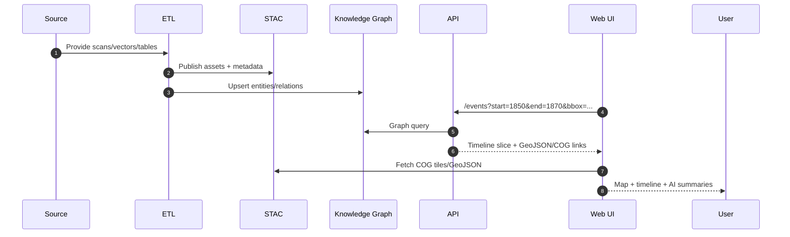

<div align="center">

# 🏛 Kansas Frontier Matrix — **System Architecture**

`src/ARCHITECTURE.md`

**⛰ Time · 🌍 Terrain · 📜 History · 🔗 Knowledge Graphs**
*A mission-grade, open-source, reproducible spatiotemporal knowledge hub for Kansas*

[](../.github/workflows/site.yml)
[](../.github/workflows/stac-validate.yml)
[](../.github/workflows/codeql.yml)
[](../.github/workflows/trivy.yml)
[](../docs/)
[](../LICENSE)

</div>

---

## 📚 Table of Contents

1. [🔭 Overview](#-overview)
2. [🏗 System Layers](#-system-layers)

   * [1) ETL / Data Ingestion](#1-data-ingestion-etl)
   * [2) AI/ML Enrichment](#2-aiml-enrichment)
   * [3) Knowledge Graph](#3-knowledge-graph)
   * [4) API Layer](#4-api-layer)
   * [5) Frontend Application](#5-frontend-web-app)
3. [🗂 Data Standards & Semantic Interoperability](#-data-standards--semantic-interoperability)
4. [🔬 Reproducibility & Observability](#-reproducibility--observability)
5. [🚀 Extending the System](#-extending-the-system)
6. [📁 Repository & Data Layout](#-repository--data-layout)
7. [📖 References & Further Reading](#-references--further-reading)

---

## 🔭 Overview

Kansas Frontier Matrix (KFM) is a **multi-disciplinary, open-source spatiotemporal knowledge hub** that integrates **geography, climate, archaeology, treaties, disasters, and oral histories** into a unified **map + timeline + semantic knowledge graph**.

**At a glance**:

* ⚙️ **ETL pipelines** (Python + Makefile) for reproducible ingestion.
* 🤖 **AI/ML enrichment** for entity extraction, linking, and summarization.
* 🕸 **Semantic knowledge graph** (Neo4j, CIDOC CRM, OWL-Time).
* 🔌 **APIs** (FastAPI/GraphQL) powering web + Google Earth.
* 🗺 **React + MapLibreGL frontend** with interactive storytelling.

---

## 🧭 High-Level Architecture (Mermaid)

```mermaid
flowchart TD
  %% LAYER TITLES
  A["**Sources**<br/>scans · rasters · vectors · documents"]:::layer --> B["**ETL Pipeline**<br/>Makefile · Python · checksums"]:::compute
  B --> C["**Processed Layers**<br/>COGs · GeoJSON · Parquet"]:::data
  B --> I["**AI/ML Enrichment**<br/>NER · geocoding · summarization · linking"]:::compute

  C --> D["**STAC Catalog**<br/>collections · items · assets"]:::data
  D --> H["**Knowledge Graph**<br/>Neo4j · CIDOC CRM · OWL-Time"]:::graph
  I --> H

  D --> J["**API Layer**<br/>FastAPI · GraphQL"]:::api
  H --> J

  J --> F["**Frontend (React + MapLibreGL)**<br/>timeline · search · filters"]:::ui
  D --> F

  E["**Config Build**<br/>app.config.json · layers.json"]:::cfg --> F
  E --> G["**Google Earth Exports**<br/>KML · KMZ"]:::ui

  classDef layer fill:#222,color:#fff,stroke:#555,stroke-width:1px;
  classDef compute fill:#0b7285,color:#fff,stroke:#073642,stroke-width:1px;
  classDef data fill:#2b8a3e,color:#fff,stroke:#0b3d16,stroke-width:1px;
  classDef api fill:#6a00f4,color:#fff,stroke:#2b0066,stroke-width:1px;
  classDef ui fill:#99582a,color:#fff,stroke:#4f2b13,stroke-width:1px;
  classDef graph fill:#3a0ca3,color:#fff,stroke:#12043b,stroke-width:1px;
  classDef cfg fill:#495057,color:#fff,stroke:#212529,stroke-width:1px;
```

<!-- END OF MERMAID -->

> 💡 **Why this design?** It separates ingestion, enrichment, knowledge, and presentation so each layer can scale independently and be tested, documented, and reproduced.

### Mini Sequence (data → map)



<!-- END OF MERMAID -->

---

## 🏗 System Layers

### 1) Data Ingestion (ETL)

* **Sources:** Historic maps, DEMs, treaties, deeds, oral histories, FEMA & NOAA events.
* **Pipeline:** Orchestrated with Makefiles; Python ETL scripts (see `src/pipelines/`).
* **Transform:** Reproject to EPSG:4326; normalize to COG/GeoJSON; compute `.sha256` sidecars.
* **Catalog:** All assets indexed in **STAC** (`data/stac/`) for spatial & temporal discoverability.

> **Pro tip:** keep heavy inputs out of Git history—use DVC/Git LFS pointers and STAC manifests to drive fetch/build.

---

### 2) AI/ML Enrichment

* **NLP:** spaCy + Transformers for NER (people, places, dates, events), OCR text ingestion, summarization.
* **Geocoding & Linking:** Gazetteer-backed resolution (e.g., GNIS), fuzzy + context matching to canonical graph nodes with confidence scores.
* **Cross-Modal Correlation:** Compares text vs. maps vs. timeseries—surfaces robust change signals (river shifts, faded settlements, drought clusters).

---

### 3) Knowledge Graph

* **DB:** Neo4j or RDF triplestore.
* **Schema:** CIDOC CRM classes & properties; OWL-Time for intervals & instants; PeriodO for historical periods.
* **Entities:** `Person`, `Place`, `Event`, `Document` (+ relations `OCCURRED_AT`, `MENTIONS`, `PARTICIPATED_IN`, etc.).
* **Provenance & Uncertainty:** Each triple/node references source(s) + confidence; UI can render with translucency/flags.

---

### 4) API Layer

* **Framework:** FastAPI + GraphQL (`src/api/`).
* **Endpoints:**

  * `GET /events?start=YYYY-MM-DD&end=YYYY-MM-DD&bbox=minx,miny,maxx,maxy`
  * `GET /entity/{id}` (AI dossier: summary + citations + linked entities)
  * Spatial queries: buffered proximity, within polygon, etc.
* **Notes:** Keep heavy traversals server-side; return concise, cacheable JSON/GeoJSON.

---

### 5) Frontend Web App

* **Stack:** React SPA + **MapLibre GL** for mapping + HTML5 **Canvas** for a smooth (60fps) timeline.
* **Features:**

  * ⏳ Time slider linked to map visibility windows.
  * 🗂 Layer switcher (treaties, DEM hillshade, trails, disasters, land cover).
  * 📝 Detail panel: AI summaries, media, and source citations.
  * 📖 Story Mode: guided narratives (Bleeding Kansas, Dust Bowl, Floods).
* **Exports:** KMZ/KML outputs with regionation for Google Earth.
* **A11y:** ARIA roles, keyboard nav, high-contrast support.

---

## 🗂 Data Standards & Semantic Interoperability

| Aspect      | Standard                    | Purpose                                                    |
| ----------- | --------------------------- | ---------------------------------------------------------- |
| Vector      | **GeoJSON**, TopoJSON       | Web-native vector layers, easy styling/tooling             |
| Raster      | **COG GeoTIFF**             | Tiled, cloud-friendly georasters                           |
| Catalog     | **STAC 1.0**                | Discovery: spatial/temporal/provenance metadata for assets |
| Semantics   | **CIDOC CRM**, **OWL-Time** | Cultural heritage graph model + chronology                 |
| Periods     | **PeriodO**                 | Controlled vocabulary for historical period names          |
| Linked Data | **JSON-LD**                 | Interoperation with external knowledge graphs              |

---

## 🔬 Reproducibility & Observability

**MCP (docs-first)**

* 🧭 `docs/architecture.md` → blueprint
* 🧪 `docs/experiment.md` → experiment logs
* 🧰 `docs/sop.md` → SOP playbooks
* 🧠 `docs/model_card.md` → model transparency

**CI/CD (GitHub Actions)**

* Linting & tests (`tests/`)
* STAC + JSON Schema validation
* CodeQL (static analysis) & Trivy (container security)
* Docker builds with pinned versions & SBOMs

**Data Integrity**

* SHA-256 sidecars
* DVC/LFS pointers for large assets
* Deterministic Make targets for reproducible builds

---

## 🚀 Extending the System

> **Add a new dataset** in 4 steps:

1. **Manifest** → create `data/sources/{id}.json` (id, title, endpoints, bbox, time, license).
2. **Build** →

   ```bash
   make fetch && make cogs && make stac
   ```
3. **Graph** → extend ETL to upsert new entities/relations if applicable (`src/pipelines/`).
4. **UI** → add a layer entry in `web/config/layers.json` (title, style, fields, timeline window).

**Checklist**

* [ ] STAC item valid
* [ ] Checksums present
* [ ] SOP/docs updated
* [ ] PR includes test(s) or sample data

---

## 📁 Repository & Data Layout

```text
KansasFrontierMatrix/
├─ src/               # Python ETL + AI/ML + API code
├─ web/               # React frontend (MapLibre + Canvas timeline)
├─ data/
│  ├─ sources/        # dataset manifests (no big binaries in git)
│  ├─ raw/            # fetched artifacts (DVC/LFS)
│  ├─ processed/      # COG, GeoJSON, CSV/Parquet outputs
│  └─ stac/           # STAC catalog (collections/items/assets)
├─ docs/              # architecture, SOPs, experiments, model cards
├─ tools/             # CLI + automation helpers
├─ tests/             # unit/integration tests for Python/JS
└─ .github/           # CI/CD workflows, PR/issue templates
```

---

## 📖 References & Further Reading

* **System Docs:** Architecture, AI Dev Guide, Web UI Design, Monorepo/Repo Design, File/Data Architecture
* **Standards:** STAC 1.0, CIDOC CRM, OWL-Time, PeriodO
* **Data Hubs:** USGS 3DEP, NOAA NCEI, FEMA OpenFEMA, Kansas GIS Hub, KHS Archives

---

> ✨ *“KFM is not just a data platform—it’s a living atlas of Kansas, built for reproducibility, discovery, and storytelling.”*
>
> Questions or ideas? Open a discussion/PR and link your `SOP` or `experiment` changes.
