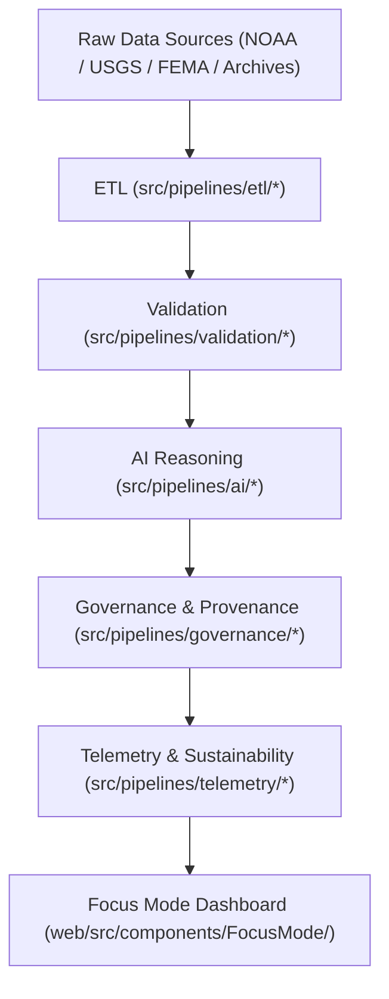

<div align="center">

# 🏗️ **Kansas Frontier Matrix — Source Architecture**
`src/ARCHITECTURE.md`

**Purpose:**  
Define the **modular, FAIR+CARE-aligned architecture** for ETL pipelines, AI reasoning, validation, governance, and telemetry within KFM.  
This blueprint ensures reproducible science, explainable AI, and blockchain-backed provenance under MCP-DL v6.3 and ISO 19115.

[](../docs/standards/faircare-validation.md)
[](../LICENSE)
[]()
[]()

</div>

---

## 🧭 Overview

KFM’s Source Architecture orchestrates **ETL → Validation → AI → Governance → Telemetry** in a single, auditable loop.  
Every layer is checksum-locked, ethics-validated, and registered to the Governance Ledger for public traceability.

### Design Objectives
- Autonomous, scalable ETL and AI pipelines.  
- FAIR+CARE governance embedded in every stage.  
- Immutable provenance and checksum integrity.  
- Explainable AI in Focus Mode with bias/drift safeguards.  
- Alignment with global open-science and ISO standards.  

---

## 🧩 Modular Architecture



**Layers**
- **ETL:** Harmonize raw feeds into FAIR+CARE-ready structures.  
- **Validation:** Schema + checksum + ethics audits for QA.  
- **AI:** Explainability + bias detection powering Focus insights.  
- **Governance:** Blockchain-linked provenance, certification artifacts.  
- **Telemetry:** Energy, carbon, and FAIR metrics with dashboard sync.  
- **Focus Mode:** Interactive visualization of lineage and insights.

---

## 🗂️ Source Directory Map

```plaintext
src/
├── ARCHITECTURE.md
├── README.md
├── pipelines/
│   ├── etl/           # Data ingestion & harmonization
│   ├── ai/            # Focus reasoning & explainability
│   ├── validation/    # Schema + FAIR+CARE audits
│   ├── governance/    # Ledger & manifest sync
│   ├── telemetry/     # Sustainability & performance metrics
│   └── utils/         # Shared STAC/DCAT/JSON utilities
└── metadata.json      # Provenance + checksum registry
```

---

## ⚖️ Governance & Provenance Integration

| Layer | Function | Governance Hooks | Ledger/Artifact |
|------|----------|------------------|-----------------|
| ETL | Ingest & normalize | Input lineage + schema hashes | `data/reports/audit/data_provenance_ledger.json` |
| Validation | QA + FAIR+CARE | Ethics + accessibility checks | `data/reports/fair/data_care_assessment.json` |
| AI | Reasoning + XAI | Drift + explainability scores | `data/reports/audit/ai_src_ledger.json` |
| Governance | Ledger sync | Immutable blockchain entries | `releases/*/manifest.zip` |
| Telemetry | Sustainability | Energy + carbon + FAIR metrics | `releases/*/focus-telemetry.json` |

---

## 🧠 FAIR+CARE Alignment

| Principle | Implementation | Oversight |
|-----------|----------------|-----------|
| **Findable** | Code + lineage indexed via `metadata.json` and checksums. | @kfm-data |
| **Accessible** | MIT-licensed; documented and open. | @kfm-accessibility |
| **Interoperable** | ISO 19115 + DCAT 3.0 + STAC compatibility. | @kfm-architecture |
| **Reusable** | Modular pipelines and utils. | @kfm-design |
| **Collective Benefit** | Transparent, ethical automation. | @faircare-council |
| **Authority to Control** | Council validates architectural changes. | @kfm-governance |
| **Responsibility** | Maintainers uphold ethics + traceability. | @kfm-sustainability |
| **Ethics** | XAI + bias safeguards across AI stack. | @kfm-ethics |

Audit logs: `../reports/audit/ai_src_ledger.json` · `../reports/fair/src_summary.json`

---

## ⚙️ Core Dependencies

| Area | Frameworks | Purpose |
|------|------------|---------|
| ETL | Pandas, GDAL, PyArrow | Ingest + transform geospatial and tabular data |
| AI | PyTorch, SHAP, LIME | Explainable modeling and reasoning |
| Validation | JSONSchema, custom FAIR+CARE validator | Structural + ethics checks |
| Governance | Neo4j, IPFS, Ethereum | Provenance + checksum registry |
| Telemetry | OpenTelemetry, Grafana | Performance + sustainability metrics |

---

## 🌱 Sustainability Metrics (Q4 2025)

| Metric | Value | Standard | Verified By |
|--------|-------|----------|-------------|
| Avg Runtime / Pipeline | 3.1 min | ISO 50001 | @kfm-ops |
| Energy / Run | 0.92 Wh | ISO 14064 | @kfm-sustainability |
| Carbon Output | 0.10 gCO₂e | ISO 14064 | @kfm-security |
| Renewable Energy | 100% (RE100) | — | @kfm-infrastructure |
| FAIR+CARE Compliance | 100% | MCP-DL v6.3 | @faircare-council |

Telemetry: `../releases/v9.7.0/focus-telemetry.json`

---

## 🧾 Internal Use Citation

```text
Kansas Frontier Matrix (2025). Source Architecture (v9.7.0).
Modular FAIR+CARE-aligned source blueprint for ETL, AI, validation, governance, and telemetry pipelines with immutable provenance.
```

---

## 🕰️ Version History

| Version | Date | Notes |
|--------|------|------|
| v9.7.0 | 2025-11-05 | Upgraded ledger hooks, sustainability benchmarks, and telemetry schema; clarified layer roles. |
| v9.6.0 | 2025-11-04 | Added full AI explainability + telemetry integration. |
| v9.5.0 | 2025-11-02 | Expanded FAIR+CARE schema references and governance links. |

---

<div align="center">

**© 2025 Kansas Frontier Matrix — MIT License**  
*Open Architecture × FAIR+CARE Governance × Sustainable Reproducibility*  
[Back to Source README](./README.md) • [Docs Portal](../docs/) • [Governance Ledger](../docs/standards/governance/DATA-GOVERNANCE.md)

</div>
