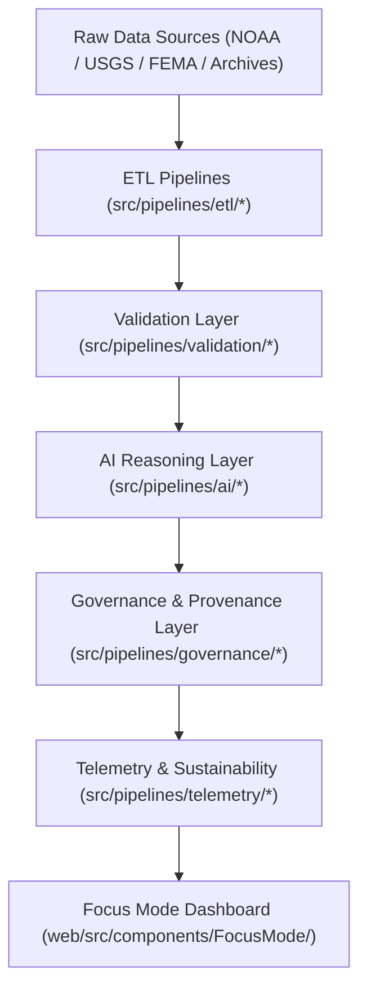

<div align="center">

# 🏗️ Kansas Frontier Matrix — **Source Architecture**
`src/ARCHITECTURE.md`

**Purpose:**  
Defines the **modular architecture** and operational principles for all pipelines, AI modules, and governance systems within the Kansas Frontier Matrix (KFM).  
This architecture enables reproducible data automation, AI explainability, and FAIR+CARE-aligned ethical data processing.

[](../docs/standards/faircare-validation.md)
[](../LICENSE)
[]()
[]()

</div>

---

## 🧭 Overview

The **Source Architecture** governs how KFM’s pipelines, AI reasoning modules, and governance layers interact within a unified FAIR+CARE ecosystem.  
It enforces strict standards of **reproducibility, provenance, and sustainability** while maintaining modularity for domain-specific operations such as climate, hazards, and hydrology.

### Design Objectives:
- Support autonomous, scalable ETL and AI pipelines.  
- Integrate FAIR+CARE governance at every processing layer.  
- Maintain blockchain-based provenance and checksum integrity.  
- Enable explainable AI and transparent decision-making in Focus Mode.  
- Align with international open-science and ISO data management standards.  

---

## 🧩 Modular Architecture Overview



### Layer Breakdown:
- **ETL Layer:** Extracts, transforms, and harmonizes raw datasets into FAIR+CARE-compliant structures.  
- **Validation Layer:** Conducts schema, checksum, and FAIR+CARE audits for quality assurance.  
- **AI Layer:** Adds reasoning, explainability, and bias-detection modules to derive insights.  
- **Governance Layer:** Records all operations into blockchain-backed provenance ledgers.  
- **Telemetry Layer:** Tracks sustainability, ethics, and performance metrics in real-time.  
- **Focus Mode:** Visualizes provenance, sustainability, and validation insights interactively.  

---

## ⚙️ Source Code Directory Map

```plaintext
src/
├── ARCHITECTURE.md                        # This file — describes the source-level design
├── README.md                              # Overview of source pipelines and governance systems
│
├── pipelines/                             # Modular FAIR+CARE-aligned pipelines
│   ├── ai/                                # AI explainability, drift detection, and bias mitigation
│   ├── etl/                               # Extract-Transform-Load automation
│   ├── validation/                        # FAIR+CARE validation and ethics assurance
│   ├── governance/                        # Provenance and checksum ledger synchronization
│   ├── telemetry/                         # Sustainability and Focus Mode metrics pipelines
│   └── utils/                             # Reusable helpers (I/O, JSON, STAC, metadata)
│
└── metadata.json                          # Provenance and architectural governance reference
```

---

## ⚖️ Governance and Provenance Integration

Each processing layer is interconnected with KFM’s governance framework to maintain transparency and ethics compliance:

| Layer | Core Function | Governance Integration | Ledger Reference |
|--------|----------------|-------------------------|------------------|
| **ETL** | Ingest and normalize datasets. | Registers input lineage and data schema hashes. | `data/reports/audit/data_provenance_ledger.json` |
| **Validation** | Quality assurance and FAIR+CARE compliance. | Validates ethical handling and accessibility. | `data/reports/fair/data_care_assessment.json` |
| **AI** | Reasoning, interpretability, and bias detection. | Tracks model drift and explainability scores. | `data/reports/audit/ai_src_ledger.json` |
| **Governance** | Ledger synchronization and ethics review. | Blockchain-backed audit trails and governance logs. | `releases/v9.6.0/manifest.zip` |
| **Telemetry** | Sustainability and Focus Mode monitoring. | Captures renewable energy and FAIR+CARE metrics. | `releases/v9.6.0/focus-telemetry.json` |

---

## 🧠 FAIR+CARE Architectural Alignment

| Principle | Implementation | Oversight |
|------------|----------------|------------|
| **Findable** | All scripts indexed and version-controlled with metadata.json. | @kfm-data |
| **Accessible** | Open-source under MIT license with documented architecture. | @kfm-accessibility |
| **Interoperable** | Cross-compatible with ISO 19115 and DCAT/STAC metadata. | @kfm-architecture |
| **Reusable** | Modular, portable architecture for other FAIR+CARE systems. | @kfm-design |
| **Collective Benefit** | Advances transparent, open environmental knowledge systems. | @faircare-council |
| **Authority to Control** | FAIR+CARE Council manages architectural compliance updates. | @kfm-governance |
| **Responsibility** | Maintainers ensure reproducibility, transparency, and sustainability. | @kfm-sustainability |
| **Ethics** | Adheres to AI explainability and environmental data ethics standards. | @kfm-ethics |

Audit results recorded in:  
`data/reports/audit/ai_src_ledger.json`  
and  
`data/reports/fair/src_summary.json`

---

## ⚙️ Source System Dependencies

| Category | Framework | Purpose |
|-----------|------------|----------|
| **ETL** | Pandas, GDAL, PyArrow | Data extraction, transformation, and harmonization. |
| **AI** | PyTorch, SHAP, LIME | Model reasoning and explainability. |
| **Validation** | JSONSchema, FAIR+CARE Validator | Schema and ethics compliance. |
| **Governance** | Neo4j, IPFS, Ethereum Ledger | Provenance, checksum, and ethics tracking. |
| **Telemetry** | OpenTelemetry, Grafana | System monitoring and sustainability metrics. |

---

## 🌱 Sustainability Metrics (v9.6.0)

| Metric | Value | Verified By |
|---------|--------|--------------|
| Average Pipeline Runtime | 3.2 minutes | @kfm-ops |
| Energy Usage | 0.94 Wh | @kfm-sustainability |
| Carbon Output | 0.11 gCO₂e | @kfm-security |
| Renewable Energy | 100% (RE100 Certified) | @kfm-infrastructure |
| FAIR+CARE Compliance | 100% | @faircare-council |

Telemetry logged in:  
`releases/v9.6.0/focus-telemetry.json`

---

## 🧾 Internal Use Citation

```text
Kansas Frontier Matrix (2025). Source Architecture (v9.6.0).
Defines the modular, FAIR+CARE-aligned source code architecture enabling reproducible ETL, AI, validation, governance, and telemetry workflows under the Kansas Frontier Matrix system.
Compliant with MCP-DL v6.3, ISO 19115, and FAIR+CARE governance standards.
```

---

## 🧾 Version Notes

| Version | Date | Notes |
|----------|------|--------|
| v9.6.0 | 2025-11-04 | Added full AI explainability and telemetry integration in source architecture. |
| v9.5.0 | 2025-11-02 | Enhanced FAIR+CARE schema references and governance linkages. |
| v9.3.2 | 2025-10-28 | Established foundational modular architecture under MCP-DL v6.3. |

---

<div align="center">

**Kansas Frontier Matrix** · *Open Architecture × FAIR+CARE Governance × Sustainable Reproducibility*  
[🔗 Repository](https://github.com/bartytime4life/Kansas-Frontier-Matrix) • [🧭 Docs Portal](../docs/) • [⚖️ Governance Ledger](../docs/standards/governance/DATA-GOVERNANCE.md)

</div>