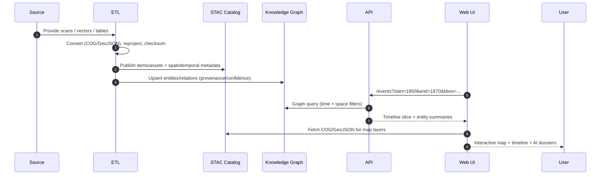

<div align="center">

# 🏛 Kansas Frontier Matrix — **System Architecture**  
`src/ARCHITECTURE.md`

**⛰ Time · 🌍 Terrain · 📜 History · 🔗 Knowledge Graphs**  
_A mission-grade, open-source, reproducible spatiotemporal knowledge hub for Kansas_

[](https://github.com/bartytime4life/Kansas-Frontier-Matrix/actions/workflows/site.yml)
[](https://github.com/bartytime4life/Kansas-Frontier-Matrix/actions/workflows/stac-validate.yml)
[](https://github.com/bartytime4life/Kansas-Frontier-Matrix/actions/workflows/codeql.yml)
[](https://github.com/bartytime4life/Kansas-Frontier-Matrix/actions/workflows/trivy.yml)
[](../docs/)
[](../LICENSE)

</div>

---

```yaml
---
title: "KFM • System Architecture"
version: "v1.6.0"
last_updated: "2025-10-14"
owners: ["@kfm-architecture", "@kfm-engineering"]
tags: ["architecture","etl","stac","nlp","knowledge-graph","api","web","mcp"]
license: "MIT | CC-BY 4.0"
semantic_alignment:
  - STAC 1.0.0
  - CIDOC CRM
  - OWL-Time
  - PeriodO
  - FAIR Principles
---
````

## 📚 Table of Contents

1. [🔭 Overview](#-overview)
2. [🏗 System Layers](#-system-layers)
3. [🧭 High-Level Architecture](#-highlevel-architecture)
4. [📦 Pipeline Sequence (Swimlane)](#-pipeline-sequence-swimlane)
5. [🎨 Layer Timeline Legend](#-layer-timeline-legend)
6. [🗂 Data Standards & Semantics](#-data-standards--semantics)
7. [🔬 Reproducibility & Observability](#-reproducibility--observability)
8. [🚀 Extending the System](#-extending-the-system)
9. [📁 Repository & Data Layout](#-repository--data-layout)
10. [📖 References](#-references)

---

## 🔭 Overview

**Kansas Frontier Matrix (KFM)** is a **spatiotemporal knowledge platform** that unites **geography, climate, archaeology, treaties, disasters, and oral histories** into a single **map + timeline + knowledge graph**.
Everything is built for **reproducibility** and **provenance** under **MCP-DL v6.2**.

---

## 🏗 System Layers

* **ETL / Ingestion** — normalize inputs (COG/GeoJSON/Parquet), compute checksums, emit **STAC Items**
* **AI/ML Enrichment** — NER, geoparsing, entity linking, summarization, confidence scoring
* **Knowledge Graph** — **Neo4j** schema mapped to **CIDOC CRM** + **OWL-Time** with PeriodO period tags
* **API Layer** — **FastAPI/GraphQL**: time/space search, dossiers, exports (KML/KMZ)
* **Frontend** — React + MapLibre: timeline, layers, legends, **AI Assistant**

---

## 🧭 High-Level Architecture

```mermaid
flowchart TD
    srcA["Sources<br/>Scans · Rasters · Vectors · Documents"] --> etlA["ETL Pipeline<br/>Makefile · Python · Checksums"]
    etlA --> procA["Processed Layers<br/>COGs · GeoJSON · Parquet"]
    etlA --> aiA["AI/ML Enrichment<br/>NER · Geocoding · Summarization · Linking"]

    procA --> stacA["STAC Catalog<br/>Collections · Items · Assets"]
    stacA --> kgA["Knowledge Graph<br/>Neo4j · CIDOC CRM · OWL-Time"]
    aiA --> kgA

    stacA --> apiA["API Layer<br/>FastAPI · GraphQL"]
    kgA --> apiA

    apiA --> webA["Frontend<br/>React + MapLibreGL<br/>Timeline · Search · Filters · AI"]
    stacA --> webA

    cfgA["Config Build<br/>app.config.json · layers.json"] --> webA
    cfgA --> exportA["Google Earth Exports<br/>KML · KMZ"]
```



> **Note:** Mermaid identifiers avoid reserved words; keep concise labels for GitHub rendering.

---

## 📦 Pipeline Sequence (Swimlane)



---

## 🎨 Layer Timeline Legend

| Category               | Examples                      | Time Range   | Color Token | Notes                           |
| :--------------------- | :---------------------------- | :----------- | :---------- | :------------------------------ |
| 🏔 Terrain & DEMs      | LiDAR 1m DEM, Hillshade       | 2018–2020    | `#6C757D`   | Basemap + hillshade             |
| 🗺 Historic Topos      | USGS 1894 Larned, 1930s Topos | 1890–1950s   | `#8D5524`   | Scanned topos (COGs)            |
| 🧾 Treaties & Cessions | 1854 Treaty, Royce Polygons   | 1820–1870s   | `#0077B6`   | Polygons linked to treaty docs  |
| 🌊 Hydrology           | 1951 Flood, Streamflow        | 1850–Present | `#0096C7`   | Floodplains, reservoirs         |
| 🌾 Land Use & Soils    | 1937 Soil, NLCD               | 1850–Present | `#52B788`   | Cropland/prairie change         |
| 🚂 Infrastructure      | Railroads, Trails             | 1850–1950s   | `#E63946`   | Trails/rails fade on disuse     |
| 🌪 Hazards             | Tornado Tracks, Disasters     | 1950–Present | `#F77F00`   | Tornado lines/points, drought   |
| 🏛 Cultural/Oral       | Oral Histories, Sites         | Any          | `#9D4EDD`   | Linked to documents & summaries |

**Canonical `layers.json` example**:

```json
{
  "id": "treaty_1854",
  "label": "Treaty of 1854",
  "type": "vector-geojson",
  "source": { "url": "/data/processed/treaty_1854.geojson" },
  "time": { "start": "1854-01-01", "end": "1854-12-31" },
  "style": { "fillColor": "#0077B6", "fillOpacity": 0.35, "strokeColor": "#004C7F", "strokeWidth": 1 },
  "legend": { "category": "Treaties & Cessions" },
  "visible": false
}
```

---

## 🗂 Data Standards & Semantics

* **Formats:** GeoJSON, COG GeoTIFF, CSVW, Parquet
* **Catalog:** **STAC 1.0.0** (Collections/Items/Assets) with JSON Schema CI checks
* **Ontologies:** **CIDOC CRM** (heritage/semantics), **OWL-Time** (temporality), **PeriodO** (period tags)
* **Linked Data:** Optional JSON-LD export for interop with external graphs
* **UI Config:** `web/config/layers.json` and `themes.json` — validated in CI

---

## 🔬 Reproducibility & Observability

* **MCP Docs-First:** `docs/architecture.md`, `docs/sop.md`, `docs/experiment.md`, `docs/model_card.md`
* **CI/CD:** Lint/tests, **STAC validation**, **CodeQL**, **Trivy**, build artifacts, preview deploys
* **Containers:** Docker Compose stack (ETL, API, DB, UI) with pinned versions and digest locks
* **Integrity:** `.sha256` sidecars for all artifacts; optional DVC/LFS for large files
* **Telemetry (opt-in):** API request latency, ETL metrics, graph upsert counts; logs stored per run

---

## 🚀 Extending the System

1. **Create manifest** → `data/sources/{id}.json`
2. **Run ETL**

   ```bash
   make fetch convert stac
   ```
3. **Graph upsert** → `src/graph/schema.py` & pipeline inserts
4. **Web layer** → add in `web/config/layers.json` (time + style + legend)
5. **Docs/Tests** → update `docs/sop.md`; add tests in `tests/pipelines/`

> Each step emits logs + checksums and is validated in CI.

---

## 📁 Repository & Data Layout

```text
KansasFrontierMatrix/
├─ src/               # Python ETL + AI/ML + API code
├─ web/               # React frontend (MapLibre + Canvas)
├─ data/
│  ├─ sources/        # dataset manifests
│  ├─ raw/            # fetched artifacts (DVC/LFS optional)
│  ├─ processed/      # COG, GeoJSON, CSV/Parquet outputs
│  └─ stac/           # STAC catalog (collections/items/assets)
├─ docs/              # architecture, SOPs, experiments, model cards
├─ tools/             # CLI + automation helpers
├─ tests/             # unit/integration (Python/JS), fixtures, e2e
└─ .github/           # CI/CD workflows, PR/issue templates
```

---

## 📖 References

* **Standards:** STAC 1.0.0 · CIDOC CRM · OWL-Time · PeriodO · FAIR Principles
* **System Docs:** Architecture · AI/ML Developer Guide · Web UI Design · File/Data Architecture · Monorepo Design
* **Primary Data Hubs:** USGS 3DEP · NOAA NCEI · FEMA OpenFEMA · Kansas GIS Hub · Kansas Historical Society Archives

---

<div align="center">

✨ *KFM is a living atlas — built to be reproducible, explainable, and discoverable.* ✨

</div>
```
