<div align="center">

# 🏗️ **Kansas Frontier Matrix — Source Architecture**
`src/ARCHITECTURE.md`

**Purpose:**  
Define the **FAIR+CARE-certified modular architecture** connecting KFM’s ETL, AI, validation, governance, and telemetry pipelines.  
Ensures **reproducible science, explainable AI, and blockchain-backed provenance** under MCP-DL v6.3, ISO 19115, and ISO 50001 sustainability standards.

[](../docs/standards/)
[](../docs/standards/faircare-validation.md)
[](../LICENSE)
[]()
[]()

</div>

---

## 🧭 Overview

The Source Architecture orchestrates **ETL → Validation → AI → Governance → Telemetry** as a continuous, auditable loop.  
Every layer is checksum-locked, ethics-validated, and registered in the immutable **Governance Ledger** for public traceability.

### Design Objectives
- Autonomous and scalable ETL + AI pipelines.  
- FAIR+CARE ethics embedded in every operation.  
- Immutable provenance and checksum integrity.  
- Explainable AI reasoning with bias/drift safeguards.  
- Full compliance with ISO 19115 / 19157 / 14064 / 50001.  

---

## 🧩 Modular Architecture

```mermaid
graph TD
A["Raw Data Sources (NOAA · USGS · FEMA · Archives · Sensors)"] --> B["ETL Pipelines (src/pipelines/etl/*)"]
B --> C["Validation Engines (src/pipelines/validation/*)"]
C --> D["AI Reasoning & XAI Models (src/pipelines/ai/*)"]
D --> E["Governance & Provenance (src/pipelines/governance/*)"]
E --> F["Telemetry & Sustainability (src/pipelines/telemetry/*)"]
F --> G["Focus Mode Dashboard (web/src/components/FocusMode/)"]
```



**Pipeline Layers**
- **ETL:** Harmonizes raw and streaming feeds into standardized, FAIR-ready structures.  
- **Validation:** Performs schema, checksum, and ethical compliance audits.  
- **AI:** Focus Transformer v2 reasoning + bias detection powering Focus Mode.  
- **Governance:** Blockchain-linked provenance, STAC/DCAT catalog sync, immutable manifests.  
- **Telemetry:** Energy & carbon monitoring, FAIR metrics, and CI validation logs.  
- **Focus Mode:** Real-time lineage visualization and AI explainability panel.

---

## 🗂️ Source Directory Layout

```plaintext
src/
├── ARCHITECTURE.md
├── README.md
├── pipelines/
│   ├── etl/            # Data ingestion, harmonization, predictive & streaming ETL
│   ├── ai/             # Focus reasoning, transformer models, explainability
│   ├── validation/     # FAIR+CARE schema and checksum audits
│   ├── governance/     # Ledger, provenance, and manifest synchronization
│   ├── telemetry/      # Energy, performance, and sustainability metrics
│   └── utils/          # Shared STAC/DCAT/JSON utilities
├── graph/              # Neo4j schema, Cypher queries, ontology mappings
└── metadata.json       # Provenance + checksum registry (auto-generated)
```

---

## ⚖️ Governance & Provenance Integration

| Layer | Function | Governance Hooks | Ledger / Artifact |
|-------|-----------|------------------|-------------------|
| **ETL** | Ingest & normalize | Input lineage + schema hash audit | `data/reports/audit/data_provenance_ledger.json` |
| **Validation** | FAIR + CARE QA | Ethics & accessibility checks | `data/reports/fair/data_care_assessment.json` |
| **AI** | Reasoning + Explainability | Drift & transparency scoring | `data/reports/audit/ai_src_ledger.json` |
| **Governance** | Ledger + Manifest Sync | Blockchain & STAC/DCAT bridge | `releases/*/manifest.zip` |
| **Telemetry** | Sustainability Metrics | Energy / carbon / runtime logging | `releases/*/focus-telemetry.json` |

---

## 🧠 FAIR + CARE Alignment

| Principle | Implementation | Oversight |
|------------|----------------|-----------|
| **Findable** | Entities indexed via `metadata.json`, STAC & DCAT catalogs. | @kfm-data |
| **Accessible** | MIT-licensed code; open, reproducible data. | @kfm-accessibility |
| **Interoperable** | ISO 19115 + DCAT 3.0 + STAC 1.0 alignment. | @kfm-architecture |
| **Reusable** | Modular code & schema; versioned data contracts. | @kfm-design |
| **Collective Benefit** | Transparent automation serving communities. | @faircare-council |
| **Authority to Control** | FAIR+CARE Council approval of changes. | @kfm-governance |
| **Responsibility** | Maintainers uphold ethics & traceability. | @kfm-sustainability |
| **Ethics** | Bias + drift safeguards across AI pipelines. | @kfm-ethics |

**Audits:** `../reports/audit/ai_src_ledger.json` · `../reports/fair/src_summary.json`

---

## ⚙️ Core Dependencies

| Domain | Frameworks | Purpose |
|---------|-------------|---------|
| **ETL** | Pandas · GDAL · PyArrow · GeoPandas | Multi-source ingestion & geospatial transformation |
| **AI/XAI** | PyTorch · Transformers · SHAP · LIME | Explainable, bias-audited reasoning models |
| **Validation** | JSONSchema · Pydantic · custom FAIR+CARE validator | Structural & ethical conformance |
| **Governance** | Neo4j · IPFS · Ethereum · STAC/DCAT bridge | Provenance & checksum ledgering |
| **Telemetry** | OpenTelemetry · Grafana · Prometheus | Energy/carbon monitoring & runtime analytics |

---

## 🌱 Sustainability & Performance Metrics (Q4 2025)

| Metric | Value | Standard | Verified By |
|--------|-------|-----------|-------------|
| Avg Runtime / Pipeline | 2.8 min | ISO 50001 | @kfm-ops |
| Energy / Run | 0.90 Wh | ISO 14064 | @kfm-sustainability |
| Carbon Output | 0.08 g CO₂e | ISO 14064 | @kfm-security |
| Renewable Energy Use | 100 % (RE100) | — | @kfm-infrastructure |
| FAIR+CARE Compliance | 100 % audited | MCP-DL v6.3 | @faircare-council |

Telemetry log → `../releases/v10.1.0/focus-telemetry.json`

---

## 🧾 Internal Citation

```text
Kansas Frontier Matrix (2025). Source Architecture (v10.1.0).
FAIR+CARE-aligned modular architecture for ETL, AI, validation, governance, and telemetry pipelines with immutable provenance.
```

---

## 🕰️ Version History

| Version | Date | Summary |
|----------|------|----------|
| **v10.1.0** | 2025-11-10 | Refactored AI/ETL streaming modules; integrated STAC↔DCAT bridge v3; updated Focus Transformer v2 governance. |
| **v10.0.0** | 2025-11-08 | Major release: model-driven reasoning, sustainability metrics, expanded FAIR+CARE schema. |
| **v9.7.0** | 2025-11-05 | Enhanced ledger hooks & telemetry schema v2. |
| **v9.6.0** | 2025-11-04 | Added AI explainability and telemetry integration. |
| **v9.5.0** | 2025-11-02 | Expanded FAIR+CARE governance references and data contracts. |

---

<div align="center">

**© 2025 Kansas Frontier Matrix — MIT License**  
*Open Architecture × FAIR+CARE Governance × Sustainable Reproducibility*  
[Back to Source README](./README.md) · [Docs Portal](../docs/) · [Governance Ledger](../docs/standards/governance/DATA-GOVERNANCE.md)

</div>
