<div align="center">

# 🏛 Kansas Frontier Matrix — **System Architecture**  
`src/ARCHITECTURE.md`

**⛰ Time · 🌍 Terrain · 📜 History · 🔗 Knowledge Graphs**  
_A mission-grade, open-source, reproducible spatiotemporal knowledge hub for Kansas_

[](../.github/workflows/site.yml)  
[](../.github/workflows/stac-validate.yml)  
[](../.github/workflows/codeql.yml)  
[](../.github/workflows/trivy.yml)  
[](../docs/)  
[](../LICENSE)

</div>

---

```yaml
title: "KFM • System Architecture"
version: "v1.8.0"
last_updated: "2025-11-02"
created: "2024-12-12"
owners: ["@kfm-architecture", "@kfm-engineering"]
status: "Stable"
maturity: "Production"
tags: ["architecture","etl","stac","nlp","knowledge-graph","api","web","mcp","observability","faircare"]
license: "MIT | CC-BY 4.0"
semantic_alignment:
  - STAC 1.0.0
  - CIDOC CRM
  - OWL-Time
  - DCAT 3.0
  - PeriodO
  - FAIR Principles
  - MCP-DL v6.4.3 (Reproducibility · Provenance · Accessibility)
```

## 📚 Table of Contents

1. [🔭 Overview](#-overview)  
2. [🏗 System Layers](#-system-layers)  
3. [🧭 High-Level Architecture](#-high-level-architecture)  
4. [📦 Pipeline Sequence (Swimlane)](#-pipeline-sequence-swimlane)  
5. [🎨 Layer Timeline Legend](#-layer-timeline-legend)  
6. [🗂 Data Standards & Semantics](#-data-standards--semantics)  
7. [🔬 Reproducibility & Observability](#-reproducibility--observability)  
8. [🚀 Extending the System](#-extending-the-system)  
9. [📁 Repository & Data Layout](#-repository--data-layout)  
10. [🧮 Versioning & Metadata](#-versioning--metadata)  
11. [🧾 Changelog](#-changelog)  
12. [📖 References](#-references)

---

## 🔭 Overview

**Kansas Frontier Matrix (KFM)** is a **spatiotemporal knowledge platform** that unites **geography, climate, archaeology, treaties, disasters, and oral histories** into a single **map + timeline + knowledge graph**.  
Built for **reproducibility**, **provenance**, and **auditability** under **MCP-DL v6.4.3**, KFM couples **open standards** (STAC, CIDOC, OWL-Time, DCAT, PeriodO) with **deterministic ETL/AI** to produce a transparent, queryable “living atlas” of Kansas.

---

## 🏗 System Layers

- **ETL / Ingestion** — normalize inputs (COG / GeoJSON / Parquet), compute checksums, emit **STAC Items**  
- **AI/ML Enrichment** — NER, geoparsing, entity linking, summarization, confidence scoring  
- **Knowledge Graph** — **Neo4j** schema mapped to **CIDOC CRM** + **OWL-Time** with PeriodO period tags  
- **API Layer** — **FastAPI / GraphQL**: time/space search, dossiers, exports (KML/KMZ/JSON-LD)  
- **Frontend** — React + MapLibre: timeline, layers, legends, **Focus Mode**, a11y-first UI

---

## 🧭 High-Level Architecture

```mermaid
flowchart TD
    srcA["Sources<br/>Scans · Rasters · Vectors · Documents"] --> etlA["ETL Pipeline<br/>Makefile · Python · Checksums"]
    etlA --> procA["Processed Layers<br/>COGs · GeoJSON · Parquet"]
    etlA --> aiA["AI/ML Enrichment<br/>NER · Geocoding · Summarization · Linking"]

    procA --> stacA["STAC Catalog<br/>Collections · Items · Assets"]
    stacA --> kgA["Knowledge Graph<br/>Neo4j · CIDOC CRM · OWL-Time"]
    aiA --> kgA

    stacA --> apiA["API Layer<br/>FastAPI · GraphQL"]
    kgA --> apiA

    apiA --> webA["Frontend<br/>React + MapLibreGL<br/>Timeline · Search · Filters · Focus Mode"]
    stacA --> webA

    cfgA["Config Build<br/>app.config.json · layers.json"] --> webA
    cfgA --> exportA["Exports<br/>KML · KMZ · JSON-LD"]
```



> **Design Tenets:** documentation-first, deterministic dataflow, explicit schema contracts, and total provenance from source to screen.

---

## 📦 Pipeline Sequence (Swimlane)

```mermaid
sequenceDiagram
    autonumber
    participant SRC as Source
    participant ETL as ETL
    participant STAC as STAC Catalog
    participant KG as Knowledge Graph
    participant API as API
    participant UI as Web UI

    SRC->>ETL: Provide scans / vectors / tables
    ETL->>ETL: Convert (COG/GeoJSON), reproject, checksum
    ETL->>STAC: Publish items/assets + spatiotemporal metadata
    ETL->>KG: Upsert entities/relations (provenance/confidence)
    UI->>API: /events?start=1850&end=1870&bbox=...
    API->>KG: Graph query (time + space filters)
    API-->>UI: Timeline slice + entity summaries
    UI->>STAC: Fetch COG/GeoJSON for map layers
    UI-->>User: Interactive map · timeline · AI dossiers
```



---

## 🎨 Layer Timeline Legend

> Standardized categories & colors for `web/config/layers.json` and STAC-derived timelines. Colors comply with WCAG AA contrast and the design tokens used across the web UI. Temporal visibility is driven by `start_datetime` / `end_datetime` in STAC Items.

| Category | Examples | Time Range | Color Token | Notes |
| :-- | :-- | :-- | :-- | :-- |
| 🏔 **Terrain & Elevation** | LiDAR 1m DEM · Hillshade · Contours | 2010–Present | `#6C757D` | Basemap context; USGS 3DEP |
| 🗺 **Historic Topographic Maps** | USGS 1894 Larned · 1930s County Sheets | 1890–1950s | `#8D5524` | Scanned topo COGs; opacity 0.6–0.8 |
| 🌾 **Land Use & Vegetation** | 1937 Soil Survey · NLCD | 1850–Present | `#52B788` | Land cover & vegetation change |
| 🌊 **Hydrology & Water** | Kansas River · 1951 Flood · Reservoirs | 1850–Present | `#0096C7` | Rivers, floodplains, drought |
| 🌪 **Hazards & Climate** | Tornado Tracks · Drought Index · Dust Bowl | 1850–Present | `#F77F00` | NOAA, USDM, events |
| 🚂 **Infrastructure** | Railroads · Trails · Roads | 1850–1950s | `#E63946` | Historical routes |
| 🏛 **Cultural & Historical** | Oral Histories · Sites · Missions · Forts | Any | `#9D4EDD` | Linked to documents & NER |
| 📜 **Treaties & Boundaries** | 1854 Treaty · Royce Polygons · Counties | 1820–1870s | `#0077B6` | GeoJSON polygons; provenance |
| 🔥 **Environmental Change** | Wildfire History · Dust Footprints | 1900–Present | `#E85D04` | Raster/vector overlays |
| 🗺️ **Reference** | Counties · PLSS · Gauges | 1850–Present | `#ADB5BD` | Non-temporal reference |

**Canonical `layers.json` example**:

```json
{
  "id": "treaty_1854",
  "label": "Treaty of 1854",
  "type": "vector-geojson",
  "source": { "url": "/data/processed/treaty_1854.geojson" },
  "time": { "start": "1854-01-01", "end": "1854-12-31" },
  "style": { "fillColor": "#0077B6", "fillOpacity": 0.35, "strokeColor": "#004C7F", "strokeWidth": 1 },
  "legend": { "category": "Treaties & Boundaries" },
  "interactive": true,
  "visible": false
}
```

---

## 🗂 Data Standards & Semantics

- **Formats:** GeoJSON, COG GeoTIFF, CSVW, Parquet  
- **Catalog:** **STAC 1.0.0** (Collections/Items/Assets) with JSON Schema CI checks  
- **Ontologies:** **CIDOC CRM** (heritage/semantics), **OWL-Time** (temporality), **PeriodO** (period tags)  
- **Catalog Interop:** **DCAT 3.0** mapping for machine indexing; JSON-LD export available  
- **UI Config:** `web/config/layers.json`, `app.config.json` — deterministically generated from STAC and validated in CI

---

## 🔬 Reproducibility & Observability

- **Docs-First:** `docs/architecture.md`, `docs/sop.md`, `docs/experiment.md`, `docs/model_card.md`  
- **CI/CD:** Lint/tests, **STAC validation**, **CodeQL**, **Trivy**, coverage gates, preview deploys  
- **Containers:** Docker Compose stack (ETL, API, DB, UI) with pinned digests  
- **Integrity:** `.sha256` sidecars + manifest lock; optional DVC/LFS for large artifacts  
- **Telemetry (opt-in):** ETL metrics, API latency, graph upsert counters; logs persisted per run

---

## 🚀 Extending the System

1. **Create manifest** → `data/sources/{id}.json`  
2. **Run ETL**
   ```bash
   make fetch convert stac
   ```
3. **Graph upsert** → `src/graph/schema/` + ingestion scripts  
4. **Web layer** → add in `web/config/layers.json` (time · style · legend)  
5. **Docs/Tests** → update SOPs; add tests in `tests/*`

> Each step emits logs + checksums and is validated in CI.

---

## 📁 Repository & Data Layout

```text
KansasFrontierMatrix/
├─ src/               # Python ETL + AI/ML + API + Graph code
├─ web/               # React frontend (MapLibre + Canvas)
├─ data/
│  ├─ sources/        # dataset manifests
│  ├─ raw/            # fetched artifacts (DVC/LFS optional)
│  ├─ processed/      # COG, GeoJSON, CSV/Parquet outputs
│  └─ stac/           # STAC catalog (collections/items/assets)
├─ docs/              # architecture, SOPs, experiments, model cards
├─ tools/             # CLI + automation helpers
├─ tests/             # unit/integration (Python/JS), fixtures, e2e
└─ .github/           # CI/CD workflows, PR/issue templates
```

---

## 🧮 Versioning & Metadata

| Field | Value |
| :-- | :-- |
| **Version** | `v1.8.0` |
| **Codename** | *Legend Alignment & Interop — II* |
| **Last Updated** | 2025-11-02 |
| **Maintainers** | @kfm-architecture · @kfm-engineering |
| **License** | MIT (code) · CC-BY 4.0 (docs) |
| **Semantic Alignment** | STAC 1.0 · CIDOC CRM · OWL-Time · DCAT 3.0 · PeriodO · FAIR |
| **Maturity** | Production |
| **Integrity** | CI: CodeQL · Trivy · STAC validate · Reproducible builds |

---

## 🧾 Changelog

| Version | Date | Author | Summary |
| :-- | :-- | :-- | :-- |
| **v1.8.0** | 2025-11-02 | @kfm-architecture | Upgraded to MCP-DL v6.4.3; added JSON-LD exports and Observability Matrix link; clarified exports section. |
| **v1.7.1** | 2025-10-17 | @kfm-architecture | Updated Layer Timeline Legend; added Administrative & Environmental Change categories; clarified interop notes. |
| **v1.7.0** | 2025-10-17 | @kfm-architecture | MCP-DL v6.3 alignment; DCAT mapping; CI gates. |
| **v1.6.0** | 2025-10-14 | @kfm-engineering | Expanded swimlane; added legend; refined ETL notes. |

---

## 📖 References

- **Standards:** STAC 1.0.0 · CIDOC CRM · OWL-Time · DCAT 3.0 · PeriodO · FAIR  
- **System Docs:** Architecture · AI/ML Developer Guide · Web UI Design · File/Data Architecture · Monorepo Design  
- **Primary Data Hubs:** USGS 3DEP · NOAA NCEI · FEMA OpenFEMA · Kansas GIS Hub · Kansas Historical Society Archives

---

<div align="center">

**KFM is a living atlas — reproducible, explainable, and discoverable by design.**

</div>
