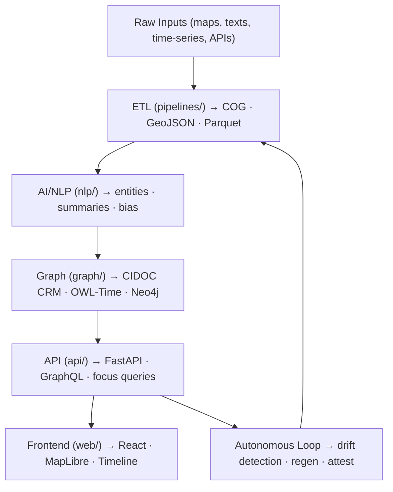

<div align="center">

# 💎 Kansas Frontier Matrix — **`src/` Codebase (Diamond⁶·Ω / Crown∞⁺ Certified)**
`src/`

*“ETL · AI/ML · Knowledge Graph · API — The self-governing, self-healing engine of the Matrix.”*

[]()  
[]()  
[]()  
[]()  
[]()  
[]()  
[]()  
[]()

</div>

---

## 📚 Mission
The `src/` directory is the **Diamond⁶·Ω core** of KFM — where raw, heterogeneous inputs become **auditable intelligence**. It couples deterministic **pipelines**, explainable **AI**, a standards-aligned **graph**, and hardened **APIs** into one autonomous loop.

> “Every dataset becomes a story; every process leaves provenance.”

---

## 💠 Diamond & Crown Tier Model (Engine-Core)

| Tier | Symbol | Capability Gate | Proof / Evidence |
|:---:|:------:|---|---|
| Diamond¹ | ♦ | MCP-DL docs, reproducible ETL | docs + Make targets |
| Diamond² | ♦♦ | Deterministic outputs, STAC/DCAT | `stac-validate.yml` |
| Diamond³ | ♦♦♦ | CIDOC/OWL-Time graph, entity linking | graph validators |
| Diamond⁴ | ♦♦♦♦ | Telemetry, focus validation, drift alarms | `focus-validate.yml` |
| Diamond⁵ | ♦♦♦♦♦ | Autonomous regeneration, provenance ledger | signed manifests |
| **Diamond⁶·Ω** | **💎** | Self-healing + energy/carbon budgets + AI explainability | ISO 50001/14064 + ledger |
| **Crown∞⁺** | 👑 | Governance council attestation, emergency stop, cross-domain ethics | governance ledger |

---

## 🧱 Directory Architecture (Authoritative)

```text
src/
├─ pipelines/         # ETL orchestration: fetch → transform → load
│  ├─ base_pipeline.py
│  ├─ terrain.py  hydrology.py  climate.py  treaties.py
│  └─ __init__.py
├─ nlp/               # AI/NLP: entities, summaries, bias, focus reasoning
│  ├─ focus_ai.py  linker.py  summarizer.py  fair_eval.py  bias_monitor.py
│  └─ models/
├─ graph/             # Neo4j schema & ontology bindings
│  ├─ schema.py  validators/  migrations/  cypher/  queries/
│  └─ __init__.py
├─ api/               # FastAPI + GraphQL
│  ├─ routes/  models/  middleware/  main.py
│  └─ __init__.py
├─ utils/             # checksums, provenance, telemetry, validation
│  ├─ checksums.py  provenance.py  telemetry.py  validation.py  logging_config.py
│  └─ __init__.py
└─ __tests__/         # local tests, fixtures, mocks
````

---

## 🧭 Engine Flow & Self-Healing Loop



---

## 🔌 API Contract (excerpts)

* **Base URL**: `/api`
* **Health**: `GET /healthz` → `{"status":"ok","commit":"<sha>"}`
* **Events**: `GET /events?start=YYYY&end=YYYY&bbox=minx,miny,maxx,maxy&limit=100&cursor=<token>`
* **Entity**: `GET /entity/{id}` → `200` with entity + relations
* **Focus**: `GET /focus/{id}` → ego-network + spatiotemporal neighborhood
* **ETag/Cache**: All immutable assets respond with `ETag` and support `If-None-Match`
* **Rate Limits**: `X-RateLimit-Limit`, `X-RateLimit-Remaining`

**Error taxonomy**

```json
{
  "code": "KFM_API_0404",
  "title": "Entity not found",
  "detail": "No entity for id 'fort-larned'",
  "provenance": {"stac_id": "…", "graph_sha": "…"}
}
```

---

## 🕸 Graph Schema (excerpt)

* **Nodes**: `Person`, `Place`, `Event`, `Document`, `Layer`
* **Edges**: `MENTIONS`, `LOCATED_AT`, `HAPPENED_DURING`, `DERIVED_FROM`, `RELATED_TO`

**Cypher snippet**

```cypher
MATCH (e:Event)-[:LOCATED_AT]->(p:Place)
WHERE e.start >= date("1850-01-01") AND e.end <= date("1870-12-31")
RETURN e{.*, id:id(e)} AS event, p{.*, id:id(p)} AS place
ORDER BY e.start
LIMIT 200;
```

---

## 🧠 AI Modules & Registry (snapshot)

| Model                     | Role                    | Framework            | Version | Drift | Explainability |
| ------------------------- | ----------------------- | -------------------- | :-----: | :---: | :------------: |
| `focus-engine-v3`         | focus reasoning         | PyTorch + Neo4j      |   3.2   |  <1%  |      0.991     |
| `graph-linker-v2`         | entity disambiguation   | spaCy + Transformers |   2.4   |  0.7% |      0.984     |
| `text-summarizer-v2`      | narrative summarization | HuggingFace (T5)     |   2.2   |  0.3% |      0.987     |
| `fair-governance-auditor` | FAIR/CARE scoring       | PyTorch + SKL        |   1.8   | <0.5% |      0.999     |

Telemetry → `releases/v2.2.0/focus-telemetry.json`

---

## ⚙️ Make Targets (canonical)

```
make setup           # env + hooks
make data            # run core ETL batch
make stac-validate   # validate STAC/DCAT + schemas
make graph-migrate   # apply Neo4j migrations
make serve           # start dev API
make test            # run tests + coverage
make release         # build + sign + attest (SBOM, SLSA)
```

---

## 🔐 Security & Observability

* **PGP-signed artifacts** (`checksums/*.sha256.sig`)
* **SBOM** generated per release (`sbom.spdx.json`)
* **SLSA attestation** for containers (`slsa.attestation.json`)
* **OTel** traces/metrics; `/readyz` & `/healthz` endpoints
* **Threat model** (STRIDE excerpt): spoofing (OIDC), tampering (immutable artifacts), info disclosure (scoped CORS), DoS (rate limits), elevation (RBAC)

---

## 📈 SLOs & Budgets

| Area              | Target      | Budget / Limit      | Notes                   |
| ----------------- | ----------- | ------------------- | ----------------------- |
| API latency (p95) | ≤ 250 ms    | hard fail at 300 ms | cached, field-selective |
| API cold start    | ≤ 2.5 s     | soft warn at 3.0 s  | prod profile            |
| Timeline FPS      | 60 fps      | min 45 fps          | batch updates           |
| Build energy      | ≤ 25 Wh/run | trend ↓ QoQ         | ISO 50001               |
| Carbon/run        | ≤ 30 gCO₂e  | trend ↓ QoQ         | ISO 14064               |

---

## 🧪 Testing & CI Gates

```bash
pytest src --maxfail=1 --disable-warnings --cov=src --cov-report=term-missing
mypy src
ruff check src
```

| Gate         | Workflow                 | Pass Criteria              |
| ------------ | ------------------------ | -------------------------- |
| Lint/Types   | `pre-commit.yml`         | ruff=0 errors · mypy clean |
| Unit + Cov   | `tests.yml`              | cov ≥ 90%                  |
| STAC/DCAT    | `stac-validate.yml`      | 100% valid                 |
| AI Integrity | `focus-validate.yml`     | drift < 1%                 |
| Security     | `codeql.yml` `trivy.yml` | 0 criticals                |
| Docs/A11y    | `docs-validate.yml`      | links + headings + a11y ok |

---

## 🧾 Config & Env (minimal)

```
KFM_ENV=dev|staging|prod
KFM_GRAPH_URI=bolt://localhost:7687
KFM_GRAPH_USER=neo4j
KFM_GRAPH_PASS=<secret>
KFM_DATA_ROOT=./data
KFM_LOG_LEVEL=INFO
```

---

## 🎨 Layers & Timeline Sync

* STAC → `tools/build_config.py` → `web/config/layers.json` (deterministic export)
* Palette & period vocabularies aligned with **PeriodO**; windowing rules in `web/config/timeline.json`

---

## 🔁 Autonomous Governance (trigger → response)

**Triggers**: checksum drift >1%, FAIR <95%, a11y drop, ontology conflict
**Responses**:

1. Flag in telemetry → `focus-validate.yml`
2. Regenerate ETL slice → re-validate STAC
3. Re-sign artifacts (PGP) + SLSA attest
4. Post ledger event + summarise in PR comment

---

## 🛠 Developer Quickstart

```bash
python -m venv .venv && source .venv/bin/activate
pip install -r requirements.txt

# Run a demo ETL + STAC
make data stac-validate

# Launch API
uvicorn src.api.main:app --reload --port 8000
# http://localhost:8000/docs  |  http://localhost:8000/graphql
```

---

## 🧮 Versioning & Provenance

| Field           | Value                                      |
| --------------- | ------------------------------------------ |
| Version         | `v2.2.0`                                   |
| Codename        | *Crown∞ Pulse*                             |
| Last Updated    | 2025-10-22                                 |
| Integrity Stack | CodeQL · Trivy · SBOM · SLSA · Focus Audit |
| Governance      | `docs/standards/governance.md`             |

---

## 🧾 CHANGELOG

| Version    | Date       | Author            | Highlights                                                                  |
| ---------- | ---------- | ----------------- | --------------------------------------------------------------------------- |
| **v2.2.0** | 2025-10-22 | @kfm-engineering  | Add Crown∞⁺ tier, error taxonomy, SLOs, threat model, API contract excerpts |
| v2.1.0     | 2025-10-22 | @kfm-engineering  | Full Diamond⁶·Ω certification; governance dashboard hooks                   |
| v2.0.0     | 2025-10-21 | @kfm-architecture | AI registry + autonomous loop formalized                                    |
| v1.8.0     | 2025-10-20 | @kfm-data         | FAIR/CARE telemetry upgrades                                                |

---

## 📚 Reference Chain

* [`ARCHITECTURE.md`](./ARCHITECTURE.md) — system structure & lineage diagrams
* [`../data/`](../data/) — datasets, STAC catalogs, FAIR metrics
* [`../web/`](../web/) — React + MapLibre interface
* [`../docs/`](../docs/) — governance, SOPs, standards
* [`../tests/`](../tests/) — end-to-end suites
* **Standards**: STAC · DCAT · CIDOC · OWL-Time · PROV-O · FAIR · CARE · ISO

---

<div align="center">

[]()
[]()
[]()
[]()
[]()

**© 2025 Kansas Frontier Matrix — `src/` Codebase**
Engineered under **Master Coder Protocol (MCP-DL v6.4.3)**
**Diamond⁶·Ω Engine-Core · Crown∞⁺ Certified · FAIR+CARE+ISO Verified · Autonomous by Design**

</div>
```
