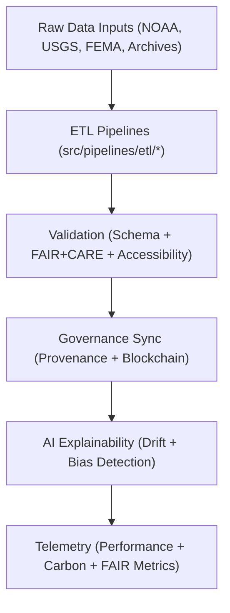

<div align="center">

# 🧠 **Kansas Frontier Matrix — Source Code & ETL Pipelines**
`src/README.md`

**Purpose:**  
FAIR+CARE-certified core source framework that orchestrates **ETL, AI, validation, telemetry, and governance automation** within the Kansas Frontier Matrix (KFM).  
Implements ethical automation, sustainability auditing, and blockchain-linked provenance for all KFM operational domains under MCP-DL v6.3 and ISO 19115.

[](../docs/standards/faircare-validation.md)
[](../LICENSE)
[](../docs/architecture/repo-focus.md)
[]()

</div>

---

## 📘 Overview

The `src/` directory functions as KFM’s **execution and automation core**, integrating sustainable ETL, explainable AI reasoning, and verifiable governance synchronization.  
Every pipeline ensures **checksum lineage, ethical compliance, and reproducible science** across domains from hydrology to heritage datasets.

---

### Core Responsibilities
- Extract, transform, and validate environmental and historical data streams.  
- Run explainable AI pipelines within the Focus Mode framework.  
- Automate governance ledger synchronization and provenance registration.  
- Monitor FAIR+CARE, energy, and carbon metrics through telemetry.  

---

## 🗂️ Directory Layout

```plaintext
src/
├── README.md
│
├── pipelines/                           # FAIR+CARE automation framework (ETL, AI, validation)
│   ├── etl/                             # Data ingestion and harmonization
│   ├── ai/                              # Focus Mode reasoning and explainability
│   ├── validation/                      # Schema + FAIR+CARE audit pipelines
│   ├── governance/                      # Provenance + blockchain synchronization
│   ├── telemetry/                       # Energy, sustainability, and performance logging
│   └── utils/                           # Shared utilities for I/O, JSON, STAC, and data lineage
│
├── ARCHITECTURE.md                      # System architecture + flow design spec
├── metadata.json                        # Provenance + checksum registry metadata
└── tests/                               # Unit + integration validation for ETL and AI modules
```

---

## ⚙️ End-to-End Source Workflow



1. **ETL:** Harmonizes raw data into schema-compliant, FAIR+CARE-ready structures.  
2. **Validation:** Verifies structure, checksums, and ethics alignment.  
3. **Governance:** Registers results in immutable blockchain-backed ledgers.  
4. **AI:** Runs explainable reasoning and bias diagnostics.  
5. **Telemetry:** Publishes energy, FAIR+CARE, and sustainability telemetry.

---

## 🧾 Example Source Registry Metadata

```json
{
  "id": "src_pipeline_registry_v10.0.0_2025Q4",
  "pipelines_registered": [
    "climate_etl.py",
    "ai_focus_reasoning.py",
    "governance_sync.py",
    "telemetry_reporter.py"
  ],
  "executions_logged": 82,
  "checksum_verified": true,
  "fairstatus": "certified",
  "ai_explainability_score": 0.996,
  "sustainability_index": 0.984,
  "governance_registered": true,
  "telemetry_ref": "releases/v10.0.0/focus-telemetry.json",
  "governance_ref": "reports/audit/ai_src_ledger.json",
  "created": "2025-11-08T13:40:00Z",
  "validator": "@kfm-src"
}
```

---

## 🧠 FAIR+CARE Governance Matrix

| Principle | Implementation | Oversight |
|------------|----------------|------------|
| **Findable** | Pipelines and lineage indexed via metadata and checksum manifests. | @kfm-data |
| **Accessible** | MIT-licensed, documented under MCP-DL v6.3 and FAIR+CARE. | @kfm-accessibility |
| **Interoperable** | Harmonized with STAC, DCAT 3.0, and ISO 19115 data models. | @kfm-architecture |
| **Reusable** | Modular code for reuse in cross-domain workflows. | @kfm-design |
| **Collective Benefit** | Enables open, ethical automation for sustainable governance. | @faircare-council |
| **Authority to Control** | FAIR+CARE Council validates core pipeline changes. | @kfm-governance |
| **Responsibility** | Maintainers ensure checksum lineage and ethical compliance. | @kfm-security |
| **Ethics** | Continuous audit for bias, accessibility, and inclusivity. | @kfm-ethics |

Audit results maintained in:  
`reports/audit/ai_src_ledger.json` · `reports/fair/src_summary.json`

---

## ⚙️ Core Dependencies

| Area | Frameworks | Purpose |
|------|------------|---------|
| ETL | Pandas, GDAL, PyArrow | Ingest + transform geospatial and tabular data |
| AI | PyTorch, SHAP, LIME | Explainable modeling and reasoning |
| Validation | JSONSchema, custom FAIR+CARE validator | Structural + ethics checks |
| Governance | Neo4j, IPFS, Ethereum | Provenance + checksum registry |
| Telemetry | OpenTelemetry, Grafana | Performance + sustainability metrics |

---

## 🌱 Sustainability Metrics (Q4 2025)

| Metric | Value | Standard | Verified By |
|--------|-------|----------|-------------|
| Avg Runtime / Pipeline | 3.1 min | ISO 50001 | @kfm-ops |
| Energy / Run | 0.92 Wh | ISO 14064 | @kfm-sustainability |
| Carbon Output | 0.10 gCO₂e | ISO 14064 | @kfm-security |
| Renewable Energy | 100% (RE100) | — | @kfm-infrastructure |
| FAIR+CARE Compliance | 100% | MCP-DL v6.3 | @faircare-council |

Telemetry: `../releases/v10.0.0/focus-telemetry.json`

---

## 🧾 Internal Use Citation

```text
Kansas Frontier Matrix (2025). Source Code & ETL Pipelines (v10.0.0).
Ethically governed automation and explainable AI pipelines ensuring sustainability, reproducibility, and transparency under MCP-DL v6.3.
```

---

## 🕰️ Version History

| Version | Date | Notes |
|--------|------|------|
| v10.0.0 | 2025-11-08 | Major update: integrated model-driven reasoning, enhanced sustainability metrics, and expanded FAIR+CARE compliance. |
| v9.7.0 | 2025-11-05 | Upgraded ledger hooks, sustainability benchmarks, and telemetry schema; clarified layer roles. |
| v9.6.0 | 2025-11-04 | Added full AI explainability + telemetry integration. |
| v9.5.0 | 2025-11-02 | Integrated Focus Mode telemetry and AI ethics reporting. |

---

<div align="center">

**Kansas Frontier Matrix** · *Ethical Automation × FAIR+CARE Governance × Sustainable Reproducibility*  
[Back to Source README](./README.md) • [Docs Portal](../docs/) • [Governance Ledger](../docs/standards/governance/DATA-GOVERNANCE.md)

</div>
